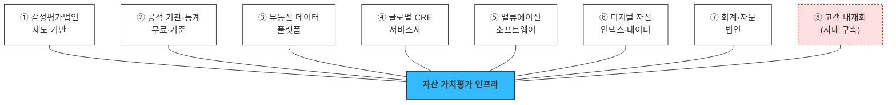

# Porter's Five Forces — 자산 가치평가 인프라

**대상**: [자산 가치평가 인프라](../04_tam-sam-som/02_사례_자산가치평가/) 사업 — **조각투자·토큰증권(STO) 기초자산 평가 포함**
**초점**: 요청에 따라 **③ 구매자 교섭력(고객 유형)** 과 **⑤ 기존 경쟁 강도(경쟁사 유형·밸류체인)** 를 집중적으로 봅니다

> 🔴 **사업 정의가 확장됐습니다 — 이 문서의 결론 하나가 뒤집힙니다.**
> 사업 범위에 **조각투자·토큰증권 기초자산 평가**가 포함되면서 **§7의 ④ 대체재 위협(★★★★★)이 STO 세그먼트에서는 성립하지 않습니다.** 협의체가 *"기초자산의 객관적 가치평가 가능성"* 을 제도 요건으로 명시해 **현상 유지가 금지**되기 때문입니다. → **[§10 신설](#10-sto-축-추가가-이-분석에서-바꾸는-것)**
> 경쟁자 명단의 검증판과 각 사 가치 선언문은 **[09_리서치_경쟁사-가치선언.md](09_리서치_경쟁사-가치선언.md)** 에 있습니다.

> ⚠️ **기업명은 산업 지형을 보이기 위한 예시이며, 사업계획서 사용 전 각 사의 현재 사업 범위·국내 진출 여부를 직접 확인해야 합니다.** 특히 국내 법인 목록은 [한국감정평가사협회](https://www.kapanet.or.kr) 등록 현황 같은 1차 자료로 갱신이 필요합니다.

---

## 1. 산업을 어떻게 정의하는가가 경쟁자를 정한다

[TAM 산정 §5](../04_tam-sam-som/02_사례_자산가치평가/01_TAM-SAM-SOM_산정.md)에서 확인한 것이 여기서도 그대로 적용됩니다. **정의를 바꾸면 경쟁자 명단이 통째로 바뀝니다.**

| 산업 정의 | 경쟁자 | 승부처 |
|---|---|---|
| "감정평가 서비스" | 감정평가법인 66개+ | **법적 자격 — 우리가 못 이김** |
| "부동산 데이터 플랫폼" | 밸류맵 · 디스코 · CoStar | 데이터 커버리지 |
| "가상자산 인덱스" | Kaiko · CF Benchmarks · CoinGecko | 규제 벤치마크 인증 |
| **"조각투자·토큰증권 기초자산 평가"** | **증권사 STO 플랫폼 · 예탁결제원 · 회계법인** | **제도 수용 · 이해상충 회피** |
| **"금융 의사결정용 가치 데이터 인프라"** | **위 넷의 일부 + 고객 내재화** | **재현성 · 전달 경로 · 시스템 결합** |

**우리 정의로는 단일 경쟁자가 없고, 대신 다섯 방향에서 부분적으로 겹칩니다.** 이것이 이 산업의 구조적 특징입니다.

> 🔴 **네 번째 줄(STO)이 이번에 추가된 축입니다.** 그리고 이 축은 다른 셋과 **경쟁의 성질 자체가 다릅니다** — 다른 축은 *"경쟁자를 이겨야"* 하는데, STO 축은 *"제도 요건을 정의하는 과정에 들어가야"* 합니다. 상대가 기업이 아니라 협의체입니다. → §10

## 2. 5 Forces 요약

| Force | 강도 | 한 줄 요약 |
|---|:---:|---|
| **① 신규 진입 위협** | ★★★★☆ | 라이선스 장벽이 없습니다. 막는 것은 데이터와 시간뿐 |
| **② 공급자 교섭력** | ★★★★☆ | **거래소가 공급자이자 고객**입니다 (§6) |
| **③ 구매자 교섭력** | ★★★★★ | **전 세그먼트가 과점 구매자**입니다 (§3) |
| **④ 대체재 위협** | ★★★★★<br/>*(STO 축 **★★☆☆☆**)* | 진짜 대체재는 경쟁 제품이 아니라 **엑셀과 현상 유지**.<br/>단 **STO 축에서는 현상 유지가 제도로 금지**됩니다 (§7·§10) |
| **⑤ 기존 경쟁 강도** | ★★★☆☆ | 직접 경쟁자는 적으나 **인접 유형이 여덟 갈래** (§4) |

**다섯 중 셋이 최고 강도입니다.** 포터의 기준으로 보면 매력적인 산업이 아니며, **수익성은 산업 구조가 아니라 포지셔닝에서 나와야 합니다.**

> ⚠️ **④의 강도가 세그먼트별로 갈립니다 — 이 표의 한계입니다.** 포터의 다섯 힘은 **하나의 산업**을 전제하는데, 우리 정의는 제품 축이 셋(부동산·디지털·STO)입니다. **하나의 별점으로 요약하면 STO 축의 예외가 지워집니다.** §10에서 축별로 다시 채점했습니다.

---

## 3. ③ 구매자 교섭력 — 고객 유형 심화

### 3-1. 지불 목적으로 나눈 네 유형

[페르소나 스펙트럼](../05_페르소나/02_사례_자산가치평가_스펙트럼-종합.md)이 *누가 쓰는가*로 나눴다면, 포터 관점에서는 **무엇 때문에 돈을 내는가**로 나눠야 교섭력이 보입니다.

| 유형 | 지불 목적 | 페르소나 | 특성 |
|---|---|---|---|
| **A. 규제·공시형** | 안 하면 제재를 받음 | 조민경 · 서태영 · 미술품 플랫폼 | **가격 비탄력**, 대신 요구 조건이 까다로움 |
| **B. 심사·투자형** | 판단 오류가 곧 손실 | 이재훈 · 남기훈 | **딜 규모 대비 데이터비가 미미** → 가격 둔감, 속도 민감 |
| **C. 운영·감시형** | 상시 시스템에 결합 | 박선우 · 한지우 | 전환비용 최고 → **한 번 붙으면 락인** |
| **D. 자문·검증형** | 근거를 남에게 인용해야 함 | 백서현 · 조현우 | 계약은 작으나 **확산** |

김도현(AMC)은 A와 C 사이에 걸쳐 있습니다 — 공시 목적이면 A, 내부 운용이면 C입니다. **같은 고객도 용도에 따라 교섭력이 달라집니다.**

### 3-2. 교섭력을 결정하는 네 요인

| 요인 | 우리에게 불리한 이유 |
|---|---|
| **구매자 집중도** | 거래소 18 · 수탁 9 · 회계법인 4대 · NPL 전업 소수 · AMC 66(실질 상위 10~20). **전 세그먼트가 과점**입니다. 한 곳을 놓치면 대체 고객이 없습니다 |
| **전환비용** | 계약 초기에는 **거의 0**입니다. 대시보드·엑셀 단계에서는 언제든 감정평가로 회귀할 수 있습니다 |
| **후방통합 위협** | **이미 일어나고 있습니다.** 남기훈은 사내 경매 DB를 10년 쌓았고, 은행은 자체 감정평가 조직이 있습니다 |
| **가격 민감도** | 유형별로 갈립니다 — B는 둔감, A는 예산 항목만 서면 둔감, D는 민감 |

### 3-3. 페르소나별 교섭력 스코어

★가 많을수록 **고객이 강하고 우리가 불리**합니다.

| 페르소나 | 집중도 | 전환비용<br/>*(낮을수록 불리)* | 후방통합 | 가격민감 | **종합** | 대응 |
|---|:---:|:---:|:---:|:---:|:---:|---|
| **박선우** (거래소) | ★★★★★<br/>18개사 | ★☆☆☆☆<br/>결합 후 최고 | ★★★☆☆ | ★★☆☆☆ | **★★★☆☆** | 초기 협상은 불리, **연동 후 역전** |
| **김도현** (AMC) | ★★★☆☆<br/>상위 10~20 | ★★★★☆<br/>낮음 | ★★☆☆☆ | ★★★☆☆ | **★★★★☆** | 자산 마스터 매핑으로 전환비용 생성 |
| **조민경** (은행) | ★★★★☆ | ★★★☆☆ | ★★★★★<br/>자체 감평 조직 | ★★☆☆☆ | **★★★★☆** | 방법론·감사 대응으로 묶기 |
| **남기훈** (NPL) | ★★★★★<br/>전업 소수 | ★★★★☆ | ★★★★★<br/>**이미 내재화** | ★☆☆☆☆ | **★★★★★** | 대체 아닌 **교차검증**으로 진입 |
| **백서현** (회계법인) | ★★★★★<br/>4대 과점 | ★★★☆☆ | ★★★☆☆ | ★★★★☆ | **★★★★☆** | QRM 등록으로 표준화 |
| **문경아** (특수자산) | ★★☆☆☆ | ★★★★☆ | ★☆☆☆☆ | ★★★☆☆ | **★★★☆☆** | 대안이 없어 상대적으로 약함 |

> 💡 **남기훈이 가장 강한 고객입니다.** 소수·내재화 완료·가격 둔감의 조합인데, 마지막 하나(가격 둔감)만 우리에게 유리합니다. [DOS에서 NG-1이 유일한 음수(과잉충족)로 나온 것](../06_시장기회분석/03_사례_dos-scoring.md)이 포터 관점에서 재확인됩니다 — **후방통합이 이미 끝난 고객**입니다.

### 3-4. 교섭력을 낮추는 방법은 셋뿐

| 방법 | 구체적으로 | 어느 페르소나에 |
|---|---|---|
| **전환비용 만들기** | 자산 마스터 매핑, 산출 이력 누적, 시스템 결합 | 김도현 · 박선우 |
| **구매자 수 늘리기** | 세그먼트 확장(NPL·회계법인·미술품) | 전체 |
| **비교 불가능하게 만들기** | 방법론 공개 + as-of 재현 — **다른 제품과 비교 축이 달라짐** | 조민경 · 백서현 |

---

## 4. ⑤ 기존 경쟁 강도 — 경쟁사 유형과 명단

### 4-1. 일곱 갈래 유형



### 4-2. 유형별 명단

#### ① 감정평가법인 — 제도 기반 경쟁자

| 구분 | 사업자 |
|---|---|
| 국내 대형 법인 | 가온 · 대화 · 나라 · 태평양 · 제일 · 중앙 · 미래새한 · 하나 감정평가법인 등 |
| 협회·제도 | 한국감정평가사협회 |
| 글로벌 | Kroll(구 Duff & Phelps) · Houlihan Lokey · Alvarez & Marsal |

**강점**: 법적 효력, 책임 귀속, 감사·감독 수용 이력
**약점**: 연 1~2회 주기, 건별 단가, PDF 산출물(시스템 적재 불가), 법인·평가사 간 기준 불일치

#### ② 공적 기관·통계 — "무료 경쟁자"

| 사업자 | 제공 |
|---|---|
| **한국부동산원** | 공시가격, 부동산 통계, 지수 |
| 국토교통부 실거래가 공개시스템 | 실거래가 원천 데이터 |
| 법원 경매정보 | 경매 낙찰가 |
| 한국리츠협회 | 리츠 AUM·운용 현황 |

**가장 과소평가되는 경쟁자입니다.** 무료이고 공신력이 높습니다. 고객이 "그냥 공공데이터 쓰면 안 되나"라고 물을 때 답이 없으면 계약이 안 됩니다. **우리의 답은 "원천 데이터 ≠ 평가값"** 이어야 합니다.

#### ③ 부동산 데이터 플랫폼

| 구분 | 사업자 |
|---|---|
| 국내 상업용 | 밸류맵 · 디스코 · 부동산플래닛 · 알스퀘어 · 젠스타메이트 |
| 국내 AI 시세 | **빅밸류** · 랜드북(스페이스워크) · 리치고 |
| 국내 경매 | 지지옥션 · 굿옥션 · 탱크옥션 · 두인경매 |
| 해외 | CoStar · Yardi Matrix · Green Street · Trepp · Moody's Analytics CRE |
| 해외 주거 AVM | CoreLogic · HouseCanary · Clear Capital · Zillow(Zestimate) |

> **빅밸류는 특별히 봐야 합니다.** 빌라·연립 AI 시세를 금융권 담보 목적으로 제공하며 **규제 샌드박스를 거친 사례**로 알려져 있습니다. 우리가 §10에서 논한 "공신력 조달" 경로를 **먼저 지나간 사업자**이므로, 그 과정과 제약을 조사하는 것이 가장 빠른 학습입니다.

#### ④ 글로벌 CRE 서비스사

| 사업자 | 관련 사업부 |
|---|---|
| CBRE · JLL · Cushman & Wakefield · Colliers · Savills | Valuation & Advisory |
| MSCI Real Assets (구 RCA·IPD) | 지수·벤치마크 |

**밸류체인 전 구간을 보유한 유일한 유형**입니다. 국내에서는 커버리지와 인력이 제한적이지만, **자산운용사·리츠가 이미 이들의 리포트를 봅니다.**

#### ⑤ 밸류에이션 소프트웨어

| 사업자 | 성격 |
|---|---|
| **Altus Group (ARGUS Enterprise)** | CRE DCF 표준 도구 |
| Yardi · MRI Software | 자산관리 + 밸류에이션 모듈 |

**경쟁이자 보완재입니다.** 이들은 모델 도구를 팔고 **데이터는 고객이 넣습니다.** 우리가 그 입력이 될 수도 있고, 그들이 데이터로 확장하면 정면 경쟁이 됩니다.

#### ⑥ 디지털 자산 인덱스·데이터 (박선우 축)

| 구분 | 사업자 |
|---|---|
| **규제 벤치마크 관리자** | **CF Benchmarks** · Compass Financial Technologies · Vinter |
| 기관용 시장데이터 | **Kaiko** · Amberdata · Coin Metrics |
| 지수 사업자 | MarketVector(MVIS) · CoinDesk Indices · S&P DJI · FTSE Russell · Bloomberg |
| 대중형 데이터 | CoinMarketCap · CoinGecko |
| 온체인 분석 | Glassnode · Nansen · Dune |
| 컴플라이언스(인접) | Chainalysis · Elliptic |
| 국내 | **UBCI**(업비트) · **쟁글(Xangle)** |

> **여기가 유일하게 "진짜 제품"과 겨루는 전선입니다.** 다른 축의 대체 솔루션은 엑셀·전화·감정평가서인데, 이 축만 **완성된 상용 제품**이 존재합니다. [여정지도 S2](../05_페르소나/03_사례_고객여정지도.md)에서 박선우의 이탈 사유가 "해외 것도 있는데 굳이"였던 이유입니다.

#### ⑦ 회계·자문 법인 (백서현 축)

| 구분 | 사업자 |
|---|---|
| 국내 4대 | 삼일PwC · 삼정KPMG · 안진딜로이트 · 한영EY |
| 글로벌 밸류에이션 | Kroll · Houlihan Lokey |

**고객이자 경쟁자입니다.** 자문 보고서에 우리 데이터를 인용하면 채널이지만, 이들이 자체 밸류에이션 데이터 상품을 만들면 경쟁자가 됩니다.

#### ⑧ 고객 내재화 — 가장 강한 "경쟁자"

| 사례 | 내용 |
|---|---|
| **남기훈 (NPL)** | 10년 축적 경매 DB + 자체 회수 모델 |
| **조민경 (은행)** | 자체 감정평가 조직 |
| **박선우 (거래소)** | 자사 체결가 기반 내부 지수(UBCI 등) |
| **김도현 (AMC)** | 엑셀 롤포워드 |

**경쟁사 리스트에 반드시 넣어야 하는 항목입니다.** [Pain List에서 확인한 대로 대체 솔루션 18개 중 경쟁 제품은 극소수](../06_시장기회분석/01_사례_pain-list.md)였고, 대부분이 사내 자산이었습니다.

#### ⑨ STO 제도 인프라 — 이번에 추가된 유형

| 구분 | 사업자 | 성격 |
|---|---|---|
| **증권사 STO 진영** | 미래에셋 *(코빗 인수)* · 한국투자 · NH · KB · 신한 · 하나 · IBK | **최대 고객이자 잠재 경쟁자** — 평가를 내부화하면 즉시 경쟁 |
| **제도 인프라** | **한국예탁결제원** *(발행인계좌관리기관 체계)* · 토큰증권 협의체 | 경쟁자가 아니라 **"인증 칸의 소유자"** |
| *(소멸)* 1세대 부동산 조각투자 | 카사코리아 · 펀블 · 에이판다 | **투자중개업 인가 미취득으로 철수** |

**이 유형은 다른 여덟과 성질이 다릅니다.** ①~⑧은 시장에서 겨루는 상대인데, ⑨는 **무엇이 적법한 평가인지를 정의하는 쪽**입니다. 경쟁 전략이 아니라 **요건 정의 참여**가 대응 수단입니다.

> 💡 **1세대 조각투자의 소멸이 우리에게 주는 함의**: 제도 밖에서 시장을 만든 사업자가 제도권 진입에서 탈락했습니다. **우리는 투자중개업 인가가 필요 없는 데이터 공급자 포지션**이라 같은 함정에 빠지지 않습니다 — 인가받은 증권사에 **데이터를 파는 쪽**이 이 구조에서 살아남는 자리입니다. 상세 검증은 [09 §5](09_리서치_경쟁사-가치선언.md).

### 4-3. 밸류체인 점유 지도 — 각 유형은 어디를 갖고 있나

```
원천 수집 → 정제·정규화 → 평가 모델 → 산출물(값+근거) → 전달 → 인증·수용 → 활용
```

| 유형 | 수집 | 정제 | 모델 | 산출물 | 전달 | **인증** | 활용 |
|---|:---:|:---:|:---:|:---:|:---:|:---:|:---:|
| ① 감정평가법인 | ○ | △ | ● | ● | ✕ | **●** | ○ |
| ② 공적 기관 | ● | ○ | ✕ | △ | ○ | **●** | ✕ |
| ③ 데이터 플랫폼 | ● | ● | △ | ○ | ● | ✕ | ✕ |
| ④ 글로벌 CRE | ● | ● | ● | ● | ○ | **○** | ● |
| ⑤ 소프트웨어 | ✕ | ✕ | ● | ○ | ● | ✕ | ● |
| ⑥ 디지털 인덱스 | ● | ● | ● | ● | ● | **○** | ○ |
| ⑦ 회계법인 | ✕ | ✕ | ○ | ○ | ✕ | **●** | ● |
| **우리** | ○ | ● | ● | ● | ● | **✕** | ○ |

*● 강함 · ○ 보통 · △ 약함 · ✕ 없음*

> 🔴 **우리 줄에서 유일한 `✕`가 "인증"입니다.** 이것이 [07 검토 §10의 공신력 논의](../05_페르소나/07_검토_감정평가법인-경쟁력.md)를 밸류체인 언어로 옮긴 것입니다. **격차가 모델이나 데이터가 아니라 밸류체인의 특정 칸에 있다**는 것이 확인되면, 그 칸을 자체 구축할지(불가) 조달할지(QRM·보험) 빌릴지(하이브리드) 선택으로 좁혀집니다.
>
> 반대로 **디지털 자산 인덱스(⑥)는 우리와 점유 구간이 거의 같습니다.** 그래서 박선우 축이 유일한 정면 경쟁 전선입니다.

### 4-4. 유형별 솔루션 형태 비교

| 유형 | 산출물 형태 | 주기 | 과금 | 시스템 결합 | 근거 공개 |
|---|---|---|---|---|---|
| ① 감정평가법인 | PDF 평가서 | 건별·연 1~2회 | 건당 수수료 | ✕ | 부분 |
| ② 공적 기관 | 통계표·API | 월·분기 | 무료 | △ | 전면 |
| ③ 데이터 플랫폼 | 웹 조회·리포트 | 실시간~월 | 구독 | △ | 부분 |
| ④ 글로벌 CRE | 리포트 + 자문 | 분기·반기 | 리테이너 | ✕ | 부분 |
| ⑤ 소프트웨어 | 모델 도구 | (고객이 실행) | 라이선스 | ● | 해당없음 |
| ⑥ 디지털 인덱스 | 실시간 피드·API | 초~일 | 구독·데이터 라이선스 | ● | 방법론 공개 |
| ⑦ 회계법인 | 의견서 | 딜·감사 단위 | 용역비 | ✕ | 부분 |
| **우리** | **값 + 근거 + as-of** | **일·월·분기** | **구독 + 종량** | **●** | **전면** |

**우리 행에서 다른 어느 행과도 겹치지 않는 칸은 "근거 전면 공개"와 "as-of 재현"입니다.** 나머지는 전부 누군가 이미 하고 있습니다. **차별화를 이 두 칸에 걸어야 한다는 결론이 표에서 그대로 나옵니다** — [Pain List 최상위 클러스터](../06_시장기회분석/01_사례_pain-list.md)와 정확히 같은 두 가지입니다.

---

## 5. ① 신규 진입 위협 — ★★★★☆

| 진입장벽 | 높이 | 비고 |
|---|:---:|---|
| 라이선스·규제 | **없음** | 데이터 제공은 인허가 대상이 아닙니다 |
| 초기 자본 | 낮음 | 데이터 구매 + 엔지니어 |
| **데이터 접근** | **중간~높음** | 실거래·경매는 공개, **감정평가 이력·거래소 원장은 폐쇄** |
| 기술 | 중간 | 모델 자체보다 파이프라인 운영이 어려움 |
| **수용 이력** | **높음** | 신규 진입자가 가장 오래 걸리는 관문 |
| 시스템 결합 | 높음 | 이미 붙은 고객은 잘 안 바꿉니다 |

**법이 우리를 막는 영역(법정 평가)은 반대로 대형 사업자가 데이터 사업으로 나오는 것도 막지 않습니다.** 가장 위협적인 진입자는 스타트업이 아니라 **이미 데이터와 고객을 가진 ③·④·⑦ 유형**입니다.

## 6. ② 공급자 교섭력 — ★★★★☆

| 공급자 | 제공 | 교섭력 | 비고 |
|---|---|:---:|---|
| **거래소** | 체결·호가 원장 | ★★★★★ | **공급자이자 고객** |
| 국토부·부동산원 | 실거래·공시 | ★★☆☆☆ | 공개 데이터, 단 형식·지연은 통제 밖 |
| 경매 데이터 사업자 | 낙찰가·권리관계 | ★★★★☆ | 지지옥션 등 소수 과점 |
| 감정평가법인 | 평가 이력 | ★★★★★ | **경쟁자가 공급자** |
| 클라우드·인프라 | 연산 | ★★☆☆☆ | 대체 가능 |

> 🔴 **이 산업의 가장 위험한 구조는 거래소의 이중 지위입니다.** 박선우는 우리의 최대 고객(SAM 비중 0.245)이면서 동시에 **원천 데이터 공급자**입니다. 데이터 제공을 끊거나 조건을 바꾸면 제품이 성립하지 않는데, 그 상대에게 물건을 팔아야 합니다. **가격 협상에서 우리 카드가 구조적으로 약합니다.**
>
> 완화책은 **다수 거래소 계약**입니다. 한 곳에 의존하지 않으면 공급자 교섭력이 분산되고, 동시에 "여러 거래소를 가로질러 본다"는 제품 가치도 강해집니다. **공급 리스크 대응과 제품 차별화가 같은 방향입니다.**

## 7. ④ 대체재 위협 — ★★★★★

| 대체재 | 위협 | 근거 |
|---|:---:|---|
| **엑셀 · 수기 · 전화** | ★★★★★ | [대체 솔루션 조사에서 압도적 다수](../06_시장기회분석/01_사례_pain-list.md) |
| **감정평가서** | ★★★★☆ | 법적 효력 + **품의 통과가 쉬움** |
| 사내 자체 구축 | ★★★★☆ | 남기훈·조민경은 이미 보유 |
| 공공데이터 직접 활용 | ★★★☆☆ | 무료 |
| 아무것도 안 함 | ★★★★★ | **가장 흔한 선택** |

**진짜 경쟁자는 현상 유지입니다.** [여정지도 S2의 이탈 사유가 "감정평가 추가 발주가 더 설명하기 쉬워서 회귀"](../05_페르소나/03_사례_고객여정지도.md)였던 것이 이 Force의 실제 모습입니다.

### 7-1. 🔴 그런데 STO 축에서는 이 Force가 성립하지 않습니다

**대체재를 축별로 다시 채점하면 표가 갈립니다.**

| 대체재 | 부동산 축 | 디지털 축 | **STO 축** | STO에서 막히는 이유 |
|---|:---:|:---:|:---:|---|
| **엑셀 · 수기 · 발행자 자체 산정** | ★★★★★ | ★★★☆☆ | **✕ 불가** | **이해상충** — 발행자가 자기 상품의 기초가치를 매길 수 없음 |
| **감정평가서 건별 발주** | ★★★★☆ | — | **★★☆☆☆** | 비용 — 업계가 *"외부 가치평가 비용을 어떻게 낮출 것인가"* 를 과제로 명시 |
| 사내 자체 구축 | ★★★★☆ | ★★★★☆ | **✕ 불가** | 동일한 이해상충 |
| 공공데이터 직접 활용 | ★★★☆☆ | ★★☆☆☆ | ★☆☆☆☆ | 기초자산이 국유재산·IP·미술품으로 확장돼 공적 시세가 없음 |
| **아무것도 안 함** | ★★★★★ | ★★★☆☆ | **✕ 불가** | **공시 요건 미충족** — 협의체가 객관적 가치평가 가능성을 요건으로 명시 |
| **종합** | **★★★★★** | **★★★☆☆** | **★★☆☆☆** | |

> 🔴 **이것이 이 문서에서 가장 중요한 정정입니다.** [사업성 판정 §1](08_검토_사업성-판정.md)이 다섯 힘 중 *"넷은 포지셔닝으로 넘어가고 대체재 하나만 안 넘어간다 — 그 하나가 사활"* 이라고 결론했는데, **그 하나가 무력화되는 세그먼트가 존재합니다.**
>
> 넘는 방법이 포지셔닝이 아니라 **제도**입니다. 우리가 대체재를 이긴 것이 아니라 **규제가 대체재를 금지**했습니다. → [사업성 판정 §7 갱신](08_검토_사업성-판정.md)

---

## 8. 종합 — 구조는 나쁘고, 빈칸은 하나다

**포터 기준으로 이 산업은 매력적이지 않습니다.** 구매자·대체재가 최고 강도이고, 진입장벽은 라이선스가 아니라 시간뿐이며, 최대 고객이 최대 공급자입니다.

그럼에도 포지션이 성립하는 근거는 밸류체인 지도에서 나옵니다.

| 관찰 | 함의 |
|---|---|
| 우리 밸류체인의 유일한 빈칸이 **인증** | 격차가 한 칸에 특정됨 → 조달·차용으로 좁힐 수 있음 |
| **정제~전달 4개 구간을 동시에 가진 유형이 ⑥뿐** | 부동산 축에는 통합 사업자가 없음 |
| 어느 유형도 **근거 전면 공개 + as-of 재현**을 안 함 | 차별화 축이 비어 있음 |
| 구매자가 전부 과점 | **소수 고객에 깊게** 들어가는 전략이 필연 |

### 전략적 시사

1. **감정평가와 싸우지 않는다** — 인증 칸은 조달하거나 빌립니다
2. **거래소는 다수 계약으로 간다** — 공급 리스크와 제품 가치가 같은 방향
3. **차별화는 두 칸에만 건다** — 근거 공개, as-of 재현
4. **전환비용을 의도적으로 만든다** — 자산 마스터 매핑, 산출 이력 누적

## 9. 확인이 필요한 것

| 확인 대상 | 왜 필요한가 |
|---|---|
| **빅밸류의 샌드박스 조건과 제약** | 공신력 조달 경로를 먼저 지나간 사례 |
| 국내 감정평가법인의 데이터 사업 진출 여부 | 가장 위협적인 진입자 |
| 거래소의 원장 데이터 제공 정책·단가 | 공급자 리스크의 실제 크기 |
| Kaiko·CF Benchmarks의 국내 계약 유무 | 박선우 축의 경쟁 강도 |
| 4대 회계법인의 자체 밸류에이션 데이터 상품 | 고객이 경쟁자로 바뀌는 시점 |
| CBRE·JLL 국내 법인의 밸류에이션 커버리지 | ④ 유형의 실제 위협 수준 |

> ⚠️ **이 분석의 기업명은 산업 지형 파악용 예시입니다.** 각 사의 현재 사업 범위·국내 진출 여부·상품 구성은 확인하지 않았으며, **경쟁 분석 문서로 사용하기 전 각 사 공식 자료로 검증해야 합니다.** 특히 유형 ③·⑥은 사업자 변동이 잦습니다.
>
> ✅ **그 검증을 수행했습니다 → [09_리서치_경쟁사-가치선언.md](09_리서치_경쟁사-가치선언.md)** — 5축 11사, 출처 링크 72개(53개 도메인).

---

## 10. STO 축 추가가 이 분석에서 바꾸는 것

**사업 정의에 조각투자·토큰증권이 들어오면서 §1~§9의 결론 셋이 수정됩니다.**

### 10-1. 제도 타임라인 — 이 축에만 시한이 있습니다

| 시점 | 사건 | 우리에게 |
|---|---|---|
| 2026.1.15 | 전자증권법·자본시장법 개정안 **국회 통과** | — |
| 2026.2.3 | **공포** | — |
| **2026.2 ~ 2027.2** | **토큰증권 협의체 운영 — 요건 정의 구간** | ⭐ **약 18개월의 유일한 창** |
| 2027.2.4 | **개정 전자증권법 시행** | 요건 확정 — 충족하거나 못 하거나 |

**협의체가 명시한 요건**: *"기초자산의 객관적 가치평가 가능성, 리스크 관리·공시"*
**업계가 명시한 과제**: *"외부 가치평가 비용을 어떻게 낮출 것인지"*

> 🔴 **우리 제품의 필요성이 제도 문서에 기록됐습니다.** 다른 축에서는 고객을 설득해야 하는데, 이 축에서는 **제도가 수요를 만들었고 비용 문제까지 업계가 스스로 제기**했습니다.

### 10-2. 수정되는 결론 셋

| # | 기존 결론 | **수정** |
|:---:|---|---|
| **1** | [§7] ④ 대체재 위협 **★★★★★ — 진짜 경쟁자는 현상 유지** | **STO 축에서는 ★★☆☆☆.** 현상 유지(발행자 자체 산정·무대응)가 **제도로 금지** → §7-1 |
| **2** | [§4-1] 인접 경쟁자 **일곱 갈래** *(+ 고객 내재화)* | **여덟 갈래 + ⑨ STO 제도 인프라.** ⑨는 겨루는 상대가 아니라 **요건 제정자** |
| **3** | [§8] *"수익성은 산업 구조가 아니라 포지셔닝에서 나와야 한다"* | **STO 축에서는 포지셔닝이 아니라 제도 참여에서 나옵니다.** 상대가 기업이 아니라 협의체 |

### 10-3. 다섯 힘을 축별로 다시 채점하면

| Force | 부동산 축 | 디지털 축 | **STO 축** | 차이의 이유 |
|---|:---:|:---:|:---:|---|
| ① 신규 진입 | ★★★★☆ | ★★★★☆ | **★★★☆☆** | 제도 요건이 진입장벽으로 작동 |
| ② 공급자 | ★★★☆☆ | ★★★★★ | **★★★☆☆** | 기초자산이 다양해 단일 공급자 의존이 낮음 |
| ③ 구매자 | ★★★★★ | ★★★★★ | **★★★★★** | 증권사 소수 과점 — 동일 |
| **④ 대체재** | **★★★★★** | ★★★☆☆ | **★★☆☆☆** | 🔴 **제도가 대체재를 금지** |
| ⑤ 기존 경쟁 | ★★★☆☆ | ★★★★☆ | **★★☆☆☆** | 1세대 조각투자 소멸, 아직 사업자 부재 |

> 🔴 **STO 축이 세 축 중 구조적으로 가장 유리합니다.** 다섯 힘 중 최고 강도가 하나(③ 구매자)뿐입니다. 부동산 축은 셋, 디지털 축은 둘입니다.
>
> ⚠️ **다만 이것이 "STO부터 가라"를 뜻하지 않습니다.** 구조가 유리한 것과 지금 매출이 나는 것은 다릅니다 — **STO 축의 SAM은 아직 산정되지 않았고**([04 챕터 §7 참조](../04_tam-sam-som/02_사례_자산가치평가/01_TAM-SAM-SOM_산정.md)), 요건이 확정되지 않아 제품 사양도 미정입니다. **지금 할 일은 판매가 아니라 요건 정의 참여**입니다.

### 10-4. 이 정정에서 배울 점

**① 포터의 다섯 힘은 "하나의 산업"을 전제합니다.**
우리 정의는 제품 축이 셋인데 하나의 별점표로 요약했습니다. **④가 축별로 ★★★★★ / ★★★☆☆ / ★★☆☆☆로 갈리는데, 통합 표는 최악값(★★★★★)만 보여줍니다.** 세그먼트가 여럿이면 힘을 세그먼트별로 채점해야 합니다.

**② 넘을 수 없는 힘도 제도가 바뀌면 넘어갑니다.**
[사업성 판정](08_검토_사업성-판정.md)이 대체재를 *"포지셔닝으로 넘어가지 않는다"* 고 판정한 것은 그 시점에 정확했습니다. **틀린 것은 판정이 아니라 "그 판정이 영구적이다"라는 암묵 가정**입니다. 규제 산업에서는 **제도 변화가 Force의 강도를 바꿉니다.**

**③ 사업 정의를 바꿨을 때 상위 문서를 갱신하지 않으면 모순이 남습니다.**
이 문서는 사업 정의가 확장된 뒤에도 **한동안 옛 정의로 남아 있었습니다.** §1이 *"정의를 바꾸면 경쟁자 명단이 통째로 바뀐다"* 고 적어놓고 정작 자기 명단을 안 바꿨습니다. **정의 변경은 하위 문서보다 상위 문서에 먼저 반영해야 합니다.**
