# 경쟁사 리서치와 가치 선언문 도출 — 자산 가치평가 인프라 (조각투자·토큰증권 포함)

**대상 사업**: 상업용 부동산 · 디지털 자산 · **조각투자/토큰증권 기초자산**의 시장가치를 지속 산출해 API·데이터 피드로 금융기관 시스템에 공급하는 [Institutional Valuation Infrastructure](../04_tam-sam-som/02_사례_자산가치평가/01_TAM-SAM-SOM_산정.md)

**이 문서가 하는 일**: [Porter 분석 §4의 경쟁자 유형 명단](07_분석_자산가치평가-인프라.md)은 "산업 지형 파악용 예시"라고 스스로 단서를 달았습니다. 그 명단을 **실제 공개 자료로 검증하고, 각 사의 가치 선언문까지 도출**하는 것이 이 문서의 범위입니다.

> ⚠️ **검증 원칙**: 아래 모든 수치는 공개 출처에서 확인한 값이며 각 행에 링크를 달았습니다. 다만 **① 회계 기간·통화·집계 기준이 사마다 다르고 ② 일부는 2차 보도자료** 입니다. §8의 한계 표를 반드시 함께 읽으십시오.

---

## 1. 산업 정의가 바뀌면 경쟁자 명단도 바뀐다 — 이번에는 STO 축이 추가됐다

[Porter 분석 §1](07_분석_자산가치평가-인프라.md)이 "정의를 바꾸면 경쟁자 명단이 통째로 바뀐다"고 했습니다. **조각투자·토큰증권을 사업 범위에 넣으면 그 명제가 실제로 발동합니다.**

| 사업 정의 | 경쟁자가 되는 집단 | 승부처 |
|---|---|---|
| "감정평가 서비스" | 감정평가법인 · 한국부동산원 | **법적 자격 — 우리가 못 이김** |
| "부동산 데이터 플랫폼" | 밸류맵 · 디스코 · CoStar | 데이터 커버리지 |
| "가상자산 인덱스" | CF Benchmarks · Kaiko · 쟁글 | 규제 벤치마크 등록 |
| **"조각투자·토큰증권 기초자산 평가"** | **증권사 STO 플랫폼 · 예탁결제원 · 회계법인** | **제도 수용 · 이해상충 회피** |
| **"금융 의사결정용 가치 데이터 인프라"** | **위 넷의 일부 + 고객 내재화** | **재현성 · 전달 경로 · 시스템 결합** |

### STO 축이 만든 결정적 변화 — 제도가 "객관적 가치평가"를 요구하기 시작했다

2026년 상반기에 국내 토큰증권 제도가 확정됐습니다. 이 사업에 직결되는 지점은 셋입니다.

| 사건 | 내용 | 우리 사업에 대한 의미 |
|---|---|---|
| **법제화 완료** | 전자증권법·자본시장법 개정안 **2026.1.15 국회 본회의 통과 → 2026.2.3 공포**. 개정 전자증권법은 **2027.2.4 시행** | 분산원장이 전자등록계좌부로 인정되고 **발행인계좌관리기관** 제도가 신설 |
| **협의체의 요구사항** | 금융위·금감원·예탁결제원·금투협·학계로 구성된 토큰증권 협의체가 **"기초자산의 객관적 가치평가 가능성, 리스크 관리·공시"** 를 전제 조건으로 제시 | **제도가 제3자 가치평가를 요구합니다.** 서태영(STO·RWA 기획자) 페르소나의 *"발행자가 직접 말하면 이해상충"* 이 규범으로 확정 |
| **비용 문제의 공식화** | 인수업자 중심 구조의 비용 부담이 지적되며 **"외부 가치평가 비용을 어떻게 낮출 것인지"** 가 업계 과제로 명시 | **우리 사업의 진입 명분이 제도 논의 안에서 만들어졌습니다** |

> 💡 **이것이 이번 리서치의 가장 중요한 발견입니다.** [Porter 분석 §7](07_분석_자산가치평가-인프라.md)은 "진짜 경쟁자는 현상 유지"라고 결론했는데, **STO 축에서는 현상 유지가 제도적으로 금지됩니다.** 발행자 자체 산정이 이해상충으로 막히고, 감정평가 건별 발주는 비용으로 막힙니다. **대체재가 양쪽에서 잘리는 유일한 세그먼트**입니다.

시장 전망은 **2024년 국내 토큰증권 시가총액 34조 원(GDP 1.5%) → 2030년 367조 원(GDP 14.5%), 연평균 약 49% 성장** 으로 추정됩니다(PwC). 정부가 검토 중인 국유재산 기초자산 규모만 **1,400조 원**을 넘습니다.

---

## 2. 경쟁 지형 — 다섯 갈래, 열 개 사업자

```mermaid
graph TB
    C["<b>자산 가치평가 인프라</b><br/>(우리)"]:::us

    subgraph A["① 제도·공적 기준 — 인증 보유"]
        A1["한국부동산원"]:::inst
        A2["대형 감정평가법인군<br/>삼창·경일·미래새한·대화·하나·제일"]:::inst
    end
    subgraph B["② 국내 데이터·AI 시세 — 가장 근접"]
        B1["빅밸류"]:::data
        B2["밸류맵 / 디스코"]:::data
    end
    subgraph D["③ 글로벌 인프라 — 밸류체인 전 구간"]
        D1["CoStar Group"]:::glob
        D2["Altus Group<br/>(ARGUS Intelligence)"]:::glob
    end
    subgraph E["④ 디지털자산 벤치마크 — 유일한 정면 전선"]
        E1["CF Benchmarks"]:::dig
        E2["Kaiko"]:::dig
        E3["크로스앵글 (쟁글)"]:::dig
    end
    subgraph F["⑤ STO 제도 인프라 — 신규 추가 축"]
        F1["증권사 STO 진영<br/>미래에셋·한국투자 등"]:::sto
        F2["한국예탁결제원<br/>(발행인계좌관리기관 체계)"]:::sto
    end

    A1 --- C
    A2 --- C
    B1 --- C
    B2 --- C
    D1 --- C
    D2 --- C
    E1 --- C
    E2 --- C
    E3 --- C
    F1 --- C
    F2 --- C

    X["⑥ 고객 내재화<br/>남기훈 사내 DB · 조민경 자체 감평<br/>박선우 자사 지수"]:::x
    X -.->|"가장 강한 경쟁자"| C

    classDef us fill:#33BBFF,stroke:#333,stroke-width:3px;
    classDef inst fill:#FFE8CC,stroke:#333;
    classDef data fill:#E8F5E9,stroke:#333;
    classDef glob fill:#F3E5F5,stroke:#333;
    classDef dig fill:#E1F5FE,stroke:#333;
    classDef sto fill:#FFF9C4,stroke:#333;
    classDef x fill:#FFE0E0,stroke:#C00,stroke-dasharray:3 3;
```

---

## 3. 경쟁사 브리핑 표 — 규모 · 핵심 비즈니스 모델 · 사업 전략

> 각 행 마지막 열에 **그 회사 분석의 근거가 된 출처 전부**를 링크로 달았습니다.

### 3-1. ① 제도·공적 기준 축

| 사업자 | 비즈니스 규모 | 핵심 비즈니스 모델 | 사업 전략의 특징 | 출처 |
|---|---|---|---|---|
| **한국부동산원** *(REB, 국토교통부 산하)* | 부동산 가격공시·국가통계 작성 전담 기관. 통계 전용 포털 **R-ONE을 2013.1부터 운영** | **비영리 공적 기관** — 공시가격 조사·산정과 국가승인통계 생산. **이용자에게 무료** | 2025년 새 비전으로 **"부동산 정책인프라기관"** 을 제시. 가격공시·통계 기관에서 **정부 정책을 뒷받침하는 데이터 기반 기관으로 전환**을 선언 | [기관 홈페이지](https://www.reb.or.kr/reb/main.do) · [R-ONE 통계시스템](https://www.reb.or.kr/r-one/) · [통계조회](https://www.reb.or.kr/r-one/portal/stat/easyStatPage.do) · [비전 전환 보도](https://www.fetv.co.kr/news/articleView.html?idxno=306804) · [주택가격동향조사](https://www.reb.or.kr/reb/cm/cntnts/cntntsView.do?mi=10333&cntntsId=1033&statId=S234820263) |
| **대형 감정평가법인군** *(삼창·경일·미래새한·대화·하나·제일 등)* | **업계 전체 매출 1조 1,629억 원**(2023, 국세청 부가세 과세표준) · **13개 대형법인 합계 9,218억 원**(2024, 전체의 75%+) · 법인별: 삼창 797억 · 경일 786억 · 미래새한 783억 · 대화 763억 · 하나 755억 · 제일 739억 | **건별 수수료 용역업**. 보수는 **국토교통부 공고 제2025-334호** 기준에 따라 산정 | **법적 독점 자격이 곧 전략**입니다. 가격 경쟁이 아니라 제도가 정한 보수 기준 안에서 수임 경쟁. 산출물은 PDF 평가서로 **시스템 적재가 불가**하고 주기는 연 1~2회 | [한국감정평가사협회](https://www.kapanet.or.kr/) · [업무 소개](https://www.kapanet.or.kr/about/business_introduction.asp) · [2024 매출 순위 보도](https://news.nate.com/view/20250425n01142) · [업계 1위 발표](https://haac.co.kr/revenue-leader-2025/) · [수수료 기준](https://haac.co.kr/appraisal-fee/) · [수수료 계산](https://kosal.co.kr/request/commission/) |

### 3-2. ② 국내 데이터·AI 시세 축 — 우리와 가장 근접

| 사업자 | 비즈니스 규모 | 핵심 비즈니스 모델 | 사업 전략의 특징 | 출처 |
|---|---|---|---|---|
| **빅밸류** *(BigValue)* | 투자자에 **삼성벤처투자 · KB인베스트먼트 · KDB산업은행 · 신한은행 · 하나은행 · 신한DS · 인라이트벤처스** 참여. 2025.1 AI 부동산 시세·상권분석 플랫폼 출시 | **B2B 데이터 구독 + 금융기관 업무 위탁**. AI 시세를 **시중은행 담보대출 심사 기준으로 공급** | **규제 조달을 정면으로 통과한 유일한 국내 사례.** 금융위 **지정대리인**으로 지정돼 금융기관 업무의 일부를 위탁 수행. 다만 규제 샌드박스 선정 직후 **감정평가업계로부터 고발**당한 이력이 있어, 이 경로의 비용이 무엇인지 보여주는 사례 | [공식 홈페이지](https://bigvalue.ai/) · [AI 플랫폼 출시 보도](https://zdnet.co.kr/view/?no=20250124091633) · [샌드박스·고발 인터뷰](https://www.hankookilbo.com/News/Read/A2020071310360000727) · [중개사 데이터 개방](https://www.aitimes.kr/news/articleView.html?idxno=37988) · [프롭테크 분석](https://www.fntimes.com/html/view.php?ud=2020062915320993095e6e69892f_18) |
| **밸류맵 / 디스코** | 밸류맵: 전국 토지·건물·주택·빌딩·상가·공장 실거래가와 매물 제공. 디스코: **실거래가 데이터 3,000만 건**으로 국내 최대 규모 주장 | **프리미엄 구독 + 중개 연계**. 밸류맵은 여기에 **자산관리·건축설계·사업성검토** 를 붙여 컨설팅으로 확장 | **밸류맵 대표는 감정평가사 출신**으로, 부동산 정보의 비대칭·파편화를 창업 동기로 명시했습니다. **데이터 정제 기술을 특허로 방어**하고 있고, 디스코를 상대로 특허침해금지·손해배상 소송을 제기 — **국내 데이터 플랫폼 경쟁이 IP 분쟁 국면에 들어섰다는 신호** | [밸류맵](https://www.valueupmap.com/) · [디스코](https://www.disco.re/) · [기업정보(THE VC)](https://thevc.kr/valuemap) · [특허 소송 보도](https://www.econovill.com/news/articleView.html?idxno=631585) · [디스코 개요](https://namu.wiki/w/%EB%94%94%EC%8A%A4%EC%BD%94%28%EB%B6%80%EB%8F%99%EC%82%B0%20%EC%84%9C%EB%B9%84%EC%8A%A4%29) ⚠️*(2차 출처)* |

### 3-3. ③ 글로벌 인프라 축 — 밸류체인 전 구간 보유

| 사업자 | 비즈니스 규모 | 핵심 비즈니스 모델 | 사업 전략의 특징 | 출처 |
|---|---|---|---|---|
| **CoStar Group** *(NASDAQ: CSGP)* | **FY2025 매출 32억 달러(+19% YoY)** · 4분기 9억 달러(+27%) · 조정 EBITDA 4억 4,200만 달러(+83%) · **순신규 수주 3억 800만 달러(사상 최대)** · 순이익 700만 달러 · 2026년 7억 달러 자사주 매입 · 상업용 부동산 기록 **850만 건** | **구독 모델이 매출의 95% 이상.** 여기에 경매 수수료·3D 캡처 등 거래형 매출을 보완적으로 결합 | **인수를 통한 밸류체인 수직 통합.** Matterport·Domain 인수로 순이익이 눌렸지만 그것을 감수하는 전략입니다. 2025년 4분기에 세그먼트를 **지역 기준에서 제품 포트폴리오 기준(Commercial/Residential)으로 재편** — 데이터 회사에서 플랫폼 회사로 자기 정의를 바꾸는 중 | [FY2025 실적 발표](https://www.costargroup.com/press-room/2026/costar-group-full-year-2025-revenue-increased-19-year-over-year-net-income-7) · [IR 원문](https://investors.costargroup.com/news-releases/news-release-details/costar-group-full-year-2025-revenue-increased-19-year-over-year) · [10-K 요약](https://www.stocktitan.net/sec-filings/CSGP/10-k-costar-group-inc-files-annual-report-d4a77af12ce0.html) · [Property Records](https://www.costar.com/products/property-records) · [Market Analytics](https://www.costar.com/products/market-analytics) |
| **Altus Group** *(TSX: AIF — ARGUS Intelligence)* | **Q4 2025 매출 1억 3,190만 달러(+3.6%)** · Q4 반복매출 1억 770만 달러(+5.7%) · **소프트웨어 ARR 1억 9,790만 달러(+10.6%)** · **VMS(밸류에이션 관리) ARR 1억 6,690만 달러**, Q4 VMS 매출 4,880만 달러(+9.8%) · 6분기 연속 마진 개선 | **밸류에이션 소프트웨어 라이선스 + VMS 서비스.** 성장 목표를 **약 80% 볼륨·가격, 20% 신규 고객** 으로 명시 | **CRE DCF 모델링의 사실상 표준(ARGUS Enterprise)을 ARGUS Intelligence 플랫폼으로 통합**하며 도구에서 인텔리전스로 이동 중. **핵심은 데이터를 고객이 넣는다는 점** — 그래서 우리에게 경쟁이자 보완재입니다 | [Q4·FY2025 실적](https://www.altusgroup.com/press-releases/altus-group-reports-q4-and-fiscal-2025-financial-results-and-quarterly-dividend/) · [Q3 2025 실적](https://www.altusgroup.com/press-releases/altus-group-reports-q3-2025-financial-results/) · [ARGUS Enterprise 제품](https://www.altusgroup.com/solutions/argus-enterprise/) · [솔루션 전체](https://www.altusgroup.com/solutions/) · [실적 콜 요약](https://finance.yahoo.com/news/altus-group-q4-earnings-call-070802669.html) |

### 3-4. ④ 디지털자산 벤치마크 축 — 유일하게 완성된 상용 제품과 겨루는 전선

| 사업자 | 비즈니스 규모 | 핵심 비즈니스 모델 | 사업 전략의 특징 | 출처 |
|---|---|---|---|---|
| **CF Benchmarks** | **CME CF 비트코인 기준가(BRR/BRRNY)가 1,000억 달러 이상의 규제 금융상품의 기준**. 미국 현물 비트코인 ETF **11개 중 6개**(IBIT·ARKB·EZBC·BITB·BRRR·BTCW)가 채택 · **규제 암호자산 파생상품 시장의 99%** · 지수 참조 자산 **400억 달러 이상** | **지수 라이선싱·산출대행(calculation agent)**. 발행사·거래소·펀드가 기준가 사용료를 지불 | **인증 자체가 제품입니다.** 영국 **FCA 등록 벤치마크 관리자** 지위가 진입장벽이고, CME와의 공동 브랜딩으로 그 지위를 유통시킵니다. 2025년 Arbitrum·Ondo·NEAR·Sui 기준가를 추가하며 **롱테일 자산으로 커버리지를 확장**, 구성 거래소도 Crypto.com·Bullish 등으로 계속 편입 | [공식 홈페이지](https://www.cfbenchmarks.com/) · [BRR 지수 페이지](https://www.cfbenchmarks.com/data/indices/BRR) · [적합성 분석 백서](https://docs.cfbenchmarks.com/BRR-suitability-analysis.pdf) · [CME 신규 기준가 발표](https://www.cmegroup.com/media-room/press-releases/2025/5/29/cme_group_and_cfbenchmarkstolaunchfournewcryptocurrencyreference.html) · [Crypto.com 편입](https://www.businesswire.com/news/home/20250306645316/en/CF-Benchmarks-Adds-Crypto.com-Exchange-to-Leading-CME-CF-Bitcoin-and-Ether-Reference-Rates) · [Bullish 편입](https://s206.q4cdn.com/295320002/files/doc_news/CF-Benchmarks-adds-Bullish-as-constituent-exchange-for-the-most-trusted-institutional-Bitcoin-index-CME-CF-Bitcoin-Reference-Rate-11--K7KU1.pdf) |
| **Kaiko** | **누적 투자 7,700만 달러**(2회 라운드, 2022.6 시리즈B 5,300만 달러 — Eight Roads 주도) · **기관 고객 200개 이상** · 업력 10년 이상 · 고객사에 **CBOE · D2X · Gemini** 포함 | **시장데이터·퀀트분석·지수·리서치 4개 사업부의 구독 판매**. 지수는 별도 라이선스·산출대행 | **"독립성"을 포지션으로 잡았습니다.** 거래소 계열이 아니라는 점을 전면에 세우고, **복수 관할에서 벤치마크 관리자로 등록**해 규제 대응력을 판매합니다. CEX와 DEX를 함께 커버해 **투자 라이프사이클 전 구간**을 겨냥 | [공식 홈페이지](https://www.kaiko.com/) · [Kaiko Indices](https://www.kaiko.com/indices) · [리서치](https://research.kaiko.com/insights) · [Crunchbase 기업정보](https://www.crunchbase.com/organization/kaiko-2) · [Dealroom 프로필](https://app.dealroom.co/companies/kaiko_formally_challenger_deep_) · [기관 데이터 API 비교](https://www.coinapi.io/blog/best-institutional-crypto-market-data-api) |
| **크로스앵글** *(쟁글 / Xangle)* | **시리즈B 170억 원**(KB인베스트먼트·신한캐피탈·프리미어파트너스·IMM 등 참여) · 시리즈A 약 40억 원(한화투자금융) · **글로벌 거래소·펀드 70개 이상**, **가상자산 발행사 3,000개 이상**의 온·오프체인 데이터 분석 | **공시 플랫폼 + 데이터·리서치 구독.** 발행사가 공시하고 거래소·투자자가 데이터를 소비하는 양면 구조 | **"정보 비대칭 해소"를 명분으로 공시라는 준제도 기능을 민간이 선점**한 사례입니다. 국내 주요 거래소(빗썸·코빗·코인원·고팍스)와 글로벌 거래소(OKX·쿠코인)를 동시에 확보해 **국내 규제 대응의 실질 표준** 위치를 노립니다 | [시리즈B 보도(플래텀)](https://platum.kr/archives/184836) · [자사 공시](https://xangle.io/research/detail/670) · [블루밍비트 보도](https://bloomingbit.io/news/6924637403965554752) · [이투데이 보도](https://www.etoday.co.kr/news/view/2127803) · [기업정보(THE VC)](https://thevc.kr/crossangle) · [기업정보(로켓펀치)](https://www.rocketpunch.com/en/companies/crossangle) |

### 3-5. ⑤ STO 제도 인프라 축 — 이번 정정으로 추가된 축

| 사업자 | 비즈니스 규모 | 핵심 비즈니스 모델 | 사업 전략의 특징 | 출처 |
|---|---|---|---|---|
| **증권사 STO 진영** *(미래에셋 · 한국투자 · NH · KB · 신한 · 하나 · IBK 등)* | 국내 토큰증권 시장 **2024년 34조 원 → 2030년 367조 원 전망**(PwC). 미래에셋컨설팅이 **코빗 지분 97.715%** 인수 완료, 미래에셋증권은 홍콩에서 국내 금융권 최초 **1,000억 원 규모 디지털 채권** 발행 및 **DTCC 토큰화 워킹그룹** 참여. 한국투자증권은 자체 STO 발행 플랫폼 **RFP 배포** | **발행 주관·중개 수수료 + 리테일 슈퍼앱 락인.** 전통자산과 디지털자산을 한 플랫폼에서 관리하는 통합 모델 | **플랫폼 선점전이 본질**이고 상품화가 과제로 남았습니다. 다음 격전지는 부동산이 아니라 **채권·MMF 등 정형증권**이며, 정부는 **국유재산(1,400조 원 초과)·IP 등 무형자산**으로 기초자산을 넓히려 합니다. **이들은 우리의 최대 고객이면서, 평가 기능을 내부화하면 즉시 경쟁자가 됩니다** | [증권사 플랫폼 선점전](https://newsway.co.kr/news/view?ud=2026072415384520608) · [미래에셋·한투 비교(한국경제)](https://www.hankyung.com/article/2026072446766) · [한투 독자 플랫폼](https://www.sedaily.com/article/20051796) · [다음 격전지 채권·MMF](https://marketin.edaily.co.kr/News/Read?newsId=06638726645510256) · [증권사 준비 현황](https://www.economidaily.com/view/20251126150015377) · [기초자산 재편(뉴스웨이)](https://www.newsway.co.kr/news/view?ud=2026073011474833884) · [PwC 시장 전망](https://www.pwc.com/kr/ko/insights/issue-brief/understanding-fractional-investment-and-sto.html) |
| **한국예탁결제원 + 제도 체계** *(발행인계좌관리기관 · 토큰증권 협의체)* | 전자증권법·자본시장법 개정 **2026.1.15 통과 · 2026.2.3 공포 · 2027.2.4 시행**. 협의체 **2026.2 Kick-off** | **제도 인프라 운영** — 전자등록·계좌관리 체계. 직접적 데이터 판매자가 아님 | **경쟁자가 아니라 "인증 칸의 소유자"** 입니다. 분산원장을 계좌부로 인정하고 발행인계좌관리기관을 신설하면서, **무엇이 적법한 기초자산 평가인지를 정의하는 위치**에 섰습니다. 협의체가 **기초자산의 객관적 가치평가 가능성**을 요건으로 명시한 것이 우리에게는 규제 리스크가 아니라 **수요 창출 근거** | [금융위 개정안 통과 보도자료](https://www.fsc.go.kr/no010101/86064) · [김·장 법률사무소 해설](https://www.kimchang.com/ko/insights/detail.kc?sch_section=4&idx=34390) · [자본시장연구원 분석](https://www.kcmi.re.kr/publications/pub_detail_view?syear=2026&zcd=002001016&zno=1905&cno=6738) · [제도·인프라 설계 논의](https://www.fnnews.com/news/202605111820310179) · [규율체계 정비방안(금융위)](https://www.fsc.go.kr/no010101/79386) · [법적 리스크 정리](https://www.daeryunlaw-digital.com/lawInfo_new/10868) |

---

## 4. 기업별 핵심 가치와 그것을 만드는 주요 사업활동

> 표가 "무엇을 하는가"를 정리했다면, 이 절은 **"그 회사가 무엇을 자기 가치로 여기고, 어떤 활동으로 그것을 지키는가"** 를 봅니다. §6의 가치 선언문은 전부 이 절에서 도출됩니다.

### 4-1. 한국부동산원 — 핵심 가치: **공적 신뢰와 기준의 단일성**

이 기관의 가치는 정확도가 아니라 **"국가가 정한 하나의 숫자"라는 지위**입니다. 같은 부동산에 여러 값이 존재할 때 분쟁을 종결시키는 값을 제공하는 것이 존재 이유입니다.

| 주요 사업활동 | 그 활동이 지키는 가치 |
|---|---|
| **부동산 가격공시** 조사·산정 | 조세·보상·복지 기준선의 단일성 |
| **국가승인통계 작성·보급** | 정책 판단의 공통 기반 |
| **R-ONE 통계 포털 운영**(2013.1~) | 접근 격차 해소 — 무료·공개 |
| **2025년 "정책인프라기관" 비전 선언** | 통계 생산자에서 **정책 설계 파트너**로 역할 확장 |

> ⚠️ **우리에게 가장 위협적인 활동은 마지막 항목입니다.** 통계 기관이 "데이터 기반 정책 인프라"로 자기 정의를 넓히면, 우리가 하려는 **가공·분석 영역과 겹칩니다.** 무료이고 공신력이 있는 사업자가 그 방향으로 오는 것은 [Porter 분석 §5가 지적한 "가장 위협적인 진입자"](07_분석_자산가치평가-인프라.md)의 정확한 사례입니다.

### 4-2. 대형 감정평가법인군 — 핵심 가치: **책임의 귀속**

이 집단이 파는 것은 숫자가 아니라 **"이 숫자에 대해 법적 책임을 지는 사람이 있다"는 사실**입니다. 김도현이 *"감정평가서 하나 내면 더 안 물어봐요. 그래서 편합니다"* 라고 말한 것이 이 가치의 정확한 정의입니다.

| 주요 사업활동 | 그 활동이 지키는 가치 |
|---|---|
| **법정 감정평가서 작성** | 법적 효력 + 오류 시 책임 귀속 주체 명시 |
| **국토부 보수 기준 체계 유지**(공고 제2025-334호) | 가격 경쟁 배제 — 제도가 정한 단가 |
| **협회를 통한 직역 방어** | 유사 서비스의 시장 진입 억제 |
| **13개 대형법인의 시장 75%+ 점유** | 규모를 통한 수임 안정성 |

> 💡 **빅밸류 고발 사례가 이 집단의 전략을 그대로 보여줍니다.** 규제 샌드박스로 선정된 사업자를 고발했다는 것은, 이들이 **기술 경쟁이 아니라 자격 경계 방어로 싸운다**는 뜻입니다. [Porter 분석 §8의 "감정평가와 싸우지 않는다"](07_분석_자산가치평가-인프라.md)는 전략 판단이 실증적으로 지지됩니다.

### 4-3. 빅밸류 — 핵심 가치: **"판단의 기준"이라는 자기 정의**

빅밸류의 공식 슬로건은 **"데이터로 판단의 기준을 만듭니다"** 입니다. 데이터 제공자가 아니라 **기준 제정자**로 자기를 정의한 점이 중요합니다 — 우리와 포지션이 정면으로 겹칩니다.

| 주요 사업활동 | 그 활동이 지키는 가치 |
|---|---|
| **AI 시세를 시중은행 담보대출 심사 기준으로 공급** | "참고값"이 아니라 **의사결정에 직접 들어가는 값** |
| **금융위 지정대리인 지정** — 금융기관 업무 일부 위탁 수행 | 제도 안에서의 정당성 확보 |
| **은행권 전략 투자 유치**(신한·하나·KDB·KB·삼성벤처) | 고객이 곧 주주 — 채널과 자본의 결합 |
| **2025.1 AI 시세·상권분석 플랫폼 출시**, 중개사용 데이터 개방 | 금융에서 실물 유통 채널로 저변 확대 |
| **규제 샌드박스 통과와 고발 대응** | 선례 자체를 자산화 |

> 🔴 **국내 경쟁자 중 유일하게 "인증 칸"을 실제로 통과한 사업자입니다.** [Porter 분석 §4-3의 밸류체인 지도](07_분석_자산가치평가-인프라.md)에서 우리 줄의 유일한 `✕`가 인증이었는데, **빅밸류는 그 칸을 지정대리인 지위로 채웠습니다.** 우리가 조사해야 할 대상 1순위라고 적은 판단이 이 리서치로 재확인됩니다 — 다만 **그 대가가 형사 고발이었다**는 사실이 새로 확인된 정보입니다.

### 4-4. 밸류맵 / 디스코 — 핵심 가치: **정보 비대칭의 해소, 그리고 그것을 지키는 특허**

밸류맵 창업자는 감정평가사 출신으로 **정보의 비대칭과 파편화**를 창업 동기로 명시했습니다. 문제 인식이 우리와 거의 같습니다.

| 주요 사업활동 | 그 활동이 지키는 가치 |
|---|---|
| **전국 실거래가·매물의 지도 기반 통합 제공** | 파편화 해소 |
| **데이터 정제 기술 특허 확보 및 소송**(디스코 상대) | 커버리지가 아니라 **정제 방법론을 자산으로 규정** |
| **자산관리·건축설계·사업성검토 확장** | 조회 도구에서 **의사결정 서비스**로 상향 |
| 디스코: **실거래 3,000만 건** 규모 경쟁 | 커버리지 자체를 가치로 |

> 💡 **두 회사의 싸움이 우리에게 주는 정보는 "무엇이 진짜 자산인가"입니다.** 원천 데이터는 공개(실거래가·경매)라서 방어가 안 되고, 그래서 **정제 방법론에 특허를 거는 쪽으로 갔습니다.** 우리 차별화 축이 [근거 전면 공개 + as-of 재현](07_분석_자산가치평가-인프라.md)인데, **방법론을 공개하는 전략과 특허로 방어하는 전략은 정면으로 반대**입니다. 이 선택을 의식적으로 해야 합니다.

### 4-5. CoStar Group — 핵심 가치: **한 번 들어가면 나올 수 없는 표준 인프라**

매출의 95% 이상이 구독이라는 사실이 이 회사의 가치를 요약합니다. **상업용 부동산 업무의 전제 조건**이 되는 것이 목표입니다.

| 주요 사업활동 | 그 활동이 지키는 가치 |
|---|---|
| **850만 건 상업용 부동산 기록의 독점적 축적** | 대체 불가능한 커버리지 |
| **구독 중심 매출 구조(95%+) 유지** | 예측 가능성과 락인 |
| **Matterport·Domain 인수** — 순이익을 눌러도 감행 | 밸류체인 수직 통합 |
| **세그먼트를 지역 → 제품 포트폴리오로 재편**(2025 Q4) | 데이터 회사에서 **플랫폼 회사로 자기 정의 변경** |
| **순신규 수주 3억 800만 달러 · 자사주 매입 7억 달러** | 성장과 주주환원의 동시 신호 |

### 4-6. Altus Group — 핵심 가치: **모델링의 공통 언어**

ARGUS가 CRE DCF의 사실상 표준이라는 점이 이 회사의 전부입니다. **값을 팔지 않고 값을 만드는 문법을 팝니다.**

| 주요 사업활동 | 그 활동이 지키는 가치 |
|---|---|
| **ARGUS Enterprise를 ARGUS Intelligence로 통합** | 도구에서 인텔리전스 플랫폼으로 이동 |
| **VMS ARR 1억 6,690만 달러 확보** | 소프트웨어를 서비스 계약으로 전환 |
| **성장의 80%를 기존 고객 볼륨·가격에서** | 신규 획득보다 **침투 심화** 우선 |
| **6분기 연속 마진 확대** | 규율 있는 수익성 경영 |
| **데이터 입력은 고객이 담당** | 중립성 유지 — 대신 데이터 공백을 남김 |

> 🔴 **여기가 우리의 가장 현실적인 파트너십 지점입니다.** Altus는 모델을 팔고 데이터는 고객이 넣습니다. **우리가 그 입력이 될 수 있고, 반대로 Altus가 데이터로 확장하면 정면 경쟁**이 됩니다. ARGUS Intelligence로의 이름 변경은 후자로 갈 의사를 시사합니다.

### 4-7. CF Benchmarks — 핵심 가치: **규제 등록 지위 그 자체**

이 회사가 파는 것은 데이터가 아니라 **"규제기관이 인정한 기준가"라는 라벨**입니다. 우리가 갖지 못한 칸을 사업 모델의 중심에 놓았습니다.

| 주요 사업활동 | 그 활동이 지키는 가치 |
|---|---|
| **FCA 등록 벤치마크 관리자 지위 유지** | 대체 불가능한 진입장벽 |
| **CME와의 공동 브랜딩**(CME CF BRR/BRRNY) | 인증의 유통 경로 확보 |
| **미국 현물 비트코인 ETF 11개 중 6개 채택** | 레퍼런스가 곧 영업 자산 |
| **방법론·적합성 분석 백서 공개** | 감사·규제 대응 가능성 |
| **구성 거래소 지속 편입**(Crypto.com·Bullish 등) | 대표성 방어 |
| **롱테일 자산 기준가 확장**(Arbitrum·Ondo·NEAR·Sui) | 커버리지 선점 |

> 💡 **우리가 참고할 유일한 완성형 모델입니다.** [Porter 분석 §4-3](07_분석_자산가치평가-인프라.md)이 "디지털 인덱스는 우리와 점유 구간이 거의 같다"고 했는데, **차이는 인증 하나뿐이고 CF Benchmarks는 그것을 먼저 확보했습니다.** 박선우가 *"해외 것도 있는데 굳이"* 라고 말할 때 떠올리는 회사가 여기입니다.

### 4-8. Kaiko — 핵심 가치: **거래소 계열이 아니라는 사실**

Kaiko는 **독립성을 제품 사양으로 만든 회사**입니다. 이 축의 구조적 문제(거래소가 공급자이자 고객)를 정면으로 겨냥합니다.

| 주요 사업활동 | 그 활동이 지키는 가치 |
|---|---|
| **거래소·발행사와의 자본 관계 배제** | 이해상충 없음이 곧 세일즈 포인트 |
| **복수 관할 벤치마크 관리자 등록** | 글로벌 규제 대응력 |
| **CEX + DEX 동시 커버리지** | 시장 전체 대표성 |
| **시장데이터·퀀트·지수·리서치 4개 사업부** | 투자 라이프사이클 전 구간 침투 |
| **CBOE·D2X·Gemini 등 200개+ 기관 고객** | 규제 대상 기관의 채택 이력 |

> 🔴 **Kaiko의 독립성 전략은 박선우 축에서 우리의 최대 무기이기도 합니다.** UBCI 같은 거래소 자체 지수는 자기 체결가로 자기를 검증하는 구조적 결함이 있습니다. **다만 Kaiko가 이미 그 포지션을 선점했으므로, 우리 차별점은 독립성이 아니라 "원화 시장 반영 + 국내 규제 대응"** 이어야 합니다 — [박선우 인터뷰에서 해외 벤더 도입이 무산된 결정적 이유](../07_jtbd/04_응답지_박선우.md)가 정확히 그것이었습니다.

### 4-9. 크로스앵글(쟁글) — 핵심 가치: **민간이 만든 준(準)제도**

쟁글은 **공시라는 제도적 기능을 민간이 선점**했습니다. 법이 만들지 않은 규범을 시장 관행으로 만들어 지위를 얻는 방식입니다.

| 주요 사업활동 | 그 활동이 지키는 가치 |
|---|---|
| **가상자산 공시 플랫폼 운영** | 정보 비대칭 해소자로서의 정통성 |
| **발행사 3,000개+ 온·오프체인 데이터 분석** | 커버리지가 곧 표준성 |
| **국내외 거래소 70개+ 확보**(빗썸·코빗·코인원·고팍스·OKX·쿠코인) | 양면 네트워크 효과 |
| **금융권 전략투자 유치**(KB인베스트먼트·신한캐피탈 등 170억) | 제도권 신뢰 조달 |

> 💡 **"공시"라는 단어 선택이 전략입니다.** 데이터 제공이라고 하면 벤더지만 공시라고 하면 인프라입니다. **우리가 "평가 데이터"가 아니라 "가치 공시"로 프레이밍할 여지가 있는지 검토할 가치가 있습니다.**

### 4-10. 증권사 STO 진영 — 핵심 가치: **투자자 접점의 독점**

증권사가 지키려는 것은 상품이 아니라 **리테일 앱이라는 관문**입니다. 그래서 플랫폼 선점전이 먼저 벌어지고 상품화가 뒤로 밀렸습니다.

| 주요 사업활동 | 그 활동이 지키는 가치 |
|---|---|
| **가상자산 거래소 인수**(미래에셋컨설팅 → 코빗 97.715%, 한투 → 코인원) | 디지털·전통 자산의 단일 접점 |
| **자체 STO 발행 플랫폼 구축**(한투 RFP 배포) | 발행 주관 수수료 내부화 |
| **해외 디지털 채권 발행**(미래에셋, 홍콩 1,000억 원) · **DTCC 워킹그룹 참여** | 글로벌 표준 참여로 선례 확보 |
| **기초자산을 채권·MMF 등 정형증권으로 전환** | **가치평가가 명확한 자산부터** 시작 |

> 🔴 **마지막 항목이 우리에게 양면적입니다.** 시장이 **"가치평가가 비교적 명확한" 정형증권**으로 이동하는 것은, 단기적으로는 우리 평가 수요가 줄어든다는 뜻입니다. 그러나 **정부가 국유재산(1,400조 원)·IP 등 무형자산으로 기초자산을 넓히려 하는 방향**은 반대로 평가 난이도가 극도로 높은 자산군입니다 — **문경아(비교사례 0건) 페르소나가 국가 자산 규모로 재등장**하는 셈입니다.

### 4-11. 한국예탁결제원과 제도 체계 — 핵심 가치: **적법성의 정의권**

경쟁자로 분류하기 어렵지만 **명단에 반드시 있어야 하는 주체**입니다. 우리 밸류체인의 유일한 빈칸인 "인증"을 실제로 소유하고 있기 때문입니다.

| 주요 사업활동 | 그 활동이 지키는 가치 |
|---|---|
| **분산원장의 전자등록계좌부 인정 체계 구축** | 무엇이 적법한 토큰증권인지 정의 |
| **발행인계좌관리기관 제도 신설** | 발행 참여 자격의 게이트 |
| **토큰증권 협의체 운영**(2026.2 Kick-off) | 기초자산·공시 요건의 실질 제정 |
| **"기초자산의 객관적 가치평가 가능성" 요건 제시** | **우리 사업의 수요를 만드는 조항** |

---

## 5. 사라진 경쟁자 — 1세대 부동산 조각투자의 붕괴가 말하는 것

**Porter 분석 시점에는 경쟁자였던 집단이 이 리서치 시점에 소멸했습니다.** 이것은 경쟁 완화가 아니라 **경고 신호**로 읽어야 합니다.

| 사업자 | 결과 | 확인된 수치·사유 | 출처 |
|---|---|---|---|
| **카사코리아** | **2026.8.10 서비스 종료 (보도)** | 혁신금융서비스 지정 기간 종료 후 **수익증권 투자중개업 인가 미취득**. 2025년 말 매출 **5,355만 원**, 당기순손실 **61억 원**(2025.3월 말 추가 순손실 31억 원). **대신프라퍼티가 지분 96.38% 보유**(대신증권 → 대신F&I → 대신프라퍼티). 대신증권은 카사 종료 후 **코스콤 공동 플랫폼 협업**으로 토큰증권 사업을 지속 | [종료일·사유(1코노미뉴스)](https://www.1conomynews.co.kr/news/articleView.html?idxno=49501) · [재무·지분(이투데이)](https://www.etoday.co.kr/news/view/2597720) · [철수 단계(서울경제)](https://www.sedaily.com/article/20058199) · [신탁 공백(파이낸셜뉴스)](https://www.fnnews.com/news/202607191502040250) · [기업정보](https://thevc.kr/kasakorea) |
| **펀블** | **플랫폼 종료·청산** | 제도권 전환 과정에서 **투자중개업 인가 미취득**. 신탁부동산 매각 5~7월 → 청산대금 지급·수익증권 말소 9~10월. 2026.4 임대수익분부터 배당 중단 | [이데일리 마켓인](https://edaily.co.kr/News/Read?mediaCodeNo=257&newsId=03070086645445640) · [The Daily Economy](https://www.thedailyeconomy.kr/news/articleView.html?idxno=5521) · [펀블 공식 FAQ](https://www.funble.kr/faq) |
| **에이판다** | **에잇퍼센트에 인수** | 부동산 조각투자 사업자 재편의 일부 | [뉴스웨이](https://www.newsway.co.kr/news/view?ud=2026073011474833884) |

> ⚠️ **카사 종료일에 대한 보도 간 온도차를 기록해 둡니다.** 1코노미뉴스는 **2026.8.10 종료 예정**을 명시했으나, 이투데이 보도에서 대신증권 관계자는 *"폐업 가능성과 관련해서는 아직 구체적으로 정해진 바 없다"* 고 밝혔고, 서울경제는 *"사실상 철수 단계"* 로만 표현했습니다. **철수 방향은 세 보도가 일치하지만 종료 확정 시점은 회사 공식 확인이 없는 상태**입니다.
>
> *(정황 — 본 문서 작성 시점(2026.8.13) `kasa.co.kr` 도메인이 조회되지 않았습니다. 종료를 시사하지만 도메인 상태만으로 단정할 수 없어 정황으로만 남깁니다.)*

> 🔴 **이 붕괴에서 배울 것은 "제도화가 혁신 사업자를 걸러냈다"는 역설입니다.** 제도 밖에서 시장을 만든 사업자가 제도권 진입 단계에서 탈락했습니다. **우리에게 주는 함의는 셋입니다.**
>
> | 함의 | 근거 |
> |---|---|
> | **① 규제 샌드박스는 종착지가 아니라 시한부 유예다** | 카사·펀블 모두 지정 기간 종료가 직접 사인. **빅밸류의 지정대리인 지위도 같은 성질인지 확인해야 합니다** |
> | **② 우리는 인가 사업자가 아니라 데이터 공급자라는 점이 오히려 강점** | 투자중개업 인가가 필요 없는 포지션입니다. 인가받은 증권사에 **데이터를 파는 쪽**이 이 구조에서 살아남는 자리 |
> | **③ 기초자산 신탁·평가 공백이 실제로 발생했다** | 조각투자 사업자가 사라지며 **"신탁 공백"** 이 업계 이슈로 부각됐습니다. 우리 수요의 근거가 시장에서 관측된 사건으로 존재합니다 |

---

## 6. 경쟁사별 가치 선언문 도출

> ⚠️ **아래 선언문은 각 사의 공식 슬로건이 아니라, §4의 사업활동에서 우리가 도출한 문장입니다.** 예외는 빅밸류로, **"데이터로 판단의 기준을 만듭니다"** 는 [자사 홈페이지에 게시된 공식 문구](https://bigvalue.ai/)입니다.

### ① 한국부동산원

> **"부동산의 가치에 대해 국가가 말하는 하나의 숫자를, 누구에게나 무료로 제공한다."**

**해설** — 이 선언의 힘은 정확도가 아니라 **단일성과 무상성**에 있습니다. 고객이 *"그냥 공공데이터 쓰면 안 되나"* 라고 물을 때 우리가 답해야 하는 상대가 이 문장입니다. 답은 **"원천 데이터와 평가값은 다르다"** 여야 하고, 2025년 "정책인프라기관" 선언으로 이 기관이 가공 영역까지 오려 한다는 점에서 그 답의 유효기간은 길지 않을 수 있습니다.

### ② 대형 감정평가법인군

> **"우리는 값을 팔지 않는다. 그 값에 대해 법적으로 책임지는 사람을 판다."**

**해설** — 이 집단의 진짜 상품은 **면책**입니다. 김도현이 *"감정평가서 하나면 더 안 물어봐요"* 라고 한 것, 백서현이 *"출처가 약하면 감정평가로 넘어간다"* 고 한 것이 모두 같은 사실입니다. **정면 경쟁이 성립하지 않는 이유는 성능이 아니라 이 문장이며**, 빅밸류 고발은 이 문장을 지키기 위한 행동이었습니다.

### ③ 빅밸류

> **"데이터로 판단의 기준을 만듭니다."** *(공식 슬로건)*
> **도출 확장** — "감정평가서를 기다리지 않고도 은행이 담보를 심사할 수 있게 한다."

**해설** — **데이터 제공자가 아니라 기준 제정자로 자기를 정의한 것이 핵심**입니다. 우리 포지셔닝과 정면으로 겹치며, 국내에서 유일하게 **금융위 지정대리인이라는 형태로 인증 칸을 채운 사업자**입니다. 우리가 가장 먼저 조사해야 할 대상이자, **그 경로의 비용이 형사 고발이었다는 사실까지 함께 학습해야 하는 대상**입니다.

### ④ 밸류맵 / 디스코

> **"흩어져 있는 부동산 정보를 한 화면에 모으고, 그 정제 기술을 특허로 지킨다."**

**해설** — 문제 인식은 우리와 같고 **방어 수단은 반대**입니다. 우리는 [근거 전면 공개](07_분석_자산가치평가-인프라.md)로 차별화하려는데 이들은 방법론을 비공개 특허로 잠갔습니다. **같은 문제를 정반대 전략으로 푸는 사례**이므로, 우리 공개 전략이 모방 위험을 어떻게 감당할 것인지에 대한 답을 이 회사가 강제합니다.

### ⑤ CoStar Group

> **"상업용 부동산 업무를 시작할 때 가장 먼저 켜는 화면이 된다."**

**해설** — 매출 95% 이상이 구독이라는 숫자가 이 문장의 증거입니다. **경쟁 방식이 기능이 아니라 업무 습관의 점유**이며, Matterport·Domain 인수로 순이익을 희생하면서까지 밸류체인을 흡수하는 것도 같은 목적입니다. 국내 커버리지가 얇다는 점이 유일한 방어선인데, **자산운용사·리츠는 이미 이들의 리포트를 봅니다.**

### ⑥ Altus Group

> **"부동산 가치를 계산하는 공통의 문법을 제공한다. 숫자는 당신이 채운다."**

**해설** — **경쟁이자 보완재라는 이중성이 이 문장 안에 있습니다.** 데이터를 고객이 넣기 때문에 우리가 그 입력이 될 수 있고, 동시에 ARGUS Intelligence라는 이름 변경은 데이터 영역으로 넘어올 의사를 시사합니다. **가장 현실적인 파트너십 후보이면서 가장 조용한 잠재 경쟁자**입니다.

### ⑦ CF Benchmarks

> **"규제기관이 인정한 기준가만이 기준가다. 우리가 그 등록 사업자다."**

**해설** — **인증을 제품의 중심에 놓은 유일한 회사**입니다. 우리 밸류체인의 유일한 빈칸을 이 회사는 사업 모델의 첫 칸으로 삼았고, CME 공동 브랜딩과 ETF 채택 실적으로 그것을 유통합니다. 박선우가 *"해외 것도 있는데 굳이"* 라고 말할 때의 상대이며, **우리가 조달하거나 빌려야 할 것이 무엇인지 가장 선명하게 보여주는 참조 모델**입니다.

### ⑧ Kaiko

> **"우리는 어느 거래소의 편도 아니다. 그것이 우리 데이터가 기준이 될 수 있는 이유다."**

**해설** — **이해상충 없음을 제품 사양으로 전환한 사례**입니다. 거래소가 공급자이자 고객인 이 산업의 구조적 결함을 정확히 겨냥했습니다. 우리도 같은 논리를 쓸 수 있지만 **선점당했으므로, 우리 차별점은 독립성이 아니라 원화 시장 반영과 국내 규제 대응이어야** 합니다 — 박선우 인터뷰에서 해외 벤더 도입이 무산된 이유가 바로 그 공백이었습니다.

### ⑨ 크로스앵글 (쟁글)

> **"가상자산에도 공시가 있어야 한다. 법이 만들기 전에 우리가 만든다."**

**해설** — **"데이터"가 아니라 "공시"라는 단어를 선택한 것이 전략의 전부**입니다. 데이터 제공은 벤더의 일이고 공시는 인프라의 일입니다. 발행사 3,000개와 거래소 70개를 양면으로 확보해 관행을 표준으로 만들었습니다. **우리가 "평가 데이터 판매"가 아니라 "가치 공시"로 언어를 바꿀 여지가 있는지 검토할 근거**가 여기 있습니다.

### ⑩ 증권사 STO 진영

> **"전통자산과 디지털자산을 한 앱에서 관리하게 한다. 상품은 나중에 붙인다."**

**해설** — 플랫폼 선점이 먼저이고 상품화가 과제로 남았다는 것이 업계의 자기 진단입니다. **이 순서가 우리에게 기회입니다** — 접점은 이미 확보했지만 **채울 상품(특히 기초자산 평가)이 비어 있는 구간**이 지금입니다. 다만 이들은 최대 고객이면서 **평가 기능을 내부화하는 순간 경쟁자로 전환**되므로, [남기훈의 Build vs Buy](../07_jtbd/06_응답지_남기훈.md)가 증권사 규모로 재현될 위험을 안고 있습니다.

### ⑪ 한국예탁결제원과 제도 체계

> **"무엇이 적법한 토큰증권이고 무엇이 객관적 가치평가인지를 정의한다."**

**해설** — 경쟁자가 아니라 **심판이자 수요 창출자**입니다. 협의체가 "기초자산의 객관적 가치평가 가능성"을 요건으로 명시한 순간, 우리 제품의 필요성이 제도 문서에 기록됐습니다. **이 축에서 우리가 할 일은 경쟁이 아니라 요건 정의 과정에 참여하는 것**입니다 — 백서현이 *"제공사가 자료를 미리 준비해 오는 경우도 있습니다"* 라고 조언한 것과 같은 구조의 행동입니다.

---

## 7. 종합 분석

### 7-1. 열한 개 선언문을 나란히 놓으면 축이 셋으로 갈린다

| 축 | 선언의 근거 | 해당 사업자 | 우리가 이길 수 있나 |
|---|---|---|---|
| **책임·인증축** | 법이나 규제기관이 준 지위 | 감정평가법인 · 한국부동산원 · CF Benchmarks · 예탁결제원 | **직접 불가.** 조달·차용만 가능 |
| **점유·습관축** | 이미 업무에 들어가 있다는 사실 | CoStar · Altus · 빅밸류 · 증권사 | **부분적.** 전환비용을 우리가 만들어야 |
| **표준 선점축** | 법이 만들기 전에 관행을 만들었다 | 쟁글 · Kaiko · 밸류맵 | **가능.** 아직 비어 있는 칸이 있음 |

**이 사업이 유일하게 이길 수 있는 축은 세 번째입니다.** 그리고 세 번째 축의 사업자들은 전부 **"법이 없을 때 규범을 먼저 만든" 방식**으로 지위를 얻었습니다. 쟁글은 공시를, Kaiko는 독립성을, 밸류맵은 정제 방법론을 각각 먼저 정의했습니다.

### 7-2. 그런데 지금은 법이 만들어지는 중이다 — 타이밍이 이 리서치의 결론

| 시점 | 상태 | 우리에게 |
|---|---|---|
| ~2026.1 | 제도 공백 — 혁신금융서비스로 실험 | 카사·펀블이 시장을 만들고 **탈락** |
| **2026.2 ~ 2027.2** | **제도 설계 구간** — 협의체가 요건을 정의 중 | **⭐ 규범 참여의 유일한 창** |
| 2027.2~ | 전자증권법 시행 — 요건 확정 | 확정된 요건을 충족하거나 못 하거나 |

> 🔴 **이것이 이 리서치의 실질적 결론입니다.** 표준 선점축이 우리가 이길 수 있는 유일한 축인데, **표준이 지금 만들어지고 있고 그 창은 약 18개월입니다.** 카사·펀블은 제도 공백에서 사업을 만들다 요건 확정 단계에서 탈락했습니다. 우리는 **요건이 확정되기 전에 그 요건의 언어를 제공하는 위치**에 서야 합니다 — 그것이 CF Benchmarks가 FCA 등록으로, 쟁글이 공시라는 명명으로 한 일과 같습니다.

### 7-3. 경쟁 분석이 기존 판단을 바꾼 지점

| 기존 판단 | 이 리서치의 결과 | 변경 |
|---|---|---|
| [진짜 경쟁자는 현상 유지](07_분석_자산가치평가-인프라.md) | 부동산·디지털 축에서는 유효. **STO 축에서는 현상 유지가 제도로 금지됨**(발행자 자체 산정 = 이해상충) | **세그먼트별로 갈라야 함** |
| 우리 밸류체인의 유일한 빈칸은 인증 | 유효. 다만 **빅밸류가 지정대리인으로 그 칸을 채운 선례**가 있고, **그 대가가 고발**이었음 | **경로와 비용이 구체화** |
| 차별화는 근거 공개 + as-of 재현 | 유효. 단 **밸류맵은 정제 방법론을 특허로 잠그는 반대 전략** | **모방 위험 대응이 필요** |
| 감정평가와 싸우지 않는다 | **강하게 지지됨.** 이 집단은 기술이 아니라 자격 경계로 싸움 | **유지** |
| 박선우 축이 유일한 정면 전선 | 유효. 단 **원화 시장 미반영이 해외 벤더의 실제 공백**으로 확인 | **차별점이 독립성 → 원화·규제 대응으로 이동** |
| — | **STO 제도 인프라가 새 경쟁·수요 축으로 추가** | **신규** |

### 7-4. 브랜딩 관점 — 우리 가치 선언문이 피해야 하는 문장

열한 개 선언문을 모아 놓으면, **이미 점유된 언어**가 드러납니다.

| 쓸 수 없는 언어 | 이미 점유한 사업자 |
|---|---|
| "정보 비대칭 해소" | 밸류맵 · 쟁글 |
| "판단의 기준" | **빅밸류(공식 슬로건)** |
| "독립적·중립적 데이터" | Kaiko |
| "규제 등록 기준가" | CF Benchmarks |
| "가장 넓은 커버리지" | CoStar · 디스코 |
| "국가가 정한 하나의 숫자" | 한국부동산원 |

**남아 있는 빈칸은 둘입니다.**

| 빈칸 | 근거 | 선언문 후보의 방향 |
|---|---|---|
| **① 재현성 — "그때 그 값을 그대로 다시 꺼낼 수 있다"** | 열한 개 사업자 중 as-of 재현을 가치로 내세운 곳이 **하나도 없음**. [조민경이 *"그거 하나 때문에 오늘 시간을 냈다"*](../07_jtbd/05_응답지_조민경.md)고 말한 항목 | 과거 시점과 방법론 버전을 함께 보존하는 것 자체를 선언에 넣기 |
| **② 정직한 미산출 — "못 낼 때 못 낸다고 말한다"** | 어느 사업자도 이것을 가치로 말하지 않음. [문경아가 *"그때부터 나머지 숫자도 믿기 시작했다"*](../07_jtbd/03_응답지_문경아.md)고 한 지점 | 커버리지 한계의 공개를 신뢰 장치로 선언 |

> 💡 **두 빈칸이 [Pain List 최상위 클러스터](../06_시장기회분석/01_사례_pain-list.md)와 정확히 같습니다.** 고객 조사가 가리킨 두 항목이 경쟁 지형에서도 비어 있다는 것은 우연이 아닐 가능성이 큽니다 — **아무도 하지 않는 이유가 "가치가 없어서"인지 "어려워서"인지**가 다음에 확인할 질문입니다.

---

## 8. 검증 상태와 한계

> ⚠️ **이 문서는 공개 출처 기반 데스크 리서치입니다.** 사업계획서·투자 자료로 사용하기 전 아래 항목을 1차 출처로 재확인해야 합니다.

| 항목 | 한계 |
|---|---|
| **회계 기간·통화 불일치** | CoStar은 FY2025(12월 결산, USD), Altus는 **Q4 2025 수치만 확인**(연간 총매출 미확인, CAD/USD 표기 확인 필요), 감정평가업계는 2023·2024가 섞임. **직접 비교 불가** |
| **Altus 연간 매출 미확보** | 보도자료에서 FY2025 consolidated revenue 총액을 확인하지 못했습니다. **ARR·분기 수치로 대체 표기**했습니다 |
| **빅밸류 재무 미확인** | 매출·투자 총액을 확인하지 못했습니다. 투자자 명단과 지정대리인 지위만 확인 |
| **디스코 3,000만 건** | 출처가 위키 성격 문서입니다. **1차 확인 필요** |
| **쟁글 최신 실적** | 확인된 투자·제휴 수치가 **2022년 시리즈B 기준**입니다. 2025~2026 현황 미확인 |
| **Kaiko 투자 총액** | Crunchbase·Dealroom 기준 7,700만 달러이며 이후 라운드 여부 미확인 |
| **가치 선언문의 성격** | **빅밸류를 제외한 열 개는 우리가 도출한 문장**이며 각 사의 공식 표현이 아닙니다. 외부 배포 문서에 인용할 경우 반드시 이 사실을 명기해야 합니다 |
| **STO 시장 전망치** | 2030년 367조 원은 **PwC 추정**입니다. 추정 기관에 따라 편차가 크며(1~3조 → 30~60조 추정도 병존) 단일 값으로 인용하면 안 됩니다 |
| **한국부동산원 예산·인원** | 확인하지 못했습니다. 역할·비전만 확인 |
| **카사 종료 확정 시점** | 종료일(2026.8.10)은 **1개 매체 보도**이며 회사 공식 확인이 없습니다. 같은 시기 대신증권은 *"폐업은 정해진 바 없다"* 는 입장을 냈습니다 → §5 주석 |
| **펀블 청산 일정** | 회사가 **"예상 일정이며 지연 가능"** 이라고 명시한 값입니다. 확정 일정 아님 |

### 다음에 확인할 것

| 확인 대상 | 왜 |
|---|---|
| **빅밸류 지정대리인 지위의 유효 기간과 조건** | 카사·펀블이 지정 기간 종료로 탈락한 것과 같은 성질인지 |
| **토큰증권 협의체의 기초자산 평가 요건 세부안** | 우리 제품 사양이 여기서 결정됨. **참여 경로 확보가 최우선** |
| **Altus의 데이터 사업 진출 여부** | 보완재에서 경쟁자로 전환되는 시점 |
| **CF Benchmarks·Kaiko의 국내 계약 유무** | 박선우 축의 실제 경쟁 강도 |
| **한국부동산원 "정책인프라기관" 전환의 실제 사업 범위** | 무료 경쟁자가 가공 영역으로 오는지 |
| **국유재산·IP 토큰화의 평가 방법론 논의 주체** | 문경아형 난제가 국가 자산 규모로 등장하는 구간 |

---

> 📌 **이 문서의 다음 용도**: §7-4의 두 빈칸(재현성 · 정직한 미산출)을 우리 가치 선언문 초안으로 전개하고, [사업성 판정](08_검토_사업성-판정.md)의 조건부 항목에 **"제도 설계 구간 18개월"** 이라는 시간 제약을 추가합니다.
