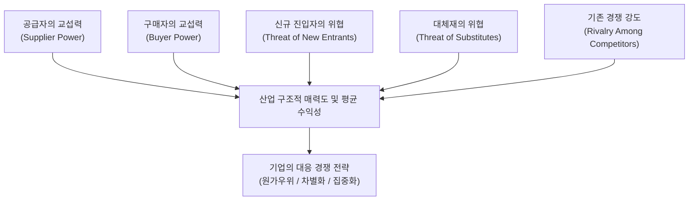

# 01. Porter's Five Forces (포터의 5가지 힘) 분석 보고서

---

## 1. 프레임워크 개요 및 실습 목적

포터의 5가지 힘(Five Forces) 모델은 기업이 속한 **산업 전체의 구조와 수익 매력도**를 평가하는 대표적인 외부 환경 분석 프레임워크입니다. 본 보고서에서는 제시된 분석 가이드라인에 따라 서로 판이한 특성을 지닌 두 개 시장 영역인 **[1] 저비용 항공사(LCC) 산업**과 **[2] 생성형 AI (LLM API 및 기업용 솔루션) 산업**을 대상으로 5가지 경쟁 요인을 분석하고, 각 산업의 구조적 매력도와 전략적 시사점을 도출합니다.

### 5가지 경쟁 요인 구조도

---

## 2. [시장 1] 저비용 항공사(LCC: Low-Cost Carrier) 산업 분석

### (1) 산업 정의 및 특징
* **분석 대상**: 단거리/중거리 노선 중심의 운임 절감형 항공 운송 서비스 산업
* **주요 특징**: 고정비(항공기 리스, 정비, 인건비) 비중 높음, 유가 및 환율 변동성 극대화, 정시성 및 가격 경쟁 중심

### (2) 5가지 힘(Five Forces) 세부 분석

| 분석 요인 | 강도 (Level) | 핵심 평가 요인 및 분석 근거 |
| :--- | :---: | :--- |
| **1. 공급자의 교섭력** | **매우 높음 (High)** | • **항공기 제조사 과점**: 보잉(Boeing), 에어버스(Airbus) 양대 제조사가 시장을 독점하여 가격/납기 교섭력 압도적. • **항공유 수급**: 국제 유가 및 정유사의 공급 가격을 개별 LCC가 통제 불가능. • **공항 슬롯(Slot)**: 주요 거점 공항의 운항 승인권 및 정비업체에 대한 높은 의존성. |
| **2. 구매자의 교섭력** | **높음 (High)** | • **가격 민감도 극대화**: LCC 이용 고객은 브랜드 충성도보다 '최저가 항공권' 검색에 집중. • **전환 비용(Switching Cost) 무존재**: OTA(네이버 항공권, 스카이스캐너 등) 가격 비교 플랫폼 확산으로 타 항공사로 즉시 이동 가능. • **단, 개별 구매자 규모는 작음**: 개인 승객 단위 구매이나, 전체 집단으로서의 가격 압박력은 매우 강함. |
| **3. 신규 진입자의 위협** | **중간~낮음 (Moderate to Low)** | • **높은 진입 장벽**: 면허 취득(AOC), 초기 항공기 리스 자본, 안전 기준 통과 등 규제 장벽 존재. • **규모의 경제 필요**: 노선망 확충과 인프라 확보 없이는 단가 경쟁력 확보 불가. • **기존 업체 반응**: 기존 LCC 및 FSC 자회사의 출혈 가격 경쟁 대응 위험. |
| **4. 대체재의 위협** | **중간~높음 (Moderate to High)** | • **고속철도(KTX, SRT 등)**: 국내선 및 일본/중국 등 단거리 이동 시 수속 시간이 없는 고속철도가 강력한 대체재. • **화상회의/원격협업**: 출장 목적의 승객에게 Zoom, Teams 등이 비대면 대체 수단으로 작동. |
| **5. 기존 경쟁 강도** | **매우 높음 (Very High)** | • **제품 차별화 난이도 높음**: 좌석 공급이라는 단일 서비스 특성상 가격 외 차별화 요소 제한적. • **높은 고정비와 높은 퇴출 장벽**: 항공기 리스 계약 등으로 인해 손실이 발생해도 노선 운항을 지속해야 함. • **공급 과잉 시 출혈 경쟁**: 비수기 운임 할인 경쟁이 매우 치열함. |

### (3) LCC 산업 매력도 종합 평가 및 대응 전략
* **종합 산업 매력도**: **낮음 (Unattractive)** — 5가지 힘 대부분이 강하게 작용하여 평균 수익률 확보가 극도로 어려움.
* **추천 전략 방향**:
  1. **원가 우위 (Cost Leadership) 극대화**: 단일 기종 운용(예: B737 단일화)을 통한 정비/교육비 절감, 부가 서비스(좌석 지정, 수하물) 유료화를 통한 엑스트라 수익 창출.
  2. **특화 노선 집중화 (Focus)**: 대형 항공사(FSC)가 진입하기 애매한 알짜 지방 공항 출발 단거리 노선 선점.

---

## 3. [시장 2] 생성형 AI (LLM API 및 기업용 솔루션) 산업 분석

### (1) 산업 정의 및 특징
* **분석 대상**: 초거대 언어모델(LLM) 파운데이션 모델 개발 및 API/엔터프라이즈 솔루션 제공 산업 (OpenAI, Anthropic, Google, Meta 등)
* **주요 특징**: 초고속 기술 발전, 천문학적 컴퓨팅/자본 투자 필요, 오픈소스 vs 파운데이션 모델 경쟁

### (2) 5가지 힘(Five Forces) 세부 분석

| 분석 요인 | 강도 (Level) | 핵심 평가 요인 및 분석 근거 |
| :--- | :---: | :--- |
| **1. 공급자의 교섭력** | **매우 높음 (High)** | • **AI 반도체 독점 (Nvidia)**: GPU(H100, B200 등) 공급망을 엔비디아가 거진 독점하여 가격 및 수량 결정권 보유. • **고품질 학습 데이터 수급**: 저작권 이슈 확산에 따라 고품질 데이터 보유자(뉴스사, Reddit 등)의 교섭력 상승. • **클라우드 인프라(CSP)**: AWS, Azure, GCP 등 대형 클라우드 마이그레이션 및 인프라 비용 부담. |
| **2. 구매자의 교섭력** | **중간~높음 (Moderate to High)** | • **개발자/기업의 멀티모델 전략**: 단일 API 고수가 아닌, 비용/성능에 따라 LiteLLM, Router 등을 활용해 용도별 모델 교체 용이. • **가격 파괴 경쟁**: 1M 토큰당 비용이 빠르게 하락하여 구매자의 가격 인하 요구 거셈. • **단, 기업용 커스텀 파이프라인 구축 시 전환 비용 증가**: RAG 시스템 및 Fine-tuning 고도화 시 데이터 락인(Lock-in) 효과 발생. |
| **3. 신규 진입자의 위협** | **중간 (Moderate)** | • **높은 자본/컴퓨팅 장벽**: 초거대 모델 사전 학습에는 수천억 원 이상의 비용이 소요되어 스타트업의 진입 장벽 존재. • **오픈소스 모델의 신규 진입 위협**: Meta(Llama), DeepSeek 등 고성능 오픈소스 모델이 무료/저비용으로 개방되어 기존 유료 API 시장 위협. |
| **4. 대체재의 위협** | **낮음~중간 (Low to Moderate)** | • **전통적 규칙 기반(Rule-based) / SLM(소형 언어모델)**: 온디바이스 SLM이나 특정 Task 전용 소형 모델이 LLM API의 대체재로 부상. • **하지만 지능적 처리 욕구 자체를 대체할 기술은 없음**: 생성형 AI가 제공하는 요약/생성/추론 기능을 대체할 완전히 다른 기술 부재. |
| **5. 기존 경쟁 강도** | **매우 높음 (Very High)** | • **빅테크 간 치열한 군비 경쟁**: OpenAI, Google, Anthropic, Meta, X.AI 등이 주도권을 잡기 위해 매달 신모델 출시 및 가격 파괴. • **스피드 경쟁**: 파이프라인 우위를 유지하기 위한 지속적 컴퓨팅 투자 압박. |

### (3) 생성형 AI 산업 매력도 종합 평가 및 대응 전략
* **종합 산업 매력도**: **중간 (Moderate / Volatile)** — 시장 성장 잠재력은 폭발적이나, 공급자(Nvidia)의 과도한 힘과 빅테크 간 가격 출혈 경쟁으로 당장의 마진율 확보가 도전적임.
* **추천 전략 방향**:
  1. **차별화 (Differentiation) & 에이전트/산업 특화**: 단순히 모델 성능(Benchmark) 싸움이 아닌, 특정 산업(금융, 의료, 법률) 워크플로우 결합 및 버티컬 에이전트(Agentic AI) 구축.
  2. **집중화 (Focus) / 온디바이스 SLM**: 특정 엔터프라이즈 보안 요구사항에 맞춘 경량화 모델 및 사내 구축(On-Premise) 특화 솔루션 타겟팅.

---

## 4. 두 시장 영역 (LCC vs 생성형 AI) 비교 분석 및 시사점

### (1) 5가지 힘 종합 비교표

| 5가지 경쟁 요인 | 저비용 항공사 (LCC) 산업 | 생성형 AI (LLM API) 산업 | 요인별 주요 환경 차이 |
| :--- | :---: | :---: | :--- |
| **공급자 교섭력** | **High** (보잉/에어버스, 정유사) | **High** (Nvidia GPU, 클라우드) | 둘 다 과점 공급자에 의존하나, AI는 자체 반도체 개발(NPU) 시도가 진행 중. |
| **구매자 교섭력** | **High** (최저가 검색 개인 고객) | **Moderate-High** (개발자, 기업) | LCC는 전환 비용이 0에 가까우나, AI는 기업 시스템 연동 시 락인 형성 가능. |
| **신규 진입자 위협** | **Low-Moderate** (면허/규제/자본) | **Moderate** (오픈소스 릴리즈) | LCC는 신규 진입이 어렵지만, AI는 오픈소스 진영의 기습적 진입이 위협적임. |
| **대체재 위협** | **Moderate-High** (KTX, 비대면) | **Low-Moderate** (SLM, Rule-based) | LCC는 대체 이동수단이 명확하나, AI는 지능 처리 측면에서 대체재가 드묾. |
| **기존 경쟁 강도** | **Very High** (가격 할인의 출혈경쟁) | **Very High** (빅테크 기술/가격전) | LCC는 성숙기 시장의 가격전, AI는 초기 성장기의 주도권 선점 기술전. |
| **종합 산업 매력도** | **낮음 (Low)** | **중간 (Moderate)** | LCC는 구조적 저수익 산업인 반면, AI는 성장성은 높으나 과도한 투자 비용 존재. |

### (2) 전략적 핵심 인사이트
1. **공급자 리스크의 공통점과 차이점**:
   * 두 산업 모두 핵심 자원(항공기 vs GPU)의 공급자가 극소수 과점 기업에 집중되어 있어 수익성의 상당 부분이 공급자에게 흡수되는 구조입니다.
2. **경쟁 양상의 차이**:
   * LCC는 **성숙 산업**으로 제품 차별화가 힘들어 원가 절감만이 유일한 생존 수단입니다.
   * 생성형 AI는 **성장 초기 산업**으로 오픈소스 생태계와의 경쟁 및 빅테크의 막대한 자본전 속에서 범용 API 경쟁을 넘어 버티컬(Vertical) 응용 서비스로의 차별화 전환이 필수적입니다.

---

## 5. 학습 셀프 체크리스트 & 리플렉션

본 분석을 완료한 후 다음 질문을 스스로 검토하며 개념을 정립해 보세요.

- [x] **공급자의 힘**: 원자재/핵심 자원을 대체할 수 없는 과점 상태인가?
- [x] **구매자의 힘**: 고객이 타사로 갈아타는 데 드는 전환 비용(Switching Cost)이 얼마나 낮은가?
- [x] **신규 진입자**: 규모의 경제나 정부 규제가 신규 업체를 막아주고 있는가?
- [x] **대체재**: 기술적/서비스적으로 동일한 고객 니즈를 다르게 해결하는 수단이 있는가?
- [x] **기존 경쟁**: 산업 성장율이 정체되어 파이 뺏어먹기 싸움을 하고 있는가?

---
*작성일: 2026-08-06*  
*저장소: STERNYUL/business_research_202608 ([README.md](file:///C:/Users/Belldandy/워크스페이스/business_research/README.md))*
