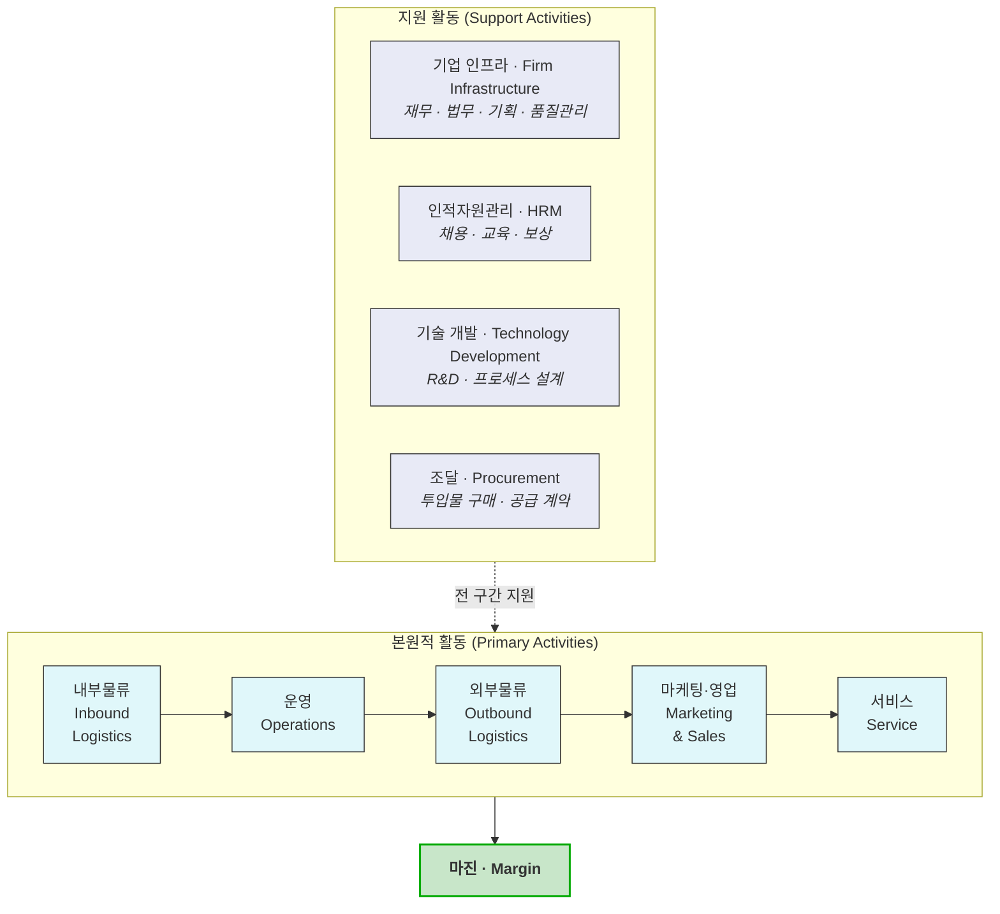

# 02 - 가치 사슬(Value Chain) 분석 방법론

**분석 층위**: **기업 내부** — [01 Porter's Five Forces](../01_porters_five_forces_analysis.md)가 *산업 구조*를 봤다면, 가치사슬은 *한 기업 안에서 가치가 어디서 만들어지는가*를 봅니다.

---

## 1. 프레임워크의 정의

Michael Porter가 *Competitive Advantage*(1985)에서 제시한 틀입니다. **기업을 하나의 덩어리로 보지 않고, 가치를 만드는 활동의 연쇄로 분해**합니다.



| 구분 | 활동 | 묻는 것 |
|---|---|---|
| **본원적** | 내부물류 | 투입물을 어떻게 받아 보관·관리하는가 |
| | 운영 | 투입물을 산출물로 바꾸는 활동은 무엇인가 |
| | 외부물류 | 산출물을 고객에게 어떻게 전달하는가 |
| | 마케팅·영업 | 고객이 사도록 만드는 활동은 무엇인가 |
| | 서비스 | 판매 후 가치를 유지·증대하는 활동은 무엇인가 |
| **지원** | 조달 | 무엇을 밖에서 사 오는가, 그 협상력은 어떤가 |
| | 기술 개발 | 어떤 기술이 어느 활동을 떠받치는가 |
| | 인적자원관리 | 어떤 역량을 가진 사람이 어디에 필요한가 |
| | 기업 인프라 | 전사 차원의 관리 기능은 무엇을 하는가 |

## 2. 이 프레임워크를 쓰는 목적 셋

| 목적 | 내용 |
|---|---|
| **① 원가 우위의 원천 찾기** | 활동별 원가와 **원가 동인(cost driver)** 을 분리해, 어디를 줄일 수 있는지 본다 |
| **② 차별화의 원천 찾기** | 고객이 값을 더 지불하는 이유가 **어느 활동에서** 만들어지는지 특정한다 |
| **③ 가치사슬 재구성** | 활동의 순서·주체를 바꿔 구조 자체를 유리하게 만든다 (외주화, 통합, 접합) |

**②가 이 저장소에서 가장 중요합니다.** [AOS·DOS](../06_시장기회분석/)로 *고객이 무엇을 원하는지*를 알아냈다면, 가치사슬은 **그 요구를 우리 조직의 어느 활동이 만들어내는지**를 지정합니다. 요구와 활동이 연결되지 않으면 로드맵이 나오지 않습니다.

## 3. 산업 가치사슬과 기업 가치사슬을 혼동하면 안 됩니다

> 🔴 **이 저장소에서 실제로 발생한 혼동입니다.**

[Porter 5 Forces 분석 §4-3](../01_porters-five-forces/07_분석_자산가치평가-인프라.md)에 **"밸류체인 점유 지도"** 라는 표가 있습니다.

```
원천 수집 → 정제·정규화 → 평가 모델 → 산출물(값+근거) → 전달 → 인증·수용 → 활용
```

**이것은 Porter의 가치사슬이 아닙니다.** 산업 전체에서 가치가 흐르는 단계를 그린 **산업 가치사슬(Industry Value Chain)** 이고, 각 칸의 주인이 *다른 회사*입니다. Porter의 가치사슬은 **한 회사 안의 활동**이고 각 칸의 주인이 *같은 회사*입니다.

| | **산업 가치사슬** | **기업 가치사슬** *(이 챕터)* |
|---|---|---|
| 분석 단위 | 산업 전체 | 한 기업 |
| 각 단계의 주인 | 서로 다른 회사 | 같은 회사의 다른 부서·기능 |
| 답하는 질문 | **누가 어느 구간을 점유하는가** | **우리 안에서 가치가 어디서 만들어지는가** |
| 전략적 용도 | 진입 지점·수직통합 판단 | 원가·차별화 원천 특정, 자원 배분 |
| 이 저장소의 위치 | [01 Porter §4-3](../01_porters-five-forces/07_분석_자산가치평가-인프라.md) | **[01_분석_자산가치평가-인프라.md](01_분석_자산가치평가-인프라.md)** |

**둘은 층위가 다르므로 대체 관계가 아니라 보완 관계입니다.** 산업 가치사슬은 *"인증 칸이 비어 있다"* 를 알려주고, 기업 가치사슬은 *"그 칸을 우리 조직의 어느 활동으로 메울 것인가"* 를 알려줍니다.

## 4. 서비스·데이터 사업에 적용할 때의 주의점

원형 5단계는 **제조업을 전제**합니다. 물리적 투입물이 없는 사업에 그대로 쓰면 칸이 비거나 억지가 됩니다.

| 원형 활동 | 데이터·SaaS 사업에서의 대응 | 주의 |
|---|---|---|
| 내부물류 | **데이터 조달·수집·적재** | 재고가 아니라 **접근권**이 자산. 공급 계약이 곧 내부물류 |
| 운영 | 정제·정규화 · 모델 산출 · **이력 보존** | 반복 생산이 아니라 **파이프라인 상시 운영** |
| 외부물류 | API · 파일 배치 · 온프레미스 · 대시보드 | **전달 형태 자체가 구매 조건**이 되는 경우가 있음 |
| 마케팅·영업 | 세일즈 + **심사 통과 자산**(보안·품질관리 문서) | B2B 규제 산업에서 **가장 과소평가되는 활동** |
| 서비스 | 온보딩 · 감사 대응 · 장애 대응 | 계약 후에도 이탈이 발생하므로 **가치 유지 활동**이 핵심 |

> 💡 **가장 흔한 실수는 "마케팅·영업"을 광고·홍보로만 읽는 것입니다.** Porter의 정의는 *"고객이 사도록 만드는 모든 활동"* 입니다. 규제 산업에서는 **보안 심사 문서·품질관리 등록 패키지가 광고보다 훨씬 강한 마케팅·영업 활동**입니다 — 그것이 없으면 계약이 성립하지 않기 때문입니다.

## 5. 분석 절차

| 단계 | 하는 일 | 산출물 |
|:---:|---|---|
| **①** | 활동 분해 — 9개 칸을 우리 사업 언어로 다시 씀 | 활동 목록 |
| **②** | 각 활동에 **원가 동인**과 **차별화 기여**를 표시 | 활동 × 2축 표 |
| **③** | 고객 요구(Pain/Goal)를 활동에 **매핑** | 요구-활동 연결표 |
| **④** | 활동 간 **연결(linkage)** 확인 — 한 활동의 선택이 다른 활동의 비용을 바꾸는 지점 | 연결 지도 |
| **⑤** | 재구성 후보 도출 — 외주화·통합·접합 | 재구성 시나리오 |

**④를 빼먹으면 이 프레임워크의 절반이 사라집니다.** Porter가 강조한 것은 개별 활동이 아니라 **활동 간 연결**입니다. 예를 들어 *운영*에서 산출 이력을 남기기로 하면 *마케팅·영업*의 감사 대응 자료 비용이 내려갑니다 — 한 활동의 투자가 다른 활동의 비용을 줄이는 구조를 찾는 것이 핵심입니다.

## 6. 이 프레임워크가 답하지 않는 것

| 못 하는 것 | 어디서 보완하나 |
|---|---|
| 산업 전체의 수익성·경쟁 강도 | [01 Porter's Five Forces](../01_porters_five_forces_analysis.md) |
| **산업에서 이기기 위해 반드시 필요한 요인** | **[03 KSF](../03_ksf/00_학습노트.md)** |
| 시장 규모와 지불 주체 | [04 TAM-SAM-SOM](../04_tam-sam-som/) |
| 고객이 실제로 무엇을 원하는가 | [05 페르소나](../05_페르소나/) · [06 기회점수](../06_시장기회분석/) · [07 JTBD](../07_jtbd/) |

> **가치사슬은 "우리가 무엇을 하는가"만 봅니다.** 그 활동이 **산업에서 통하는 활동인지**는 답하지 않습니다. 그래서 다음 챕터가 KSF입니다 — 산업이 요구하는 것과 우리가 가진 것을 맞대는 렌즈입니다.

---

> **사례 분석**: [01_분석_자산가치평가-인프라.md](01_분석_자산가치평가-인프라.md)
