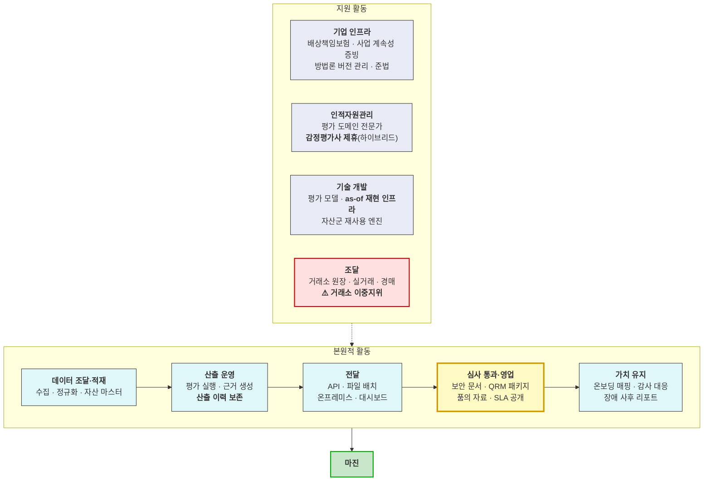
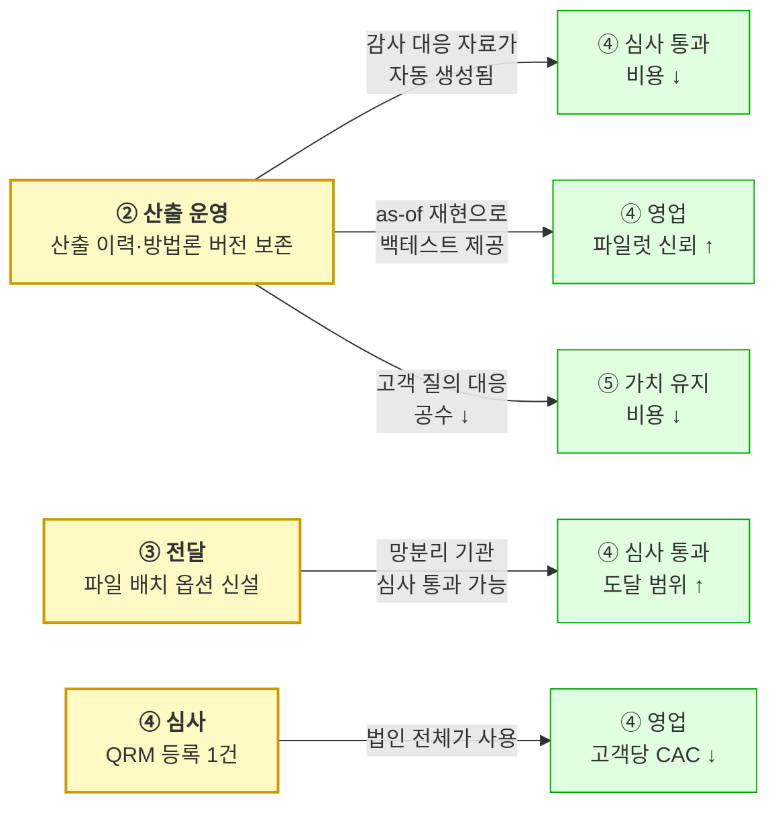
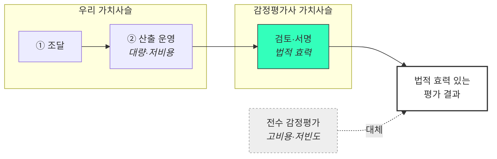

# 가치 사슬 분석 — 자산 가치평가 인프라

**대상**: [자산 가치평가 인프라](../04_tam-sam-som/02_사례_자산가치평가/) 사업 (조각투자·토큰증권 포함)
**방법론**: [00_학습노트](00_학습노트.md)
**층위 주의**: 이 문서는 **기업 내부 활동**을 봅니다. [Porter §4-3의 밸류체인 점유 지도](../01_porters-five-forces/07_분석_자산가치평가-인프라.md)는 **산업 가치사슬**로 층위가 다릅니다 → [학습노트 §3](00_학습노트.md)

---

## 1. 두 가치사슬을 나란히 놓기

**산업 가치사슬** *(01 Porter — 누가 어느 구간을 점유하는가)*

```
원천 수집 → 정제·정규화 → 평가 모델 → 산출물 → 전달 → 인증·수용 → 활용
   ○           ●            ●          ●        ●       ✕         ○      ← 우리 점유도
```

**기업 가치사슬** *(이 문서 — 우리 안에서 가치가 어디서 만들어지는가)*



> 🔴 **두 표시가 이 분석의 결론을 미리 담고 있습니다.**
> **노란 굵은 테두리(심사 통과·영업)** — 제품 활동이 아닌데 가치 창출의 중심입니다.
> **빨간 테두리(조달)** — 최대 고객이 최대 공급자인 구조적 취약점입니다.

---

## 2. 활동별 분해 — 원가 동인과 차별화 기여

### 2-1. 본원적 활동

| 활동 | 구체 내용 | 원가 동인 | 차별화 기여 | 근거 |
|---|---|---|:---:|---|
| **① 데이터 조달·적재** | 거래소 원장·실거래가·경매 낙찰가 수집, 정규화, **자산 마스터 매핑** | 데이터 라이선스료 · 소스 수 · 정규화 공수 | **○ 중간** | 원천 데이터는 상당 부분 공개라 방어력이 낮음 |
| **② 산출 운영** | 평가 모델 실행, **근거(사례·건수·충분성 등급) 생성**, **산출 이력·방법론 버전 보존** | 연산 · 저장 · 파이프라인 상시 운영 | **● 최고** | 클러스터 1·2위(재현성·설명가능성)가 여기서 만들어짐 |
| **③ 전달** | API, **파일 배치**, 온프레미스, 대시보드, 엑셀 내보내기(고객 양식) | 채널 수 × 유지 공수 | **● 높음** | 클러스터 3위. *"API only면 통과 불가"* — 형태가 곧 구매 조건 |
| **④ 심사 통과·영업** | **보안·준법 문서 세트 · QRM 등록 패키지 · 감사 대응 패키지 · 품의서용 1p · SLA·장애 이력 공개** | 문서 작성·갱신 · 인증 조달비 | **● 최고** | **CJM 이탈 1·3·4·6위가 전부 이 활동의 부재** |
| **⑤ 가치 유지** | 자산 마스터 매핑 온보딩(유상), 감사 질의 대응, 장애 사후 리포트, 사용 리포트 | 고객당 온보딩 공수 · 대응 인력 | **○ 중간** | S6·S7 이탈 방지. *"자산 코드 130개를 손으로"* |

### 2-2. 지원 활동

| 활동 | 구체 내용 | 왜 이 사업에서 특별한가 |
|---|---|---|
| **조달** | 거래소 체결·호가 원장, 국토부 실거래, 경매 데이터, 클라우드 | 🔴 **거래소가 공급자이자 최대 고객**입니다([Porter ②](../01_porters-five-forces/07_분석_자산가치평가-인프라.md)). 조달 조건 악화가 곧 매출 위협 |
| **기술 개발** | 평가 모델, **as-of 재현 인프라**, 자산군 재사용 엔진 | as-of는 기능이 아니라 **인프라**입니다 — 나중에 붙일 수 없고 처음부터 이력을 쌓아야 함 |
| **인적자원관리** | 평가 도메인 전문가, **감정평가사 제휴** | 제휴가 HR이 아니라 **가치사슬 접합 수단**([§5-2](#5-2-재구성-②-감정평가사-가치사슬에-접합하기)) |
| **기업 인프라** | 배상책임보험, **사업 계속성 증빙**, 방법론 버전 관리, 준법 | 🔴 **QRM 심사 5항목 중 ④(제공자의 사업 계속성)** 이 여기 걸립니다 — 기술로 못 메우는 항목 |

---

## 3. 이 분석의 핵심 발견 — 가치가 제품 밖에서 만들어진다

### 3-1. 고객 요구를 활동에 매핑하면 무게중심이 드러납니다

[Pain List 21종](../06_시장기회분석/01_사례_pain-list.md)과 [MVP 16개 기능](../08_value-proposition/IVI-VPS-v1_0-merged.md)을 활동별로 배분했습니다.

| 활동 | 대응 Pain | MVP 기능 | 개수 |
|---|---|---|:---:|
| ① 데이터 조달·적재 | MK-3 *(커버리지)* | F5 | **1** |
| ② 산출 운영 | MK-1 · MK-2 · JM-2 · NG-3 · PS-3 · KD-1 | F1 · F2 · F3 · F4 · F13 · F15 | **6** |
| ③ 전달 | JM-3 · IS-1 · NG-2 | F10 · F11 · F12 | **3** |
| **④ 심사 통과·영업** | **KD-2 · KD-3 · BS-1 · BS-2 · BS-3 · PS-2** | **F6 · F7 · F8 · F9 · F14** | **5** |
| ⑤ 가치 유지 | *(KD-3 일부)* · S6 이탈 | F16 | **1** |

**②(산출 운영)와 ④(심사 통과·영업)에 11/16이 몰립니다.** ①(데이터 조달)에는 하나뿐입니다.

> 🔴 **데이터 회사인데 데이터 조달 활동의 차별화 기여가 가장 낮습니다.** 원천 데이터(실거래가·경매·공시가격)가 상당 부분 공개이기 때문입니다. **가치는 "무엇을 모으는가"가 아니라 "모은 것으로 무엇을 증명할 수 있게 하는가"에서 만들어집니다.**

### 3-2. ④ 심사 통과·영업이 이 사업의 특이점입니다

| 관점 | 확인 사항 |
|---|---|
| **이탈 기여** | [CJM 이탈 1위(S5 보안심사) · 3위(S2 아키텍처) · 4위(S2 Build vs Buy) · 6위(S4 QRM)](../05_페르소나/03_사례_고객여정지도.md) — **8개 중 4개가 이 활동의 부재** |
| **전환 판정 기여** | 김도현 전환 실패의 Anxieties 최대 항목이 KD-3(감사 대응). 백서현의 **유일한** 장벽이 QRM |
| **원가** | F6·F7·F8·F9 개발 난이도 **1~2** — 9개 활동 중 가장 저렴 |
| **차별화** | 경쟁 11사 중 이를 가치로 내세운 곳 **0곳** |

**난이도가 가장 낮고 이탈 방지 기여가 가장 큰 활동입니다.** 그런데 제품 백로그에는 잘 올라오지 않습니다 — **코드가 아니기 때문**입니다.

> 💡 **가치사슬로 보지 않으면 이 활동이 "영업 지원"으로 분류되어 투자 대상에서 빠집니다.** Porter의 정의(*"고객이 사도록 만드는 모든 활동"*)를 적용하면 이것은 **본원적 활동**이고, 이 사업에서는 산출 운영과 동급입니다.

### 3-3. 활동 간 연결(linkage) — 한 번 투자해 두 곳을 줄이는 지점

**Porter가 강조한 것은 개별 활동이 아니라 연결입니다.** 이 사업에는 강한 연결이 셋 있습니다.



| 연결 | 투자 | 절감되는 곳 | 근거 |
|---|---|---|---|
| **①** | ② 산출 이력 보존 | **④ 심사 + ⑤ 유지** | *"감사인 질문에 화면 하나 띄우면 제가 방어할 일이 없어집니다"* — 이력이 있으면 대응 자료를 따로 만들 필요가 없음 |
| **②** | ③ 파일 배치 채널 | **④ 도달 범위** | 임성호 세그먼트가 열리며 조민경 확장 세그먼트 전체의 접근성이 바뀜 |
| **③** | ④ QRM 등록 1건 | **④ 이후 CAC** | *"한 번 등록되면 법인 전체가 쓸 수 있어요"* — 1건 투자가 조직 단위 판매로 전환 |

> 🔴 **연결 ①이 가장 중요합니다.** as-of 이력 보존은 ②의 저장 비용을 늘리지만 ④와 ⑤의 인건비를 동시에 줄입니다. **비용으로만 보면 적자, 연결로 보면 흑자**인 활동이고, 이것이 [재현성을 차별화 축으로 잡은 판단](../08_value-proposition/IVI-VPS-v1_0-merged.md)을 원가 쪽에서 재확인해 줍니다.

### 3-4. 조달(Procurement)이 구조적 취약점입니다

| 공급자 | 제공 | 교섭력 | 이 사업 고유의 문제 |
|---|---|:---:|---|
| **거래소** | 체결·호가 원장 | ★★★★★ | 🔴 **최대 고객(SOM MR 0.295)이 동시에 최대 공급자** |
| 감정평가법인 | 평가 이력 | ★★★★★ | **경쟁자가 공급자** |
| 경매 데이터 사업자 | 낙찰가·권리관계 | ★★★★☆ | 소수 과점 |
| 국토부·부동산원 | 실거래·공시 | ★★☆☆☆ | 공개 — 단 형식·지연은 통제 밖 |

**가치사슬 관점의 완화책은 조달 활동의 분산입니다** — 다수 거래소 계약. 그러면 공급자 교섭력이 쪼개지고, 동시에 *"여러 거래소를 가로질러 본다"* 는 산출물 가치가 올라갑니다. **조달 리스크 완화와 차별화가 같은 행동에서 나오는 드문 경우**입니다.

---

## 4. 활동별 투자 우선순위

| 순위 | 활동 | 근거 | 비용 |
|:---:|---|---|:---:|
| **1** | **④ 심사 통과·영업** | 난이도 1~2 · 이탈 4건 방지 · 경쟁 0곳 · 전환 판정 직접 뒤집음 | **최저** |
| **2** | **② 산출 운영** *(이력·근거)* | 클러스터 1·2위 · 연결 ①로 ④⑤ 비용 동시 절감 | 중간 |
| **3** | **③ 전달** *(파일 배치)* | 클러스터 3위 · 세그먼트 개방 효과 | 중간 |
| **4** | **⑤ 가치 유지** *(온보딩)* | S6 이탈 방지 · **유상화 가능** | 낮음 |
| **5** | **① 데이터 조달** | 차별화 기여 최저 · 단 조달 분산은 별건으로 시급 | 높음 |

> 💡 **투자 순서가 비용 순서와 반대가 아닙니다** — 가장 싼 활동(④)이 가장 급합니다. 이것이 [VP §8-3의 "Sprint 0: 문서 자산 선행"](../08_value-proposition/IVI-VPS-v1_0-merged.md) 판단을 가치사슬 언어로 재확인한 것입니다.

---

## 5. 가치사슬 재구성 시나리오

### 5-1. 재구성 ① — 산업 가치사슬의 빈칸을 조달한다

산업 가치사슬에서 우리 빈칸은 **인증**입니다. 이것을 기업 가치사슬의 **기업 인프라 활동**으로 옮기면 실행 가능한 항목이 됩니다.

| 인증 구성요소 | 담당 활동 | 수단 |
|---|---|---|
| 법적 자격 | — | **포기** (얻으려면 감정평가업이 됨) |
| 책임 귀속 | **기업 인프라** | 배상책임보험 · 계약상 배상 한도 |
| 수용 이력 | **④ 심사 통과** | QRM 등록 · 첫 고객 레퍼런스 |
| 서명한 사람 | **인적자원관리** | 감정평가사 제휴 → §5-2 |

### 5-2. 재구성 ② — 감정평가사 가치사슬에 접합하기



**우리 ②의 산출물이 감정평가사 가치사슬의 투입물이 됩니다.** 평가사는 검토만 하므로 단가가 전수 평가보다 낮고, [적대 세력이 유통 채널로 전환](../05_페르소나/07_검토_감정평가법인-경쟁력.md)됩니다. **가치사슬 재구성이 경쟁 관계를 바꾸는 사례**입니다.

### 5-3. 재구성 ③ — ⑤ 가치 유지를 유상 활동으로 분리

자산 마스터 매핑 온보딩은 지금 **비용 센터**입니다(*"130개를 손으로 맞춰야"*). 이것을 유상 서비스로 떼면

- ⑤가 **원가 활동 → 매출 활동**으로 이동
- S6 이탈(*"연동만 하고 안 씀"*)이 줄어듦 — 돈을 낸 고객은 쓰기 때문
- 동시에 **전환비용(lock-in)이 생성**됨 → [Porter ③ 구매자 교섭력 완화](../01_porters-five-forces/07_분석_자산가치평가-인프라.md)

**한 결정이 원가·이탈·교섭력 셋을 동시에 건드립니다.**

---

## 6. 이 분석에서 배울 점

**① 산업 가치사슬과 기업 가치사슬은 층위가 다릅니다.**
[01 Porter 문서](../01_porters-five-forces/07_분석_자산가치평가-인프라.md)의 "밸류체인 점유 지도"를 이 챕터의 산출물로 착각하면 **기업 내부 분석이 통째로 빠집니다.** 산업 쪽은 *"인증 칸이 비었다"* 까지만 말하고, *"그 칸을 어느 활동으로 메우는가"* 는 기업 가치사슬에서만 나옵니다.

**② 데이터 회사인데 데이터 조달이 차별화 기여 최저입니다.**
원천이 공개이기 때문입니다. MVP 16개 중 데이터 조달 활동에 배치되는 것이 1개뿐입니다. **"우리는 데이터 회사"라는 자기 인식이 자원 배분을 그르칠 수 있습니다.**

**③ 코드가 아닌 활동이 본원적 활동일 수 있습니다.**
심사 통과·영업(④)은 난이도 1~2로 가장 싸고 이탈 방지 기여가 가장 큽니다. **"영업 지원"으로 분류하면 투자 대상에서 빠지는데, Porter의 정의로는 본원적 활동**입니다.

**④ 연결을 보면 적자 활동이 흑자로 바뀝니다.**
as-of 이력 보존은 ② 단독으로는 저장 비용만 늘리는 활동입니다. ④·⑤의 인건비 절감을 합산해야 투자 근거가 섭니다. **활동별로만 보면 이 결정을 못 내립니다.**

**⑤ 조달 리스크 완화와 차별화가 같은 방향인 드문 구조입니다.**
다수 거래소 계약은 공급자 교섭력을 분산시키면서 *"여러 거래소를 가로질러 본다"* 는 제품 가치를 만듭니다. **대개는 리스크 관리와 차별화가 트레이드오프인데 여기서는 아닙니다.**

---

> ⚠️ **검증 상태**: 활동 분해와 매핑은 이 저장소의 다른 분석(Pain List · CJM · VP)에서 도출한 것이며, **원가 동인의 실제 금액은 산정하지 않았습니다.** Porter의 가치사슬 분석은 원래 활동별 원가 배분을 요구하는데, 그것은 조직·재무 데이터가 있어야 가능합니다.
>
> | 미확인 | 필요한 것 |
> |---|---|
> | 활동별 실제 원가 비중 | 조직 구성·인건비 배분 |
> | as-of 이력 인프라의 저장·연산 비용 | 기술 스택 설계 |
> | QRM 등록 조달비(6~9개월 인건비) | 실제 신청 경험 |
> | 온보딩 유상화 시 수용 단가 | 고객 확인 |
>
> **다음 챕터**: [03 KSF](../03_ksf/00_학습노트.md) — 이 활동들이 **산업에서 이기기에 충분한지**를 맞대어 봅니다.
