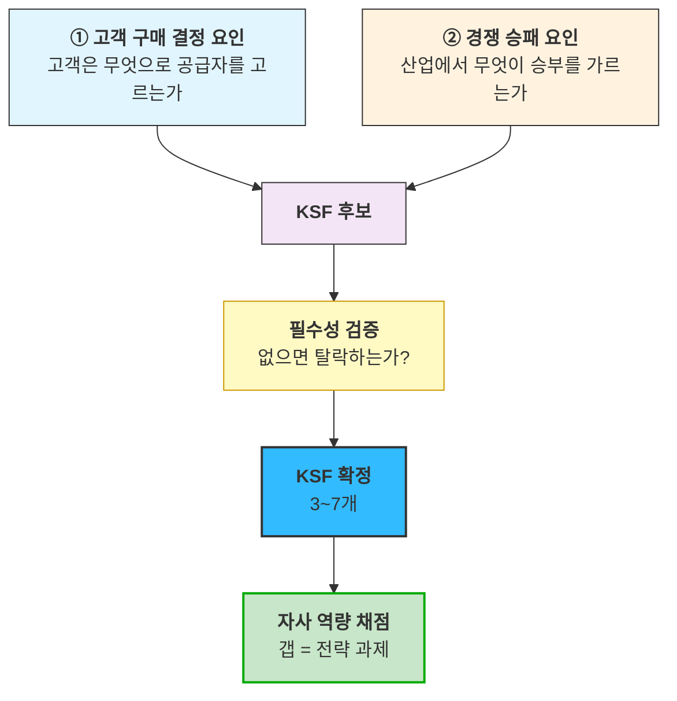
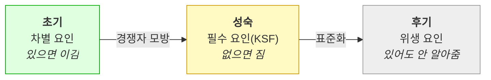

# 03 - 핵심 성공 요인(KSF, Key Success Factors) 분석 방법론

**분석 층위**: **산업 ↔ 기업 접점** — [01 Porter](../01_porters_five_forces_analysis.md)가 *산업이 어떻게 생겼는가*, [02 가치사슬](../02_value-chain/00_학습노트.md)이 *우리가 무엇을 하는가*를 봤다면, KSF는 **그 둘을 맞대어 "산업이 요구하는 것을 우리가 갖고 있는가"** 를 봅니다.

---

## 1. KSF의 정의

**KSF는 "그 산업에서 이기기 위해 반드시 확보해야 하는 소수의 요인"** 입니다. 세 가지 성질로 정의됩니다.

| 성질 | 뜻 | 반례 |
|---|---|---|
| **① 필수성** | 없으면 경쟁에서 탈락한다 | "있으면 좋은 것"은 KSF가 아님 |
| **② 산업 귀속성** | 개별 기업의 강점이 아니라 **산업이 정한다** | "우리 팀이 뛰어나다"는 역량이지 KSF가 아님 |
| **③ 소수성** | 보통 **3~7개**. 많아지면 우선순위가 사라진다 | 20개짜리 목록은 체크리스트지 KSF가 아님 |

> 🔴 **②가 가장 자주 틀리는 지점입니다.** KSF는 우리가 잘하는 것을 나열하는 자리가 아닙니다. **산업이 요구하는 것을 먼저 확정하고, 그다음에 우리가 가졌는지 채점**해야 합니다. 순서를 뒤집으면 자기 강점을 KSF로 착각합니다.

## 2. KSF를 어디서 도출하는가 — 두 갈래

| 갈래 | 어디서 재료를 얻나 |
|---|---|
| **① 고객 구매 결정 요인** | [05 페르소나·CJM](../05_페르소나/) · [06 AOS·DOS](../06_시장기회분석/) · [07 JTBD](../07_jtbd/) |
| **② 경쟁 승패 요인** | [01 Porter 5 Forces](../01_porters_five_forces_analysis.md) · 경쟁사 분석 · [02 가치사슬](../02_value-chain/00_학습노트.md) |

**두 갈래를 모두 써야 합니다.** 고객 쪽만 보면 *"고객이 원하는 것"* 이 나오는데, 그중 일부는 **경쟁자도 다 제공하므로 승부처가 아닙니다**(필수 조건이지 차별 요인이 아님). 경쟁 쪽만 보면 고객이 값을 지불하지 않는 요인이 섞입니다.

## 3. KSF와 다른 프레임워크의 관계 — 무엇이 다른가

| | 답하는 질문 | 대상 | 이 저장소 위치 |
|---|---|---|---|
| **Porter 5 Forces** | 이 산업이 매력적인가 | 산업 | [01](../01_porters_five_forces_analysis.md) |
| **가치사슬** | 우리 안에서 가치가 어디서 만들어지나 | 기업 내부 | [02](../02_value-chain/00_학습노트.md) |
| **AOS · DOS** | **고객이 얼마나 아프고 시장이 얼마나 큰가** | 고객 요구 | [06](../06_시장기회분석/) |
| **KSF** | **이 산업에서 이기려면 무엇이 반드시 필요한가** | 산업 ↔ 기업 | **이 챕터** |

### AOS·DOS와 KSF의 결정적 차이

**AOS는 "고객이 아픈 정도"를, KSF는 "없으면 탈락하는지"를 잽니다.** 이 둘은 자주 어긋납니다.

| 유형 | AOS | KSF | 해석 | 처방 |
|---|:---:|:---:|---|---|
| **A** | 높음 | ⭕ | 아프고 필수 | **즉시 착수** |
| **B** | 높음 | ✕ | 아프지만 산업 승부처는 아님 | 차별화 옵션 |
| **C** | **낮음** | **⭕** | 🔴 **안 아픈데 없으면 탈락** | **반드시 확보 — 놓치기 쉬움** |
| **D** | 낮음 | ✕ | 둘 다 아님 | 자원 회수 |

> 🔴 **C가 KSF 분석의 존재 이유입니다.** AOS가 낮은 이유가 *"이미 잘 되고 있어서"* 인 항목은 **우리가 진입하면서 새로 만드는 리스크**일 수 있습니다. AOS 순위표만 보면 이 항목이 최하위로 밀려 투자에서 빠지고, **출시 직후 그것 때문에 이탈합니다.**

## 4. 분석 절차

| 단계 | 하는 일 | 산출물 |
|:---:|---|---|
| **①** | 두 갈래에서 **KSF 후보** 수집 | 후보 목록 (10~15개) |
| **②** | 각 후보에 **필수성 검증** — *"없으면 탈락하는가"* | 필수/차별/부가 3분류 |
| **③** | 필수 항목만 남겨 **KSF 확정** (3~7개) | KSF 목록 |
| **④** | KSF별 **자사 역량 채점** (● 보유 / ○ 부분 / △ 취약 / ✕ 없음) | KSF × 역량 표 |
| **⑤** | **갭이 큰 항목 = 전략 과제**로 전환 | 과제 목록 + 조달 수단 |
| **⑥** | 기존 우선순위(AOS·DOS)와 **교차 검증** — 어긋나는 지점을 찾는다 | 교차표 |

**⑥이 이 프레임워크의 실질적 산출물입니다.** KSF 목록 자체는 상식적으로 보이기 쉽지만, **AOS·DOS 순위와 어긋나는 지점**에서 새로운 판단이 나옵니다(§3의 유형 C).

## 5. 흔한 실패 세 가지

| 실패 | 증상 | 교정 |
|---|---|---|
| **자기 강점을 KSF로 착각** | KSF 목록이 우리 자랑거리와 일치함 | **산업 쪽에서 먼저 도출**하고 역량 채점은 나중에 |
| **KSF가 너무 많음** | 10개 이상. "다 중요합니다" | **필수성 검증**을 엄격히 — *"없어도 계약이 되는가"* |
| **정적으로 봄** | 한 번 정하고 끝 | KSF는 **산업 성숙도에 따라 바뀝니다** → §6 |

## 6. KSF는 시간에 따라 바뀝니다

산업이 성숙하면 **차별 요인이 필수 요인으로 내려앉습니다.**

**그래서 KSF 분석에는 "지금"과 "3년 뒤"를 나눠 적어야 합니다.** 지금 차별 요인인 것이 3년 뒤 필수가 되면, 그때는 그것으로 못 이깁니다 — **다음 차별 요인을 미리 찾아야** 합니다.

## 7. 이 프레임워크가 답하지 않는 것

| 못 하는 것 | 어디서 보완하나 |
|---|---|
| 시장이 얼마나 큰가, 누가 돈을 내는가 | [04 TAM-SAM-SOM](../04_tam-sam-som/) |
| 고객이 구체적으로 어떤 상황에서 무엇을 원하는가 | [05 페르소나](../05_페르소나/) · [07 JTBD](../07_jtbd/) |
| **KSF를 확보하는 데 얼마가 드는가** | 이 프레임워크 밖 — 조달 비용 산정 필요 |
| 우선순위 안에서 무엇을 먼저 할지 | [06 AOS·DOS](../06_시장기회분석/) 와 교차 |

> **KSF는 "무엇이 필요한가"까지만 말하고 "그것을 어떻게 얻는가"는 말하지 않습니다.** 갭을 확인한 뒤에는 자체 구축 / 조달 / 차용 중 무엇을 택할지 별도 판단이 필요합니다.

---

> **사례 분석**: [01_분석_자산가치평가-인프라.md](01_분석_자산가치평가-인프라.md)
