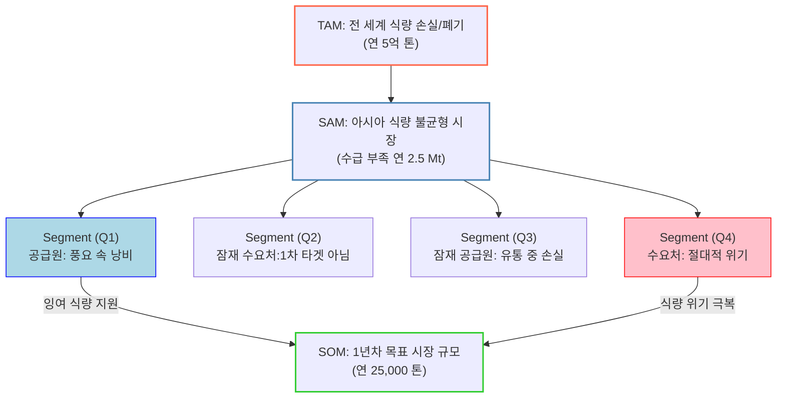

# TAM-SAM-SOM 사례 — 식량 손실·폐기 ↔ 아시아 식량 불균형

> ⚠️ **작성 상태**: 첨부해주신 Mermaid 구조도만 확보된 상태입니다. 각 수치의 **산정 근거·출처·계산 과정**은 아직 채워지지 않았습니다. 원본 리서치를 받는 대로 「산정 근거」 절을 채웁니다.

---

## 1. 시장 구조도

## 2. 구조 해설

### 세 겹의 시장 규모

| 층위 | 정의 | 규모 | 전 단계 대비 |
|---|---|---|---|
| **TAM** | 전 세계 식량 손실·폐기 총량 | 연 **5억 톤** | — |
| **SAM** | 아시아 식량 불균형 시장 (수급 부족분) | 연 **2.5 Mt** (250만 톤) | TAM의 **0.5%** |
| **SOM** | 1년차 목표 시장 규모 | 연 **25,000 톤** | SAM의 **1.0%** |

**주목할 점**: TAM → SAM 축소율이 0.5%로 매우 큽니다. 이는 TAM을 "전 세계 폐기 총량"이라는 **문제의 크기**로 잡고, SAM을 "아시아 수급 부족분"이라는 **수요의 크기**로 잡았기 때문입니다. 두 층위가 서로 다른 것을 세고 있다는 뜻입니다.

> 💡 **점검 필요**: TAM은 공급측(버려지는 양), SAM은 수요측(모자란 양)을 측정합니다. 층위 간 단위는 같지만(톤) 의미가 다르므로, 산정 근거를 채울 때 **"이 사업이 매개하는 것이 공급인가 수요인가"** 를 명시해야 논리가 성립합니다.

### 세그먼트 맵 — 2×2 사분면

이 사업은 **양면 시장(공급원 ↔ 수요처)** 을 매개하는 구조입니다. 네 개 사분면이 그 조합을 나눕니다.

| 사분면 | 성격 | 역할 | 1년차 타겟 |
|---|---|---|---|
| **Q1** | 풍요 속 낭비 | **공급원** | ✅ 잉여 식량 지원 |
| **Q2** | 잠재 수요처 | — | ❌ 1차 타겟 아님 |
| **Q3** | 잠재 공급원 | 유통 중 손실 | ❌ 향후 확장 |
| **Q4** | 절대적 위기 | **수요처** | ✅ 식량 위기 극복 |

**SOM은 Q1 → Q4 연결에서만 나옵니다.** Q2·Q3는 시장 안에 있지만 1년차 목표에서는 제외됐습니다. 이렇게 **의도적으로 뺀 세그먼트를 명시하는 것**이 좋은 Segment Map의 조건입니다 — 빼지 않으면 SOM이 SAM과 구분되지 않습니다.

## 3. 산정 근거 _(미작성)_

원본 리서치에서 옮겨와야 할 항목:

- [ ] TAM 연 5억 톤 — 출처, 기준 연도, 손실(loss)과 폐기(waste)의 정의 범위
- [ ] SAM 연 2.5 Mt — "아시아 식량 불균형"의 지리적·품목적 범위, 수급 부족 산정 방식
- [ ] SOM 연 25,000 톤 — 산정 방식(Top-down 비율 배분 vs Bottom-up 고객 수 × 단위 물량), 근거가 된 가정
- [ ] 사분면 축의 정의 — 무엇과 무엇으로 2×2를 나눴는가
- [ ] Q1·Q4에 실제로 속하는 대상(국가·기관·기업)의 목록과 규모
- [ ] 수익 모델 — 톤 단위 물량이 어떻게 매출로 환산되는가

## 4. 검토 시 확인할 질문

- **지불 주체가 누구인가?** Q1(잉여 보유자)이 내는가, Q4(위기 지역)가 내는가, 제3자(정부·공여기관·ESG 예산)가 내는가. 톤 단위로만 표현된 시장 규모는 매출로 직접 환산되지 않습니다.
- **SOM 25,000톤은 무엇으로 뒷받침되는가?** SAM의 1%라는 비율에서 역산한 숫자라면 근거가 약합니다. "몇 개 기관 × 기관당 몇 톤"의 Bottom-up 계산이 있어야 합니다.
- **Q2를 왜 뺐는가?** "1차 타겟 아님"의 이유가 명시되어야 나중에 확장 순서를 정할 수 있습니다.
