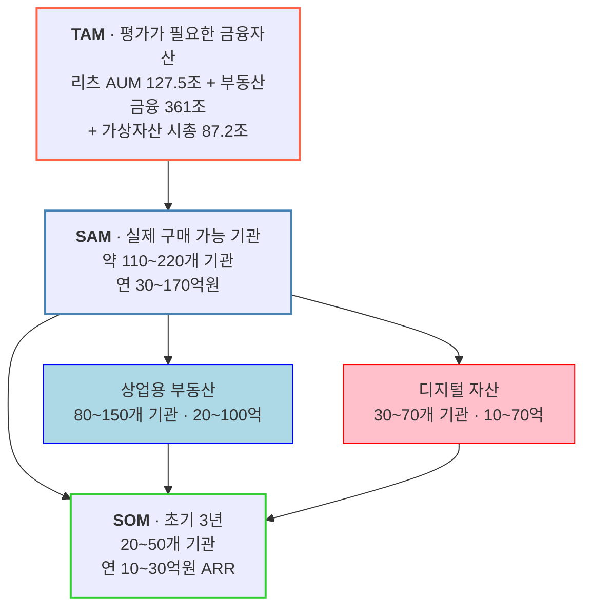

# TAM-SAM-SOM 산정 — 자산 가치평가 인프라

**사업 정의**: 상업용 부동산과 디지털 자산의 시장가치를 지속적으로 산출해 API·데이터 피드로 금융기관 시스템에 공급하는 **Institutional Valuation Infrastructure**

> 감정평가 서비스가 아니라 **평가 데이터 인프라**로 정의한 점이 이 산정의 출발점입니다. 정의를 어떻게 잡느냐에 따라 시장 크기가 통째로 달라집니다. (아래 §5 참조)

---

## 1. 세 층위 요약



## 2. TAM — 평가가 필요한 금융자산

| 구성 | 규모 | 기준 시점 |
|---|---:|---|
| 리츠 AUM | **127.5조 원** (리츠 469개) | 2026.6 |
| 건설·부동산 기업 대출 | **361조 원** | 2024 |
| 가상자산 시가총액 | **87.2조 원** | 2025년 말 |
| 가상자산 일평균 거래규모 | **5.4조 원** | 2025년 말 |

**참고 지표**

- 2025년 서울 상업용 부동산 거래규모 **33.7조 원** (역대 최대)
- 2024년 약 22조 원 거래, 그중 오피스 약 13조 원
- 가상자산 이용자 계정 **1,113만 개**, 원화예치금 **8.1조 원**
- 가상자산 종목 **1,732개** (중복상장 제외 **712종**)

> 💡 **여기서 중요한 관점 전환**: 거래되는 부동산(33.7조)보다 **가치평가가 금융 의사결정에 영향을 미치는 자산(361조)이 훨씬 큽니다.** TAM을 "거래액"이 아니라 "평가 결과가 영향을 주는 자산 스톡"으로 잡은 것이 이 산정의 핵심 설계입니다.

## 3. SAM — 실제로 구매할 가능성이 있는 기관

**Bottom-up: 고객 수 × 예상 연간 계약금액**

| 시장 | 구매 후보 기관 | 예상 연간 계약금액 | 연간 시장 규모 |
|---|---:|---:|---:|
| 상업용 부동산 | 80~150개 | 2,000만~8,000만 원 | **20~100억 원** |
| 디지털 자산 | 30~70개 | 3,000만~1.5억 원 | **10~70억 원** |
| **합계** | **110~220개** | — | **30~170억 원** |

### 🔑 방법론의 핵심 — "469개 리츠 ≠ 469개 고객"

이 산정에서 가장 배울 점입니다. 리츠는 469개지만 **구매 의사결정 단위는 AMC**입니다.

| AMC | 운용 리츠 수 |
|---|---:|
| 대한토지신탁 | 68개 |
| 코람코자산신탁 | 48개 |
| LH | 31개 |
| 신한리츠운용 | 23개 |

국내 AMC는 총 **66개**입니다. 하나의 AMC가 수십 개 리츠를, 각 리츠가 여러 부동산을 보유하는 3단 구조이므로:

```
AMC 1곳 → 리츠 20개 → 부동산 100개 → 매월/분기 가치평가 필요
```

**계약은 1건인데 데이터 사용량은 100개 자산분**입니다. 세는 단위를 자산(469개 리츠)이 아니라 **지불 주체(66개 AMC)** 로 잡아야 SAM이 정확해집니다.

### 디지털 자산 쪽 고객 구조

국내 가상자산사업자는 **27개사**입니다 (거래소 18개 + 지갑·보관업자 9개). 고객 수는 훨씬 적지만 가격 데이터가 핵심 시스템에 들어가므로 **ARPU가 높습니다.**

## 4. SOM — 초기 3년

| 항목 | 값 |
|---|---|
| 목표 고객 | **20~50개 기관** |
| 예상 매출 | **연 10~30억 원 ARR** |
| 확장 시 | 30~50억 원+ ARR |

SAM(110~220개) 대비 **약 18~23%** 를 3년 내 확보한다는 계획입니다.

## 5. 산업 정의가 시장 크기를 바꾼다

같은 사업을 어떻게 정의하느냐에 따라 시장이 이렇게 달라집니다.

| 정의 | 시장 크기 | 문제 |
|---|---|---|
| "국내 부동산 시장 3,000조 원" | 거대 | 투자자 입장에서 **의미 없음** — 우리가 가져갈 수 없는 숫자 |
| "부동산 감정평가를 자동화합니다" | 작음 | 감정평가 수수료 시장에 갇힘 |
| **"부동산의 현재 금융가치를 지속 업데이트해 투자·대출·NAV·공시 의사결정을 지원"** | 적정 | 지불 주체와 반복 구매가 분명 |

> TAM을 크게 부르는 것이 목적이 아닙니다. **"누가 실제로 돈을 낼 것인가"** 로 좁혀 들어갈 수 있는 정의여야 SAM·SOM이 계산됩니다.

---

## 6. 이 산정에 대한 검토

### 잘 된 점

**① Bottom-up 산정** — SAM을 "TAM의 몇 %"로 잡지 않고 `기관 수 × 계약단가`로 쌓아 올렸습니다. TAM-SAM-SOM에서 가장 흔한 실수(임의 비율 곱하기)를 피했습니다.

**② 구매 의사결정 단위로 고객을 정의** — 469개 리츠가 아니라 66개 AMC로 센 것. 자산 개수와 고객 수를 혼동하지 않았습니다.

**③ 세그먼트를 명시적으로 제외** — 일반 부동산 보유자를 초기 타깃에서 뺐습니다. 이유도 분명합니다: 이 서비스의 가치는 감정평가서 한 장이 아니라 **반복적으로 데이터를 쓰는 고객**에게서 나오기 때문입니다.

### 보완이 필요한 점

**① TAM과 SAM의 단위가 다릅니다**
TAM은 **자산 스톡(조 원)**, SAM·SOM은 **서비스 매출(억 원)** 입니다. 층위 간 축소율을 계산할 수 없는 구조입니다. 사업계획서에 넣을 때는 두 축을 분리해 표기해야 오해가 없습니다.

| 축 | TAM | SAM | SOM |
|---|---|---|---|
| 자산 규모 | 575.7조 원 | (미산출) | (미산출) |
| 서비스 매출 | (미산출) | 30~170억 원 | 10~30억 원 |
| 고객 수 | (미산출) | 110~220개 | 20~50개 |

**② TAM 구성 항목 간 중복 가능성**
리츠 AUM 127.5조 원과 건설·부동산 기업 대출 361조 원은 **같은 자산을 이중으로 셀 수 있습니다.** 리츠가 보유한 부동산에 담보대출이 걸려 있으면 양쪽에 모두 잡힙니다. 단순 합산(575.7조)은 피하고 항목별로 나열하는 편이 안전합니다.

**③ SOM 비중이 공격적**
3년 내 국내 관련 기관의 **5분의 1**을 확보한다는 계획입니다. B2B 데이터 인프라의 도입 주기(파일럿 → 내부 검증 → 시스템 연동)를 감안하면 낙관적입니다. 특히 상업용 부동산 고객은 원문에서도 **"구매 속도가 느리다"** 고 평가했습니다.

**④ 계약단가는 검증 전 추정치**
원문이 명시하듯 "시장에서 실제로 확인된 가격이 아니라 현재 국내 고객구조를 바탕으로 한 사업성 추정치"입니다. SAM 범위가 30억~170억으로 **5.7배** 벌어지는 것도 이 때문입니다. AMC 1곳과 거래소 1곳의 실제 지불의사(WTP)를 검증하면 이 폭이 좁혀집니다.

---

## 7. 출처

| 데이터 | 출처 |
|---|---|
| 리츠 469개, AUM 127.5조, AMC 66개, AMC별 운용 리츠 수 | 한국리츠협회 (2026.6 기준) |
| 건설·부동산 기업 대출 361조 원 | CBRE 조사 (2024 기준) |
| 가상자산 시총 87.2조, 일평균 거래 5.4조, 사업자 27개사, 계정 1,113만, 종목 1,732개 | 금융위원회 2025년 하반기 가상자산사업자 실태조사 |
| 서울 상업용 부동산 거래 33.7조 원 (2025), 22조 원 (2024) | 상업용 부동산 거래 집계 |

> ⚠️ 위 수치는 원본 리서치(ChatGPT 대화)에 인용된 값을 옮긴 것입니다. 사업계획서에 사용하기 전 **각 1차 출처에서 직접 확인**하시기 바랍니다.
