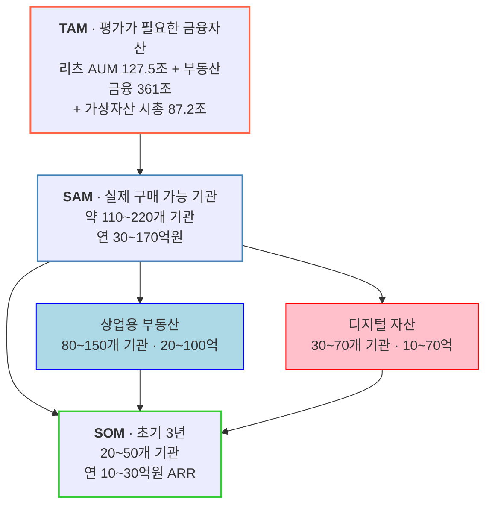

# TAM-SAM-SOM 산정 — 자산 가치평가 인프라

**사업 정의**: 상업용 부동산 · 디지털 자산 · **조각투자/토큰증권(STO) 기초자산**의 시장가치를 지속적으로 산출해 API·데이터 피드로 금융기관 시스템에 공급하는 **Institutional Valuation Infrastructure**

> 📌 **§3~§4의 SAM·SOM은 원안이며 갱신됐습니다 → [§8](#8-후속-분석-반영--갱신-samsom과-sto-축).** 갱신 SAM **171개 기관 · 105.6억**, 갱신 SOM **40개 기관 · 23.75억**. **STO 축은 TAM에만 있고 SAM은 미산정**입니다.

> 감정평가 서비스가 아니라 **평가 데이터 인프라**로 정의한 점이 이 산정의 출발점입니다. 정의를 어떻게 잡느냐에 따라 시장 크기가 통째로 달라집니다. (아래 §5 참조)

---

## 1. 세 층위 요약



## 2. TAM — 평가가 필요한 금융자산

| 구성 | 규모 | 기준 시점 |
|---|---:|---|
| 리츠 AUM | **127.5조 원** (리츠 469개) | 2026.6 |
| 건설·부동산 기업 대출 | **361조 원** | 2024 |
| 가상자산 시가총액 | **87.2조 원** | 2025년 말 |
| 가상자산 일평균 거래규모 | **5.4조 원** | 2025년 말 |

**참고 지표**

- 2025년 서울 상업용 부동산 거래규모 **33.7조 원** (역대 최대)
- 2024년 약 22조 원 거래, 그중 오피스 약 13조 원
- 가상자산 이용자 계정 **1,113만 개**, 원화예치금 **8.1조 원**
- 가상자산 종목 **1,732개** (중복상장 제외 **712종**)

> 💡 **여기서 중요한 관점 전환**: 거래되는 부동산(33.7조)보다 **가치평가가 금융 의사결정에 영향을 미치는 자산(361조)이 훨씬 큽니다.** TAM을 "거래액"이 아니라 "평가 결과가 영향을 주는 자산 스톡"으로 잡은 것이 이 산정의 핵심 설계입니다.

## 3. SAM — 실제로 구매할 가능성이 있는 기관

**Bottom-up: 고객 수 × 예상 연간 계약금액**

| 시장 | 구매 후보 기관 | 예상 연간 계약금액 | 연간 시장 규모 |
|---|---:|---:|---:|
| 상업용 부동산 | 80~150개 | 2,000만~8,000만 원 | **20~100억 원** |
| 디지털 자산 | 30~70개 | 3,000만~1.5억 원 | **10~70억 원** |
| **합계** | **110~220개** | — | **30~170억 원** |

### 🔑 방법론의 핵심 — "469개 리츠 ≠ 469개 고객"

이 산정에서 가장 배울 점입니다. 리츠는 469개지만 **구매 의사결정 단위는 AMC**입니다.

| AMC | 운용 리츠 수 |
|---|---:|
| 대한토지신탁 | 68개 |
| 코람코자산신탁 | 48개 |
| LH | 31개 |
| 신한리츠운용 | 23개 |

국내 AMC는 총 **66개**입니다. 하나의 AMC가 수십 개 리츠를, 각 리츠가 여러 부동산을 보유하는 3단 구조이므로:

```
AMC 1곳 → 리츠 20개 → 부동산 100개 → 매월/분기 가치평가 필요
```

**계약은 1건인데 데이터 사용량은 100개 자산분**입니다. 세는 단위를 자산(469개 리츠)이 아니라 **지불 주체(66개 AMC)** 로 잡아야 SAM이 정확해집니다.

### 디지털 자산 쪽 고객 구조

국내 가상자산사업자는 **27개사**입니다 (거래소 18개 + 지갑·보관업자 9개). 고객 수는 훨씬 적지만 가격 데이터가 핵심 시스템에 들어가므로 **ARPU가 높습니다.**

## 4. SOM — 초기 3년

| 항목 | 값 |
|---|---|
| 목표 고객 | **20~50개 기관** |
| 예상 매출 | **연 10~30억 원 ARR** |
| 확장 시 | 30~50억 원+ ARR |

SAM(110~220개) 대비 **약 18~23%** 를 3년 내 확보한다는 계획입니다.

## 5. 산업 정의가 시장 크기를 바꾼다

같은 사업을 어떻게 정의하느냐에 따라 시장이 이렇게 달라집니다.

| 정의 | 시장 크기 | 문제 |
|---|---|---|
| "국내 부동산 시장 3,000조 원" | 거대 | 투자자 입장에서 **의미 없음** — 우리가 가져갈 수 없는 숫자 |
| "부동산 감정평가를 자동화합니다" | 작음 | 감정평가 수수료 시장에 갇힘 |
| **"부동산의 현재 금융가치를 지속 업데이트해 투자·대출·NAV·공시 의사결정을 지원"** | 적정 | 지불 주체와 반복 구매가 분명 |

> TAM을 크게 부르는 것이 목적이 아닙니다. **"누가 실제로 돈을 낼 것인가"** 로 좁혀 들어갈 수 있는 정의여야 SAM·SOM이 계산됩니다.

---

## 6. 이 산정에 대한 검토

### 잘 된 점

**① Bottom-up 산정** — SAM을 "TAM의 몇 %"로 잡지 않고 `기관 수 × 계약단가`로 쌓아 올렸습니다. TAM-SAM-SOM에서 가장 흔한 실수(임의 비율 곱하기)를 피했습니다.

**② 구매 의사결정 단위로 고객을 정의** — 469개 리츠가 아니라 66개 AMC로 센 것. 자산 개수와 고객 수를 혼동하지 않았습니다.

**③ 세그먼트를 명시적으로 제외** — 일반 부동산 보유자를 초기 타깃에서 뺐습니다. 이유도 분명합니다: 이 서비스의 가치는 감정평가서 한 장이 아니라 **반복적으로 데이터를 쓰는 고객**에게서 나오기 때문입니다.

### 보완이 필요한 점

**① TAM과 SAM의 단위가 다릅니다**
TAM은 **자산 스톡(조 원)**, SAM·SOM은 **서비스 매출(억 원)** 입니다. 층위 간 축소율을 계산할 수 없는 구조입니다. 사업계획서에 넣을 때는 두 축을 분리해 표기해야 오해가 없습니다.

| 축 | TAM | SAM | SOM |
|---|---|---|---|
| 자산 규모 | 575.7조 원 | (미산출) | (미산출) |
| 서비스 매출 | (미산출) | 30~170억 원 | 10~30억 원 |
| 고객 수 | (미산출) | 110~220개 | 20~50개 |

**② TAM 구성 항목 간 중복 가능성**
리츠 AUM 127.5조 원과 건설·부동산 기업 대출 361조 원은 **같은 자산을 이중으로 셀 수 있습니다.** 리츠가 보유한 부동산에 담보대출이 걸려 있으면 양쪽에 모두 잡힙니다. 단순 합산(575.7조)은 피하고 항목별로 나열하는 편이 안전합니다.

**③ SOM 비중이 공격적**
3년 내 국내 관련 기관의 **5분의 1**을 확보한다는 계획입니다. B2B 데이터 인프라의 도입 주기(파일럿 → 내부 검증 → 시스템 연동)를 감안하면 낙관적입니다. 특히 상업용 부동산 고객은 원문에서도 **"구매 속도가 느리다"** 고 평가했습니다.

**④ 계약단가는 검증 전 추정치**
원문이 명시하듯 "시장에서 실제로 확인된 가격이 아니라 현재 국내 고객구조를 바탕으로 한 사업성 추정치"입니다. SAM 범위가 30억~170억으로 **5.7배** 벌어지는 것도 이 때문입니다. AMC 1곳과 거래소 1곳의 실제 지불의사(WTP)를 검증하면 이 폭이 좁혀집니다.

---

## 7. 출처

| 데이터 | 출처 |
|---|---|
| 리츠 469개, AUM 127.5조, AMC 66개, AMC별 운용 리츠 수 | 한국리츠협회 (2026.6 기준) |
| 건설·부동산 기업 대출 361조 원 | CBRE 조사 (2024 기준) |
| 가상자산 시총 87.2조, 일평균 거래 5.4조, 사업자 27개사, 계정 1,113만, 종목 1,732개 | 금융위원회 2025년 하반기 가상자산사업자 실태조사 |
| 서울 상업용 부동산 거래 33.7조 원 (2025), 22조 원 (2024) | 상업용 부동산 거래 집계 |

> ⚠️ 위 수치는 원본 리서치에 인용된 값을 옮긴 것입니다. 사업계획서에 사용하기 전 **각 1차 출처에서 직접 확인**하시기 바랍니다.

---

## 8. 후속 분석 반영 — 갱신 SAM·SOM과 STO 축

> **§2~§7은 원형 보존입니다.** 아래는 [DOS 재분해](../../06_시장기회분석/03_사례_dos-scoring.md)와 [남기훈 세그먼트 재판정](../../08_value-proposition/01_검토_남기훈-세그먼트-재판정.md)이 갱신한 값입니다. **이 절의 값이 최신이며, §3~§4를 인용할 때 반드시 함께 참조하십시오.**

### 8-1. 갱신 SAM·SOM

| 층위 | §3~§4 *(원안)* | **갱신** | 변경 사유 |
|---|---|---|---|
| **SAM** | 110~220개 · 30~170억<br/>*(중간값 157개 · 100억)* | **171개 기관 · 105.6억** | NPL·회계법인 **편입**(+14개) 후 **남기훈 계약단가 하향**(8,000만 → 2,500만) |
| **SOM** *(3년)* | 20~50개 · 10~30억 | **40개 기관 · 23.75억** | 동일 |

**세그먼트별 내역** *(갱신 기준)*

| 세그먼트 | 페르소나 | 기관 수 | 평균 계약 | 매출 | MR |
|---|---|---:|---:|---:|---:|
| 거래소 | 박선우 | 18 | 1.5억 | **27억** | 0.256 |
| 은행·보험·저축은행 | 조민경 | 30 | 8,000만 | **24억** | 0.227 |
| 대형 AMC·리츠 | 김도현 | 25 | 6,000만 | **15억** | 0.142 |
| 증권사 부동산금융 | *(이재훈)* | 20 | 7,000만 | 14억 | — |
| 커스터디·수탁 | *(한지우)* | 9 | 9,000만 | 8억 | — |
| 부동산 플랫폼·STO·리츠 | — | 40 | 2,000만 | 8억 | — |
| STO·RWA·증권사 | *(서태영)* | 15 | 4,000만 | 6억 | — |
| AMC 내 특수자산 *(침투율 30%)* | 문경아 | — | — | 4.5억 | 0.043 |
| 회계법인 딜 자문 | 백서현 | 6 | 6,000만 | **3.6억** | 0.034 |
| **NPL 전업** ⚠️ | 남기훈 | 8 | **2,500만** ▼ | **2.0억** ▼ | **0.019** ▼ |
| **합계** | | **171** | | **105.6억** | |

> ⚠️ **남기훈 세그먼트만 가정이 바뀌었습니다.** WTP 상한이 *"연 2~3천이면 검토합니다. 그 이상은 우리 데이터 구독료보다 비싸져서 명분이 안 섭니다"* 로 확인돼 **6.4억 → 2.0억(31%)** 으로 내렸습니다. 세그먼트 판정도 **핵심 → 확장(간접 채널)** 으로 바뀌어 직접 영업 대상에서 제외됐습니다.

### 8-2. STO 축 — TAM에는 있고 SAM에는 아직 없습니다

**사업 정의에 조각투자·토큰증권이 포함됐지만 이 축의 SAM은 산정되지 않았습니다.**

| 층위 | 값 | 상태 |
|---|---|---|
| **TAM** *(기초자산 스톡)* | 국내 토큰증권 시총 **2024년 34조 → 2030년 367조**(PwC 추정) · 정부 검토 **국유재산 1,400조** | ⚠️ 추정 기관별 편차 큼 *(1~3조 → 30~60조 추정도 병존)* |
| **SAM** *(우리 매출)* | **미산정** | 🔴 아래 §8-3 |
| SOM | 미산정 | 🔴 |

> 🔴 **시총을 SAM으로 환산하면 안 됩니다.** 367조는 **기초자산 규모**이고 우리 매출은 **평가 서비스 수수료**입니다. [TAM 산정의 §6-① 지적](#6-이-산정에-대한-검토)이 그대로 적용됩니다 — *"TAM은 자산 스톡, SAM·SOM은 서비스 매출이라 층위 간 축소율을 계산할 수 없다."*

### 8-3. STO 축 SAM을 산정하려면 무엇이 필요한가

**Bottom-up 절차는 부동산·디지털 축과 같습니다** — `지불 주체 수 × 계약단가`. 두 항이 모두 미확인입니다.

| 항 | 후보 | 확인 방법 | 상태 |
|---|---|---|:---:|
| **지불 주체** | 증권사 STO 진영 *(미래에셋·한투·NH·KB·신한·하나·IBK 등)* · 발행인계좌관리기관 · 신탁사 | 금융위 인가·등록 현황 | **미확인** |
| **기관 수** | 주요 증권사 약 10곳 *(추정)* | 동일 | **미확인** |
| **계약단가** | 발행 건당? 구독? — **과금 단위 자체가 미정** | 협의체 요건 확정 후 | **미정** |
| **평가 의무 범위** | 발행 시 1회? 유통 중 정기? 청산 시? | 협의체 요건 | **미정** |

> 🔴 **네 번째 항이 결정적입니다.** [서태영 페르소나가 요구한 것](../../05_페르소나/01_사례_자산가치평가.md)이 *"발행 시 공모가 근거, 유통 중 정기 기준가, 청산 시 정산가"* 세 시점인데, **제도가 그중 몇 개를 의무화하는지에 따라 SAM이 3배까지 벌어집니다.** 발행 1회만 의무면 건당 사업이고, 유통 중 정기가 의무면 **구독 사업**입니다.
>
> **그래서 [사업성 판정 §7-5의 6개월 신호 4번](../../01_porters-five-forces/08_검토_사업성-판정.md)이 *"협의체 요건 정의 과정에 참여 경로가 열리는가"* 입니다** — 요건을 알아야 SAM을 계산할 수 있고, 요건이 확정된 뒤에는 참여할 자리가 없습니다.

### 8-4. 이 갱신에서 배울 점

**① 하위 분석이 상위 수치를 갱신하면 상위 문서에 되돌려야 합니다.**
DOS 재분해와 세그먼트 재판정이 SAM·SOM을 바꿨는데, 한동안 **이 문서는 110억 · 25.4억으로 남아 있었습니다.** 저장소 안에 두 값이 공존했고, 사업계획서에 인용하면 사고가 됩니다.

**② 사업 정의 확장이 TAM에는 반영되고 SAM에는 안 되는 상태가 정상입니다.**
STO 축은 TAM은 있고 SAM은 없습니다. **이것을 "미완성"으로 보면 안 됩니다** — 지불 주체와 과금 단위가 제도로 정해지는 중이므로 **지금 산정하면 허수**가 됩니다. **미산정임을 명시하는 것이 추정치를 만드는 것보다 정직합니다.**

**③ 제도가 과금 단위를 정하는 시장이 있습니다.**
부동산·디지털 축은 우리가 구독/종량을 선택했습니다. STO 축은 **평가 의무의 시점·빈도를 제도가 정하고, 그것이 곧 과금 단위**가 됩니다. 제품 설계가 아니라 제도 관찰이 선행 작업입니다.
