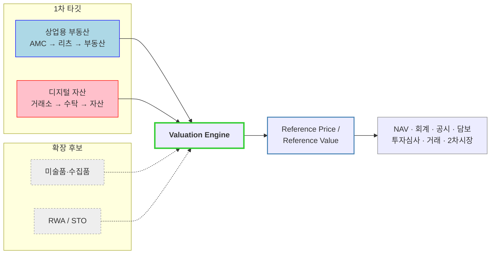

# Market Segment Map — 자산 가치평가 인프라

TAM-SAM-SOM이 "얼마나 큰가"를 답한다면, 세그먼트 맵은 **"누가 먼저 돈을 낼 것인가"** 를 답합니다.

---

## 1. 두 시장은 같은 제품으로 팔 수 없다

이 사례의 가장 중요한 판단입니다. 상업용 부동산과 디지털 자산은 **고객이 돈을 내는 이유가 다릅니다.**

| 축 | 상업용 부동산 | 디지털 자산 |
|---|---|---|
| **핵심 문제** | 평가 지연 | 가격 신뢰성 |
| 왜 생기나 | 거래가 드묾 | 시장이 24/7, 거래소별 시세 상이 |
| 평가 주기 | 월 / 분기 | 초 ~ 일 |
| 핵심 고객 | AMC · 증권사 · 은행 | 거래소 · 수탁 · 증권사 |
| **핵심 제품** | Dynamic Valuation | Reference Pricing |
| 제공 가치 | 현재가치 업데이트 | 신뢰 가능한 기준가격 |
| ARPU | 중 ~ 고 | 고 |
| 고객 수 | 많음 | 적음 |
| 구매 속도 | 느림 | 상대적으로 빠름 |

**상위 개념으로 묶고 하위를 나누는 구조**로 정리됩니다.

```
Institutional Valuation Infrastructure
"거래가 없거나 시장이 분산된 자산도 금융기관이 신뢰할 수 있는 현재가치를 제공한다"
   │
   ├── CRE Valuation API              (상업용 부동산 — 평가 지연 해결)
   └── Digital Asset Reference Price API  (디지털 자산 — 가격 신뢰 해결)
```

두 시장의 문제를 **`신뢰할 수 있는 기준가 인프라의 부재`** 라는 하나의 문제로 묶은 것이 이 포지셔닝의 핵심입니다.

## 2. 상업용 부동산 — 고객 우선순위

| 고객 | Pain | 지불의사 | 예상 연간 계약 |
|---|:---:|:---:|---:|
| 대형 부동산 AMC | ★★★★★ | ★★★★★ | 5,000만 ~ 1억 원+ |
| 증권사 부동산금융 | ★★★★★ | ★★★★★ | 5,000만 ~ 1.5억 원 |
| 부동산 펀드 운용사 | ★★★★★ | ★★★★★ | 3,000만 ~ 8,000만 원 |
| 부동산 플랫폼 / STO | ★★★★★ | ★★★★☆ | 3,000만 ~ 1억 원 |
| 은행 / 보험사 | ★★★★☆ | ★★★★★ | 5,000만 ~ 2억 원 |
| 리츠 | ★★★★☆ | ★★★★☆ | 2,000만 ~ 6,000만 원 |
| **일반 부동산 보유자** | ★★☆☆☆ | ★☆☆☆☆ | 건당 과금 — **제외** |

### 고객 계층 구조

| 계층 | 대상 |
|---|---|
| **1차** | 리츠 AMC, 부동산 자산운용사, 부동산신탁사, 증권사 부동산금융 부서, 부동산 펀드 운용사 |
| **2차** | 은행, 보험사, 저축은행, 캐피탈, 기관투자자, 회계법인 |
| **3차** | 부동산 플랫폼, 조각투자·STO 사업자, 부동산 유동화 플랫폼 |

> 💡 **최우선 타깃은 66개 AMC 중 상위 10~20개.** 이유는 확장 구조 때문입니다 — **1개 고객 → 수십 개 리츠 → 수백 개 부동산.** 계약 1건으로 데이터 사용량이 수백 자산분으로 늘어납니다.

## 3. 디지털 자산 — 고객 계층

| Tier | 고객 | 규모 | 필요로 하는 것 |
|---|---|---:|---|
| **1** | 거래소 | 18개사 | 실시간 가격, 거래소별 가격차, 거래량, 유동성, 이상가격 탐지, 기준가격, 상장·상폐 기준 데이터 |
| **2** | 커스터디·수탁기관 | 9개사 | 보유자산 평가, NAV, 고객자산 평가, 회계, 리스크 관리, 담보가치 |
| **3** | 증권사 · STO · RWA 사업자 | — | 토큰 기초자산의 현재 가치 증명 |

**Tier 3가 장기적으로 가장 중요합니다.** RWA는 `실물자산 → 토큰 → 금융상품` 순으로 전환되는데, 이때 반드시 필요한 것이 **"그 토큰의 기초자산이 지금 얼마인가"** 이기 때문입니다. 3~5년 후 비중이 커질 세그먼트입니다.

### 차별화 지점 — 가격(Price)과 가치(Value)의 분리

일반 데이터 사업자가 제공하는 것:

```
BTC  =  거래소 A 100  |  거래소 B 101  |  거래소 C 99
```

이 서비스가 제공하는 것:

```
Reference Value = 100.2
```

유동성, 거래량, 시장별 신뢰도, 이상거래, 가격 괴리, 시간가중가격, 시장충격, 거래소별 가중치를 반영해 **금융기관이 회계·NAV·담보 산정에 쓸 수 있는 기준가**를 만듭니다. 단순 가격 API보다 높은 단가를 받을 근거가 여기서 나옵니다.

## 4. 확장 후보 — 미술품

동일한 "가치평가 인프라" 모델을 자산만 바꿔 적용할 수 있는 영역입니다. 검토 결과 **단순 확장 후보가 아니라 첫 번째 진입 시장(쐐기) 후보**로 평가됐습니다.

| 지표 | 값 | 기준 |
|---|---:|---|
| 국내 미술시장 총 거래금액 | 6,151억 원 | 2024 |
| 2025년 상반기 경매 낙찰 | 5,048점 / 564.2억 원 | 8개 경매사 |
| 낙찰가 500만 원 미만 비중 | **75.7%** | 2025 상반기 |
| 초기 목표 | 10~30개 기관 · 약 9.4억 원 ARR | — |

**핵심 근거**: 금융위원회가 미술품 조각투자의 **가격 산정 정보 비대칭 문제를 공식 지적**했고, 2022년 증선위가 조각투자를 **투자계약증권**으로 판단했습니다. 문제의 존재를 우리가 설득할 필요가 없는 시장입니다.

→ 상세: **[04_미술품-버티컬-검토.md](04_미술품-버티컬-검토.md)**

## 5. 세그먼트 맵 종합



---

## 6. 세그먼트 맵 작성에서 배울 점

**① 고객 수보다 확장 계수를 보라**
AMC는 66개뿐이지만 1곳이 수백 개 자산을 물고 옵니다. 반대로 일반 부동산 보유자는 수십만 명이지만 1회성 거래입니다. **세그먼트 크기를 '고객 수'로만 재면 판단을 그르칩니다.**

**② 지불의사와 구매 속도를 따로 보라**
원문의 판단이 정확합니다 — 고객 수는 상업용 부동산이 많지만, **지불의사와 구매 속도는 디지털 자산이 더 높을 가능성**이 있습니다. 초기 매출을 만드는 것은 큰 세그먼트가 아니라 **빨리 결제하는 세그먼트**입니다.

**③ 제외한 세그먼트를 기록하라**
일반 부동산 보유자를 왜 뺐는지가 명시되어 있습니다("반복적으로 데이터를 쓰는 고객이 아님"). 이유가 남아 있어야 나중에 확장 순서를 정할 수 있습니다.

**④ 같은 제품처럼 보여도 문제가 다르면 나눠라**
부동산과 디지털 자산을 하나의 제품으로 팔면 안 된다는 판단이 이 맵의 결론입니다. 상위 개념(Valuation Infrastructure)으로 묶되 제품은 분리하는 구조가 나온 이유입니다.
