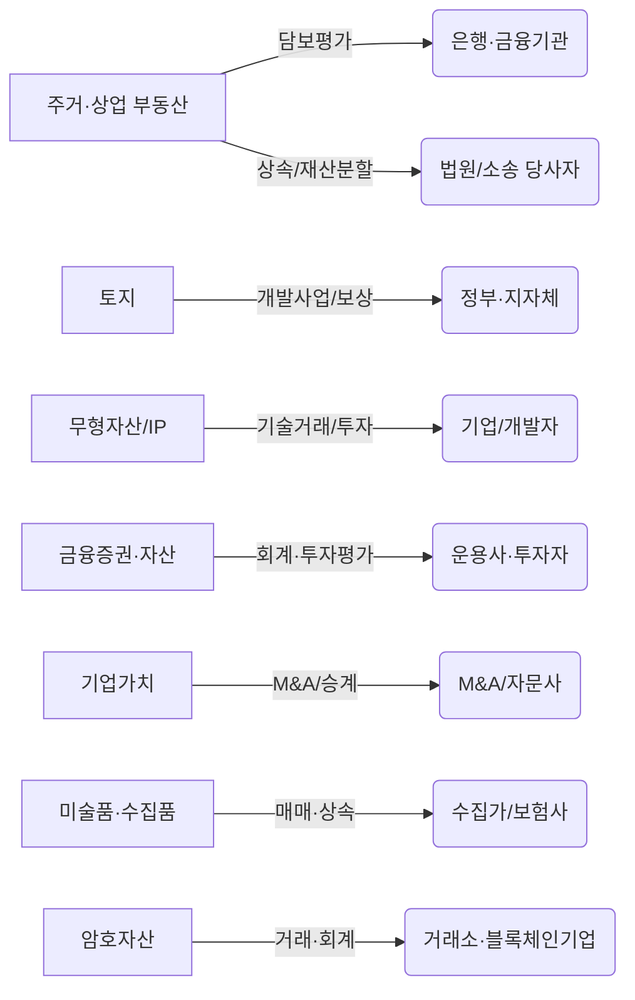

# 요약  
본 보고서는 자산가치평가 서비스를 위한 주요 자산군(주거용·상업용 부동산, 토지, 기계·장비, 무형자산/IP, 금융증권, 기업가치, 예술품·수집품, 암호자산 등)을 정의하고, 각 자산군별 잠재 수요자(개인 소유자, 기관투자자, 은행·여신기관, 보험사, 과세당국, 법원·소송 당사자, M&A 자문사, 회계감사인, 자산운용사·패밀리오피스, 개발업체, 중개업체·마켓플레이스, 수집가, 거래소·DAO 등)를 프로파일링하였다. 각 고객군별로 주요 평가 목적(대출담보 설정, 회계·재무보고, 세무(상속·증여·법인세), 소송·보상, 매매·투자 결정, 보험보상 등)과 트리거(부동산 매매, 금융조달, 상속·증여, M&A 거래, 회계 결산, 소송·분쟁 발생 등), 수요 빈도, 요구되는 보고 범위/기준(회계기준·감정평가실무기준·법령 등), 예산 수준 및 가격 민감도, 의사결정자와 조달 경로, 주요 규제·컴플라이언스, 고객 니즈 및 페인포인트를 분석하였다. 예를 들어, **부동산 담보대출**의 경우 국내 주요 은행들은 내부평가가 아닌 외부 *감정평가법인*을 통해 대출담보 평가를 의뢰하도록 법적으로 규정되어 있다. **상속·증여세 신고**를 위한 부동산·주식 평가는 국세청 규정에 따라 2인 이상의 감정기관 평가액 평균을 시가로 인정한다. **특허·지식재산(IP)**의 경우 한국발명진흥회(KIPA)의 ‘SMART5’ 시스템처럼 특허기술의 권리성·기술성·활용성 등을 정량평가하여 기업 투자·사업화 의사결정에 활용한다. 최근에는 금융위원회가 2024년부터 모든 기업에 암호자산 회계처리 감독지침을 적용해 암호자산의 분류·평가 기준을 강화했다. 이와 같은 조사 결과를 바탕으로, 자산군별·세그먼트별 **시장 진출 전략**과 **서비스 패키지**를 제안한다. 예컨대, 은행·금융기관 고객에 대해서는 *신속·정확한 담보평가 서비스*와 “감사인증 보고서”를, 기업 고객에 대해서는 *IFRS/세무용 공정가치평가*를, 개인 상속·소송 고객에는 *포괄적 자산평가·컨설팅*을 제공할 수 있다. 또한 고객 수요에 따른 **가격 구간**(예: 단순 자산감정수수료 vs. 맞춤형 컨설팅)과 **판매채널**(직접영업, 제휴·제안입찰, 디지털 플랫폼 등)을 설정한다. 마지막으로, 각 자산군별 리스크 및 규제 준수 체크리스트(예: **감정평가법**, 상속세법, IFRS 13, 가상자산법 등 준수)를 제시하여 서비스 제공 시 주의사항을 정리했다.  

| **자산군**         | **주요 고객(수요처)**                                  | **평가 목적/필요성**                                             | **대표적 트리거·빈도**                   | **적용 기준·규제**                                                 |
|------------------|-----------------------------------------------------|--------------------------------------------------------------|----------------------------------------|-----------------------------------------------------------------|
| **주거용 부동산**    | 개인(주택 소유자·매수자, 상속인), 은행·여신기관, 보험사, 법원·소송 당사자, 부동산 중개업체 등 | - 주택담보대출 및 담보 설정 - 부동산 매매·양도 결제 - 상속·증여세 신고용 시가 산정 - 이혼·재산분할·보상 소송용 객관적 가액 산정 | 주택 거래 시, 대출 신청 시 상속·증여·이혼 시 매분기/매년(대출심사·회계결산) | - 「감정평가 및 감정평가사에 관한 법률」 (감정평가 법) - 국세청 상속재산 평가 기준 - 금융기관 내부통제지침, 금융감독규정 - IFRS 13(공정가치) 및 주택·양도세법 |
| **상업용 부동산**    | 자산운용사·투자회사, 법인 기업(매도자/매수자), 은행·보험사, REIT·펀드, 개발업자, 세무당국 등 | - 프로젝트파이낸싱·PF 대출 - 기업투자·매각 가치평가(M&A) 및 회계처리 - 투자물건 가격결정 - 종합부동산세·법인세용 가치평가 | 부동산 투자·대출 시 기업 매각·합병 시 분기결산·연말결산 시 | - 부동산 감정평가 실무기준 - 자산운용업법(재산평가 시 준수) 및 관계 법령 - IFRS(투자부동산의 공정가치 회계) |
| **토지·개발용지**   | 개발업체·시행사, 은행·여신기관, 지방정부/공공기관, 농민(농지연금 등)          | - 개발사업 타당성 검토 (사업성 평가) - 토지담보대출·사업비 조달 - 공익사업 보상금 산정 (수용·협의취득) - 상속·증여세·양도세용 가치평가 | 개발사업 기획 단계 대출 실행 시 수용·보상 통지 시 농지연금 신청 시 | - 「토지보상법」, 「농지법」, 「도시개발법」 등 - 감정평가법·부동산 거래신고법 - 상속세·증여세법 기준 - 개발사업 관련 행정지침 |
| **기계·장비·동산**  | 제조업체·건설사 등 법인, 은행·리스사·VC, 보험사(보험보상), 관세청 (폐기감가) 등 | - 설비 대출담보 및 리스금융 담보평가 - 보험금 산정을 위한 장비가치 평가 - 기업 인수합병 시 영업권·설비가치 평가 - 회계상 유형자산 재평가/감가상각 검증 | 생산설비 투자·재무검토 시 대출·리스 개시 시 M&A 거래 시 보험사고·폐기 시 | - 자산평가 실무기준 (동산평가) 지침 - 은행 내부 자산관리 규정 - IFRS(재평가모형 적용기업) - 관세법(면세/폐기 감가) |
| **무형자산/IP**    | 기술·바이오기업, 벤처·스타트업, 대학·연구소, 기업 지식재산 팀, 투자자(VC, PE), 세무·법률 자문사 | - 특허·기술·상표 권리 이전·라이선스 평가 - R&D 자산화 및 세무(연구개발비 과세) 평가 - M&A·펀드레이징을 위한 기업가치 산정 - 회계상의 무형자산 공정가치 측정 | 기술이전·라이선스 계약 시 정부 R&D 지원사업 검토 시 M&A나 투자 유치 시 연말결산·감사 시 | - 지식재산권법 및 기술거래촉진법 - KIPA 특허분석평가시스템 통한 평가 지침 - IFRS(사업결합·무형자산 공정가치) 및 세법 |
| **금융증권·대체자산** | 자산운용사(PEF·VC), 사모펀드, 기업재무팀, 감사인, 증권사, 연기금·보험사 등      | - 비상장주식·펀드지분 공정가치 평가 (K-IFRS 1039) - 채권·파생상품 일일 가치평가(금융감독원 기준) - 포트폴리오 성과평가 및 펀드 평가 - M&A 대상기업의 지분가치 산출 | 인수합병·투자 심사 시 회계연도 결산 시 기업공개(IPO) 준비 시 분기별 리포트 작성 시 | - K-IFRS 1039, IFRS 13(비시장성지분의 공정가치) - 자본시장법, 금융상품평가 관련 가이드 - 증권거래소·금융당국 공시기준 |
| **기업/사업체 가치**  | 기업경영진, 회계감사인, M&A 자문사, PE/VC, 인수자/매수자, 공정거래위원회 등     | - 기업인수합병(M&A) 시 지분·영업권 가치평가 - 경영권 매매·지분투자 의사결정 지원 - 가업승계·상속세 신고용 기업가치 산정 - 재무제표상 영업권 및 투자자산 공정가치 측정 | M&A 협상·거래시점, IPO/상장 시 분기·연말 결산 시 상속·증여 발생 시         | - IFRS 3(사업결합), IFRS 13 - 공정거래법(경영권 프리미엄 평가 관련), 상속세법 - 기업재무제표 작성기준, 정부 가이드라인 |
| **미술품·수집품**    | 개인 수집가·컬렉터, 미술관·박물관, 경매회사(소더비·K옥션), 화랑·딜러, 보험사, 유산관리 회사 | - 작품 매각·구입 시 시장가치 평가 - 상속·기부 신고용 자산평가 - 보험 가입·보상 시 작품가치 산정 - 분쟁 소송(저작권·진위) 관련 가치 확인 | 작품 매매·경매 시 상속·증여 시, 보험갱신 시 위작·분쟁 발생시           | - 「문화재보호법」, 「미술품거래법」 (미술품에 한정) - IFRS(예술품 보유기관 회계처리) |
| **암호자산·디지털자산** | 가상자산 거래소·지갑 사업자, 블록체인 스타트업, 기관투자자(트레이딩 회사), 금융회사의 디지털자산 팀, 감사인 | - 암호화폐·토큰 프로젝트의 백서 기반 수익모델 평가 - 거래소 고객자산 회계처리 및 재무제표 작성 - 디파이·NFT 자산 포트폴리오 평가 - 세무·회계 보고를 위한 시가평가 | 토큰 발행·ICO 시, 거래소 상장 시 회계연도 결산(‘24년부터 의무) 규제 준수를 위한 정기 평가 | - 금융위 “가상자산 회계처리 감독지침” (2024년부터 의무적용) - 「가상자산업자 등에 관한 법률」 (이용자 보호 규정) |

## 주요 자산군별 고객 프로필  

- **주거용 부동산:** 개인 보유주택의 경우 은행 대출담보와 주택 매매 시 감정평가가 필수적이다. 국토부는 최근 “은행이 자체평가를 하는 대신 감정평가법인에 의뢰”하도록 법적 해석했다. 이는 담보대출 대출액 결정 기준이므로, 국내 주요 은행(KB국민, 신한, 우리, 하나 등)과 보험사(삼성생명 등)가 주요 고객이 된다. 개인 상속·증여나 이혼·재산분할의 경우에도 상속인·피상속인·당사자가 감정평가를 의뢰한다. 상속세 신고 시 국세청은 “2인 이상의 공신력 있는 감정기관이 평가한 평균액”을 시가로 인정하며, 이 경우 개인은 물론 상속세 신고 대행 세무사들도 의뢰인이 될 수 있다. 또한, 법원 소송(이혼재산분할, 무단점유 손해배상 등)에서는 법원 감정인이 한 번의 감정기회로 가액을 산정하므로, 조정·의견서 제출을 포함한 종합평가가 요구된다. 이밖에 **주택담보대출** 수요는 주기적으로 발생하므로 높은 빈도를 가진다. 주택 보유자 입장에서는 시장가격 결정과 세금 절감, 대출승인 등을 위해 전문가 감정이 필수이며, 은행은 공정성·법적 적법성 확보를 위해 외부 평가사를 선호한다.

- **상업용 부동산:** 상업용 건물·오피스·상가·물류센터 등은 규모가 커 전문성이 요구된다. 주요 고객은 법인 부동산 운용사, 리츠·부동산펀드, 개발업체, 지주회사 등이다. 이들은 개발·투자 타당성 평가, 금융조달(프로젝트파이낸싱) 전 평가, 매각·합병(M&A) 시 실사, 회계재무(B/S 공정가치, 부채인식) 등을 위해 감정평가를 의뢰한다. 예를 들어, PF사업자나 증권사는 대규모 부동산을 건설 전후로 담보가치를 산정하며, 부동산투자회사나 증권사는 신규 투자의사결정용으로 평가를 요청한다. 회계기준상 투자부동산은 공정가치 모형이 적용될 수 있어 기업의 회계담당자와 감사인 역시 고객이다. 트리거로는 부동산 거래, 대출 실행, 회계연도 말 결산, 법인세 신고(종부세) 등이 있다. 상업용 부동산 평가는 일반적으로 보고서 분량이 길고 맞춤형이며, 은행·투자자 신뢰를 위한 엄격한 감리·인증을 포함하는 경우가 많다.

- **토지:** 개발사업용 대규모 토지나 농지는 개발업체와 지방정부, 농민이 수요자로 등장한다. **개발사업**의 경우, 시행사는 사업타당성 분석을 위해 토지 평당가치를 평가받는다. 분양대금을 기초로 건물·용지 가치를 분리 평가하기도 한다. **수용·보상** 목적으로는 도로·공공사업 시행자가 법적보상 기준으로 감정평가를 의뢰한다(「토지보상법」). 농지의 경우 농업인 대상 **농지연금**(토지를 담보로 연금 수령) 신청 시 농업은행·지자체가 현 시가 감정을 요구한다. 토지는 주로 단위면적가치를 평가하는 정형화된 작업이 많으며, 국토교통부 고시지가·국세청 기준시가 등을 참고한다. 그러나 개발계획·인근 거래 사례 등의 조정이 필요해 전문성이 높다. 한국토지주택공사(LH) 등 공공기관도 지방공사 및 보상사업에서 평가사를 선정한다.

- **기계·장비·동산:** 제조업체나 건설회사 등 법인은 설비투자 전후로 자산가치를 확인하기 위해 평가를 받는다. 특히 은행·리스사는 공장 설비나 건설기계를 담보로 대출·리스를 내주기 전 기계기구 감정평가를 의뢰한다. 예를 들어 IBK기업은행은 현대·기아차 협력업체의 공장 기계설비, 선박건조사를 위한 선박자산 등을 평가한 사례가 있다. 보험사는 화재·재해 발생 시 장비 교체 비용을 산정하기 위해 감정평가서를 요구하기도 한다. 기계장비 평가에서는 잔존가치, 대체비용, 가동수익 할인모형 등 기업 가치평가 기법이 활용되며, 고가장비일수록 평가 비용이 높고 의뢰 빈도는 설비 도입 주기에 따른다. 기계장비 평가보고서는 일반 부동산보다 현황조사와 원가·수익 접근이 중요하므로 보고서 범위와 데이터 요구량이 크다.  

- **무형자산/IP:** 특허, 상표, 소프트웨어 등 무형자산은 규모 있는 기술기업, 스타트업, 대학·연구소, 투자회사가 수요자이다. 지식재산(IP) 평가는 기술 거래·라이선스 협상, R&D 과제 타당성, M&A 과정의 가치 반영, 회계장부상의 무형자산 인식 등을 위해 이루어진다. 예컨대 한국발명진흥회는 AI 기반 특허 가치평가 플랫폼 ‘SMART5’를 구축하여 특허별 권리성·기술성·활용성을 정량 평가하고, 이를 통해 “투자자의 투자 의사결정”을 지원한다고 밝히고 있다. 또한, 창업자금이나 기술이전 시 세법 혜택을 위해 과세표준 산정 목적으로 평가를 의뢰하기도 한다. 고객층은 지식재산 전략을 중시하는 대기업부터 기술집약 중소·벤처기업까지 다양하다. 무형자산 평가는 전통적 감정평가보다 시장비교의 어려움이 크며, 특허인증감정사 등 전문 인력이 필요하다.

- **금융증권·대체투자자산:** 일반 상장 주식·채권은 시장가격이 명확하나, 비상장주식·사모증권·구조화상품 등의 가치는 평가가 필요하다. 주요 고객은 자산운용사(PEF·VC), 연기금·보험사, 기업재무팀, 회계감사인이다. 상장되지 않은 지분이나 대체투자(구조화채권, 파생상품)에 대해서는 한국자산평가 같은 전문평가기관이 “비상장법인의 지분 상속·양수도·자산가치” 산정 등 다양한 목적의 공정가치 평가 서비스를 제공한다. 금융기관은 자체적 리스크관리나 회계처리를 위해 부도채권(NPL), 투자증권의 매일 가치평가를 요청하기도 한다. 특히 연결재무제표상의 금융상품 평가(평가기준률 적용 등)는 금융감독원과 회계기준이 요구하는 사항이므로 관련 부서가 고객이 된다. M&A 거래나 투자심사 시에는 목표기업의 자산·주식가치를 감정평가 받는 사례가 많으며, IFRS에 따른 공정가치 측정이 필요하다.

- **기업/사업체 가치평가:** 기업 전체의 가치평가는 M&A, 주식매각·지분투자, 가업승계, 내부 회계결산 등 다양한 상황에서 이루어진다. M&A 자문사나 대기업 인수부서는 피인수회사의 기업가치 산정을 위해 재무·시장 접근 방법을 복합 적용한다. 중소·가업승계 기업은 상속·증여세 절감을 위해 전문가에게 기업가치평가를 의뢰한다. 또한, 상장사나 대기업은 회계감사를 위해 분기·연말에 연결대상 자회사 및 자회사 보유 부동산·설비의 가치를 공정가치로 평가받기도 한다. 고객은 경영진·재무담당자·감사인·법무팀 등이며, 보고서는 종종 IFRS·GAAP 수준의 감사보고용으로 작성된다. **공정거래위원회**도 기업결합 심사 시 경영권 프리미엄 등을 검토하므로, 관련 자료 제출을 위해 감정평가가 활용된다. 기업가치 평가는 복잡한 재무모형과 시장분석을 요구하므로 높은 요금이 책정되며, 의뢰 빈도는 M&A 거래 시기나 회계주기별로 변동적이다.

- **미술품·수집품:** 고가 미술품·골동품·와인·보석류 등은 개인 소장품이나 미술관/박물관 자산으로, 소유자·경매사·딜러·보험사가 주요 고객이다. 미술품 구입·판매 시 시장가치를 산정하기 위해, 전문 감정기관 혹은 협회 기준에 의한 감정평가를 의뢰한다. 상속·기부 시에는 세무신고용으로 미술품 가격을 평가하며, 이때는 보통 미술평론가·감정평가사의 보고서를 첨부한다. 또한 보험가입·보상 때 건물·시설 화재에 따른 보상액 책정을 위해 미술품 감정이 이루어지기도 한다. 법적 분쟁(가품 진위 소송, 저작권 다툼)에서는 감정평가가 핵심 증거가 된다. 한국미술협회 등의 표준감정기준에 따라 작품의 희소성·작가명성·시장거래사례를 평가하는 것이 일반적이다. 고객별로 허락권·진위여부 등 각종 부대조사가 요구되므로, 보고서는 전문분야 조사까지 포함한 형태다.

- **암호자산(가상자산):** 가상자산 거래소와 블록체인 기업이 주된 고객으로 부각된다. 코인·토큰 발행기업은 화이트페이퍼에 명시된 수행의무 이행 후에만 수익을 인식해야 한다는 회계지침에 따라, 토큰의 경제적 가치를 검증해야 한다. 거래소는 고객 예치 자산의 회계처리를 위해 자산·부채 인식 기준을 명확히 해야 하며, 금융당국은 2024년부터 모든 K-IFRS 기업에 *가상자산 회계처리 감독지침*을 적용한다. 이에 따라, 거래소·블록체인 업체들은 암호자산의 분류(무형자산 vs 금융상품), 고객위탁자산 통제권 판단 등의 기준에 기반한 평가 리포트를 요구받는다. 기관투자자·헤지펀드도 포트폴리오 리스크 관리를 위해 주요 암호화폐의 시장가치와 변동성을 분석한 자료를 구매한다. 암호자산 평가는 기술적 복잡성과 높은 변동성, 규제 변화에 따른 불확실성으로 인해 전문가 컨설팅 수요가 점차 증가하는 추세다.  

## 고객 세그먼트별 제안 전략 및 패키지  
- **금융기관·대출담당자 대상:** *신속·정확한 담보평가*가 핵심이다. 주거·상업 부동산, 기계장비, 토지 등을 담보로 한 평가 상품을 표준화하여 패키지로 제공하고, 법적요건 준수를 강조한다. 예를 들어, 은행·리스사가 선호하는 “감정평가 인증서(PAS Report)”나 “감사인 검토용 감정보고서”를 준비하며, 디지털 팩스/이메일을 통한 결과보고를 지원한다. 가격은 범용 부동산(주택·상가)은 수백만~천만 원대, 복합·개발사업용 부동산과 특수 기계장비는 그 이상의 고부가가치로 책정한다. 영업 채널로는 은행 리스크관리팀과 직접 거래망 구축, 금융기술 컨퍼런스 참가, 신용평가사 연계 제휴 등을 활용할 수 있다.

- **기업·회계담당자 및 감사인 대상:** IFRS/GAAP 공정가치평가 서비스를 중심으로 한다. 기업회계팀, 재무담당 임원, 외부 감사인이 주요 고객이므로 *회계 기준 준수*와 정밀분석을 강조해야 한다. 사업결합 시 인수기업·피인수기업 가치평가(PPA), 투자부동산 재평가, 무형자산 공정가치평가, 금융상품·파생상품 평가 등을 패키지화한다. 부동산·기계장비·영업권 등 각 자산군별 IFRS 보고용 감정패키지를 운용할 수 있다. 가격은 대기업/글로벌 기업의 컨설팅 수준으로 높게 책정되나, 전문성이 반영된 만큼 가격 저항은 낮다. 회계법인·감사법인과의 제휴를 통해 영업을 전개하거나, IFRS 적용 기업 대상 세미나 및 웹세미나를 통한 홍보가 효과적이다.

- **개인·중소기업(상속·소송) 대상:** 상속세·증여세 신고, 이혼재산분할, 자산관리 컨설팅 목적의 종합 서비스를 제공한다. 과세당국 기준에 맞춘 감정평가서 작성과 함께, 법률 자문 네트워크 연계 서비스를 패키지로 구성할 수 있다. 일반 개인의 경우 비용 부담이 큰 편이므로, 가격대는 간단한 단독 주택 감정평가 100만 원대부터 시작하여, 다가구·상가·농지 등 추가 자산별로 단계적 요금표를 제시한다. 판매 채널로는 상속·증여 전문 세무회계 법인, 법무법인과 협업하거나, 부동산 중개사무소와의 연계를 통해 홍보한다. 예를 들어, *“상속재산 종합컨설팅 패키지”*를 통해 감정평가(부동산·주식), 세무신고 서류 준비, 절세전략 수립 등을 함께 제공할 수 있다.

- **투자자·자산운용사 대상:** 벤처·PE 투자, 부동산 투자, 대체투자 운용사 등을 위한 전문 평가 서비스를 제안한다. 예를 들어, **벤처기업평가 서비스**는 스타트업 지분의 비시장성 평가(한국자산평가 NMEPS)와 성장가능성 분석을 결합한 패키지를 구성할 수 있다. 부동산펀드나 인프라 펀드 운용사에는 프로젝트 파이낸싱의 자산가치 평가 보고서를 제공한다. 암호자산 투자자에게는 블록체인 프로젝트 백서 기반 가치평가, 거래소의 자산보유 평가 서포트(회계감독지침 대응) 서비스를 판다. 이들 고객은 전문성에 따라 가격 민감도가 낮아 비교적 높은 단가가 가능하며, 1개 자산에 수천~수억 원까지 다양하다. 투자 컨퍼런스, 업계 간행물, 로드쇼 등을 통해 접점을 늘린다.

- **지자체·공공기관 대상:** 도시개발, 토지수용, 공영개발 등을 위한 보상평가 및 도시정비 평가 사업 수주를 추진한다. 정부·지방자치단체 입찰에 참여하거나, LH·국토부 등과 MOU를 맺어 장기 계약을 확보한다. 이 시장은 경쟁이 치열하므로 서비스 품질(법규준수, 투명성)을 강조해야 하며, 수수료는 협상제를 택한다.  

- **예술·컬렉터 시장:** 갤러리·옥션하우스, 컬렉터를 대상으로 **미술품 감정 및 인증 패키지**를 제공할 수 있다. 예컨대 고미술품은 감정가·진위감정·수리비 산정 등을 포함한 종합보고서를, 예술품은 감정평가사와 전문가 의견을 결합해 낸다. 보험사와 제휴해 미술보험 상품 판매시 감정평가를 연계 판매하는 방안도 있다. 이 시장은 비용 민감도보다는 감정의 신뢰성·전문성이 중요하다.

## 가격대 및 판매채널  
서비스 가격은 자산군, 평가 목적, 보고서 범위에 따라 넓게 산정된다. 일반적인 부동산담보평가는 중소형 주택 기준 100–500만원대, 상가·오피스 등 대규모 부동산은 수천만원 수준이다. 기업가치평가나 포괄평가는 수백만원에서 수천만원, 복잡한 M&A평가는 수천~수억원까지 올라갈 수 있다. 무형자산·미술품 평가는 고부가가치 자산 대상이므로 일반적으로 고정관념 이상(수백만~천만원대)이다. 암호자산 평가와 같이 신규 수요는 초기엔 상대적으로 낮은 수요이므로 파일럿 프로젝트 형태로 낮은 단가(수백만원)부터 시작해 신뢰도에 따라 상승시킬 수 있다.  

판매채널로는 **직접영업**(금융기관·대기업 대상), **제휴채널**(회계·법무법인, 부동산 중개·PFV사, 옥션하우스, 기술거래소 등과 협력), **온라인 마케팅**(업종별 세미나, 웹사이트 콘텐츠, LinkedIn/B2B 플랫폼), **입찰·제안사업**(공공기관 발주, 기업 RFP 응찰)을 혼합 운영한다. 또한, 감정평가사협회·부동산연구원 주최 행사 참여, 산업별 지표 보고서 발간 등을 통해 브랜드 인지도를 높인다. *“감정평가 + 컨설팅”*이나 *“데이터 기반 평가툴”*을 결합한 혁신적 패키지를 개발해 PropTech적 접근을 강조하는 것도 차별화 포인트가 될 수 있다.  

## 위험요인 및 준수사항 체크리스트  
- **법적·윤리적 준수:** 「감정평가법」에 따른 자격·등록 요건 준수, 이해관계자 분리, 외부 기관 의뢰 의무(은행 자체평가 금지) 등 법령 위반 방지. 회계감사·조세신고의 기초자료로 활용될 경우, 해당 법규(세법, 공정거래법, 가상자산법 등)와 K-IFRS 적용 여부를 정확히 파악해야 한다.  
- **보고서 품질관리:** 표준감정평가집·RICS Red Book 등 국제기준의 원칙(공정성·전문성·충실성) 준수. 검증 가능한 데이터 및 논리, 상세한 가정 명시(백서·시장자료 활용 시). 민감도 분석을 포함하여 불확실성 리스크를 설명할 것.  
- **분쟁·소송 리스크:** 법원감정 기회는 일반적으로 1회에 한정되므로, 부당이득청구나 재산분할 사건 대응 시 최초 감정 평가서 제출의 중요성을 안내해야 한다. 결과가 의뢰인에게 불리할 때 재감정 기회가 제한적임을 경고하고, 객관적 자료 준비를 강조한다.  
- **규제 변화 모니터링:** 암호자산 회계처리감독지침(2024년 시행) 등 최신 가이드라인 적용 여부를 계속 확인. 국세청·지자체의 감정평가 심의 기준, 상속세 관련 과세 지침 변경 등이 발생하는지 주기적으로 점검한다.  
- **데이터·정보관리:** 비밀유지 의무에 따라 민감 정보(재무제표, 사업계획서, 소송자료 등) 보호. 의뢰인 승인 절차, 개인정보 취급 방침을 엄격히 운용한다.  
- **분쟁 대비:** 평가결과에 대한 이의제기나 손해배상 청구 위험에 대비해, 계약서에 면책조항 및 보상 한계 규정을 명시하고 전문보험(공제) 가입을 검토한다.  

이상과 같이 각 자산군별 수요자와 이용 목적을 종합 분석하였으며, 고객 세그먼트별 맞춤 서비스 포지셔닝 및 가격·채널 전략을 제안하였다. 본 자료의 인사이트를 기반으로 한국 시장 특성을 반영한 종합적 서비스 기획이 가능할 것이다.  

**출처:** 한국 국세청·금융위원회·감정평가사협회 등 공식자료 및 업계 인터뷰.