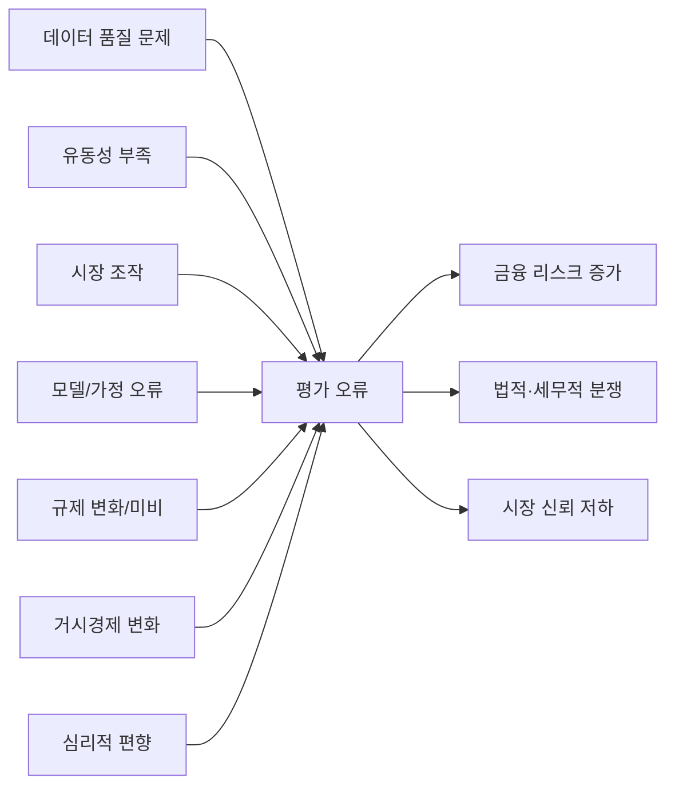

# 요약 (Executive Summary)  
이 보고서는 상업용 부동산과 디지털 자산(암호화폐·NFT·토큰)의 가치평가 방법, 오류 원인과 사례, 오류로 인한 문제점 및 이해관계자별 영향을 종합 분석한다. 부동산 평가는 주로 수익환원법(직접환원법)과 할인현금흐름법(DCF), 거래사례비교법 등을 사용하며, 디지털 자산 평가는 온체인 메트릭(활성 주소·거래량 등), 시장심리 지표, 가치모형(재고흐름, Metcalfe의 법칙 등) 등을 활용한다.  

평가 오류의 주요 원인은 **데이터 품질 저하**(불완전한 거래정보), **유동성 부족**, **시장조작**(워시트레이딩·펌프앤덤프), **모델 및 가정 오류**, **규제 불확실성 및 거시환경 변화**, **심리적 편향** 등이다. 예컨대 개발사·감정평가사 공모에 의한 허위 매매계약 및 과대평가 사례, 암호화폐 거래소 운영자의 허위거래 및 허수주문 조작 사례, NFT 세탁거래 등으로 시장가격이 인위 조작된 사례가 대표적이다.  

이러한 오류는 금융위험(과도한 대출·손실), 법적·세무적 분쟁, 거래 왜곡, 리스크 관리 실패, 시장 신뢰 저하 등을 초래한다. 예를 들어 국내 은행의 자체 감정평가 관행으로 담보가가 과대 산정되어 부실 대출 위험이 증가할 우려가 제기되었으며, Terra·FTX·업비트 사태 등 암호화폐 붕괴는 투자자 피해·규제 강화 요구로 이어졌다. 이해관계자별로는 투자자(투자판단), 대출기관(담보관리), 감정평가사(평가산출), 개발업자(자금조달·사업타당성), 규제당국(시장감독), 거래소(상장·가격관리) 등이 있으며, 각자 필요로 하는 평가서비스의 산출물·정확도·주기·데이터원이 상이하다. 이에 따라 이해관계자별 수요표를 작성했다.  

오류 축소를 위해서는 **데이터 인프라 고도화**(실거래가·블록체인 데이터 개방), **평가기준 표준화**, **독립적 감사·검증체계** 마련, **스트레스 테스트** 도입, **규제 개선**(감정평가제도·가상자산 규율) 등이 필요하다. 이를 우선순위별로 정리하고 실행 난이도를 평가하였다.  

---  

## 1. 가치평가 주요 방법론 및 가정  
- **상업용 부동산:** 전통적으로 **수익환원법**과 **거래사례비교법**이 활용된다. 수익환원법은 단일 기간 또는 잔여법으로 구분되며, 예를 들어 *직접환원법*은 단일기간 순수익을 적정 환원율로 환원해 가치 산정한다. *할인현금흐름법(DCF법)*은 미래 임대수익·처분가액을 할인해 현재가치를 구한다. 거래사례비교법은 유사 자산의 거래가액을 보정하여 대상물건 가액을 산정하는 방법이다. 주요 가정으로는 안정적 임대수익 추정, 적정 할인율·환원율 설정, 정상 거래 사례의 확보 등이 있다. 예를 들어 **직접환원법**은 건물은 경제적 내용연수까지 보유하며 토지가치는 일정하다고 가정하고 순수익을 환원율로 나눠 가치를 산정한다. **DCF법**은 불확실성을 반영하기 위해 현금흐름과 환매가치를 기간별로 할인하는 방식으로, 보유기간 동안 변동 가능한 수익예측·위험 프리미엄 등을 고려한다.  

- **디지털 자산:** 가격 결정 메커니즘이 다양하다. 암호화폐·토큰은 **온체인 메트릭**(활성 주소 수, 거래량, 네트워크 해시레이트 등)과 **시장심리 지표**를 활용하며, 고유 모델을 적용한다. 주요 평가 모델로는 *재고흐름모델*(Stock-to-Flow), *Metcalfe 법칙*(네트워크 가치 ∝ 사용자 수 제곱), *총유효시장(TAM)*, *생산비용모델*, *화폐수량설*, *토큰 이코노미 기반 DCF* 등이 있다. NFT는 거래사례 비교(유사 작품의 최근 거래가)와 희소성, 커뮤니티 활동성 지표(바닥가, 희귀도 지표) 등을 종합한다. 시장초기 단계인 NFT·메타버스 분야는 전통적 EV/EBITDA 방식보다 사용자 수(MAU), 거래총액(GMV) 등 플랫폼 성장성 지표를 대안으로 사용한다. 가정으로는 블록체인 네트워크의 활용도, 토큰 이코노미의 지속가능성, 커뮤니티 참여도, 기술적 변화 등을 고려한다.  

- **공통 가정:** 모든 자산평가에서 기본적으로 정상 시장거래를 전제로 한다. 즉, 정상적인 투자 수요/공급 하에서 가격 형성이 이뤄져야 하며, 비정상적 이벤트(거품, 조작 등)는 가정에서 배제된다. 또한 과거 데이터(거래사례, 온체인 이력)를 미래 추정의 기준으로 삼는 점, 가산금리나 인플레이션율 등 거시변수의 추정에 의존하는 점이 공통된다. 부동산은 지역 시장 동향·임대료 추이·금리환경 등을 전제로 하며, 디지털 자산은 네트워크 효용성, 경쟁구도, 규제변화 등을 반영한다.  

## 2. 평가오류 원인과 사례  
평가오류는 다양하고 복합적인 원인에서 발생한다. 주요 원인별 국내외 사례는 다음과 같다.  

- **데이터 품질 문제:** 부동산은 실거래 데이터 누락·조작, 비교가능 사례 부족이 문제다. 예를 들어 정부 조사 결과, 시세를 높이기 위해 허위로 신고했다가 취소하는 ‘실거래가 띄우기’ 사례가 적발되었다. 내부 감정평가에서는 은행이 드물게 거래되는 상가·단독주택을 자체 조사해 시가보다 높게 책정하는 사례도 있었다. 디지털 자산은 거래소별·시점별 이질적 데이터가 문제다. 거래소 간 시세 편차, 일부 거래소의 허위거래(워시 트레이딩)로 데이터 정확도가 낮다. 암호화폐 거래소 업비트 운영진은 회원계좌에 자산이 없는데 1,221억원을 예치한 것처럼 시스템을 조작하는 방식으로 35개 코인에 걸쳐 *허위 자전거래*와 *허수주문*(매매체결 가능성이 매우 낮은 주문)을 남발했다. 이로써 2개월간 4조2천억원 규모의 가장매매와 254조원대의 주문이 허위로 입력되어 거래량이 과대 부풀려졌다. 이처럼 블록체인에는 기록이 남지만 정보 검증이 어려워 잘못된 데이터가 평가에 반영될 수 있다.  

- **유동성 부족:** 거래량이 적은 자산에서는 소량의 거래만으로 시세가 크게 변동한다. 부동산에서도 대형 프로젝트 부지나 일부 상업시설 등 거래가 드문 자산은 기준 사례 확보가 어렵다. NFT 시장은 특히 거래가 활발하지 않은 토큰이 많아 단일 거래로도 가격을 왜곡시킬 수 있었다. 예를 들어 2021년 NFT 열풍 당시 다수 컬렉션은 발행 이후 실제 시장에서 거의 거래되지 않았는데, 일부 소수 높은 가격의 매매만 언론에 노출되며 ‘가격이 급등한 것처럼’ 보였다. 유동성 부족은 저유동 자산에 대한 과대평가 리스크를 키운다.  

- **시장 조작:** 부동산 시장에서는 개발사·중개업자·감정평가사 등이 공모해 허위계약서나 과대평가서를 작성함으로써 가격을 인위 부풀리는 사기 사례가 있다. 위 사례처럼 감정평가사가 사실보다 훨씬 높은 감정가를 발급하면, 해당 물건의 가치는 객관적 시가와 괴리되며 평가오류가 발생한다. 디지털 자산 시장은 조작행위가 빈번하다. 암호화폐 거래소 자체의 *가장매매*(내부 매도/매수)에 의한 거래량 부풀리기, 거래소 밖 개인·단체에 의한 *펌프앤덤프*(과도한 매수로 가격을 띄운 뒤 매도) 등이 대표적이다. 예컨대 2017년 서울남부지검은 업비트 운영진이 개발한 매매 봇으로 시세를 경쟁사가격보다 높여 비트코인을 매도하는 식으로 2만6천명에게 11,550개 BTC(약 1,491억원)를 고가 매도토록 기망하여 편취했다고 기소했다. NFT 시장에서도 체이널리시스 조사에 따르면 262명의 워시트레이더가 25회 이상 NFT 자전거래를 반복했으며, 전체 거래량 34억달러 중 상당수는 세탁거래로 부풀려졌다. 조작은 시장 가격 신호를 왜곡해 평가 결과를 크게 벗어나게 한다.  

- **모델/가정 오류:** 잘못된 가정이나 비현실적 수치 설정도 오류를 유발한다. 부동산 DCF에서 추정 임대료 상승률·공실률을 낙관적으로 잡거나, 금리·할인율 산정이 부정확하면 가치가 크게 달라진다. 전통적으로 고정자산은 감가상각을 고려하나, 일부 간단한 환원법은 건물 가치를 기간 말에 0으로 가정하기도 하는데, 현실과 괴리될 수 있다. 디지털 자산에서는 신기술·사업모델 수명이 짧은데도 오래 유지되는 것으로 간주하는 오류, 실제 유동 인구보다 과도한 사용자 수를 전제로 Metcalfe 법칙을 적용하는 오류 등이 예다. 예를 들어, DCF법의 한계를 극복하고자 확률적 DCF(시나리오 기반 몬테카를로) 기법이 소개되지만 복잡성으로 널리 쓰이지는 않는다.  

- **규제 및 거시환경 변화:** 법·제도 변화나 금리·경기 변동은 평가에 영향을 준다. 부동산은 금융위기나 금리인상 국면에서 가치가 급격히 변할 수 있는데, 평가 시점과의 시차로 적시 반영이 어렵다. 예를 들어, 코로나 이후 오피스 공실 증가와 금리 인상으로 오피스 시세가 급락했지만 과거 데이터에 기반한 평가가 유지될 위험이 있다. 암호화폐는 각국 규제 움직임(증권성 판단, 과세 방향)과 거시 위험회피 현상(위험자산 선호도 하락)의 영향을 크게 받는다. 특히 미지의 규제 환경 하에서 평가 모델이 자주 바뀌고, 안정적 할인율을 선정하기 어렵다.  

- **심리적 편향:** 인간의 인지편향도 오류 요인이다. 낙관 편향·후광 효과(유명 프로젝트 선호), 손실회피(손실 자산을 버티는 경향) 등이 시장가격에 반영된다. NFT 시장에서는 투자자들이 *수익난 자산은 빨리 매도하고 손실난 자산은 버티려는 경향*으로 인해, 상대적으로 거래된 상승 트랜잭션이 시장 가격을 과도하게 끌어올렸다. 또한 미디어가 성공 사례만 강조하며 시장 붐을 조장함에 따라(언론 보도의 자기충족), 실상이 왜곡되는 악순환이 생겼다. 부동산 시장에서도 유명 프로젝트 호재나 과거 고점 잣대로 현재 가치를 과대평가하는 사례가 있다.  

## 3. 오류의 결과와 이해관계자별 영향  
평가오류가 발생하면 금융·법률·세무·거래·리스크 관리·시장 신뢰 등 다방면에 걸쳐 문제가 나타난다. 주요 영향과 이해관계자별 파급효과는 다음과 같다.

- **금융적 문제:** 평가가 과대계상되면 대출기관은 과도한 담보대출로 채무불이행(NPL) 위험이 커진다. 국내외 사례로, 미국 은행들이 상업용 부동산 담보대출을 대량 취급하면서 금리 상승기에 연체가 급증했고, 부실이 부채위험으로 전이되었다. 감정평가서의 과대평가는 부동산 대출의 자산건전성을 악화시켜 금융기관 손실로 직결된다. 반대로 과소평가는 담보경쟁력 저하로 대출제한을 초래한다. 투자자도 잘못된 평가를 기반으로 매입하면 자산가격 하락 시 큰 손실을 본다. 암호화폐의 경우, 잘못된 가치평가에 따른 과도한 레버리지 투자는 개인투자자 파산사례로 이어지며, 기관투자자 역시 펀드 손실을 입는다. 이러한 금융충격은 투자 수요 위축을 낳고, 전체 시장의 변동성을 증가시킨다.  

- **법적·세무적 문제:** 허위·부실 평가는 법적 책임으로 이어질 수 있다. 국내법상 *허위감정죄* 등으로 처벌되거나, 투자자·채권자의 손해배상 소송 대상이 된다. 앞서 본 분양사기 사례처럼 감정평가사가 조작에 가담했다면 사기죄나 공모 혐의가 적용되며, 관련자는 형사처벌을 받을 수 있다. 국외에서도 평가 오류로 인한 소송이 빈번하다. 디지털 자산에서는 회계·세무처리가 애매해 탈루 유인이 크다. 암호화폐 매매차익을 적정하게 신고하지 않거나, 시세 변동 반영 없이 세금을 누락하면 추징·가산세 위험이 있다. IMF 보고서에 따르면 디지털 자산 급증으로 세금 시스템이 선행 준비되지 않으면 부가가치세(VAT)나 소득세 누락으로 국가세수 감소가 우려된다.  

- **거래 및 시장 운영 문제:** 시장 왜곡을 초래한다. 잘못된 평가정보는 매매·대차거래의 효율성을 저해한다. 예를 들어, NFT 시장에서 조작된 거래가 시장가격 기준 역할을 함에 따라 신규 투자자들이 유입되었고, 조작이 멈추자 가격이 급락하는 순환으로 발전했다. 디지털 자산 거래소는 상장 기준을 잘못 설정하거나, 상장 심사 시 부실 평가로 가치가 낮은 코인이 거래되면 시장 전체 신뢰도를 훼손한다. 부동산 시장에서는 평가서 신뢰도가 떨어지면 채권시장 리츠(REITs) 등 파생상품의 가격 신뢰성도 악영향을 받는다.  

- **리스크 관리 부실:** 평가오류는 리스크 계산을 부정확하게 만든다. 금융기관은 부동산 담보대출의 담보가치를 과대평가하면 건전성 규제(RWA) 산정이 왜곡되고, 충당금 적립이 부족해진다. 자산운용사·연기금은 부동산·디지털 자산 펀드의 순자산 가치(NAV) 산정 오류로 투자위험을 오판할 수 있다. 내부감사나 스트레스테스트가 부정확한 기초값에 의존하면 위기대응 역량이 약해진다.  

- **시장 신뢰 저하:** 반복적 오류는 시장에 대한 신뢰를 훼손한다. 투자자는 잘못된 정보 때문에 피해를 입으면 해당 시장을 기피한다. 디지털 자산 분야에서는 Terra·FTX 등 대형 붕괴 후 “암호화폐는 사기”라는 인식이 퍼졌다. 테라 사태로 미 규제기관이 스테이블코인 안정성에 경고를 발했으며, 재닛 옐런 미 재무장관은 재무안정성 위험을 우려해 의회에 규제 강화를 촉구했다. 이처럼 평가오류는 규제당국과 일반시장의 불신을 불러와 자산의 제도적 발전을 저해한다.  

- **이해관계자별 영향:** 주요 이해관계자에 미치는 구체적 영향은 다음과 같다:  
  - **투자자:** 부동산·암호화폐 투자자는 올바른 가격정보를 기반으로 투자 판단을 한다. 과대평가된 자산에 투자하면 가치하락 시 손실이 커지고, 신뢰도 저하로 투자심리가 위축된다. 특히 디지털 자산 투자자는 가치평가 모델 불확실성으로 인해 예상치 못한 손실 위험이 크다.  
  - **대출기관(은행·금융사):** 담보대출 심사 시 감정평가를 이용한다. 부실 감정평가는 대출금 부실화로 이어져 재무건전성을 위협한다. 최근 국내 은행들은 내부 감정평가 관행을 개선하기 위해 외부 감평 의무 강화가 추진되고 있다.  
  - **감정평가사:** 평가전문가로서 오류 발생 시 법적·윤리적 책임이 따른다. 오류 사례가 많아지면 제도·기준에 대한 신뢰가 약화되어 감정평가사의 직업적·경제적 평판이 손상될 수 있다.  
  - **개발업자·프로젝트 주최자:** 부동산 개발자나 암호화폐 프로젝트 주체는 자금 조달을 위해 평가를 활용한다. 실제 가치보다 높게 평가받으면 대출·투자유치에 유리하나, 추후 시장가격과 괴리 시 자금회수가 어려울 수 있다. 사업계획 수립 단계에서 비현실적 수익가정을 사용하면 프로젝트 실패 위험이 커진다.  
  - **규제기관:** 금융위원회·금융감독원·국세청 등은 시장 안정성과 투자자 보호를 위해 평가정보를 활용한다. 오류로 인한 시장 혼란은 규제개입의 명분이 되며, 명확한 규제·기준 마련 필요성이 커진다. 한편 국내외에서 감정평가 제도 개편 논의가 활발해졌으며, 암호화폐 규제 강화 움직임도 나타나고 있다.  
  - **거래소:** 부동산 중개 플랫폼이나 암호화폐 거래소는 자산 가격 지표를 제공한다. 비정상적 평가가 의심되면 상장폐지 심사, 경고 공지 등이 필요하다. 암호화폐 거래소의 투명성 결여가 드러나면 국내외 거래소 신뢰도와 이용자 안전이 위협받는다.  

 *[그림 1] 평가오류의 주요 원인과 결과 요약 (개념도, 예시).*  

(위 개념도는 평가오류를 발생시키는 요인들과 그로 인한 주요 결과를 요약적으로 보여준다.)  

## 4. 이해관계자별 평가서비스 수요 (표)  
다음 표는 이해관계자별로 필요로 하는 평가서비스의 목적, 산출물 유형, 정확도·주기·데이터 원천 등의 요구사항을 정리한 것이다.  

| 이해관계자     | 목적/사용처                 | 필요한 산출물      | 정확도/신뢰수준            | 주기/시점            | 데이터 원천                       |
|-------------|-------------------------|---------------|---------------------|------------------|-------------------------------|
| 투자자 (개인·기관) | **투자 판단:** 투자대상 자산의 적정가치 판단 | 시장가격 지표, 분석 리포트, 시세 동향 | 높은 정확도(오차 최소), 객관적 신뢰도 요구 | 상시(일일~주간 주기)   | 부동산: 실거래가, 임대료 통계 디지털: 거래소 가격·온체인 데이터 |
| 대출기관 (은행 등)  | **대출 심사·위험관리:** 담보가치 평가 및 신용분석    | 감정평가서, 감정보고서       | 매우 높은 정확도(담보안전성)  | 대출 실행 및 재심사 시 | 부동산: 공시지가·실거래가, 임대정보 디지털: 적정 시가, 법적∙회계분류 |
| 감정평가사        | **평가 제공:** 감정평가서 작성                  | 감정평가 보고서          | 표준 준수·전문가 신뢰도   | 수시 (의뢰 시)      | 부동산: 현장조사, 과거 평가 사례 디지털: 프로젝트 정보, 시장동향 |
| 개발업자 (사업주)  | **자금조달·사업타당성:** 투자유치, 대출담보      | 가치평가서, 수익성 분석    | 중상 수준(금융기관 제출용) | 프로젝트별(분양前, 승인 전 등) | 부동산: 시장분석 리포트, 비용·수익 예측 디지털: 커뮤니티 규모, 토큰발행량 |
| 규제당국 (정부)   | **감독·정책:** 시장안정성 모니터링, 조세 기준 마련   | 시장지표 보고서, 통계     | 중간(~높음) (정책수립 참고)   | 정례(분기, 연간)   | 부동산: 공시지가, 거래지수 디지털: 산업보고서, 거래소 공시 |
| 거래소·플랫폼     | **상장 심사·정보제공:** 자산 가격제공·유통공시    | 시세정보, 상장심사자료     | 중상(시장공시 수준)        | 실시간~일일     | 부동산: 리스팅 가격, 중개업체 정보 디지털: 온체인 데이터, 프로젝트 자료 |

(**표:** 이해관계자별 가치평가 서비스 요구사항)  

## 5. 오류 축소를 위한 권고안과 실행 우선순위  
평가오류를 줄이기 위해 다음과 같은 기술적·제도적 개선을 권고한다. 우선순위(Priority)와 실행난이도(Difficulty)를 가늠한다.  

- **데이터 인프라 강화 (우선순위: 높음, 난이도: 중)**: 정확한 평가를 위해 데이터 수집·개방이 필수다. 부동산은 공공 데이터베이스(실거래가, 임대료 등)의 정합성·투명성 강화를, 디지털 자산은 온체인·오프체인 지표의 집계·공시 시스템 구축을 권장한다. 블록체인 특성 상 이미 메타데이터가 공개되므로 이를 활용한 검증·분석 플랫폼 개발을 촉진한다. 예: NFT·토큰의 거래내역 추적·분석 툴 개발, 부동산 실거래 공개시스템 고도화.  
- **표준화 및 기준 마련 (우선순위: 높음, 난이도: 중)**: 감정평가 기준 강화 및 디지털 자산 평가표준화가 필요하다. 예를 들어 **디지털 자산에 대한 회계·평가기준**을 명확히 하고(현재까지 미국 IRS나 IFRS에서 시가원칙 인정, 국제적 기준은 미확립), **감정평가사법** 등 법령상 감정평가 위탁 요건을 엄격히 적용한다. 부동산은 시장 특성(용도·위치)에 따른 평가매뉴얼 고도화, 디지털 자산은 자산 유형별 모델 가이드라인(스테이블코인 vs 플랫폼 코인 vs NFT) 개발이 필요하다.  
- **감사·검증 제도 도입 (우선순위: 중, 난이도: 높음)**: 제3자 감사를 강화하여 평가보고서의 적정성을 검증한다. 부동산 감정평가서에 대한 내부 통제 및 외부 감사(예: 은행의 RWA 검증)를 강화한다. 디지털 자산은 스마트 컨트랙트 감사, 오라클 검증 등 기술적 검증 메커니즘을 채택하고, 거래소는 상장·거래내역 감시를 위한 자동화 시스템(이상거래 탐지 알고리즘) 도입을 권장한다. 이는 *독립성 확보*를 위한 제도적 장치이기도 하다.  
- **스트레스테스트 및 시나리오 분석 (우선순위: 중, 난이도: 중)**: 거시충격 시 평가모델의 안정성을 점검한다. 부동산 시장의 금리 급등·경기침체, 암호화폐의 급락 시나리오를 반영한 스트레스 테스트를 실시해 취약성을 관리한다. 예: 부동산 담보대출 포트폴리오에 대한 시나리오별 가치 하락 충격 분석, 암호화폐 펀드의 블랙스완 이벤트 영향도 평가. 이를 통해 평가 불확실성을 정량화하여 리스크한도를 설정할 수 있다.  
- **규제 개선 및 감독 강화 (우선순위: 높음, 난이도: 중)**: 평가산출의 독립성과 투명성 확보를 위해 규제 개선이 필요하다. 부동산은 **감정평가업법**의 시행을 통해 평가독립성을 제고하고, 외부감정 위탁 의무를 법제화해야 한다. 디지털 자산은 금융·자산 규제(가상자산사업자, 증권성 판단)를 명확히 하고, 자산 분류 및 보고 체계를 정비해야 한다. 규제당국은 AML/CFT 규정과 연계하여 가치평가 왜곡 행위를 단속하고, 필요 시 과징금·형사처벌 수준을 상향 조정한다.  
- **교육·인식제고 (우선순위: 중, 난이도: 중)**: 감정평가사, 투자자, 개발자 대상 평가 리스크 교육을 강화한다. 특히 디지털 자산 투자자에게는 기술적 이해를 높여야 하며, 잘못된 정보에 의존하지 않도록 경고한다. 부동산 분야도 애널리스트 교육과 평가사 윤리 교육을 통해 객관적 감정관행을 정착시킨다.  

위 권고안은 평가 오류를 구조적으로 줄이는 데 기여할 것으로 기대한다. 특히 데이터 인프라와 표준화는 당장 추진 가능한 과제이며, 감사·검증과 규제 개선은 장기적으로 실행 가능성을 타진해야 한다.  

---

**출처:** 국내외 감정평가 관련 법령 및 제도, 한국감정평가사협회·국토교통부 문헌, KCMI·PwC·IMF·디센터·SBS·Economy Korea·법무법인 보고서 및 학술 논문 등을 인용하여 분석했다. 표와 도표는 이해를 돕기 위한 예시이다.