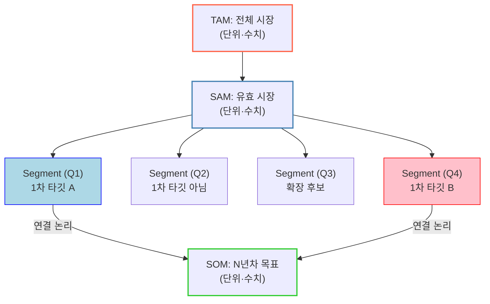

# 템플릿 — TAM-SAM-SOM 시장 구조도

새 사례를 시작할 때 복사해서 쓰는 틀입니다. 세 층위 + 세그먼트 사분면 + SOM 연결 구조를 담고 있습니다.

---

## Mermaid 구조도



## 채워야 할 항목

### 세 층위

| 층위 | 정의 | 규모 | 산정 방식 | 출처 |
|---|---|---|---|---|
| TAM | | | Top-down / Bottom-up | |
| SAM | | | | |
| SOM | | | | |

### 세그먼트

| 사분면 | 성격 | 역할 | 1차 타깃 여부 | 제외 사유 |
|---|---|---|---|---|
| Q1 | | | | |
| Q2 | | | | |
| Q3 | | | | |
| Q4 | | | | |

## 작성 시 점검 항목

- [ ] **층위 간 단위가 일치하는가** — TAM은 자산 스톡(조 원), SAM은 매출(억 원)처럼 단위가 갈리면 축소율을 계산할 수 없습니다. 갈린다면 축을 분리해 표기할 것
- [ ] **SAM이 Bottom-up인가** — "TAM의 10%" 같은 임의 비율은 근거가 아닙니다. `고객 수 × 단가`로 쌓을 것
- [ ] **세는 단위가 지불 주체인가** — 자산 개수가 아니라 구매 의사결정 단위로 셀 것 (예: 469개 리츠 ❌ → 66개 AMC ⭕)
- [ ] **TAM 구성 항목 간 중복은 없는가** — 서로 다른 통계가 같은 자산을 이중으로 셀 수 있습니다
- [ ] **제외한 세그먼트와 그 이유를 적었는가** — 빼지 않으면 SOM이 SAM과 구분되지 않습니다
- [ ] **지불 주체가 특정되는가** — 물량(톤·개수)으로만 표현된 시장 규모는 매출로 환산되지 않습니다
- [ ] **SOM이 매출까지 내려갔는가** — 기관 수에서 멈추면 사업계획서가 되지 않습니다
- [ ] **보수 시나리오가 SOM 하한과 정합적인가** — 보수 시나리오가 SOM 하한을 밑돈다면 하한이 보수적이지 않다는 뜻입니다

## 권장 작업 순서

```
고객별 실제 지불의사(WTP)
        ↓
   예상 계약단가
        ↓
   고객 Top 20~30 리스트
        ↓
   3년 매출 Forecast
        ↓
    TAM / SAM / SOM
```

TAM-SAM-SOM은 **맨 마지막**입니다. 시장 규모를 먼저 잡고 고객을 끼워 맞추는 게 아니라, 고객의 지불의사에서 위로 쌓아 올립니다.
