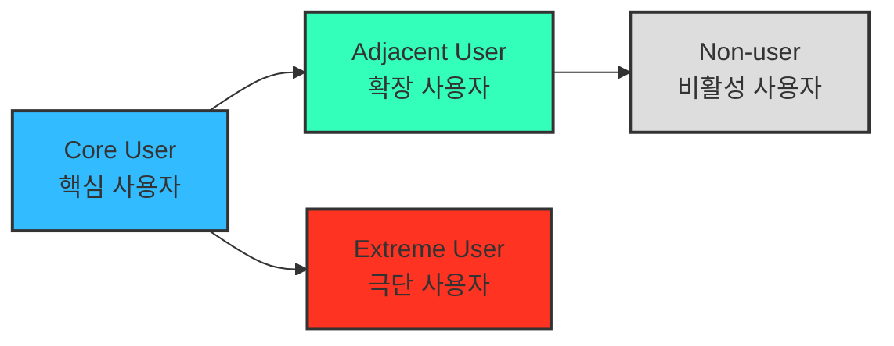

# 05 - 페르소나 · 페르소나 스펙트럼 · 고객 여정지도 (학습 노트)

## 1. **페르소나 (Persona)**

- 세그먼트가 **"어느 조직이 돈을 내는가"** 를 답한다면, 페르소나는 **"그 조직 안에서 누가, 언제, 무엇 때문에 제품을 여는가"** 를 답합니다.
- 세그먼트는 기관 단위로 세지만(예: AMC 66개), 계약서에 서명하기 전에 제품을 실제로 쓰는 것은 그 안의 한 사람입니다.
- 기본 카드에 반드시 들어가는 5개 필드입니다.

| 필드 | 무엇을 적나 | 흔한 실수 |
|---|---|---|
| **유형명** | 이 사람을 한 줄로 규정하는 별칭 | 직함만 적기 (`AMC 팀장` ← 문제가 안 보임) |
| **역할** | 조직에서 맡은 책임과 의사결정 범위 | 회사 소개를 옮겨 적기 |
| **주요 문제** | 지금 겪는 불편과 그 구조적 원인 | 우리 제품이 풀 수 있는 문제만 골라 적기 |
| **목표** | 문제가 해결된 뒤의 상태 | 제품 기능을 목표로 착각하기 |
| **사용 맥락** | 언제·어디서·어떤 형태로 쓰는가 | 비우기 — **제품 형태를 결정하는 필드** |

- **사용 맥락**을 비우면 모든 고객에게 같은 API를 파는 설계가 나옵니다. 같은 데이터라도 누구는 대시보드로, 누구는 일 마감 배치로, 누구는 실시간 API로 씁니다.

## 2. **페르소나 스펙트럼 (Persona Spectrum)**

> 더 정확한 방법으로 내 서비스를 둘러싼 "여러 유형의 페르소나와 유형별 특성"을 파악하고, 구체적인 사례까지 확인합니다!

- 극단적·비전형적 사용자까지 포함해 서비스의 **포용성(Inclusivity)** 과 **사용 맥락의 다양성**을 확보하는 분석 방법.

**페르소나 스펙트럼 유형별 설명**

| 구분 | 설명 | 목적 | 생성 포인트 |
| --- | --- | --- | --- |
| **핵심(Core)** | 이상적인 주요 고객군 | 주력 타깃 설정 | 매출/사용 빈도 중심 |
| **확장(Adjacent)** | 유사 문제를 가진 인접 시장군 | 확장 기회 탐색 | 유사 니즈/다른 맥락 |
| **극단(Extreme)** | 제약·극단적 상황을 가진 사용자 | 제품 개선 및 포용적 설계 | 실패·불편·대안 사용 중심 |
| **비활성(Non-user)** | 아직 사용하지 않거나 회피하는 집단 | 시장 진입 장벽 및 거부 요인 파악 | 인식·가치·신뢰 결여 중심 |

**페르소나 스펙트럼 도출 핵심 질문**

- (확장) "유사한 제품/서비스를 사용하고 있는 사람은 누구인가?"
- (비활성) "이 제품/서비스를 `사용할 수 없는 사람`은 누구인가?"
- (극단) "가장 자주 실패를 경험하는 사람은 누구인가?"

> 💡 AI 활용 방향:
> AI를 고객의 '다양한 가능성'을 빠르게 탐색하는 프로토타이핑 파트너로 삼아 각 사용자 군의 맥락적 특성과 감정적 동기를 가상으로 생성

### ⚙️ **다중 페르소나 생성 및 평가 워크플로우**

> ⚠️ **아래 프롬프트는 워크플로우를 설명하기 위한 예제입니다 — 그대로 복사해 쓰지 마십시오.**
>
> | 왜 | 내용 |
> |---|---|
> | **사업 맥락이 빠져 있음** | *"핵심 사용자 5명을 만들어줘"* 만으로는 **어느 산업·어떤 구매 구조인지** 모릅니다. [실제 적용 사례](01_사례_자산가치평가.md)에서는 세그먼트 맵·시장 규모를 먼저 넣었습니다 |
> | **검증 지시가 없음** | 그대로 쓰면 **그럴듯하지만 근거 없는 카드**가 나옵니다. ④단계에서 *"어디까지가 문서로 확인된 사실이고 어디부터가 추론인지"* 를 분리하도록 지시해야 합니다 |
> | **규칙이 사업 구조와 충돌할 수 있음** | ②단계의 *"유형별 상위 1개"* 는 **단일 제품을 전제**합니다. 제품이 둘 이상이면 [규칙이 깨집니다](02_사례_자산가치평가_스펙트럼-종합.md) |
>
> **산출물 문서(01·02)에는 프롬프트를 남기지 않습니다.** 프롬프트는 방법론 설명에만 두고, 분석 결과에는 **판단과 근거만** 남깁니다.

| 단계 | 목적 | 프롬프트 예제 *(그대로 사용 금지)* | 산출물 |
| --- | --- | --- | --- |
| **① 1차 생성 (Divergent Thinking)** | 각 스펙트럼 유형별 3~5개 버전 생성 | "핵심 사용자 5명, 확장 사용자 3명, 극단 사용자 2명, 비활성 사용자 2명을 만들어줘. 각자는 이름, 직무, 문제, 목표, 감정, 대체 솔루션을 포함해." | 총 10~12개 페르소나 원본 |
| **② 2차 평가 (Convergent Filtering)** | 생성된 페르소나를 평가 및 선별 | "각 페르소나를 문제·행동·맥락의 현실성 기준으로 평가해, 상위 1개씩만 추천해줘." | 4개 대표 페르소나 (Core, Adjacent, Extreme, Non-user) |
| **③ 3차 보정 (Contextual Rewriting)** | 사업 주제에 맞게 언어 및 상황 맞춤화 | "우리의 서비스 맥락(예: SaaS 컨설팅 플랫폼)에 맞춰 다시 기술해줘." | 실제 적용 가능한 4종 페르소나 카드 |
| **④ 4차 검증 (AI Peer Review)** | 다중 AI 교차검증 | "이 4명의 페르소나가 실제 시장에서 존재할 확률과 근거를 설명해줘." | 검증 코멘트 요약 리포트 |
| **⑤ 5차 통합 (Spectrum Map)** | 페르소나 간 관계 구조화 | Mermaid / Figma로 시각화 | Persona Spectrum Map 완성 |

**①에서 5필드가 7필드로 늘어나는 점에 주목합니다.** 기본 페르소나의 5필드에 **감정**과 **대체 솔루션**이 추가됩니다.

| 추가 필드 | 왜 필요한가 |
|---|---|
| **감정** | 사람은 문제가 아니라 **불안·압박·좌절** 때문에 움직입니다. 구매 트리거는 대개 감정 쪽에 있습니다. |
| **대체 솔루션** | 지금 이 문제를 **무엇으로 버티고 있는가.** 진짜 경쟁자는 경쟁 제품이 아니라 엑셀과 "그냥 참기"인 경우가 많습니다. |

### 이 워크플로우를 쓸 때 주의할 점

- **②에서 유형당 1개로 줄이는 것은 카드를 버리는 게 아니라 대표를 뽑는 것입니다.** 나머지는 로스터로 남겨야 나중에 확장 순서를 정할 수 있습니다.
- **④ 검증은 "존재할 확률"을 숫자로 받는 데 목적이 있지 않습니다.** 근거로 댈 수 있는 **1차 통계·규제 사실이 있는지**를 확인하는 절차입니다. 근거가 없으면 그 페르소나는 가설로 표기해야 합니다.
- AI가 만든 페르소나는 **인터뷰 이전의 가설**입니다. 특히 `주요 문제`와 `사용 맥락`이 실무자 인터뷰에서 가장 자주 뒤집힙니다.

## 3. **고객 여정지도 (Customer Journey Map)**

- 스펙트럼이 **"누가 있는가"** 를 넓혔다면, 여정지도는 대표 페르소나 한 명을 골라 **"그 사람의 시간 축"** 으로 좁혀 들어갑니다.
- 스펙트럼의 산출물이 **인물**이라면, 여정지도의 산출물은 **구간**입니다. 어디서 막히고 어디서 마음이 바뀌는지를 시간 위에 배치합니다.

> 📄 **분량이 늘어 별도 문서로 분리했습니다 → [00-2_학습노트_고객여정지도.md](00-2_학습노트_고객여정지도.md)**
>
> 비즈니스 유형별로 단계가 달라진다는 원칙(가구·자동차 사례), 재사용 가능한 추출 5행, B2B 데이터 인프라의 고유 구간, 그리고 **단계를 고정하지 말라는 경고**가 그 문서에 있습니다.
