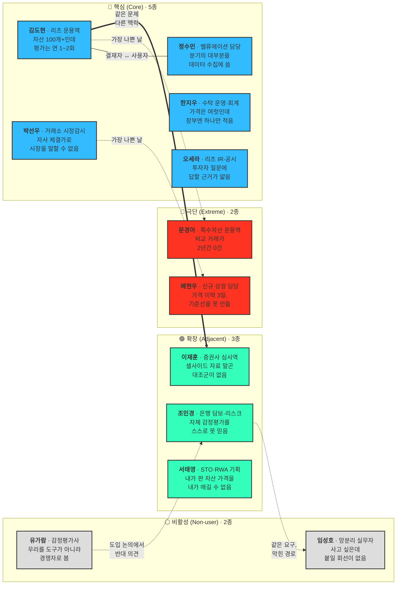

# ① 1차 생성 (Divergent Thinking) — 페르소나 원본 풀

**사례**: 자산 가치평가 인프라 (Institutional Valuation Infrastructure)
**단계**: [00_학습노트 §2 다중 페르소나 워크플로우](00_학습노트.md)의 **①단계**
**산출물**: 스펙트럼 유형별 원본 페르소나 **12종** (핵심 5 · 확장 3 · 극단 2 · 비활성 2)

> 📌 이 문서는 세그먼트 기반으로 작성했던 **일반 페르소나 추출 문서를 대체**합니다. 그 문서는 세그먼트 그룹당 1명씩 정리한 확정본이었지만, 워크플로우 ①단계는 **확정이 아니라 확산**입니다. 유형당 여러 후보를 겹치게 만들어 놓고, 선별은 ②단계에서 합니다.

> 🔴 **여기 12종은 ①단계 확산 시점의 기록입니다 — 최종 로스터가 아닙니다.**
> 이후 편입 검토로 **5종이 추가**됐고(백서현·조현우·남기훈·최도윤·하승우), 유형이 바뀐 카드도 있습니다. **[최종 로스터 11종은 스펙트럼 종합 §4-2](02_사례_자산가치평가_스펙트럼-종합.md)** 를 보십시오.

---

## 1. 원본 풀 배치도 — 12종 한눈에

| 선 | 뜻 |
|---|---|
| **실선(굵게)** | 같은 문제를 다른 맥락에서 겪는 확장 관계 |
| **실선(무지시)** | 같은 조직 안에서 결재하는 사람과 실제로 여는 사람 |
| **점선** | 확산 과정에서 **파생된** 관계 — 극단은 핵심의 최악의 날, 비활성은 확장의 막힌 경로 |

**점선 4개가 이 배치도의 핵심입니다.** 극단·비활성 4종은 새로 찾은 시장이 아니라 **이미 있는 페르소나에서 갈라져 나온 상태**입니다. 그래서 여기서 나오는 요구사항은 곧바로 핵심 제품 사양으로 돌아옵니다.

---

## 2. 확산 단계의 규칙

| 지켜야 할 것 | 하지 말아야 할 것 |
|---|---|
| 유형당 정해진 수를 **채운다** (핵심 5 · 확장 3 · 극단 2 · 비활성 2) | 만들면서 "이건 아닌 것 같은데" 하고 지운다 |
| 후보끼리 **겹쳐도 둔다** — 겹치는 지점이 ②단계의 판단 재료 | 처음부터 하나로 합친다 |
| **감정**과 **대체 솔루션**을 반드시 채운다 | 문제·목표만 적고 넘어간다 |
| 근거가 약한 항목은 약한 채로 적는다 | 그럴듯하게 다듬어 확신처럼 보이게 만든다 |

**인물명·연차는 가상입니다.** 실존 인물이 아니며, 인터뷰 이전의 가설을 사람 형태로 세워 본 것입니다. 각 카드 아래 *(세그먼트 출처)* 는 [04 세그먼트 맵](../04_tam-sam-som/02_사례_자산가치평가/02_market-segment-map.md)의 어느 그룹에서 나왔는지를 표시합니다.

---

## 3. 🔵 핵심 사용자 (Core) — 5종

### C-01. 김도현 — 리츠 운용역

*(1차 · 대형 부동산 AMC)*

| 필드 | 내용 |
|---|---|
| **직무** | 대형 AMC 리츠운용본부 9년차. 리츠 20여 개, 그 아래 부동산 100개 이상의 운용 성과와 공시에 책임을 집니다. |
| **문제** | 감정평가는 자산당 연 1~2회인데 시장은 그 사이에도 움직입니다. 금리가 오르고 공실이 늘어도 다음 평가까지 장부에는 옛 숫자가 남습니다. 자산이 수백 개라 외부 평가를 자주 돌릴 비용도 시간도 없습니다. |
| **목표** | 분기 공시·NAV에 쓸 수 있는 근거 있는 현재가치를 상시 확보하고, 그 근거를 투자자·감사인에게 설명할 수 있는 상태로 두는 것. |
| **감정** | 결산 직전의 불안. "이 숫자로 공시가 나가는데 근거가 6개월 전 평가서 한 장인가." 동시에 수백 개를 매번 평가할 방법이 없다는 무력감. |
| **대체 솔루션** | 연 1~2회 감정평가서 + 엑셀 롤포워드(직전 평가액에 임대료·금리 변동을 손으로 반영) + 매입팀에 전화로 시세 확인. |

### C-02. 정수민 — AMC 밸류에이션·리서치 담당

*(1차 · 대형 부동산 AMC — C-01과 같은 조직, 다른 자리)*

| 필드 | 내용 |
|---|---|
| **직무** | AMC 내부에서 평가 모델과 시장 데이터를 전담. 운용역이 쓸 밸류에이션 자료를 만들어 올리는 사람. |
| **문제** | 데이터를 모으는 데 시간의 대부분을 씁니다. 실거래·임대료·캡레이트를 여러 소스에서 긁어와 엑셀에 붙이는 작업이 매 분기 반복되고, 소스마다 기준이 달라 정합성 확인에 또 시간이 듭니다. |
| **목표** | 자료 수집을 줄이고 **모델을 다듬는 데** 시간을 쓰는 것. 숫자의 출처를 매번 다시 설명하지 않아도 되는 상태. |
| **감정** | 소모감. 전문성을 발휘하는 일이 아니라 옮겨 적는 일에 매여 있다는 자각. |
| **대체 솔루션** | 공공데이터 포털·부동산원 통계·CBRE 리포트를 직접 수집해 엑셀 병합. |

> 💡 **C-01과 겹칩니다.** 같은 조직·같은 문제인데 **결재하는 사람**과 **실제로 툴을 여는 사람**이 다릅니다. 이 겹침을 지우지 않고 ②단계로 넘깁니다.

### C-03. 박선우 — 거래소 시장감시·상장 심사 담당

*(디지털 Tier 1 · 거래소 18개사)*

| 필드 | 내용 |
|---|---|
| **직무** | 상장·상폐 판단, 이상거래 탐지, 공시 시세 제공. |
| **문제** | 자사 체결가가 시장 전체를 대표한다고 말하기 어렵습니다. 거래소마다 시세가 다르고, 워시트레이딩·허수주문 흔적이 데이터에 그대로 남습니다. 유동성이 얕은 종목은 소량 거래로 가격이 튑니다. |
| **목표** | 자사 가격을 외부 기준가와 대조해 괴리·이상을 즉시 잡아내고, 상장·상폐 판단에 제3자 근거를 붙이는 것. |
| **감정** | 사고가 터지면 이름이 남는다는 경계심. 못 잡은 조작 하나가 회사 신뢰를 무너뜨린 사례를 이미 봤습니다. |
| **대체 솔루션** | 자사 체결가 + 해외 인덱스 사이트 눈으로 대조 + 내부 룰 기반 알람. |

### C-04. 한지우 — 커스터디·수탁 운영/회계 담당

*(디지털 Tier 2 · 수탁 9개사)*

| 필드 | 내용 |
|---|---|
| **직무** | 고객 자산 보관, 보유자산 평가, NAV 산출, 회계 처리, 담보가치 산정. |
| **문제** | 거래소마다 가격이 다른데 장부에는 하나만 적어야 합니다. 어느 거래소의 몇 시 가격을 왜 골랐는지 감사인에게 설명해야 하는데, 디지털 자산은 회계·평가 기준 자체가 확립되지 않았습니다. |
| **목표** | 매일 같은 시각, 같은 방법론으로 산출된 단일 기준가. 값보다 **방법론과 이력이 남는 것**이 중요합니다. |
| **감정** | 방어적. 설명하지 못하면 회사의 문제가 아니라 내 판단의 문제가 됩니다. |
| **대체 솔루션** | "특정 거래소 종가를 쓴다"는 내부 규정 + 엑셀 스냅샷 보관. |

### C-05. 오세라 — 리츠 IR·공시 담당

*(1차 · 대형 부동산 AMC / 상장 리츠)*

| 필드 | 내용 |
|---|---|
| **직무** | 상장 리츠의 공시 자료 작성, 기관·개인 투자자 문의 대응, IR 자료 제작. |
| **문제** | 투자자가 "왜 이 자산 가치가 그대로냐"고 물으면 답할 근거가 얇습니다. 주가는 매일 움직이는데 기초자산 평가액은 반기마다 한 번 바뀌니, 괴리를 설명할 언어가 없습니다. |
| **목표** | 투자자 질문에 **숫자로 답하는 것.** 분기마다 "무엇이 왜 얼마나 변했는지"를 한 장으로 보여줄 수 있으면 됩니다. |
| **감정** | 곤혹스러움. 모르는 게 아니라 설명할 자료가 없어서 답을 못 하는 상황이 반복됩니다. |
| **대체 솔루션** | 직전 감정평가서 요약 + 시장 리포트 인용 + "시장 상황을 반영해 검토 중"이라는 표현. |

> 💡 **C-05는 세그먼트 맵에 없던 자리입니다.** 맵은 "구매 의사결정 단위(AMC)"까지만 봤는데, 확산 단계에서 그 안의 **가치 소비자**가 하나 더 나왔습니다. 구매력은 없지만 도입 명분을 만드는 위치일 수 있습니다.

---

## 4. 🟢 확장 사용자 (Adjacent) — 3종

> **도출 질문**: "유사한 제품/서비스를 사용하고 있는 사람은 누구인가?"

### A-01. 이재훈 — 증권사 부동산금융 심사역

*(1차 · 증권사 부동산금융)*

| 필드 | 내용 |
|---|---|
| **직무** | PF·부동산 담보대출·펀드 셋업의 심사와 사후관리. 딜을 태울지 판단하고, 태운 뒤 익스포저를 관리합니다. |
| **문제** | 감정평가서를 받는 데 수 주가 걸립니다. 그동안 손에 있는 밸류에이션은 셀사이드 것 하나뿐이고, 검증할 독립적 2차 의견이 없습니다. 딜 속도와 검증 깊이가 정면으로 충돌합니다. |
| **목표** | 심사 회의에 들고 갈 독립 기준가와 민감도(금리·공실 시나리오)를 며칠이 아니라 **당일에** 확보하는 것. |
| **감정** | 양쪽에서 눌리는 압박. 늦으면 딜을 뺏기고, 잘못 태우면 2~3년 뒤 자기 이름이 남습니다. |
| **대체 솔루션** | 셀사이드 자료 + 감정평가서 대기 + 업계 지인 전화. 급하면 직전 유사 딜의 캡레이트를 그대로 적용. |

### A-02. 조민경 — 은행 여신 리스크·담보평가 담당

*(2차 · 은행 / 보험사)*

| 필드 | 내용 |
|---|---|
| **직무** | 부동산 담보대출 포트폴리오의 담보가치 산정, 충당금·RWA 계산, 내부 스트레스 테스트. |
| **문제** | 자체 감정평가가 담보가를 시가보다 높게 잡는다는 지적이 이미 나와 있습니다. 담보 과대 산정은 부실대출·건전성 규제 왜곡으로 직결되는데, 재평가 주기가 길어 금리 상승기의 가치 하락이 늦게 잡힙니다. |
| **목표** | 포트폴리오 전체를 같은 기준으로 주기적으로 다시 재고, 외부·독립 출처로 내부 평가를 교차 검증하는 것. |
| **감정** | 감독당국 검사에서 지적당하는 것에 대한 공포. 그래서 신규 도입에 가장 보수적입니다. |
| **대체 솔루션** | 자체 감정평가 + 필요 시 외부 감평 의뢰. |

### A-03. 서태영 — STO·RWA 토큰화 사업 기획자

*(3차 · STO / 디지털 Tier 3)*

| 필드 | 내용 |
|---|---|
| **직무** | 실물자산을 토큰화해 발행·유통. 기초자산 가치를 투자자와 당국에 증명할 책임을 집니다. |
| **문제** | "이 토큰의 기초자산이 지금 얼마인가"를 발행자가 직접 말하면 **이해상충**입니다. 조각투자가 투자계약증권으로 판단된 뒤 공시·평가 요건이 붙었고, 2차 시장 호가의 기준도 없습니다. |
| **목표** | 발행 시 공모가 근거, 유통 중 정기 기준가, 청산 시 정산가. 정확도만큼 **제3자가 냈다는 사실**이 요구사항입니다. |
| **감정** | 절박함. 규제 요건을 못 맞추면 사업이 멈춥니다. 문제의 존재를 설득할 필요가 없는 유일한 후보. |
| **대체 솔루션** | 발행사 자체 산정 + 회계법인 의견서. |

---

## 5. 🔴 극단 사용자 (Extreme) — 2종

> **도출 질문**: "가장 자주 실패를 경험하는 사람은 누구인가?"

### X-01. 문경아 — 비교사례 0건 자산 운용역

*(신규 도출 — 세그먼트 맵에 없음)*

| 필드 | 내용 |
|---|---|
| **직무** | C-01과 같은 직무지만 포트폴리오가 다릅니다. 지방 중소도시 물류센터, 단일 호텔, 데이터센터, 지식산업센터처럼 **거래 자체가 거의 없는 자산**을 운용합니다. |
| **문제** | 이 사업의 전제인 "거래 사례로 현재가치를 추정한다"가 성립하지 않습니다. 반경 내 유사 거래가 2년간 0건인 자산이 있고, 있어도 규모·용도가 달라 보정이 억지가 됩니다. **평가 지연이 아니라 평가 불가**입니다. |
| **목표** | 값을 받는 것보다 **"이 자산은 데이터가 부족해 신뢰구간이 넓다"는 사실을 근거와 함께** 받는 것. 감사인에게 "왜 이 자산만 추정치인가"를 설명할 수 있으면 충분합니다. |
| **감정** | 체념과 경계. 여러 서비스를 써봤지만 자기 자산은 늘 "해당 없음"으로 나오거나, 더 나쁘게는 **그럴듯한 숫자가 나오는데 믿을 수 없습니다.** 시연에서 자기 자산을 먼저 넣어봅니다. |
| **대체 솔루션** | 인근 이종 자산을 억지 보정하거나 원가법(토지+건축비-감가). 그마저 안 되면 직전 평가액 이월. |

### X-02. 배현우 — 상장 3일차 신규 코인 담당

*(신규 도출 — C-03의 특정 국면)*

| 필드 | 내용 |
|---|---|
| **직무** | C-03과 같은 팀에서 신규 상장 직후 며칠을 관리합니다. |
| **문제** | 가격 이력이 며칠뿐이라 시간가중가격도 이상탐지 기준선도 만들 수 없습니다. 유동성이 얕아 소액으로 가격이 움직이고, **펌프앤덤프가 가장 잘 통하는 구간**인데 관측 도구가 가장 약합니다. |
| **목표** | 기준가를 억지로 만드는 것보다 **"아직 기준가를 낼 수 없는 상태"임을 시스템이 선언**해 주는 것. |
| **감정** | 무방비 상태의 긴장. 문제가 생기면 상장을 승인한 팀이 책임집니다. |
| **대체 솔루션** | 초기 며칠은 그냥 자사 체결가를 씁니다. |

---

## 6. ⚪ 비활성 사용자 (Non-user) — 2종

> **도출 질문**: "이 제품/서비스를 `사용할 수 없는 사람`은 누구인가?"

### N-01. 임성호 — 망분리 환경의 금융기관 실무자

*(신규 도출 — A-02와 요구사항이 같으나 전달 경로가 막힘)*

| 필드 | 내용 |
|---|---|
| **직무** | 은행·보험사·연기금의 리스크·운용 실무자. 문제도 예산도 있고 A-02와 요구사항이 사실상 같습니다. |
| **문제** | 제품의 문제가 아니라 **전달 경로의 문제**입니다. 내부망에서 외부 API를 호출할 수 없습니다. SaaS·API 형태로만 제공되면 검토 단계에서 자동 탈락합니다. |
| **목표** | 외부 회선을 열지 않고 같은 데이터를 받는 것. 일 1회 파일 전송이든 온프레미스든, **보안 심사를 통과할 수 있으면 형태는 상관없습니다.** |
| **감정** | 무력감. 좋은 도구가 있다는 걸 알고 도입도 원하지만 자기 권한 밖의 이유로 매번 막힙니다. 영업 미팅에 나와도 "저희는 안 될 겁니다"로 시작합니다. |
| **대체 솔루션** | 폐쇄망 안의 엑셀과 수기 계산. 외부 데이터는 개인 PC에서 확인해 손으로 옮겨 적습니다. |

### N-02. 유가람 — 감정평가사 *(평가 보조 도구 거부자로 한정)*

*(원본자료 이해관계자 — 회피·저항 집단)*

> ⚠️ **이 카드는 감정평가사의 여러 역할 중 "평가 보조 도구를 쓸 수 있는 사람"으로 범위를 좁힌 것입니다.** 감정평가사는 이 사업에서 대체재·판정 기준 공급자·도입 저지 영향자 역할도 동시에 갖는데, 그 셋은 사용 여부를 재는 스펙트럼 축으로 잴 수 없습니다. → [스펙트럼 밖 이해관계자 역할표](02_사례_자산가치평가_스펙트럼-종합.md)

| 필드 | 내용 |
|---|---|
| **직무** | 법정 감정평가서 작성. 오류 발생 시 법적·윤리적 책임을 지는 당사자입니다. |
| **문제** | 자동 평가 데이터가 자기 일을 잠식한다고 인식합니다. 동시에 **본인도 사례 부족과 데이터 접근에 시달립니다** — 즉 잠재 사용자이기도 합니다. |
| **목표** | 직역을 지키면서 평가 품질과 속도를 높이는 것. |
| **감정** | 방어적 적대. 고객사 내부 도입 논의에서 반대 의견을 내는 위치에 있습니다. |
| **대체 솔루션** | 본인의 경험과 현장조사 — **대체 솔루션이 곧 본인입니다.** |

---

## 7. 확산 과정에서 함께 나왔으나 카드로 쓰지 않은 후보

①단계의 규칙상 지우지 않고 남깁니다. ②단계에서 유형별 대표를 뽑을 때, 아래 후보가 위 12종보다 나을 수 있는지 함께 검토합니다.

| 후보 | 유형 | 남긴 이유 |
|---|---|---|
| 부동산 펀드 운용사 운용역 | 핵심 | C-01과 문제·맥락이 거의 같음. 별도로 세울 실익이 있는지 ②에서 판단 |
| 미술품 조각투자 플랫폼 운영자 | 확장 | 가격 주관성이라는 **다른 문제**를 가짐. 확장 슬롯 3개를 A-03과 다툼 |
| 감사·분쟁 소급 대응 담당 | 극단 | 빈도는 낮지만 **as-of 조회**라는 고유 요구를 만듦 |
| 예산 없는 소형 AMC 실무자 | 비활성 | 가격 장벽 유형. 다른 비활성 2종과 장벽의 성격이 다름(구조 / 인식 / 가격) |
| 일반 부동산 보유자 | 비활성 | 세그먼트 맵이 **명시적으로 제외**한 그룹. 제외 사유를 남기기 위해 보존 |
| 정보보안·준법감시 담당 | *(축 밖)* | 사용자가 아니라 **게이트키퍼.** 스펙트럼 4축에 넣을지 별도 조연으로 둘지 ②에서 결정 |
| 규제당국 (금융위·금감원) | *(축 밖)* | 사지도 쓰지도 않지만 A-03의 **구매 트리거를 만드는 쪽.** 사용자보다 시장 조건에 가까움 |

---

## 8. ①단계에서 관찰된 것

**1. 핵심 5종 중 2종이 세그먼트 맵에 없던 자리입니다.**
C-02(밸류에이션 담당)와 C-05(IR·공시 담당)는 맵이 "구매 의사결정 단위 = AMC"까지만 봤기 때문에 보이지 않았습니다. 확산은 **조직 안쪽으로도** 일어납니다.

**2. 극단 2종이 모두 핵심의 "가장 나쁜 날"입니다.**
X-01은 C-01이 특수자산을 만난 날, X-02는 C-03이 신규 상장을 맞은 날입니다. 새 시장을 찾은 게 아니라 같은 사람의 실패 구간을 분리했습니다.

**3. 대체 솔루션 12개 중 경쟁 제품은 0개입니다.**
전부 엑셀·전화·내부 규정·직전 평가서 이월입니다. 확산 단계에서 이미 드러나는 사실이라면, 이 사업의 실제 경쟁자는 다른 데이터 회사가 아니라 **현상 유지**일 가능성이 높습니다.

**4. 비활성 2종의 장벽 성격이 다릅니다.**
N-01은 **구조적 불가**(못 씀), N-02는 **인식적 거부**(안 씀)입니다. 전환 전략이 완전히 달라지므로 ②단계에서 하나로 합치면 안 됩니다.

---

> ⚠️ **이 문서는 확산 산출물이며 확정본이 아닙니다.** 인물명·연차는 가상이고, 문제·감정·대체 솔루션은 세그먼트 맵과 원본 리서치에서 추론한 가설입니다. 겹치는 후보를 의도적으로 남겨 뒀습니다.
>
> **다음 단계 — ② 2차 평가 (Convergent Filtering)**: 12종 + 대기 후보 7종을 **문제·행동·맥락의 현실성** 기준으로 평가해 유형별 상위 1종(총 4종)을 선별합니다.
