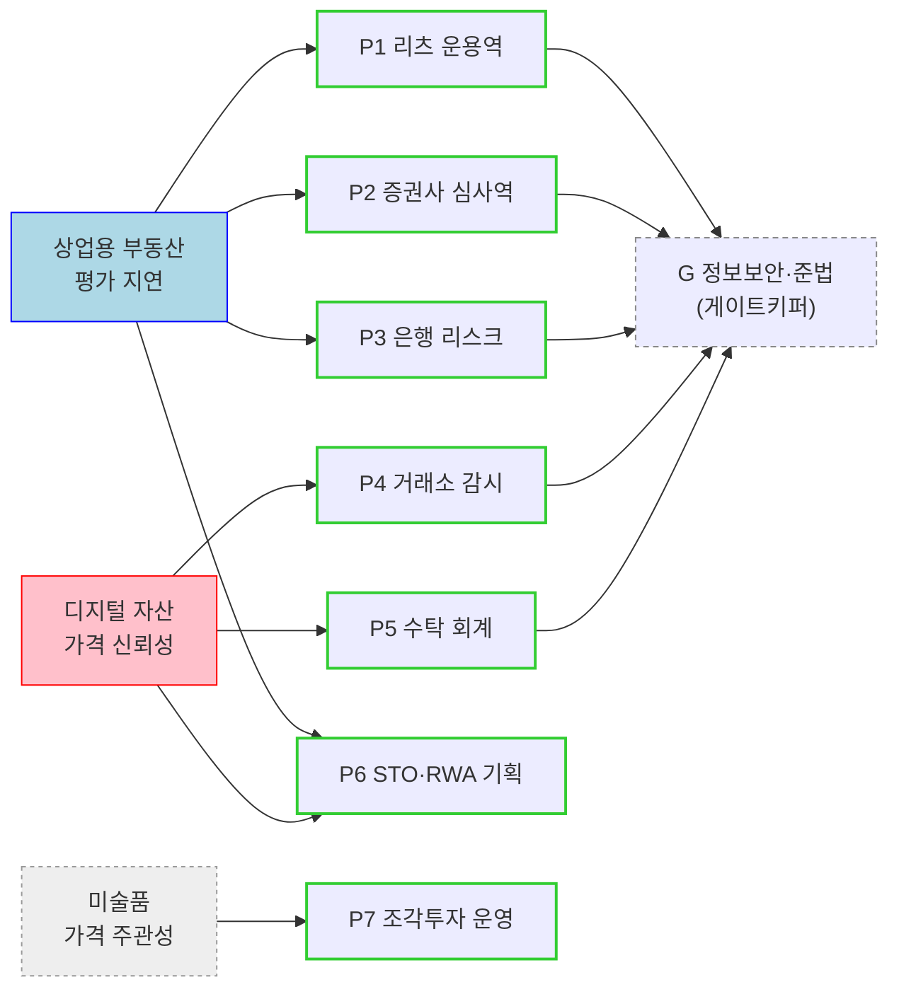

# 페르소나 — 자산 가치평가 인프라

[04_tam-sam-som/02_사례_자산가치평가/02_market-segment-map.md](../04_tam-sam-som/02_사례_자산가치평가/02_market-segment-map.md)의 고객 그룹에서 추출한 페르소나입니다.

세그먼트 맵이 **"어느 조직이 돈을 내는가"** 를 답했다면, 페르소나는 **"그 조직 안에서 누가, 언제, 무엇 때문에 이 데이터를 여는가"** 를 답합니다. 세그먼트는 기관 단위(AMC 66개, 거래소 18개)로 세지만, 계약서에 서명하기 전에 제품을 실제로 쓰는 것은 그 안의 한 사람입니다.

---

## 1. 세그먼트 → 페르소나 매핑

| 세그먼트 (맵 출처) | 페르소나 | 핵심 문제 | 우선순위 | 예상 계약 |
|---|---|---|:---:|---|
| 1차 · 대형 부동산 AMC | **P1** 리츠 운용역 | 평가 지연 | ★★★★★ | 5,000만~1억+ |
| 1차 · 증권사 부동산금융 | **P2** 부동산금융 심사역 | 딜 속도 | ★★★★★ | 5,000만~1.5억 |
| 2차 · 은행 / 보험사 | **P3** 담보·리스크 심사역 | 담보가 과대·지연 | ★★★★☆ | 5,000만~2억 |
| 디지털 Tier 1 · 거래소 | **P4** 시장감시·상장 담당 | 가격 신뢰성 | ★★★★★ | 1.2~2.4억+ |
| 디지털 Tier 2 · 커스터디 | **P5** 수탁 운영·회계 담당 | 장부에 쓸 가격 | ★★★★☆ | 6,000만~1.2억 |
| 3차 / Tier 3 · STO·RWA | **P6** 토큰화 사업 기획자 | 기초자산 가치 증명 | ★★★★☆ | 3,000만~1억 |
| 확장 · 미술품 | **P7** 조각투자 플랫폼 운영자 | 가격 주관성 | ★★★☆☆ | 건당 + 구독 |
| (전 세그먼트 공통) | **G** 정보보안·준법 담당 | 외부 데이터 반입 심사 | — | 구매를 막는 쪽 |
| 제외 · 일반 부동산 보유자 | **A** 1회성 조회자 | — | ✕ | 타깃 아님 |

---

## 2. 상업용 부동산 페르소나

### P1 — 리츠 운용역 (최우선 타깃)

| 항목 | 내용 |
|---|---|
| **유형명** | 자산이 너무 많아 평가를 자주 못 돌리는 운용역 |
| **역할** | 대형 AMC의 리츠 운용·자산관리 담당. 리츠 수십 개, 그 아래 부동산 수백 개의 운용 성과와 공시 자료에 책임을 집니다. 분기 결산에 들어갈 자산 가치를 확정하는 사람. |
| **주요 문제** | 감정평가는 자산당 연 1~2회인데 시장은 그 사이에도 움직입니다. 금리가 오르고 공실이 늘어도 다음 평가 시점까지 장부에는 옛 숫자가 남습니다. 자산이 수백 개라 외부 평가를 자주 돌릴 비용도 시간도 없고, 그 사이의 가치는 사실상 비어 있습니다. |
| **목표** | 분기 공시와 NAV 산정에 쓸 수 있는 **근거 있는 현재가치를 상시 확보**하는 것. 그리고 그 숫자의 산출 근거를 투자자·수탁사·감사인에게 설명할 수 있는 상태로 두는 것. |
| **사용 맥락** | 분기 결산 2~3주 전, 리츠별 자산 리스트를 통째로 올려 일괄 재평가. 월간 내부 운용 리포트 작성 시. 자산 편입·매각 검토 시 단건 조회. 실시간 API보다 **대시보드 + 엑셀 내보내기**를 먼저 씁니다. 계약 1건이 수백 자산분 사용량으로 늘어나는 구조 — 다만 도입 결정은 파일럿→내부 검증→연동으로 6~18개월. |

### P2 — 증권사 부동산금융 심사역

| 항목 | 내용 |
|---|---|
| **유형명** | 심사 회의 전날까지 대조군이 없는 심사역 |
| **역할** | PF·부동산 담보대출·부동산 펀드 셋업의 심사와 사후관리. 딜을 태울지 말지 판단하고, 태운 뒤에는 익스포저를 관리합니다. |
| **주요 문제** | 감정평가서를 받는 데 수 주가 걸립니다. 그동안 손에 있는 밸류에이션은 셀사이드가 준 것 하나뿐이고, 그것을 검증할 **독립적인 2차 의견이 없습니다.** 딜 속도와 검증 깊이가 정면으로 충돌합니다. |
| **목표** | 심사 회의에 들고 들어갈 독립 기준가와 민감도(금리·공실 시나리오별 가치 변동)를 **며칠이 아니라 당일에** 확보하는 것. |
| **사용 맥락** | 딜 검토 초기 스크리닝에서 심사역이 직접 조회 — 여기서 걸러내면 실사 비용을 아낍니다. 사후관리 단계에서는 분기별 익스포저 재평가. 지불의사·구매 속도 모두 P1보다 높지만, 자산 수가 적어 상위 플랜으로 올라가진 않습니다. |

### P3 — 은행·보험 담보·리스크 심사역

| 항목 | 내용 |
|---|---|
| **유형명** | 자기 평가를 스스로 못 믿게 된 리스크 담당 |
| **역할** | 부동산 담보대출 포트폴리오의 담보가치 산정, 충당금·RWA 계산, 내부 스트레스 테스트. |
| **주요 문제** | 자체 감정평가 관행이 담보가를 시가보다 높게 잡는다는 지적이 이미 나와 있습니다([원본자료 §3](../04_tam-sam-som/02_사례_자산가치평가/원본자료/02_가치평가-오류와-이해관계자.md)). 담보가 과대 산정은 부실대출과 건전성 규제 왜곡으로 직결되는데, 재평가 주기가 길어 금리 상승 국면의 가치 하락이 늦게 잡힙니다. |
| **목표** | 포트폴리오 전체를 **같은 기준으로 주기적으로** 다시 재고, 외부·독립 출처 값으로 내부 평가를 교차 검증하는 것. 감독당국과 감사인에게 방법론을 설명할 수 있어야 합니다. |
| **사용 맥락** | 단건 조회가 아니라 **배치** — 담보 포트폴리오 전량을 월·분기 단위로 일괄 재평가해 내부 리스크 시스템에 적재합니다. 구매 조건에 방법론 문서와 감사 대응 자료가 포함되고, 보안·컴플라이언스 심사를 통과해야 합니다. 지불의사는 최상위지만 도입 기간이 가장 깁니다. |

---

## 3. 디지털 자산 페르소나

### P4 — 거래소 시장감시·상장 심사 담당

| 항목 | 내용 |
|---|---|
| **유형명** | 자기 체결가가 시장 전체를 대표한다고 말할 수 없는 감시 담당 |
| **역할** | 상장·상폐 판단, 이상거래 탐지, 공시 시세 제공. 국내 18개사. |
| **주요 문제** | 거래소마다 시세가 다르고, 워시트레이딩·허수주문처럼 조작 흔적이 섞인 체결이 데이터에 그대로 남습니다. 유동성이 얕은 종목은 소량 거래만으로 가격이 튑니다. 조작이나 부실 상장이 뒤늦게 드러나면 신뢰도와 규제 리스크를 정면으로 맞습니다. |
| **목표** | 자사 가격을 **외부 기준가와 대조해 괴리와 이상을 즉시** 잡아내는 것. 상장·상폐 판단에 방어 가능한 제3자 근거를 붙이는 것. |
| **사용 맥락** | 24/7 실시간 API로 시스템에 상시 결합 — 초~분 단위입니다. 이상 탐지 알람, 상장 심사 시 종목별 유동성·가격 신뢰도 리포트. 시스템 결합도가 높아 단가가 가장 높고(1.2~2.4억+), 한 번 붙으면 교체가 어렵습니다. 구매 속도는 전 페르소나 중 가장 빠릅니다. |

### P5 — 커스터디·수탁 운영·회계 담당

| 항목 | 내용 |
|---|---|
| **유형명** | "왜 그 가격을 썼습니까"에 답해야 하는 회계 담당 |
| **역할** | 고객 자산 보관, 보유자산 평가, NAV 산출, 회계 처리, 담보가치 산정. 국내 9개사. |
| **주요 문제** | 거래소마다 가격이 다른데 장부에는 하나만 적어야 합니다. 어느 거래소의 몇 시 가격을 왜 골랐는지 감사인에게 설명해야 하는데, 디지털 자산은 회계·평가 기준 자체가 아직 확립되지 않았습니다. 판단이 담당자 개인에게 얹혀 있는 상태입니다. |
| **목표** | 매일 같은 시각, 같은 방법론으로 산출된 **단일 기준가**. 값보다 중요한 것은 방법론 문서와 이력이 남아 감사·분쟁에서 견디는 것입니다. |
| **사용 맥락** | 일 마감 배치(특정 시각 스냅샷)와 월말 NAV 확정. 실시간성은 P4보다 덜 중요하고, 대신 **재현 가능성**이 구매 조건입니다 — 6개월 뒤 같은 시점을 다시 조회했을 때 같은 값이 나와야 합니다. |

### P6 — STO·RWA 토큰화 사업 기획자

| 항목 | 내용 |
|---|---|
| **유형명** | 자기가 판 자산의 가격을 자기가 매길 수 없는 발행자 |
| **역할** | 실물자산을 토큰화해 발행·유통. 기초자산의 가치를 투자자와 당국에 증명할 책임을 집니다. |
| **주요 문제** | "이 토큰의 기초자산이 지금 얼마인가"를 발행자가 직접 말하면 **이해상충**입니다. 2022년 증선위가 조각투자를 투자계약증권으로 판단한 이후 공시·평가 요건이 따라붙었고, 금융위는 가격 산정의 정보 비대칭을 공식적으로 지적했습니다. 2차 시장 호가의 기준도 없습니다. |
| **목표** | 발행 시 공모가 근거, 유통 중 정기 기준가, 청산 시 정산가. **발행자가 아닌 제3자가 냈다는 사실 자체**가 필요한 것이라, 정확도만큼 독립성이 요구사항입니다. |
| **사용 맥락** | 발행 전 밸류에이션(건당), 발행 후 월·분기 기준가 공시, 투자자 앱 노출. 규제 대응이 구매 트리거라 문제의 존재를 설득할 필요가 없습니다. 지금은 시장이 작지만 `실물자산 → 토큰 → 금융상품` 전환이 진행되는 3~5년 뒤 비중이 커지는 페르소나입니다. |

---

## 4. 확장 페르소나 — 미술품

### P7 — 미술품 조각투자 플랫폼 운영자

| 항목 | 내용 |
|---|---|
| **유형명** | 공모가를 방어할 근거가 필요한 플랫폼 운영자 |
| **역할** | 미술품 매입·분할 발행·유통 운영. 작품별 공모가와 기준가를 산정합니다. |
| **주요 문제** | 가격이 주관적입니다. 2025년 상반기 낙찰의 75.7%가 500만 원 미만이라 비교 사례는 많지만 편차가 크고, 동일 작가·시기·규격의 대조군을 잡기 어렵습니다. 자체 산정은 P6과 같은 이해상충에 걸립니다. |
| **목표** | 작가·시기·규격·경매 이력에 기반한 **제3자 산정 근거**로 공모가를 방어하고, 2차 시장의 호가 기준을 제공하는 것. |
| **사용 맥락** | 신규 작품 공모 직전(건당)과 보유 작품 분기 기준가 갱신(구독)이 섞입니다. 기관 수가 10~30개로 적고 계약 규모도 작아(합계 약 9.4억 ARR 목표) 건당 과금과 구독을 혼합해야 합니다. |

---

## 5. 조연 페르소나 — 사는 사람이 아니라 막는 사람

### G — 정보보안·준법감시 담당 (게이트키퍼)

| 항목 | 내용 |
|---|---|
| **유형명** | 구매를 결정하진 않지만 무산시킬 수 있는 사람 |
| **역할** | 외부 데이터·API 반입 심사, 망분리 정책, 위탁 계약 검토, 개인정보·자산정보 반출 판단. 금융기관이라면 P1~P5 뒤에 반드시 있습니다. |
| **주요 문제** | 외부 API를 내부 핵심 시스템에 붙이는 것이 그 자체로 리스크입니다. 사고가 나면 책임은 도입을 승인한 쪽에 남습니다. |
| **목표** | 승인해도 문제가 생기지 않을 근거 — SLA·가동률, 데이터 처리 위치, 위탁 규정 적합성, 장애 이력. |
| **사용 맥락** | 제품을 쓰지 않고 **문서만 봅니다.** 도입 리드타임 6~18개월의 상당 부분이 이 단계입니다. 세일즈 자료가 아무리 좋아도 보안 검토 문서 세트가 없으면 여기서 멈춥니다. |

### A — 일반 부동산 보유자 (안티 페르소나)

세그먼트 맵에서 **명시적으로 제외**된 그룹입니다. 페르소나 목록에 남겨두는 이유는, 왜 뺐는지가 기록되어야 나중에 확장 순서를 정할 수 있기 때문입니다.

| 항목 | 내용 |
|---|---|
| **역할** | 상가·건물을 보유한 개인 또는 소규모 법인. |
| **주요 문제** | "내 건물 지금 얼마인가" — 문제는 진짜 있습니다. |
| **왜 제외했나** | 매도·상속·대출 같은 **사건이 있을 때 한 번** 조회하고 끝납니다. 지불의사 ★☆☆☆☆, 건당 과금. 이 서비스의 가치는 감정평가서 한 장이 아니라 **반복해서 데이터를 쓰는 고객**에게서 나오는데, 이 페르소나는 반복하지 않습니다. |
| **뒤집힐 조건** | 보유자가 아니라 이들을 상대하는 **플랫폼**이 대신 구매하는 구조가 되면 3차 세그먼트로 편입됩니다. |

---

## 6. 이 페르소나 추출에서 배울 점

**① 세그먼트는 조직, 페르소나는 사람이다**
"대형 AMC"는 계약 상대지 사용자가 아닙니다. 같은 AMC 안에서도 분기 결산에 쫓기는 운용역과 보안 검토를 하는 준법 담당은 원하는 것이 정반대입니다. 세그먼트를 사람 단위로 쪼개야 제품 요구사항이 나옵니다.

**② 문제가 다르면 페르소나를 나눈다 — 제품 분리 판단과 같은 논리**
세그먼트 맵이 상업용 부동산과 디지털 자산을 하나의 제품으로 팔지 않기로 한 것과 같은 이유로, P1(평가 지연)과 P4(가격 신뢰성)는 같은 페르소나로 묶을 수 없습니다. **묶이는 지점은 상위 개념(신뢰할 수 있는 기준가)이지 사용 장면이 아닙니다.**

**③ 사용 맥락이 제품 형태를 결정한다**
같은 "가치평가 데이터"인데 P1은 대시보드와 엑셀, P3·P5는 배치, P4는 실시간 API, P6·P7은 건당 리포트를 원합니다. 사용 맥락을 안 적으면 이 차이가 보이지 않고, 모든 고객에게 같은 API를 파는 설계가 나옵니다.

**④ 사지 않는 사람도 페르소나다**
G(게이트키퍼)는 매출에 잡히지 않지만 도입 기간 6~18개월의 원인입니다. 구매 결정자만 그리면 "왜 계약이 안 되지"의 답이 페르소나 밖에 남습니다.

**⑤ 제외한 세그먼트는 안티 페르소나로 남긴다**
A를 지우지 않고 제외 사유와 뒤집힐 조건까지 적어두면, 나중에 확장 여부를 다시 판단할 때 처음부터 논의하지 않아도 됩니다.

---

> ⚠️ **검증 상태**: 이 페르소나는 세그먼트 맵과 원본 리서치 문서에서 **추론한 것이며, 실제 인터뷰로 확인된 것이 아닙니다.** 특히 "주요 문제"와 "사용 맥락"은 실무자 인터뷰에서 가장 자주 뒤집히는 항목입니다. [수익모델 문서 §4](../04_tam-sam-som/02_사례_자산가치평가/03_수익모델과-매출시나리오.md)가 제시한 WTP 검증(AMC 1곳, 거래소 1곳)과 같은 순서로, P1·P4 각 1명 인터뷰가 다음 단계입니다.
>
> **다음 단계**: 페르소나 스펙트럼(같은 문제를 상황·제약 차이로 확장) → 고객 여정지도(P1의 분기 결산 사이클, P4의 상장 심사 프로세스를 단계별로 분해).
