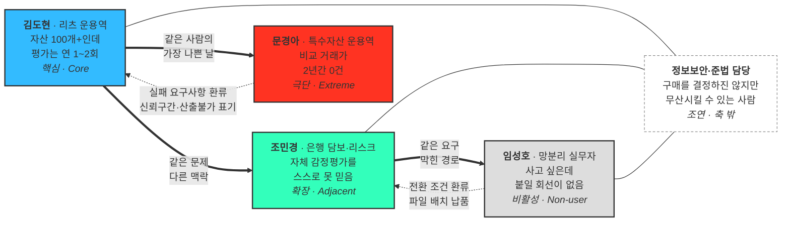

# ②~⑤단계 — 선별 · 보정 · 검증 · 스펙트럼 맵

**사례**: 자산 가치평가 인프라 (Institutional Valuation Infrastructure)
**입력**: [①단계 원본 풀 12종 + 대기 후보 7종](01_사례_자산가치평가.md)
**방법론**: [00_학습노트 §2 AI 기반 다중 페르소나 워크플로우](00_학습노트.md)

| 단계 | 목적 | 이 문서의 위치 |
|---|---|---|
| **② 2차 평가** | 현실성 기준 선별 | §1 |
| **③ 3차 보정** | 사업 맥락 재기술 | §2 |
| **④ 4차 검증** | 실재 근거 교차확인 | §3 |
| **⑤ 5차 통합** | 관계 구조화 | §4 |

---

## 1. ② 2차 평가 (Convergent Filtering)

### 평가 기준

워크플로우가 지정한 기준은 **문제·행동·맥락의 현실성**입니다. 세 축을 이렇게 정의했습니다.

| 축 | 묻는 것 | 5점 | 1점 |
|---|---|---|---|
| **문제 현실성** | 이 문제가 실재한다는 근거가 문서·통계·규제 사실로 있는가 | 1차 자료로 확인됨 | 그럴듯한 추론뿐 |
| **행동 관찰성** | 이 사람이 지금 하고 있는 행동을 특정할 수 있는가 | 대체 솔루션이 구체적 | "불편할 것이다" 수준 |
| **맥락 구체성** | 언제·어떤 형태로 쓰는지가 제품 사양으로 번역되는가 | 주기·형태가 확정적 | 사용 장면이 모호 |

### 채점

| 유형 | 후보 | 문제 | 행동 | 맥락 | 계 | 결과 |
|---|---|:---:|:---:|:---:|:---:|---|
| 🔵 핵심 | **김도현** 리츠 운용역 | 5 | 4 | 5 | **14** | ✅ **선정** |
| 🔵 핵심 | 박선우 거래소 시장감시 | 5 | 4 | 5 | **14** | ⚠️ 동점 — 아래 참조 |
| 🔵 핵심 | 정수민 밸류에이션 담당 | 4 | 5 | 4 | 13 | 보존 (사용자 축) |
| 🔵 핵심 | 한지우 수탁 운영·회계 | 5 | 4 | 4 | 13 | 보존 |
| 🔵 핵심 | 오세라 리츠 IR·공시 | 3 | 3 | 3 | 9 | 보존 (근거 약함) |
| 🟢 확장 | **조민경** 은행 담보·리스크 | 5 | 4 | 4 | **13** | ✅ **선정** |
| 🟢 확장 | 이재훈 증권사 심사역 | 4 | 4 | 4 | 12 | 보존 |
| 🟢 확장 | 서태영 STO·RWA 기획 | 5 | 3 | 3 | 11 | 보존 (시장 초기) |
| 🔴 극단 | **문경아** 특수자산 운용역 | 5 | 4 | 5 | **14** | ✅ **선정** |
| 🔴 극단 | 배현우 신규 상장 담당 | 4 | 3 | 4 | 11 | 보존 |
| ⚪ 비활성 | **임성호** 망분리 실무자 | 5 | 4 | 3 | **12** | ✅ **선정** |
| ⚪ 비활성 | 유가람 감정평가사 | 4 | 3 | 3 | 10 | 보존 |

### ⚠️ 핵심 유형의 동점 — 이 워크플로우가 이 사업에서 깨지는 지점

**김도현과 박선우가 14점으로 동점입니다. 그리고 이 동점은 우열로 풀 수 없습니다.**

[세그먼트 맵](../04_tam-sam-som/02_사례_자산가치평가/02_market-segment-map.md)의 결론이 **"두 시장은 같은 제품으로 팔 수 없다"** 였기 때문입니다. 김도현은 CRE Valuation API의 핵심, 박선우는 Digital Asset Reference Price API의 핵심입니다. 유형별 1종 규칙을 그대로 적용하면 **제품 하나가 대표 페르소나 없이 남습니다.**

| 판단 | 내용 |
|---|---|
| **형식상 선정** | 김도현 — 확장 계수(1 계약 → 리츠 수십 개 → 자산 수백 개)가 가장 크고, 세그먼트 맵이 최우선 타깃으로 지목한 축 |
| **실무 권고** | 핵심은 **2종 운영** — 김도현(부동산) · 박선우(디지털). 제품이 둘이면 코어 페르소나도 둘입니다 |
| **배울 점** | 워크플로우의 "유형별 1개" 규칙은 **단일 제품을 전제**합니다. 제품이 분리된 사업에서는 규칙보다 제품 구조가 우선합니다 |

이 문서는 워크플로우 학습이 목적이므로 이후 §2~§4는 형식상 선정된 4종으로 진행하되, 박선우 카드는 [①단계 문서 §3](01_사례_자산가치평가.md)에 그대로 살아 있습니다.

### 탈락이 아니라 보존 — 각 후보를 남긴 이유

| 후보 | 대표가 못 된 이유 | 그래도 남기는 이유 |
|---|---|---|
| 정수민 밸류에이션 | 구매 결재권이 없음 | **실제로 툴을 여는 사람.** 김도현이 사는 제품을 정수민이 씁니다 — UI 설계는 이쪽 기준 |
| 한지우 수탁 회계 | 박선우와 같은 디지털 축, 사용 빈도 낮음 | 재현 가능성 요구를 만드는 유일한 후보 |
| 오세라 IR·공시 | 근거가 전부 추론 | 도입 명분(투자자 설명 책임)을 만드는 위치 |
| 이재훈 증권사 심사역 | 문제 강도가 가설 | **구매 속도가 가장 빠름** — 초기 매출을 만드는 것은 큰 세그먼트가 아니라 빨리 결제하는 세그먼트 |
| 서태영 STO·RWA | 시장이 아직 작음 | 3~5년 뒤 비중이 커지는 유일한 축, 규제가 구매를 강제 |
| 배현우 신규 상장 | 국면이 짧음 | 상장 심사 리포트 기능의 근거 |
| 유가람 감정평가사 | 사용 맥락이 없음 | 적대 세력이자 **잠재 유통 채널** |
| *(대기 후보 7종)* | ①단계에서 카드 미작성 | 감사 소급 대응(as-of 조회), 소형 AMC(Basic 플랜), 일반 보유자(제외 사유), 게이트키퍼(도입 지연 원인) — 전부 §5에서 다시 쓰입니다 |

---

## 2. ③ 3차 보정 — 대표 4종 7필드 카드

①단계의 6필드(이름·직무·문제·목표·감정·대체 솔루션)에 **사용 맥락**을 더해 제품 사양으로 번역되는 형태로 재기술합니다.

### 🔵 김도현 — 리츠 운용역 *(핵심 대표)*

| 항목 | 내용 |
|---|---|
| **유형명** | 자산이 너무 많아 평가를 자주 못 돌리는 운용역 |
| **역할** | 대형 AMC 리츠운용본부 9년차. 리츠 20여 개, 그 아래 부동산 100개 이상의 운용 성과와 공시에 책임을 집니다. 분기 결산에 들어갈 자산 가치를 확정하는 사람. |
| **주요 문제** | 감정평가는 자산당 연 1~2회인데 시장은 그 사이에도 움직입니다. 금리가 오르고 공실이 늘어도 다음 평가까지 장부에는 옛 숫자가 남습니다. 자산이 수백 개라 외부 평가를 자주 돌릴 비용도 시간도 없고, 그 사이의 가치는 사실상 비어 있습니다. |
| **목표** | 분기 공시·NAV에 쓸 **근거 있는 현재가치를 상시 확보**하고, 그 근거를 투자자·수탁사·감사인에게 설명할 수 있는 상태로 두는 것. |
| **감정** | 결산 직전의 불안. "이 숫자로 공시가 나가는데 근거가 6개월 전 평가서 한 장인가." 동시에 수백 개를 매번 평가할 방법이 없다는 무력감. |
| **대체 솔루션** | 연 1~2회 감정평가서 + 엑셀 롤포워드 + 매입팀에 전화로 시세 확인. |
| **사용 맥락** | 분기 결산 2~3주 전 리츠별 자산 리스트를 통째로 올려 일괄 재평가. 월간 운용 리포트. 자산 편입·매각 검토 시 단건 조회. 실시간 API보다 **대시보드 + 엑셀 내보내기**를 먼저 씁니다. 계약 1건이 수백 자산분 사용량 — 다만 도입은 파일럿→내부 검증→연동으로 6~18개월. |

### 🟢 조민경 — 은행 여신 리스크·담보평가 담당 *(확장 대표)*

| 항목 | 내용 |
|---|---|
| **유형명** | 자기 평가를 스스로 못 믿게 된 리스크 담당 |
| **역할** | 부동산 담보대출 포트폴리오의 담보가치 산정, 충당금·RWA 계산, 내부 스트레스 테스트. |
| **주요 문제** | 자체 감정평가가 담보가를 시가보다 높게 잡는다는 지적이 이미 나와 있습니다([원본자료 §3](../04_tam-sam-som/02_사례_자산가치평가/원본자료/02_가치평가-오류와-이해관계자.md)). 담보 과대 산정은 부실대출·건전성 규제 왜곡으로 직결되는데, 재평가 주기가 길어 금리 상승기의 가치 하락이 늦게 잡힙니다. |
| **목표** | 포트폴리오 전체를 같은 기준으로 주기적으로 다시 재고, **외부·독립 출처로 내부 평가를 교차 검증**하는 것. 감독당국과 감사인에게 방법론을 설명할 수 있어야 합니다. |
| **감정** | 감독당국 검사에서 지적당하는 것에 대한 공포. 그래서 문제 인식은 가장 뚜렷한데 신규 도입에는 가장 보수적입니다. |
| **대체 솔루션** | 자체 감정평가 + 필요 시 외부 감평 의뢰. |
| **사용 맥락** | 단건이 아니라 **배치** — 담보 포트폴리오 전량을 월·분기 단위로 일괄 재평가해 내부 리스크 시스템에 적재. 방법론 문서와 감사 대응 자료가 구매 조건이고, 보안·컴플라이언스 심사를 통과해야 합니다. 계약 규모 최대(5,000만~2억), 도입 기간 최장. |

### 🔴 문경아 — 특수자산 운용역 *(극단 대표)*

| 항목 | 내용 |
|---|---|
| **유형명** | 우리 모델이 값을 못 내는 자산만 골라 든 운용역 |
| **역할** | 김도현과 같은 직무지만 포트폴리오가 다릅니다. 지방 중소도시 물류센터, 단일 호텔, 데이터센터, 지식산업센터처럼 **거래 자체가 거의 없는 자산**을 운용합니다. |
| **주요 문제** | 이 사업의 전제인 "거래 사례로 현재가치를 추정한다"가 성립하지 않습니다. 반경 내 유사 거래가 2년간 0건인 자산이 있고, 있어도 규모·용도가 달라 보정이 억지가 됩니다. **평가 지연이 아니라 평가 불가**입니다. |
| **목표** | 값을 받는 것보다 **"이 자산은 데이터가 부족해 신뢰구간이 넓다"는 사실을 근거와 함께** 받는 것. 감사인에게 "왜 이 자산만 추정치인가"를 설명할 수 있으면 충분합니다. |
| **감정** | 체념과 경계. 여러 서비스를 써봤지만 자기 자산은 늘 "해당 없음"으로 나오거나, 더 나쁘게는 **그럴듯한 숫자가 나오는데 믿을 수 없습니다.** |
| **대체 솔루션** | 인근 이종 자산을 억지 보정하거나 원가법. 그마저 안 되면 직전 평가액 이월. |
| **사용 맥락** | 김도현과 같은 결산 사이클에서 쓰지만, 결과 화면에서 **먼저 보는 것이 값이 아니라 근거**입니다. 어떤 사례를 몇 건 썼는지, 데이터 충분성이 어느 등급인지 확인한 뒤에야 숫자를 봅니다. **시연에서 자기 자산을 먼저 넣어보므로, 여기서 무너지면 계약 전체가 흔들립니다.** |

### ⚪ 임성호 — 망분리 환경의 금융기관 실무자 *(비활성 대표)*

| 항목 | 내용 |
|---|---|
| **유형명** | 사고 싶은데 붙일 회선이 없는 실무자 |
| **역할** | 은행·보험사·연기금의 리스크·운용 실무자. 문제도 예산도 있고 조민경과 요구사항이 사실상 같습니다. |
| **주요 문제** | 제품의 문제가 아니라 **전달 경로의 문제**입니다. 내부망에서 외부 API를 호출할 수 없어, SaaS·API 형태로만 제공되면 검토 단계에서 자동 탈락합니다. |
| **목표** | 외부 회선을 열지 않고 같은 데이터를 받는 것. 일 1회 파일 전송이든 온프레미스든 **보안 심사를 통과할 수 있으면 형태는 상관없습니다.** |
| **감정** | 무력감. 좋은 도구가 있다는 걸 알고 도입도 원하지만 자기 권한 밖의 이유로 매번 막힙니다. 영업 미팅에 나와도 "저희는 안 될 겁니다"로 시작합니다. |
| **대체 솔루션** | 폐쇄망 안의 엑셀과 수기 계산. 외부 데이터는 개인 PC에서 확인해 손으로 옮겨 적습니다. |
| **사용 맥락** | 지금은 **사용 맥락이 없습니다.** 이 페르소나의 가치는 사용이 아니라 **전환 조건을 알려주는 데** 있습니다 — 파일 배치 납품 옵션 하나가 조민경 세그먼트에서 접근 불가였던 기관들을 엽니다. |

---

## 3. ④ 4차 검증 (AI Peer Review)

AI가 만든 페르소나는 인터뷰 이전의 가설입니다. **어디까지가 문서로 확인된 사실이고 어디부터가 추론인지** 분리했습니다.

| 페르소나 | 실재 근거 (확인됨) | 미검증 (인터뷰 필요) | 확실성 |
|---|---|---|---|
| **김도현** | AMC 66개·리츠 469개·AUM 127.5조(한국리츠협회 2026.6). AMC 1곳이 리츠 수십 개를 운용하는 3단 구조 확인 | 결산 병목이 실제로 평가 지연인지, 지불의사 수준, 대시보드 선호 여부 | **높음** — 조직·자산 구조는 통계, 개인의 불편은 가설 |
| **조민경** | 은행 자체 감정평가의 과대 산정 지적과 외부 감평 의무 강화 논의가 문서로 존재. 담보 과대평가 → 건전성 악화 경로도 확인 | 외부 데이터를 내부 평가와 병행할 의사가 있는지, 배치 주기, 보안 심사 통과 조건 | **높음** — 문제는 공식 문서로 확인, **수용 여부가 미지수** |
| **문경아** | 거래 사례 부족은 이 사업의 **출발 전제**입니다(세그먼트 맵: "왜 생기나 = 거래가 드묾"). 지방·특수자산 거래 희소성도 일관 | 포트폴리오 내 비중, "산출 불가"를 수용할지 아니면 이탈할지 | **높음** — 문제는 확실, **반응이 미지수** |
| **임성호** | 금융권 망분리·클라우드 반입 규제는 제도적 사실. 도입 리드타임 6~18개월도 원본자료가 지적 | 기관별로 어느 수준까지 막는지, 파일 배치면 실제 통과되는지 | **높음** — 장벽은 사실, **우회 가능 여부가 미지수** |

### 검증 우선순위 — 뒤늦게 알면 되돌리기 비싼 순서

**문경아와 임성호가 먼저입니다.** 김도현·조민경은 틀려도 제품 방향이 바뀌지 않지만,

- **문경아의 반응**은 신뢰 설계를 결정합니다 — 값을 낼 수 없을 때 무엇을 반환할 것인가
- **임성호의 통과 여부**는 납품 아키텍처를 결정합니다 — API only인가, 파일 배치도 만들 것인가

[수익모델 §4](../04_tam-sam-som/02_사례_자산가치평가/03_수익모델과-매출시나리오.md)의 WTP 검증(AMC 1곳·거래소 1곳)과 묶으면, **AMC 1곳에서 김도현과 문경아를 함께** 인터뷰해 한 번에 확인할 수 있습니다.

---

## 4. ⑤ 5차 통합 — Persona Spectrum Map

**굵은 실선은 파생 방향, 점선은 환류입니다.** 극단과 비활성은 매출에 잡히지 않지만 각각 **실패 요구사항**과 **전환 조건**을 되돌려 보냅니다. 이 두 점선이 스펙트럼을 그리는 실질적 이유입니다.

---

## 5. 스펙트럼이 코어 제품에 되돌려준 것

세그먼트 맵만 봤다면 나오지 않았을 사양들입니다. 극단·비활성에서 나왔지만 **수혜자는 핵심**입니다.

| 출처 | 되돌아온 요구사항 | 누가 이득을 보나 |
|---|---|---|
| **문경아** 비교사례 0건 | 값과 함께 **데이터 충분성 등급·신뢰구간** 표기, 사례 부족 시 "산출 불가"를 명시적으로 반환 | 문경아만이 아니라 **김도현의 감사 대응 무기** — "왜 이 자산만 추정치인가"에 답할 수 있습니다 |
| **배현우** 상장 3일차 | 이력이 짧은 종목의 **기준가 미산출 상태 정의** + 유동성 신뢰도 지표 | 박선우의 상장 심사 리포트로 직결. 세그먼트 맵이 요구한 "상장·상폐 기준 데이터"의 구체적 형태 |
| *(대기)* 감사 소급 대응 | **as-of 조회**(과거 시점 값 재현) + 방법론 버전 이력 | 한지우의 구매 조건 그 자체 — 극단 후보가 코어의 핵심 요구를 드러낸 사례 |
| **임성호** 망분리 | **파일 배치·온프레미스 납품 옵션** | 조민경 세그먼트(계약 최대 2억) 전체의 접근성이 바뀝니다 |
| **유가람** 감정평가사 | 대체가 아니라 **평가 보조 도구**로 포지셔닝, 법정 평가는 유자격자 영역으로 분리 | 적대 세력이 유통 채널로 바뀔 수 있습니다 |
| *(대기)* 소형 AMC | 자산 20~50개 대상 저가 진입 + 셀프 온보딩 | [가격표의 Basic 플랜(월 200만 원)](../04_tam-sam-som/02_사례_자산가치평가/03_수익모델과-매출시나리오.md)이 이미 이 자리를 겨냥하고 있습니다 — 스펙트럼이 가격 설계와 맞물린 것을 확인 |

### 비활성 → 활성 전환 조건

| 페르소나 | 지금 막는 것 | 전환 조건 | 전환 시 편입 |
|---|---|---|---|
| **임성호** 망분리 | 외부 API 호출 불가 | 파일 배치 납품 + 보안 검토 문서 세트 | 조민경 확장 세그먼트 |
| **유가람** 감정평가사 | 직업적 대체 위협 | 보조 도구 포지셔닝 + 평가사 리셀 구조 | 유통 채널 |
| *(대기)* 소형 AMC | 연 수천만 원 부담 | Basic 플랜 + 셀프 온보딩 | 핵심 세그먼트 하단 |
| *(대기)* 일반 부동산 보유자 | 1회성 수요, 지불의사 ★☆☆☆☆ | **보유자가 아니라 플랫폼이 대신 구매**하는 구조 | 3차 세그먼트 |

> **규제당국(금융위·금감원)은 스펙트럼에 넣지 않았습니다.** 제품을 쓰지도 사지도 않지만 서태영·미술품 플랫폼의 **구매 트리거를 만드는 쪽**입니다(조각투자 투자계약증권 판단, 가격 산정 정보 비대칭 지적). 사용자가 아니라 **시장 조건**으로 취급하는 편이 정확합니다.

---

## 6. 워크플로우를 한 바퀴 돌리고 배운 것

**① 확산이 조직 바깥이 아니라 안쪽으로도 일어났다**
①단계 핵심 5종 중 정수민(밸류에이션)과 오세라(IR·공시)는 세그먼트 맵에 없던 자리입니다. 맵이 "구매 의사결정 단위 = AMC"까지만 봤기 때문입니다. **세그먼트를 사람 단위로 쪼개면 조직 안에서 새 페르소나가 나옵니다.**

**② 극단은 새 시장이 아니라 코어의 최악의 날이었다**
문경아는 김도현이 특수자산을 만난 날, 배현우는 박선우가 신규 상장을 맞은 날입니다. 극단을 밖에서 찾으려 했다면 §5의 환류가 성립하지 않습니다. **극단 페르소나는 코어에서 갈라 나올 때 제품 사양으로 연결됩니다.**

**③ 대체 솔루션 12개 중 경쟁 제품은 0개였다**
전부 엑셀·전화·내부 규정·직전 평가서 이월입니다. 이 사업의 실제 경쟁자는 다른 데이터 회사가 아니라 **현상 유지**이고, 그렇다면 세일즈에서 이겨야 할 대상도 달라집니다. **감정과 대체 솔루션 필드를 안 채웠으면 안 보였을 사실입니다.**

**④ 비활성 2종의 장벽 성격이 서로 달랐다**
임성호는 **구조적 불가**(못 씀), 유가람은 **인식적 거부**(안 씀)입니다. 전환 전략이 완전히 다르므로 하나로 합치면 안 됩니다.

**⑤ "유형별 1개" 규칙은 단일 제품을 전제한다**
이 사업은 제품이 둘(CRE / Digital Asset)이라 핵심 유형에서 동점이 났고, 규칙대로 1종만 남기면 제품 하나가 대표 없이 남습니다. **워크플로우는 도구이지 규칙이 아닙니다** — 사업 구조가 규칙과 충돌하면 사업 구조를 따릅니다.

---

> ⚠️ **검증 상태**: 대표 4종은 세그먼트 맵과 원본 리서치에서 **추론한 가설이며, 인터뷰로 확인된 것이 아닙니다.** 실재 근거와 미검증 항목은 §3에 분리했습니다. 검증 우선순위는 **문경아(신뢰 설계 결정)** 와 **임성호(납품 아키텍처 결정)** 입니다.
>
> **다음 단계 — 고객 여정지도**: 김도현의 분기 결산 사이클과 조민경의 담보 재평가 주기를 단계별로 분해하고, 여정에 **정보보안·준법 심사 구간**을 명시적으로 넣습니다. 도입 기간 6~18개월의 상당 부분이 그 구간에서 소모되기 때문입니다.
