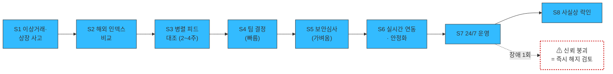
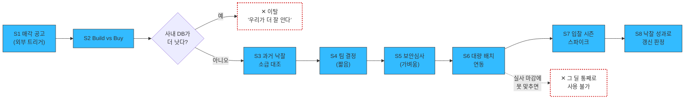
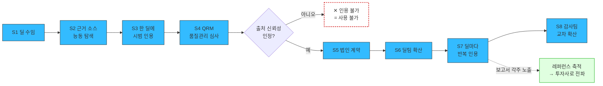

# 사례 — 고객 여정지도 (자산 가치평가 인프라)

**입력**: [②~⑤단계 대표 페르소나 4종](02_사례_자산가치평가_스펙트럼-종합.md) — 김도현(핵심) · 조민경(확장) · 문경아(극단) · 임성호(비활성)
**방법론**: [00-2_학습노트_고객여정지도.md](00-2_학습노트_고객여정지도.md)

> 📌 **핵심 발견**: 네 페르소나의 여정은 **단계 수도, 순서도, 끝나는 지점도 다릅니다.** 하나의 표준 여정에 네 명을 끼워 넣으면 이 문서의 가치가 전부 사라집니다.

---

## 1. 단계를 어디서 뽑았나

`인지 → 탐색 → 구매 → 사용 → 재구매`를 쓰지 않았습니다. 이 시장의 실제 행동에서 **끊기는 지점**을 찾아 8개 구간으로 나눴고, 그중 세 개는 일반 SaaS 여정에 없는 구간입니다.

| # | 단계 | 이 시장에서 왜 생겼나 | 대응하는 소비재 구간 |
|:---:|---|---|---|
| S1 | **결산 압박 자각** | 문제를 상시 느끼지 않습니다. 분기 마감·감독 검사 같은 **사건이 있을 때만** 문제가 됩니다 | (트리거) |
| S2 | **대안 탐색** | "감정평가를 더 발주할까 / 데이터를 살까"의 비교. 경쟁사 비교가 아닙니다 | 비교 |
| S3 | **파일럿 검증** ★ | 자기 자산 몇 개를 넣어 **기존 감정평가액과 대조**해 봅니다 | 가구의 **실측**, 자동차의 **시승** |
| S4 | **내부 설득** | 쓰는 사람과 결재하는 사람이 다릅니다. 품의·투자심의를 통과해야 합니다 | 협상 |
| S5 | **보안·준법 심사** ★ | 구매 의사와 **무관하게** 무산될 수 있는 구간 | (소비재에 없음) |
| S6 | **시스템 연동** ★ | 결제 후에도 여정이 끝나지 않습니다. 내부 시스템에 값이 들어가야 시작입니다 | 가구의 **조립/설치** |
| S7 | **정기 운영** | 분기·월 사이클로 반복. 여기서 가치가 증명됩니다 | 사용 |
| S8 | **갱신 판단** | ARR 계약의 연 단위 재결정 | 재구매 |

★ = 이 시장 고유 구간. **이 세 개를 빼면 "왜 계약이 안 되는가"의 답이 지도 밖에 남습니다.**

## 2. 스펙트럼별 여정 비교 — 같은 지도를 쓸 수 없는 이유

```mermaid
graph LR
    subgraph K["🔵 김도현 · 핵심 — 8단계 완주 (6~18개월)"]
        K1["S1 결산 압박"] --> K2["S2 탐색"] --> K3["S3 파일럿"] --> K4["S4 품의"] --> K5["S5 보안심사"] --> K6["S6 연동"] --> K7["S7 분기 운영"] --> K8["S8 갱신"]
    end
    subgraph J["🟢 조민경 · 확장 — 검증이 2배, 12~24개월"]
        J1["S1 감독검사<br/>지적"] --> J2["S2 탐색"] --> J3["S3 과거 소급<br/>백테스트"] --> J4["S4 리스크<br/>위원회"] --> J5["S5 위탁·보안<br/>이중 심사"] --> J6["S6 배치 적재"] --> J7["S7 월 배치"] --> J8["S8 갱신+<br/>감사 대응"]
    end
    subgraph M["🔴 문경아 · 극단 — S3에서 결판"]
        M1["S1 결산 압박"] --> M2["S2 탐색"] --> M3["S3 자기 자산<br/>먼저 투입"] --> M3b{"근거를<br/>보여주나?"}
        M3b -->|"아니오"| MX["✕ 이탈<br/>'또 안 나오네'"]
        M3b -->|"예"| M4["부분 도입"]
    end
    subgraph I["⚪ 임성호 · 비활성 — S2에서 끊김"]
        I1["S1 문제 인식"] --> I2["S2 탐색"] --> I2b{"API만<br/>제공하나?"}
        I2b -->|"예"| IX["✕ 종료<br/>'저희는 안 됩니다'"]
        I2b -->|"아니오<br/>(파일 배치)"| I3["S3부터 재개<br/>= 조민경 여정"]
    end

    classDef c fill:#33BBFF,stroke:#333;
    classDef a fill:#33FFBB,stroke:#333;
    classDef e fill:#FF3322,stroke:#333;
    classDef n fill:#DDDDDD,stroke:#333;
    classDef x fill:#FFF,stroke:#C00,stroke-width:2px,stroke-dasharray:3 3;
    class K1,K2,K3,K4,K5,K6,K7,K8 c;
    class J1,J2,J3,J4,J5,J6,J7,J8 a;
    class M1,M2,M3,M4 e;
    class I1,I2,I3 n;
    class MX,IX x;
```

| | 김도현 (핵심·부동산) | 박선우 (핵심·디지털) | 조민경 (확장) | 문경아 (극단) | 임성호 (비활성) |
|---|---|---|---|---|---|
| **여정 시작 트리거** | 분기 결산 | 이상거래·상장 사고 | 감독당국 지적·검사 | 분기 결산 | 문제 인식 |
| **단계 수** | 8 | 8 (앞이 짧고 뒤가 김) | 8 (각 단계가 더 무거움) | 3에서 결판 | 2에서 종료 |
| **가장 긴 구간** | S5 보안심사 | S6 연동·안정화 | S3 백테스트 + S5 이중 심사 | — | — |
| **결정적 순간** | S3 파일럿 | **S7 첫 장애** | S4 리스크위원회 | **S3 첫 조회 30초** | S2 아키텍처 확인 |
| **총 소요** | 6~18개월 | 2~4개월 | 12~24개월 | 시연 당일 | 통과 못 함 |
| **끝나는 곳** | S8 갱신 | 사실상 락인 | S8 갱신+감사 | S3 이탈 또는 부분 도입 | S2 종료 |

> 위 mermaid에는 지면상 4종만 그렸습니다. 나머지 세 명은 각자의 절에 있습니다 — **박선우**(디지털 자산 축) §4, **남기훈**(NPL) §8, **백서현**(회계법인 자문) §9. 제품이 둘로 갈리고 편입 검토로 둘이 더 붙었으므로 **여정지도는 총 7종**입니다.

| | 남기훈 (핵심·NPL) | 백서현 (핵심 진입점) |
|---|---|---|
| **여정 시작 트리거** | **매각 공고 — 외부에서 날아옴** | 딜 수임 |
| **단계 수** | 8 (앞뒤가 모두 짧음) | 8 (문턱이 가장 낮음) |
| **결정적 순간** | **S2 Build vs Buy** | **S4 QRM 심사** |
| **총 소요** | 1~3개월 | 딜 1건 (수 주) |
| **끝나는 곳** | S8 낙찰 성과로 판정 | S8 감사팀 교차 확산 |

---

## 3. 🔵 김도현 (핵심) — 8단계 전 구간

| 단계 | 행동 | 접점 | 생각 / 감정 | 이탈 지점 | 기회 |
|---|---|---|---|---|---|
| **S1 결산 압박** | 분기 마감 3주 전 자산 리스트를 열고 최신 평가일을 확인 | 내부 운용 시스템, 엑셀 | "이번에도 반년 전 숫자로 가는구나" — 체념 섞인 불안 | 문제로 인식은 하되 **그냥 넘어감**(작년에도 넘어갔으므로) | 결산 캘린더에 맞춘 아웃바운드 타이밍 |
| **S2 대안 탐색** | 감정평가 추가 발주 견적 vs 데이터 구독 비교 | 감정평가법인, 검색, 동종사 담당자 | "예산 품의를 통과할 만한 명분이 되나" | 감정평가 추가 발주가 더 **설명하기 쉬워서** 회귀 | 감정평가 대체가 아니라 **보완**으로 포지셔닝 |
| **S3 파일럿 검증** ★ | 자산 10~20개를 넣고 **직전 감정평가액과 오차 대조** | 시연·트라이얼 환경, 사내 리서치(정수민) | "이 정도 오차면 결산에 못 쓴다 / 쓸 만하다"를 **여기서 판정** | 오차가 크면 즉시 종료. **근거 없이 숫자만 나오면 신뢰 상실** | 오차 리포트를 **우리가 먼저 제출** — 숨기면 신뢰가 무너짐 |
| **S4 내부 설득** | 품의서 작성, 본부장·투자심의 보고 | 상급자, 재무, 구매팀 | "이걸 왜 사야 하는지 한 장으로 설명해야 한다" | 예산 우선순위에서 밀림 | **품의서용 1페이지 자료**를 제품처럼 제공 |
| **S5 보안·준법 심사** ★ | 정보보안 검토 요청, 위탁 계약 검토 | **정보보안·준법 담당(게이트키퍼)** | 담당자는 이미 손을 뗀 상태 — "결과만 기다림" | **가장 많이 죽는 구간.** 문서 미비로 반려 | 보안 검토 문서 세트를 **영업 자료처럼 상시 준비** |
| **S6 시스템 연동** ★ | API 키 발급, 자산 마스터 매핑, 내부 리포트 양식 연결 | IT팀, 외부 SI | "생각보다 손이 많이 간다" — 도입 피로 | 매핑이 어려워 **연동만 하고 안 씀**(계약은 유지, 갱신에서 이탈) | 자산 마스터 매핑 온보딩을 유상 서비스로 분리 |
| **S7 정기 운영** | 분기마다 일괄 재평가 → 공시·NAV 자료에 반영 | 대시보드, 엑셀 내보내기, 감사인 | "감사인 질문에 이걸로 답할 수 있나" | 감사인이 방법론을 문제 삼으면 사용 중단 | **감사 대응 패키지**(방법론 문서 + 산출 이력) |
| **S8 갱신 판단** | 연 단위 재계약 검토 | 구매팀, 상급자 | "작년에 이걸로 무엇이 좋아졌나" | 사용 실적을 증명 못 하면 감액 | 분기별 **사용 리포트**를 갱신 근거로 자동 제공 |

> 💡 **S3와 S5가 전부입니다.** S3에서 신뢰를 못 얻으면 계약이 없고, S5에서 문서가 없으면 신뢰를 얻어도 계약이 없습니다. 나머지 여섯 구간은 이 둘을 통과한 뒤의 문제입니다.

## 4. 🔵 박선우 (핵심 · 디지털 자산) — 앞이 짧고 뒤가 길다

부동산 축과 **여정의 무게중심이 정반대**입니다. 김도현은 계약까지가 어렵고, 박선우는 계약 이후가 어렵습니다.

| 단계 | 행동 | 접점 | 생각 / 감정 | 이탈 지점 | 기회 |
|---|---|---|---|---|---|
| **S1 사고·규제 압박** | 이상거래를 놓쳤거나 상장 종목에 문제가 생긴 직후 대책을 찾음 | 감독기관 요구, 내부 사고 리뷰 | "다음에 또 놓치면 내 책임" — 경계심 | 사고가 잠잠해지면 우선순위에서 밀림 | **사고 직후 2주**가 유일한 진입창 |
| **S2 대안 탐색** | 해외 인덱스·데이터 제공사와 비교 | 글로벌 데이터 벤더, 동종 거래소 | "해외 것도 있는데 굳이" | **여기만 진짜 경쟁 제품이 있습니다** — 다른 페르소나는 전부 엑셀이 경쟁자 | 국내 거래소별 가중치·원화 시장 반영이라는 차별점 |
| **S3 병렬 피드 대조** ★ | 자사 체결가와 기준가를 2~4주간 나란히 흘려보며 괴리를 관찰 | 개발팀, 시장감시 시스템 | "괴리가 설명 가능한가, 아니면 그냥 다른 건가" | 지연(latency)·결측이 보이면 즉시 탈락 | 대조 기간 중 **괴리 원인 리포트**를 우리가 먼저 설명 |
| **S4 내부 결정** | 팀·본부 단위로 결정. 데이터 비용은 운영비 처리 | 팀장, 개발 리드 | "쓸 만하면 그냥 붙이자" | 거의 안 죽는 구간 | 품의 절차가 가벼운 만큼 **PoC → 계약 직행** 설계 |
| **S5 보안 심사** | 외부 API 반입 검토. 금융기관 대비 가벼움 | 정보보안 담당 | — | 상장사·수탁 겸업이면 조민경 수준으로 무거워짐 | 겸업 여부로 심사 난도를 미리 분기 |
| **S6 실시간 연동·안정화** ★ | 시세 시스템·감시 시스템에 상시 결합. 장애 시나리오 테스트 | 개발팀, SRE | "이게 죽으면 우리 시스템이 같이 죽는다" | **SLA·가동률이 기준 미달이면 여기서 종료** | SLA 문서와 장애 이력 공개를 **영업 자료로** |
| **S7 24/7 운영** | 초~분 단위 상시 호출, 이상 알람 수신 | 시장감시 시스템, 알람 | "조용한 게 정상" | **장애 1회로 신뢰가 무너짐.** 오탐이 많아도 알람을 끔 | 장애 사후 리포트를 자동 발송 — 은폐가 최악 |
| **S8 갱신** | 교체 비용이 커서 사실상 락인 | 구매팀 | "바꾸는 게 더 위험하다" | 락인이 곧 방심 → 경쟁사 진입 여지 | 갱신을 **기능 확장(상장 심사 리포트)** 시점으로 활용 |

> 💡 **김도현은 S3·S5에서 죽고, 박선우는 S6·S7에서 죽습니다.** 앞단(설득)이 짧은 대신 뒷단(운영 신뢰)이 전부입니다. **같은 회사가 파는 두 제품인데 세일즈에서 준비할 것이 완전히 다릅니다** — 부동산은 문서, 디지털은 가동률입니다.

## 5. 🟢 조민경 (확장) — 같은 8단계, 다른 무게

핵심과 단계 이름은 같지만 **각 구간의 성격이 다릅니다.** 특히 S3이 "지금 값을 대조"가 아니라 **"과거로 돌아가 대조"** 라는 점이 결정적입니다.

| 단계 | 김도현과 무엇이 다른가 | 이탈 지점 | 기회 |
|---|---|---|---|
| **S1** | 트리거가 결산이 아니라 **감독당국 지적·검사**. 문제를 스스로 찾지 않고 **지적당해서** 시작합니다 | 지적이 없으면 여정 자체가 시작 안 됨 | 검사 시즌·제도 변경 시점에 맞춘 접근 |
| **S2** | "외부 데이터를 내부 평가와 병행해도 되는가"라는 **정당성 검토**가 먼저 | 규정 근거가 불명확하면 중단 | 감독 규정 해석 자료 동봉 |
| **S3** ★ | 현재 값이 아니라 **과거 시점 소급 검증(백테스트)**. "2년 전 이 시점에 당신 모델은 뭐라고 했나" | **as-of 조회가 없으면 여기서 끝.** 검증 자체가 불가능 | 극단 페르소나(감사 소급 대응)가 만든 요구가 **여기서 매출로 연결** |
| **S4** | 품의가 아니라 **리스크위원회 안건**. 참석자가 10명 단위 | 위원 한 명의 반대로 보류 | 위원회 제출용 방법론 요약본 |
| **S5** ★ | 정보보안 + **위탁 계약 규정** 이중 심사. 망분리 환경이면 여기서 임성호와 같은 벽 | **API only면 통과 불가** | 파일 배치 납품 옵션 |
| **S6** | API 연동이 아니라 **일괄 파일 적재** — 내부 리스크 시스템 배치 잡에 연결 | 배치 스케줄 충돌 | 배치 포맷을 고객 시스템에 맞춰 제공 |
| **S7** | 월·분기 포트폴리오 전량 재평가. 사람이 화면을 열지 않습니다 | 조용히 쓰이므로 **가치가 안 보임** | 사용량이 아니라 **막아준 리스크**로 리포트 |
| **S8** | 갱신 + **감사·검사 대응 이력** 요구 | 감사에서 방법론이 깨지면 즉시 해지 | 산출 이력 보존을 계약 조건으로 명문화 |

## 6. 🔴 문경아 (극단) — S3에서 30초 안에 끝난다

극단 페르소나의 여정은 **짧고, 그래서 진단적입니다.**

| 단계 | 행동 | 생각 / 감정 | 결과 |
|---|---|---|---|
| **S1~S2** | 김도현과 동일 | — | 시연까지는 옵니다 |
| **S3-a 자기 자산 투입** | 시연 화면에 **가장 어려운 자산부터** 넣습니다. 지방 물류센터, 단일 호텔 | "이번에도 안 나오겠지" — 시험하는 태도 | 여기서 여정의 90%가 결정 |
| **S3-b 근거 확인** | 값보다 **어떤 사례를 몇 건 썼는지**를 먼저 봅니다 | "숫자는 나왔는데 이걸 뭘 보고 만든 거지" | **그럴듯한 숫자가 근거 없이 나오면 즉시 이탈** |
| **S3-c 판정** | 신뢰구간·데이터 충분성 등급을 확인 | "못 낸다고 말해주는 게 차라리 낫다" | 부분 도입(일반 자산만) 또는 완전 이탈 |

| 이탈 지점 | 기회 |
|---|---|
| **"해당 없음"만 뜨고 이유가 없음** | 왜 못 내는지(사례 0건, 용도 불일치)를 명시 |
| **근거 없이 숫자가 나옴** — 가장 치명적 | 데이터 충분성 등급을 값과 **같은 화면**에 |
| 전체가 안 된다고 판단해 포트폴리오 통째로 포기 | 자산별 **커버리지 사전 진단** — 계약 전에 "당신 자산 100개 중 78개 가능"을 제시 |

> **문경아를 만족시키는 기능이 김도현의 S7을 지킵니다.** 신뢰구간 표기는 감사인 질문에 답하는 도구이기도 하기 때문입니다. 극단에서 나온 요구가 핵심의 이탈을 막는 구조입니다.

## 7. ⚪ 임성호 (비활성) — 여정이 시작되지 못한다

| 단계 | 행동 | 생각 / 감정 | 결과 |
|---|---|---|---|
| **S1 문제 인식** | 조민경과 동일한 문제·동일한 예산 | "우리도 이게 필요하다" | 정상 |
| **S2 아키텍처 확인** | "클라우드 API인가요?"를 **첫 질문**으로 던짐 | "역시 안 되겠네" — 무력감 | **여기서 종료.** 제품을 보지도 않음 |

- 이 여정의 산출물은 이탈 지점이 아니라 **전환 조건**입니다.
- **파일 배치 납품 옵션 하나가 생기면**, 임성호의 여정은 S3부터 조민경의 여정으로 합류합니다. 새 세그먼트를 여는 게 아니라 **막혀 있던 확장 세그먼트를 여는 것**입니다.
- 지금 상태에서 이 페르소나는 영업 리포트에 **아예 기록되지 않습니다.** 미팅이 성사되지 않으니 실패 사유로도 남지 않습니다 — 여정지도에 넣지 않으면 존재 자체가 보이지 않는 유형입니다.

---

## 8. 🔵 남기훈 (핵심 · NPL) — 데드라인이 여정을 지배한다

[편입 검토](06_검토_NPL-기업부동산-편입.md)로 추가된 페르소나입니다. 다른 여정은 고객의 사정으로 시작하는데, **이 여정만 외부에서 날아온 공고로 시작하고 마감일이 정해져 있습니다.**

| 단계 | 행동 | 접점 | 생각 / 감정 | 이탈 지점 | 기회 |
|---|---|---|---|---|---|
| **S1 매각 공고** | 은행·저축은행의 NPL 풀 매각 공고와 티저를 받고 참여 여부를 판단 | 매각 주관사, 공고 | "이번 풀은 볼 만한가" — 조급함이 여기서 시작 | 풀 성격이 안 맞으면 그대로 종료 | **공고가 공개됩니다.** 모니터링해 선제 접촉하는 것이 유일하게 예측 가능한 진입 타이밍 |
| **S2 Build vs Buy** ★ | 사내 경매 DB·엑셀 모델로 갈지, 외부 데이터를 넣을지 판단 | 팀장, 사내 데이터 담당 | "우리가 10년 쌓은 DB가 있는데" — **자존심이 걸림** | **가장 많이 죽는 구간.** 평가 역량이 곧 경쟁력이라 외주화로 읽힘 | **대체가 아니라 교차검증**으로 프레이밍. "사내 모델과 어디서 갈리는지" 리포트를 먼저 제시 |
| **S3 소급 대조** ★ | "작년 그 물건, 우리는 X에 샀는데 당신 모델은 뭐라 했나"를 확인 | 사내 과거 딜 기록 | 시험하는 태도. 맞히면 신뢰, 빗나가면 즉시 종료 | **as-of 조회가 없으면 검증 자체가 불가능** | 과거 낙찰 사례 대비 정확도를 **우리가 먼저 공개** |
| **S4 팀 결정** | 팀·본부 단위 결재. 데이터 비용은 딜 비용에 묻힘 | 팀장, 투자심의 | "딜 규모 대비 푼돈" | 거의 안 죽음 | 품의가 가벼운 만큼 **PoC → 계약 직행** |
| **S5 보안 심사** | 외부 데이터 반입 검토. 금융기관 대비 가벼움 | 정보보안 담당 | — | 은행 계열 F&I면 조민경 수준으로 무거워짐 | 계열 여부로 심사 난도를 미리 분기 |
| **S6 대량 배치 연동** ★ | 담보물 리스트 수백 건을 올려 일괄 산정 | 실사팀, 엑셀·API | "실사 기간 안에 나와야 한다" | **마감에 못 맞추면 그 딜은 통째로 못 씁니다** — 품질이 아니라 타이밍으로 죽는 유일한 구간 | 실사 데드라인 기준 **처리 시간 SLA** |
| **S7 입찰 시즌 운영** | 실사 2~4주 집중 사용, 그 외 보유 채권 담보가 모니터링 | 실사팀, 회수팀 | "이겼는데 비싸게 산 건 아닐까" — 승자의 저주 | 낙찰 실패가 겹치면 **데이터 탓으로 귀결**됨 | 스파이크 대응 과금(시즌 단가) |
| **S8 갱신 판정** | "이번 딜에서 이걸로 무엇을 걸러냈나"로 판단 | 팀장, 구매 | 성과 귀속이 애매 | 기여를 증명 못 하면 감액 | **딜별 "걸러낸 물건" 리포트**를 갱신 근거로 자동 생성 |

> 💡 **S2와 S6이 다른 페르소나에 없는 구간입니다.** S2는 고객이 이미 자체 역량을 갖췄을 때만 생기고, S6은 마감이 있을 때만 생깁니다. **김도현은 품질로 죽고 남기훈은 자존심과 시계로 죽습니다.**

## 9. 🔵 백서현 (핵심 진입점 · 회계법인 자문) — 문턱이 가장 낮고 확산이 가장 크다

| 단계 | 행동 | 접점 | 생각 / 감정 | 이탈 지점 | 기회 |
|---|---|---|---|---|---|
| **S1 딜 수임** | 고객사로부터 실사·밸류에이션 자문을 수임 | 고객사, 딜 주관 | "이번엔 근거를 뭘로 대지" | **딜이 없으면 여정 자체가 없음** — 완전 스파이크형 | 딜 시즌·업종 사이클에 맞춘 접촉 |
| **S2 근거 소스 탐색** | 인용 가능한 외부 출처를 **능동적으로 찾음** | 검색, 데이터 벤더, 동료 | "자체 추정은 반박당한다" | 거의 안 죽음 — **유일하게 고객이 먼저 찾아오는 구간** | 인바운드 설계. 이 페르소나만 아웃바운드가 필요 없습니다 |
| **S3 시범 인용** | 한 딜 보고서에 각주로 한 번 넣어봄 | 딜팀 내부 | "리스크가 크지 않으니 일단 써보자" | **파일럿 문턱이 전 페르소나 중 가장 낮음** | 무료 인용 라이선스로 진입 마찰 제거 |
| **S4 QRM 품질관리 심사** ★ | 법인 품질관리 부서가 외부 출처 인용 가능 여부를 검토 | **품질관리(QRM) 부서** | 담당자는 손을 뗀 상태 — 결과만 기다림 | **이 페르소나의 진짜 게이트.** "출처 신뢰성 미검증"이면 인용 불가 | 방법론 문서 + 출처 검증 패키지. **김도현의 보안 문서와 같은 역할, 완전히 다른 내용** |
| **S5 법인 계약** | 팀 단위 시범에서 법인 단위 계약으로 승격 | 조달, 파트너 | "다른 팀도 쓰겠는데" | 법인 조달 절차가 길어짐 | 팀 단위 소액 → 법인 단위 확장 가격 구조 |
| **S6 딜팀 확산** | 부동산·NPL·구조조정 등 여러 딜팀이 사용 | 딜팀들 | — | 팀별로 쓰는 법이 달라 파편화 | 딜 유형별 템플릿 |
| **S7 반복 인용** | 딜마다 보고서 각주로 인용 | 고객사, 상대측 자문사 | "이거 어디 데이터냐"는 질문을 받음 | 고객사가 근거에 이의를 제기하면 그 딜 이후 중단 | **각주가 곧 광고입니다.** 상대측 자문사·투자사로 이름이 전파 |
| **S8 교차 확산** | 같은 법인 감사팀(조현우)으로 넘어감 | 감사 파트너 | — | 감사·자문 간 **독립성 규정**에 걸릴 수 있음 | 크로스셀 경로이자 리스크 — §10 참조 |

> 💡 **백서현이 쐐기인 이유가 여정에서 드러납니다.** S2에서 **고객이 먼저 찾고**, S3의 문턱이 가장 낮고, S7에서 **쓸 때마다 우리 이름이 외부에 노출**됩니다. 남기훈에게 직접 가면 S2(Build vs Buy)에서 막히는데, 백서현의 보고서 각주로 먼저 도달하면 그 저항을 우회합니다.

## 10. 종합 — 이탈이 몰리는 곳

| 순위 | 구간 | 누구 | 왜 죽나 | 대응 |
|:---:|---|---|---|---|
| 1 | **S5 보안·준법 심사** | 김도현·조민경 | 문서 미비로 반려. 담당자는 이미 손을 뗌 | 보안 문서 세트 상시화 |
| 2 | **S3-b 근거 확인** | 문경아 | 근거 없는 숫자 = 신뢰 상실 | 데이터 충분성 등급 |
| 3 | **S2 아키텍처 확인** | 임성호 | API only | 파일 배치 옵션 |
| 4 | **S2 Build vs Buy** | 남기훈 | 자체 평가 역량이 곧 경쟁력 — 외주화로 읽힘 | 교차검증 프레이밍, 차이 리포트 |
| 5 | **S7 첫 장애** | 박선우 | 상시 결합이라 우리 장애가 고객 장애 | SLA·장애 이력 공개, 사후 리포트 자동화 |
| 6 | **S4 QRM 심사** | 백서현 | 출처 신뢰성 미검증이면 인용 자체가 불가 | 방법론 + 출처 검증 패키지 |
| 7 | **S3 백테스트 / 소급 대조** | 조민경 · 남기훈 | as-of 조회 부재 | 산출 이력 보존 |
| 8 | **S6 마감 초과 / 연동 후 미사용** | 남기훈 · 김도현 | 실사 마감 초과, 자산 매핑 부담 | 처리 시간 SLA, 온보딩 분리 |

**게이트키퍼가 조직마다 다릅니다.** 김도현·조민경은 **정보보안·준법**, 백서현은 **품질관리(QRM)**, 남기훈은 **자기 팀의 자존심**입니다. 셋 다 "결재자가 아닌데 무산시킬 수 있는 자리"인데, 준비해야 할 자료가 완전히 다릅니다 — 보안 문서 / 출처 검증 패키지 / 사내 모델 대비 차이 리포트.

**1·3위가 모두 제품 성능과 무관합니다.** 값이 아무리 정확해도 문서와 납품 형태에서 죽습니다. 여정지도를 그리지 않으면 이 두 가지가 **제품 백로그에 올라오지 않습니다.**

## 11. 이 여정지도에서 배울 점

**⓪ 제품이 둘이면 여정지도도 둘이다**
김도현은 S3·S5(파일럿·보안심사)에서 죽고 박선우는 S6·S7(연동·장애)에서 죽습니다. 같은 회사의 두 제품인데 **세일즈가 준비할 것이 문서 vs 가동률로 갈립니다.** 하나의 여정으로 그렸다면 둘 중 하나는 반드시 틀립니다.

**① 트리거가 다르면 여정이 다르다**
김도현은 결산이라는 **자기 일정**으로, 조민경은 감독당국 지적이라는 **외부 사건**으로 시작합니다. 접근 타이밍이 완전히 달라집니다 — 하나의 여정으로 그렸다면 이 차이가 지워졌습니다.

**② 극단의 여정은 짧아서 오히려 진단적이다**
문경아의 여정은 3단계에서 끝나지만, 그 30초가 제품 신뢰 설계 전체를 결정합니다. **여정의 길이와 중요도는 비례하지 않습니다.**

**③ 비활성의 여정지도는 이탈 지점이 아니라 전환 조건을 준다**
임성호는 S2에서 끝나지만, 그 사실이 "파일 배치 납품"이라는 사양을 만듭니다. 끝나는 여정도 그릴 값어치가 있습니다.

**④ 이탈 1·3위가 제품이 아니라 문서·납품 형태였다**
[스펙트럼 종합 §5](02_사례_자산가치평가_스펙트럼-종합.md)에서 극단·비활성이 되돌려준 요구사항과 정확히 같은 결론에 다른 경로로 도달했습니다. **두 프레임이 같은 답을 가리키면 그 답의 신뢰도가 올라갑니다.**

**⑤ 게이트키퍼는 조직마다 다른 사람이다**
같은 "결재자가 아닌데 무산시킬 수 있는 자리"인데 김도현·조민경은 정보보안·준법, 백서현은 **품질관리(QRM)**, 남기훈은 **자기 팀의 자존심**입니다. 준비할 자료가 보안 문서 / 출처 검증 패키지 / 사내 모델 대비 차이 리포트로 전부 달라집니다. **게이트키퍼를 하나로 뭉뚱그리면 세 개 중 두 개는 못 넘습니다.**

**⑥ 막힌 여정은 다른 사람의 여정으로 우회한다**
남기훈에게 직접 가면 S2(Build vs Buy)에서 막힙니다. 그런데 백서현의 보고서 각주로 먼저 도달하면 **그 저항 구간을 건너뛴 채 남기훈 앞에 놓입니다.** 여정을 한 명씩만 보면 "S2를 어떻게 뚫을까"를 고민하게 되는데, **겹쳐 보면 뚫는 대신 돌아가는 길이 보입니다.** 여정지도를 여러 장 그리는 실질적 이득이 여기 있습니다.

---

> ⚠️ **검증 상태**: 단계 구분과 소요 기간은 [원본 리서치](../04_tam-sam-som/02_사례_자산가치평가/원본자료/)의 도입 리드타임 6~18개월 기술과 페르소나 가설에서 추론한 것입니다. **실제 여정은 인터뷰로 확인해야 합니다.** 특히 S3 파일럿의 판정 기준(오차 몇 %면 통과인가)과 S5 보안심사의 실제 반려 사유는 문서로 확인된 바 없습니다.
>
> **다음 챕터**: 이 지도의 `기회` 열이 **06 기회점수(OS) 분석**의 입력이 됩니다.
