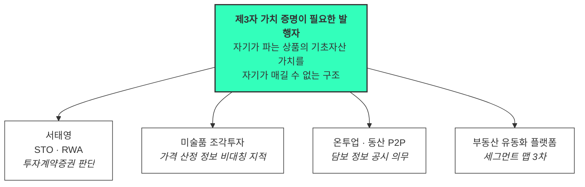

# 검토 — 온투업(온라인투자연계금융업) · 동산 P2P 편입

**질문**: 동산 P2P / 온투업 플랫폼을 **핵심 고객**으로 편입할 수 있는가?
**대상 문서**: [스펙트럼 종합](02_사례_자산가치평가_스펙트럼-종합.md) · [세그먼트 맵](../04_tam-sam-som/02_사례_자산가치평가/02_market-segment-map.md)

---

## 1. 결론

| 판단 | 결과 |
|---|---|
| **핵심(Core) 편입** | ✕ **부적합** |
| **확장(Adjacent) 편입** | △ **조건부 — 단 두 갈래로 나눠야 합니다** |
| 사업 본질 적합성 | ◎ **매우 높음** (미술품과 같은 급) |

**핵심이 아닌 이유를 한 줄로**: 문제는 가장 심한데 **돈 낼 체력이 가장 약합니다.**

그리고 이 검토에서 갈라야 할 것이 하나 더 있습니다. "온투업"을 한 덩어리로 보면 판단이 틀립니다.

| 갈래 | 실체 | 판정 |
|---|---|---|
| **(a) 온투업 중 부동산 담보·PF** | 이미 세그먼트 맵 **3차 계층의 "부동산 유동화 플랫폼"에 사실상 포함**돼 있습니다 | 새로 편입할 게 아니라 **이름을 명시**하면 됨 |
| **(b) 동산담보 P2P** | 기계·설비, 재고, 매출채권, 차량 등 **완전히 새로운 자산군** | 자산군 확장 후보 — **미술품 다음** |

## 2. 왜 핵심이 아닌가

[세그먼트 맵이 세운 판단 기준](../04_tam-sam-som/02_사례_자산가치평가/02_market-segment-map.md)을 그대로 적용했습니다.

| 기준 | 김도현(AMC) | 박선우(거래소) | **온투업·동산 P2P** | 평가 |
|---|---|---|---|---|
| **확장 계수** | 1 계약 → 자산 수백 개 | 1 계약 → 전 종목 | 1 계약 → **담보 건수 수백~수천** | ◎ 좋음 |
| **ARPU 체력** | 5,000만~1억+ | 1.2~2.4억 | **연 수백만~수천만 원이 현실적** | ✕ 가장 약함 |
| **구매 속도** | 느림(6~18개월) | 빠름(2~4개월) | 중간 — 규제 압력이 있으면 빠름 | ○ |
| **데이터 재사용성** | — | — | **부동산·디지털 파이프라인을 거의 못 씀** | ✕ 재개발 필요 |
| **시장 안정성** | 리츠 제도 안정 | 거래소 제도화 진행 | 업권 자체가 **축소·구조조정 국면** | ✕ |
| **문제의 심각도** | 평가 지연 | 가격 신뢰성 | **평가 근거 자체가 없음** | ◎ 가장 심각 |

**"문제가 가장 심각한 고객"과 "가장 좋은 첫 고객"은 다릅니다.** 세그먼트 맵이 일반 부동산 보유자를 뺄 때 쓴 논리와 같습니다 — 문제의 존재가 아니라 **반복 구매와 지불 체력**이 핵심 판정 기준입니다.

## 3. 그런데 사업 본질 적합성은 매우 높습니다

이 사업의 정의는 **"거래가 없거나 시장이 분산된 자산도 금융기관이 신뢰할 수 있는 현재가치를 제공한다"** 입니다. 동산은 이 문장에 가장 정확히 들어맞는 자산군입니다.

| 축 | 상업용 부동산 | 디지털 자산 | **동산** |
|---|---|---|---|
| 공적 가격 인프라 | 공시지가·실거래가 공개 시스템 존재 | 거래소 시세 존재(분산돼 있을 뿐) | **없음** |
| 비교 사례 | 드물지만 있음 | 24/7 넘침 | 기계·재고는 시세 자체가 미형성 |
| 누가 값을 매기나 | 감정평가사(제3자) | 시장 | **플랫폼 자신** — 이해상충 |
| 핵심 문제 | 평가 지연 | 가격 신뢰성 | **평가 근거 부재** |

- 온투업자는 연계투자 상품에 대해 **담보 정보를 공시할 의무**를 집니다. 그런데 그 담보가치를 산정하는 주체가 **상품을 파는 플랫폼 자신**입니다.
- 이 구조는 서태영(STO·RWA)·미술품 플랫폼과 **완전히 동일한 이해상충**입니다. 발행자가 자기 상품의 기초가치를 스스로 매기는 구조.
- 투자자가 개인이라 부실이 곧 민원·언론·감독 이슈가 됩니다. **규제가 구매 명분을 대신 만들어 주는 유형**입니다.

> 💡 **적합성이 높다는 것과 먼저 가야 한다는 것은 다릅니다.** 미술품 검토에서 "쐐기 후보"라는 결론이 나온 것은 적합성이 높으면서 **초기 목표 ARR(9.4억)이 잡혔기** 때문입니다. 동산 P2P는 적합성은 같은 급인데 그 숫자가 안 나옵니다.

## 4. 새 페르소나가 아니라 서태영의 자산군 변형입니다

편입을 검토하다 보면 페르소나를 하나 더 세우고 싶어지는데, **문제·감정·구매 트리거가 서태영과 거의 같습니다.**

**권고**: 서태영 페르소나를 **"제3자 가치 증명이 필요한 발행자"** 로 일반화하고, 그 아래 자산군 변형으로 관리합니다. 페르소나를 늘리는 대신 **한 페르소나의 자산군 축**을 늘리는 방식입니다.

이렇게 하면 세일즈 논리와 제품 요구사항(발행 전 산정 → 정기 기준가 공시 → 청산 정산가)이 **자산군을 바꿔도 그대로 재사용**됩니다.

## 5. 편입의 실제 비용 — 동산은 제품 재개발입니다

핵심 편입이 어려운 결정적 이유입니다. 부동산·디지털에서 만든 파이프라인을 거의 못 씁니다.

| 담보 유형 | 평가 방법 | 데이터 원천 | 우리 기존 자산 재사용 |
|---|---|---|---|
| 기계·설비 | 취득가 - 감가 + 중고 시세 | 중고 거래상, 제조사 잔가표 | 없음 |
| 재고자산 | 원가 vs 순실현가치 | 품목별 도매가, 회전율 | 없음 |
| 매출채권 | 채무자 신용 + 회수율 | 신용정보, 업종 부도율 | 없음 |
| 차량·선박 | 중고 시세 | 중고차·선박 거래 플랫폼 | 부분적 |

**네 유형이 사실상 네 개의 다른 제품입니다.** 상업용 부동산과 디지털 자산을 하나로 팔지 않기로 한 것과 같은 판단이 여기서도 적용됩니다.

## 6. 편입한다면 — 조건과 순서

### 진입 조건 (셋 다 충족될 때)

1. **부동산·디지털 축에서 PMF 확인** — [시나리오 B(23개 기관·13.1억)](../04_tam-sam-som/02_사례_자산가치평가/03_수익모델과-매출시나리오.md) 도달 후
2. **담보 유형을 하나만 고를 것** — 매출채권 또는 차량. 데이터 원천이 그나마 존재하는 쪽
3. **가격 모델이 건당 과금으로 성립할 것** — 구독으로는 이 업권의 체력에 안 맞음

### 지금 당장 할 수 있는 것

**(a) 갈래는 문서만 고치면 됩니다.** 세그먼트 맵 3차 계층 "부동산 유동화 플랫폼"에 **온투업(부동산 담보·PF)** 을 명시하면 이미 타깃 안에 들어옵니다. 새 시장이 아니라 이름이 빠져 있던 것입니다.

### 페르소나 카드 초안 *(①단계 확산 수준 — 검증 전)*

| 필드 | 내용 |
|---|---|
| **이름·직무** | 노은성 · 온투업 플랫폼 심사·리스크 담당 |
| **문제** | 동산 담보가치를 **스스로 산정해 공시**하는데 근거로 댈 외부 기준이 없습니다. 기계·재고는 시세 자체가 형성돼 있지 않고, 부실이 나면 "왜 그 가격으로 잡았나"를 개인투자자와 감독기관에 설명해야 합니다. |
| **목표** | 제3자 산정 근거로 담보가치 공시를 방어하고, 연체 시 **회수 가능액을 미리** 알아두는 것. |
| **감정** | 노출 불안. 개인투자자 손실은 곧바로 민원·언론으로 이어지고, 그때 근거 자료가 자기 이름으로 남습니다. |
| **대체 솔루션** | 감정평가법인 건별 의뢰(비싸서 큰 건만), 중고 시세 사이트 눈대중, **차입자가 제시한 자료 그대로 사용**. |
| **사용 맥락** | 상품 등록 전 **건별 조회**(건당 과금), 연체 발생 시 회수가액 재산정. 구독보다 종량제가 맞습니다. |

## 7. 확인이 필요한 수치

이 검토는 **제도 구조와 사업 논리에 근거**한 것이고, 아래 수치는 확인하지 않았습니다. SAM을 계산하려면 반드시 1차 출처가 필요합니다.

| 확인 대상 | 왜 필요한가 | 출처 후보 |
|---|---|---|
| 등록 온투업자 수 | 고객 수 상한 | 금융위 등록업체 현황 |
| 대출잔액과 추세 | 업권 체력·안정성 | 금감원 통계 |
| **동산담보 취급 업체 수·비중** | (b) 갈래의 실제 SAM | 온투업 중앙기록관리기관 |
| 업체당 연간 담보 건수 | 건당 과금 시 매출 | 개별 공시 |
| 부동산 담보·PF 취급 비중 | (a) 갈래가 이미 얼마나 겹치는지 | 상품 유형별 취급액 |

> ⚠️ 온투업 관련 서술 중 **제도적 사실**(온투업법에 따른 등록·감독, 상품 정보 공시 의무, 담보가치 산정 주체가 플랫폼이라는 점, 동산에 공적 가격 공시 체계가 없다는 점)은 구조적으로 확인되는 내용입니다. **정량 수치는 위 표대로 미확인**입니다.

---

## 8. 최종 정리

| 질문 | 답 |
|---|---|
| 핵심 고객으로 편입? | **아니오.** ARPU 체력·데이터 재사용성·업권 안정성 셋 다 미달 |
| 그럼 버리나? | **아니오.** 사업 본질 적합성은 미술품과 같은 급 |
| 어디에 두나? | **서태영(제3자 가치 증명이 필요한 발행자)의 자산군 변형** — 페르소나를 늘리지 말고 축을 늘릴 것 |
| 지금 할 일 | 온투업 **부동산 담보·PF**를 세그먼트 맵 3차 계층에 **명시**. 동산은 PMF 이후 |

**이 검토에서 배울 점**: 편입 검토의 답은 보통 "예/아니오"가 아니라 **"어느 갈래를, 언제, 어느 페르소나 아래"** 입니다. 온투업을 한 덩어리로 놓고 예/아니오를 물으면 (a)는 이미 타깃인데 (b) 때문에 통째로 탈락시키는 실수가 나옵니다.
