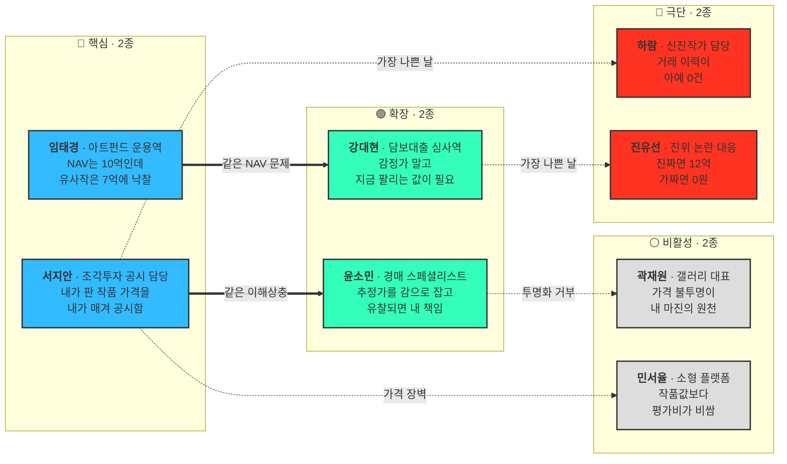

# 사례 — 미술품 세그먼트 페르소나 추출

**입력**: [04_미술품-버티컬-검토.md](../04_tam-sam-som/02_사례_자산가치평가/04_미술품-버티컬-검토.md)의 고객 우선순위표·매출 시나리오
**방법론**: [00_학습노트 §2](00_학습노트.md) 페르소나 스펙트럼

> 미술품 검토 문서는 **고객군(조직)** 까지 내려와 있습니다. 이 문서는 그 조직 안의 **사람**으로 한 단계 더 내려갑니다. 8종 카드는 ①단계 확산 수준이며 인터뷰 전 가설입니다.

---

## 1. 고객군 → 페르소나 매핑

| 검토 문서의 고객군 | 매출 가정 | 페르소나 | 스펙트럼 |
|---|---|---|---|
| 조각투자 플랫폼 | 5개 × 6,000만 = 3.0억 | **서지안** 상품기획·공시 담당 | 🔵 핵심 |
| 미술품 펀드·운용사 | 5개 × 5,000만 = 2.5억 | **임태경** 아트펀드 운용역 | 🔵 핵심 |
| 미술품 담보 금융기관 | 3개 × 8,000만 = 2.4억 | **강대현** 담보대출 심사역 | 🟢 확장 |
| 경매사 | 5개 × 3,000만 = 1.5억 *(갤러리와 합산돼 있음)* | **윤소민** 경매 스페셜리스트 | 🟢 확장 |
| 대형 갤러리 | 〃 | **곽재원** 갤러리 대표 | ⚪ **비활성 — 재분류 제안** |
| 증권사·STO | — | → 기존 **서태영**의 자산군 변형 | 🟢 확장 |
| *(신규 도출)* | — | **하람** 신진작가 컬렉션 담당 | 🔴 극단 |
| *(신규 도출)* | — | **진유선** 진위 논란 대응 담당 | 🔴 극단 |
| *(신규 도출)* | — | **민서율** 소형 온라인 플랫폼 운영자 | ⚪ 비활성 |
| 개인 컬렉터 · 일반 구매자 | 타깃 아님 | 안티 페르소나 | ⚪ 비활성 |

**18개 기관 · 9.4억 ARR이 사실상 네 사람에게 걸려 있습니다** — 서지안·임태경·강대현·윤소민.

## 2. 스펙트럼 배치도

---

## 3. 🔵 핵심 (Core)

### C-A1. 서지안 — 조각투자 플랫폼 상품기획·공시 담당

| 필드 | 내용 |
|---|---|
| **유형명** | 자기가 파는 작품의 가격을 자기가 매겨 공시하는 담당 |
| **역할** | 작품 매입 검토, 공모가 산정, 청약 공시 자료 작성, 유통 중 기준가 갱신, 매각·정산 실무. 투자계약증권 판단 이후 공시 책임이 실무자에게 내려와 있습니다. |
| **주요 문제** | 금융위가 **"유통시장의 조각 가격 산정에 대한 정보 비대칭성이 크다"** 고 공식 지적한 그 자리에 서 있습니다. 공모가를 스스로 산정하는데, 근거로 댈 것이 직전 경매 낙찰가 몇 건과 내부 판단뿐입니다. 시가총액과 경매가격이 벌어지면 설명할 언어가 없습니다. |
| **목표** | **발행자가 아닌 제3자가 낸 산정 근거**로 공모가와 기준가를 방어하는 것. 정확도만큼 독립성이 요구사항입니다. |
| **감정** | 평판 불안. 공모가 논란은 커뮤니티에서 하루 만에 번지고, 그때 근거 자료에 자기 이름이 남습니다. 금융당국이 이미 문제를 지적한 터라 **"우리는 아니다"를 증명해야 하는 위치**입니다. |
| **대체 솔루션** | 경매 낙찰가 목록 대조, 갤러리·전문가 구두 견적, 자문위원 의견서. |
| **사용 맥락** | 신규 공모 직전 **건별 조회**(가장 급함) + 보유 작품 월·분기 기준가 갱신(구독) + 투자자 앱에 기준가 노출. **건당과 구독이 섞이는 유일한 핵심 페르소나**입니다. |

### C-A2. 임태경 — 아트펀드·미술품 운용사 운용역

| 필드 | 내용 |
|---|---|
| **유형명** | 장부의 NAV와 시장이 벌어지는 걸 보고만 있는 운용역 |
| **역할** | 미술품 포트폴리오 운용, NAV 산정, 투자자 보고, 매각 타이밍 판단. |
| **주요 문제** | [검토 문서의 Valuation Gap](../04_tam-sam-som/02_사례_자산가치평가/04_미술품-버티컬-검토.md)이 이 사람의 문제입니다. 평가액 10억으로 잡아둔 작품의 유사작이 7억에 낙찰되는데, 재평가 근거가 없어 장부는 10억으로 남습니다. **30% 괴리가 투자자 보고서에 그대로 들어갑니다.** |
| **목표** | 분기 보고에 쓸 수 있는 정기 재평가와, 매각 타이밍을 잡을 **시장 방향 신호**. |
| **감정** | 미룰수록 커지는 부담. 지금 낮춰 잡으면 성과가 깎이고, 안 낮추면 나중에 한꺼번에 터집니다. |
| **대체 솔루션** | 연 1회 외부 감정 + 최근 경매 결과를 눈으로 대조 + 매각 시점에야 진짜 가격 확인. |
| **사용 맥락** | 분기 NAV 확정 시 **포트폴리오 일괄 재평가**. 김도현(리츠 운용역)과 사용 형태가 거의 같습니다 — **대시보드 + 엑셀 내보내기**, 감사 대응 자료 필요. |

## 4. 🟢 확장 (Adjacent)

### A-A1. 강대현 — 미술품 담보대출 심사역

| 필드 | 내용 |
|---|---|
| **유형명** | 감정가가 아니라 **팔릴 값**이 필요한 심사역 |
| **역할** | 미술품을 담보로 한 대출 심사, LTV 산정, 연체 시 회수 처리. |
| **주요 문제** | 검토 문서가 가장 선명하게 짚은 문제입니다 — **"평가액 10억인데 실제 처분가치가 6억이면 LTV 계산이 통째로 틀립니다."** 감정가는 이상적 조건의 값이고, 심사역이 필요한 건 **급하게 팔 때 받는 값**입니다. 둘 사이 간극을 메울 데이터가 없습니다. |
| **목표** | 처분 가능 가치와 **예상 처분 소요 기간**. "얼마"만큼 "언제까지 팔리는가"가 중요합니다. |
| **감정** | 회수 국면의 공포. 대출 실행 때는 아무도 문제 삼지 않다가, 부실이 나면 **왜 그 LTV를 잡았는지**만 남습니다. |
| **대체 솔루션** | 감정평가서 + 보수적 할인율(감정가의 50~60%)을 관행적으로 적용. |
| **사용 맥락** | 대출 심사 시 건별 조회, 실행 후 정기 담보가 모니터링, 연체 시 회수가액 재산정. **조민경(은행 리스크)과 같은 문법** — 방법론 문서와 감사 대응이 구매 조건입니다. |

### A-A2. 윤소민 — 경매사 스페셜리스트

| 필드 | 내용 |
|---|---|
| **유형명** | 추정가를 감으로 잡고 유찰되면 책임지는 사람 |
| **역할** | 작품 위탁 유치, 추정가(estimate) 산정, 도록 제작, 낙찰 결과 관리. 국내 8개 경매사 기준. |
| **주요 문제** | 추정가를 낮게 잡으면 위탁자가 떠나고, 높게 잡으면 유찰됩니다. 2025년 상반기 5,048점이 거래됐지만 **작품마다 비교 대상을 새로 찾아야** 하고, 그 판단이 개인 경험에 얹혀 있습니다. |
| **목표** | 추정가 구간을 **설명 가능한 근거와 함께** 잡는 것. 위탁자 설득 자료로도 쓰입니다. |
| **감정** | 이중 압박. 위탁 유치 경쟁에서는 높게 부르고 싶고, 낙찰 실적에서는 낮게 잡고 싶습니다. |
| **대체 솔루션** | 사내 낙찰 데이터베이스 + 개인 네트워크 + 해외 경매 결과 검색. |
| **사용 맥락** | 경매 회차 준비 기간에 **집중적으로** 사용(연 4~6회 스파이크). 상시 구독보다 회차 단위 사용이 실제 패턴입니다. |

> **증권사·STO 담당은 별도 페르소나로 세우지 않았습니다.** 문제·감정·구매 트리거가 [서태영(제3자 가치 증명이 필요한 발행자)](02_사례_자산가치평가_스펙트럼-종합.md)과 같습니다. [온투업 검토](04_검토_온투업-동산P2P-편입.md)에서 세운 원칙대로 **페르소나를 늘리지 않고 자산군 축을 늘립니다.**

## 5. 🔴 극단 (Extreme)

### X-A1. 하람 — 신진작가 컬렉션 담당

| 필드 | 내용 |
|---|---|
| **유형명** | 거래 이력이 아예 0건인 작품만 다루는 담당 |
| **역할** | 서지안·임태경과 같은 조직에서 **신진·중견 작가** 작품을 담당합니다. |
| **주요 문제** | 미술품 평가의 전제인 "유사작 거래가격"이 아예 없습니다. 작가의 낙찰 기록이 0~2건이거나, 있어도 규격·시기가 달라 비교가 성립하지 않습니다. **가격 주관성이 아니라 가격 부재**입니다. |
| **목표** | 값보다 **"이 작가는 시장 데이터가 없다"는 사실을 등급으로** 받는 것. 그래야 공모 대상에서 뺄지 판단할 수 있습니다. |
| **감정** | 불신. 데이터가 없는데 숫자가 나오면 **그 서비스 전체를 의심**합니다. |
| **대체 솔루션** | 갤러리 판매가(1차 시장 가격)를 그대로 사용 — 검증 불가능한 값입니다. |
| **사용 맥락** | 작품 편입 심사 단계. **[문경아(비교사례 0건 자산 운용역)의 미술품 판](03_사례_고객여정지도.md)** 이며, 요구사항도 같습니다 — 데이터 충분성 등급과 "산출 불가" 반환. |

### X-A2. 진유선 — 진위·상태 논란 대응 담당

| 필드 | 내용 |
|---|---|
| **유형명** | 값이 절반이 아니라 0이 될 수 있는 자산을 든 담당 |
| **역할** | 진위 시비, 상태(컨디션) 훼손, provenance 불명 작품의 처리와 대외 대응. |
| **주요 문제** | 다른 자산은 가치가 **떨어지지만**, 미술품은 위작 판정 한 번에 **0이 됩니다.** 가격 모델은 진위를 판단할 수 없는데, 모델이 낸 숫자가 마치 진품을 전제한 것처럼 유통됩니다. |
| **목표** | 기준가와 **진위·상태 전제를 분리 표기**하는 것. "진품·양호 상태 가정 하의 값"임이 명시돼야 합니다. |
| **감정** | 방어. 이 사람의 관심은 가격이 아니라 **면책**입니다. |
| **대체 솔루션** | 감정단체 감정서, 작가 재단 확인, 과학 감정 의뢰. |
| **사용 맥락** | 평상시 사용하지 않다가 **분쟁 발생 시**에만 씁니다. 빈도는 낮지만, **전제 표기가 없으면 조직 전체가 도입을 막습니다** — X3(감사 소급 대응)과 같은 구조입니다. |

## 6. ⚪ 비활성 (Non-user)

### N-A1. 곽재원 — 갤러리 대표 *(재분류 제안)*

| 필드 | 내용 |
|---|---|
| **유형명** | 가격이 투명해지면 손해를 보는 사람 |
| **역할** | 1차 시장에서 작가를 발굴·전속하고 작품을 판매. 국내 미술시장 6,151억 중 **화랑이 3,391억**으로 최대 채널입니다. |
| **주요 문제** | **문제가 없는 것이 문제입니다.** 갤러리의 마진은 상당 부분 **가격 정보 비대칭**에서 나옵니다. 같은 작가 작품을 고객에 따라 다른 가격에 팔 수 있는 구조인데, 공개 기준가가 생기면 그 여지가 줄어듭니다. |
| **목표** | 작가 가격을 **자기 통제 아래** 관리하는 것. 시장가가 아니라 **관리가**입니다. |
| **감정** | 경계와 무관심. "우리는 데이터로 파는 게 아니다"라는 자부심도 섞여 있습니다. |
| **대체 솔루션** | 전속 작가 가격표(호당 가격), 컬렉터 네트워크. |
| **사용 맥락** | 없습니다. **재고 자산 평가나 담보 활용, 상속·기부 감정 같은 금융 목적이 생길 때만** 열립니다. |

> ⚠️ **검토 문서와 다른 판단입니다.** 원문은 `대형 갤러리·경매사`를 한 줄로 묶어 구매의사 ★★★★☆로 뒀지만, **둘은 이해관계가 반대입니다.** 경매사(윤소민)는 추정가 근거가 필요해 사고, 갤러리(곽재원)는 투명화가 마진을 깎아 사지 않습니다. **경매·갤러리 5개 × 3,000만 = 1.5억 가정 중 갤러리 몫은 재검토가 필요합니다.**

### N-A2. 민서율 — 소형 온라인 미술 플랫폼 운영자

| 필드 | 내용 |
|---|---|
| **유형명** | 작품값보다 평가비가 비싼 구간에서 장사하는 운영자 |
| **역할** | 저가·중저가 작품 중심의 온라인 판매·조각투자 플랫폼 운영. |
| **주요 문제** | 취급 작품 대부분이 **낙찰가 500만 원 미만 구간(2025 상반기 75.7%)** 입니다. 작품 1점당 평가 비용이 작품 가치의 몇 %를 차지해 **단가 구조가 성립하지 않습니다.** |
| **목표** | 건당 수천 원 수준의 대량 자동 산정. 정밀도보다 **구간 추정**이면 충분합니다. |
| **감정** | 체념. 좋은 도구인 건 알지만 "우리 급이 아니다"라고 생각합니다. |
| **대체 솔루션** | 작가 호당 가격표 × 크기 계산, 플랫폼 자체 판매 이력. |
| **사용 맥락** | 지금은 없습니다. **대량·저정밀 API가 별도 가격대로 나오면** 열리는 유형 — 소형 AMC(N-03)와 같은 **가격 장벽** 계열입니다. |

### 안티 페르소나 — 개인 컬렉터 · 일반 미술품 구매자

검토 문서가 구매의사 ★★☆☆☆ / ★☆☆☆☆로 평가한 그룹입니다. 매도·상속·보험 같은 **사건이 있을 때 한 번** 조회하고 끝나므로, 반복 사용을 전제로 한 이 사업의 대상이 아닙니다. **일반 부동산 보유자(N-04)와 완전히 같은 구조**이며, 뒤집힐 조건도 같습니다 — 개인이 아니라 **이들을 상대하는 플랫폼이 대신 구매**할 때.

## 7. 스펙트럼 밖 이해관계자

| 이해관계자 | 역할 | 왜 축 밖인가 |
|---|---|---|
| **금융당국** (금융위·증선위) | 시장 조건 | 사지 않지만 **투자계약증권 판단과 정보 비대칭 지적으로 서지안의 구매 명분을 만듦** |
| **감정단체·감정위원회** | 대체재 · 판정 기준 공급자 · 저지 영향자 | [감정평가사(유가람)와 완전히 같은 3역할 구조](02_사례_자산가치평가_스펙트럼-종합.md). 사용 여부 축으로 잴 수 없음 |
| **작가·유족·재단** | 가격 정당성의 원천 | 기준가가 작가 시세에 영향을 주므로 이해당사자이나 구매자는 아님 |

## 8. 이 추출에서 나온 발견

**① 18개 기관 9.4억이 네 사람에게 걸려 있다**
서지안·임태경·강대현·윤소민. 세그먼트가 작을수록 **페르소나 한 명의 오판이 매출 전체를 흔듭니다.** 부동산(AMC 66개)과 달리 여기서는 인터뷰 4건이 곧 사업 검증입니다.

**② 갤러리와 경매사는 같은 칸에 둘 수 없다**
검토 문서가 묶어 놓은 `대형 갤러리·경매사`를 사람 단위로 내리자 이해관계가 **반대 방향**임이 드러났습니다. 세그먼트를 페르소나로 쪼개는 작업이 실제로 무엇을 잡아내는지 보여주는 사례입니다.

**③ 미술품에만 있는 극단이 하나 더 있다**
부동산·디지털에는 "가치가 0이 되는" 극단이 없습니다. 진유선(진위 논란)은 **미술품 고유의 극단**이고, 여기서 나온 요구(진위·상태 전제 분리 표기)는 다른 자산군에 없던 사양입니다.

**④ 비활성 두 명의 장벽이 또 다시 다르다**
곽재원은 **이해 상충**(투명화가 손해), 민서율은 **가격 장벽**(단가 미달)입니다. 임성호(구조적 불가)·유가람(인식적 거부)까지 합치면 이 사업의 비활성 장벽은 **네 종류**입니다 — 구조 / 인식 / 이해상충 / 가격.

---

> ⚠️ **검증 상태**: 인물명은 가상이며, 문제·감정·대체 솔루션은 [미술품 버티컬 검토](../04_tam-sam-som/02_사례_자산가치평가/04_미술품-버티컬-검토.md)의 고객군 분석에서 추론한 가설입니다. 시장 수치(6,151억, 75.7%, 8개 경매사 등)는 원 검토 문서의 인용을 따랐고 **1차 출처 확인이 필요합니다.**
>
> **검증 우선순위**: **서지안 1명**입니다. 조각투자 플랫폼은 국내에 손에 꼽고(테사·서울옥션블루·투게더아트·열매컴퍼니 등), 매출 가정의 3.0억이 여기 걸려 있으며, 검토 문서가 제시한 검증 순서 ④외부 감정평가 비용 ⑤내부 인력 비용이 **곧 이 사람의 지불의사 상한**입니다.
