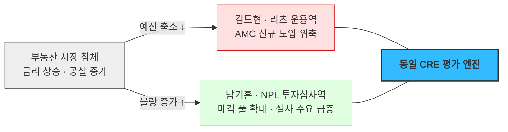

# 검토 — NPL 투자·매각 기관 · 기업 부동산 자산관리팀 편입

**질문**: 두 집단을 **핵심 고객**으로 편입할 수 있는가?
**대상 문서**: [스펙트럼 종합](02_사례_자산가치평가_스펙트럼-종합.md) · [세그먼트 맵](../04_tam-sam-som/02_사례_자산가치평가/02_market-segment-map.md)

---

> 🔴 **이 검토의 NPL 판정은 [08 남기훈 세그먼트 재판정](../08_value-proposition/01_검토_남기훈-세그먼트-재판정.md)으로 뒤집혔습니다.** 아래 §2의 6축 채점(전부 ◎)을 JTBD 인터뷰로 재채점한 결과 **◎3 · △2 · ✕1** 이 되었고, 특히 **② ARPU 체력이 반증**됐습니다 — 예산이 딜 손익이 아니라 **기존 데이터 구독료(연 3,000만)를 기준선**으로 잡히기 때문입니다(WTP 상한 연 2~3천). 세그먼트 판정은 **핵심 → 확장(간접 채널·직접 영업 제외)** 으로 바뀌었습니다.
>
> **아래 내용은 그 판정이 어떻게 만들어졌고 어디서 틀렸는지를 보이기 위해 원형 그대로 보존합니다.** 다만 **§3의 기업 부동산 판정(부적합)과 §4의 회계법인 누락 발견은 여전히 유효**하며, 오히려 재판정으로 더 강하게 지지됩니다.

## 1. 결론

| 후보 | 핵심 편입 | 한 줄 이유 |
|---|---|---|
| **NPL 투자·매각 전문 기관** | ⭕ **적합** ⚠️ *(재판정: 확장·간접)* | 우리 평가값이 **매입 단가를 직접 결정**합니다 |
| **기업 부동산 자산관리팀** | ✕ **부적합** | 문제는 있으나 **예산 항목도 반복성도 없습니다** |
| *(검토 중 발견)* **회계법인** | ⭕ **누락 보완** | 두 후보의 **공통 관문**인데 로스터에 한 명도 없었습니다 |

## 2. NPL — 지금까지 검토한 후보 중 가장 강합니다

[온투업 검토](04_검토_온투업-동산P2P-편입.md)와 같은 6축으로 채점했습니다.

| 기준 | 김도현(AMC) | **NPL 투자·자문** | 판정 |
|---|---|---|:---:|
| 확장 계수 | 1 계약 → 자산 수백 개 | 풀 1건 → **담보물 수십~수백 건 일괄 실사** | ◎ |
| ARPU 체력 | 5,000만~1억+ | 딜 규모가 수십~수백억. **데이터비가 오차 범위 안** | ◎ |
| 구매 속도 | 느림 (6~18개월) | **입찰 마감이 있음.** 실사 2~4주 안에 끝내야 함 | ◎ |
| 데이터 재사용성 | — | **CRE 파이프라인 거의 그대로** + 경매 낙찰가·회수기간 레이어만 추가 | ◎ |
| 시장 안정성 | 부동산 침체 시 예산 위축 | **침체기에 오히려 물량이 늘어남** | ◎ |
| 문제 심각도 | 평가 지연 (공시용) | **평가값 = 매입 단가.** 틀리면 곧 손실 | ◎ |

### 다섯 번째 줄이 이 검토의 핵심입니다

부동산 침체가 오면 김도현의 예산은 깎이는데 NPL 물량은 늘어납니다. **같은 CRE 엔진으로 경기 방향이 반대인 고객을 동시에 잡는 구조**라 매출 헤지가 됩니다. 지금까지 검토한 어떤 후보에도 없던 성질입니다.

### 리스크 둘

**① Build vs Buy — 전업 NPL 투자사는 이미 평가 역량이 있습니다**
축적된 경매 낙찰가 데이터와 자체 회수 모델이 곧 그들의 경쟁력입니다. 외부 데이터 도입이 **핵심 역량 외주화**로 읽힐 수 있습니다. [감정평가사(유가람)](01_사례_자산가치평가.md)의 저항과 메커니즘이 같은데, 여기서는 개인이 아니라 조직 차원입니다.

**② 고객 수가 적습니다** — 전업 투자사는 손에 꼽는 수준입니다. 박선우(거래소 18개사)와 같은 **소수·고ARPU** 구조입니다.

### 그래서 진입 순서를 뒤집습니다

| 순서 | 대상 | 이유 |
|:---:|---|---|
| 1 | **회계법인 NPL·부동산 자문팀** | 제3자 근거를 인용하는 것이 **곧 상품**이라 저항이 없음. 여러 딜에 반복 투입. 투자사로 레퍼런스가 흘러감 |
| 2 | 전업 NPL 투자사 | 자체 모델과의 **교차검증** 각도로 진입 — 대체가 아니라 검증 |

## 3. 기업 부동산 자산관리팀 — 핵심으로 보면 함정입니다

| 기준 | 진단 | 판정 |
|---|---|:---:|
| 확장 계수 | 지점망·공장까지 수십~수백 개 | ○ |
| **지불 주체** | 재무기획팀? 자산관리팀? 회계팀? — 의사결정 단위가 불분명하고 **예산 항목 자체가 없음** | ✕ |
| **반복성** | 연 1회 또는 이벤트 기반. K-IFRS에서 **재평가모형을 택한 기업만** 정기 수요가 있고 대부분 원가모형 | ✕ |
| **대체재 우위** | 회계 목적 재평가는 **감정평가서가 법적 요건**인 경우가 많아 우리 데이터로 대체 불가 | ✕ |
| 구매 속도 | 예산 신설이 필요해 가장 느림 | ✕ |

> ⚠️ **고객 수가 많다는 점이 오히려 위험 신호입니다.** 세그먼트 맵이 일반 부동산 보유자를 뺄 때 쓴 논리 그대로입니다 — 사건 기반·저빈도·건별 발주. **규모만 커진 N-04입니다.**

**어디에 두나** — 직접 고객이 아니라 간접 채널 뒤에 둡니다.

| 목적 | 실제 구매자 |
|---|---|
| 자산 재평가·손상검사 | **회계법인이 대신 삽니다** (조현우) |
| 세일앤리스백·유동화 검토 | **이재훈(증권사 심사역)의 딜 대상**이지 우리 고객이 아닙니다 |

## 4. 검토 중 발견 — 회계법인 페르소나가 통째로 빠져 있었습니다

NPL의 진입점도 회계법인, 기업 부동산의 대리 구매자도 회계법인입니다. 확인해 보니 **세그먼트 맵 2차 계층에 "회계법인"이 이미 들어가 있는데 페르소나 로스터에는 한 명도 없습니다.**

①단계 확산에서 조직 안쪽(정수민·오세라)은 파고들었지만, **자산을 소유한 쪽만 봤고 자산을 평가·검증·자문하는 쪽은 통째로 빠졌습니다.** 감정평가사를 "경쟁자"로만 본 것과 같은 사각지대입니다.

---

## 5. 신규 페르소나 카드

> ①단계 확산 수준이며 인터뷰 전 가설입니다. 인물명은 가상입니다.

### 🟢 남기훈 — NPL 투자심사역 *(당시 판정: 핵심 → **최종: 확장·간접 채널**)*

| 필드 | 내용 |
|---|---|
| **유형명** | 평가값이 곧 매입 단가인 심사역 |
| **역할** | 은행·저축은행이 매각하는 부실채권 풀을 실사·입찰·매입하고, 매입 후 회수(경매·매각·재구조화)를 관리합니다. 담보 대부분이 부동산입니다. |
| **주요 문제** | 입찰 마감까지 **2~4주 안에 담보물 수십~수백 건의 예상 낙찰가와 회수 기간**을 잡아야 합니다. 건별 감정평가를 받을 시간도 비용도 없어 경매 통계와 경험칙으로 밀어붙입니다. **여기서 1~2%만 틀려도 딜 전체 수익률이 뒤집힙니다.** |
| **목표** | 풀 단위 일괄 산정 + 건별 신뢰도. 값만이 아니라 **"언제 얼마에 회수되는가"** — 가격과 기간이 함께 필요합니다. |
| **감정** | 마감 압박과 **승자의 저주 공포.** 낙찰받고 나서 "이긴 게 아니라 비싸게 산 것" 아닐까 하는 불안이 남습니다. |
| **대체 솔루션** | 사내 축적 경매 낙찰가 DB + 엑셀 회수 모델 + 현장 실사. **이미 잘 굴러가고 있다고 믿습니다** — 이 점이 다른 페르소나와 결정적으로 다릅니다. |
| **사용 맥락** | 매각 공고 → **실사 기간 집중 사용(스파이크)**, 매입 후 보유 기간 담보가 모니터링(상시). 대량 배치 + 건별 상세가 함께 필요합니다. 세일즈 각도는 **대체가 아니라 교차검증**입니다. |

### 🔵 백서현 — 회계법인 딜 자문 담당 *(NPL 진입점 · 쐐기)*

| 필드 | 내용 |
|---|---|
| **유형명** | 제3자 근거를 인용하는 것이 곧 상품인 사람 |
| **역할** | NPL·부동산 딜의 실사와 밸류에이션 자문, 매각 자문. 딜마다 고객이 바뀝니다. |
| **주요 문제** | 자문 보고서에 넣을 가치 근거를 **매 딜마다 새로 만들어야** 합니다. 자체 추정을 쓰면 "그건 당신 의견 아니냐"는 반박을 받고, 감정평가를 매번 발주하면 일정과 비용이 안 맞습니다. |
| **목표** | 보고서에 **각주로 달 수 있는 독립 출처.** 정확도만큼 "우리가 만든 값이 아니다"라는 사실이 중요합니다. |
| **감정** | 방어 가능성에 대한 집착. 보고서가 분쟁에 들어가면 **근거만 남습니다.** |
| **대체 솔루션** | 공개 통계 + 사내 딜 DB + 필요 시 감정평가 발주. |
| **사용 맥락** | 딜 단위 스파이크지만 **한 계약이 여러 고객사 딜에 반복 재사용**됩니다. 확산 효과가 가장 큰 페르소나입니다 — 자문 보고서에 우리 이름이 각주로 남으면 그 자체가 레퍼런스가 됩니다. |

### 🟢 조현우 — 회계법인 감사·자산평가 검증 담당 *(확장)*

| 필드 | 내용 |
|---|---|
| **유형명** | 고객이 낸 숫자를 **깨는 쪽**에서 쓰는 사람 |
| **역할** | 피감기업·펀드의 자산평가 적정성 검증. 재평가·손상검사·NAV 감사. |
| **주요 문제** | 고객이 제출한 평가액이 타당한지 판단해야 하는데 **반증할 독립 데이터가 없습니다.** 결국 "감정평가서가 있는가"만 확인하는 형식 검증이 됩니다. |
| **목표** | 고객 숫자와 대조할 독립 기준값과 **이상치 탐지** — 어떤 자산의 평가액이 시장과 가장 많이 벌어져 있는지. |
| **감정** | 놓치면 책임. 감사 실패는 법인이 아니라 **개인 징계**로 옵니다. |
| **대체 솔루션** | 감정평가서 검토, 공개 통계 대조, 외부 평가전문가 선임. |
| **사용 맥락** | 결산·감사 시즌 집중. 화면을 오래 보지 않고 **"어긋난 것만 뽑아 주는" 형태**를 원합니다. |

> ⚠️ **이 카드가 만드는 구조적 문제**: [여정지도 S7](03_사례_고객여정지도.md)에서 김도현의 이탈 조건이 **"감사인이 방법론을 문제 삼으면 사용 중단"** 이었습니다. 그 감사인이 조현우입니다. **같은 데이터를 피감기업과 감사인 양쪽에 팔면** "감사인이 피감기업과 같은 소스를 본다"는 독립성 시비가 생깁니다.
>
> 해법은 계약 분리가 아니라 **방법론 공개**입니다. 산출 근거가 열려 있으면 양쪽이 같은 값을 보는 것이 문제가 아니라 오히려 표준이 됩니다. **다만 이 판단은 회계·감사 실무 확인이 필요합니다.**

### ⚪ 최도윤 — 대기업 재무기획팀 자산 담당 *(비활성 · 간접 채널)*

| 필드 | 내용 |
|---|---|
| **유형명** | 필요할 때만 한 번 사는 대형 보유자 |
| **역할** | 사옥·공장·물류센터·유휴부지 관리. 재평가, 매각, 담보 제공, 세일앤리스백 검토. |
| **주요 문제** | 보유 부동산의 현재가치를 상시 모르지만, **알아야 할 일이 자주 생기지 않습니다.** |
| **목표** | 이벤트가 생겼을 때 이사회·회계 대응 근거를 확보하는 것. |
| **감정** | 평소에는 무관심, 이벤트 때만 급함. |
| **대체 솔루션** | 감정평가법인 건별 발주 — **법적 효력까지 따라옵니다.** 우리보다 나은 선택지입니다. |
| **사용 맥락** | 지금은 없습니다. **조현우(감사)·이재훈(증권사)이 대신 사는 구조**로 접근합니다. |
| **뒤집힐 조건** | 재평가모형 채택 + 지점망 대량 보유 + 유동화 상시 검토 — 셋이 겹치는 소수 기업만 직접 고객이 됩니다. |

---

## 6. 로스터 갱신

| 페르소나 | 위치 | 비고 |
|---|---|---|
| **남기훈** NPL 투자심사역 | 🟢 **확장 — 간접 채널** *(당시: 🔵 핵심)* | [재판정으로 직접 영업 제외](../08_value-proposition/01_검토_남기훈-세그먼트-재판정.md) |
| **백서현** 회계법인 딜 자문 | 🔵 핵심 진입점 | **NPL 축의 쐐기** |
| **조현우** 회계법인 감사 검증 | 🟢 확장 | 독립성 이슈 설계 필요 |
| **최도윤** 기업 부동산 담당 | ⚪ 비활성 (간접 채널) | 직접 영업 대상 제외 |

**비활성 장벽이 다섯 종류가 됐습니다** — 구조(임성호) / 인식(유가람) / 이해상충(곽재원) / 가격(민서율·N-03) / **대체재 우위(최도윤)**. 마지막이 새로 나온 유형입니다. 우리보다 나은 선택지가 이미 있어서 안 사는 경우입니다.

## 7. NPL은 여정도 다릅니다

| 단계 | 김도현 | **남기훈** |
|---|---|---|
| **S1 트리거** | 분기 결산 | **매각 공고** — 외부에서 날아옴 |
| **S2 탐색** | 감정평가 vs 데이터 | 사내 모델 vs 외부 데이터 (**Build vs Buy**) |
| **S3 파일럿** | 감정평가액과 오차 대조 | **과거 낙찰 결과와 소급 대조** — 조민경식 백테스트 |
| **S4~S5** | 품의 → 보안심사 (가장 김) | 팀 단위 결정 (**짧음**) |
| **S7 운영** | 분기 사이클 | **입찰 시즌 스파이크** |
| **총 소요** | 6~18개월 | **1~3개월 추정** |

**S3가 과거 낙찰 결과 소급 대조라는 점이 중요합니다.** [as-of 조회](02_사례_자산가치평가_스펙트럼-종합.md)가 여기서도 필수가 됩니다 — 감사 소급 대응(대기 후보), 조민경 백테스트에 이어 **세 번째로 같은 요구가 나왔습니다.** 세 페르소나가 독립적으로 같은 기능을 요구하면 그건 옵션이 아니라 코어 사양입니다.

## 8. 확인이 필요한 것

| 확인 대상 | 왜 필요한가 |
|---|---|
| 국내 NPL 매각 규모와 추세 | SAM 산정 |
| 전업 NPL 투자사 수 | 고객 수 상한 |
| 회계법인 NPL·부동산 자문 조직 실재 여부·규모 | 쐐기 전략의 전제 |
| NPL 실사에서 현재 지출하는 평가 비용 | **지불의사 상한** |
| 감사인·피감기업 동일 데이터 사용의 독립성 규정 | 조현우 카드의 성립 여부 |
| K-IFRS 재평가모형 채택 기업 비중 | 최도윤의 뒤집힐 조건 |

> ⚠️ 이 검토는 **제도 구조와 사업 논리**에 근거했습니다. 위 정량 항목은 확인하지 않았고, 특히 **"회수 가능 가치"가 데이터 상품으로 팔리는 형태인지(아니면 자문 인건비에 묶여 있는지)** 는 인터뷰 전입니다.

## 9. 이 검토에서 배울 점

**① 경기 방향이 반대인 고객을 찾으면 매출이 헤지된다**
같은 엔진으로 침체기 고객(NPL)과 호황기 고객(AMC)을 동시에 잡는 구조는 세그먼트 맵의 판단 기준에 없던 축입니다. **편입 검토가 새 평가 기준을 만들어낸 사례입니다.**

**② 고객 수가 많은 후보를 경계하라**
기업 부동산팀은 수천 개인데 부적합하고, NPL은 손에 꼽는데 적합합니다. [세그먼트 맵의 첫 번째 교훈](../04_tam-sam-som/02_사례_자산가치평가/02_market-segment-map.md)이 다시 확인됐습니다.

**③ 소유자만 보고 평가·검증하는 쪽을 안 봤다**
회계법인 누락은 확산이 부족해서가 아니라 **확산의 방향이 한쪽으로 쏠려서** 생겼습니다. "이 자산을 가진 사람"만 물었고 "이 자산의 가치를 다투는 사람"은 묻지 않았습니다.

**④ 같은 요구가 세 번 나오면 코어 사양이다**
as-of 조회는 감사 소급·조민경 백테스트·남기훈 실사에서 각각 독립적으로 나왔습니다. **페르소나를 늘리는 진짜 이유가 여기 있습니다** — 요구사항의 중복이 우선순위를 알려줍니다.
