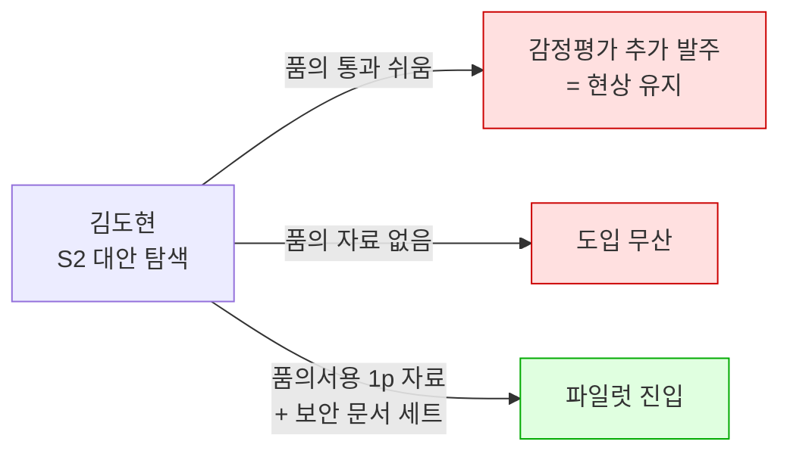

# 검토 — 감정평가법인 대비 경쟁력

**질문**: 김도현·박선우·백서현은 업계 관행상 감정평가법인을 쓰는데, 우리가 경쟁력을 가질 수 있는가?
**입력**: [AOS 산출](../06_시장기회분석/02_사례_aos-scoring.md)의 Satisfaction 근거 · [고객 여정지도](03_사례_고객여정지도.md) · [혼합 매트릭스](../06_시장기회분석/04_사례_aos-dos-매트릭스.md)

---

## 1. 결론

| 판단 | 내용 |
|---|---|
| **정면 경쟁하는가** | ✕ **아니오.** 최우선 과제 7종 중 감정평가법인과 부딪히는 항목이 **0개**입니다 |
| **어디서 이기나** | 주기 · 단가 구조 · 재현성 · 횡비교 · 시스템 적재 |
| **어디서 지나** | **법정 목적과 책임 귀속** — 기술로 넘을 수 없고, 넘으려 해서도 안 됩니다 |
| **진짜 위험** | 감정평가법인이 우리를 이기는 게 아니라, **고객이 "설명하기 쉬워서" 감정평가로 회귀**하는 것 |

**먼저 질문의 전제 하나를 갈라야 합니다.** 세 페르소나의 경쟁자가 서로 다릅니다.

| 페르소나 | 실제 대체 솔루션 | 경쟁 성격 |
|---|---|---|
| **김도현** (AMC) | 감정평가법인 + 엑셀 롤포워드 | 제도적 경쟁자 |
| **박선우** (거래소) | 자사 체결가 + **해외 인덱스 벤더** | **감정평가와 무관** — 가상자산은 감정평가 영역이 아닙니다 |
| **백서현** (회계법인) | 감정평가 발주 + 공개통계 + 사내 딜 DB | 부분 경쟁 |

## 2. 우리 점수표가 이미 답을 갖고 있었습니다

AOS의 Satisfaction을 **"지금 쓰는 대체 솔루션이 그 Goal을 얼마나 해결해 주는가"** 로 정의했으므로, 이 값을 감정평가 기준으로 다시 읽으면 경쟁 지형이 그대로 나옵니다. **18종 전수 분류입니다.**

| 판정 | 의미 | Pain | 매트릭스 위치 |
|:---:|---|---|---|
| ⭕ **3종** | 감정평가서가 **해결해 준다** | KD-3 감사 대응 · BS-2 QRM 인용 · BS-3 반박 대응 | Q2 · Q3 · Q3 |
| △ **3종** | **부분적으로** 해결 | JM-1 독립 값 · MK-1 근거 제시 · MK-2 산출 불가 | Q1 · Q4 · Q4 |
| ✕ **7종** | **해결 못 한다** | KD-1 주기 · JM-2 소급 재현 · MK-3 커버리지 · NG-1 사내모델 · NG-2 마감 · NG-3 소급 대조 · BS-1 재사용 | Q1 · Q1 · Q4 · Q3 · Q3 · Q4 · Q4 |
| ─ **5종** | **영역 자체가 다르다** | KD-2 보안심사 · PS-1 · PS-2 · PS-3 · JM-3 납품 형태 | Q1 · Q1 · Q2 · Q1 · Q1 |

### Q1(즉시 착수) 7종을 이 기준으로 쪼개면

| ID | 감정평가 판정 | 내용 |
|---|:---:|---|
| KD-2 | ─ | 보안·준법 심사 문서 — 평가 문제가 아님 |
| PS-1 | ─ | 가상자산 기준가 — 감정평가 영역 아님 |
| PS-3 | ─ | 신규 상장 구간 — 감정평가 영역 아님 |
| JM-3 | ─ | 납품 형태(파일 배치) — 평가 문제가 아님 |
| KD-1 | ✕ | 자산 수백 개 월·분기 갱신 — **단가 구조상 불가** |
| JM-2 | ✕ | 과거 시점 재현 — 감정평가서는 시점 스냅샷 |
| JM-1 | △ | 외부 감평 의뢰로 일부 가능하나 **포트폴리오 전량은 불가** |

**⭕(감정평가가 이기는 항목)가 0개입니다.** 우연이 아닙니다 — 감정평가가 잘 해주는 자리는 Satisfaction이 높게 매겨져 자동으로 아래로 내려갔기 때문입니다. **AOS 순위표는 사실상 "감정평가가 못 하는 것" 순위표입니다.**

> 💡 **더 중요한 것은 `─` 4종이 Q1의 절반 이상이라는 점입니다.** 우리 최우선 과제의 다수는 감정평가 시장을 뺏는 것이 아니라 **감정평가가 아예 존재하지 않는 곳**(디지털 자산·납품 형태·보안 심사)에 있습니다. **경쟁 회피가 아니라 애초에 다른 시장입니다.**

## 3. 이기는 자리와 지는 자리

| 영역 | 승자 | 이유 |
|---|:---:|---|
| 담보 설정 · 공시 · 세무 · 소송 | **감정평가법인** | 유자격자 독점 업무. **법으로 막혀 있어 기술로 못 넘습니다** |
| 오류 시 책임 귀속 | **감정평가법인** | 허위감정죄 등 법적 책임을 집니다. **"책임져 줄 사람이 있다"가 곧 상품**입니다 |
| 신규 자산 편입 초기 평가 | **감정평가법인** | 관행이 확립돼 있고 굳이 바꿀 이유가 없음 |
| 자산 수백 개 월·분기 갱신 | **우리** | 감정평가 단가로는 비용이 성립하지 않음 |
| 과거 시점 재현 (as-of) | **우리** | 감정평가서는 시점 스냅샷이라 소급 불가 |
| 포트폴리오 동일 기준 횡비교 | **우리** | 법인·평가사마다 기준이 달라 비교가 성립 안 됨 |
| 시스템 적재 | **우리** | PDF 감정평가서는 리스크 시스템에 못 들어갑니다 |
| 산출 불가의 정직한 선언 | **우리** | **감정평가는 어떻게든 값을 냅니다** — 문경아가 못 믿는 이유 |

> **마지막 줄이 역설적입니다.** 감정평가의 강점(반드시 값을 낸다)이 특수자산에서는 약점이 됩니다. [문경아의 Goal](../06_시장기회분석/01_사례_pain-list.md)이 "산출 불가를 이유와 함께 받는 상태"인데, 감정평가는 구조적으로 그걸 못 줍니다.

## 4. 진짜 위험은 성능이 아니라 품의 통과입니다

[김도현 여정 S2의 이탈 지점](03_사례_고객여정지도.md)에 이미 적혀 있습니다.

> **"감정평가 추가 발주가 더 설명하기 쉬워서 회귀"**

**감정평가에 지는 방식은 정확도 비교가 아닙니다.** 담당자가 품의서에 한 줄로 쓸 수 있느냐입니다. 감정평가 발주는 전례가 있고 예산 항목이 있고 결재선이 익숙합니다. 우리는 셋 다 없습니다.

이 구간을 뒤집는 것이 **KD-2(보안·준법 문서 세트)** 와 **KD-3(감사 대응 근거)** 입니다. 두 항목이 각각 Q1과 Q2에 있는 것이 우연이 아닙니다 — **제품 성능이 아니라 경쟁 구도가 만든 요구사항**입니다.

## 5. 페르소나별 판단

### 🔵 김도현 — 경쟁이 아니라 샌드위치

감정평가서를 **연 1~2회 앵커**로 두고 그 사이를 채우는 구조입니다. 실제로 [파일럿 합격 기준이 "직전 감정평가액과의 오차"](03_사례_고객여정지도.md)라, **감정평가는 경쟁자이자 동시에 우리 정답지**입니다.

| | 내용 |
|---|---|
| **이기는 근거** | 주기(연 1~2회 → 월·분기), 자산 수백 개 단가 구조, 시스템 적재 |
| **유일한 충돌 지점** | **KD-3 감사 대응.** 감사인이 우리 방법론을 안 받아주면 그대로 감정평가로 회귀 |
| **필요한 것** | 방법론 문서 + 산출 이력 + 품의서용 1페이지 자료 |

### 🔵 박선우 — 감정평가는 무관, 대신 유일한 상용 경쟁자

나머지 페르소나의 대체 솔루션은 전부 엑셀·전화·내부 규정인데 **거래소만 글로벌 인덱스 벤더라는 실제 제품과 겨룹니다.** [여정 S2](03_사례_고객여정지도.md)에서 "해외 것도 있는데 굳이"가 이탈 사유로 잡혀 있는 이유입니다.

| | 내용 |
|---|---|
| **경쟁자** | 해외 인덱스·데이터 벤더 |
| **차별점** | 원화 시장 반영, 국내 거래소별 가중치, 국내 규제·공시 대응 |
| **위험** | 이 세 가지가 안 서면 **가격 경쟁으로 밀립니다** |

### 🔵 백서현 — 가장 명확한 우위

감정평가 발주는 비용·일정 때문에 **큰 건에만** 쓰고, 무엇보다 **딜마다 새로 발주해야 해서 재사용이 안 됩니다.**

백서현의 Goal이 **"딜이 바뀌어도 같은 출처를 각주로 재사용하는 상태"** 인데, 감정평가서는 구조적으로 그걸 못 줍니다. **경쟁이 아니라 감정평가가 커버하지 못하는 빈도 구간**입니다.

| | 감정평가 발주 | 우리 |
|---|---|---|
| 단위 | 딜마다 건별 | 구독 |
| 재사용 | ✕ | ⭕ |
| 스크리닝 단계 | 비용 때문에 불가 | 가능 |
| 큰 건 최종 근거 | ⭕ **여전히 필요** | 보조 |

## 6. 감정평가법인을 경쟁자가 아니라 채널로

[유가람(감정평가사) 카드](01_사례_자산가치평가.md)의 전환 조건과 이어집니다.

| 전환 전 | 전환 후 |
|---|---|
| 대체 위협으로 인식 → 고객사 도입 논의에서 반대 | **평가 보조 도구**로 포지셔닝 → 리셀·제휴 |
| 법정 평가 영역을 우리가 침범한다고 봄 | **법정 평가는 유자격자 영역으로 명시적 분리** |

감정평가사 본인도 **사례 부족과 데이터 접근에 시달립니다.** 특히 특수자산·지방 물건에서 그렇습니다 — 문경아의 문제와 같은 문제를 반대편에서 겪는 셈입니다. **우리 데이터가 감정평가서의 입력이 되는 구조**가 성립하면 적대 세력이 유통 채널로 바뀝니다.

## 7. 정직하게 남는 리스크

**① 진입장벽이 라이선스가 아니라 데이터·기술입니다.**
법이 우리를 막는 영역(법정 평가)은 반대로 **대형 감정평가법인이 데이터 사업으로 나오는 것을 막지 않습니다.** 해외에서 CBRE·JLL이 자체 밸류에이션 데이터를 내는 것과 같은 경로입니다. 그쪽은 이미 **수임 이력과 현장 데이터**를 갖고 있습니다.

**② 우리 해자는 초기 3년에 없습니다.**

| 해자 | 언제 생기나 |
|---|---|
| 여러 기관을 가로질러 보는 위치 *(감정평가법인은 개별 수임 건만 봅니다)* | 고객 수가 쌓인 뒤 |
| 시스템 결합에 따른 교체 비용 | 연동 후 |
| 재현성 인프라(as-of 이력) | 운영 기간이 쌓인 뒤 |

**셋 다 시간이 필요합니다.** 그래서 [락인이 빠른 거래소(박선우)와 확산이 빠른 회계법인(백서현)부터](06_검토_NPL-기업부동산-편입.md) 가는 순서가 맞습니다. 김도현 축은 해자가 생긴 뒤에 정면으로 붙는 편이 안전합니다.

**③ "감정평가 대체"로 포지셔닝하는 순간 집니다.**
[미술품 검토](../04_tam-sam-som/02_사례_자산가치평가/04_미술품-버티컬-검토.md)와 [TAM 산정](../04_tam-sam-som/02_사례_자산가치평가/01_TAM-SAM-SOM_산정.md)이 반복해서 지적한 함정입니다 — "감정평가 자동화"로 정의하면 **감정평가 수수료 시장에 갇히고**, 그 시장에서는 법적 효력을 가진 쪽이 이깁니다.

## 8. 검증이 필요한 것

| 확인 대상 | 왜 결정적인가 |
|---|---|
| **감정평가 추가 발주에 실제로 쓰는 연간 비용** | 그 금액이 **지불의사 상한**입니다 ([미술품 검토 §12](../04_tam-sam-som/02_사례_자산가치평가/04_미술품-버티컬-검토.md)의 ④⑤와 같은 논리) |
| **감사인이 우리 값을 근거로 받아들이는가** | 부정이면 **김도현 축 전체가 흔들립니다.** [조현우(회계법인 감사)](06_검토_NPL-기업부동산-편입.md) 인터뷰 대상 |
| 품의·투자심의에서 데이터 구독의 예산 항목 존재 여부 | S2 회귀를 막을 수 있는지 결정 |
| 대형 감정평가법인의 데이터 사업 진출 여부 | 해자 형성 전에 들어오면 순서를 바꿔야 함 |
| 거래소가 해외 인덱스 벤더에 지불하는 금액 | 박선우 축의 가격 상한 |

## 9. 이 검토에서 배울 점

**① Satisfaction을 성실히 매겨두면 경쟁 분석이 따라 나옵니다.**
별도의 경쟁사 조사 없이 AOS 표만 다시 읽어 18종을 분류할 수 있었습니다. **Satisfaction은 "우리 제품 만족도"가 아니라 "대체 솔루션 만족도"라는 정의를 지킨 덕분**입니다. 정의를 느슨하게 잡았다면 이 분석은 불가능했습니다.

**② 최우선 과제의 절반이 경쟁자가 없는 영역이었습니다.**
Q1 7종 중 4종이 감정평가와 **영역 자체가 다릅니다.** 경쟁 우위를 고민하기 전에 **경쟁이 존재하는지부터 확인**해야 한다는 뜻입니다.

**③ 지는 방식이 성능 비교가 아니었습니다.**
여정지도가 잡아낸 이탈 사유는 "정확도가 낮아서"가 아니라 **"설명하기 쉬워서 원래 하던 걸 한다"** 였습니다. 이런 종류의 패배는 제품 개선으로 못 막고 **품의 자료·보안 문서 같은 비제품 자산**으로 막습니다.

---

> ⚠️ **검증 상태**: 이 검토는 감정평가 제도의 구조적 사실(유자격자 독점, 법적 책임, 시점 스냅샷 성격)과 **우리가 매긴 가설 Satisfaction 점수**에 근거합니다. 감정평가 발주 단가·빈도, 감사인의 수용 여부, 해외 인덱스 벤더의 국내 계약 조건은 **모두 미확인**입니다.
