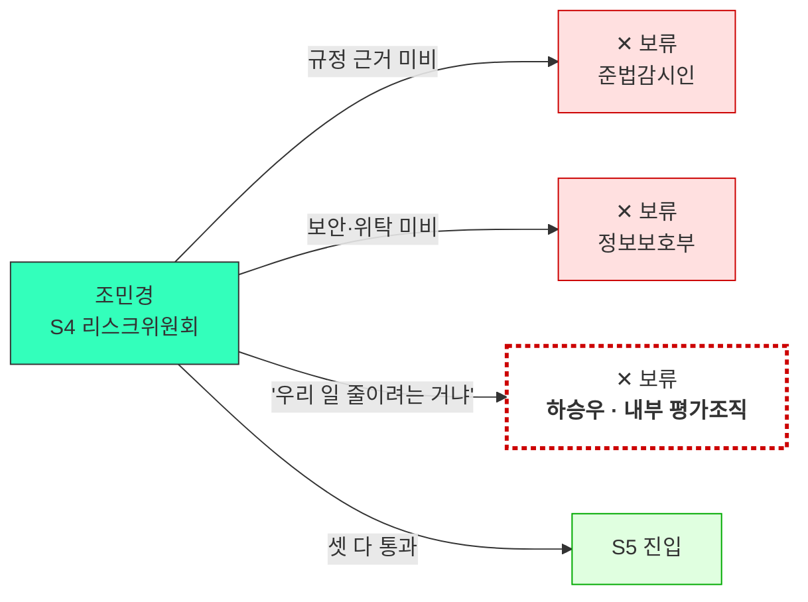
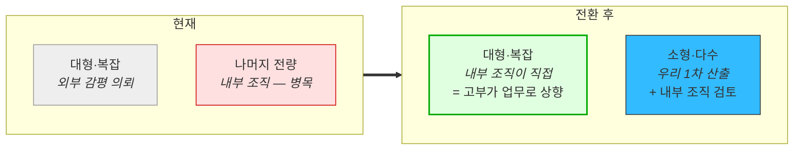

# 검토 — 고객사 내부 평가조직 편입 (은행 자체 감정평가 조직)

**질문**: [JTBD 종합에서 신규 발견된 이해관계자](../07_jtbd/08_종합_인터뷰-결과.md)를 페르소나 로스터에 어떻게 넣는가?
**계기**: 조민경 인터뷰의 Habits 항목 — *"내부 감정 인력들이 **'우리 일 줄이려는 거냐'** 고 볼 수 있습니다."*
**입력**: [조민경 응답지](../07_jtbd/05_응답지_조민경.md) · [스펙트럼 종합 §5](02_사례_자산가치평가_스펙트럼-종합.md) · [감정평가법인 경쟁력 검토](07_검토_감정평가법인-경쟁력.md)

---

## 1. 결론

| 항목 | 판정 |
|---|---|
| 로스터 편입 | ⭕ **필요** — 조민경 세그먼트(SAM 2위, 24억)의 **세 번째 게이트키퍼**입니다 |
| 유형 | ⚪ **비활성** — 장벽 성격은 **고용 방어**(6번째 유형, 신규) |
| 유가람(외부 감정평가사)과 통합? | ✕ **분리해야 함** — 위치·저항 동기·전환 결과가 전부 다릅니다 |
| 전환 시 편입 | 🟢 **조민경 세그먼트의 도입 가속** — 유가람과 달리 **매출로 직결** |
| 새 이름 | **하승우** *(가상)* — 기존 19개 인물명과 중복 없음 |

> **한 줄 요약**: [유가람(감정평가사)의 저항을 외부 이해관계자로만 봤는데, **같은 저항이 고객 조직 안에** 있었습니다.](01_사례_자산가치평가.md) 그리고 안쪽 버전은 전환했을 때 **채널이 아니라 매출**이 됩니다.

---

## 2. 왜 유가람과 합치면 안 되는가

| | **유가람** *(외부 감정평가사)* | **하승우** *(고객사 내부 평가조직)* |
|---|---|---|
| 소속 | 감정평가법인 | **고객사(은행) 내부 부서** |
| 우리와의 관계 | 대체재 공급자 + 도입 저지 영향자 | **게이트키퍼 + 잠재 사용자** |
| 저항 동기 | **직역 방어** — 시장을 지킴 | **고용 방어** — 자리를 지킴 |
| 저항이 발현되는 곳 | 고객사 내부 도입 논의에서 반대 의견 | **리스크위원회 안건 심의**(참석자 10명 단위) |
| 전환 수단 | 보조 도구 포지셔닝 + 리셀 | **업무 상향 재배치** → §5 |
| **전환 결과** | 유통 **채널** *(매출 아님)* | **조민경 세그먼트 도입 가속** *(매출 직결)* |
| 스펙트럼 축 | 비활성 — **인식적 거부** | 비활성 — **고용 방어** |

> 🔴 **전환 결과의 성격이 다른 것이 분리의 결정적 근거입니다.** [스펙트럼 종합이 *"임성호는 전환하면 조민경 세그먼트의 매출이 되지만, 유가람은 전환해도 매출이 아니라 채널이 된다 — 전환 결과의 성격부터 다르다"*](02_사례_자산가치평가_스펙트럼-종합.md) 고 적었는데, **하승우는 임성호 쪽입니다.** 유가람과 같은 칸에 넣으면 이 차이가 지워집니다.

### 2-1. 비활성 장벽이 여섯 종류가 됐습니다

| # | 장벽 | 페르소나 | 성질 |
|:---:|---|---|---|
| 1 | **구조적 불가** | 임성호 | 못 씀 — 회선이 없음 |
| 2 | **인식적 거부** | 유가람 | 안 씀 — 직역 방어 |
| 3 | **이해상충** | 곽재원 | 못 씀 — 구조가 막음 |
| 4 | **가격** | 민서율 · 소형 AMC | 못 씀 — 체력 부족 |
| 5 | **대체재 우위** | 최도윤 | 안 씀 — 더 나은 선택지 존재 |
| **6** | **고용 방어** | **하승우** | **안 씀 — 자기 자리가 걸림** |

**6번이 다른 다섯과 구별되는 점**: 앞의 다섯은 **본인이 안 쓰는** 이유인데, 하승우는 **본인은 쓸 수 있지만 조직의 도입을 막는** 위치입니다. 사용 여부가 아니라 **거부권**이 문제입니다.

---

## 3. 페르소나 카드 — 하승우

*(①단계 확산 수준 · 인터뷰 전 가설 · 인물명은 가상)*

| 필드 | 내용 |
|---|---|
| **유형명** | 우리 도입이 자기 일의 존재 이유를 흔드는 사람 |
| **역할** | 시중은행 여신리스크부 **자체 감정평가 조직** 소속. 담보물 내부 감정평가를 수행합니다. 조민경이 배정하면 결과를 만들어 올리는 쪽. *"내부 감정 조직은 20년 넘었습니다"*(조민경) |
| **주요 문제** | **두 겹입니다.** ① 인력이 한정돼 배정에서 결과까지가 가장 긴 병목입니다 — *"내부 감정 배정에서 결과 받는 데가 제일 깁니다. 인력이 한정돼 있어서요"*(조민경). ② 자기 값을 검증할 수단이 없습니다 — *"같은 물건을 내부랑 외부가 20% 다르게 본 적이 있어요. **어느 쪽이 맞는지 아무도 모릅니다**"*(조민경 J5) |
| **목표** | 한정된 인력으로 감정 물량을 소화하면서 **자기 산출값의 타당성을 방어**하는 것. 감독 검사에서 *"자체 감정 비중이 과도하다"* 는 지적을 받은 뒤 조직 자체가 압박을 받고 있습니다 |
| **감정** | **이중 불안.** 외부 데이터가 들어오면 자기 일이 줄어든다는 위협감과, 동시에 자기 값이 틀렸을 때 방어할 근거가 없다는 불안이 겹칩니다 |
| **대체 솔루션** | 본인의 경험과 현장조사, 내부 감정 규정. **대체 솔루션이 곧 본인입니다** — 유가람과 같습니다 |
| **사용 맥락** | 지금은 없습니다. **이 카드의 가치는 사용이 아니라 거부권의 위치를 특정하는 데** 있습니다. 조민경 여정 **S4(리스크위원회)** 에서 반대 의견을 낼 수 있고, 위원 한 명의 반대로 안건이 보류됩니다 |

---

## 4. 조민경 여정에 게이트키퍼가 셋이 됐습니다

[여정지도](03_사례_고객여정지도.md)의 조민경 축을 갱신해야 합니다.

| 단계 | 기존 게이트키퍼 | **추가** |
|---|---|---|
| **S4 리스크위원회** | 위원 10명 단위 — *"위원 한 분이라도 반대하시면 보류"* | 🔴 **하승우(내부 평가조직)의 반대 의견** |
| S5 보안·위탁 이중 심사 | 정보보호부 + 위탁 심사 | — |

> 💡 **[여정지도 §11-⑤가 *"게이트키퍼는 조직마다 다른 사람이다 — 하나로 뭉뚱그리면 세 개 중 두 개는 못 넘는다"*](03_사례_고객여정지도.md) 고 했습니다.** 조민경 축에서는 **한 조직 안에 셋**이고, 준비할 자료가 전부 다릅니다 — 규정 해석 자료 / 보안 문서 / **업무 재배치 설계**.

---

## 5. 전환 조건 — "일을 줄인다"가 아니라 "못 하던 일을 메운다"

**저항의 근거를 다시 읽으면 전환 지점이 보입니다.** 하승우 조직은 **한가한 게 아니라 병목**입니다.

| 조민경의 진술 | 함의 |
|---|---|
| *"내부 감정 배정에서 결과 받는 데가 제일 깁니다. **인력이 한정돼 있어서요**"* | 조직이 **과부하** 상태 |
| *"대형 건은 외부 감평 의뢰하고, 나머지는 내부에서 처리합니다"* | 이미 **업무가 분담**돼 있음 |
| *"쓸 수 없게 된다면 **내부 감정 인력을 늘려달라고** 하겠죠. 안 될 겁니다"* | 증원은 **불가**로 확인됨 |
| *"내부랑 외부가 20% 다르게 본 적이 있어요"* | 자기 값의 **검증 수단이 없음** |

> 🔴 **"우리 일 줄이려는 거냐"라는 저항은 사실 근거가 약합니다.** 줄일 일이 있는 게 아니라 **소화하지 못하는 물량**이 있습니다. 프레이밍을 바꿀 여지가 여기 있습니다.

### 전환 설계 — 업무 상향 재배치

| 요소 | 내용 |
|---|---|
| **프레이밍** | *"내부 감정을 대체한다"* ✕ → *"내부 조직이 손대지 못하는 구간을 메운다"* ⭕ |
| **부수 효과** | 대형 건의 외부 감평 의뢰 비용이 줄어듦 *(조민경: 감독 지적 후 **외부 감평 비용이 두 배**가 됨)* |
| **하승우 본인의 이득** | 자기 산출값을 **대조할 독립 기준**이 생김 — J5의 *"어느 쪽이 맞는지 아무도 모릅니다"* 해소 |
| **구조적 동일성** | [감정평가사 하이브리드(우리 산출 → 평가사 검토·서명)](07_검토_감정평가법인-경쟁력.md)와 **같은 구조를 조직 내부에 적용** |

> 💡 **하승우는 유가람과 저항 동기는 다르지만 전환 수단은 같습니다.** 둘 다 *"평가 주체를 바꾸지 않고 입력을 제공한다"* 입니다. **[감정평가법인 경쟁력 검토 §10-5의 하이브리드 구조가 조직 내부에서도 재사용된다**는 뜻이고, 이는 그 설계의 범용성을 시사합니다.

---

## 6. 로스터 갱신

| 페르소나 | 위치 | 비고 |
|---|---|---|
| **하승우** 은행 내부 평가조직 | ⚪ **비활성 (고용 방어)** | **조민경 세그먼트의 세 번째 게이트키퍼.** 전환 시 매출 직결 |

### 스펙트럼 밖 이해관계자 역할표 갱신

[스펙트럼 종합 §5](02_사례_자산가치평가_스펙트럼-종합.md)의 표에 한 줄을 더합니다.

| 이해관계자 | 역할 | 어디서 관리하나 |
|---|---|---|
| **하승우** ① *(내부 감정 물량 수행자)* | **잠재 사용자** — 검증 기준 필요 | **비활성 페르소나로 유지** |
| **하승우** ② | **도입 저지 영향자** — S4 리스크위원회 | 조연(게이트키퍼) |
| **하승우** ③ | **내부 대체재** — 자체 감정평가 자체 | 경쟁 구도 |

**유가람이 4개 역할로 갈렸던 것과 같은 구조가 3개 역할로 반복됩니다.** [스펙트럼 4축이 직교하지 않는다](02_사례_자산가치평가_스펙트럼-종합.md)는 지적이 재확인됩니다 — **평가를 수행하는 주체는 항상 사용자·경쟁자·게이트키퍼를 겸합니다.**

---

## 7. 점수에 미치는 영향

| 항목 | 영향 | 판단 |
|---|---|---|
| **JM-1 · JM-2 · JM-3 점수** | 없음 | Pain은 조민경 관점이고 하승우는 게이트키퍼 |
| **조민경 전환 판정** | 이미 반영됨 | Habits ★★★★의 근거가 *"내부 감정 조직 20년 / 인력들이 '우리 일 줄이려는 거냐'"* 였음 — **이름이 붙었을 뿐 점수는 그대로** |
| **조민경 도입 기간(12~24개월)** | 🔴 **상향 압력** | 게이트키퍼가 셋이면 리드타임이 늘어남. 다만 정량화 불가 |
| **MVP Feature** | **F26 신설 후보** | *"내부 조직 대비 차이 리포트"* — [F17(이상치·차이 리포트)](../08_value-proposition/IVI-VPS-v1_0-merged.md)의 수혜자가 하나 더 늘어남 |

> 💡 **F17의 수혜자가 셋이 됐습니다** — 조현우(회계법인 감사) · 남기훈(NPL) · **하승우(은행 내부 평가조직)**. [남기훈 재판정에서 *"F17의 개발 근거가 남기훈 매출과 분리된다"*](../08_value-proposition/01_검토_남기훈-세그먼트-재판정.md) 고 했는데, 이제 **세 페르소나가 독립적으로 같은 기능을 요구**합니다. [Pain List의 "대체하지 않고 대조하는 상태" 클러스터가 2회 → 3회](../06_시장기회분석/01_사례_pain-list.md)로 올라가, **상위 클러스터와 동급**이 됩니다.

---

## 8. 이 검토에서 배울 점

**① 같은 저항이 조직 안과 밖에 동시에 존재할 수 있습니다.**
유가람(외부)을 잡아두고 만족했는데, 같은 메커니즘이 **고객사 내부**에도 있었습니다. **"경쟁자"로 분류한 집단이 고객 조직 안에 축소판으로 들어있는지 점검**해야 합니다.

**② 저항의 진술과 저항의 근거가 다를 수 있습니다.**
*"우리 일 줄이려는 거냐"* 는 진술이지만, 실제 상황은 **과부하와 증원 불가**입니다. **줄일 일이 없으니 프레이밍을 바꿀 여지**가 생깁니다 — 저항을 액면으로 받으면 이 지점이 안 보입니다.

**③ 전환 수단이 다른 페르소나에서 재사용됐습니다.**
[감정평가사 하이브리드 구조](07_검토_감정평가법인-경쟁력.md)를 조직 내부에 그대로 적용할 수 있습니다. **한 페르소나를 위해 설계한 구조가 다른 페르소나에도 맞으면, 그 구조의 범용성이 확인된 것**입니다.

**④ 평가 수행 주체는 항상 3~4개 역할을 겸합니다.**
유가람 4역할, 하승우 3역할입니다. **스펙트럼 4축이 직교하지 않는다**는 것이 우연이 아니라 **이 산업의 구조**입니다 — 평가를 하는 사람은 필연적으로 사용자·경쟁자·게이트키퍼를 동시에 맡습니다.

**⑤ 게이트키퍼를 발견해도 점수는 안 바뀝니다.**
조민경의 Habits ★★★★는 이미 이 저항을 세고 있었습니다. **바뀐 것은 점수가 아니라 대응 대상의 특정**입니다 — 무엇을 준비해야 하는지가 *"보안 문서 / 규정 해석 자료"* 에서 *"업무 재배치 설계"* 하나가 더 붙었습니다.

---

> ⚠️ **검증 상태**: 이 카드는 [조민경 응답지](../07_jtbd/05_응답지_조민경.md)의 **간접 진술**에서 도출했습니다. 하승우 본인을 인터뷰한 것이 아니고, 그 응답지 자체가 **AI 생성 가상 응답**입니다. 따라서 이 카드는 **가설의 가설**입니다.
>
> | 확인 대상 | 왜 필요한가 |
> |---|---|
> | 은행 자체 감정평가 조직의 실제 규모·인력 | 병목 주장의 사실 여부 |
> | 리스크위원회에 내부 평가조직 대표가 참석하는가 | 거부권의 실재 여부 |
> | 내부·외부 감정 결과 괴리의 실제 빈도 | *"20% 차이"* 의 사실성 |
> | 감독 규정상 내부 감정 비중 제한 여부 | 업무 재배치의 제도적 여지 |
>
> **가장 먼저 확인할 것은 두 번째입니다** — 리스크위원회 참석 여부가 부정이면 이 페르소나는 게이트키퍼가 아니라 단순 이해관계자로 내려가고, 대응 우선순위가 크게 낮아집니다.
