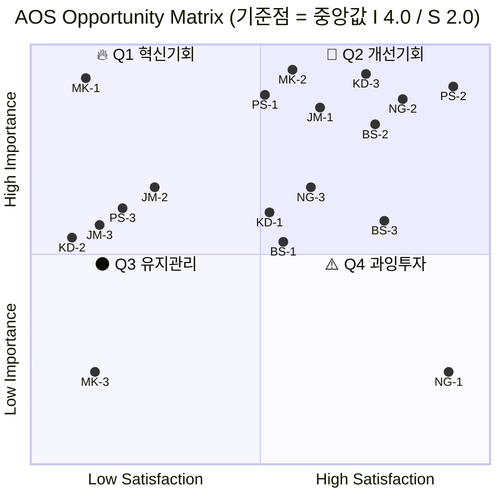

# ②~⑤단계 — Importance · Satisfaction 평가와 AOS 산출

**입력**: [01_사례_pain-list.md](01_사례_pain-list.md) — Pain/Goal 21종 중 **AOS 대상 18종**
**방법론**: [00_학습노트 §4](00_학습노트.md) — `AOS = Importance × (1 − Satisfaction/5)`

| 단계 | 이 문서의 위치 |
|---|---|
| **② Importance 평가** | §2 |
| **③ Satisfaction 평가** | §3 |
| **④ AOS 계산** | §4 |
| **⑤ Matrix 시각화** | §5 (기준점 A안) · §6 (B안 병기) |

---

## 1. 점수 부여 원칙

> ⚠️ **이 점수는 인터뷰 결과가 아니라 가설 점수입니다.** [여정지도](../05_페르소나/03_사례_고객여정지도.md)와 페르소나 카드의 `대체 솔루션` 필드에서 추론했습니다. 실제 AOS는 고객이 매겨야 하며, 이 표의 최종 용도는 **인터뷰 후 실제 값과 나란히 놓고 어디가 틀렸는지 확인하는 것**입니다.
>
> 📌 **그 비교는 [§9](#9-인터뷰-후-갱신--가설-점수와-나란히)에서 수행했습니다.** §2~§8의 가설값은 원형 보존하고 갱신값을 §9에 병기했습니다. **§9에서 사분면 기준선이 척도 상한에 닿아 재퇴화한 것이 확인**됐으므로, 사분면을 인용하기 전 §9-5를 반드시 읽으십시오.

### 척도 정의 — 매기기 전에 말로 고정합니다

| 점수 | **Importance** — 이 Goal에 도달하는 것이 얼마나 중요한가 | **Satisfaction** — 지금 쓰는 **대체 솔루션**이 그 Goal에 얼마나 근접해 있는가 |
|:---:|---|---|
| **5** | 이게 안 되면 업무·도입 자체가 성립하지 않음 | 사실상 해결됨. 불편이 없음 |
| **4** | 목표 달성에 직접 영향. 자주 발목을 잡음 | 대체로 해결됨. 가끔 아쉬움 |
| **3** | 업무에 지장은 있으나 우회 가능 | 불편하지만 굴러감 |
| **2** | 있으면 좋지만 없어도 진행됨 | 억지로 버팀. 결과를 신뢰하기 어려움 |
| **1** | 관심 밖 | 대응 수단이 사실상 없음 |

**Satisfaction은 우리 제품에 대한 만족도가 아닙니다.** 지금 이 사람이 쓰고 있는 엑셀·전화·감정평가서에 대한 만족도입니다.

---

## 2. ② Importance 평가

| ID | Goal (해결된 상태) | I | 근거 |
|---|---|:---:|---|
| **KD-1** | 마감 시점에 자산 전량의 현재가치가 갱신돼 있는 상태 | 4 | 공시에 직결되나, 지금 방식으로도 감사를 통과해 왔음 |
| **KD-2** | 챙기지 않아도 심사 자료가 준비돼 통과되는 상태 | 4 | 막히면 도입이 0이 되지만 본인 업무 목표에는 간접적 |
| **KD-3** | 감사인 질문에 문서 한 장으로 답하는 상태 | **5** | 감사에서 깨지면 **쓰던 것도 중단**됨 |
| **PS-1** | 우리 시세와 기준가의 괴리를 실시간 설명하는 상태 | **5** | 상장·상폐·공시 판단의 기초. 사고 시 회사 신뢰 붕괴 |
| **PS-2** | 공급자 장애가 전파되지 않는 상태 | **5** | 상시 결합이라 장애가 곧 서비스 중단 |
| **PS-3** | "지금은 기준가를 낼 수 없다"를 선언해 주는 상태 | 4 | 조작 위험이 가장 큰 구간이나 종목 범위가 한정적 |
| **JM-1** | 감독 지적에 외부 독립 값으로 보완·반박하는 상태 | **5** | 이미 공식 지적을 받은 사안 |
| **JM-2** | 과거 임의 시점의 값과 방법론을 재현하는 상태 | 4 | 백테스트가 안 되면 도입 검증 자체가 불가 |
| **JM-3** | 회선을 열지 않고 심사를 통과해 도입하는 상태 | 4 | 도입 가부를 결정. 단 우회 수단 검토 여지 있음 |
| **MK-1** | 값과 사례 건수·충분성 등급이 같은 화면에 있는 상태 | **5** | 신뢰의 전제. 없으면 첫 화면에서 이탈 |
| **MK-2** | 산출 불가를 이유와 함께 받는 상태 | **5** | 이 사람 포트폴리오의 본질적 조건 |
| **MK-3** | 계약 전에 커버리지를 아는 상태 | 3 | 없어도 개별 조회로 확인 가능 |
| **NG-1** | 사내 모델과의 차이를 확인해 교차검증하는 상태 | 3 | **외부 데이터 없이도 목표(회수가 판단)는 달성 중** |
| **NG-2** | 실사 데드라인 안에 전량 산정이 끝나는 상태 | **5** | 마감을 놓치면 그 딜 전체가 무용 |
| **NG-3** | 과거 낙찰 대비 정확도를 도입 전에 확인하는 상태 | 4 | 도입 판단의 근거 |
| **BS-1** | 딜이 바뀌어도 같은 출처를 재사용하는 상태 | 4 | 보고서 품질·수임 경쟁력에 직결 |
| **BS-2** | 법인 표준 인용 출처로 등록된 상태 | **5** | 통과 못 하면 인용 자체가 불가 |
| **BS-3** | 상대측 반박에 방법론 문서로 답하는 상태 | 4 | 분쟁 리스크 |

## 3. ③ Satisfaction 평가 — 대체 솔루션 기준

| ID | 현재 대체 솔루션 | S | 근거 |
|---|---|:---:|---|
| **KD-1** | 연 1~2회 감정평가서 + 엑셀 롤포워드 | 2 | 법적 근거는 있으나 시장 변화를 못 따라감 |
| **KD-2** | 벤더에 그때그때 자료 요청 | **1** | 대부분 미비해 반려. 대응 수단이 사실상 없음 |
| **KD-3** | 감정평가서 (법적 효력 보유) | 3 | **감사 대응은 감정평가서로 이미 되고 있음** |
| **PS-1** | 자사 체결가 + 해외 인덱스 눈대중 + 내부 룰 알람 | 2 | 부분적으로 굴러가나 조작·괴리를 못 걸러냄 |
| **PS-2** | 자체 시스템 운영 (외부 의존 없음) | **4** | **현재는 이 문제 자체가 발생하지 않음** |
| **PS-3** | 상장 초기 며칠은 그냥 자사 체결가 | **1** | 사실상 무방비 |
| **JM-1** | 자체 감정평가 + 필요 시 외부 감평 의뢰 | 2 | 외부 발주로 일부 보완되나 비용·시간이 큼 |
| **JM-2** | 과거 이메일·PDF 뒤지기 | **1** | 재현 수단이 없음 |
| **JM-3** | (없음 — 막힘) | **1** | 대체 경로 자체가 없음 |
| **MK-1** | 기존 서비스도 근거를 주지 않음 | **1** | 숫자만 나오거나 "해당 없음"만 뜸 |
| **MK-2** | 원가법 · 인근 이종 자산 억지 보정 | 2 | 관행상 통용되나 결과를 신뢰하기 어려움 |
| **MK-3** | (없음) | **1** | 아무도 사전 커버리지를 알려주지 않음 |
| **NG-1** | 10년 축적 사내 경매 DB + 엑셀 모델 | **4** | **이미 잘 굴러간다고 믿고 있음** |
| **NG-2** | 사내 DB + 엑셀로 마감을 맞춤 | 3 | 불편하지만 마감은 지켜지고 있음 |
| **NG-3** | 사내 과거 딜 기록으로 자체 대조 | 2 | 자기 모델 대조는 되나 외부 모델 검증은 불가 |
| **BS-1** | 공개 통계 + 사내 딜 DB + 건별 감정평가 발주 | 2 | 매번 비용·시간이 들고 반박 여지가 남음 |
| **BS-2** | 이미 QRM을 통과한 기존 출처들 | 3 | **현재 인용 출처는 이미 심사를 통과한 상태** |
| **BS-3** | 감정평가서 인용 | 3 | 법적 효력으로 방어됨 |

## 4. ④ AOS 계산 — 내림차순

`AOS = Importance × (1 − Satisfaction / 5)`

| 순위 | ID | Pain / Goal 요약 | 유형 | I | S | 1−S/5 | **AOS** | 해석 |
|:---:|---|---|:---:|:---:|:---:|:---:|---:|---|
| 1 | **MK-1** | 근거 없이 숫자만 나온다 | 🔴 극단 | 5 | 1 | 0.8 | **4.0** | 명확한 혁신 기회 |
| 2 | **KD-2** | 보안심사에서 문서 미비로 반려 | 🔵 핵심 | 4 | 1 | 0.8 | **3.2** | 명확한 혁신 기회 |
| 2 | **PS-3** | 신규 상장 구간 기준선 부재 | 🔵 핵심 | 4 | 1 | 0.8 | **3.2** | 명확한 혁신 기회 |
| 2 | **JM-2** | 과거 시점 소급 검증 불가 | 🟢 확장 | 4 | 1 | 0.8 | **3.2** | 명확한 혁신 기회 |
| 2 | **JM-3** | API 전용이면 시작도 못 함 | 🟢 확장 | 4 | 1 | 0.8 | **3.2** | 명확한 혁신 기회 |
| 6 | **PS-1** | 자사 체결가의 대표성 부재 | 🔵 핵심 | 5 | 2 | 0.6 | **3.0** | 명확한 혁신 기회 |
| 6 | **JM-1** | 자체 감정평가 과대 지적 | 🟢 확장 | 5 | 2 | 0.6 | **3.0** | 명확한 혁신 기회 |
| 6 | **MK-2** | 비교 거래 0건 — 평가 불가 | 🔴 극단 | 5 | 2 | 0.6 | **3.0** | 명확한 혁신 기회 |
| — | | *— AOS 2.5 기준선 —* | | | | | | |
| 9 | **KD-1** | 반년 전 평가액을 그대로 씀 | 🔵 핵심 | 4 | 2 | 0.6 | 2.4 | 부분적 개선 기회 |
| 9 | **MK-3** | 커버리지를 미리 모름 | 🔴 극단 | 3 | 1 | 0.8 | 2.4 | 부분적 개선 기회 |
| 9 | **NG-3** | 과거 낙찰 소급 대조 불가 | 🔵 핵심 | 4 | 2 | 0.6 | 2.4 | 부분적 개선 기회 |
| 9 | **BS-1** | 딜마다 근거를 새로 만듦 | 🔵 핵심 | 4 | 2 | 0.6 | 2.4 | 부분적 개선 기회 |
| 13 | **KD-3** | 감사 대응 근거 부재 | 🔵 핵심 | 5 | 3 | 0.4 | 2.0 | 유지관리 대상 |
| 13 | **NG-2** | 실사 마감 초과 시 사용 불가 | 🔵 핵심 | 5 | 3 | 0.4 | 2.0 | 유지관리 대상 |
| 13 | **BS-2** | QRM 미통과 시 인용 불가 | 🔵 핵심 | 5 | 3 | 0.4 | 2.0 | 유지관리 대상 |
| 16 | **BS-3** | 고객사 이의 제기 시 중단 | 🔵 핵심 | 4 | 3 | 0.4 | 1.6 | 유지관리 대상 |
| 17 | **PS-2** | 공급자 장애가 곧 우리 장애 | 🔵 핵심 | 5 | 4 | 0.2 | 1.0 | **지켜야 할 영역** |
| 18 | **NG-1** | 사내 DB가 더 낫다는 인식 | 🔵 핵심 | 3 | 4 | 0.2 | **0.6** | 저기회 영역 |

**동점 처리**: 4점대·3.2점대에 동점이 많습니다. 실무에서는 [Pain List §5의 중복 클러스터 반복 횟수](01_사례_pain-list.md)를 2차 정렬 기준으로 씁니다 — 여러 페르소나가 같은 Goal을 요구할수록 위로 올립니다. 이 기준을 적용하면 **JM-2(재현 3회)와 JM-3(전달 3회)이 KD-2·PS-3보다 앞섭니다.**

## 5. ⑤ Opportunity Matrix — 기준점 C안 (중앙값)

[00_학습노트 참고 §C](00_학습노트.md)에 따라 **각 지표의 중앙값**을 상하·좌우 기준선으로 씁니다.

| 지표 | 정렬한 18개 값 | **중앙값** | 기준선 의미 |
|---|---|:---:|---|
| **Importance** | 3,3, 4×8, 5×8 | **4.0** | 4 이상 → 상단 |
| **Satisfaction** | 1×6, 2×6, 3×4, 4×2 | **2.0** | 2 미만 → 좌측 |
| **AOS** | 0.6 ~ 4.0 | **2.4** | 참고선 |

> **왜 3.0(A안)이 아니라 중앙값인가** — Pain을 여정지도의 `이탈 지점` 열에서만 뽑았기 때문에 **Importance가 구조적으로 높게 쏠려 있습니다.** 사람이 실제로 멈추는 자리는 정의상 안 중요할 수 없기 때문입니다. 3.0을 기준선으로 놓으면 18종 중 18종이 모두 상단에 몰려 **사분면이 우선순위를 만들지 못합니다**(§6 비교 참조). 중앙값은 "절대적으로 중요한가"가 아니라 **"이 목록 안에서 상대적으로 어디인가"** 를 답하므로, 우선순위를 가리는 지금 단계에 맞습니다.

**X축: Satisfaction (기준선 2.0) · Y축: Importance (기준선 4.0)**

### 사분면 배치 결과

| 사분면 | 조건 | 항목 | 전략 행동 |
|---|---|---|---|
| 🔥 **Q1 혁신기회** | I ≥ 4.0, S < 2.0 | **5종** — **MK-1 · KD-2 · PS-3 · JM-2 · JM-3** | **JTBD 인터뷰 1순위, MVP 실험 우선** |
| 💎 **Q2 개선기회** | I ≥ 4.0, S ≥ 2.0 | **11종** — MK-2 · PS-1 · JM-1 · KD-1 · NG-3 · BS-1 · KD-3 · NG-2 · BS-2 · BS-3 · PS-2 | 지속적 개선 / 현 수준 유지 |
| ⚫ **Q3 유지관리** | I < 4.0, S < 2.0 | **1종** — MK-3 | UX·안내 수준의 보완 |
| ⚠️ **Q4 과잉투자** | I < 4.0, S ≥ 2.0 | **1종** — NG-1 | **자원 분배 재검토 — 정면 돌파 금지** |

**중앙값으로 바꾸자 네 사분면이 모두 채워졌습니다.** 특히 두 칸이 의미 있게 잡혔습니다.

- **Q4에 NG-1이 정확히 떨어졌습니다.** 남기훈의 Build vs Buy 저항은 여정 이탈 4위지만 AOS 최하위(0.6)입니다. 중요도도 낮고 이미 충족돼 있으니 **여기에 자원을 쓰면 과잉투자**입니다. 사분면과 AOS가 같은 결론을 냅니다.
- **Q3에 MK-3(커버리지 사전 진단)이 남았습니다.** 필요는 하지만 개별 조회로 우회 가능한 항목이라, 기능 개발이 아니라 **안내·문서 수준의 보완**이 맞습니다.

> ⚠️ **중앙값의 대가**: 절반이 위, 절반이 아래로 **강제로 갈립니다.** Q2에 있다고 "잘 되고 있다"는 뜻이 아니라 **"이 목록 안에서는 상대적으로 덜 급하다"** 는 뜻입니다. 절대 강도는 사분면이 아니라 **AOS 값**으로 봐야 합니다 — 실제로 Q2의 MK-2·PS-1·JM-1은 AOS 3.0으로 Q1의 일부보다 높습니다.

## 6. 세 기준점 비교 — 기준선을 옮기면 무엇이 바뀌나

| | **A. 고정 3.0** | **B. 평균 ± σ** | **C. 중앙값 (채택)** |
|---|---|---|---|
| Importance 기준선 | 3.0 | 4.33 | **4.0** |
| Satisfaction 기준선 | 3.0 | 2.11 | **2.0** |
| AOS 기준선 | 2.5 | 2.89 *(평균 2.48 + 0.5σ 0.83)* | 2.4 |
| 🔥 Q1 | **12종** | 4종 | **5종** |
| 💎 Q2 | 6종 | 4종 | 11종 |
| ⚫ Q3 | **0종** | 8종 | 1종 |
| ⚠️ Q4 | **0종** | 2종 | 1종 |
| 판정 | **사분면이 작동 안 함** | 분포가 가설 점수라 근거 약함 | **우선순위가 갈림** |

**A안이 실패한 이유가 이 표에 있습니다.** Q3·Q4가 0종인 것은 시장의 성질이 아니라 **추출 규칙의 그림자**입니다. `이탈 지점` 열에서만 뽑았으니 Importance 하한이 3점으로 생겼고, 3.0 기준선은 그 하한과 겹쳐 아무것도 가르지 못했습니다.

**B안은 계산은 되지만 근거가 약합니다.** 여기 쓰인 평균·표준편차는 시장에서 수집된 분포가 아니라 **분석자 한 명이 매긴 가설 점수**의 분포입니다. 평균을 기준선으로 삼으면 시장이 아니라 **채점 습관**을 기준으로 삼는 셈입니다.

> 💡 **세 기준 모두에서 흔들리지 않은 것**: 사분면 구성은 12종 → 4종 → 5종으로 크게 바뀌었지만, **AOS 상위 8종의 순서는 세 방식 모두 동일**했습니다(A 2.5 기준 8종 = B 2.89 기준 8종). **사분면은 기준선에 민감하고 AOS 순위는 둔감합니다.** 우선순위를 말할 때 사분면보다 AOS 순위를 먼저 인용해야 하는 이유입니다.

---

## 7. 순위표가 말하는 것

**① 상위 8종 중 핵심 페르소나는 3개뿐입니다.**
1~8위에 극단(MK) 2개, 확장(JM) 3개가 들어갔고 핵심(KD·PS·NG·BS 12종) 중에서는 KD-2·PS-3·PS-1만 올라왔습니다. 이유는 Satisfaction 쪽에 있습니다 — **핵심 페르소나는 감정평가서라는 작동하는 대체 수단을 이미 갖고 있어** 만족도가 중간 이상으로 나옵니다. 반면 확장·극단은 대체 수단 자체가 없습니다. **가장 큰 고객이 가장 큰 기회를 주지는 않습니다.**

**② NG-1은 여정 이탈 4위인데 AOS 최하위(0.6)입니다.**
남기훈의 Build vs Buy 저항은 **크지만 기회가 아닙니다.** 사내 DB로 목표를 이미 달성하고 있어(S=4) 불만이 없기 때문입니다. 중앙값 기준 사분면에서도 **Q4(과잉투자 위험)에 정확히 떨어졌습니다** — 점수와 사분면이 같은 결론을 냅니다. **이탈 지점과 기회는 다른 것**이고 처방도 다릅니다: 정면으로 설득하는 대신 [백서현의 보고서 각주로 우회](../05_페르소나/03_사례_고객여정지도.md)하는 전략이 숫자로도 지지됩니다.

**③ PS-2(장애 전파)는 기회가 아니라 지켜야 할 영역입니다.**
Importance 5인데 AOS 1.0입니다. 거래소는 지금 자체 운영이라 **이 문제를 겪고 있지 않고**, 우리가 들어가면서 **새로 만드는 리스크**입니다. Q2에 있는 항목 중 이런 성격이 섞여 있으므로, Q2를 "개선기회"로만 읽으면 안 됩니다. **AOS가 낮은 이유가 "이미 잘 되고 있어서"일 때, 그건 훼손하지 말아야 할 자산입니다.**

**④ 상위 8종의 Goal이 세 클러스터로 수렴합니다.**

| 클러스터 | 상위 8종 중 | 항목 |
|---|:---:|---|
| 근거·설명 가능성 | 3 | MK-1 · PS-1 · JM-1 |
| 못 낼 때 못 낸다고 말하기 | 2 | MK-2 · PS-3 |
| 전달 경로·심사 통과 | 2 | KD-2 · JM-3 |
| 과거 재현 | 1 | JM-2 |

**여덟 개 중 하나도 "평가값의 정확도"가 아닙니다.** [Pain List §5의 클러스터 분석](01_사례_pain-list.md)과 [여정지도 §10의 이탈 순위](../05_페르소나/03_사례_고객여정지도.md)가 각각 다른 방법으로 도달한 결론에 **AOS 점수가 세 번째로 같은 답을 냈습니다.**

**⑤ 극단(MK) 항목의 점수는 다르게 읽어야 합니다.**
MK-1이 1위(4.0)지만, 이것은 **매출 기회가 아니라 신뢰 방어**입니다. 없으면 문경아가 이탈하고 그 소문이 김도현에게 갑니다. [Pain List에서 예고한 대로](01_사례_pain-list.md) 순위표에서 별도 표기했습니다. **MVP 우선순위에는 넣되, 매출 기여로 계산하면 안 됩니다.**

## 8. 다음 단계 — JTBD 인터뷰 대상

중앙값 기준 **Q1(5종)** 과, Q2에 있지만 **AOS 3.0 이상인 3종**을 나눠 잡았습니다. 사분면과 AOS가 갈리는 지점을 그대로 드러내는 편이 인터뷰 설계에 유용합니다.

### 1순위 — Q1 ∩ AOS 2.5 이상 (5종)

| 우선 | ID | AOS | 인터뷰에서 확인할 것 |
|:---:|---|---:|---|
| 1 | **MK-1** | 4.0 | "근거가 어느 수준이면 쓰겠는가" — 등급인지, 사례 목록인지, 신뢰구간인지 |
| 2 | **JM-2** | 3.2 | 소급 검증에서 **몇 년치**를 요구하는가 |
| 3 | **JM-3** | 3.2 | 파일 배치면 **실제로 심사를 통과하는가** |
| 4 | **KD-2** | 3.2 | 반려 사유의 실제 목록 |
| 5 | **PS-3** | 3.2 | "미산출 선언"을 감시 시스템이 받아들일 수 있는가 |

### 2순위 — AOS는 높으나 Q2에 있는 3종

| 우선 | ID | AOS | 왜 2순위인가 | 인터뷰에서 확인할 것 |
|:---:|---|---:|---|---|
| 6 | **PS-1** | 3.0 | 대체 수단(해외 인덱스)이 일부 작동 중 | 괴리 설명의 허용 지연 시간 |
| 7 | **JM-1** | 3.0 | 외부 감평 발주로 부분 해결 중 | 외부 값을 내부 평가와 **병행할 의사**가 있는가 |
| 8 | **MK-2** | 3.0 | 원가법이라는 관행이 존재 | 산출 불가를 받으면 **이탈하는가, 수용하는가** |

> **1·2순위를 가른 것은 중요도가 아니라 Satisfaction입니다.** 세 항목 모두 Importance 5인데, 지금 **부분적으로라도 돌아가는 대체 수단이 있다**는 이유로 뒤로 밀렸습니다. 인터뷰에서 이 대체 수단의 실제 만족도가 낮게 나오면 **순위가 바로 뒤집힙니다** — 그래서 2순위 인터뷰의 첫 질문은 "지금 그걸로 충분한가"여야 합니다.

> 인터뷰 후 이 표의 I·S를 실제 값으로 갱신하고, **가설 점수와 나란히 놓아 어디가 얼마나 틀렸는지**를 기록합니다. 그 차이가 다음 분석의 보정치가 됩니다.

---

## 9. 인터뷰 후 갱신 — 가설 점수와 나란히

**입력**: [07 JTBD 인터뷰 6건 종합](../07_jtbd/08_종합_인터뷰-결과.md)

> 🚨 **갱신값의 출처는 [AI 생성 가상 응답지](../07_jtbd/)입니다.** 실제 인터뷰가 아니므로 **의사결정 근거로 쓸 수 없습니다.** 이 절의 목적은 §8이 예고한 *"가설과 실제를 나란히 놓아 어디가 틀렸는지 기록"* 을 리허설하는 것입니다.
>
> **§2~§8은 지우지 않았습니다.** 이 문서는 처음부터 그 비교를 목적으로 설계됐습니다.

### 9-1. 점수 갱신 — 18종 전수

| ID | 가설 I | 실제 I | 가설 S | 실제 S | 가설 AOS | **실제 AOS** | 변화 |
|---|:---:|:---:|:---:|:---:|---:|---:|:---:|
| **MK-3** | 3 | **5** | 1 | 1 | 2.4 | **4.0** | **▲1.6** |
| **KD-3** | 5 | 5 | 3 | **2** | 2.0 | **3.0** | ▲1.0 |
| **MK-2** | 5 | 5 | 2 | **1** | 3.0 | **4.0** | ▲1.0 |
| **BS-2** | 5 | 5 | 3 | **2** | 2.0 | **3.0** | ▲1.0 |
| **PS-3** | 4 | **5** | 1 | 1 | 3.2 | **4.0** | ▲0.8 |
| **JM-2** | 4 | **5** | 1 | 1 | 3.2 | **4.0** | ▲0.8 |
| MK-1 | 5 | 5 | 1 | 1 | 4.0 | **4.0** | — |
| KD-2 | 4 | 4 | 1 | 1 | 3.2 | **3.2** | — |
| PS-1 | 5 | 5 | 2 | 2 | 3.0 | **3.0** | — |
| BS-1 | 4 | 4 | 2 | 2 | 2.4 | **2.4** | — |
| NG-2 | 5 | 5 | 3 | 3 | 2.0 | **2.0** | — |
| PS-2 | 5 | 5 | 4 | 4 | 1.0 | **1.0** | — |
| **JM-1** | 5 | **4** | 2 | 2 | 3.0 | **2.4** | ▼0.6 |
| **KD-1** | 4 | **3** | 2 | 2 | 2.4 | **1.8** | ▼0.6 |
| **NG-3** | 4 | **3** | 2 | 2 | 2.4 | **1.8** | ▼0.6 |
| **JM-3** | 4 | 4 | 1 | **2** | 3.2 | **2.4** | ▼0.8 |
| **BS-3** | 4 | **3** | 3 | 3 | 1.6 | **1.2** | ▼0.4 |
| **NG-1** | 3 | **분할** | 4 | **분할** | 0.6 | **→ §9-3** | 🔴 |

**집계**: 상향 6 · 하향 5 · 유지 6 · 분할 1

### 9-2. 가설 적중률 — Satisfaction이 Importance보다 정확했습니다

| 지표 | 적중 | 적중률 | 점수의 근거 | 성질 |
|---|:---:|:---:|---|---|
| **Satisfaction** | 13 / 18 | **72%** | [페르소나 카드의 `대체 솔루션`](../05_페르소나/01_사례_자산가치평가.md) — 엑셀 롤포워드·감정평가서·사내 DB | **관찰된 행동에서 추론** |
| **Importance** | 10 / 18 | **56%** | 업무 목표에서의 비중 | **의도를 추측** |

> 🔴 **§1이 "Satisfaction은 우리 제품에 대한 만족도가 아니다"라고 정의를 엄격히 고정한 것이 여기서 값을 했습니다.** 같은 분석자가 같은 시점에 매긴 두 점수인데 적중률이 16%p 차이 납니다. 차이는 능력이 아니라 **근거가 사실인가 추측인가**입니다.
>
> **실무 함의**: 점수를 매길 때 **각 점수에 "근거 유형"을 태그**해 두면(문서 확인 / 행동 관찰 / 추론) 어느 점수를 먼저 검증할지 정할 수 있습니다. 이 표에서는 **Importance 쪽을 먼저 검증**해야 했습니다.

### 9-3. NG-1 분할 — 이 수식이 표현하지 못한 구조

`AOS = I × (1 − S/5)` 는 **Pain 하나에 Satisfaction 하나**를 전제합니다. 남기훈 응답에서 그 전제가 깨졌습니다.

> *"서울·경기는 우리가 낫습니다. 오차 8% 대 12%. **근데 지방·비주거는 우리가 20% 넘어요.** 거긴 이게 나을 수도 있습니다."*

| ID | 구간 | I | S | **AOS** | 판정 |
|---|---|:---:|:---:|---:|---|
| *NG-1 (통합·가설)* | *전국* | *3* | *4* | *0.6* | *(폐기)* |
| **NG-1a** | 서울·경기 | 3 | **5** | **0.0** | **완전 과잉충족** — 가설 판정이 옳았음 |
| **NG-1b** | 지방·비주거 | 4 | 2 | **2.4** | 미충족 실재 |

**틀린 것은 점수가 아니라 질문 단위였습니다.** [§7-②가 *"NG-1은 크지만 기회가 아니다"* 라고 한 결론은 서울·경기에 관해서는 정확](#7-순위표가-말하는-것)했고, 지방·비주거에 관해서는 무효입니다.

> 💡 **같은 점검이 필요한 후보**: 박선우가 *"메이저는 2%도 이상하고 알트는 15%도 정상일 때가 있어요"* 라고 답했습니다 — **PS-1도 종목 유동성별로 만족도가 갈릴 가능성**이 있습니다. KD-1도 자산 유형별로 갈릴 수 있습니다.

### 9-4. 순위 재산출

| 순위 | ID | 실제 AOS | 유형 | 가설 순위 | 이동 |
|:---:|---|---:|:---:|:---:|:---:|
| **1** | **PS-3 · JM-2 · MK-1 · MK-2 · MK-3** | **4.0** | 핵심2·확장1·**극단3** | 2·2·1·6·9 | MK-3 **▲8** |
| 6 | KD-2 | 3.2 | 🔵 핵심 | 2 | ▼4 |
| 7 | KD-3 · PS-1 · BS-2 | 3.0 | 🔵 핵심 | 13·6·13 | KD-3·BS-2 **▲6** |
| 10 | JM-1 · JM-3 · BS-1 · **NG-1b** | 2.4 | | | |
| 14 | NG-2 | 2.0 | | 13 | ▼1 |
| 15 | KD-1 · NG-3 | 1.8 | | | |
| 17 | BS-3 | 1.2 | | 16 | ▼1 |
| 18 | PS-2 | 1.0 | | 17 | ▼1 |

> 🔴 **극단 페르소나(MK) 3종이 전부 공동 1위입니다.** 가설에서는 1·6·9위로 흩어져 있었습니다. [§7-⑤가 *"MK 항목의 점수는 매출 기회가 아니라 신뢰 방어로 읽어야 한다"*](#7-순위표가-말하는-것) 고 경고했는데, **인터뷰 후 그 항목들이 상단을 독점**했습니다. 경고의 필요성이 커졌습니다.

### 9-5. 🔴 사분면 기준선이 척도 천장에 닿았습니다 — 중앙값의 두 번째 실패

| 지표 | 가설 중앙값 | **실제 중앙값** | 상태 |
|---|:---:|:---:|---|
| **Importance** | 4.0 | **5.0** | 🔴 **척도 최댓값**. I=5 항목이 8개 → **10개**(56%) |
| Satisfaction | 2.0 | 2.0 | — |
| AOS | 2.4 | 2.70 | — |

**실제 중앙값(I 5.0 / S 2.0)으로 §5의 사분면을 다시 그으면**

| 사분면 | 조건 | 항목 | 개수 |
|---|---|---|:---:|
| 🔥 Q1 혁신기회 | I≥5.0, S<2.0 | PS-3 · JM-2 · MK-1 · MK-2 · MK-3 | 5 |
| 💎 Q2 개선기회 | I≥5.0, S≥2.0 | KD-3 · PS-1 · PS-2 · NG-2 · BS-2 | 5 |
| ⚫ Q3 유지관리 | I<5.0, S<2.0 | **KD-2** | **1** |
| ⚠️ Q4 과잉투자 | I<5.0, S≥2.0 | KD-1 · JM-1 · JM-3 · NG-1b · NG-3 · BS-1 · BS-3 | 7 |

> 🔴 **KD-2가 Q3(UX·안내 수준의 보완)로 분류됩니다. AOS 6위이고 [CJM 이탈 1위](../05_페르소나/03_사례_고객여정지도.md)인 항목입니다.**
>
> **원인은 §6에서 A안을 폐기한 것과 같습니다 — 방향만 반대입니다.**
>
> | | **A안 실패** *(가설 단계)* | **중앙값 실패** *(갱신 단계)* |
> |---|---|---|
> | 기준선 | 고정 3.0 | 중앙값 5.0 |
> | 문제 | Importance **하한**(3점)과 겹쳐 **18/18이 상단** | Importance **상한**(5점)에 닿아 **8종이 하단으로 강제** |
> | 결과 | Q3·Q4가 0종 | **Q3가 1종, Q4가 7종** |
> | 공통 원인 | **`이탈 지점`에서만 Pain을 뽑은 추출 규칙** — 중요도가 구조적으로 쏠림 | 동일 |
>
> **중앙값 기준선은 분포가 척도 끝(상한이든 하한이든)에 몰리면 작동하지 않습니다.** §6이 *"B안은 시장이 아니라 채점 습관을 기준으로 삼는 셈"* 이라고 지적했는데, 중앙값도 **분포가 포화되면 같은 함정**에 빠집니다.

### 9-6. 권고 — 갱신 시점에는 기준선을 고정한다

| 방식 | Q1 | 판정 |
|---|:---:|---|
| 실제 중앙값 (I 5.0) | 5종 | ✕ **퇴화** — AOS 6위가 Q3 |
| **가설 중앙값 고정 (I 4.0 / S 2.0)** | **6종** — KD-2 · PS-3 · JM-2 · MK-1 · MK-2 · MK-3 | ⭕ **채택** |

**기준선을 갱신마다 움직이면 전후 비교가 불가능해집니다.** 사분면이 바뀐 이유가 *"고객 인식이 변했기 때문"* 인지 *"기준선이 움직였기 때문"* 인지 구분할 수 없습니다.

> 💡 **[§6의 결론이 여기서 다시 확인됩니다](#6-세-기준점-비교--기준선을-옮기면-무엇이-바뀌나)** — *"사분면은 기준선에 민감하고 AOS 순위는 둔감합니다. 우선순위를 말할 때 사분면보다 AOS 순위를 먼저 인용해야 하는 이유입니다."*
>
> 실제로 **AOS 상위 6종은 두 기준선 방식 모두에서 동일**합니다(PS-3·JM-2·MK-1·MK-2·MK-3·KD-2). **사분면만 흔들립니다.**

### 9-7. 이 갱신에서 배울 점

**① 근거가 사실인 점수가 근거가 추측인 점수보다 정확합니다.** Satisfaction 72% vs Importance 56%. 점수마다 근거 유형을 태그해 두면 검증 순서를 정할 수 있습니다.

**② 중앙값 기준선은 양방향으로 퇴화합니다.** 하한 포화(A안)와 상한 포화(이번)를 모두 경험했습니다. 원인은 같습니다 — 추출 규칙이 만든 분포 편향.

**③ 수식의 전제를 명시해야 합니다.** `AOS = I × (1 − S/5)` 는 "Pain 하나 = Satisfaction 하나"를 전제하는데, 그 전제가 문서 어디에도 적혀 있지 않았습니다. **구간별로 대체 솔루션 성능이 갈리면 Pain을 먼저 쪼개야** 합니다.

**④ 극단 페르소나 항목이 상단을 독점할 수 있습니다.** MK 3종이 공동 1위입니다. **AOS 순위를 그대로 로드맵으로 쓰면 시장 비중 0.043 세그먼트를 최우선으로 개발**하게 됩니다 — [DOS와 교차](03_사례_dos-scoring.md)해야 하는 이유가 강해졌습니다.
