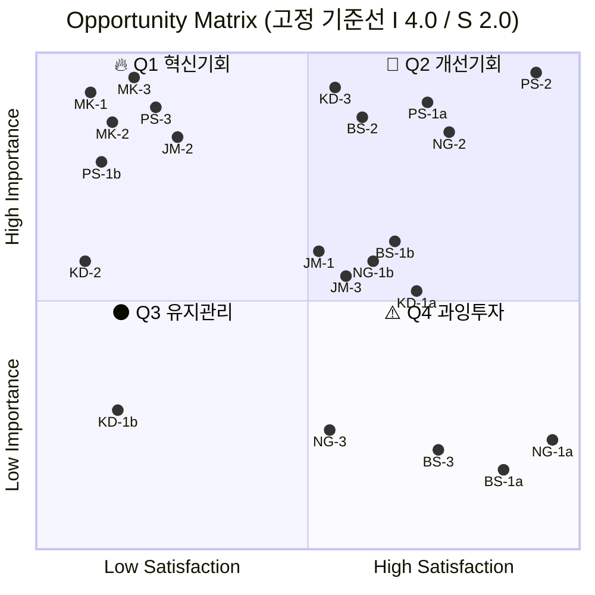

# ②~⑤단계 — Importance · Satisfaction 평가와 AOS 산출

**입력**: [01_사례_pain-list.md](01_사례_pain-list.md) — Pain/Goal 21종 중 **AOS 대상 18종**
**방법론**: [00_학습노트 §4](00_학습노트.md) — `AOS = Importance × (1 − Satisfaction/5)`

| 단계 | 이 문서의 위치 |
|---|---|
| **②③ Importance · Satisfaction 평가** | §2 |
| **④ AOS 계산 · 순위** | §2 |
| **⑤ Matrix 시각화** | §5 · 기준선 논의는 §6 |
| *(부록)* 가설 대비 실제 · 방법론 교훈 | §9 |

---

## 1. 점수 부여 원칙

> 🚨 **이 문서의 점수는 [AI 생성 가상 응답지](../07_jtbd/) 기반입니다.** 실제 인터뷰가 아니므로 **의사결정 근거로 쓸 수 없습니다.**
>
> §2의 표는 **최종값**이며, 가설 단계에서 무엇이 얼마나 틀렸는지는 **[§9 부록](#9-부록--가설-대비-실제-그리고-방법론-교훈)** 에 있습니다.

### 척도 정의 — 매기기 전에 말로 고정합니다

| 점수 | **Importance** — 이 Goal에 도달하는 것이 얼마나 중요한가 | **Satisfaction** — 지금 쓰는 **대체 솔루션**이 그 Goal에 얼마나 근접해 있는가 |
|:---:|---|---|
| **5** | 이게 안 되면 업무·도입 자체가 성립하지 않음 | 사실상 해결됨. 불편이 없음 |
| **4** | 목표 달성에 직접 영향. 자주 발목을 잡음 | 대체로 해결됨. 가끔 아쉬움 |
| **3** | 업무에 지장은 있으나 우회 가능 | 불편하지만 굴러감 |
| **2** | 있으면 좋지만 없어도 진행됨 | 억지로 버팀. 결과를 신뢰하기 어려움 |
| **1** | 관심 밖 | 대응 수단이 사실상 없음 |

**Satisfaction은 우리 제품에 대한 만족도가 아닙니다.** 지금 이 사람이 쓰고 있는 엑셀·전화·감정평가서에 대한 만족도입니다.

---

## 2. ②③ Importance · Satisfaction 평가

`AOS = Importance × (1 − Satisfaction / 5)`

**Satisfaction은 우리 제품이 아니라 지금 쓰는 대체 솔루션에 대한 만족도입니다** — 이 정의를 §1에서 고정한 것이 이 표의 신뢰도를 만듭니다(§7-①).

| 순위 | ID | Pain 요약 | 대체 솔루션 | 유형 | I | S | **AOS** | 가설 대비 |
|:---:|---|---|---|:---:|:---:|:---:|---:|:---:|
| **1** | **PS-1b** | 알트·저유동성 종목의 대표성 부재 | 대조 대상 자체가 없음 | 🔵 | 5 | 1 | **4.0** | *(분할)* |
| **1** | **PS-3** | 신규 상장 구간 기준선 부재 | 자사 체결가 그대로 | 🔵 | **5** | 1 | **4.0** | 3.2 ▲ |
| **1** | **JM-2** | 과거 시점 소급 검증 불가 | 이메일·PDF 뒤지기 | 🟢 | **5** | 1 | **4.0** | 3.2 ▲ |
| **1** | **MK-1** | 근거 없이 숫자만 나온다 | 기존 서비스도 근거 없음 | 🔴 | 5 | 1 | **4.0** | — |
| **1** | **MK-2** | 비교 거래 0건 — 평가 불가 | 원가법·억지 보정 | 🔴 | 5 | **1** | **4.0** | 3.0 ▲ |
| **1** | **MK-3** | 계약 전 커버리지를 모름 | 없음 | 🔴 | **5** | 1 | **4.0** | 2.4 ▲▲ |
| 7 | **KD-2** | 보안심사에서 문서 미비로 반려 | 벤더에 그때그때 요청 | 🔵 | 4 | 1 | **3.2** | — |
| 8 | **KD-3** | 감사 대응 근거 부재 | 감정평가서 | 🔵 | 5 | **2** | **3.0** | 2.0 ▲ |
| 8 | **BS-2** | QRM 미통과 시 인용 불가 | 기존 통과 출처*(해외 벤더)* | 🔵 | 5 | **2** | **3.0** | 2.0 ▲ |
| 10 | **JM-1** | 자체 감정평가 과대 지적 | 외부 감평 의뢰 | 🟢 | **4** | 2 | **2.4** | 3.0 ▼ |
| 10 | **JM-3** | API 전용이면 시작도 못 함 | 파일 수령 전례 있음 | 🟢 | 4 | **2** | **2.4** | 3.2 ▼ |
| 10 | **KD-1b** | 소형 자산 90개를 손도 못 댐 | 없음 — 이월 | 🔵 | 3 | 1 | **2.4** | *(분할)* |
| 10 | **NG-1b** | 지방·비주거는 사내 DB 오차 20%+ | 사내 DB *(부정확)* | 🟢 | 4 | 2 | **2.4** | *(분할)* |
| 10 | **BS-1b** | 소형·중형 딜 근거를 매번 새로 | 공개 통계 + 사내 DB | 🔵 | 4 | 2 | **2.4** | *(분할)* |
| 15 | **PS-1a** | 메이저 종목 괴리 확인 | 해외 사이트 수동 대조 | 🔵 | 5 | 3 | 2.0 | *(분할)* |
| 15 | **NG-2** | 실사 마감 초과 시 사용 불가 | 사내 DB + 엑셀 | 🟢 | 5 | 3 | 2.0 | — |
| 17 | **NG-3** | 과거 낙찰 소급 대조 불가 | 사내 딜 기록 | 🟢 | **3** | 2 | 1.8 | 2.4 ▼ |
| 18 | **KD-1a** | 대형 자산 40개 재평가 지연 | 엑셀 롤포워드 | 🔵 | 4 | 3 | 1.6 | *(분할)* |
| 19 | **BS-3** | 고객사 이의 제기 시 중단 | 감정평가서 인용 | 🔵 | **3** | 3 | 1.2 | 1.6 ▼ |
| 20 | **PS-2** | 공급자 장애가 곧 우리 장애 | 자체 운영 | 🔵 | 5 | 4 | **1.0** | — · **지켜야 할 영역** |
| 21 | **BS-1a** | 대형 딜 *(감정평가 의무)* | 감정평가서 *(법적 효력)* | 🔵 | 3 | 4 | **0.6** | ⛔ 과잉충족 |
| 22 | **NG-1a** | 서울·경기 사내 DB가 더 정확 | 사내 DB *(오차 8%)* | 🟢 | 3 | 5 | **0.0** | ⛔ 과잉충족 |

*굵은 I·S = 가설에서 바뀐 값 · **(분할)** = [구간별로 만족도가 갈려 쪼갠 항목](05_검토_Pain-분할-점검.md)*

**동점 처리**: [Pain List §5의 클러스터 반복 횟수](01_사례_pain-list.md)를 2차 정렬 기준으로 씁니다 — 여러 페르소나가 같은 Goal을 요구할수록 위로 올립니다. 적용하면 **JM-2(재현 3회)가 공동 1위 중 선두**입니다.

> 🔴 **극단 페르소나(MK) 3종이 전부 공동 1위입니다.** 가설에서는 1·6·9위로 흩어져 있었는데, 인터뷰 후 상단을 독점했습니다. **이 점수를 매출 기회로 읽으면 안 됩니다** — [문경아의 시장 비중은 0.043으로 최하위권](03_사례_dos-scoring.md)이고, MK 계열은 **신뢰 방어** 항목입니다(§7-⑤).

## 5. ⑤ Opportunity Matrix — 기준점 C안 (중앙값)

**기준선은 `I 4.0 / S 2.0` 고정입니다.** [00_학습노트 §C](00_학습노트.md)의 중앙값 방침에서 출발했으나, **갱신 시점에는 기준선을 움직이지 않습니다** — 이유는 §9-3.

| 지표 | 기준선 | 의미 |
|---|:---:|---|
| **Importance** | **4.0** | 4 이상 → 상단 |
| **Satisfaction** | **2.0** | 2 미만 → 좌측 |
| AOS | 2.4 | 참고선 |

> **왜 고정 3.0(A안)이 아닌가** — Pain을 여정지도의 `이탈 지점` 열에서만 뽑았기 때문에 **Importance가 구조적으로 높게 쏠려 있습니다.** 3.0을 기준선으로 놓으면 18종 전부가 상단에 몰려 **사분면이 우선순위를 만들지 못합니다**(§6).
>
> **왜 갱신 중앙값(I 5.0)도 아닌가** — 그 값은 **척도 최댓값**이라 반대 방향으로 퇴화합니다(§9-3).

### 사분면 배치 결과

| 사분면 | 조건 | 항목 | 전략 행동 |
|---|---|---|---|
| 🔥 **Q1 혁신기회** | I ≥ 4.0, S < 2.0 | **7종** — **MK-1 · MK-2 · MK-3 · PS-1b · PS-3 · JM-2 · KD-2** | **MVP 우선 범위** |
| 💎 **Q2 개선기회** | I ≥ 4.0, S ≥ 2.0 | **10종** — KD-3 · BS-2 · PS-1a · PS-2 · NG-2 · JM-1 · JM-3 · NG-1b · BS-1b · KD-1a | **"지금은 안 아픈데 우리가 들어가면 아파지는" 요구 포함** — 출시 첫날 준비 |
| ⚫ **Q3 유지관리** | I < 4.0, S < 2.0 | **1종** — KD-1b | 대응 수단은 없으나 중요도가 낮음 |
| ⚠️ **Q4 과잉투자** | I < 4.0, S ≥ 2.0 | **4종** — NG-1a · BS-1a · NG-3 · BS-3 | **자원 분배 재검토 — 정면 돌파 금지** |

**Q4에 과잉충족 구간이 모였습니다.** NG-1a(서울·경기 사내 DB)와 BS-1a(감정평가 의무 딜)는 **AOS 0.0·0.6으로 대체재가 이미 잘 하고 있는 자리**입니다 — [DOS에서도 음수](03_사례_dos-scoring.md)로 나옵니다.

> ⚠️ **이 사분면은 `I × S` 축입니다.** [혼합 매트릭스](04_사례_aos-dos-매트릭스.md)는 `AOS × DOS` 축이라 **같은 항목이 다른 칸에 놓일 수 있습니다** — 예: KD-1b는 여기서 Q3(중요도가 낮아서)이지만 혼합 매트릭스에서는 Q2(시장이 커서)입니다. **두 매트릭스는 다른 질문에 답합니다.**
>
> ⚠️ **중앙값 계열 기준선의 대가**: Q2에 있다고 "잘 되고 있다"는 뜻이 아니라 **"이 목록 안에서 상대적으로 덜 급하다"** 는 뜻입니다. 절대 강도는 **AOS 값**으로 보십시오 — Q2의 KD-3·BS-2는 AOS 3.0으로 Q1 일부보다 높습니다.

## 6. 세 기준점 비교 — 기준선을 옮기면 무엇이 바뀌나

| | **A. 고정 3.0** | **B. 평균 ± σ** | **C. 중앙값 (채택)** |
|---|---|---|---|
| Importance 기준선 | 3.0 | 4.33 | **4.0** |
| Satisfaction 기준선 | 3.0 | 2.11 | **2.0** |
| AOS 기준선 | 2.5 | 2.89 *(평균 2.48 + 0.5σ 0.83)* | 2.4 |
| 🔥 Q1 | **12종** | 4종 | **5종** |
| 💎 Q2 | 6종 | 4종 | 11종 |
| ⚫ Q3 | **0종** | 8종 | 1종 |
| ⚠️ Q4 | **0종** | 2종 | 1종 |
| 판정 | **사분면이 작동 안 함** | 분포가 가설 점수라 근거 약함 | **우선순위가 갈림** |

**A안이 실패한 이유가 이 표에 있습니다.** Q3·Q4가 0종인 것은 시장의 성질이 아니라 **추출 규칙의 그림자**입니다. `이탈 지점` 열에서만 뽑았으니 Importance 하한이 3점으로 생겼고, 3.0 기준선은 그 하한과 겹쳐 아무것도 가르지 못했습니다.

**B안은 계산은 되지만 근거가 약합니다.** 여기 쓰인 평균·표준편차는 시장에서 수집된 분포가 아니라 **분석자 한 명이 매긴 가설 점수**의 분포입니다. 평균을 기준선으로 삼으면 시장이 아니라 **채점 습관**을 기준으로 삼는 셈입니다.

> 💡 **세 기준 모두에서 흔들리지 않은 것**: 사분면 구성은 12종 → 4종 → 5종으로 크게 바뀌었지만, **AOS 상위 8종의 순서는 세 방식 모두 동일**했습니다(A 2.5 기준 8종 = B 2.89 기준 8종). **사분면은 기준선에 민감하고 AOS 순위는 둔감합니다.** 우선순위를 말할 때 사분면보다 AOS 순위를 먼저 인용해야 하는 이유입니다.

---

## 7. 순위표가 말하는 것

**① 상위 항목에 극단·확장 페르소나가 몰립니다.**
공동 1위 6종 중 **극단(MK) 3종 · 확장(JM) 1종**이고, 핵심(KD·PS·NG·BS)에서는 PS-1b·PS-3만 올라왔습니다. 이유는 Satisfaction 쪽에 있습니다 — **핵심 페르소나는 감정평가서라는 작동하는 대체 수단을 이미 갖고 있어** 만족도가 중간 이상입니다. 반면 확장·극단은 대체 수단 자체가 없습니다. **가장 큰 고객이 가장 큰 기회를 주지는 않습니다.**

**② 과잉충족 구간이 둘 확인됐습니다.**
NG-1a(서울·경기)는 **AOS 0.0**, BS-1a(감정평가 의무 딜)는 **0.6**입니다. 둘 다 대체재(사내 DB·감정평가서)가 이미 잘 하고 있어 **자원을 쓰면 과잉투자**입니다. [DOS에서도 음수](03_사례_dos-scoring.md)로 나와 두 지표가 같은 결론을 냅니다.

> 💡 **이 둘은 통합 채점에서는 보이지 않았습니다.** NG-1·BS-1을 하나로 재면 각각 1.6·2.4로 중간에 묻힙니다. **분할해야 과잉충족이 드러납니다**(§9-4).

**③ PS-2(장애 전파)는 기회가 아니라 지켜야 할 영역입니다.**
Importance 5인데 AOS 1.0입니다. 거래소는 지금 자체 운영이라 **이 문제를 겪고 있지 않고**, 우리가 들어가면서 **새로 만드는 리스크**입니다. **AOS가 낮은 이유가 "이미 잘 되고 있어서"일 때, 그건 훼손하지 말아야 할 자산입니다** — [KSF 분석에서 K5(운영 신뢰성)로 필수 요건 판정](../03_ksf/01_분석_자산가치평가-인프라.md)을 받았습니다.

**④ 상위 항목의 Goal이 세 클러스터로 수렴합니다.**

| 클러스터 | 해당 항목 |
|---|---|
| **근거·설명 가능성** | MK-1 · MK-3 · KD-3 · BS-2 |
| **못 낼 때 못 낸다고 말하기** | MK-2 · PS-3 |
| **과거 재현** | JM-2 |
| 대표성·전달 경로 | PS-1b · KD-2 |

**상위권에 "평가값의 정확도" 항목이 하나도 없습니다.** [Pain List §5의 클러스터 분석](01_사례_pain-list.md)과 [여정지도 §10의 이탈 순위](../05_페르소나/03_사례_고객여정지도.md)가 각각 다른 방법으로 도달한 결론에 **AOS 점수가 세 번째로 같은 답을 냈습니다.**

**⑤ 극단(MK) 항목의 점수는 다르게 읽어야 합니다.**
MK 3종이 공동 1위(4.0)지만, 이것은 **매출 기회가 아니라 신뢰 방어**입니다. 없으면 문경아가 이탈하고 그 소문이 김도현에게 갑니다. **MVP 우선순위에는 넣되 매출 기여로 계산하면 안 됩니다** — [DOS 기준으로는 시장 비중 0.043으로 최하위권](03_사례_dos-scoring.md)입니다.

## 8. 이 순위가 이어지는 곳

| 다음 렌즈 | 무엇을 보정하나 |
|---|---|
| **[DOS — 시장 가중](03_사례_dos-scoring.md)** | AOS는 **시장 크기를 보지 않습니다.** MK 3종이 상단을 독점하는 문제를 여기서 보정 |
| **[혼합 매트릭스](04_사례_aos-dos-매트릭스.md)** | 두 축이 갈리는 지점 — *"아픈데 작다"* 를 찾음 |
| **[KSF 교차](../03_ksf/01_분석_자산가치평가-인프라.md)** | AOS가 못 보는 **"안 아픈데 없으면 탈락"**(PS-2·데이터 조달) |
| **[Pain 분할 점검](05_검토_Pain-분할-점검.md)** | 하나의 Pain에 만족도가 둘인 구조 — 18종 중 4종 |

## 9. 부록 — 가설 대비 실제, 그리고 방법론 교훈

> 🚨 **"실제"의 출처는 [AI 생성 가상 응답지](../07_jtbd/)입니다.** 실제 인터뷰가 아니므로 의사결정 근거로 쓸 수 없습니다. 이 부록의 목적은 **가설 점수가 어디서 얼마나 틀렸는지의 기록**입니다.

### 9-1. 가설 적중률 — 근거의 성질이 정확도를 갈랐습니다

| 지표 | 적중 | 적중률 | 점수의 근거 | 성질 |
|---|:---:|:---:|---|---|
| **Satisfaction** | 13 / 18 | **72%** | [페르소나 카드의 `대체 솔루션`](../05_페르소나/01_사례_자산가치평가.md) — 엑셀 롤포워드·감정평가서·사내 DB | **관찰된 행동에서 추론** |
| **Importance** | 10 / 18 | **56%** | 업무 목표에서의 비중 | **의도를 추측** |

> 🔴 **같은 분석자가 같은 시점에 매긴 두 점수인데 적중률이 16%p 차이 납니다.** 차이는 능력이 아니라 **근거가 사실인가 추측인가**입니다. §1이 *"Satisfaction은 우리 제품 만족도가 아니다"* 라고 정의를 엄격히 고정한 것이 여기서 값을 했습니다.
>
> **실무 함의**: 점수마다 **근거 유형을 태그**(문서 확인 / 행동 관찰 / 추론)해 두면 **어느 점수를 먼저 검증할지** 정할 수 있습니다. 이 표에서는 Importance를 먼저 검증했어야 합니다.

### 9-2. 변동 폭이 큰 항목

| ID | 가설 → 실제 | 원인 |
|---|---|---|
| **MK-3** | 2.4 → **4.0** ▲▲ | **최대 오판.** *"계약하고 나서야 안 되는 걸 안다"* — 기능이 아니라 **계약 전 신뢰 문제**였음 |
| KD-3 · MK-2 · BS-2 | +1.0 | 대체 솔루션이 작동한다고 본 것이 과대평가 |
| PS-3 · JM-2 | +0.8 | 국면이 짧다고(PS-3) · 검증용이라고(JM-2) 중요도를 깎은 것이 오판 |
| JM-3 | 3.2 → **2.4** ▼ | *"지금도 파일로 받는 게 있다"* — **전례가 있었음** |
| JM-1 · KD-1 · NG-3 | −0.6 | 작동하는 대체 수단을 못 본 것 |

### 9-3. 🔴 중앙값 기준선은 양방향으로 퇴화합니다

**§6이 A안(고정 3.0)을 폐기한 것과 같은 실패가 반대편에서 재발했습니다.**

| | **A안 실패** *(가설 단계)* | **중앙값 실패** *(갱신 단계)* |
|---|---|---|
| 기준선 | 고정 3.0 | **실제 중앙값 I 5.0** *(척도 최댓값)* |
| 원인 | Importance **하한**(3점)과 겹침 | I=5가 18종 중 10종 → **상한에 닿음** |
| 결과 | 18/18이 상단 — Q3·Q4가 0종 | **AOS 6위(KD-2)가 Q3 "유지관리"로 강등** |
| 공통 원인 | **Pain을 `이탈 지점`에서만 뽑은 추출 규칙** — 중요도가 구조적으로 쏠림 | 동일 |

> **그래서 §5는 가설 중앙값(I 4.0 / S 2.0)을 고정 기준선으로 씁니다.** 기준선을 갱신마다 옮기면 사분면이 바뀐 이유가 *"고객 인식이 변해서"* 인지 *"기준선이 움직여서"* 인지 구분할 수 없습니다.
>
> 💡 **일반화**: 중앙값 기준선은 **분포가 척도 끝(상한이든 하한이든)에 몰리면 작동하지 않습니다.** 그리고 §6이 확인한 대로 **AOS 순위는 기준선에 둔감**합니다 — 우선순위는 사분면보다 순위를 먼저 인용하십시오.

### 9-4. 수식의 전제가 문서에 없었습니다

`AOS = I × (1 − S/5)` 는 **"Pain 하나 = Satisfaction 하나"** 를 전제하는데, 그 전제가 이 문서 어디에도 적혀 있지 않았습니다. 구간별로 대체 솔루션 성능이 갈리는 항목이 **18종 중 4종(22%)** 이었습니다 → **[Pain 분할 점검](05_검토_Pain-분할-점검.md)**

**분할하면 한쪽이 거의 항상 과잉충족으로 나옵니다**(NG-1a 0.0 · BS-1a 0.6 · KD-1a 1.6 · PS-1a 2.0). **통합 채점은 두 구간을 평균해 양쪽 다 잘못 표현합니다.**
