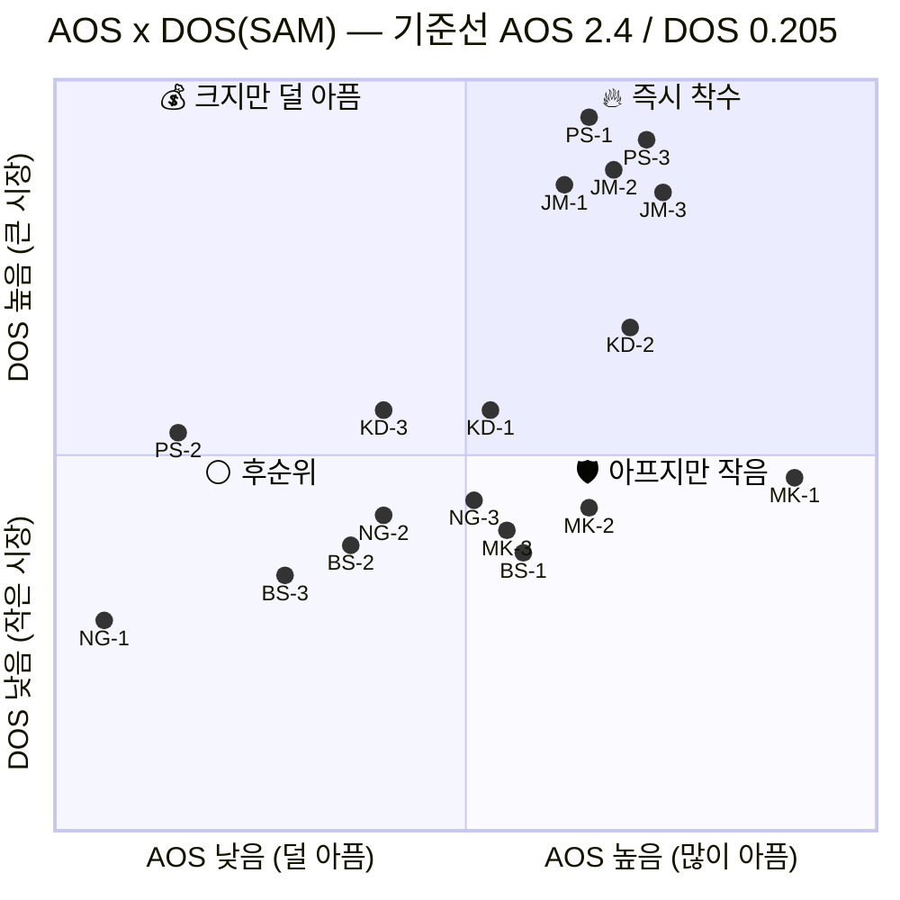
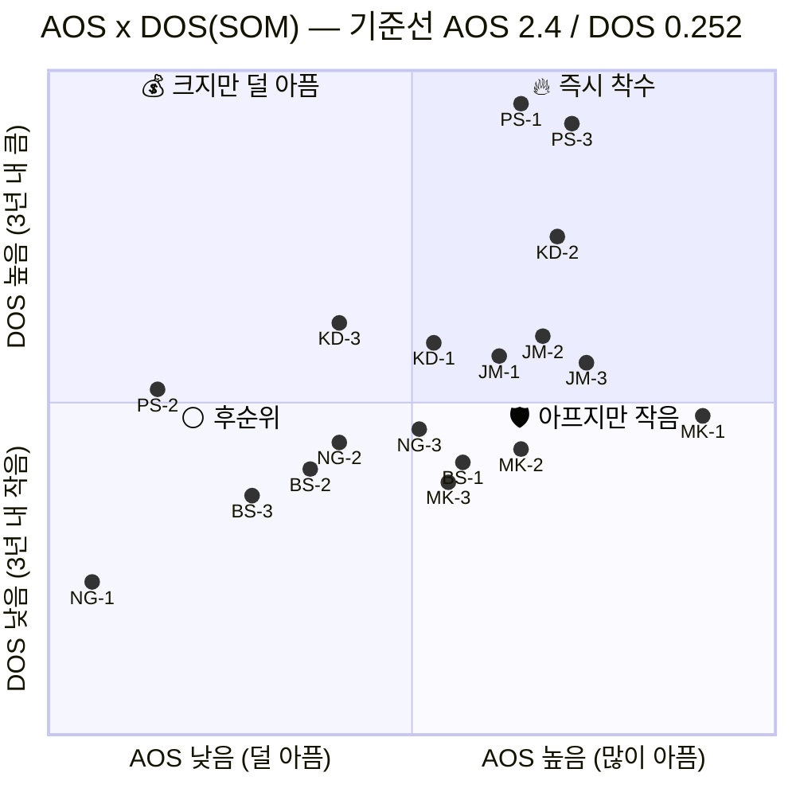
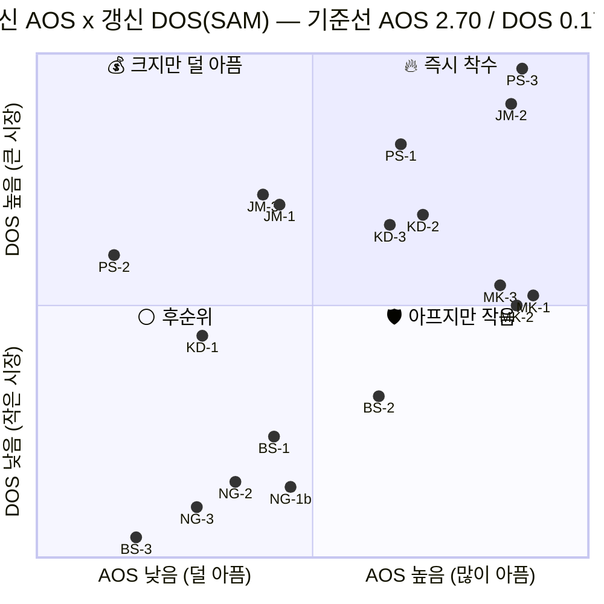

# 혼합 매트릭스 — AOS × DOS

**입력**: [02_사례_aos-scoring.md](02_사례_aos-scoring.md) 의 AOS · [03_사례_dos-scoring.md](03_사례_dos-scoring.md) 의 DOS(SAM/SOM)
**목적**: 고객 미충족(AOS)과 시장 파급력(DOS)을 **한 평면에 겹쳐** 두 지표가 갈리는 지점을 찾습니다

> 🔴 **최종 결론부터 — §1~§6은 가설 단계이고 [§7이 최종](#7-인터뷰-후-갱신--두-축이-함께-움직인-결과)입니다.**
>
> | 사분면 | **최종 배치** |
> |---|---|
> | 🔥 **Q1 즉시 착수 (8종)** | **KD-2 · KD-3 · PS-1 · PS-3 · JM-2 · MK-1 · MK-2 · MK-3** |
> | 💰 Q2 크지만 덜 아픔 (3종) | PS-2 · JM-1 · JM-3 — **출시 첫날 필요** |
> | 🛡️ Q4 아프지만 작음 (1종) | BS-2 |
> | ⚪ Q3 후순위 (6종) | KD-1 · BS-1 · NG-1b · NG-2 · NG-3 · BS-3 |
>
> **가설 대비 6종이 칸을 넘었습니다** — MK 3종이 Q4→Q1, KD-1이 Q1→Q3, JM-1·JM-3이 Q1→Q2. 🚨 출처는 [AI 생성 가상 응답지](../07_jtbd/)입니다.

---

## 1. 축과 기준선

| 축 | 지표 | 답하는 질문 |
|---|---|---|
| **X축** | **AOS** = I × (1 − S/5) | 고객이 **얼마나 아픈가** |
| **Y축** | **DOS** = (I − S) × Market Relevance | 그 아픔이 **얼마나 큰 시장에 걸려 있나** |

기준선은 [00_학습노트 참고 §C](00_학습노트.md)의 방침대로 **각 지표의 중앙값**을 씁니다.

| 지표 | 중앙값 | 산출 |
|---|---:|---|
| **AOS** | **2.4** | 18종 정렬 후 9·10번째 평균 |
| **DOS (SAM)** | **0.205** | (0.164 + 0.245) / 2 |
| **DOS (SOM)** | **0.252** | (0.228 + 0.276) / 2 |

## 2. 혼합 매트릭스 — DOS(SAM) 기준

## 3. 혼합 매트릭스 — DOS(SOM) 기준

## 4. 사분면 배치 결과

**두 모수의 사분면 구성이 완전히 동일합니다.** 점의 위치는 움직였지만 칸을 넘어간 항목이 하나도 없습니다.

| 사분면 | 조건 | 항목 | SAM | SOM |
|---|---|---|:---:|:---:|
| 🔥 **Q1 즉시 착수** | AOS ≥ 2.4 · DOS ≥ 중앙값 | **KD-1 · KD-2 · PS-1 · PS-3 · JM-1 · JM-2 · JM-3** | 7종 | 7종 |
| 💰 **Q2 크지만 덜 아픔** | AOS < 2.4 · DOS ≥ 중앙값 | KD-3 · PS-2 | 2종 | 2종 |
| 🛡️ **Q4 아프지만 작음** | AOS ≥ 2.4 · DOS < 중앙값 | MK-1 · MK-2 · MK-3 · NG-3 · BS-1 | 5종 | 5종 |
| ⚪ **Q3 후순위** | AOS < 2.4 · DOS < 중앙값 | NG-1 · NG-2 · BS-2 · BS-3 | 4종 | 4종 |

> **[03 문서](03_사례_dos-scoring.md)의 "즉시 착수 6종"과 하나 다릅니다.** 그쪽은 `AOS 상위 8 ∩ DOS 상위 8`의 교집합이었고, 여기는 중앙값 사분면입니다. 차이는 **KD-1(반년 전 평가액을 그대로 씀)** 하나로, AOS·DOS 모두 중앙값 언저리에 걸쳐 있어 경계선 항목입니다. **두 방식 모두에서 안쪽에 있는 6종이 더 단단하고, KD-1은 경계로 표시해 두는 편이 정확합니다.**

## 5. 사분면별로 다른 처방

### 🔥 Q1 즉시 착수 — MVP 범위 *(가설 7종 → **최종 8종**은 §7)*

아프고 시장도 큽니다. 두 지표가 동시에 가리키므로 **모수 선택 논쟁과 무관하게 방어됩니다.**

| ID | 요구 | 소속 |
|---|---|---|
| PS-1 · PS-3 | 기준가 괴리 설명 · 미산출 선언 | 박선우 (거래소) |
| JM-1 · JM-2 · JM-3 | 독립 값 · 소급 재현 · 파일 배치 | 조민경 (은행) |
| KD-2 | 보안심사 문서 세트 | 김도현 (AMC) |
| *(KD-1)* | 상시 갱신 현재가치 | 김도현 — **경계선** |

### 💰 Q2 크지만 덜 아픔 (2종) — 출시 시점에 준비돼 있어야 하는 것

**이 칸의 성격이 특이합니다.** 두 항목 모두 **"지금은 안 아픈데 우리가 들어가면 아파지는" 요구**입니다.

- **KD-3 (감사 대응 근거)** — 지금은 감정평가서로 감사를 통과합니다. 우리 데이터를 쓰기 시작하는 순간 "이 숫자를 어떻게 설명할 것인가"가 새로 생깁니다.
- **PS-2 (공급자 장애 전파)** — 거래소는 지금 자체 운영이라 이 문제가 없습니다. 우리가 결합되면서 **새로 만드는 리스크**입니다.

> **Q2는 "나중에 해도 되는 것"이 아니라 "출시 첫날 이미 있어야 하는 것"입니다.** 이 칸을 개선기회로 읽고 뒤로 미루면, 도입 직후에 이탈 사유가 됩니다.

### 🛡️ Q4 아프지만 작음 (5종) — 쐐기와 신뢰 방어

| ID | 왜 여기 있나 | 처방 |
|---|---|---|
| **MK-1 · MK-2 · MK-3** | 문경아의 시장 비중이 0.041~0.057로 작음 | **매출이 아니라 신뢰 방어.** 여기서 무너지면 김도현에게 소문이 감 |
| **BS-1** | 백서현 세그먼트가 가장 작음 (0.033~0.071) | **쐐기 경로.** 각주 노출로 남기훈에게 도달 |
| **NG-3** | NPL 세그먼트가 작음 | 소급 대조 — JM-2와 **같은 클러스터**라 함께 해결됨 |

**Q4는 버리는 칸이 아닙니다.** 이 칸의 항목은 직접 매출이 작을 뿐, 다른 칸의 항목을 지키거나(MK) 다른 칸으로 가는 길을 여는(BS-1) 역할을 합니다. **DOS가 구조적으로 죽이는 두 유형이 정확히 이 칸에 모여 있습니다.**

### ⚪ Q3 후순위 (4종) — 그중 하나는 자원 회수

| ID | 판정 |
|---|---|
| **NG-1** | **자원 회수.** DOS 유일한 음수(과잉충족). AOS 최하위·중앙값 사분면 Q4에 이어 **네 번째로 같은 결론** |
| NG-2 · BS-2 · BS-3 | 후순위. 단 BS-2(QRM 통과)는 백서현 진입의 전제 조건이라 **BS-1과 묶어서** 판단 |

## 6. 이 매트릭스를 읽는 법

**① 오른쪽 아래(Q4)를 먼저 봅니다.**
AOS만 봤다면 MK-1이 1위라 최우선이 됐을 것이고, DOS만 봤다면 10위라 밀렸을 것입니다. **두 축을 겹쳐야 "아픈데 작다 → 매출이 아닌 다른 이유로 한다"는 판단이 나옵니다.** 한 축만으로는 이 칸의 존재 자체가 안 보입니다.

**② 사분면 구성이 SAM/SOM에서 동일한 것이 이 분석의 결론입니다.**
모수를 바꾸면 개별 순위는 최대 3계단까지 움직였지만(KD 계열 ▲3) **칸을 넘어간 항목은 없습니다.** 우선순위 논쟁의 상당 부분이 "TAM으로 볼까 SAM으로 볼까"인데, 적어도 이 18종에 대해서는 **그 선택이 결론을 바꾸지 않습니다.**

**③ 경계선 항목을 표시해 둡니다.**
KD-1은 두 축 모두 중앙값 바로 위입니다. 인터뷰에서 I나 S가 1점만 움직여도 칸이 바뀝니다. **중앙값 기준의 사분면은 경계 근처에서 불안정하므로, 경계선 항목은 순위가 아니라 "확인 필요"로 다루는 편이 안전합니다.**

---

> ⚠️ **좌표는 시각화를 위한 정규화 값입니다.** mermaid `quadrantChart`가 0~1 범위를 요구하므로 중앙값이 0.5에 오도록 선형 변환했고, 겹치는 점은 라벨이 읽히도록 미세하게 흩었습니다. **실제 값은 §4의 표와 [02](02_사례_aos-scoring.md)·[03](03_사례_dos-scoring.md) 문서를 기준으로 삼으십시오.**
>
> AOS·DOS 모두 인터뷰 전 **가설 점수**이므로 이 매트릭스도 가설입니다. 인터뷰 후 I·S가 갱신되면 두 축이 함께 움직입니다.
>
> 📌 **그 갱신은 [§7](#7-인터뷰-후-갱신--두-축이-함께-움직인-결과)에서 수행했습니다.** §1~§6은 가설값 원형 보존입니다.

---

## 7. 인터뷰 후 갱신 — 두 축이 함께 움직인 결과

**입력**: [07 JTBD 종합](../07_jtbd/08_종합_인터뷰-결과.md) · [02 AOS §9](02_사례_aos-scoring.md) · [03 DOS §10](03_사례_dos-scoring.md)

> 🚨 **갱신값의 출처는 [AI 생성 가상 응답지](../07_jtbd/)입니다.** 의사결정 근거로 쓸 수 없습니다.

### 7-1. 축과 기준선 — 어느 것을 고정하고 어느 것을 갱신했나

| 축 | 가설 기준선 | 실제 기준선 | 처리 |
|---|:---:|:---:|---|
| **X축 AOS** | 2.4 | **2.70** | 갱신 *(중앙값)* |
| **Y축 DOS (SAM)** | 0.205 | **0.172** | 갱신 *(중앙값, [남기훈 MR 하향](03_사례_dos-scoring.md) 반영)* |

> ⚠️ **[AOS §9-6](02_사례_aos-scoring.md)에서 Importance 사분면은 기준선을 고정하라고 권고했지만, 이 매트릭스는 축이 AOS·DOS(합성 지표)여서 척도 상한 포화가 발생하지 않습니다.** AOS는 0~5, DOS는 0~1.024 범위에 분산돼 있어 중앙값이 정상 작동합니다. **같은 문서군 안에서 한 곳은 고정하고 한 곳은 갱신하는 이유가 이것입니다.**

### 7-2. 갱신 좌표

| ID | AOS *(가설→실제)* | I−S *(실제)* | MR *(갱신)* | DOS *(갱신)* | 사분면 *(가설→실제)* |
|---|:---:|:---:|---:|---:|:---:|
| **PS-3** | 3.2 → **4.0** | 4 | 0.256 | **1.024** | Q1 → **Q1** |
| **JM-2** | 3.2 → **4.0** | 4 | 0.227 | **0.908** | Q1 → **Q1** |
| **PS-1** | 3.0 → 3.0 | 3 | 0.256 | **0.768** | Q1 → **Q1** |
| **JM-1** | 3.0 → **2.4** | 2 | 0.227 | 0.454 | Q1 → **💰 Q2** ⚠️ |
| **JM-3** | 3.2 → **2.4** | 2 | 0.227 | 0.454 | Q1 → **💰 Q2** ⚠️ |
| **KD-2** | 3.2 → 3.2 | 3 | 0.142 | 0.426 | Q1 → **Q1** |
| **KD-3** | 2.0 → **3.0** | 3 | 0.142 | 0.426 | Q2 → **🔥 Q1** ⚠️ |
| **PS-2** | 1.0 → 1.0 | 1 | 0.256 | 0.256 | Q2 → **Q2** |
| **MK-1** | 4.0 → 4.0 | 4 | 0.043 | 0.172 | Q4 → **🔥 Q1** ⚠️ |
| **MK-2** | 3.0 → **4.0** | 4 | 0.043 | 0.172 | Q4 → **🔥 Q1** ⚠️ |
| **MK-3** | 2.4 → **4.0** | 4 | 0.043 | 0.172 | Q4 → **🔥 Q1** ⚠️ |
| **KD-1** | 2.4 → **1.8** | 1 | 0.142 | 0.142 | Q1 → **⚪ Q3** ⚠️ |
| **BS-2** | 2.0 → **3.0** | 3 | 0.034 | 0.102 | Q3 → **🛡️ Q4** |
| **BS-1** | 2.4 → 2.4 | 2 | 0.034 | 0.068 | Q4 → **Q3** |
| **NG-1b** | 0.6 → **2.4** | 2 | 0.019 | 0.038 | Q3 → **Q3** |
| **NG-2** | 2.0 → 2.0 | 2 | 0.019 | 0.038 | Q3 → **Q3** |
| **NG-3** | 2.4 → **1.8** | 1 | 0.019 | 0.019 | Q4 → **Q3** |
| **BS-3** | 1.6 → **1.2** | 0 | 0.034 | **0.000** | Q3 → **Q3** |

### 7-3. 사분면 재배치 — 6종이 칸을 넘었습니다

| 사분면 | 가설 | **실제** | 변동 |
|---|---|---|---|
| 🔥 **Q1 즉시 착수** | KD-1 · KD-2 · PS-1 · PS-3 · JM-1 · JM-2 · JM-3 *(7종)* | **KD-2 · KD-3 · PS-1 · PS-3 · JM-2 · MK-1 · MK-2 · MK-3** *(8종)* | **진입 4** *(KD-3·MK-1·MK-2·MK-3)* **이탈 3** *(KD-1·JM-1·JM-3)* |
| 💰 **Q2 크지만 덜 아픔** | KD-3 · PS-2 *(2종)* | **PS-2 · JM-1 · JM-3** *(3종)* | KD-3 이탈, JM-1·JM-3 진입 |
| 🛡️ **Q4 아프지만 작음** | MK-1 · MK-2 · MK-3 · NG-3 · BS-1 *(5종)* | **BS-2** *(1종)* | **MK 3종이 Q1으로 상승** |
| ⚪ **Q3 후순위** | NG-1 · NG-2 · BS-2 · BS-3 *(4종)* | **KD-1 · BS-1 · NG-1b · NG-2 · NG-3 · BS-3** *(6종)* | KD-1 강하 |

> **[§6-②가 *"사분면 구성이 SAM/SOM에서 동일한 것이 이 분석의 결론"*](#6-이-매트릭스를-읽는-법) 이라고 했는데, 그 안정성은 모수 선택에 대한 것이었습니다.** 점수 갱신에는 **전혀 안정적이지 않습니다** — 18종 중 6종이 칸을 넘었습니다. **"모수를 바꿔도 안 흔들린다"가 "무엇을 바꿔도 안 흔들린다"는 뜻이 아니었습니다.**

### 7-4. 가장 큰 변화 — 극단 페르소나 3종이 Q4에서 Q1으로

| | 가설 | 실제 | 원인 |
|---|---|---|---|
| **MK-1** | Q4 *(AOS 4.0, DOS 0.164)* | **Q1** | DOS 0.172로 중앙값 도달 *(분모 축소 효과)* |
| **MK-2** | Q4 *(AOS 3.0)* | **Q1** | **AOS 3.0 → 4.0** *(S 2→1)* |
| **MK-3** | Q4 *(AOS 2.4)* | **Q1** | **AOS 2.4 → 4.0** *(I 3→5, 최대 오판)* |

> 🔴 **[§5의 Q4 처방("매출이 아니라 신뢰 방어")이 무효가 되는 것이 아닙니다.** MK 3종의 시장 비중은 여전히 0.043으로 최하위권입니다. **바뀐 것은 AOS이고 DOS는 거의 그대로**입니다 — DOS 0.172는 중앙값에 정확히 걸친 **경계값**이라 기준선이 조금만 움직이면 다시 Q4로 내려갑니다.
>
> **즉 MK 3종은 "Q1으로 승격"이 아니라 "Q1 경계에 걸침"으로 읽어야 합니다.** [§6-③이 경고한 경계선 항목](#6-이-매트릭스를-읽는-법)이 셋으로 늘어난 상황이고, 처방은 그대로입니다 — **순위가 아니라 "확인 필요"로 다룹니다.**

### 7-5. Q1에서 이탈한 3종 — 각각 이유가 다릅니다

| ID | 이동 | 이유 | 처분 |
|---|---|---|---|
| **JM-1** | Q1 → **Q2** | *"외부 감평 의뢰를 늘려서 이미 대응 중"* — **작동하는 대체 수단 발견** | Q2 처방: **출시 첫날 준비** |
| **JM-3** | Q1 → **Q2** | *"지금도 파일로 받는 게 있다"* — **전례 존재**, S 1→2 | 동일 |
| **KD-1** | Q1 → **⚪ Q3** | *"130개 중 40개만 손대고 나머지는 이월"* — **우회로 존재**, I 4→3 | **후순위로 강하** |

> 💡 **KD-1의 강하가 가장 중요합니다.** [§4에서 *"KD-1은 두 축 모두 중앙값 언저리에 걸친 경계선 항목"*](#4-사분면-배치-결과) 이라고 표시해 뒀는데, **실제로 두 칸을 건너 Q3로 내려갔습니다.** 경계선 항목을 표시해 둔 판단이 값을 했습니다.
>
> 그런데 KD-1은 **[VP의 MVP에서 F10(일괄 재평가 배치)으로 High 우선순위](../08_value-proposition/VALUE-PROPOSITION_자산가치평가인프라_claude-opus-5-1m_effort-high.md)** 입니다. AOS 1.8 · Q3인 항목이 MVP High에 있는 셈인데, **이것은 모순이 아니라 KSF 때문**입니다 — [F10은 K2(재현성)·K4(전달)의 실행 수단](../03_ksf/01_분석_자산가치평가-인프라.md)이고, 일괄 배치 없이는 다른 기능이 동작하지 않습니다. **점수가 낮아도 인프라인 항목이 있습니다.**

### 7-6. Q2가 다시 채워졌습니다 — "출시 첫날 필요"의 범위 확대

[§5가 Q2를 *"나중에 해도 되는 것이 아니라 출시 첫날 이미 있어야 하는 것"*](#5-사분면별로-다른-처방) 으로 규정했습니다. 갱신 후 이 칸에 셋이 들어왔습니다.

| ID | 성질 |
|---|---|
| **PS-2** *(장애 전파)* | 지금은 안 아픈데 **우리가 들어가면서 새로 만드는 리스크** |
| **JM-1** *(독립 값)* | 대체 수단(외부 감평)이 작동 중 — 우리가 그것보다 나아야 함 |
| **JM-3** *(파일 배치)* | 전례가 있음 — 우리도 **최소한 그 형태를 지원해야** 함 |

> 🔴 **셋 다 "경쟁 기준선"입니다.** 아프지 않은 이유가 *"이미 누군가 해주고 있어서"* 이고, 그래서 우리는 **그 수준을 기본으로 맞춰야** 합니다. [KSF 분석의 유형 C(안 아픈데 필수)](../03_ksf/01_분석_자산가치평가-인프라.md)와 정확히 겹칩니다 — PS-2는 K5, JM-3은 K4입니다.

### 7-7. 이 갱신에서 배울 점

**① 사분면의 안정성은 조건부입니다.** [§6-②](#6-이-매트릭스를-읽는-법)가 확인한 안정성은 **모수(SAM/SOM) 선택**에 대한 것이었고, **점수 갱신에는 18종 중 6종이 칸을 넘었습니다.** 안정성을 주장할 때는 **무엇에 대해 안정적인지**를 명시해야 합니다.

**② 경계선 항목 표시가 값을 했습니다.** §6-③에서 KD-1을 경계선으로 표시했고, 실제로 두 칸을 건너 이동했습니다. **중앙값 기준 사분면에서는 경계 근처 항목을 순위가 아니라 "확인 필요"로 다루는 것이 옳았습니다.** 이제 그 목록에 MK 3종이 추가됩니다(DOS 0.172 = 중앙값 정확히 일치).

**③ 점수가 낮아도 인프라인 항목이 있습니다.** KD-1은 AOS 1.8·Q3인데 MVP High입니다. 사분면은 **고객 요구의 크기**를 재고, 인프라 필요성은 **기능 간 의존 관계**에서 나옵니다. **사분면만으로 MVP를 정하면 인프라가 빠집니다.**

**④ Q2와 KSF 유형 C가 같은 것을 가리킵니다.** *"안 아픈데 없으면 탈락"* — Q2(PS-2·JM-3)와 [KSF 유형 C(K5·K4)](../03_ksf/01_분석_자산가치평가-인프라.md)가 독립적으로 같은 항목을 지목했습니다. **두 프레임이 같은 답을 내면 신뢰도가 올라갑니다.**
