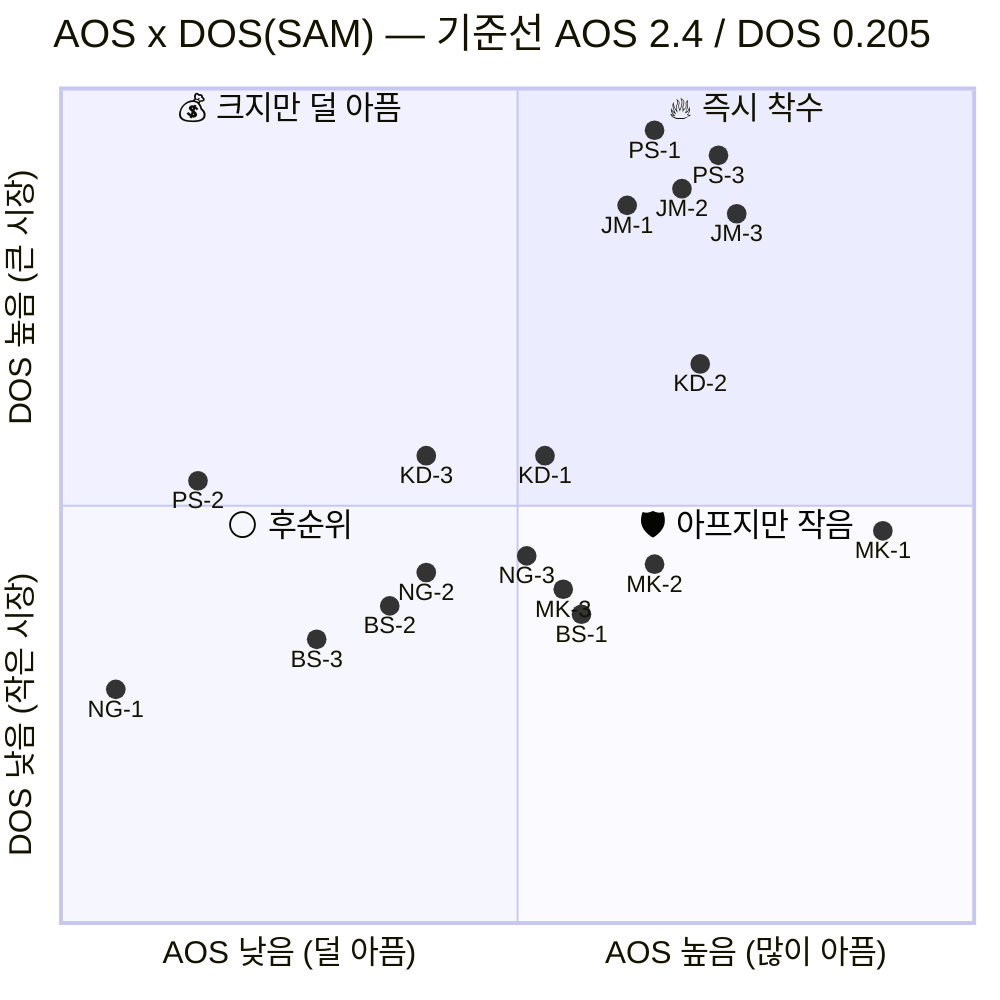
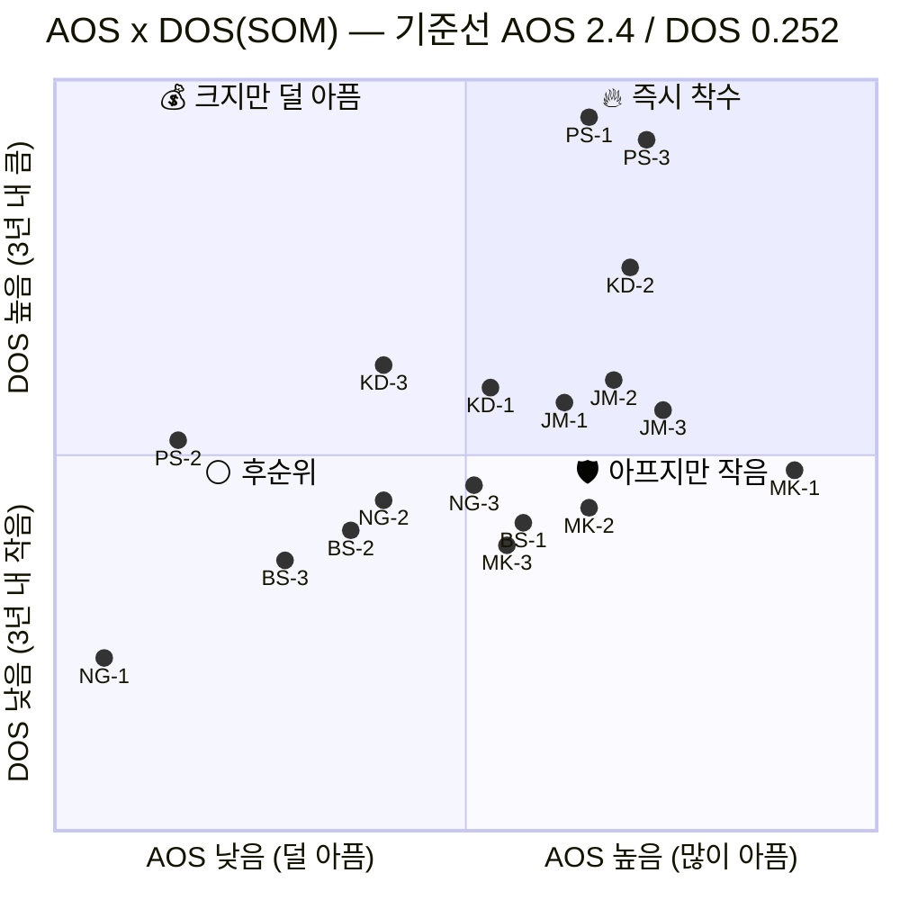

# 혼합 매트릭스 — AOS × DOS

**입력**: [02_사례_aos-scoring.md](02_사례_aos-scoring.md) 의 AOS · [03_사례_dos-scoring.md](03_사례_dos-scoring.md) 의 DOS(SAM/SOM)
**목적**: 고객 미충족(AOS)과 시장 파급력(DOS)을 **한 평면에 겹쳐** 두 지표가 갈리는 지점을 찾습니다

---

## 1. 축과 기준선

| 축 | 지표 | 답하는 질문 |
|---|---|---|
| **X축** | **AOS** = I × (1 − S/5) | 고객이 **얼마나 아픈가** |
| **Y축** | **DOS** = (I − S) × Market Relevance | 그 아픔이 **얼마나 큰 시장에 걸려 있나** |

기준선은 [00_학습노트 참고 §C](00_학습노트.md)의 방침대로 **각 지표의 중앙값**을 씁니다.

| 지표 | 중앙값 | 산출 |
|---|---:|---|
| **AOS** | **2.4** | 18종 정렬 후 9·10번째 평균 |
| **DOS (SAM)** | **0.205** | (0.164 + 0.245) / 2 |
| **DOS (SOM)** | **0.252** | (0.228 + 0.276) / 2 |

## 2. 혼합 매트릭스 — DOS(SAM) 기준

## 3. 혼합 매트릭스 — DOS(SOM) 기준

## 4. 사분면 배치 결과

**두 모수의 사분면 구성이 완전히 동일합니다.** 점의 위치는 움직였지만 칸을 넘어간 항목이 하나도 없습니다.

| 사분면 | 조건 | 항목 | SAM | SOM |
|---|---|---|:---:|:---:|
| 🔥 **Q1 즉시 착수** | AOS ≥ 2.4 · DOS ≥ 중앙값 | **KD-1 · KD-2 · PS-1 · PS-3 · JM-1 · JM-2 · JM-3** | 7종 | 7종 |
| 💰 **Q2 크지만 덜 아픔** | AOS < 2.4 · DOS ≥ 중앙값 | KD-3 · PS-2 | 2종 | 2종 |
| 🛡️ **Q4 아프지만 작음** | AOS ≥ 2.4 · DOS < 중앙값 | MK-1 · MK-2 · MK-3 · NG-3 · BS-1 | 5종 | 5종 |
| ⚪ **Q3 후순위** | AOS < 2.4 · DOS < 중앙값 | NG-1 · NG-2 · BS-2 · BS-3 | 4종 | 4종 |

> **[03 문서](03_사례_dos-scoring.md)의 "즉시 착수 6종"과 하나 다릅니다.** 그쪽은 `AOS 상위 8 ∩ DOS 상위 8`의 교집합이었고, 여기는 중앙값 사분면입니다. 차이는 **KD-1(반년 전 평가액을 그대로 씀)** 하나로, AOS·DOS 모두 중앙값 언저리에 걸쳐 있어 경계선 항목입니다. **두 방식 모두에서 안쪽에 있는 6종이 더 단단하고, KD-1은 경계로 표시해 두는 편이 정확합니다.**

## 5. 사분면별로 다른 처방

### 🔥 Q1 즉시 착수 (7종) — MVP 범위

아프고 시장도 큽니다. 두 지표가 동시에 가리키므로 **모수 선택 논쟁과 무관하게 방어됩니다.**

| ID | 요구 | 소속 |
|---|---|---|
| PS-1 · PS-3 | 기준가 괴리 설명 · 미산출 선언 | 박선우 (거래소) |
| JM-1 · JM-2 · JM-3 | 독립 값 · 소급 재현 · 파일 배치 | 조민경 (은행) |
| KD-2 | 보안심사 문서 세트 | 김도현 (AMC) |
| *(KD-1)* | 상시 갱신 현재가치 | 김도현 — **경계선** |

### 💰 Q2 크지만 덜 아픔 (2종) — 출시 시점에 준비돼 있어야 하는 것

**이 칸의 성격이 특이합니다.** 두 항목 모두 **"지금은 안 아픈데 우리가 들어가면 아파지는" 요구**입니다.

- **KD-3 (감사 대응 근거)** — 지금은 감정평가서로 감사를 통과합니다. 우리 데이터를 쓰기 시작하는 순간 "이 숫자를 어떻게 설명할 것인가"가 새로 생깁니다.
- **PS-2 (공급자 장애 전파)** — 거래소는 지금 자체 운영이라 이 문제가 없습니다. 우리가 결합되면서 **새로 만드는 리스크**입니다.

> **Q2는 "나중에 해도 되는 것"이 아니라 "출시 첫날 이미 있어야 하는 것"입니다.** 이 칸을 개선기회로 읽고 뒤로 미루면, 도입 직후에 이탈 사유가 됩니다.

### 🛡️ Q4 아프지만 작음 (5종) — 쐐기와 신뢰 방어

| ID | 왜 여기 있나 | 처방 |
|---|---|---|
| **MK-1 · MK-2 · MK-3** | 문경아의 시장 비중이 0.041~0.057로 작음 | **매출이 아니라 신뢰 방어.** 여기서 무너지면 김도현에게 소문이 감 |
| **BS-1** | 백서현 세그먼트가 가장 작음 (0.033~0.071) | **쐐기 경로.** 각주 노출로 남기훈에게 도달 |
| **NG-3** | NPL 세그먼트가 작음 | 소급 대조 — JM-2와 **같은 클러스터**라 함께 해결됨 |

**Q4는 버리는 칸이 아닙니다.** 이 칸의 항목은 직접 매출이 작을 뿐, 다른 칸의 항목을 지키거나(MK) 다른 칸으로 가는 길을 여는(BS-1) 역할을 합니다. **DOS가 구조적으로 죽이는 두 유형이 정확히 이 칸에 모여 있습니다.**

### ⚪ Q3 후순위 (4종) — 그중 하나는 자원 회수

| ID | 판정 |
|---|---|
| **NG-1** | **자원 회수.** DOS 유일한 음수(과잉충족). AOS 최하위·중앙값 사분면 Q4에 이어 **네 번째로 같은 결론** |
| NG-2 · BS-2 · BS-3 | 후순위. 단 BS-2(QRM 통과)는 백서현 진입의 전제 조건이라 **BS-1과 묶어서** 판단 |

## 6. 이 매트릭스를 읽는 법

**① 오른쪽 아래(Q4)를 먼저 봅니다.**
AOS만 봤다면 MK-1이 1위라 최우선이 됐을 것이고, DOS만 봤다면 10위라 밀렸을 것입니다. **두 축을 겹쳐야 "아픈데 작다 → 매출이 아닌 다른 이유로 한다"는 판단이 나옵니다.** 한 축만으로는 이 칸의 존재 자체가 안 보입니다.

**② 사분면 구성이 SAM/SOM에서 동일한 것이 이 분석의 결론입니다.**
모수를 바꾸면 개별 순위는 최대 3계단까지 움직였지만(KD 계열 ▲3) **칸을 넘어간 항목은 없습니다.** 우선순위 논쟁의 상당 부분이 "TAM으로 볼까 SAM으로 볼까"인데, 적어도 이 18종에 대해서는 **그 선택이 결론을 바꾸지 않습니다.**

**③ 경계선 항목을 표시해 둡니다.**
KD-1은 두 축 모두 중앙값 바로 위입니다. 인터뷰에서 I나 S가 1점만 움직여도 칸이 바뀝니다. **중앙값 기준의 사분면은 경계 근처에서 불안정하므로, 경계선 항목은 순위가 아니라 "확인 필요"로 다루는 편이 안전합니다.**

---

> ⚠️ **좌표는 시각화를 위한 정규화 값입니다.** mermaid `quadrantChart`가 0~1 범위를 요구하므로 중앙값이 0.5에 오도록 선형 변환했고, 겹치는 점은 라벨이 읽히도록 미세하게 흩었습니다. **실제 값은 §4의 표와 [02](02_사례_aos-scoring.md)·[03](03_사례_dos-scoring.md) 문서를 기준으로 삼으십시오.**
>
> AOS·DOS 모두 인터뷰 전 **가설 점수**이므로 이 매트릭스도 가설입니다. 인터뷰 후 I·S가 갱신되면 두 축이 함께 움직입니다.
