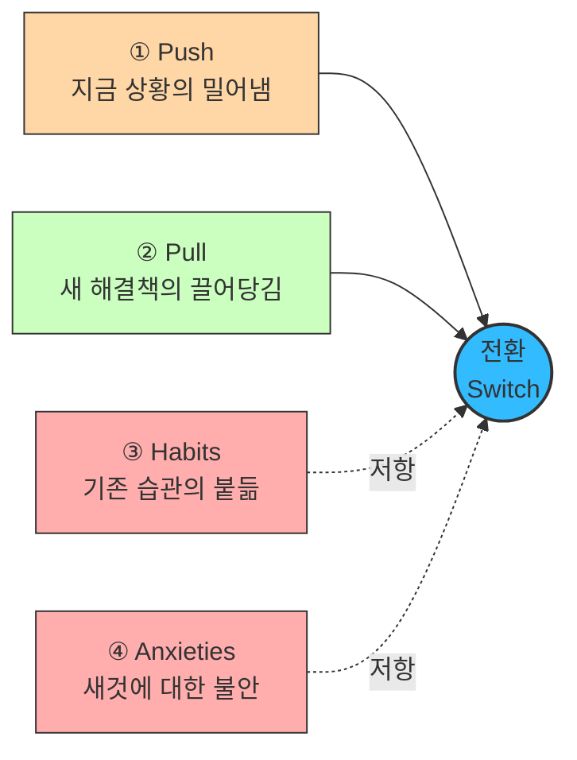

# 07 - JTBD 분석 방법론

**JTBD 인터뷰를 수행하기 위한 구체적인 행동 방침입니다.**

---

## 1. 인터뷰 준비 및 구조

### 시간 배정

클래식한 생성 연구(generative research) 세션과 유사하게, 인터뷰 시간은 보통 **60분에서 90분**을 배정합니다. 이 기법에 익숙하지 않은 경우 편안함을 느끼는 데 시간이 걸리기 때문입니다.

### 고유한 참가자 모집 (Recruiting)

JTBD의 핵심은 **전환 행동(switching behavior)** 을 이해하는 것이므로, 특히 다음 세 그룹을 스크리닝하여 모집합니다.

| 그룹 | 대상 |
|---|---|
| **① 시작** | 최근에 우리 제품/서비스를 **사용하기 시작한** 사람들 |
| **② 중단** | 최근에 우리 제품/서비스 **사용을 중단한** 사람들 |
| **③ 미인지** | 우리 제품/서비스에 대해 **아직 들어본 적이 없는** 사람들 |

이들을 통해 사람들이 우리 제품/서비스로 **전환하거나 떠나는 이유**, 그리고 경쟁 제품으로 이끄는 **푸시/풀(Pushes/Pulls)** 요소를 이해하고자 합니다.

## 2. 심층 목표 파헤치기 (Focus on Deeper Goals)

**표면적 답변 피하기**
단순히 사용자에게 왜 다른 제품으로 전환했는지 **직설적으로 묻는 것을 피해야 합니다.** 그렇게 하면 행동을 유도하는 더 깊은 목표에 도달할 수 없습니다.

**'전환 사건'에 집중**
인터뷰이는 대화의 방향을 이끌도록 허용하되, 연구자는 참가자가 변화를 일으키게 된 **전환 사건(switch event)** 에 초점을 맞춰야 합니다.

**스토리텔링 유도**
깊은 목표와 행동을 이해하기 위해서는 사용자가 무언가를 하기로 결정한 **배경에 대한 이야기**를 하도록 유도해야 합니다. 생성 연구와 마찬가지로 질문을 심층적으로 파고들어야 하지만, 특정 방식으로 진행해야 합니다.

## 3. 핵심 질문 전략 (Interview Scripting)

### 대안 및 맥락 파악 질문

- 제품/서비스를 시도하기 전에 **다른 어떤 해결책을 고려**했습니까?
- 이러한 해결책을 고려할 때 **무엇을 찾고** 있었습니까?
- **무엇을 해결하려고** 했습니까?
- 이 제품/서비스들을 **어떻게 찾아보았는지** 이야기해 주십시오.
- 실제로 **사용해 본** 다른 해결책은 무엇입니까?
- 시도하거나 사용해 본 다른 해결책 중에서 **좋았던 점과 싫었던 점**은 무엇입니까?
- 이 제품/서비스를 **사용할 수 없었다면 대신 무엇을** 했을 것입니까?
- **주변 사람들이** 시도하거나 사용해 본 해결책은 무엇입니까?
- **과거와 비교했을 때** 지금 무엇을 하고 있습니까?

### 맥락 및 감정적 질문

경쟁사 및 잠재적인 전환 행동을 파악한 후에는 **더 감정적인 질문**을 통해 깊이 파고들기 시작합니다.

- 문제를 해결할 무언가가 필요하다는 것을 **언제 처음 깨달았습니까**?
- 고려 중인 선택에 대해 **다른 사람과 이야기**했습니까? 대화는 어땠습니까?
- 이 제품/서비스를 사용하면 **어떤 모습일지 상상**했습니까?
- 제품/서비스로부터 **무엇을 원했습니까**?
- 이 제품/서비스를 구매/사용하는 것에 대해 **불안감(anxiety)** 이 있었습니까?
- 사용하는 것에 대해 **걱정하게 만드는 요소**가 있었습니까?

### 스토리텔링을 위한 연상 유도

사용자의 기억은 **사람, 장소, 냄새 또는 소리와의 연상**을 통해 회상되는 경우가 많습니다.

- 그때는 하루 중 **몇 시**였습니까?
- **집에** 있었습니까, **직장에** 있었습니까?
- 뒤에서 **TV가 켜져** 있었습니까?
- **당신은 어떤 상태**였습니까 (who they were)?

## 4. 경청해야 할 4가지 전환 동인 (Listening for the Switch)

인터뷰를 진행하는 동안, 전환을 유도한 **동기나 페인 포인트**에 귀 기울여야 합니다.

| # | 동인 | 물어야 할 것 |
|:---:|---|---|
| **1** | **상황의 푸시 (Push)** | 특정 상황 중 무엇이 그들을 **새로운 해결책을 찾도록** 이끌었습니까? |
| **2** | **새로운 해결책의 풀 (Pull)** | 새로운 해결책의 어떤 점이 그들이 그것을 **시도하고 싶게** 만들었습니까? |
| **3** | **발목을 잡는 습관 (Habits)** | 새로운 해결책을 시도하는 것을 **방해할 수 있는 습관**은 무엇이었습니까? |
| **4** | **새로운 해결책에 대한 불안감 (Anxieties)** | 시도하거나 사용하는 것에 대해 **어떤 불안감**을 느꼈습니까? |

**전환은 `Push + Pull > Habits + Anxieties` 일 때만 일어납니다.** 제품이 아무리 좋아도(Pull) 습관과 불안이 크면 전환되지 않습니다.

---

## 5. 보완 — 아직 제품이 없을 때의 모집 기준

> 📝 이 절은 원본 방법론에 없는 **적용 노트**입니다.

§1의 모집 기준(**시작 / 중단 / 미인지**)은 **이미 제품이 존재한다는 전제** 위에 있습니다. 우리처럼 출시 전이면 "우리 제품을 쓰기 시작한 사람"이 존재하지 않으므로, **전환 사건의 축을 바꿔야 합니다.**

| 원본 기준 | 출시 전 대체 정의 |
|---|---|
| ① 우리 제품 사용 시작 | **최근 평가·데이터 프로세스를 바꾼 기관** (외부 데이터 도입, 감정평가 발주 확대, 사내 모델 구축) |
| ② 우리 제품 사용 중단 | **유사 서비스를 시도했다가 접은 기관** — 가장 정보량이 많은 그룹 |
| ③ 우리 제품 미인지 | **문제는 겪는데 대안을 찾아본 적 없는 기관** |

**②가 가장 중요합니다.** 시도했다가 접은 이유는 Habits·Anxieties를 직접 드러내는데, 이는 성공 사례 인터뷰로는 절대 나오지 않습니다. **"왜 안 샀나"가 "왜 샀나"보다 정보가 많습니다.**

한 가지 더 — **사내 구축(build)을 선택한 기관은 "우리 반대편으로 전환한" 사례**입니다. 경쟁 제품이 아니라 자체 개발로 갔다는 것도 명백한 전환 행동이므로, 모집 대상에 포함해야 합니다.

---

> ⚠️ **JTBD 인터뷰는 우리 가설을 확인하는 자리가 아닙니다.** [AOS·DOS 점수](../06_시장기회분석/)는 전부 분석자가 매긴 가설 점수이므로, 인터뷰에서 그 점수를 확인받으려 들면 **§2가 경고한 "표면적 답변"** 만 얻게 됩니다. 점수는 **누구를 만날지 고르는 데만** 쓰고, 자리에서는 전환 사건 이야기에 집중합니다.
