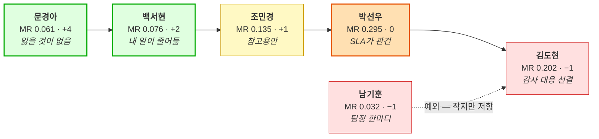

# JTBD 인터뷰 6건 종합

> # 🚨 실제 인터뷰 결과가 아닙니다
> [응답지 6종](.)은 모두 **AI가 생성한 가상 응답지**입니다. 이 종합 문서의 목적은 **분석 파이프라인 리허설** — 인터뷰 결과가 점수·사분면·로드맵으로 어떻게 전파되는지, 그리고 **어디서 프레임워크가 깨지는지**를 확인하는 것입니다.
> **여기 나오는 수치·판정을 근거로 의사결정하면 안 됩니다.**

**입력**: [문항지](01_사례_인터뷰-문항지.md) · [응답지 6종](.) — 김도현 · 문경아 · 박선우 · 조민경 · 남기훈 · 백서현
**이 문서가 하는 일**: 문항지 §3-3이 예고한 *"6건 전부를 마친 뒤 §3-3을 종합하면 AOS·DOS·혼합 매트릭스를 한 번에 갱신할 수 있습니다"* 를 수행합니다.

---

## 1. 세션 개요

| 인터뷰이 | 유형 | 모집 그룹 | 소요 | 용어 추종 시점 | 전환 판정 |
|---|---|---|---:|---:|:---:|
| **박선우** 거래소 | 🔵 핵심·디지털 | ① 시작 | 84분 | 12분 | ⚠️ **동률 9=9** |
| **백서현** 회계법인 | 🔵 핵심·쐐기 | ① 시작 | 76분 | **8분** *(최속)* | ✅ **예 8>6** |
| **조민경** 은행 | 🟢 확장 | ① 시작 | 90분 | **41분** *(최지연)* | ✅ 예 9>8 *(조건부)* |
| **김도현** AMC | 🔵 핵심·부동산 | ③ 미인지 | 87분 | 34분 | ❌ **아니오 8<9** |
| **문경아** 특수자산 | 🔴 극단 | ② 중단 | 92분 | 19분 | ✅ **예 9>5** *(최강)* |
| **남기훈** NPL | 🔵→🟢 재판정 | ② 중단(build) | 79분 | **거의 없음** | ❌ 아니오 7<8 |
| | | | **평균 84.7분** | | **예 3 · 동률 1 · 아니오 2** |

> ⚠️ **응답지 간 내부 모순을 하나 발견했습니다.** 박선우 응답지는 용어 추종 12분을 *"6인 중 가장 빠름"* 이라 적었고, 백서현 응답지는 8분을 *"6인 중 가장 빠름"* 이라 적었습니다. **8분 < 12분이므로 박선우 쪽 기술이 틀렸습니다.**
>
> 이것은 가상 응답지가 **서로를 참조하지 않고 개별 생성**된 흔적입니다. 실제 인터뷰에서는 발생하지 않는 오류지만, **리허설에서 이런 교차 검증을 해봐야 종합 단계의 점검 항목이 무엇인지 알 수 있습니다** — 실제 인터뷰에서도 "6인 중 최고/최저" 류 상대 평가는 종합 시점에 재확인해야 합니다.

### 1-1. 데모 편향 관리 — 세 장치가 작동했는가

문항지 §0-3이 데모 선행의 편향을 관리할 장치 셋을 설계했습니다.

| 장치 | 결과 | 판정 |
|---|---|:---:|
| **질문 없이 나온 발화 보존** | 6인 전원 기록됨. 문경아 *"오히려 이게 낫네요"*, 박선우 *"이거 몇 초 지연이에요?"* 등 | ⭕ |
| **역질문(질문 4: 화면이 다루지 않는 업무)** | **6/6 전원이 화면 밖 업무를 스스로 언급** → §5 신규 발견 8종 | ⭕ **가장 효과적** |
| **용어 추종 시점 기록** | 8분(백서현) ~ 41분(조민경). 남기훈은 끝까지 자기 용어 유지 | ⭕ |

> 💡 **역질문이 이 문항지 설계의 최대 성과입니다.** [문항지가 우려한 *"응답자가 화면에 있는 것 위주로 기존 경험을 재구성"*](01_사례_인터뷰-문항지.md) 이 6/6에서 발생하지 않았고, 그 대가로 **Pain List에 없던 요구 8종**을 얻었습니다.
>
> **용어 추종 시점은 오염 지표로 읽어야 합니다** — 백서현(8분)과 박선우(12분)의 중후반 발언은 우리 프레임에 물든 상태일 수 있습니다. 반대로 **남기훈이 끝까지 자기 용어를 쓴 것**(*"회수가"*, *"낙찰 예상가"*)은 그 응답의 독립성이 가장 높다는 뜻입니다 — **그런 응답자가 판정을 뒤집었다**는 사실이 §4-2와 연결됩니다.

---

## 2. 점수 갱신 종합 — 18종 전수

`AOS = I × (1 − S/5)`

| ID | 페르소나 | 가설 I / S | 실제 I / S | 가설 AOS | **실제 AOS** | 변화 | 근거 발언 |
|---|---|:---:|:---:|---:|---:|:---:|---|
| **MK-3** | 문경아 | 3 / 1 | **5** / 1 | 2.4 | **4.0** | **▲1.6** | *"그게 제일 중요합니다. 지금은 계약하고 나서야 안 되는 걸 알거든요"* |
| **KD-3** | 김도현 | 5 / 3 | 5 / **2** | 2.0 | **3.0** | ▲1.0 | *"감사에서 걸리는 것. 그거 하나입니다"* |
| **MK-2** | 문경아 | 5 / 2 | 5 / **1** | 3.0 | **4.0** | ▲1.0 | *"원가법이 맞는지 저도 모릅니다"* |
| **BS-2** | 백서현 | 5 / 3 | 5 / **2** | 2.0 | **3.0** | ▲1.0 | *"국내 것은 제가 새로 올린 적이 없습니다"* |
| **PS-3** | 박선우 | 4 / 1 | **5** / 1 | 3.2 | **4.0** | ▲0.8 | *"그 구간이 제일 무섭다 / 연 20건 넘는다"* |
| **JM-2** | 조민경 | 4 / 1 | **5** / 1 | 3.2 | **4.0** | ▲0.8 | *"as-of 조회, 그거 하나 때문에 오늘 시간을 낸 겁니다"* |
| **MK-1** | 문경아 | 5 / 1 | 5 / 1 | 4.0 | **4.0** | — | *"300km 떨어진 물건 사례였다. 그때 바로 해지"* |
| **KD-2** | 김도현 | 4 / 1 | 4 / 1 | 3.2 | **3.2** | — | *"반려된 뒤로 아예 시도를 안 한다"* |
| **PS-1** | 박선우 | 5 / 2 | 5 / 2 | 3.0 | **3.0** | — | *"자사 체결가로는 자기 자신을 검증할 수 없다"* |
| **BS-1** | 백서현 | 4 / 2 | 4 / 2 | 2.4 | **2.4** | — | *"매번 새로 합니다. 형식만 재사용"* |
| **NG-2** | 남기훈 | 5 / 3 | 5 / 3 | 2.0 | **2.0** | — | *"2주에 240건, 병목은 매칭 안 되는 60~70건"* |
| **PS-2** | 박선우 | 5 / 4 | 5 / 4 | 1.0 | **1.0** | — | 현재는 문제 없음 — **도입 게이트로 작동** |
| **JM-1** | 조민경 | 5 / 2 | **4** / 2 | 3.0 | **2.4** | ▼0.6 | *"외부 감평 의뢰를 늘려서 이미 대응 중"* |
| **KD-1** | 김도현 | 4 / 2 | **3** / 2 | 2.4 | **1.8** | ▼0.6 | *"130개 중 40개만 손대고 나머지는 이월"* |
| **NG-3** | 남기훈 | 4 / 2 | **3** / 2 | 2.4 | **1.8** | ▼0.6 | *"전국 평균 12%는 안 본다"* |
| **JM-3** | 조민경 | 4 / 1 | 4 / **2** | 3.2 | **2.4** | ▼0.8 | *"지금도 외부 데이터를 파일로 받아서 올리는 게 있다"* |
| **BS-3** | 백서현 | 4 / 3 | **3** / 3 | 1.6 | **1.2** | ▼0.4 | *"출처가 약하면 감정평가로 넘어간다"* — 우회로 존재 |
| **NG-1** | 남기훈 | 3 / 4 | **분할** | 0.6 | **→ §4-2** | 🔴 | *"서울·경기는 우리가 낫고 지방·비주거는 우리가 20% 넘어요"* |

**집계**: 상향 6 · 하향 5 · 유지 6 · **분할 1**

### 2-1. 가설 적중률 — Satisfaction이 Importance보다 정확했습니다

| 지표 | 적중 | 적중률 | 왜 |
|---|:---:|:---:|---|
| **Satisfaction** | 13 / 18 | **72%** | [페르소나 카드의 `대체 솔루션` 필드](../05_페르소나/01_사례_자산가치평가.md)가 **문서로 확인된 사실**(엑셀 롤포워드·감정평가서·사내 DB)에서 나왔음 |
| **Importance** | 10 / 18 | **56%** | *"이 사람에게 얼마나 중요할 것이다"* 라는 **분석자의 추측** |

> 🔴 **이것이 이 종합에서 가장 방법론적으로 유용한 발견입니다.** 같은 사람이 같은 시점에 매긴 두 점수인데 적중률이 16%p 차이 납니다. 차이의 원인은 능력이 아니라 **근거의 성질**입니다 —
>
> | | 근거 | 성질 |
> |---|---|---|
> | Satisfaction | 대체 솔루션 (관찰 가능한 행동) | **사실에서 추론** |
> | Importance | 업무 목표에서의 비중 | **의도에서 추측** |
>
> **행동에서 추론한 점수는 맞고, 의도를 추측한 점수는 절반만 맞습니다.** [페르소나 ①단계 규칙이 *"감정과 대체 솔루션을 반드시 채운다"*](../05_페르소나/01_사례_자산가치평가.md) 고 강제한 것이 여기서 값을 했습니다.

---

## 3. 실제 AOS 순위와 사분면 재산출

### 3-1. 순위

| 순위 | ID | 실제 AOS | 유형 | 가설 순위 | 이동 |
|:---:|---|---:|:---:|:---:|:---:|
| **1** | **PS-3** | **4.0** | 🔵 핵심 | 2 | ▲1 |
| **1** | **JM-2** | **4.0** | 🟢 확장 | 2 | ▲1 |
| **1** | **MK-1** | **4.0** | 🔴 극단 | 1 | — |
| **1** | **MK-2** | **4.0** | 🔴 극단 | 6 | ▲5 |
| **1** | **MK-3** | **4.0** | 🔴 극단 | 9 | **▲8** |
| 6 | KD-2 | 3.2 | 🔵 핵심 | 2 | ▼4 |
| 7 | KD-3 | 3.0 | 🔵 핵심 | 13 | **▲6** |
| 7 | PS-1 | 3.0 | 🔵 핵심 | 6 | ▼1 |
| 7 | BS-2 | 3.0 | 🔵 핵심 | 13 | **▲6** |
| 10 | JM-1 · JM-3 · BS-1 · **NG-1b** | 2.4 | | | |
| 14 | NG-2 | 2.0 | | 13 | ▼1 |
| 15 | KD-1 · NG-3 | 1.8 | | | |
| 17 | BS-3 | 1.2 | | 16 | ▼1 |
| 18 | PS-2 | 1.0 | | 17 | ▼1 |

> 🔴 **극단 페르소나(MK) 3종이 전부 공동 1위입니다.** 가설에서는 1·6·9위로 흩어져 있었습니다. [AOS 문서가 *"극단 항목의 점수는 다르게 읽어야 한다 — 매출 기회가 아니라 신뢰 방어"*](../06_시장기회분석/02_사례_aos-scoring.md) 고 경고했는데, 인터뷰 후 **그 항목들이 순위표 상단을 독점**했습니다. 경고의 필요성이 더 커졌습니다.

### 3-2. 사분면 기준선이 척도 천장에 닿았습니다

| 지표 | 가설 중앙값 | **실제 중앙값** | 문제 |
|---|:---:|:---:|---|
| **Importance** | 4.0 | **5.0** | 🔴 **척도 최댓값**. I=5 항목이 8개 → **10개**(18종의 56%) |
| Satisfaction | 2.0 | 2.0 | — |
| AOS | 2.4 | 2.70 | — |

**실제 중앙값(I 5.0 / S 2.0)으로 사분면을 그으면**

| 사분면 | 항목 | 개수 |
|---|---|:---:|
| 🔥 Q1 혁신기회 *(I≥5, S<2)* | PS-3 · JM-2 · MK-1 · MK-2 · MK-3 | 5 |
| 💎 Q2 개선기회 *(I≥5, S≥2)* | KD-3 · PS-1 · PS-2 · NG-2 · BS-2 | 5 |
| ⚫ Q3 유지관리 *(I<5, S<2)* | **KD-2** | **1** |
| ⚠️ Q4 과잉투자 *(I<5, S≥2)* | KD-1 · JM-1 · JM-3 · NG-1b · NG-3 · BS-1 · BS-3 | 7 |

> 🔴 **KD-2가 Q3(유지관리 — UX·안내 수준의 보완)로 분류됩니다. AOS 6위 항목입니다.**
>
> 이것은 모순입니다. KD-2는 [CJM 이탈 1위](../05_페르소나/03_사례_고객여정지도.md)이고 AOS 3.2로 상위권인데, **I=4가 중앙값 5.0 아래라는 이유만으로** 최하위 사분면에 떨어집니다.
>
> **원인은 중앙값이 척도 상한에 닿았기 때문입니다.** 18종 중 10종이 I=5이므로 `I ≥ 5.0` 컷은 사실상 "만점만 통과"이고, 나머지 8종은 실제 AOS와 무관하게 아래 두 칸으로 밀립니다. [AOS 문서가 A안(고정 3.0)을 폐기한 이유](../06_시장기회분석/02_사례_aos-scoring.md) — *"18종 중 18종이 상단에 몰려 사분면이 우선순위를 만들지 못함"* — 와 **방향만 반대인 같은 퇴화**입니다.

### 3-3. 권고 — 갱신 시점에는 기준선을 고정한다

| 방식 | Q1 | 판정 |
|---|:---:|---|
| 실제 중앙값 (I 5.0) | 5종 | ✕ **퇴화** — AOS 6위가 Q3에 떨어짐 |
| **가설 중앙값 고정 (I 4.0 / S 2.0)** | **6종** KD-2 · PS-3 · JM-2 · MK-1 · MK-2 · MK-3 | ⭕ **채택** |

**기준선을 갱신마다 움직이면 전후 비교가 불가능해집니다.** 사분면이 바뀐 이유가 *"고객 인식이 변했기 때문"* 인지 *"기준선이 움직였기 때문"* 인지 구분할 수 없습니다.

> 💡 **일반화하면**: 중앙값 기준선은 **분포가 척도 상한/하한에 몰리면 작동하지 않습니다.** 이 저장소는 이미 하한 쪽 퇴화(A안, Importance 하한 3점)를 경험했고, 이번에 **상한 쪽 퇴화**를 경험했습니다. **양쪽 모두 "추출 규칙의 그림자"** 입니다 — Pain을 `이탈 지점`에서만 뽑았기 때문에 중요도가 구조적으로 높게 쏠립니다.

---

## 4. 전환 동인 종합 — `Push + Pull > Habits + Anxieties`

### 4-1. 세그먼트가 클수록 전환이 어렵다

| 페르소나 | ①Push | ②Pull | ③Habits | ④Anxieties | 순합 | 판정 | SOM MR |
|---|:---:|:---:|:---:|:---:|:---:|:---:|---:|
| **문경아** | 5 | 4 | 2 | 3 | **+4** | ✅ 예 | 0.061 |
| **백서현** | 4 | 4 | 2 | 4 | **+2** | ✅ 예 | 0.076 |
| **조민경** | 4 | 5 | 4 | 4 | **+1** | ✅ 예*(조건부)* | 0.135 |
| **박선우** | 5 | 4 | 4 | 5 | **0** | ⚠️ 동률 | **0.295** |
| **남기훈** | 3 | 4 | 4 | 4 | **−1** | ❌ 아니오 | 0.032 |
| **김도현** | 4 | 4 | 4 | 5 | **−1** | ❌ 아니오 | 0.202 |

> 🔴 **상위 4명에서 세그먼트 크기와 전환 강도가 반비례합니다.** 가장 작은 문경아(0.061)가 +4로 최강이고, 가장 큰 박선우(0.295)가 0으로 경계입니다. 김도현(0.202)은 −1로 실패합니다.
>
> **이유는 Habits·Anxieties의 성질입니다.** 큰 기관일수록 ① 기존 프로세스에 맞춰 만들어 둔 것이 많고(양식·담당자·시스템 연동) ② 책임 소재가 무겁습니다. 문경아는 *"혼자 하는 일이라 바꿔도 남의 일이 안 늘어납니다"* 이고, 김도현은 *"엑셀 양식이 수탁사·회계법인이랑 맞춰져 있습니다"* 입니다.
>
> **DOS는 시장 크기를 곱해 큰 세그먼트를 올리는데, 전환 동인은 큰 세그먼트를 내립니다.** 두 지표가 구조적으로 반대 방향이므로 **DOS 순위를 진입 순서로 그대로 쓰면 안 됩니다.**

**남기훈만 예외입니다** — 작은데도(0.032) 저항이 큽니다. 사유가 다른 페르소나와 달라 *"조직의 자존심"*(팀장의 한마디)이기 때문이고, 이것이 [세그먼트 재판정](../08_value-proposition/01_검토_남기훈-세그먼트-재판정.md)의 근거 중 하나가 됐습니다.

### 4-2. NG-1 — 수식이 표현하지 못한 구조

**세 지표(AOS 최하위 0.6 · DOS 유일한 음수 · 사분면 Q4)가 모두 "자원 회수"라고 판정했는데 답이 반대로 나왔습니다.**

> *"**대조군이면 쓸 수 있습니다.** 우리 모델이랑 20% 이상 벌어지는 건만 알려주는 식이면요."*

[문항지가 실패 신호로 사전 등록](01_사례_인터뷰-문항지.md)해 둔 *"반대로 '대조군이면 당장 쓰겠다'가 나오면 세 지표가 모두 틀렸다는 뜻"* 이 그대로 발생했습니다.

**분할하니 세 지표가 옳았음이 확인됐습니다.**

| ID | 구간 | I | S | AOS | 판정 |
|---|---|:---:|:---:|---:|---|
| **NG-1a** | 서울·경기 | 3 | **5** | **0.0** | **완전 과잉충족** — 세 지표가 정확했음 |
| **NG-1b** | 지방·비주거 | 4 | 2 | **2.4** | 미충족 실재 · 단 시장이 작음 |

> 🔴 **틀린 것은 점수가 아니라 질문 단위였습니다.** 하나의 Pain에 Satisfaction이 둘인 경우를 `I − S` 도 `1 − S/5` 도 표현할 수 없습니다. **지역·자산군·종목 유동성에 따라 대체 솔루션 성능이 갈리면 Pain을 먼저 쪼개야** 합니다.
>
> **같은 점검이 필요한 후보**: 박선우가 *"메이저는 2%도 이상하고 알트는 15%도 정상"* 이라고 답했습니다 — **PS-1도 종목 유동성별로 만족도가 갈릴 가능성**이 있습니다. KD-1도 자산 유형별로 갈릴 수 있습니다.

---

## 5. 신규 발견 8종 — Pain List에 없던 것

전부 **질문 4(역질문)** 또는 **질문 48(놓친 것)** 에서 나왔습니다.

| # | 발견 | 출처 | 크기·의미 | 처분 |
|:---:|---|---|---|---|
| **1** | **개발 단계(준공 전) 자산** | 문경아 Q4 | **포트폴리오의 30%** | 거래 사례가 아예 없어 방법론 미성립 → [F24 Low](../08_value-proposition/VALUE-PROPOSITION_자산가치평가인프라_claude-opus-5-1m_effort-high.md) |
| **2** | **계정 단위 이상거래 탐지** | 박선우 Q4 | *"저희 일의 절반"* | **우리 범위 밖**(감시 시스템 영역) → F25 제외 |
| **3** | **스트레스 시나리오** (금리 ±200bp) | 조민경 Q3 | *"저희 일의 핵심"* | F20 Mid |
| **4** | **권리관계·회수기간** | 남기훈 Q3·Q48 | *"없으면 회수가 계산이 안 됩니다"* | 개발비 > 세그먼트 매출 → **F23 제외** |
| **5** | **호가 깊이·유동성 지표** | 박선우 Q48 | *"가격만으론 얕은 시장을 설명 못 함"* | F21 Mid |
| **6** | **임대차 정보 출처 표시** | 김도현 Q3 | *"어디서 들어왔는지가 안 보여요"* | F22 Mid |
| **7** | **은행 내부 감정 인력의 저항** | 조민경 Habits | *"우리 일 줄이려는 거냐"* | 🔴 **이해관계자 누락** → §5-1 |
| **8** | **자산 마스터 매핑 부담** | 김도현 Habits | *"130개를 손으로 맞춰야"* | 도입 **전** 저항으로도 작동 → F16 유상 온보딩 |

### 5-1. 발견 7이 페르소나 로스터의 구멍을 드러냅니다

[유가람(감정평가사)의 저항](../05_페르소나/01_사례_자산가치평가.md)은 **외부 이해관계자**로 잡아뒀는데, 조민경 인터뷰에서 **같은 저항이 고객 조직 내부에** 있다는 것이 나왔습니다 — 은행 자체 감정평가 조직입니다.

| | 유가람 (외부) | **은행 내부 감정 조직** (신규) |
|---|---|---|
| 위치 | 경쟁자·대체재 공급자 | **고객 조직 내부** |
| 저항 성질 | 직역 방어 | **일자리 방어** |
| 전환 수단 | 보조 도구 포지셔닝 · 리셀 | **?** — 미설계 |
| 로스터 등재 | ⭕ N-02 | **✕ 없음** |

> 🔴 **[NPL 편입 검토가 지적한 사각지대](../05_페르소나/06_검토_NPL-기업부동산-편입.md)와 같은 구조입니다** — *"자산을 소유한 쪽만 봤고 자산을 평가·검증하는 쪽은 통째로 빠졌다."* 이번에는 **고객사 안의 평가 조직**이 빠졌습니다. 조민경 세그먼트(SAM 2위, 24억)의 게이트키퍼가 정보보안·준법 외에 하나 더 있다는 뜻입니다.

---

## 6. 결정적 질문 답변 종합 — 6/6 확보

| 페르소나 | 결정적 질문 | 답 | 우리 가격표 대비 |
|---|---|---|---|
| **김도현** | 작년 감정평가·데이터 지출액 | **연 8,000만 원**(감정평가). *"감정평가보다 싸야 의미가 있어요"* | Professional(4,800만~8,400만) **정합** |
| **박선우** | 해외 벤더 지출·견적 | **연 1.5~2억**(미도입 — 원화 미반영). 조건 충족 시 지불 의향 | Exchange(1.2~2.4억) **정합** |
| **조민경** | 외부 값 병행의 규정 근거 | **2단계** — 참고용은 부서장 전결 / 산정 반영은 **규정 개정 1년+** | 진입 경로 분리 필요 |
| **문경아** | 산출 불가 자주 뜨면 유지/해지 | **조건부 유지** — 산출불가 **≤30%** + **계약 전 고지** | 별도 과금 아님 |
| **남기훈** | 대조군으로 쓸 의향 | **조건부 예** — 지방·비주거 한정 · **연 2~3천** | ⚠️ **SAM 가정의 1/3** |
| **백서현** | QRM 외부 출처 승인 기준 | **5항목 + 6~9개월.** 등록 후 **법인 전체 사용** | 팀→법인 확장 구조 필요 |

> 💡 **가격 상한이 두 축에서 기존 가정과 일치했습니다**(김도현·박선우). 반면 **남기훈만 1/3**로 나와 [세그먼트 재판정](../08_value-proposition/01_검토_남기훈-세그먼트-재판정.md)으로 이어졌습니다. 나머지 셋(조민경·문경아·백서현)의 답은 **금액이 아니라 조건**이었습니다 — 규정 근거 / 커버리지 비율 / 인증 절차. **B2B 규제 산업에서 결정적 질문의 답은 가격이 아닐 수 있습니다.**

### 6-1. QRM 5항목 — 유일하게 확보한 인증 조달 명세

| 심사 항목 | 우리 대응 | 난이도 |
|---|---|:---:|
| ① 제공자의 독립성 | 발행자·평가 대상과 무관함을 문서화 | 낮음 |
| ② 산출 방법론의 문서화 | **이미 차별화 축** | 낮음 |
| ③ 데이터 출처의 추적 가능성 | as-of 이력이 그대로 대응 | 중간 |
| ④ **제공자의 사업 계속성** | 🔴 **기술로 못 메움** — 레퍼런스·자본·데이터 에스크로 | **높음** |
| ⑤ 과거 오류 이력 | 장애·정정 이력 공개 | 낮음 |

**④가 초기 스타트업의 구조적 약점입니다** — *"신생 업체 자료를 인용했다가 그 회사가 없어지면 나중에 검증이 안 됩니다."*

---

## 7. 실패 신호 발현 — 2/6, 그중 1건은 반대 방향

| 페르소나 | 사전 등록한 실패 신호 | 발현 | 결과 |
|---|---|:---:|---|
| **김도현** | *"반년 전 값이어도 실무상 문제없다"* | ⚠️ **부분** | *"이월해도 업무는 돌아간다"* → KD-1 I 4→3 |
| **남기훈** | *"대조군도 필요 없다"* | ⚠️ **반대 방향** | *"대조군이면 쓸 수 있다"* → 가설이 **너무 비관적**이었음 |
| 문경아 | *"값이 안 나오면 쓸 이유가 없다"* | ✕ | 오히려 *"산출 불가를 보고 안심"* |
| 박선우 | *"해외 인덱스로 충분하다"* | ✕ | **원화 미반영**이 도입을 막았음 |
| 조민경 | *"규정상 참고자료로도 못 쓴다"* | ✕ | 참고용은 부서장 전결 |
| 백서현 | *"법인 표준 등록은 불가능하다"* | ✕ | 절차·기준이 문서로 존재 |

> 💡 **실패 신호를 사전 등록해 둔 것이 값을 했습니다.** 특히 남기훈 건은 **가설이 틀린 방향까지 미리 적어둔 덕분에** 세 지표의 판정을 재검토하는 계기가 됐습니다. *"신호가 안 나왔다"* 도 정보이고(박선우의 원화 미반영), *"반대로 나왔다"* 는 가장 값진 정보입니다.

---

## 8. 소개 요청(Q49) 집계 — 6인 중 4인이 회계법인을 지목

| 페르소나 | 소개 대상 | 회계법인/감사? |
|---|---|:---:|
| 김도현 | 회계법인 담당 파트너 | **⭕** |
| 조민경 | 감사부 + 회계법인 담당자 | **⭕** |
| 남기훈 | **회계법인 NPL 자문팀** — *"여러 딜을 보니까 더 관심 있을 겁니다"* | **⭕** |
| 백서현 | **자사 감사팀 매니저** + 다른 법인 부동산팀 | **⭕** |
| 문경아 | 지방 물류 운용사 2곳 | ✕ |
| 박선우 | 수탁사 | ✕ |

> 🔴 **4/6이 회계법인·감사팀을 지목했습니다.** [백서현을 쐐기로 본 판단](../05_페르소나/06_검토_NPL-기업부동산-편입.md)이 **점수가 아니라 소개 경로에서 독립적으로 확인**됐습니다. DOS로는 백서현이 최하위권(0.034)인데, **네트워크 중심성으로는 최상위**입니다 — 수식이 잡지 못하는 축입니다.

**다음 인터뷰 1순위는 조현우(회계법인 감사·자산평가 검증)입니다.** 근거 셋:
1. 4명이 독립적으로 지목
2. 백서현이 *"오히려 감사팀이 더 급할 수 있어요. 피감회사 숫자를 반박할 게 없거든요"* 라고 직접 언급
3. [사업성 판정 조건 3(인증 칸 조달)의 검증 신호 1번](../01_porters-five-forces/08_검토_사업성-판정.md)이 *"감사인이 우리 값을 근거로 받아들이는가"*

---

## 9. 이 종합에서 배울 점

**① 행동에서 추론한 점수가 의도를 추측한 점수보다 정확했습니다.**
Satisfaction 72% vs Importance 56%. 차이는 능력이 아니라 근거의 성질입니다 — 대체 솔루션은 관찰 가능한 사실이고 중요도는 추측입니다. **점수를 매길 때 "이 점수의 근거가 사실인가 추측인가"를 표시해 두면 신뢰 구간을 알 수 있습니다.**

**② 중앙값 기준선은 분포가 척도 끝에 몰리면 양방향으로 퇴화합니다.**
이 저장소는 하한 퇴화(A안)와 상한 퇴화(이번)를 모두 경험했습니다. 둘 다 원인이 같습니다 — **Pain을 `이탈 지점`에서만 뽑는 추출 규칙**이 중요도를 구조적으로 높게 쏠리게 합니다. **갱신 시점에는 기준선을 고정해야** 전후 비교가 가능합니다.

**③ 시장 크기와 전환 가능성이 반비례합니다.**
상위 4명에서 SOM MR과 전환 순합이 역상관입니다. **DOS는 큰 세그먼트를 올리고 전환 동인은 큰 세그먼트를 내립니다.** 두 지표가 구조적으로 반대 방향이므로 DOS 순위를 진입 순서로 쓰면 *"가장 크고 가장 안 팔리는 곳"* 부터 가게 됩니다.

**④ 하나의 Pain에 만족도가 둘일 수 있습니다.**
NG-1의 오판은 점수 오류가 아니라 **질문 단위 오류**였습니다. 구간별로 대체 솔루션 성능이 갈리면 먼저 쪼개야 하고, PS-1·KD-1에 같은 점검이 필요합니다.

**⑤ 역질문 하나가 신규 발견 8종을 만들었습니다.**
질문 4(*"이 화면이 다루지 않는 업무는"*)에서 6/6 전원이 화면 밖을 언급했습니다. 데모 선행 설계의 편향을 이 한 문항이 상쇄했고, **그중 하나(발견 7)는 페르소나 로스터의 구멍**을 드러냈습니다.

**⑥ 결정적 질문의 답이 금액이 아닐 수 있습니다.**
6명 중 3명의 답이 조건이었습니다 — 규정 근거 / 커버리지 비율 / 인증 절차. **규제 산업에서는 "얼마면 사겠는가"보다 "무엇이 있으면 살 수 있는가"가 결정적입니다.**

**⑦ 네트워크 중심성은 어느 수식에도 없습니다.**
백서현은 DOS 최하위권인데 소개 지목 4/6으로 최상위입니다. AOS도 DOS도 KSF도 이 축을 재지 않습니다. **쐐기 판단은 점수 밖에서 내려야 한다**는 [기존 결론](../06_시장기회분석/03_사례_dos-scoring.md)이 재확인됐습니다.

---

## 10. 갱신 대상 문서

| 문서 | 반영 내용 | 상태 |
|---|---|:---:|
| [02 AOS 산출](../06_시장기회분석/02_사례_aos-scoring.md) | 실제 I·S 병기 · 순위 재산출 · **중앙값 상한 퇴화 기록** | **✅ §9** |
| [03 DOS 산출](../06_시장기회분석/03_사례_dos-scoring.md) | 남기훈 MR · NG-1 분할 | **✅ §10** |
| [04 혼합 매트릭스](../06_시장기회분석/04_사례_aos-dos-매트릭스.md) | 갱신 AOS × 갱신 DOS 재배치 | **✅ §7** |
| [08 Value Proposition](../08_value-proposition/VALUE-PROPOSITION_자산가치평가인프라_claude-opus-5-1m_effort-high.md) | Pain·Outcome·전환 판정·Feature Map | ✅ 반영 |
| [01 Pain List](../06_시장기회분석/01_사례_pain-list.md) | 클러스터 갱신 | ✅ 반영 |
| **페르소나 로스터** | 은행 내부 감정 조직 신규 이해관계자 | **✅ [05-08 검토](../05_페르소나/08_검토_고객사-내부-평가조직.md)** — 하승우(비활성·고용 방어) 카드 신설 |
| **PS-1 · KD-1 구간별 분할 점검** | NG-1과 같은 구조인지 | **✅ [06-05 검토](../06_시장기회분석/05_검토_Pain-분할-점검.md)** — **4종 확인**(PS-1·KD-1·BS-1 + NG-1) |

### 10-1. 두 후속 검토가 확인한 것

| 검토 | 결과 |
|---|---|
| **[고객사 내부 평가조직](../05_페르소나/08_검토_고객사-내부-평가조직.md)** | 유가람(외부 감정평가사)과 **분리해야 함** — 위치·저항 동기·전환 결과가 다릅니다. 유가람은 전환하면 채널이 되고 **하승우는 매출이 됩니다.** 비활성 장벽이 **6종**(고용 방어 추가)이 되고, 조민경 여정 S4의 **게이트키퍼가 셋**이 됩니다 |
| **[Pain 분할 점검](../06_시장기회분석/05_검토_Pain-분할-점검.md)** | **18종 중 4종(22%)** 이 "만족도 둘" 구조. **BS-1을 새로 발견**(딜 규모 축). **분할하면 한쪽이 거의 항상 과잉충족**으로 나오므로 통합 채점은 양쪽 다 잘못 표현합니다. 4종의 분할 축이 모두 **우연히 발견**됐으므로 문항지에 직접 묻는 문항 3개를 추가했습니다 |

> 🔴 **분할 점검이 기존 모순 하나를 해소했습니다.** [혼합 매트릭스 §7-5](../06_시장기회분석/04_사례_aos-dos-매트릭스.md)에 *"KD-1은 AOS 1.8·Q3인데 MVP High — 점수가 낮아도 인프라인 항목이 있다"* 는 예외 처리를 남겼는데, **분할하니 KD-1b가 Q2(출시 첫날 필요)로 올라가 예외가 필요 없어졌습니다.** 모순이 보이면 예외 규칙을 늘리기 전에 **측정 단위를 의심**해야 한다는 사례입니다.

---

> ⚠️ **최종 경고**: 이 문서의 모든 수치는 **AI 생성 가상 응답지**에서 나왔습니다. 실제 인터뷰 후에는 이 문서를 **폐기하거나 실제 축어록 기반으로 교체**해야 합니다.
>
> **그럼에도 이 리허설에서 얻은 것**은 응답 내용이 아니라 **파이프라인의 고장 지점**입니다 — ① 중앙값 기준선의 양방향 퇴화 ② 하나의 Pain에 만족도가 둘인 구조 ③ DOS와 전환 동인의 역방향성 ④ 네트워크 중심성의 측정 부재 ⑤ 응답지 간 상대 평가의 교차 검증 필요. **이 다섯은 실제 인터뷰에서도 그대로 발생하므로, 미리 알아둔 것 자체가 성과입니다.**
