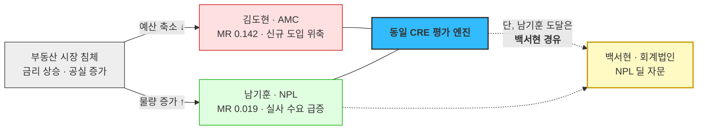

# 검토 — 남기훈(NPL) 세그먼트 재판정

**질문**: 남기훈을 **핵심 페르소나 · 직접 영업 대상**으로 유지할 수 있는가?
**계기**: [Value Proposition §9](IVI-VPS-v1_0-merged.md)에서 *"남기훈 WTP 상한이 SAM 가정의 1/3 → SAM·DOS 하향 반영 필요"* 로 자체 표시한 항목
**입력**: [NPL 편입 검토](../05_페르소나/06_검토_NPL-기업부동산-편입.md) · [DOS 산출](../06_시장기회분석/03_사례_dos-scoring.md) · [남기훈 응답지](../07_jtbd/06_응답지_남기훈.md) · [사업성 판정](../01_porters-five-forces/08_검토_사업성-판정.md)

---

## 1. 결론

| 항목 | 기존 | **재판정** |
|---|---|---|
| 페르소나 유형 | 🔵 **핵심** (CRE 제품 두 번째) | 🟢 **확장 — 간접 채널 경유** |
| 직접 영업 | ⭕ 진입 순서 3번 | **✕ 제외** |
| 도달 경로 | 백서현 각주로 우회 진입 후 **직접 계약** | **백서현 NPL 딜 템플릿으로 흡수.** 별도 세일즈 없음 |
| 세그먼트 매출 | 8곳 × 8,000만 = **6.4억** | 8곳 × 2,500만 = **2.0억** (31%) |
| SAM MR | 0.058 | **0.019** (−67%) |
| SOM MR | 0.094 | **0.032** (−67%) |
| MVP 기여 | F17(차이 리포트) Mid | **F17 유지 · 단 근거는 남기훈이 아니라 조현우** |

> **한 줄 요약**: 남기훈은 **틀린 페르소나가 아니라 틀린 가격의 페르소나**였습니다. 문제·행동·맥락은 전부 실재하는데 **지불 능력이 편입 근거의 1/3**이고, 필요 기능은 남기훈 매출로 회수되지 않습니다. 그래서 **버리지 않고 채널 뒤로 옮깁니다.**

---

## 2. 편입 근거 6축을 인터뷰로 재채점

[NPL 편입 검토 §2](../05_페르소나/06_검토_NPL-기업부동산-편입.md)는 6축 **전부 ◎** 로 채점해 핵심 편입을 결정했습니다. 그 6축을 [응답지](../07_jtbd/06_응답지_남기훈.md)로 다시 채점합니다.

| # | 기준 | 편입 검토 | **인터뷰 후** | 근거 |
|:---:|---|:---:|:---:|---|
| 1 | **확장 계수** | ◎ | **◎ 유지** | *"2주에 240건"* — 풀 1건 → 담보물 수백 건 확인 |
| 2 | **ARPU 체력** | ◎ *"딜 규모가 수십~수백억. 데이터비가 오차 범위 안"* | **✕ 반증** | *"연 2~3천이면 검토합니다. **그 이상은 우리 데이터 구독료보다 비싸져서 명분이 안 섭니다**"* |
| 3 | **구매 속도** | ◎ | **◎ 유지** | 매각 공고 → 실사 2~4주. S4 *"딜 비용에 묻힘"* |
| 4 | **데이터 재사용성** | ◎ *"CRE 파이프라인 거의 그대로"* | **△ 하향** | *"권리관계요. 선순위 얼마 물려 있는지, 임차인 대항력 있는지. **그거 없으면 회수가 계산이 안 됩니다**"* → 등기·대항력 레이어는 별도 사업 |
| 5 | **시장 안정성** | ◎ | **◎ 유지** | 침체기 물량 증가 — **유일하게 온전히 살아남은 강점** |
| 6 | **문제 심각도** | ◎ *"평가값 = 매입 단가. 1~2% 틀리면 딜 수익률 뒤집힘"* | **△ 하향** | *"입찰가 산정 엑셀에 **한 열 추가하는 정도**요. 그대로 쓰진 않습니다"* — 주력은 사내 모델 |

**6축 전부 ◎ → ◎ 3 · △ 2 · ✕ 1.** 핵심 편입의 근거가 절반으로 줄었습니다.

> 🔴 **② ARPU 체력이 무너진 것이 결정적입니다.** 편입 검토는 *"딜 규모 대비 데이터비가 오차 범위 안"* 이라는 **논리적 추론**으로 ◎를 줬습니다. 그런데 실제 답은 **딜 규모가 아니라 기존 데이터 구독료(연 3,000만)를 기준선으로 삼습니다.** 예산은 딜 손익이 아니라 **데이터 예산 항목**에서 나오기 때문입니다. **"돈이 많은 고객"과 "그 항목에 돈을 쓰는 고객"은 다릅니다.**

---

## 3. 숫자 재산정

### 3-1. 세그먼트 매출과 Market Relevance

| | 기존 | 갱신 | 변화 |
|---|---:|---:|:---:|
| 계약단가 가정 | 8,000만 원 | **2,500만 원** *(인터뷰 2~3천 중간값)* | −69% |
| 세그먼트 매출 | 6.4억 | **2.0억** | −69% |
| 갱신 SAM 총계 | 110억 | **105.6억** | −4% |
| 갱신 SOM 총계 | 25.4억 | **23.75억** | −6.5% |

**분모가 줄면서 다른 세그먼트 비중은 소폭 올라갑니다.**

| 페르소나 | 매출 | SAM MR | | SOM MR | |
|---|---:|---:|:---:|---:|:---:|
| **박선우** | 27억 | 0.245 → **0.256** | +4% | 0.276 → **0.295** | +7% |
| **조민경** | 24억 | 0.218 → **0.227** | +4% | 0.126 → **0.135** | +7% |
| **김도현** | 15억 | 0.136 → **0.142** | +4% | 0.189 → **0.202** | +7% |
| **문경아** | 4.5억 | 0.041 → **0.043** | +4% | 0.057 → **0.061** | +7% |
| **백서현** | 3.6억 | 0.033 → **0.034** | +4% | 0.071 → **0.076** | +7% |
| **남기훈** | **2.0억** | 0.058 → **0.019** | **−67%** | 0.094 → **0.032** | **−67%** |

### 3-2. NG-1 분할 — 하나의 Pain에 만족도가 두 개였다

인터뷰에서 드러난 구조적 결함입니다 — *"서울·경기는 우리가 낫습니다. 오차 8% 대 12%. **근데 지방·비주거는 우리가 20% 넘어요.** 거긴 이게 나을 수도 있습니다."*

**AOS 수식은 Pain 하나에 Satisfaction 하나만 받으므로, 이 경우를 표현할 수 없습니다.** 분할이 유일한 해법입니다.

| 항목 | I | S | AOS | MR | DOS | 보정(×1.2) | 판정 |
|---|:---:|:---:|---:|---:|---:|---:|---|
| *NG-1 (통합·기존)* | 4 | 3 | *1.6* | *0.058* | *0.058* | *0.070* | *(폐기)* |
| **NG-1a** 서울·경기 | 3 | **5** | **0.0** | 0.019 | **−0.038** | **−0.045** | **완전 과잉충족 — 건드리지 말 것** |
| **NG-1b** 지방·비주거 | 4 | 2 | **2.4** | 0.019 | **0.038** | **0.045** | 미충족 실재 · 단 시장이 작음 |
| **NG-2** 실사 마감 | 5 | 3 | 2.0 | 0.019 | **0.038** | **0.045** | — |
| **NG-3** 소급 대조 | **3** ▼ | 2 | **1.8** | 0.019 | **0.019** | **0.023** | *"전국 평균 12%는 안 본다"* |

> 💡 **분할이 판정을 뒤집지 않았습니다.** NG-1b가 AOS 1.6 → 2.4로 올라오지만 **DOS는 0.038로 여전히 최하위권**입니다. **"미충족은 실재하나 시장이 너무 작다"** 가 정확한 결론입니다 — [AOS·DOS 혼합 매트릭스의 Q4(아프지만 작음)](../06_시장기회분석/04_사례_aos-dos-매트릭스.md)에 남습니다.
>
> 반대로 **NG-1a가 DOS 음수(−0.038)** 로 확정됐습니다. [세 지표가 모두 "과잉충족"이라 판정](../06_시장기회분석/03_사례_dos-scoring.md)한 것은 **서울·경기에 관해서는 정확했습니다.** 세 지표가 틀린 게 아니라 **우리가 두 개를 하나로 묶어 물었던 것**입니다.

### 3-3. 백서현과의 직접 비교 — 이것이 재판정의 핵심

| | **남기훈** | **백서현** |
|---|---|---|
| 계약단가 | 2,500만 원 | **6,000만 원** |
| 기관 수 | 8곳 | 6곳 |
| 세그먼트 매출 | 2.0억 | 3.6억 |
| 보정 DOS *(최고 항목)* | **0.045** | **0.153** *(BS-2)* |
| 전환 판정 | **❌ 7 < 8** | **✅ 8 > 6** |
| Habits | ★★★★☆ | **★★☆☆☆ (최저)** |
| 게이트키퍼 | 팀장의 한마디 *(설득 불가)* | QRM *(문서로 대응 가능)* |
| 확산 | 없음 | **각주가 곧 광고** |
| NPL 커버 여부 | 본인 | **"부동산·NPL 자문 4년째"** |

**백서현 1계약 = 남기훈 2.4계약입니다.** 그리고 백서현은 한 계약이 여러 고객사 딜에 반복 재사용됩니다.

> 🔴 **결정적 근거는 남기훈 본인의 마지막 발언입니다.**
>
> > *"회계법인 NPL 자문팀 쪽 아는 분이 있습니다. **그쪽은 여러 딜을 보니까 더 관심 있을 겁니다.**"* — 남기훈 Q49
>
> **응답자가 스스로 자기보다 나은 고객을 지목했습니다.** 그리고 그 대상은 이미 우리 로스터에 있는 백서현입니다(*"부동산·NPL 자문 4년째"*, S6에서 *"부동산·NPL·구조조정 등 여러 딜팀이 사용"*). **같은 NPL 시장을 백서현 채널로 2.4배 싸게 먹을 수 있습니다.**

---

## 4. 사업성 판정 조건 1과의 충돌

[사업성 판정 §5](../01_porters-five-forces/08_검토_사업성-판정.md)의 **조건 1**은 *"규제·사건 트리거가 있는 세그먼트만 초기 타깃"* 이고, 깨지면 *"대체재(현상 유지)에 집니다"* 였습니다.

| 페르소나 | S1 트리거 | 성격 | 조건 1 |
|---|---|---|:---:|
| 조민경 | 감독당국 지적·검사 | **규제** | ⭕ |
| 박선우 | 이상거래·상장 사고 | **사건** | ⭕ |
| *(서태영·STO)* | 협의체 가치평가 요건 | **규제** | ⭕ |
| 김도현 | 분기 결산 + 내부 보안 절차 | 절차 | △ |
| 백서현 | 딜 수임 + **QRM 심사** | 절차 *(단 게이트가 명시적)* | △ |
| **남기훈** | **매각 공고** | **사업 기회** — 규제도 사건도 아님 | **✕** |

**남기훈 응답이 이를 명시적으로 확인합니다.**

> *"저흰 **감독 검사 대상이 아닙니다.** 투자심의가 우리 감사예요."* — Q46
> *(Push 강도 ★★★☆☆ — 6인 중 최저)*

> 🔴 **조건 1을 적용하면 남기훈은 초기 타깃에서 빠집니다.** 이것은 이번 재검토에서 새로 만든 기준이 아니라 **이미 문서화된 판정 조건**입니다. [사업성 판정 §2](../01_porters-five-forces/08_검토_사업성-판정.md)가 *"트리거가 없는 세그먼트(최도윤·일반 보유자)는 이미 제외했고 그 판단이 사후적으로 정당화된다"* 고 적었는데, **남기훈에게는 같은 기준을 적용하지 않았던 것이 누락**입니다.

---

## 5. 그럼에도 버리지 않는 이유 — 살아남은 강점 하나

[편입 검토](../05_페르소나/06_검토_NPL-기업부동산-편입.md)가 발견한 **경기 역헤지**는 반증되지 않았고, 다른 어느 세그먼트에도 없는 성질입니다.

**헤지 효과는 유지하면서 세일즈 비용은 없애는 구조**가 가능합니다 — 침체기에 NPL 물량이 늘면 **백서현의 NPL 딜 건수가 함께 늘어납니다.** 회계법인 자문 수요는 딜 물량에 비례하므로, 헤지는 남기훈 직접 계약 없이도 백서현 채널에서 실현됩니다.

---

## 6. Feature 재판정

### 6-1. F17 차이 리포트 — 존치하되 근거를 바꾼다

남기훈 전용 기능으로 보면 **매출 2억 세그먼트를 위한 개발**이라 정당화가 어렵습니다. 그런데 **같은 요구를 독립적으로 한 사람이 한 명 더 있습니다.**

| 요구자 | 발언 | 같은 요구인가 |
|---|---|:---:|
| **남기훈** (NPL) | *"차이 리포트요. 값이 아니라 **'우리랑 다른 건 여기'** 를 짚어주는 거요"* | — |
| **조현우** (회계법인 감사) | *"고객 숫자와 대조할 독립 기준값과 **이상치 탐지** — 어떤 자산의 평가액이 시장과 가장 많이 벌어져 있는지"* · *"화면을 오래 보지 않고 **'어긋난 것만 뽑아 주는' 형태**를 원합니다"* | **⭕ 동일** |

> 💡 **[Pain List §5의 "대체하지 않고 대조하는 상태" 클러스터를 갱신해야 합니다.](../06_시장기회분석/01_사례_pain-list.md)** 기존에 `NG-1 · (최도윤)` 2회로 잡혀 있었는데, **최도윤보다 조현우가 훨씬 직접적인 요구자**입니다. `NG-1b · 조현우` 로 바꾸면 **회계법인 축 안에서 2회 반복**이 되어, F17의 개발 근거가 남기훈 매출과 분리됩니다.

**판정**: F17 **MVP 제외 · 우선순위 Mid 유지.** 단 **1차 수혜자를 조현우(회계법인 감사)로 재지정**하고, 남기훈은 파생 수혜자로 둡니다.

### 6-2. F23 권리관계·회수기간 — 제외로 격하

| 항목 | 값 |
|---|---|
| 요구자 | **남기훈 단독** *(*"없으면 회수가 계산이 안 됩니다"*)* |
| 개발 난이도 | **5** — 등기부 권리관계 · 임차인 대항력 데이터 확보가 별도 사업 |
| 회수 가능 매출 | **2.0억** 세그먼트 |
| 판정 | **Low → 제외(Drop).** "하지 않는 것" 목록으로 이동 |

**남기훈이 *"가격만 있으면 반쪽"* 이라고 한 것은 사실이지만, 그 반쪽을 채우는 비용이 그 세그먼트 전체 매출을 넘습니다.** 이것이 남기훈을 직접 고객으로 두지 못하는 두 번째 이유입니다 — **요구를 충족시키려면 적자입니다.**

---

## 7. 재진입 조건 — 무엇이 바뀌면 다시 핵심으로 올리는가

버리는 게 아니라 **조건을 달아 보류**합니다.

| # | 재진입 조건 | 현재 상태 | 확인 방법 |
|:---:|---|---|---|
| 1 | **전업 NPL 투자사 수가 8곳보다 유의하게 많다** | 8곳은 [DOS 문서의 미확인 가정](../06_시장기회분석/03_사례_dos-scoring.md) | 금융위 등록 F&I·대주단 현황 |
| 2 | **실제 WTP가 연 2~3천보다 높다** | 응답자 1인 진술 *(가상 응답지)* | **실제 인터뷰 3곳 이상** |
| 3 | **F23 없이도 회수 판단이 가능하다** | 남기훈은 불가라고 답 | 권리관계를 고객이 자체 보유하는지 |
| 4 | **은행 계열 F&I는 규제 트리거를 갖는다** | 응답지에 *"은행 계열이면 조민경 수준으로 무거워짐"* 시사 | 계열/독립 구분 후 트리거 유무 확인 |

> ⚠️ **조건 4가 가장 유망합니다.** 남기훈은 *"저흰 감독 검사 대상이 아닙니다"* 라고 했지만, **은행 계열 F&I는 그룹 차원의 검사·내부통제 대상일 수 있습니다.** 조건 1의 "8곳"을 **계열 / 독립으로 쪼개면 계열 쪽은 조민경형 트리거를 가질 가능성**이 있고, 그러면 조건 1(규제 트리거)을 만족합니다. **재진입 검증의 1순위입니다.**

---

## 8. 이 재검토에서 배울 점

**① "돈이 많은 고객"과 "그 항목에 돈을 쓰는 고객"은 다릅니다.**
편입 검토는 *"딜 규모가 수십~수백억이니 데이터비는 오차 범위"* 라는 추론으로 ARPU ◎를 줬습니다. 그런데 실제 예산은 **딜 손익이 아니라 데이터 예산 항목**에서 나오고, 그 기준선은 기존 구독료(연 3,000만)였습니다. **지불 능력(ability)과 지불 관행(precedent)을 구분해야 합니다.**

**② 하나의 Pain에 만족도가 두 개인 경우를 AOS가 표현하지 못합니다.**
NG-1의 오판은 점수를 잘못 매긴 게 아니라 **질문 단위를 잘못 잡은 것**입니다. 지역·자산군에 따라 대체 솔루션의 성능이 갈리면 **Pain을 먼저 쪼개고 점수를 매겨야** 합니다. 이것은 다른 페르소나에도 적용될 수 있는 점검 항목입니다 — **김도현의 KD-1도 자산 유형별로 갈릴 가능성**이 있습니다.

**③ 응답자가 자기보다 나은 고객을 지목하면 그것을 받아야 합니다.**
남기훈 Q49의 소개 발언(*"그쪽은 여러 딜을 보니까 더 관심 있을 겁니다"*)은 형식상 레퍼럴 요청의 답이지만, 내용상 **세그먼트 우선순위에 대한 현장 판단**입니다. 인터뷰 마무리 문항의 답을 소개 경로로만 쓰면 이 정보가 버려집니다.

**④ 이미 문서화한 판정 조건을 전 세그먼트에 균일하게 적용해야 합니다.**
사업성 판정 조건 1(규제·사건 트리거)은 최도윤·일반 보유자를 제외하는 데는 썼는데 **남기훈에게는 적용하지 않았습니다.** 편입 검토가 6축을 새로 만들어 채점했기 때문에, **기존 판정 조건과의 정합성 확인이 누락**됐습니다. 새 프레임으로 채점할 때는 **기존 프레임의 결론과 충돌하는지 반드시 교차 확인**해야 합니다.

**⑤ 요구를 충족시키는 비용이 세그먼트 매출을 넘으면 그 고객은 고객이 아닙니다.**
F23(권리관계)이 그 사례입니다. *"없으면 반쪽"* 이라는 진술은 정확하지만, 반쪽을 채우는 비용이 2억 세그먼트를 넘습니다. **Pain의 강도와 사업 타당성은 별개 축**입니다.

---

## 9. 갱신 대상 문서

| 문서 | 갱신 필요 항목 | 상태 |
|---|---|:---:|
| [Value Proposition](IVI-VPS-v1_0-merged.md) | §0-2 세그먼트 표 · §1-2 NG-1 분할 · §2-3 전환 판정 · §5-4 진입 순서 · §7-3 반증 · §8 F17·F23 · §9 한계 | **✅ 반영 완료** |
| [DOS 산출](../06_시장기회분석/03_사례_dos-scoring.md) | 남기훈 계약단가·MR·DOS · NG-1 분할 | **✅ §10 신설** — 가설값(§2~§9)은 원형 보존하고 갱신값을 §10에 병기. 상단 배너와 해당 행에 ⚠️ 포인터 |
| [NPL 편입 검토](../05_페르소나/06_검토_NPL-기업부동산-편입.md) | 6축 재채점 결과 | **✅ 상단 배너 추가** — 판정 뒤집힘 명시. 기업 부동산·회계법인 결론은 유효함도 함께 표기 |
| [Pain List](../06_시장기회분석/01_사례_pain-list.md) | "대체하지 않고 대조" 클러스터 갱신 | **✅ 반영** — `NG-1 · (최도윤)` → `NG-1b · 조현우` |

---

> ⚠️ **검증 상태**: 이 재판정의 근거인 [남기훈 응답지](../07_jtbd/06_응답지_남기훈.md)는 **AI가 생성한 가상 응답지**입니다. 따라서 *"연 2~3천"* 이라는 WTP 상한도 실측값이 아닙니다.
>
> **다만 재판정의 방향은 실제 인터뷰 없이도 유효합니다** — ① 조건 1(규제 트리거) 충돌은 응답지와 무관하게 [사업성 판정](../01_porters-five-forces/08_검토_사업성-판정.md)에서 도출되고 ② 백서현이 NPL을 이미 커버한다는 것은 [편입 검토](../05_페르소나/06_검토_NPL-기업부동산-편입.md)가 직접 적은 사실(*"1순위: 회계법인 NPL·부동산 자문팀"*)이며 ③ F23의 비용-매출 역전은 난이도 평가와 기관 수 가정만으로 성립합니다.
>
> **실제 인터뷰에서 반드시 확인할 것은 §7의 재진입 조건 4** — 은행 계열 F&I가 규제 트리거를 갖는지입니다. 이것이 긍정이면 재판정을 되돌려야 합니다.
