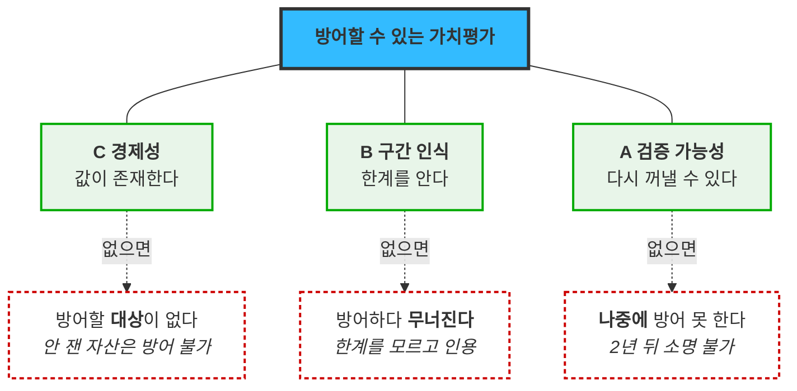

# 가치목표 — 통합 선언과 세 기둥

**입력**: [경쟁사 11사 가치 선언문](00_리서치_경쟁사-가치선언.md) · [VP 정의서](IVI-VPS-v1_0-merged.md) · [KSF 6종](../03_ksf/01_분석_자산가치평가-인프라.md) · [Pain 분할 점검](../06_시장기회분석/05_검토_Pain-분할-점검.md) · [JTBD 종합](../07_jtbd/08_종합_인터뷰-결과.md)
**출발점**: 창업자가 제시한 네 가치 — **신뢰 · 합리 · 빠름 · 맞춤형**
**구성**: **§0 요약 1페이지**(대외 제시용) + **§1~§9 본문**(내부 전략)

---

# §0. 요약 1페이지

## 우리가 세우는 가치

> # **방어할 수 있는 가치평가**
> ### *Defensible Valuation*
>
> **값을 팔지 않습니다. 그 값을 **혼자 방어하지 않아도 되는 상태**로 만들어 팝니다.**

## 세 기둥 — 사이 · 경계 · 이력

| 대외 명칭 | 영문 | 선언 | 핵심 근거 | 경쟁 11사 중 |
|---|---|---|---|:---:|
| **사이** *(C 경제성)* | *Fill the Gap* | **"연 1~2회와 방치 사이를 채웁니다"** 감정평가 단가로는 불가능했던 주기와 건수를 성립시킵니다 | 김도현: 자산 130개 중 **40개만** 손대고 **69% 이월** | **0곳** |
| **경계** *(B 구간 인식)* | *Know the Boundary* | **"되는 것과 안 되는 것의 경계를 먼저 말합니다"** 자산 100개 중 78개는 냅니다. 나머지 22개는 왜 못 내는지 계약 전에 말씀드립니다 | 커버리지 사전 진단이 **최대 오판**(AOS 2.4 → **4.0**) | **0곳** |
| **이력** *(A 검증 가능성)* | *Keep the Trace* | **"2년 뒤에도 그때 그 값이 남습니다"** 믿으라고 하지 않습니다. 언제든 다시 꺼내 직접 확인하십시오 | 3개 페르소나가 독립 요구. **클러스터 DOS 0.770 최고** | **0곳** |

> 💡 **명칭 선정 근거**: 2글자 한자어로 통일해 병렬성을 확보했고, [경쟁사가 점유한 언어](#경쟁-지형에서의-위치)를 피했습니다. 특히 **"커버리지"를 쓰지 않은 것이 의도적**입니다 — CoStar·디스코가 *"가장 넓은 커버리지"* 로 점유한 단어라, 같은 말을 정반대 뜻(한계 공개)으로 쓰면 혼선이 생깁니다. 영문은 명령형으로 맞춰 **Fill / Know / Keep** 구조를 만들었습니다.

## 왜 셋이 모두 필요한가 — 하나만 빠져도 상위 문장이 무너집니다

| 빠지면 | 무슨 일이 | 실제 발언 |
|---|---|---|
| **C 없음** | 방어할 **대상 자체가 없습니다** — 안 잰 자산은 방어 여부를 논할 수 없음 | *"나머지는 그냥 이월했어요"* |
| **B 없음** | 방어하다 **무너집니다** — 한계를 모르고 인용했다가 반박당함 | *"300km 떨어진 물건 사례였다. 그때 바로 해지"* |
| **A 없음** | **나중에** 방어를 못 합니다 — 지금은 되는데 2년 뒤 소명이 불가 | *"과거 이메일·PDF 뒤지기"* |

## 경쟁 지형에서의 위치

| 이미 점유된 언어 | 점유자 |
|---|---|
| 판단의 기준 | 빅밸류 *(공식 슬로건)* |
| 정보 비대칭 해소 | 밸류맵 · 쟁글 |
| 독립적·중립적 데이터 | Kaiko |
| 규제 등록 기준가 | CF Benchmarks |
| 가장 넓은 커버리지 | CoStar · 디스코 |
| 국가가 정한 하나의 숫자 | 한국부동산원 |
| 책임지는 사람 | 감정평가법인군 |
| **↓ 비어 있는 칸** | |
| **재현성 · 정직한 미산출 · 미대응 구간** | **없음 — 세 기둥이 이 자리** |

> **경쟁사가 안 하는 이유는 가치가 없어서가 아니라 불리해 보여서입니다.** 커버리지 한계를 공개하는 것은 자백처럼 보이고, 방법론 공개는 모방을 부릅니다. **그런데 고객은 반대로 반응했습니다** — 정직한 미산출이 다른 값들의 신뢰를 담보했습니다.

> ⚠️ **고객 근거는 [AI 생성 가상 응답지](../07_jtbd/) 기반입니다.** 경쟁사 분석은 [검증된 공개 출처](00_리서치_경쟁사-가치선언.md)입니다. 근거별 검증 상태는 **§6 추적표** 참조.

---
---

# 본문

## 1. 네 가치를 어떻게 재정의했는가

**네 가치 모두 그대로는 쓸 수 없었고, 각각 방어 가능한 변형이 있었습니다.**

| 창업자 원안 | 그대로 쓰면 | 재정의 | 귀속 |
|---|---|---|:---:|
| **신뢰** | 🔴 **11사 전부가 이미 판매 중** — 감정평가=책임귀속 · CF Benchmarks=규제인증 · 부동산원=공적권위 · Kaiko=독립성 | 신뢰의 **종류**를 바꾼다 — 권위 기반 → **검증 기반** | **기둥 A** |
| **합리** | ⚠️ 가격으로 읽히면 짐 — **한국부동산원은 무료** | 가격 인하가 아니라 **성립하지 않던 구간을 여는 것** | **기둥 C** |
| **맞춤형** | 🔴 커스터마이징으로 읽히면 **스케일이 죽음** | 제품이 아니라 **설명이 구간마다 다른 것** | **기둥 B** |
| **빠름** | ⚠️ 산출 속도는 **위생 요인** — *"5초 넘으면 못 씁니다"* 는 탈락 기준 | **세 기둥 공통의 측정 단위** — 방어에 드는 시간 | **A·B·C 전부** |

### 1-1. 빠름이 기둥이 아니라 측정 단위인 이유

**세 기둥의 성과 지표가 전부 시간으로 표현됩니다.**

| 기둥 | 무엇이 빨라지나 | As-Is → To-Be | 출처 |
|---|---|---|---|
| **A** | 감독 소명 | **2개월 → 1일** | 조민경 |
| **B** | *"없다"* 를 확인하는 시간 | **반나절 → 30초** | 문경아 |
| **B** | 감사인 설명 | **30분 → 5분** | 문경아 M6 |
| **C** | 실사 재검토 건수 | **240건 → 20~30건** | 남기훈 |
| **C** | 분기 갱신 자산 비율 | **31% → 100%** | 김도현 |

> 💡 **빠름을 독립 기둥으로 세우면 두 가지가 동시에 나빠집니다.** ① *"5초 이내 응답"* 같은 **위생 요인과 섞여** 차별점이 희석되고 ② 도입 기간이 6~24개월인데 *"빠른 서비스"* 라는 인상과 **정면 충돌**합니다.
>
> **측정 단위로 두면 네 번째 가치가 버려지는 게 아니라 세 기둥 전부에 들어갑니다.** 우리가 빨리 계산하는 것이 아니라 **고객이 빨리 방어하는 것**입니다.

---

## 2. 통합 선언 — 왜 이 문장인가

> # **"방어할 수 있는 가치평가"**

### 2-1. 이 문장이 세 기둥을 논리적으로 요구합니다

**"방어"라는 행위를 분해하면 세 조건이 나옵니다.**

| 방어의 조건 | 대응 기둥 | 없으면 |
|---|:---:|---|
| ① **방어할 값이 존재해야** 한다 | **C** | 안 잰 자산은 방어 여부를 논할 수 없음 |
| ② **그 값의 한계를 알아야** 한다 | **B** | 모르고 인용했다가 반박당하면 그 딜 이후 사용 중단 |
| ③ **나중에 다시 꺼낼 수 있어야** 한다 | **A** | 지금 방어해도 2년 뒤 소명 요구에 답 못 함 |

**셋 중 하나라도 빠지면 "방어할 수 있는"이 거짓이 됩니다.** 이것이 세 기둥에 순위를 매기지 않는 이유입니다 — **선택 가능한 옵션이 아니라 논리적 필요조건**입니다.

### 2-2. 이 문장이 고객의 실제 동기와 맞습니다

[JTBD 종합에서 확인된 것](../07_jtbd/08_종합_인터뷰-결과.md) — **6명 중 5명이 정확도가 아니라 책임 회피·외부 권위를 말했습니다.**

| 페르소나 | 발언 | Job 유형 |
|---|---|---|
| 김도현 | *"감사인 질문에 화면 하나 띄우면 **제가 방어할 일이 없어집니다**"* | Emotional |
| 백서현 | *"**제 이름 말고 다른 이름이 들어간** 근거요"* | Social |
| 조민경 | *"**외부 독립 출처로 교차검증하고 있습니다**라고 말할 수 있는 것"* | Social |
| 남기훈 | *"우리 모델로 틀리면 **그건 괜찮아요**"* | Emotional |
| 박선우 | *"**'우리만 이상한 게 아니다'를 숫자로** 말할 수 있게 됩니다"* | Social |

> 🔴 **"정확한 가치평가"가 아니라 "방어할 수 있는 가치평가"인 이유가 여기 있습니다.** 고객이 사는 것은 정확도가 아니라 **책임을 자기 이름에서 떼어내는 수단**입니다. [AOS 상위 8종 중 "평가값 정확도" 항목이 0개](../06_시장기회분석/02_사례_aos-scoring.md)인 것과 같은 사실입니다.

---

## 3. 기둥 A — 검증 가능성

> ## **"믿으라고 하지 않습니다. 언제든 다시 꺼내 직접 확인하십시오."**
>
> 모든 산출값에 **근거·방법론 버전·산출 시점**을 함께 남깁니다. 2년 전 그 시점의 값도 **그때의 방법론 그대로** 재현합니다.

### 3-1. 근거 체인

| # | 관찰된 사실 | 강도 | → 그래서 | → 따라서 |
|:---:|---|:---:|---|---|
| A1 | *"as-of 조회, **그거 하나 때문에 오늘 시간을 낸 겁니다**"* (조민경) | 🟡 | 이 기능 하나가 **미팅 성사의 이유** | 부가 기능이 아니라 **구매 동인** |
| A2 | 조민경·남기훈·감사소급 **3개 페르소나가 독립적으로** 같은 요구 | 🔵 | 개인 취향이 아니라 **시장 요구** | [같은 요구가 3회면 코어 사양](../05_페르소나/06_검토_NPL-기업부동산-편입.md) |
| A3 | 클러스터 DOS **0.770 — 전 항목 최고** | 🔵 | 개별 순위(3위)보다 **클러스터에서 더 큼** | 요구사항 단위로는 **1순위 개발 대상** |
| A4 | 소명 **2개월 → 1일** | 🟡 | 정량 효과가 **60배** | 가격 정당화가 계산 가능 |
| A5 | 감정평가서는 **시점 스냅샷** — 구조적으로 소급 불가 | ✅ | 대체재가 **원리적으로 못 함** | 기능 경쟁이 아니라 **구조 차이** |
| A6 | 경쟁 11사 중 재현성을 가치로 내세운 곳 **0곳** | ✅ | 언어가 **비어 있음** | 선점 가능 |
| A7 | 방법론은 복제 가능하나 **5년치 산출 이력은 복제 불가** | ✅ | 시간이 **해자로 전환** | 오늘 시작해야 3년 뒤 자산이 됨 |

**✅ 검증(공개 출처) · 🔵 도출(저장소 내 계산) · 🟡 가설(가상 응답지)**

### 3-2. 이 기둥이 만드는 것 — 신뢰의 종류가 바뀝니다

| | 경쟁사 *(권위 기반)* | **우리 *(검증 기반)*** |
|---|---|---|
| 신뢰의 근거 | *"유자격자가 서명했다"* · *"규제기관이 인정했다"* | **"직접 확인해보라"** |
| 방법론 | 비공개 · 평가사 재량 | **전면 공개** |
| 사후 검증 | 어렵다 | **as-of 재현 + 백테스트 성적 공개** |
| 틀렸을 때 | 사후에 드러남 | **미리 신뢰구간으로 표시** |

**권위 게임에서는 감정평가·CF Benchmarks·부동산원을 못 이깁니다. 그 게임을 하지 않는 것이 전략입니다.**

### 3-3. 위험과 전제

| 위험 | 내용 | 대응 |
|---|---|---|
| 🔴 **인증 없이 검증만 말하면 공허** | [K1(인증·수용 이력)이 최대 갭](../03_ksf/01_분석_자산가치평가-인프라.md). **감사인이 안 받아주면 이 기둥이 무너짐** | [조현우 인터뷰 C6](../07_jtbd/01_사례_인터뷰-문항지.md) — 다음 1순위 |
| **모방 자초** | 방법론 전면 공개는 복제를 부름. [밸류맵은 정반대로 특허 방어](00_리서치_경쟁사-가치선언.md) | 복제 불가능한 것은 방법론이 아니라 **누적 이력**(A7) |
| **과대 주장 금지** | *"감정평가 수준의 공신력이 있다"* 고 말하는 순간 자멸 | 제품에 **"공시·담보 설정용 아님"** 명시 |

---

## 4. 기둥 B — 구간 인식

> ## **"당신의 자산 100개 중 78개는 우리가 냅니다. 나머지 22개는 왜 못 내는지 먼저 말씀드립니다."**
>
> 계약 전에 커버리지를 진단하고, **자산·종목·지역 구간별로** 어디까지 신뢰할 만한지 등급으로 표시합니다.

### 4-1. 근거 체인

| # | 관찰된 사실 | 강도 | → 그래서 | → 따라서 |
|:---:|---|:---:|---|---|
| B1 | 커버리지 사전 진단이 **최대 오판** — 가설 AOS 2.4 → 실제 **4.0** | 🔵 | 우리가 **가장 크게 과소평가**한 항목 | 니치가 아니라 **최상위 요구** |
| B2 | *"지금은 **계약하고 나서야** 안 되는 걸 알거든요"* (문경아) | 🟡 | 기능 문제가 아니라 **계약 전 신뢰 문제** | 제품이 아니라 **세일즈 자산** |
| B3 | *"산출 불가를 보고 **안심**됐습니다. 그때부터 **나머지 숫자도 믿기 시작**했습니다"* | 🟡 | 정직한 미산출이 **다른 값의 신뢰를 담보** | 이탈 사유가 아니라 **신뢰 장치** |
| B4 | [Pain 18종 중 **4종(22%)이 구간별로 만족도가 갈림**](../06_시장기회분석/05_검토_Pain-분할-점검.md) | 🔵 | 단일 만족도로 **잴 수 없는 구조**가 체계적 | 구간 인식이 **예외가 아니라 기본** |
| B5 | 고객이 **이미 구간으로 말함** — *"메이저는 2%, 알트는 15%"*(박선우) · *"**지방만 떼서** 15% 이하면"*(남기훈) · *"거래금액 기준 **아래가 훨씬 많다**"*(백서현) | 🟡 | 고객 언어가 이미 구간 단위 | 우리가 구간을 말하면 **같은 언어** |
| B6 | 경쟁 11사 **전부가 전 구간에 단일 값**을 냄 | ✅ | 아무도 구간을 갈라 말하지 않음 | 선점 가능 |
| B7 | *"300km 떨어진 물건 사례였다. **그때 바로 해지**"* | 🟡 | 근거 없는 값이 **즉시 이탈 사유** | 한계 공개가 **이탈 방지** |

### 4-2. 이것이 "맞춤형"의 방어 가능한 형태입니다

| | 커스터마이징 *(위험)* | **구간 인식 *(제안)*** |
|---|---|---|
| 무엇이 다른가 | **제품이** 고객마다 다름 | **설명이** 구간마다 다름 |
| 원가 구조 | 고객 수 × 개발 공수 | **한 번 만들면 전 고객** |
| 스케일 | ✕ 인건비 사업 | ⭕ |

### 4-3. 🔴 "산출 불가 ≤ 30%"에 대한 판단 — 제품 KPI로 등재하면 안 됩니다

**근거가 된 발언을 다시 읽으면 그 숫자의 성격이 처음 본 것과 다릅니다.**

> *"절반 이상이 산출 불가면 해지합니다. 정직한 건 좋은데 그걸로 제 일이 줄지는 않으니까요. 근데 30% 정도면 유지합니다. **나머지 70%가 반나절씩 아껴주는 거니까요.**"* — 문경아

**마지막 문장이 핵심입니다.** 30%는 선호가 아니라 **계산의 결과**입니다 — 그녀의 판단 규칙은 *"절감된 시간이 지불한 비용을 넘는가"* 이고, 30%는 거기서 도출된 값입니다.

#### 등재하면 안 되는 이유 셋

| # | 문제 | 내용 |
|:---:|---|---|
| **1** | **우리가 통제하는 변수가 아님** | 산출 불가율은 우리 성능이 아니라 **고객 포트폴리오 구성**이 결정합니다. 같은 제품이 김도현 포트폴리오에서는 5%, 문경아 포트폴리오에서는 40%가 나올 수 있습니다. **통제 불가 변수를 KPI로 걸면 달성 여부가 영업 결과에 좌우**됩니다 |
| **2** | **분모가 다름** | 문경아는 [**특수자산만 전담**](../05_페르소나/02_사례_자산가치평가_스펙트럼-종합.md)합니다 — 지방 물류센터·단일 호텔·데이터센터·지식산업센터. **이 포트폴리오 기준 30%를 일반 포트폴리오에 적용하면 무의미하게 헐거운 목표**가 됩니다 |
| **3** | **"해지"가 아님** | [문경아는 별도 계약 주체가 아니라 **김도현 AMC 안의 담당자**](../06_시장기회분석/03_사례_dos-scoring.md)입니다. 해지 권한이 없습니다. 그녀가 실제로 하는 것은 **내부에서 반대 의견을 내는 것** — 즉 30%는 계약 지표가 아니라 **사내 챔피언 상실 지표**입니다 |

#### 대신 등재할 것 — 통제 가능한 지표로 바꿉니다

| 등재 대상 | 지표 | 왜 이것인가 |
|---|---|---|
| **제품 KPI** | 🎯 **예고 커버리지 미달률 = 0%** *(계약 전 진단한 커버리지 ≤ 실제 커버리지)* | **우리가 100% 통제 가능.** 그리고 이것이 이 기둥의 신뢰 메커니즘 자체입니다 — *"78개 가능"* 이라 하고 65개를 내면 **약속 위반**이지만, 60개라 하고 65개를 내면 **신뢰가 쌓입니다.** 진단은 보수적으로 |
| **세일즈 룰** | 진단 결과 산출 불가 **> 30%** 인 포트폴리오는 **계약을 권하지 않음** *(또는 하위 플랜·건당 과금으로 유도)* | 30%를 **제품 목표가 아니라 세그먼트 선별 기준**으로 씁니다. 못 만족시킬 고객을 안 받는 것이 이탈보다 낫습니다 |
| **가격 설계 입력** | `커버리지 × 건당 절감시간 × 시간단가 > 계약단가` | 문경아의 실제 논리를 공식화. **가격이 낮아지면 수용 가능 커버리지도 낮아집니다** — 30%는 고정 상수가 아니라 가격의 함수 |

> 💡 **이 재판단이 만드는 실질적 차이**: *"산출 불가율을 30% 아래로 낮추자"* 는 **데이터를 더 사 오는 방향**으로 자원을 끌고 갑니다. 반면 *"예고와 실제를 일치시키자"* 는 **진단 정확도를 높이는 방향**으로 갑니다. **후자가 훨씬 싸고, 고객이 실제로 원한 것에 가깝습니다** — 문경아가 요구한 것은 *"다 되게 해달라"* 가 아니라 *"계약 전에 알려달라"* 였습니다.
>
> ⚠️ **다만 30%라는 숫자 자체는 버리지 않습니다.** 근거가 [가상 응답 1건](../07_jtbd/03_응답지_문경아.md)이라 약하지만, **세일즈 룰의 초기값으로는 쓸 수 있습니다.** 실제 인터뷰 3곳 이상에서 재확인해 조정하는 것이 §9-2의 과제입니다.

### 4-4. 남은 위험

| 위험 | 내용 |
|---|---|
| **자백으로 읽힐 수 있음** | 한계 공개가 경쟁사 대비 열세로 보일 수 있음 → **B3가 반증**하지만 세일즈 화법 설계 필요 |
| **KSF는 아님** | [없어도 탈락하지는 않는 차별 요인](../03_ksf/01_분석_자산가치평가-인프라.md). **K1~K6 확보 전에 여기부터 하면 계약 자체가 안 됨** |

---

## 5. 기둥 C — 경제성

> ## **"감정평가 단가로는 불가능했던 주기와 건수를 성립시킵니다."**
>
> 연 1~2회 감정평가와 아무것도 안 하는 것 **사이의 빈 구간** — 자산 수백 개를 매월·매분기 다시 재는 일을 경제적으로 가능하게 만듭니다.

### 5-1. 근거 체인

| # | 관찰된 사실 | 강도 | → 그래서 | → 따라서 |
|:---:|---|:---:|---|---|
| C1 | 김도현: 자산 130개 중 **40개만 손대고 90개(69%) 이월** | 🟡 | 미대응 구간이 **다수** | 기회는 "더 잘하기"가 아니라 **"안 하던 것 하기"** |
| C2 | 이월 이유가 *"자산관리사한테 자료 받는 데만 일주일씩"* — **중요도가 아니라 비용** | 🟡 | 안 하는 이유가 **경제성** | 경제성을 바꾸면 **수요가 열림** |
| C3 | [KD-1 분할: 대형 40개는 대응 중(AOS 1.6), **소형 90개가 무대응(2.4)**](../06_시장기회분석/05_검토_Pain-분할-점검.md) | 🔵 | 통합 채점이 **두 구간을 평균해 가림** | 실제 기회는 **미대응 구간에만** |
| C4 | 백서현: 감정평가 발주 기준 **아래 구간이 "훨씬 많다"** | 🟡 | 다른 페르소나에서도 **같은 구조** | 미대응 구간이 **세그먼트 공통** |
| C5 | 남기훈: 240건 중 **매칭 안 되는 60~70건(25~29%)을 감으로** 처리 | 🟡 | 동일 | 동일 |
| C6 | 김도현 감정평가 지출 **연 8,000만 원** · *"감정평가보다 싸야 의미가 있어요"* | 🟡 | **지불의사 상한이 확인됨** | [Professional 플랜(4,800만~8,400만)과 정합](../04_tam-sam-som/02_사례_자산가치평가/03_수익모델과-매출시나리오.md) |
| C7 | [자산 수백 개 월·분기 갱신은 **감정평가 단가로 성립 불가**](../05_페르소나/07_검토_감정평가법인-경쟁력.md) | ✅ | 대체재가 **구조적으로 못 함** | 경쟁이 아니라 **빈 구간** |

### 5-2. 가격 경쟁이 아니라 구간 개방입니다

| | 가격 경쟁 *(위험)* | **구간 개방 *(제안)*** |
|---|---|---|
| 비교 대상 | 감정평가 수수료 · 무료 공공데이터 | **"지금 아예 안 하고 있는 것"** |
| 우리 위치 | 싼 대체재 | **새 구간의 유일한 공급자** |
| 지면 | **무료(부동산원)에게 짐** | 비교 대상이 없음 |

### 5-3. 위험

| 위험 | 내용 | 대응 |
|---|---|---|
| 🔴 **"싸다"로 읽히면 짐** | 한국부동산원은 **무료**. *"그냥 공공데이터 쓰면 안 되나"* 에 *"우리가 더 싸다"* 로 답하면 계약 불가 | 답은 **"원천 데이터 ≠ 평가값"** |
| **감정평가 대체 프레이밍 금지** | 그 순간 [수수료 시장에 갇히고 법적 효력을 가진 쪽이 이김](../05_페르소나/07_검토_감정평가법인-경쟁력.md) | **"사이를 채운다"** 와 **"대체한다"** 는 다른 문장 |

---

## 6. 근거 추적표 — 모든 주장의 출처와 검증 상태

**§0 요약과 §3~§5의 모든 근거를 한 표에 모았습니다.** 결론을 인용하기 전에 **그 근거의 강도**를 확인하십시오.

| 강도 | 뜻 | 개수 |
|:---:|---|:---:|
| ✅ **검증** | 공개 출처 — 경쟁사 자료·제도·통계 | **6** |
| 🔵 **도출** | 저장소 내 계산 — AOS/DOS·클러스터·분할 점검 *(입력이 가설 점수)* | **6** |
| 🟡 **가설** | [AI 생성 가상 응답지](../07_jtbd/) — **실제 고객 발언 아님** | **9** |

| ID | 근거 | 강도 | 출처 |
|---|---|:---:|---|
| A5 | 감정평가서는 시점 스냅샷 — 소급 불가 | ✅ | [감정평가 경쟁력 §3](../05_페르소나/07_검토_감정평가법인-경쟁력.md) |
| A6 | 재현성을 내세운 경쟁사 0곳 | ✅ | [경쟁사 11사 §6](00_리서치_경쟁사-가치선언.md) |
| A7 | 누적 산출 이력은 복제 불가 | ✅ | [KSF §5](../03_ksf/01_분석_자산가치평가-인프라.md) |
| B6 | 11사 전부 전 구간 단일 값 | ✅ | [경쟁사 11사 §6](00_리서치_경쟁사-가치선언.md) |
| C7 | 월·분기 갱신은 감정평가 단가로 불가 | ✅ | [감정평가 경쟁력 §3](../05_페르소나/07_검토_감정평가법인-경쟁력.md) |
| — | 언어 점유 지도 *(§0)* | ✅ | [경쟁사 11사 §7-4](00_리서치_경쟁사-가치선언.md) |
| A2 | 3개 페르소나 독립 요구 | 🔵 | [Pain List §5](../06_시장기회분석/01_사례_pain-list.md) |
| A3 | 클러스터 DOS 0.770 최고 | 🔵 | [DOS §6](../06_시장기회분석/03_사례_dos-scoring.md) |
| B1 | 커버리지 진단 AOS 2.4 → 4.0 | 🔵 | [AOS §9](../06_시장기회분석/02_사례_aos-scoring.md) |
| B4 | Pain 18종 중 4종이 구간별로 갈림 | 🔵 | [분할 점검](../06_시장기회분석/05_검토_Pain-분할-점검.md) |
| C3 | KD-1 분할 — 소형 90개가 무대응 | 🔵 | [분할 점검 §3](../06_시장기회분석/05_검토_Pain-분할-점검.md) |
| — | AOS 상위 8종 중 정확도 항목 0개 *(§2-2)* | 🔵 | [AOS §7](../06_시장기회분석/02_사례_aos-scoring.md) |
| A1 · A4 | as-of가 미팅 이유 · 소명 2개월→1일 | 🟡 | [조민경 응답지](../07_jtbd/05_응답지_조민경.md) |
| B2 · B3 · B7 | 계약 후에야 앎 · 산출불가에 안심 · 300km 사례 해지 | 🟡 | [문경아 응답지](../07_jtbd/03_응답지_문경아.md) |
| B5 | 고객이 구간으로 말함 | 🟡 | [박선우](../07_jtbd/04_응답지_박선우.md) · [남기훈](../07_jtbd/06_응답지_남기훈.md) · [백서현](../07_jtbd/07_응답지_백서현.md) |
| C1 · C2 · C6 | 69% 이월 · 자료 수집 비용 · 연 8,000만 | 🟡 | [김도현 응답지](../07_jtbd/02_응답지_김도현.md) |
| C4 · C5 | 발주 기준 아래가 훨씬 많음 · 60~70건 감으로 | 🟡 | [백서현](../07_jtbd/07_응답지_백서현.md) · [남기훈](../07_jtbd/06_응답지_남기훈.md) |

### 6-1. 강도 분포가 말하는 것

> 🔴 **세 기둥의 "경쟁 공백" 근거는 전부 ✅ 검증이고, "고객이 원한다" 근거는 전부 🟡 가설입니다.**
>
> | 주장 유형 | 강도 | 함의 |
> |---|:---:|---|
> | *"경쟁사가 이걸 안 한다"* | ✅ | **가상 응답지와 무관하게 유효** |
> | *"고객이 이걸 원한다"* | 🟡 | **실제 인터뷰로 확인 필요** |
>
> **즉 "빈칸이 있다"는 확실하고 "그 빈칸에 수요가 있다"는 미확인입니다.** 이 구분이 이 문서에서 가장 정직해야 하는 지점입니다 — 세 기둥의 **차별성은 증명됐고 필요성은 아직입니다.**

---

## 7. 세 기둥이 커버하지 못하는 것

**세 기둥은 모두 "고객이 원하는 것"에서 나왔습니다.** [KSF 분석](../03_ksf/01_분석_자산가치평가-인프라.md)은 **고객이 말하지 않는 필수 요건 둘**을 지적합니다.

| 미포함 | 왜 여기 없나 | 그런데 왜 필수인가 |
|---|---|---|
| **K5 운영 신뢰성** *(SLA·폴백·가동률)* | 해당 Pain(PS-2)이 **AOS 1.0 최하위** — 거래소가 **지금 겪지 않는** 문제라 고객 요구로 안 잡힘 | *"그쪽이 죽으면 우리가 같이 죽는다"* — **박선우 Anxieties 1·2번 전부.** 없으면 나머지 점수가 무의미 |
| **K6 데이터 조달 안정성** | **Pain List에 항목 자체가 없음** — [Pain을 CJM 이탈지점에서만 뽑았는데](../06_시장기회분석/01_사례_pain-list.md) 우리 공급 구조는 고객 여정에 안 나타남 | 공급이 끊기면 제품이 성립 안 함. **거래소가 최대 고객이자 최대 공급자** |

> 🔴 **가치목표는 마케팅 문장이 아니라 자원 배분 기준입니다.** 세 기둥에만 투자하고 K5·K6을 비우면 **팔리기 전에 무너집니다.** 대외 선언에 안 들어가더라도 **로드맵에는 반드시 들어가야** 합니다.
>
> **K6은 특히 주의가 필요합니다** — 제품이 아니라 **조달 계약**이라 [MVP Feature 목록 어디에도 나타나지 않습니다](IVI-VPS-v1_0-merged.md). 다수 거래소 계약이 그 실체입니다.

---

## 8. 선언은 동등하지만 착수에는 순서가 있습니다

**세 기둥에 우열은 없습니다.** 다만 **무엇부터 만드는가**는 고객 여정과 난이도가 정합니다.

| 순서 | 기둥 | 근거 | 여정 위치 |
|:---:|---|---|---|
| **1** | **B 구간 인식** | 난이도 최저(F4·F5는 2~3) · **S3이 최대 이탈 지대** · 문경아가 6인 중 전환 최강 | S3 파일럿 |
| **2** | **A 검증 가능성** | **오늘 시작하지 않으면 3년 뒤에도 3년치가 없음**(A7) · 클러스터 최고 | S7~S8 운영 |
| **3** | **C 경제성** | 일괄 배치·매핑 온보딩이 필요해 **공수 최대** | S1~S2 진입 |

> 💡 **선언 순서(C→B→A)와 착수 순서(B→A→C)가 다릅니다.**
>
> | | 순서 | 이유 |
> |---|---|---|
> | **고객이 만나는 순서** | C *(왜 사는가)* → B *(왜 믿는가)* → A *(왜 계속 쓰는가)* | 여정 흐름 |
> | **우리가 만드는 순서** | B *(난이도 최저·이탈 최대)* → A *(시간이 필요)* → C *(공수 최대)* | 제약 조건 |
>
> **이것은 모순이 아닙니다** — 세일즈 화법의 순서와 개발 착수의 순서는 원래 다릅니다. 다만 **C를 마지막에 만들면서 첫 문장으로 쓰면 데모에서 공백이 드러나므로**, C의 최소 형태(일괄 조회·엑셀 내보내기)는 1단계에 함께 넣어야 합니다.

**세 기둥과 무관하게 [Sprint 0(문서 자산)이 모든 것에 선행](IVI-VPS-v1_0-merged.md)합니다** — 보안·QRM·감사 대응 문서는 난이도 1~2인데 **CJM 이탈 4건을 막고** [QRM은 리드타임이 6~9개월](../07_jtbd/08_종합_인터뷰-결과.md)이라 오늘 착수해야 합니다.

---

## 9. 검증 상태와 다음 결정 지점

> ⚠️ **고객 근거 9종이 [AI 생성 가상 응답지](../07_jtbd/) 기반입니다.** 경쟁 공백 근거 6종은 [검증된 공개 출처](00_리서치_경쟁사-가치선언.md)입니다. → §6 추적표

### 9-1. 이 선언 체계를 무너뜨릴 수 있는 것

| # | 확인 대상 | 부정이면 |
|:---:|---|---|
| **1** | **감사인이 우리 값을 근거로 받아들이는가** [조현우 인터뷰 C6](../07_jtbd/01_사례_인터뷰-문항지.md) | 🔴 **기둥 A 붕괴.** 검증 기반 신뢰가 성립 안 하고, 통합 선언의 "방어"가 거짓이 됨 |
| **2** | **산출 불가 비율을 30% 이하로 만들 수 있는가** | 🔴 **기둥 B가 이탈 사유로 전환.** 정직성이 미덕이 아니라 약점이 됨 |
| **3** | **미대응 구간(69%)이 실제로 존재하는가** | 🔴 **기둥 C 붕괴.** 실은 다 재고 있다면 열 구간이 없음 |
| **4** | K5·K6을 확보할 수 있는가 | 선언과 무관하게 **사업이 무너짐** (§7) |

### 9-2. 결정 완료 — 네 항목

| # | 결정 사항 | **결정** | 근거 |
|:---:|---|---|---|
| 1 | 통합 선언 문구 | **"방어할 수 있는 가치평가" / *Defensible Valuation*** | §0 · §10-1 |
| 2 | 세 기둥 대외 명칭 | **사이 · 경계 · 이력** *(Fill / Know / Keep)* | §0 · §10-1 |
| 3 | "산출 불가 ≤ 30%" 등재 | **제품 KPI 등재 불가.** 세일즈 룰 + 가격 함수로 전환. 제품 KPI는 **예고 커버리지 미달률 0%** | **§4-3** |
| 4 | STO 축에서 세 기둥 유효성 | **유효 — 단 세 기둥의 *상대*가 바뀜** | **§10-2** |

### 9-3. 여전히 열려 있는 것

| 확인 대상 | 왜 필요한가 |
|---|---|
| **30%의 실제 임계값** | 세일즈 룰 초기값을 조정하려면 **실제 인터뷰 3곳 이상** 필요 |
| **협의체 요건 세부안** | §10-2의 STO 적용은 **요건 확정 전 추론**입니다 |
| 통합 선언의 상표 가능 여부 | *"방어할 수 있는"* 은 일반어라 상표는 어려우나 **슬로건 사용에는 제약 없음**. 실무 확인 필요 |

---

## 10. 결정 기록 — 명칭과 STO 적용

### 10-1. 명칭 선정 근거

#### 통합 선언 — "방어할 수 있는 가치평가 / Defensible Valuation"

| 검토 항목 | 판단 |
|---|---|
| **고객 언어와 일치하는가** | ⭕ 5명이 방어·증명·반박이라는 단어로 자기 Job을 설명했습니다 → §2-2 |
| **영문이 성립하는가** | ⭕ *Defensible* 은 감사·평가 실무에서 **이미 쓰이는 용어**입니다. 번역이 아니라 **업계 언어** |
| **경쟁사와 충돌하는가** | ⭕ 없음 — [11사 중 방어 가능성을 내세운 곳 0곳](00_리서치_경쟁사-가치선언.md) |
| ⚠️ **"방어"가 수세적으로 들리지 않는가** | 검토했고 **유지**합니다. 다만 부제를 조정했습니다 |

> **부제 조정 이유**: 김도현의 발언이 *"제가 **방어할 일이 없어집니다**"* 였습니다. 즉 고객이 원하는 것은 *"잘 방어하는 것"* 이 아니라 **"방어를 안 해도 되는 것"** 입니다. 그래서 부제를 *"그 값을 방어할 수 있는 상태로"* 에서 **"혼자 방어하지 않아도 되는 상태로"** 로 바꿨습니다.
>
> **선언은 값의 속성(defensible)을, 부제는 사람의 부담 경감을 말합니다.** 둘이 같은 문장에 있으면 모순처럼 보이지만, **주어가 다릅니다** — 방어 가능한 것은 값이고, 방어하지 않아도 되는 것은 사람입니다.

#### 세 기둥 — 사이 · 경계 · 이력

| 기준 | 처리 |
|---|---|
| **병렬성** | 2글자 한자어로 통일. 영문은 명령형 **Fill / Know / Keep** |
| **경쟁사 언어 회피** | 🔴 **"커버리지"를 의도적으로 배제**했습니다 — CoStar·디스코가 *"가장 넓은 커버리지"* 로 점유한 단어입니다. 같은 말을 **정반대 뜻(한계 공개)** 으로 쓰면 혼선이 생기고, 비교당하면 집니다 |
| **내부 코드 유지** | A·B·C는 문서 내 상호 참조용으로 존치. **대외 명칭과 1:1 대응** |
| 후보 탈락 | *채움*(→ 커버리지 연상) · *정직*(→ 검증 불가한 자기 주장) · *투명*(→ 일반어, 차별 없음) |

### 10-2. STO 축에서 세 기둥은 유효한가 — 유효하되 상대가 바뀝니다

**세 기둥은 부동산·디지털 축의 고객 조사에서 나왔습니다.** [STO 축은 판정 주체가 고객이 아니라 제도](../05_페르소나/03_사례_고객여정지도.md)이므로 그대로 성립하는지 확인이 필요했습니다.

| 기둥 | STO 축 적용 | 강도 | 상대가 어떻게 바뀌나 |
|---|---|:---:|---|
| **사이 (C)** | 발행자 자체 산정은 **이해상충으로 금지**되고 건별 감정평가는 비용으로 막힘. 업계가 *"외부 가치평가 비용을 어떻게 낮출 것인지"* 를 **과제로 명시** | 🔴 **더 강함** | 채우는 대상이 *미갱신 자산* → **평가 불가로 발행 못 하던 자산** |
| **경계 (B)** | 기초자산이 **국유재산·IP·미술품**으로 확장. 평가 가능/불가 구간이 극단적으로 갈림 — **문경아형 난제가 국가 자산 규모로 등장** | 🔴 **더 강함** | 고지 상대가 *고객* → **발행 심사·공시** |
| **이력 (A)** | 발행 시 공모가 근거 · 유통 중 정기 기준가 · **청산 정산가** — 시계열 재현이 구조적으로 필수 | ⭕ 성립 | 확인 주체가 *감사인* → **감독당국·협의체** |

> 🔴 **세 기둥이 모두 성립하고, 둘은 오히려 더 강합니다.** 이유가 같습니다 — **STO 축에서는 현상 유지가 제도로 금지**되기 때문입니다([Porter §7-1](../01_porters-five-forces/07_분석_자산가치평가-인프라.md)). 다른 축에서는 *"안 해도 되는데 하면 좋은 것"* 인데, 이 축에서는 *"안 하면 발행을 못 하는 것"* 입니다.
>
> ⚠️ **다만 통합 선언의 "방어"는 의미가 이동합니다.** 부동산·디지털 축에서 방어의 상대는 **감사인·투자심의**(사후 소명)인데, STO 축에서는 **발행 심사**(사전 적격성)입니다. **사후 방어 → 사전 적격**으로 성격이 바뀌므로, **STO 세일즈에서는 같은 선언을 쓰되 화법을 달리해야** 합니다.
>
> | | 부동산·디지털 | **STO** |
> |---|---|---|
> | 방어 시점 | **사후** — 이미 쓴 값을 소명 | **사전** — 발행 전 적격성 |
> | 방어 상대 | 감사인 · 투자심의 · 감독 검사 | **협의체 · 발행 심사** |
> | 실패 결과 | 사용 중단 | **발행 불가** |
>
> **이 표가 [STO 축 SAM이 미산정인 이유](../04_tam-sam-som/02_사례_자산가치평가/01_TAM-SAM-SOM_산정.md)와 연결됩니다** — 사전 적격성이면 **발행 건당 과금**이고 사후 소명이면 **구독**입니다. 요건이 정해져야 과금 단위가 정해집니다.
