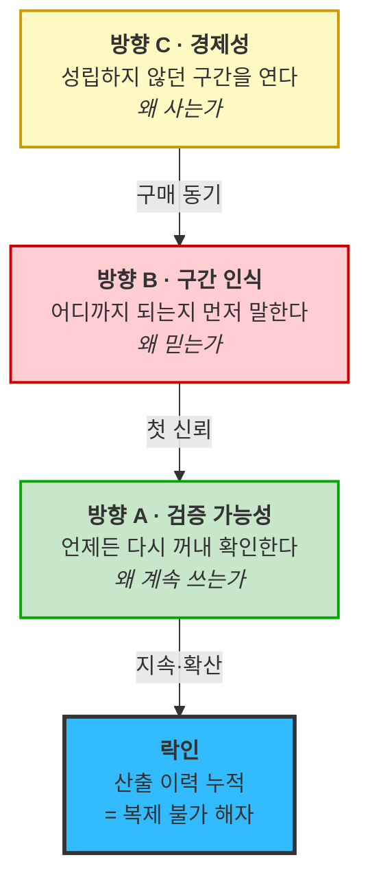

# 제안 — 차별적 가치목표 3방향

**입력**: [경쟁사 11사 가치 선언문](../01_porters-five-forces/09_리서치_경쟁사-가치선언.md) · [VP 정의서](VALUE-PROPOSITION_자산가치평가인프라_claude-opus-5-1m_effort-high.md) · [KSF 6종](../03_ksf/01_분석_자산가치평가-인프라.md) · [Pain 분할 점검](../06_시장기회분석/05_검토_Pain-분할-점검.md)
**출발점**: 창업자가 제시한 네 가치 — **신뢰 · 합리 · 빠름 · 맞춤형**

---

## 1. 먼저 — 네 가치를 경쟁 지형에 놓아보면

**결론부터**: 네 가지 모두 **그대로는 쓸 수 없고**, 각각 **방어 가능한 변형이 하나씩** 있습니다.

| 가치 | 그대로 쓰면 | 왜 | 방어 가능한 변형 |
|---|---|---|---|
| **신뢰** | 🔴 **무의미** | **11사 전부가 신뢰를 판매합니다.** 감정평가=책임귀속 · CF Benchmarks=규제인증 · 부동산원=공적권위 · Kaiko=독립성. "우리는 믿을 만하다"는 **경쟁 언어가 아니라 업계 최소 조건** | **신뢰의 *종류*를 바꾼다** — 권위 기반 → **검증 기반** |
| **합리** | ⚠️ **위험** | 가격으로 읽히면 집니다. **한국부동산원은 무료**이고, 감정평가는 법적 효력까지 줍니다. 싸다는 이유로 사는 시장이 아닙니다 | **경제성이 성립하지 않던 구간을 여는 것** — 가격 인하가 아니라 **단위경제 재정의** |
| **빠름** | ⚠️ **절반만 유효** | **산출 속도는 위생 요인**입니다 — 박선우 *"5초 넘으면 못 씁니다"* 는 차별점이 아니라 **탈락 기준**. 게다가 도입은 6~24개월이라 "빠른 서비스"라는 인상과 충돌 | **고객이 방어·소명하는 시간**을 줄이는 것 — 우리 계산 속도가 아니라 **고객의 확인 시간** |
| **맞춤형** | 🔴 **위험** | 커스터마이징으로 읽히면 **스케일이 죽습니다.** B2B 데이터 인프라에서 고객별 개발은 인건비 사업이 됩니다 | **구간을 아는 것** — 고객 자산을 구간별로 갈라 **어디서 잘하고 어디서 못하는지 먼저 말하는 것** |

> 🔴 **네 가치 중 "신뢰"가 가장 위험합니다.** 유일하게 **모든 경쟁사가 이미 점유**한 단어이고, [빅밸류의 공식 슬로건 *"데이터로 판단의 기준을 만듭니다"*](../01_porters-five-forces/09_리서치_경쟁사-가치선언.md)가 사실상 신뢰 선언입니다. **신뢰를 말하려면 "어떤 신뢰인가"까지 가야** 차별이 됩니다.

### 1-1. 경쟁사가 비워둔 두 칸

11사 선언문을 모아 언어 점유도를 보면 이렇습니다.

| 이미 점유된 언어 | 점유자 |
|---|---|
| 판단의 기준 | **빅밸류** *(공식 슬로건)* |
| 정보 비대칭 해소 | 밸류맵 · 쟁글 |
| 독립적·중립적 | Kaiko |
| 규제 등록 기준가 | CF Benchmarks |
| 가장 넓은 커버리지 | CoStar · 디스코 |
| 국가가 정한 하나의 숫자 | 한국부동산원 |
| 책임지는 사람 | 감정평가법인군 |

| **비어 있는 칸** | 점유자 |
|---|---|
| **① 재현성** — *"그때 그 값을 그대로 다시 꺼낼 수 있다"* | **없음** |
| **② 정직한 미산출** — *"못 낼 때 못 낸다고 말한다"* | **없음** |

**아래 세 방향은 이 두 빈칸 위에 세웠습니다.**

---

## 2. 방향 A — 검증 가능한 신뢰

> ## **"우리 값을 믿으라고 하지 않습니다. 언제든 다시 꺼내 직접 확인하십시오."**
>
> **모든 산출값에 근거·방법론 버전·산출 시점을 함께 남깁니다. 2년 전 그 시점의 값도 그때의 방법론 그대로 재현합니다.**

### 2-1. 이 방향이 겨냥하는 것

**신뢰의 종류를 바꿉니다.** 권위 게임에서는 감정평가·CF Benchmarks·부동산원을 못 이깁니다. 그 게임을 하지 않는 것이 전략입니다.

| | 경쟁사 *(권위 기반)* | **우리 *(검증 기반)*** |
|---|---|---|
| 신뢰의 근거 | *"유자격자가 서명했다"* · *"규제기관이 인정했다"* | **"직접 확인해보라"** |
| 방법론 | 비공개 · 평가사 재량 | **전면 공개** |
| 사후 검증 | 어렵다 | **as-of 재현 + 백테스트 성적 공개** |
| 틀렸을 때 | 사후에 드러남 | **미리 신뢰구간으로 표시** |

### 2-2. 근거

| 근거 | 내용 |
|---|---|
| **클러스터 1위** | *"과거 시점을 그대로 재현하는 상태"* — **3개 페르소나가 독립적으로 요구**(조민경·남기훈·감사 소급). 클러스터 DOS **0.770으로 전 항목 최고** |
| **최상위 AOS** | JM-2 **4.0**(공동 1위). *"as-of 조회, 그거 하나 때문에 오늘 시간을 낸 겁니다"* |
| **정량 Outcome** | 감독 소명 **2개월 → 1일** |
| **경쟁 공백** | 11사 중 재현성을 가치로 내세운 곳 **0곳**. [산출물 비교표에서 우리만 있는 칸](../01_porters-five-forces/09_리서치_경쟁사-가치선언.md) |
| **KSF 정합** | **K2(재현성)· K3(설명 가능성)** 을 정면으로 담당 |
| **시간 해자** | 방법론은 복제되지만 **5년치 산출 이력은 복제 불가**. [3년 뒤 K3가 위생 요인으로 내려앉을 때 남는 유일한 축](../03_ksf/01_분석_자산가치평가-인프라.md) |

### 2-3. 위험

> ⚠️ **인증 없이 검증만 말하면 공허합니다.** [K1(인증·수용 이력)이 우리 최대 갭](../03_ksf/01_분석_자산가치평가-인프라.md)이고, **감사인이 우리 값을 안 받아주면 이 방향 전체가 무너집니다.** 그래서 [조현우 인터뷰가 다음 1순위](../07_jtbd/01_사례_인터뷰-문항지.md)입니다.
>
> 또한 **"감정평가 수준의 공신력이 있다"고 말하는 순간 이 방향이 자멸합니다.** 오히려 *"공시·담보 설정용 아님"* 을 명시하는 편이 검증 기반 신뢰를 지킵니다.

---

## 3. 방향 B — 구간을 아는 평가

> ## **"당신의 자산 100개 중 78개는 우리가 냅니다. 나머지 22개는 왜 못 내는지 먼저 말씀드립니다."**
>
> **계약 전에 커버리지를 진단하고, 자산·종목·지역 구간별로 우리가 어디까지 신뢰할 만한지 등급으로 표시합니다.**

### 3-1. 이것이 "맞춤형"의 방어 가능한 형태입니다

**커스터마이징이 아니라 구간 인식(segment-aware)입니다.** 고객마다 다른 것을 만들어주는 게 아니라, **같은 제품이 고객의 구간을 알아보고 다르게 말합니다.**

| | 커스터마이징 *(위험)* | **구간 인식 *(제안)*** |
|---|---|---|
| 무엇이 다른가 | **제품이** 고객마다 다름 | **설명이** 구간마다 다름 |
| 원가 구조 | 고객 수 × 개발 공수 | **한 번 만들면 전 고객** |
| 스케일 | ✕ 인건비 사업 | ⭕ |

### 3-2. 근거 — 이 방향의 근거가 가장 최근에 가장 강해졌습니다

| 근거 | 내용 |
|---|---|
| **최대 오판 항목** | MK-3(커버리지 사전 진단) 가설 AOS 2.4 → 실제 **4.0**. *"그게 제일 중요합니다. 지금은 **계약하고 나서야** 안 되는 걸 알거든요"* |
| **정직성이 신뢰의 출발점** | 문경아 — *"산출 불가를 보고 **안심**됐습니다. 그때부터 **나머지 숫자도 믿기 시작**했습니다"* |
| **구조적 발견** | [Pain 18종 중 **4종(22%)이 구간별로 만족도가 갈렸습니다**](../06_시장기회분석/05_검토_Pain-분할-점검.md) — 종목 유동성 · 자산 규모 · 딜 규모 · 지역 |
| **고객이 이미 구간으로 말합니다** | 박선우 *"메이저는 2%도 이상하고 알트는 15%도 정상"* · 남기훈 *"전국 평균 12%는 안 본다, **지방만 떼서** 15% 이하면 본다"* · 백서현 *"거래금액 기준 아래 구간이 **훨씬 많다**"* |
| **경쟁 공백** | 🔴 **11사 전부가 전 구간에 단일 값을 냅니다.** 정직한 미산출을 가치로 내세운 곳 **0곳** |

> 🔴 **경쟁사가 안 하는 이유가 "가치가 없어서"가 아니라 "불리해 보여서"입니다.** 커버리지 한계를 공개하는 것은 **자백처럼 보입니다.** 그런데 고객은 반대로 반응했습니다 — 정직한 미산출이 **다른 값들의 신뢰를 담보**했습니다. **이 역설이 이 방향의 방어력입니다.**

### 3-3. 위험 — 임계값이 있습니다

> ⚠️ **산출 불가가 30%를 넘으면 해지 사유가 됩니다.** 문경아 — *"**절반 이상이 산출 불가면 해지합니다.** 정직한 건 좋은데 그걸로 제 일이 줄지는 않으니까요. 근데 30% 정도면 유지합니다."*
>
> **정직성은 커버리지가 일정 수준 이상일 때만 미덕입니다.** 이 방향을 택하면 **"산출 불가 ≤ 30%"가 제품 로드맵의 정량 목표**가 됩니다.
>
> 그리고 [KSF 관점에서 이 방향은 필수 요건이 아니라 차별화 무기](../03_ksf/01_분석_자산가치평가-인프라.md)입니다 — 없어도 탈락하지 않습니다. **K1~K6을 확보하기 전에 이것부터 하면 계약 자체가 안 됩니다.**

---

## 4. 방향 C — 성립하지 않던 구간을 여는 경제성

> ## **"감정평가 단가로는 불가능했던 주기와 건수를 성립시킵니다."**
>
> **연 1~2회 감정평가와 아무것도 안 하는 것 사이의 빈 구간 — 자산 수백 개를 매월·매분기 다시 재는 일을 경제적으로 가능하게 만듭니다.**

### 4-1. 이것이 "합리"의 방어 가능한 형태입니다

**가격 경쟁이 아니라 구간 개방입니다.** 같은 일을 싸게 하는 게 아니라, **비싸서 아무도 안 하던 일**을 하게 만듭니다.

| | 가격 경쟁 *(위험)* | **구간 개방 *(제안)*** |
|---|---|---|
| 비교 대상 | 감정평가 수수료 · 무료 공공데이터 | **"지금 아예 안 하고 있는 것"** |
| 우리 위치 | 싼 대체재 | **새 구간의 유일한 공급자** |
| 지면 | 무료(부동산원)에게 짐 | **비교 대상이 없음** |

### 4-2. 근거 — 미대응 구간이 실제로 큽니다

| 페르소나 | 지금 안 하고 있는 것 | 비중 |
|---|---|---|
| **김도현** | 자산 130개 중 **40개만** 손대고 나머지 이월 | **69% 미대응** |
| **백서현** | 감정평가 발주 기준 **아래 구간** | *"훨씬 많다"* |
| **남기훈** | 240건 중 매칭 안 되는 **60~70건**을 감으로 처리 | **25~29%** |
| **문경아** | 사례 못 찾아 원가법·이월 | 포트폴리오 대부분 |
| **조민경** | 인력 한정으로 **소화 못 하는 물량** | 미확인 |

> 💡 **[Pain 분할 점검이 이 방향을 수치로 뒷받침합니다](../06_시장기회분석/05_검토_Pain-분할-점검.md).** KD-1을 분할하니 **대형 40개는 이미 대응 중(AOS 1.6)이고 소형 90개가 무대응(AOS 2.4)** 이었습니다. **기회는 "더 잘하기"가 아니라 "안 하던 것 하기"에 있습니다.**

| 근거 | 내용 |
|---|---|
| **지불의사 상한 확인** | 김도현 감정평가 **연 8,000만 원** — *"감정평가보다 싸야 의미가 있어요"* |
| **정량 Outcome** | 갱신 자산 비율 **31% → 100%** · 실사 재검토 **240건 → 20~30건** |
| **단가 구조 우위** | [자산 수백 개 월·분기 갱신은 감정평가 단가로 성립 불가](../05_페르소나/07_검토_감정평가법인-경쟁력.md) — **우리가 이기는 자리로 이미 확인됨** |

### 4-3. 위험

> ⚠️ **"싸다"로 읽히면 집니다.** 한국부동산원은 **무료**입니다. *"그냥 공공데이터 쓰면 안 되나"* 에 대한 답이 **"우리가 더 싸다"** 면 계약이 안 됩니다. 답은 **"원천 데이터 ≠ 평가값"** 이어야 합니다.
>
> 또한 **감정평가 대체로 포지셔닝하는 순간 수수료 시장에 갇힙니다** — 그 시장에서는 법적 효력을 가진 쪽이 이깁니다. **"사이를 채운다"와 "대체한다"는 완전히 다른 문장**입니다.

---

## 5. 세 방향의 관계 — 하나를 고르는 게 아닙니다

| 방향 | 답하는 질문 | 고객 여정 위치 | 시간축 |
|---|---|---|---|
| **C 경제성** | **왜 사는가** | S1~S2 *(트리거·탐색)* | 계약 전 |
| **B 구간 인식** | **왜 믿는가** | **S3 *(파일럿 — 최대 이탈 지대)*** | 계약 직전 |
| **A 검증 가능성** | **왜 계속 쓰는가** | S7~S8 *(운영·갱신)* | 계약 후 |

> 🔴 **셋은 경쟁 관계가 아니라 순서입니다.** C가 없으면 만나주지 않고, B가 없으면 시연에서 죽고, A가 없으면 감사에서 죽습니다. **[Pain 클러스터 상위 3종이 정확히 이 셋에 하나씩 배분](../06_시장기회분석/01_사례_pain-list.md)됩니다.**

### 5-1. 그럼 무엇을 대표 선언으로 세우는가

**대외 선언은 A(검증 가능성)를 권합니다.**

| 이유 | 근거 |
|---|---|
| **가장 큰 빈칸** | 11사 중 0곳. 클러스터 DOS 0.770 최고 |
| **시간이 해자가 되는 유일한 축** | 방법론은 복제되나 산출 이력은 복제 불가 |
| **B·C를 포함할 수 있음** | *"확인할 수 있다"* 안에 *"어디까지 되는지 안다"*(B)가 들어감 |
| **3년 뒤에도 유효** | [K3(설명 가능성)는 위생 요인으로 내려앉지만 K2(재현성)는 필수 유지](../03_ksf/01_분석_자산가치평가-인프라.md) |

**단 세일즈 첫 문장은 C입니다.** 선언과 첫 마디는 달라도 됩니다 — *"지금 안 재고 넘어가는 자산이 몇 개입니까"* 로 시작해서 *"그 값을 나중에 어떻게 방어하실 겁니까"* 로 끝내는 순서입니다.

---

## 6. 네 가치를 다시 쓰면

| 창업자 원안 | **제안 문장** | 방향 |
|---|---|---|
| **신뢰** | *"믿어달라고 하지 않고 **확인하게 한다**"* | **A** |
| **합리** | *"싸게 하는 게 아니라 **안 하던 걸 하게 한다**"* | **C** |
| **빠름** | *"우리가 빨리 계산하는 게 아니라 **당신이 빨리 방어한다**"* | **A** *(2개월→1일)* |
| **맞춤형** | *"고객마다 다르게 만드는 게 아니라 **구간마다 다르게 말한다**"* | **B** |

> 💡 **네 가치가 셋으로 수렴합니다.** *빠름*이 독립 축이 아니라 **A의 결과 지표**가 되기 때문입니다. 이것은 축소가 아니라 **정리**입니다 — 빠름을 독립 선언으로 세우면 *"5초 이내 응답"* 같은 위생 요인과 뒤섞여 **차별점이 희석**됩니다.

---

## 7. 이 제안이 다루지 않는 것 — 반드시 함께 볼 것

**세 방향 모두 "고객이 원하는 것"에서 나왔습니다.** [KSF 분석](../03_ksf/01_분석_자산가치평가-인프라.md)은 **고객이 말하지 않는 필수 요건 둘**을 지적합니다.

| 미포함 | 왜 여기 없나 | 그런데 왜 필수인가 |
|---|---|---|
| **K5 운영 신뢰성** *(SLA·폴백·가동률)* | 해당 Pain이 **AOS 1.0 최하위** — 거래소가 지금 겪지 않는 문제 | *"그쪽이 죽으면 우리가 같이 죽는다"* — **박선우 Anxieties 1·2번 전부**. 없으면 나머지 점수가 의미 없음 |
| **K6 데이터 조달 안정성** | **Pain List에 항목 자체가 없음** — 우리 공급 구조는 고객 여정에 안 나타남 | 공급이 끊기면 제품이 성립 안 함. **거래소가 최대 고객이자 최대 공급자** |

> 🔴 **가치목표는 마케팅 문장이 아니라 자원 배분 기준입니다.** 세 방향에만 투자하고 K5·K6을 비우면 **팔리기 전에 무너집니다.** 대외 선언에는 안 들어가도 **로드맵에는 반드시 들어가야** 합니다.

---

> ⚠️ **검증 상태**: 이 제안의 고객 근거는 [AI 생성 가상 응답지](../07_jtbd/)에서 나왔으므로 **실제 고객 발언이 아닙니다.** 반면 **경쟁사 11사 가치 선언 분석은 [검증된 공개 출처](../01_porters-five-forces/09_리서치_경쟁사-가치선언.md)** 이며, *"재현성·정직한 미산출을 내세운 경쟁사가 0곳"* 이라는 판단은 응답지의 사실성과 무관하게 유효합니다.
>
> **가장 먼저 검증할 것**: 방향 A의 전제인 **"감사인이 우리 값을 근거로 받아들이는가"**([조현우 인터뷰 C6](../07_jtbd/01_사례_인터뷰-문항지.md)). 부정이면 **A를 대표 선언으로 세울 수 없고**, C(경제성)를 앞세우고 A는 부가 가치로 내려야 합니다.
