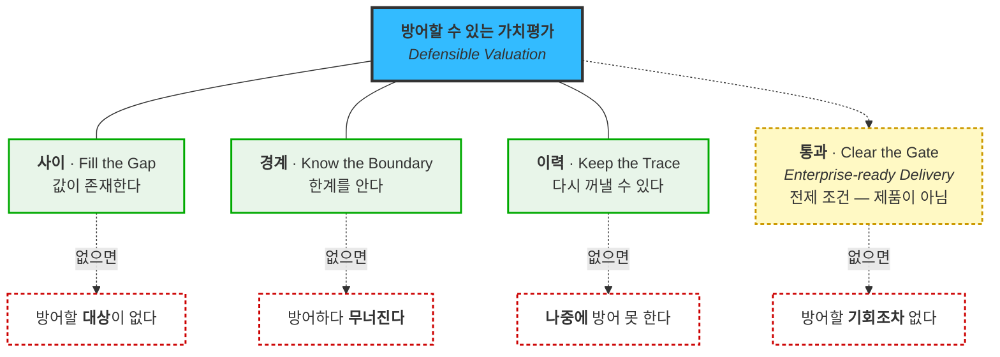
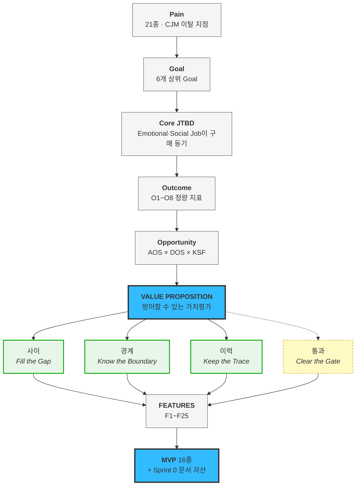

# IVI — Value Proposition Statement v1.0 (Merged)

> **Institutional Valuation Infrastructure** — 상업용 부동산 · 디지털 자산 · 조각투자/토큰증권(STO) 기초자산의 시장가치를 지속 산출해 금융기관 시스템에 공급하는 데이터 인프라

---

## 0. 문서 메타데이터

| 항목 | 내용 |
|---|---|
| **문서 성격** | 두 산출물의 **합본** — [GPT-5.6 High](../07_Value_Proposition_GPT-5.6_High.md) 의 구조·표준 프레임워크 + [Claude Opus 5 High](VALUE-PROPOSITION_자산가치평가인프라_claude-opus-5-1m_effort-high.md) 의 정량 근거·경쟁 분석 |
| **병합 근거** | [03_비교_VP-모델별-산출물.md](03_비교_VP-모델별-산출물.md) |
| 버전 | **v1.0** |
| 작성일 | 2026-08-14 |
| 논리 순서 | `Pain → Goal → Job → Outcome → Alternative → Value → Feature → MVP` *(GPT 문서 §22 원칙 채택)* |
| Pain ID 체계 | **저장소 정본 유지** — `KD·PS·JM·MK·NG·BS·IS` |
| Feature 번호 | **F1~F25** *(Claude 문서 정본 유지)* |
| 페르소나 | **[최종 로스터 11종](../05_페르소나/02_사례_자산가치평가_스펙트럼-종합.md)** |
| 핵심 수식 | `AOS = I × (1 − S/5)` · `DOS = (I − S) × Market Relevance` |

### 🚨 검증 상태 — 먼저 읽으십시오

**이 문서의 정량 근거는 강도가 셋으로 갈립니다. 인용 전 반드시 확인하십시오.**

| 강도 | 뜻 | 대표 항목 |
|:---:|---|---|
| ✅ **검증** | 공개 출처 *(경쟁사 자료·제도·통계)* | 경쟁 11사 · 전자증권법 시행일 · 감정평가 시장 규모 |
| 🔵 **도출** | 저장소 내 계산 *(입력이 가설 점수)* | AOS·DOS · 클러스터 · 분할 점검 |
| 🟡 **가설** | **AI 생성 가상 응답지** — 실제 고객 발언 아님 | 인터뷰 인용문 전부 · Outcome 정량값 · WTP |

> 🔴 **"경쟁사가 이걸 안 한다"는 ✅이고, "고객이 이걸 원한다"는 🟡입니다.**
> **차별성은 증명됐고 필요성은 미확인**입니다 — 이 비대칭이 이 문서에서 가장 정직해야 하는 지점입니다.

---

# 1. Executive Summary

## 1.1 고객이 겪는 문제는 "값이 없다"가 아닙니다

| # | 문제 | 대표 Pain |
|:---:|---|---|
| 1 | 평가와 평가 **사이의 가치 공백** | KD-1 |
| 2 | 산출값의 **근거·재현성 부재** | MK-1 · JM-2 |
| 3 | 실시간 데이터의 **지연·결측·장애** | PS-2 · PS-3 |
| 4 | 금융권 **보안·망분리·준법 장벽** | KD-2 · JM-3 |
| 5 | 특수자산의 **평가 가능성 판단 불가** | MK-2 · MK-3 |
| 6 | 감사·감독 앞에서 **설명 불가** | KD-3 · BS-2 |

## 1.2 그래서 고객이 사는 것은 정확도가 아닙니다

🟡 **JTBD 인터뷰 6인 중 5인이 정확도가 아니라 책임 회피·외부 권위를 말했습니다.**

> *"감사인 질문에 화면 하나 띄우면 **제가 방어할 일이 없어집니다**"* — 김도현
> *"**제 이름 말고 다른 이름이 들어간** 근거요"* — 백서현

🔵 [AOS 상위 항목에 "평가값 정확도"가 하나도 없다](../06_시장기회분석/02_사례_aos-scoring.md)는 계산 결과가 같은 사실을 뒷받침합니다.

## 1.3 통합 가치 선언

> # **방어할 수 있는 가치평가**
> ### *Defensible Valuation*
>
> **값을 팔지 않습니다. 그 값을 혼자 방어하지 않아도 되는 상태로 만들어 팝니다.**

---

# 2. 페르소나 · CJM 기반 핵심 문제 (Pain / Needs)

**Pain은 [고객 여정지도](../05_페르소나/03_사례_고객여정지도.md)의 `이탈 지점` 열에서만 추출했습니다** — 사람이 실제로 멈추는 자리가 곧 Pain이라는 규칙입니다.

## 2.1 페르소나 로스터 — 11종

| 페르소나 | 유형 | 제품 축 | 진입 | 전환 판정 🟡 |
|---|---|---|:---:|:---:|
| **박선우** 거래소 시장감시 | 🔵 핵심 | 디지털 | **1** | ⚠️ 동률 (9=9) |
| **백서현** 회계법인 딜 자문 | 🔵 핵심 **(쐐기)** | CRE·NPL | **1** | ✅ 예 (8>6) |
| **김도현** AMC 리츠 운용역 | 🔵 핵심 | CRE | 3 | ❌ 아니오 (8<9) |
| **조민경** 은행 담보·리스크 | 🟢 확장 | CRE | 4 | ✅ 조건부 |
| **문경아** 특수자산 운용역 | 🔴 극단 | CRE | 2 | ✅ 예 (9>5) · **최강** |
| **남기훈** NPL 투자심사역 | 🟢 확장(간접) | CRE | *제외* | ❌ 아니오 |
| **조현우** 회계법인 감사·검증 | 🟢 확장 | CRE | *미인터뷰* | — |
| **서태영** STO·RWA 기획 | 🟢 확장 | **STO** | *병행* | — |
| **임성호** 망분리 실무자 | ⚪ 비활성 *(구조)* | CRE | — | 전환 조건 관리 |
| **유가람** 감정평가사 | ⚪ 비활성 *(인식)* | 전 축 | — | 전환 시 **채널** |
| **하승우** 은행 내부 평가조직 | ⚪ 비활성 *(고용 방어)* | CRE | — | 게이트키퍼 |

> 🔴 **세그먼트가 클수록 전환이 어렵습니다.** 김도현(SOM MR 0.202)은 전환 실패이고 문경아(0.061)가 최강입니다 — **DOS는 큰 세그먼트를 올리고 전환 동인은 내립니다.** 두 지표가 구조적으로 반대 방향이므로 **DOS 순위를 진입 순서로 쓰면 안 됩니다.**

## 2.2 페르소나별 Pain → Needs

### 🔵 김도현 — AMC 리츠 운용역

| ID | Pain *(고객의 말)* | Needs *(해결된 상태)* | CJM | AOS 🔵 |
|---|---|---|:---:|:---:|
| **KD-1** | 분기 공시에 반년 전 평가액을 그대로 넣는다. 130개 중 **40개만 손대고 90개는 이월** | 마감 시점에 자산 전량이 갱신돼 있는 상태 | S1 | 1.8 *(KD-1b 2.4)* |
| **KD-2** | 보안·준법 심사에서 **문서 미비로 반려**. 반려된 뒤로 아예 시도를 안 한다 | 챙기지 않아도 심사 자료가 준비돼 통과되는 상태 | S5 | **3.2** |
| **KD-3** | 감사인이 방법론을 문제 삼으면 **쓰던 것도 중단** | 감사인 질문에 문서 한 장으로 답하는 상태 | S7 | **3.0** |

### 🔵 박선우 — 거래소 시장감시

| ID | Pain | Needs | CJM | AOS 🔵 |
|---|---|---|:---:|:---:|
| **PS-1** | 자사 체결가가 시장을 대표한다고 말할 수 없다. *(a 메이저 / **b 알트·저유동성**)* | 괴리를 실시간으로 설명할 수 있는 상태 | S1 | 2.0 / **4.0** |
| **PS-3** | 신규 상장·저유동성 구간에 **기준선을 만들 수 없다.** 연 20건+ | "지금은 기준가를 낼 수 없다"를 시스템이 선언 | S3 | **4.0** |
| **PS-2** | 상시 결합이라 **공급자 장애가 곧 우리 장애** | 장애가 전파되지 않거나 우리가 먼저 아는 상태 | S7 | 1.0 ⚠️ |

> ⚠️ **PS-2는 AOS 최하위인데 [KSF 필수 요건(K5)](../03_ksf/01_분석_자산가치평가-인프라.md)입니다** — 거래소가 지금 겪지 않는 문제라 점수가 낮을 뿐, **우리가 들어가면서 새로 만드는 리스크**입니다. §10-3 참조.

### 🟢 조민경 — 은행 담보·리스크

| ID | Pain | Needs | CJM | AOS 🔵 |
|---|---|---|:---:|:---:|
| **JM-2** | *"2년 전 그 시점에 당신 모델은 뭐라 했나"* 를 확인할 방법이 없다. **소명에 두 달** | 과거 임의 시점의 값과 방법론을 재현하는 상태 | S3 | **4.0** |
| **JM-1** | 자체 감정평가가 담보가를 높게 잡는다는 지적. 반증할 독립 데이터 없음 | 외부 독립 값으로 보완·반박할 수 있는 상태 | S1 | 2.4 |
| **JM-3** | 위탁·보안 이중 심사. **API 전용이면 시작도 못 한다** | 회선을 열지 않고 심사를 통과하는 상태 | S5 | 2.4 |

### 🔴 문경아 — 특수자산 운용역

| ID | Pain | Needs | CJM | AOS 🔵 |
|---|---|---|:---:|:---:|
| **MK-1** | **근거 없이 숫자만 나온다.** *300km 떨어진 사례였다 — 그때 바로 해지* | 값과 사례 건수·충분성 등급이 같은 화면에 | S3-b | **4.0** |
| **MK-2** | 유사 거래 **2년간 0건** — 평가 지연이 아니라 **평가 불가** | 산출 불가를 이유와 함께 받는 상태 | S3-a | **4.0** |
| **MK-3** | **계약하고 나서야** 안 되는 걸 안다 | 계약 전에 "100개 중 78개 가능"을 아는 상태 | S3-c | **4.0** |

> 🔴 **MK-3은 가설 2.4 → 실제 4.0으로 이 프로젝트 최대 오판이었습니다.** 기능 요구가 아니라 **계약 전 신뢰 문제**였습니다.

### 🔵 백서현 — 회계법인 딜 자문 *(쐐기)*

| ID | Pain | Needs | CJM | AOS 🔵 |
|---|---|---|:---:|:---:|
| **BS-2** | QRM 심사에서 **출처 신뢰성이 인정 안 되면 인용 자체가 불가** | 법인 표준 인용 출처로 등록된 상태 | S4 | **3.0** |
| **BS-1** | 딜마다 근거를 새로 만든다. *(a 감정평가 의무 / **b 그 아래 — 훨씬 많음**)* | 딜이 바뀌어도 같은 출처를 재사용하는 상태 | S2 | 0.6 / **2.4** |
| **BS-3** | 고객사가 이의를 제기하면 그 딜 이후 중단 | 방법론 문서로 답할 수 있는 상태 | S7 | 1.2 |

### 🟢 남기훈 · ⚪ 임성호 *(요약)*

| ID | Pain | AOS 🔵 | 처분 |
|---|---|:---:|---|
| **NG-1b** | 지방·비주거는 사내 DB 오차 20%+ *(서울·경기는 **과잉충족 0.0**)* | 2.4 | 간접 채널 |
| NG-2 · NG-3 | 실사 마감 · 소급 대조 | 2.0 · 1.8 | 후순위 |
| **IS-1~3** ⚠️ | 내부망에서 외부 API 호출 불가 — **제품을 보지도 못함** | *(제외)* | **전환 조건으로 관리** |

> ⚠️ **IS 계열은 AOS를 계산하지 않습니다.** 쓰지 않는 사람에게 만족도를 물으면 0에 수렴해 순위가 뒤집힙니다 — **"해결 안 됨"이 아니라 "시도조차 없었음"** 이기 때문입니다.

## 2.3 CJM 이탈이 몰리는 곳

| 순위 | 구간 | 누구 | 제품 성능 문제인가 |
|:---:|---|---|:---:|
| 1 | **S5 보안·준법 심사** | 김도현·조민경 | **✕** |
| 2 | S3-b 근거 확인 | 문경아 | △ |
| 3 | **S2 아키텍처 확인** | 임성호 | **✕** |
| 4 | **S2 Build vs Buy** | 남기훈 | **✕** |
| 5 | S7 첫 장애 | 박선우 | △ |
| 6 | **S4 QRM 심사** | 백서현 | **✕** |
| 7 | S3 백테스트 | 조민경·남기훈 | ⭕ |
| 8 | S6 마감·매핑 | 남기훈·김도현 | △ |

> 🔴 **여덟 중 넷이 제품 성능과 무관합니다.** 값이 아무리 정확해도 **문서·납품 형태·프레이밍**에서 죽습니다.

## 2.4 Pain 클러스터 — 독립적으로 반복된 요구

| 클러스터 | 반복 | 해당 Pain | 클러스터 DOS 🔵 |
|---|:---:|---|---:|
| **과거 시점을 그대로 재현** | **3회** | JM-2 · NG-3 · *(감사 소급)* | **0.770** *(최고)* |
| **근거를 함께 제시** | **3회** | KD-3 · MK-1 · BS-2 | 0.502 |
| **회선을 열지 않고 받기** | **3회** | JM-3 · IS-1 · IS-2 | 0.654+ |
| 못 낼 때 못 낸다고 말하기 | 2회 | MK-2 · PS-3 | — |
| 대체하지 않고 대조하기 | **3회** ▲ | NG-1b · **조현우** · **하승우** | — |

> 💡 **상위 세 클러스터가 전부 "평가값의 정확도"가 아닙니다** — 재현성 · 설명 가능성 · 전달 경로입니다.

---

# 3. 고객 Goal 통합

| 상위 Goal | 페르소나 | 핵심 고객가치 *(영문)* |
|---|---|---|
| 신뢰 가능한 현재가치 기반 의사결정 | 김도현 | **Timely + Reliable Valuation** |
| 실시간 시장 감시의 연속성 | 박선우 | **Real-time Reliability** |
| 평가 결과의 설명·재현 가능성 | 조민경 | **Explainability + Auditability** |
| 불완전한 데이터에서 평가 가능성 판단 | 문경아 | **Coverage + Confidence** |
| 인용 가능한 독립 출처 확보 | 백서현 | **Citable Independence** |
| 보안환경에서 데이터 활용 | 임성호 | **Secure Deployment** |

### 통합 Goal

> **"자산의 현재가치를 필요한 시점에 확인하고, 그 결과를 신뢰·검증·설명할 수 있으며, 자신의 업무환경에서 안전하게 활용하고 싶다."**

---

# 4. JTBD

## 4.1 Core JTBD

> **When** 자산가치를 판단하거나 감사·감독·투자심의에 보고해야 하는 상황에서
> **I want to** 현재 시장을 반영한 가치와 **그 값을 만든 근거·시점**을 함께 확보하고
> **So I can** 그 숫자를 **내 이름으로 방어하지 않아도 되는 상태**에서 의사결정을 내릴 수 있다.

## 4.2 Job 계층 — 구매 동기는 기능적 Job이 아닙니다

| Job 유형 | 내용 | 🟡 근거 발언 |
|---|---|---|
| **Functional** | 현재가치 확인 · 괴리 검증 · 근거 확인 · 과거 재현 · 평가 가능성 판단 · 시스템 적재 | — |
| **Emotional** | **"내가 총대를 메지 않는다"** | *"제가 방어할 일이 없어집니다"* |
| **Social** | **"우리가 만든 값이 아니다"를 증명** | *"제 이름 말고 다른 이름이 들어간 근거"* |

> 🔴 **Emotional·Social Job이 실제 구매 동기입니다.** 이것이 *"감정평가법인이 파는 것은 값이 아니라 면책"* 이라는 [경쟁력 검토 결론](../05_페르소나/07_검토_감정평가법인-경쟁력.md)과 같은 축입니다.

---

# 5. 고객이 원하는 Outcome

## 5.1 정량 지표 🟡

**전부 인터뷰 발언에서 나온 값입니다** — 우리가 설정한 목표가 아닙니다.

| # | Outcome | As-Is | To-Be | 측정 | 출처 |
|:---:|---|---|---|---|---|
| **O1** | 감독 소명 소요 | **2개월** | **1일** | 소급 요구 → 제출 완료 | 조민경 |
| **O2** | 실사 재검토 건수 | 240건 | **20~30건** | 20%+ 괴리 건만 | 남기훈 |
| **O3** | *"사례 없음"* 확인 | 반나절 | **30초** | 조회 → 산출불가 반환 | 문경아 |
| **O4** | 분기 갱신 자산 비율 | **31%** | **100%** | 갱신 / 전체 | 김도현 |
| **O5** | 장부값 기준일 지연 | 7~8개월 | **≤1개월** | 마감일 − 기준일 | 김도현 |
| **O6** | 아침 수동 대조 | 30~40분/일 | **0분** | 알람 수신 전환 | 박선우 |
| **O7** | 감사인 설명 | 30분 | **5분** | 질의 → 자료 제시 | 문경아 |
| **O8** | 딜당 근거 확보 | 4~6주 중 최장 | **즉시 재사용** | 착수 → 근거표 완성 | 백서현 |

## 5.2 KPI 정의 *(GPT 문서 §5 체계 채택)*

| KPI | 방향 | 대응 Outcome |
|---|:---:|---|
| Valuation Lead Time | ↓ | O3 · O5 |
| Valuation Gap | ↓ | O4 · O5 |
| Verification Time | ↓ | O1 · O7 |
| Data Latency / Missing Rate | ↓ | O6 |
| Evidence Traceability | ↑ | O7 · O8 |
| Reproducibility | ↑ | O1 |
| **Coverage Forecast Accuracy** | ↑ | §11-3 *(신규)* |
| Confidence Visibility | ↑ | O3 |
| Security / Integration Lead Time | ↓ | — |

## 5.3 수용 임계값 — 못 넘으면 Outcome이 무효 🟡

| 임계값 | 값 | 못 넘으면 |
|---|---|---|
| **데이터 지연** | **≤ 5초** | *"5초 넘으면 저희 감시엔 못 씁니다"* |
| **가동률 / 장애 통보** | **99.9% / 5분 + 폴백** | 실시간 연동 불가 |
| **백테스트 기간** | **3년** *(5년 권장)* | 검사 주기를 못 덮음 |
| **NPL 정확도** | **지방만 오차 ≤ 15%** | 전국 평균은 무의미 |
| **미산출 시 대체값** | **폴백 필수** | *"빈칸만 오면 감시가 멈춥니다"* |
| 산출 불가 비율 | ≤ 30% *(참고)* | → §11-3에서 **제품 KPI 아님**으로 재판정 |

> 🔴 **미산출 요구가 페르소나별로 반대입니다** — 문경아는 *"없다고 말해주면 안심"* 인데 박선우는 *"뭘 대신 볼지 같이 줘야"* 입니다. **사람이 보는 화면과 시스템이 받는 피드를 분리**해야 합니다.

## 5.4 지불의사 (WTP) 🟡

| 페르소나 | 현재 지출 / 견적 | 가격표 정합 |
|---|---|---|
| **박선우** | 해외 벤더 견적 **연 1.5~2억** *(원화 미반영으로 미도입)* | Exchange 1.2~2.4억 ✅ |
| **김도현** | 감정평가 **연 8,000만** · *"감정평가보다 싸야"* | Professional 4,800만~8,400만 ✅ |
| **남기훈** | **연 2~3천** ⚠️ | SAM 가정(8,000만)의 **1/3** |
| 조민경 | 참고용 부서장 전결 / 산정 반영 **규정 개정 1년+** | 2단계 진입 필요 |
| 백서현 | QRM 등록 시 **법인 전체 사용** | 팀→법인 확장 구조 |

> 💡 **6인 중 3인의 답이 금액이 아니라 조건이었습니다** — 규정 근거 / 커버리지 비율 / 인증 절차. **규제 산업에서는 "얼마면 사겠는가"보다 "무엇이 있으면 살 수 있는가"가 결정적입니다.**

---

# 6. 기존 대안 (Competitor / Substitute)

## 6.1 대안은 네 계층이고 대부분 경쟁 제품이 아닙니다

| 계층 | 대안 | 위협 | 누구의 대안 |
|---|---|:---:|---|
| **① 현상 유지** | 엑셀 롤포워드 · 전화 · 아무것도 안 함 | ★★★★★ | **전원** |
| **② 제도적 대체재** | 감정평가서 *(법적 효력 + 품의 통과 용이)* | ★★★★☆ | 김도현·조민경·백서현 |
| **③ 고객 내재화** | 사내 DB · 자체 감평 조직 · 자사 지수 | ★★★★☆ | 남기훈·조민경·박선우 |
| **④ 상용 경쟁 제품** | 해외 인덱스 벤더 · 국내 AI 시세 | ★★★☆☆ | **박선우만 정면** |

🟡 [페르소나 대체 솔루션 12종 중 경쟁 제품은 0개](../05_페르소나/01_사례_자산가치평가.md)였습니다 — 전부 엑셀·전화·내부 규정입니다.

## 6.2 주요 경쟁사 ✅ *(공개 출처 검증)*

| 축 | 사업자 | 규모 | 도출된 가치 선언 |
|---|---|---|---|
| **제도** | 한국부동산원 | 공시가격·국가통계 전담 | *"국가가 말하는 하나의 숫자를 무료로"* |
| | 대형 감정평가법인군 | 업계 **1조 1,629억**(2023) | *"값이 아니라 책임지는 사람을 판다"* |
| **국내 데이터** | **빅밸류** | 금융위 **지정대리인** | ***"데이터로 판단의 기준을 만듭니다"*** *(공식)* |
| | 밸류맵·디스코 | 실거래 3,000만 건 | *"정제 기술을 특허로 지킨다"* |
| **글로벌** | CoStar | FY2025 **32억 달러** · 구독 95% | *"가장 먼저 켜는 화면이 된다"* |
| | Altus | 소프트웨어 ARR **1.98억 달러** | *"문법을 제공한다. 숫자는 당신이"* |
| **디지털** | **CF Benchmarks** | BRR이 **1,000억 달러+** 기준 · FCA 등록 | *"규제기관이 인정한 기준가만이 기준가다"* |
| | Kaiko | 누적 투자 **7,700만 달러** | *"우리는 어느 거래소 편도 아니다"* |
| | 쟁글 | 시리즈B **170억** · 발행사 3,000+ | *"법이 만들기 전에 공시를 만든다"* |
| **STO** | 증권사 진영 | 미래에셋 → 코빗 **97.7%** 인수 | *"한 앱에서. 상품은 나중에"* |
| | 예탁결제원·협의체 | 전자증권법 **2027.2.4 시행** | *"무엇이 객관적 가치평가인지 정의한다"* |

> 🔴 **1세대 부동산 조각투자가 소멸했습니다** — 카사(2025년 말 매출 5,355만·순손실 61억) · 펀블 · 에이판다. 사유는 **투자중개업 인가 미취득**입니다. **우리는 인가가 필요 없는 데이터 공급자 포지션**이라는 것이 이 구조에서 살아남는 자리입니다.

## 6.3 대안이 구조적으로 못 하는 것

| Needs | 감정평가서 | 공공데이터 | 사내 DB | 해외 벤더 | **우리** |
|---|:---:|:---:|:---:|:---:|:---:|
| 자산 수백 개 월·분기 갱신 | ✕ *(단가)* | △ | ○ | — | **⭕** |
| **과거 시점 재현 (as-of)** | ✕ *(시점 스냅샷)* | ✕ | ✕ | △ | **⭕** |
| 포트폴리오 동일 기준 횡비교 | ✕ | △ | ○ | ○ | **⭕** |
| 시스템 적재 | ✕ *(PDF)* | △ | ⭕ | ⭕ | **⭕** |
| **산출 불가의 정직한 선언** | ✕ *(반드시 값을 냄)* | — | ✕ | ✕ | **⭕** |
| **원화 시장·국내 규제 대응** | ⭕ | ⭕ | ○ | **✕** | **⭕** |
| 법적 효력·책임 귀속 | **⭕** | ⭕ | ✕ | ✕ | **✕** |
| 품의 통과 용이성 | **⭕** | ⭕ | ⭕ | △ | **✕** |

> **마지막 두 줄이 지는 자리입니다.** 기술로 넘을 수 없고 **넘으려 해서도 안 됩니다** — *"감정평가 대체"로 포지셔닝하면 수수료 시장에 갇히고 법적 효력을 가진 쪽이 이깁니다.

---

# 7. 핵심 Value Proposition

## 7.1 통합 선언

> # **방어할 수 있는 가치평가** / *Defensible Valuation*
>
> **값을 팔지 않습니다. 그 값을 혼자 방어하지 않아도 되는 상태로 만들어 팝니다.**

## 7.2 세 기둥 — 사이 · 경계 · 이력

| 기둥 | 영문 | 선언 | 핵심 근거 | 경쟁 11사 중 |
|---|---|---|---|:---:|
| **사이** | *Fill the Gap* **Timely Valuation** | **"연 1~2회와 방치 사이를 채웁니다"** | 🟡 자산 130개 중 40개만 손대고 **69% 이월** | **0곳** |
| **경계** | *Know the Boundary* **Confidence-aware Valuation** | **"되는 것과 안 되는 것의 경계를 먼저 말합니다"** | 🔵 커버리지 진단이 **최대 오판**(2.4→4.0) | **0곳** |
| **이력** | *Keep the Trace* **Evidence-backed & Reproducible** | **"2년 뒤에도 그때 그 값이 남습니다"** | 🔵 3개 페르소나 독립 요구 · **클러스터 DOS 0.770 최고** | **0곳** |

## 7.3 왜 셋이 모두 필요한가 — 하나만 빠져도 상위 문장이 거짓이 됩니다

| 빠지면 | 무슨 일이 | 🟡 실제 발언 |
|---|---|---|
| **사이** 없음 | 방어할 **대상 자체가 없음** | *"나머지는 그냥 이월했어요"* |
| **경계** 없음 | 방어하다 **무너짐** | *"300km 떨어진 물건 사례였다. 그때 바로 해지"* |
| **이력** 없음 | **나중에** 방어 못 함 | *"과거 이메일·PDF 뒤지기"* |
| **통과** 없음 | 방어할 **기회조차 없음** | *"반려된 뒤로 아예 시도를 안 한다"* |

> ⚠️ **통과(Clear the Gate)는 기둥이 아니라 전제 조건입니다** — 고객 가치가 아니라 **우리가 갖춰야 할 자격**이고, 제품이 아니라 **문서**입니다. 그래서 점선으로 뒀습니다.

## 7.4 "빠름"은 기둥이 아니라 세 기둥 공통의 측정 단위입니다

| 기둥 | 무엇이 빨라지나 | As-Is → To-Be |
|---|---|---|
| 이력 | 감독 소명 | **2개월 → 1일** |
| 경계 | *"없다"* 확인 | **반나절 → 30초** |
| 사이 | 실사 재검토 | **240건 → 20~30건** |

> 💡 **빠름을 독립 기둥으로 세우면** *"5초 이내 응답"* 같은 **위생 요인과 섞여** 차별점이 희석되고, 도입 기간 6~24개월과 정면 충돌합니다. **우리가 빨리 계산하는 것이 아니라 고객이 빨리 방어하는 것**입니다.

## 7.5 제품 축별 VP

| | **CRE Valuation** | **Digital Reference Price** | **STO 기초자산 Valuation** |
|---|---|---|---|
| 핵심 고객 | 김도현·문경아·백서현 | 박선우 | 증권사·발행사 |
| 해결 문제 | 평가 지연·평가 불가 | 가격 신뢰성 | **이해상충** |
| 승부처 | **문서** | **가동률** | **제도** |
| 대체재 강도 | ★★★★★ | ★★★☆☆ | **★★☆☆☆ — 제도로 금지** |
| 현 단계 | MVP 주력 | MVP 주력 | **요건 정의 참여** |

> 🔴 **STO 축만 대체재가 잘려 있습니다** ✅ — 발행자 자체 산정은 **이해상충**으로, 건별 감정평가는 **비용**으로 막힙니다. 협의체가 *"기초자산의 객관적 가치평가 가능성"* 을 요건으로 명시했습니다. **시한은 2027.2.4 · 요건 정의 창은 약 18개월입니다.**

---

# 8. 우리가 제공하는 차별적 가치

| # | 가치 | 영문 | 제공 내용 | 대응 KSF |
|:---:|---|---|---|:---:|
| 1 | **적시성** | *Timely Valuation* | 필요한 순간의 가치 — 정기 평가 사이를 채움 | — |
| 2 | **근거 제시** | *Evidence-backed Valuation* | 사례 목록·건수·거래시점 + 인용용 각주 포맷 | **K3** |
| 3 | **신뢰도 표시** | *Confidence-aware Valuation* | 충분성 등급 · 신뢰구간 · **계약 전 커버리지 진단** | — |
| 4 | **재현성** | *Reproducible Valuation* | as-of 조회 + 방법론 버전 이력 + 백테스트 공개 | **K2** |
| 5 | **기업 적용성** | *Enterprise-ready Delivery* | 파일 배치·온프레미스 · **보안·QRM·감사 문서 세트** | **K1·K4** |

## 8.1 신뢰의 종류를 바꿉니다

| | 경쟁사 *(권위 기반)* | **우리 *(검증 기반)*** |
|---|---|---|
| 신뢰의 근거 | *"유자격자가 서명했다"* | **"직접 확인해보라"** |
| 방법론 | 비공개 · 평가사 재량 | **전면 공개** |
| 사후 검증 | 어렵다 | **as-of 재현 + 백테스트 공개** |
| 틀렸을 때 | 사후에 드러남 | **미리 신뢰구간으로 표시** |

**권위 게임에서는 감정평가·CF Benchmarks·부동산원을 못 이깁니다. 그 게임을 하지 않는 것이 전략입니다.**

## 8.2 하지 않는 것

| 하지 않음 | 이유 |
|---|---|
| *"감정평가 수준의 공신력이 있다"* 고 말하기 | 한 번 걸리면 검증 기반 신뢰까지 무너짐. **"공시·담보 설정용 아님"을 명시**하는 편이 신뢰를 얻음 |
| *"감정평가 대체·자동화"* 로 정의하기 | 수수료 시장에 갇히고 법적 효력을 가진 쪽이 이김 |
| 법정 평가 영역 직접 진입 | 유자격자 독점. **하이브리드**(우리 산출 → 평가사 검토·서명)로 우회 |
| *"판단의 기준"·"정보 비대칭 해소"·"독립적 데이터"* | **빅밸류(공식)·밸류맵/쟁글·Kaiko가 이미 점유** |
| **"커버리지"** 라는 단어 | CoStar·디스코 점유. 정반대 뜻(한계 공개)으로 쓰면 비교당해서 짐 |

---

# 9. Value Proposition Canvas

| Customer Side | 우리 서비스 |
|---|---|
| **Customer Jobs** *(고객이 하려는 일)* | 분기 공시·NAV 산출 · 담보 재평가 · 시장감시 · 실사·입찰 · 딜 자문 보고서 작성 · **감사·감독·투자심의 대응** |
| **Pains** *(고통)* | 가치 공백(KD-1) · 근거 부재(MK-1) · 재현 불가(JM-2) · 지연·장애(PS-2) · 보안 반려(KD-2) · QRM 미통과(BS-2) · 평가 불가(MK-2) |
| **Gains** *(기대 이득)* | 내 이름으로 방어하지 않아도 됨 · 소명 2개월→1일 · 안 재던 자산 커버 · *"우리만 이상한 게 아니다"* 를 숫자로 |
| **Pain Relievers** *(고통 완화)* | **as-of 재현(F1)** · 근거 패널(F2) · 충분성 등급(F3) · **산출 불가 선언(F4)** · 커버리지 사전 진단(F5) · **보안·QRM·감사 문서(F6~F8)** · 파일 배치(F11) · 폴백(F13) · SLA 공개(F14) |
| **Gain Creators** *(이득 창출)* | 인용용 각주 포맷(F9) · 일괄 배치(F10) · 괴리 대시보드(F12) · 백테스트 공개(F15) · 이상치 리포트(F17) |
| **Products & Services** | 평가 엔진 + **Evidence Layer** + **Confidence Layer** + **as-of 이력 저장소** + API/파일/온프레미스 전달 + **심사 통과 문서 패키지** |

> 💡 **Pain Relievers 9종 중 3종(F6·F7·F8)이 코드가 아니라 문서입니다.** [가치사슬 분석](../02_value-chain/01_분석_자산가치평가-인프라.md)에서 *"난이도 최저인데 CJM 이탈 4건을 막는 활동"* 으로 확인됐습니다.

---

# 10. Proof — 고객가치 도출의 근거

## 10.1 7중 검증 — 서로 다른 방법이 같은 결론에 도달

| # | 방법 | 결론 | 강도 |
|:---:|---|---|:---:|
| 1 | **CJM 이탈 분석** | 이탈 1·3·4·6위가 제품 성능과 무관 | 🔵 |
| 2 | **Pain/Goal 클러스터** | 상위 3클러스터가 재현성·설명가능성·전달경로 | 🔵 |
| 3 | **AOS 점수** | 상위 항목에 *"정확도"* 가 **0개** | 🔵 |
| 4 | **JTBD 인터뷰** | 6인 중 5인이 **책임 회피·외부 권위**를 말함 | 🟡 |
| 5 | **경쟁 지형** | 11사 중 재현성·정직성을 내세운 곳 **0곳** | ✅ |
| 6 | **가치사슬** | 난이도 최저 활동(심사 통과)이 이탈 방지 최대 | 🔵 |
| 7 | **KSF** | 경쟁 11사 중 **5사가 인증을 방어** | ✅ |

> 🔴 **5·7번은 고객 조사와 완전히 독립적**(경쟁사 공개자료)인데 같은 빈칸을 지목했습니다.

## 10.2 밸류체인 점유 지도 — 우리 줄의 유일한 빈칸

`원천 수집 → 정제 → 평가 모델 → 산출물 → 전달 → 인증 → 활용`

| 유형 | 수집 | 정제 | 모델 | 산출물 | 전달 | **인증** | 활용 |
|---|:---:|:---:|:---:|:---:|:---:|:---:|:---:|
| 감정평가법인 | ○ | △ | ● | ● | ✕ | **●** | ○ |
| 공적 기관 | ● | ○ | ✕ | △ | ○ | **●** | ✕ |
| 디지털 인덱스 | ● | ● | ● | ● | ● | **○** | ○ |
| **우리** | ○ | ● | ● | ● | ● | **✕** | ○ |

> **격차가 모델이나 데이터가 아니라 밸류체인의 한 칸(인증)에 있습니다.** 그래서 선택이 **자체 구축(불가) / 조달(QRM·보험) / 차용(하이브리드)** 으로 좁혀집니다. ✅ **빅밸류가 금융위 지정대리인으로 이 칸을 채운 선례가 있고, 대가는 감정평가업계의 형사 고발이었습니다.**

## 10.3 반증 기록 — 우리가 틀렸던 것

| 항목 | 가설 | 실제 🟡 | 교훈 |
|---|---|---|---|
| **MK-3** 커버리지 진단 | AOS 2.4 *(니치)* | **4.0** | **최대 오판.** 기능이 아니라 **계약 전 신뢰 문제** |
| **NG-1** 사내 DB | 세 지표 모두 *"자원 회수"* | *"대조군이면 쓸 수 있다"* → **분할 후 세 지표가 옳았음 확인** | **하나의 Pain에 만족도가 둘** |
| **KD-1 vs KD-3** | KD-1 우위 | **역전** | 주기엔 우회로(이월)가 있고 감사 대응엔 없음 |
| **백서현 "빠른 쐐기"** | 문턱 최저 → 빠름 | **QRM 6~9개월** | 저항 강도와 소요 시간은 **다른 축** |
| **남기훈 WTP** | 연 8,000만 | **연 2~3천** | **지불 능력 ≠ 지불 관행** |

## 10.4 가설 적중률 — 근거의 성질이 정확도를 갈랐습니다

| 지표 | 적중 | 적중률 | 근거의 성질 |
|---|:---:|:---:|---|
| **Satisfaction** | 13/18 | **72%** | 대체 솔루션 = **관찰된 행동에서 추론** |
| **Importance** | 10/18 | **56%** | 업무 비중 = **의도를 추측** |

> 🔴 **같은 분석자가 같은 시점에 매긴 두 점수인데 16%p 차이 납니다.** 능력이 아니라 **근거가 사실인가 추측인가**의 차이입니다.

---

# 11. Job–Feature Map

> 중요도·난이도는 **기획 단계 가설 점수**이며 개발 Estimate와 고객 검증 후 조정합니다.

## 11.1 Feature 명세

| 기능명 | 핵심 Job 연관성 | 중요도 | 난이도 | MVP | 우선순위 | 가치사슬 활동 |
|---|---|:---:|:---:|:---:|:---:|---|
| **F1** as-of 조회 + 방법론 버전 이력 | 과거 재현 *(클러스터 1위)* | **5** | 4 | **✔** | **High** | ② 산출 운영 |
| **F2** 근거 패널 *(사례·건수·시점)* | 근거 제시 | **5** | 3 | **✔** | **High** | ② 산출 운영 |
| **F3** 충분성 등급 + 신뢰구간 | 신뢰도 판단 | **5** | 3 | **✔** | **High** | ② 산출 운영 |
| **F4** 산출 불가 명시 반환 *(사유 코드)* | 정직한 미산출 | **5** | 2 | **✔** | **High** | ② 산출 운영 |
| **F5** 계약 전 커버리지 진단 | 평가 가능성 사전 판단 | **5** | 3 | **✔** | **High** | ① 데이터 조달 |
| **F6** 보안·준법 심사 문서 세트 | 도입 심사 통과 | **4** | **1** | **✔** | **High** | ④ 심사 통과 |
| **F7** 감사 대응 패키지 | 감사·감독 대응 | **5** | 2 | **✔** | **High** | ④ 심사 통과 |
| **F8** QRM 등록 패키지 *(5항목)* | 인용 자격 확보 | **5** | 2 | **✔** | **High** | ④ 심사 통과 |
| **F9** 인용용 근거 페이지 + 각주 포맷 | 보고서 인용 | 4 | **1** | **✔** | **High** | ④ 심사 통과 |
| **F10** 일괄 재평가 배치 + 엑셀 내보내기 | 다수 자산 갱신 | 4 | 3 | **✔** | **High** | ③ 전달 |
| **F11** 파일 배치 납품 *(폐쇄망)* | Enterprise 도입 | 4 | 3 | **✔** | **High** | ③ 전달 |
| **F12** 실시간 괴리 대시보드 | 가격 괴리 검증 | **5** | 4 | **✔** | **High** | ③ 전달 |
| **F13** 기준가 미산출 상태 + **폴백** | 감시 연속성 | **5** | 3 | **✔** | **High** | ② 산출 운영 |
| **F14** SLA·가동률·장애 이력 공개 | 운영 신뢰 *(도입 게이트)* | **5** | 4 | **✔** | **High** | ④ 심사 통과 |
| **F15** 백테스트 성적 공개 *(3~5년)* | 검증 기반 신뢰 | 4 | 3 | **✔** | **High** | ② 산출 운영 |
| **F16** 자산 마스터 매핑 온보딩 *(유상)* | 도입 마찰 제거 | 4 | 2 | **✔** | **Mid** | ⑤ 가치 유지 |
| **F17** 이상치·차이 리포트 *(20%+ 괴리)* | 대조 검증 — **독립 3인 요구** | **5** | 3 | ✖ | **Mid** | ② 산출 운영 |
| **F18** 품의서용 1페이지 자동 생성 | 내부 설득 | 3 | **1** | ✖ | **Mid** | ④ 심사 통과 |
| **F19** STO 기초자산 평가 리포트 | 제도 요건 대응 | 4 | 4 | ✖ | **High**\* | ② 산출 운영 |
| **F20** 스트레스 시나리오 *(금리 ±bp)* | 리스크 관리 | 3 | 4 | ✖ | Mid | ② 산출 운영 |
| **F21** 호가 깊이·유동성 지표 | 저유동성 판단 | 3 | 4 | ✖ | Mid | ① 데이터 조달 |
| **F22** 임대차 정보 출처 표시 | 근거 추적 | 3 | 3 | ✖ | Mid | ② 산출 운영 |
| ~~F23~~ 권리관계·회수기간 | *(남기훈 단독)* | 3 | **5** | ✖ | **제외**\*\* | — |
| **F24** 개발단계 자산 처리 | 준공 전 자산 | 2 | **5** | ✖ | Low | — |
| **F25** 계정 단위 이상거래 탐지 | *(우리 범위 밖)* | 2 | **5** | ✖ | Low | — |

\* **F19는 MVP 밖이지만 High** — 제품 개발이 아니라 **제도 요건 정의 참여**가 본질이고 **시한(2027.2)** 이 있습니다.
\*\* **F23 제외** — 등기 권리관계 확보 비용이 **해당 세그먼트 전체 매출(2.0억)을 초과**합니다.

## 11.2 MVP 범위 — 16종

| 구분 | 개수 | 기능 |
|---|:---:|---|
| **MVP** | **16** | F1~F16 |
| Mid *(MVP 제외)* | 6 | F17~F22 |
| Low | 2 | F24 · F25 |
| **Drop** | 1 | F23 |

**가치사슬 활동별 배분**

| 활동 | MVP 기능 | 개수 | 차별화 기여 |
|---|---|:---:|:---:|
| ① 데이터 조달 | F5 | **1** | ○ |
| ② 산출 운영 | F1·F2·F3·F4·F13·F15 | **6** | ● 최고 |
| ③ 전달 | F10·F11·F12 | 3 | ● 높음 |
| **④ 심사 통과·영업** | **F6·F7·F8·F9·F14** | **5** | ● 최고 |
| ⑤ 가치 유지 | F16 | 1 | ○ |

> 🔴 **MVP 16종 중 5종이 코드가 아니라 문서입니다**(F6~F9·F14 일부). 난이도 1~2로 가장 싼데 **CJM 이탈 4건을 막고 전환 판정을 뒤집습니다.**
>
> ⚠️ **데이터 회사인데 데이터 조달 활동에 배치되는 MVP가 1개뿐입니다** — 원천 데이터가 상당 부분 공개이기 때문입니다. **가치는 "무엇을 모으는가"가 아니라 "모은 것으로 무엇을 증명하게 하는가"에서 만들어집니다.**

## 11.3 🔴 커버리지 KPI — "산출 불가 ≤ 30%"를 제품 KPI로 쓰지 않습니다

**근거 발언을 다시 읽으면 30%는 선호가 아니라 손익분기 계산의 결과입니다** — *"나머지 70%가 반나절씩 아껴주는 거니까요."*

| 등재 불가 사유 | 내용 |
|---|---|
| **통제 불가 변수** | 산출 불가율은 우리 성능이 아니라 **고객 포트폴리오 구성**이 결정 |
| **분모가 다름** | 문경아는 **특수자산 전담** — 일반 포트폴리오엔 무의미하게 헐거움 |
| **"해지"가 아님** | 문경아는 계약 주체가 아니라 **AMC 내 담당자** — 사내 챔피언 상실 지표 |

| 대신 등재 | 지표 |
|---|---|
| **제품 KPI** | 🎯 **예고 커버리지 미달률 = 0%** — *"78개 가능"* 이라 하고 65개를 내면 약속 위반, 60개라 하고 65개를 내면 신뢰 축적 |
| 세일즈 룰 | 진단 결과 산출 불가 **> 30%** 면 계약 비권장 *(세그먼트 선별)* |
| 가격 함수 | `커버리지 × 건당 절감시간 × 시간단가 > 계약단가` |

## 11.4 구현 순서

| Sprint | 범위 | 이유 |
|:---:|---|---|
| **0** | **F6·F7·F8·F9·F18** *(문서)* | 난이도 1~2 · **개발 없이 세일즈 가능** · QRM 6~9개월 리드타임 조기 착수 |
| **1** | F4·F5·F3·F2 *(정직성·근거)* | S3이 최대 이탈 지대 · 문경아 전환 최강 |
| **2** | **F1·F15** *(재현성)* | **오늘 시작하지 않으면 3년 뒤에도 3년치가 없음** |
| **3** | F12·F13·F14 *(디지털)* | F14가 도입 게이트 |
| **4** | F10·F11·F16 *(운영·전달)* | 임성호 → 조민경 세그먼트 개방 |
| **병행** | **F19** *(STO 요건 참여)* | **시한 2027.2** |

---

# 12. 시장 규모 (TAM-SAM-SOM)

| 층위 | 값 | 주의 |
|---|---|---|
| **TAM** *(자산 스톡)* | 리츠 AUM **127.5조** · 건설·부동산 대출 **361조** · 가상자산 시총 **87.2조** | 항목 간 중복 — **단순 합산 금지** |
| **SAM** *(서비스 매출)* | **171개 기관 · 연 105.6억** | 계약단가는 검증 전 추정치 |
| **SOM** *(3년)* | **40개 기관 · 연 23.75억 ARR** | 목표 범위 내 |
| 국내 천장 | SAM 120~150억 · SOM 30억대 | |
| **STO 축** | TAM: 2024년 34조 → 2030년 **367조**(PwC 추정) | 🔴 **SAM 미산정** — 과금 단위가 제도로 정해지는 중 |

## 12.1 세그먼트 우선순위

| 페르소나 | 세그먼트 | SAM 매출 | SOM MR | 도입 기간 | 진입 |
|---|---|---:|---:|---|:---:|
| **박선우** | 거래소 (18) | 27억 | **0.295** | 2~4개월 | **1** |
| **백서현** | 회계법인 (6) | 3.6억 | 0.076 | 딜 단위 | **1 (쐐기)** |
| **문경아** | AMC 내 특수자산 | 4.5억 | 0.061 | *(김도현 동반)* | **2** |
| **김도현** | 대형 AMC (25) | 15억 | **0.202** | 6~18개월 | 3 |
| **조민경** | 은행·보험 (30) | 24억 | 0.126 ▼ | 12~24개월 | 4 |
| 남기훈 | NPL (8) | **2.0억** ▼ | 0.032 ▼ | 1~3개월 | **제외** |

> 🔴 **조민경만 SOM에서 비중이 41% 떨어집니다.** SAM 2위인데 도입이 12~24개월이라 3년 안에 13%밖에 못 잡습니다 — **로드맵을 SAM으로 짜면 3년을 기다리는 계획이 됩니다.**

## 12.2 진입 순서와 세일즈 순서가 다릅니다

| | 순서 | 이유 |
|---|---|---|
| **고객이 만나는 순서** | 사이 → 경계 → 이력 | 왜 사는가 → 왜 믿는가 → 왜 계속 쓰는가 |
| **우리가 만드는 순서** | **경계 → 이력 → 사이** | 난이도·시간 제약 |

**모순이 아닙니다** — 다만 **사이의 최소 형태(일괄 조회·엑셀 내보내기)는 1단계에 함께** 넣어야 데모에서 공백이 드러나지 않습니다.

---

# 13. 검증 가설 — H1~H12

> **번호 체계로 관리합니다** — *"H5는 확인됐고 H3은 아직"* 이라고 말할 수 있어야 진행 상황이 추적됩니다.

| ID | 가설 | 검증 질문 | 방법 | 깨지면 |
|---|---|---|---|---|
| **H1** ✅ | 감사인이 우리 값을 근거로 받아들인다 | *"피감회사가 우리 데이터를 근거로 냈다면 받아들이겠는가?"* | [**조현우 인터뷰 C6**](../07_jtbd/09_응답지_조현우.md) 🟡 | **조건부 성립 — §13-1** |
| **H2** | 산출 불가 비율을 30% 이하로 만들 수 있다 | 실제 포트폴리오 커버리지 측정 | 데이터 PoC | 🔴 **경계 기둥이 이탈 사유로 전환** |
| **H3** | 미대응 구간(69%)이 실제로 존재한다 | *"지난 분기 몇 개를 이월했는가"* | AMC 3곳 인터뷰 | 🔴 **사이 기둥 붕괴** |
| **H4** | 고객은 정기 평가 사이의 공백을 중요하게 본다 | 결산 프로세스 회고 | Persona Interview | 사이 기둥 약화 |
| **H5** | 근거·Confidence가 정확도보다 구매에 중요하다 | 데모 후 첫 3초 시선 · 질문 4 | JTBD Interview | VP 전체 재검토 |
| **H6** | 보안·망분리가 실제 구매 Gate다 | *"파일 배치면 통과하는가"* | Enterprise Interview | K4 우선순위 하락 |
| **H7** | 고객이 현재가치 정보에 지불한다 | *"작년에 얼마 썼는가"* | Pricing Interview | 가격 모델 재설계 |
| **H8** | 핵심은 박선우·백서현이고 조민경까지 확장된다 | 전환 동인 4종 측정 | Segment Validation | 진입 순서 재조정 |
| **H9** | 평가 엔진이 자산군을 넘어 재사용된다 | 부동산 엔진의 몇 %가 미술품·동산에 | **기술 PoC** | 🔴 자산군별 별도 제품 = 단일 버티컬 |
| **H10** | 협의체 요건 정의에 참여 경로가 열린다 | 접촉·자료 제출 시도 | 협의체 접촉 | 🔴 **STO 축 상실** *(시한 2027.2)* |
| **H11** | K5·K6을 확보할 수 있다 | 가동률 99.9% 비용 · 다수 거래소 계약 | 인프라 견적·협상 | 🔴 **팔리기 전에 무너짐** |
| **H12** | 하승우(내부 평가조직)가 실제 거부권을 갖는다 | *"리스크위원회에 의견이 반영되는가"* | 하승우 인터뷰 H7 | 게이트키퍼 가정 폐기 |

> ✅ **H1은 검증을 수행했습니다 → §13-1.** 나머지 11종은 미검증입니다.
> ⚠️ **H10만 시한이 있습니다** — 요건이 확정된 뒤에는 참여할 자리가 없습니다.

## 13-1. 🔴 H1 검증 결과 — 조건부 성립, 단 문장이 바뀝니다

**출처**: [조현우 응답지](../07_jtbd/09_응답지_조현우.md) 🟡 *(가상 응답)*

### 답이 예/아니오가 아니었습니다

> *"**받아들인다/안 받아들인다로 나뉘는 문제가 아닙니다.** 그건 **경영진이 이용한 전문가의 업무**가 됩니다. 저희는 그걸 그냥 쓰는 게 아니라 **평가해야 할 대상이 하나 더 생기는** 겁니다."*

**제도상 우리 데이터가 감사에 들어가는 경로가 둘이고 요건이 다릅니다.**

| | **경로 A — 경영진이 이용한 전문가** | **경로 B — 감사인의 전문가** |
|---|---|---|
| 구매 주체 | **피감회사** *(김도현·조민경)* | **회계법인** *(조현우)* |
| 감사인의 역할 | 그 전문가의 **적격성·객관성 평가** | **직접 선임** |
| 우리 계약 | 기존 세그먼트 그대로 | 🔴 **별도 계약 필요** |
| 독립성 | 문제 없음 | 🔴 **피감회사와 같은 소스를 대조군으로 쓰면 순환논리** |

> 🔴 **C7이 [조현우 카드의 미해결 독립성 이슈](../05_페르소나/06_검토_NPL-기업부동산-편입.md)에 답했습니다.**
> 기존 판단은 *"방법론 공개면 양쪽이 같은 값을 봐도 표준이 된다"* 였는데, 감사인 본인의 답은 **다릅니다** — *"같은 걸 보는 건 문제가 아니고, 그걸로 **검증했다고 쓸 때** 순환논리가 된다."*
> **방법론 공개로 해결되지 않고 계약을 분리해야 합니다.**

### 감사인이 요구한 5종 자료 — "방어할 수 있는"의 명세

| # | 요구 자료 | 대응 Feature |
|:---:|---|---|
| ① | 회사 실체와 인력 자격 | F8 *(QRM 패키지)* |
| ② | 방법론 문서 — **읽고 재현할 수 있는 수준** | F1 · F7 |
| ③ | 이 자산에 쓴 가정과 근거 | F2 |
| ④ | 데이터 출처와 기준일 | F2 · F22 |
| ⑤ | 🔴 **과거 오차 이력** | **F15** |

> 🔴 **⑤가 가장 강력합니다** — *"'지난 3년간 실제 거래 대비 오차가 몇 %였다'를 보여주면 그건 강한 자료예요. **그런 걸 주는 데를 아직 못 봤습니다.**"*
>
> **F15(백테스트 성적 공개)가 제품 기능이 아니라 인증 자산이었습니다.** [K1 조달 수단](../03_ksf/01_분석_자산가치평가-인프라.md)에 QRM·보험·하이브리드에 이어 **네 번째 경로**가 추가됩니다.

### 판정

| 항목 | 결과 |
|---|---|
| **이력(Keep the Trace) 기둥** | ✅ **유지 — 오히려 강화.** 요구 5종 중 ②③④⑤가 전부 이력·근거 |
| **통합 선언** | ⭕ 성립. 다만 의미가 정밀해짐 — 우리가 값을 방어해 주는 것이 아니라 **고객이 감사인 앞에서 방어할 재료를 주는 것** |
| **새 제약** | 🔴 **감사인 대상 판매는 별도 계약** — 같은 데이터를 양쪽에 팔되 **계약·용도 분리** |
| **F17 사양 변경** | 이상치만 주면 반쪽. **모집단 커버리지를 함께** 줘야 표본 추출 근거가 됨 |
| **신규 Pain** | CH-1(독립 대조군 부재) **AOS 4.0** · CH-2 3.0 · CH-3 2.4 |

---

# 14. 이 VP가 다루지 않는 것

**세 기둥은 모두 "고객이 원하는 것"에서 나왔습니다.** [KSF 분석](../03_ksf/01_분석_자산가치평가-인프라.md)이 **고객이 말하지 않는 필수 요건 둘**을 지적합니다.

| 미포함 KSF | 왜 VP에 없나 | 그런데 왜 필수인가 |
|---|---|---|
| **K5 운영 신뢰성** | 해당 Pain(PS-2)이 **AOS 1.0 최하위** — 거래소가 지금 겪지 않음 | *"그쪽이 죽으면 우리가 같이 죽는다"* — **Anxieties 1·2번 전부** |
| **K6 데이터 조달 안정성** | **Pain List에 항목 자체가 없음** — 공급 구조는 고객 여정에 안 나타남 | 공급이 끊기면 제품 소멸. **거래소가 최대 고객이자 최대 공급자** |

> 🔴 **가치목표는 마케팅 문장이 아니라 자원 배분 기준입니다.** 세 기둥에만 투자하고 K5·K6을 비우면 **팔리기 전에 무너집니다.** K6은 제품이 아니라 **조달 계약**이라 Feature 목록에 나타나지 않습니다 — 다수 거래소 계약이 그 실체입니다.

---

# 15. 최종 Value Proposition Statement

## Primary

> **"정기 평가와 시장 사이의 가치 공백을 메우고, 그 값을 만든 근거와 시점을 함께 남겨, 감사·감독·투자심의 앞에서 혼자 방어하지 않아도 되게 합니다."**

## Enterprise

> **"평가값만 제공하지 않습니다. 데이터·근거·신뢰도·이력을 연결하고, 금융기관의 보안·망분리·감사 요건을 통과하는 형태로 전달합니다."**

## Special Asset

> **"데이터가 부족한 자산은 억지로 값을 만들지 않습니다. 무엇을 낼 수 있고 무엇을 낼 수 없는지 계약 전에 먼저 말씀드립니다."**

## Positioning

> ### **Defensible Valuation Infrastructure**
> **필요한 순간의 가치 + 근거 + 신뢰도 + 재현성 + 기업환경 적용성**

---

# 16. 전체 구조

---

# 17. 검증 상태와 한계

> 🚨 **정량 근거의 상당수가 [AI 생성 가상 응답지](../07_jtbd/) 기반입니다**(🟡 표기). 실제 인터뷰 후 이 문서를 갱신해야 하며, **현 상태로 투자·계약 근거로 쓸 수 없습니다.**

| 한계 | 내용 |
|---|---|
| **인터뷰 데이터** | 🟡 8종 항목이 가상 응답. **H1~H8이 그 검증 계획** |
| **경쟁사 수치** | ✅ 검증됐으나 회계 기간·통화가 사마다 다름. Altus 연간 총매출 미확보 |
| **SAM·SOM** | 계약단가가 시장 검증 전. 범위가 30~170억으로 **5.7배** 편차 |
| **STO 축** | SAM 미산정 — 과금 단위(건당/구독)가 **제도로 결정** |
| **Feature 난이도** | 개발팀 검토 전 기획자 추정. F1·F14는 상향 가능성 |
| **문경아 침투율 30%** | 근거 없는 가정 |

### 다음 단계

| 순서 | 할 일 | 검증 |
|:---:|---|---|
| 1 | ~~조현우 인터뷰~~ → **실제 인터뷰로 재확인** | **H1 조건부 성립** (§13-1) · 비용 주체·오차 이력 형식 미확인 |
| 2 | 실제 인터뷰 8건 *(기존 6 + 조현우·하승우)* | H4~H8 · H12 |
| 3 | **협의체 요건 접촉** | **H10** — 시한 있음 |
| 4 | 엔진 재사용 기술 PoC | H9 |
| 5 | 커버리지 실측 · 인프라 견적 | H2 · H11 |

---

> 📌 **이 문서는 [사업성 조건부 성립 판정](../01_porters-five-forces/08_검토_사업성-판정.md) 위에 서 있습니다.** 네 조건(트리거 세그먼트 · 비용 구조 · 인증 조달 · 엔진 재사용) 중 하나라도 깨지면 이 VP도 함께 재검토해야 합니다.
