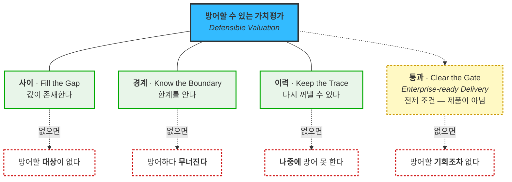
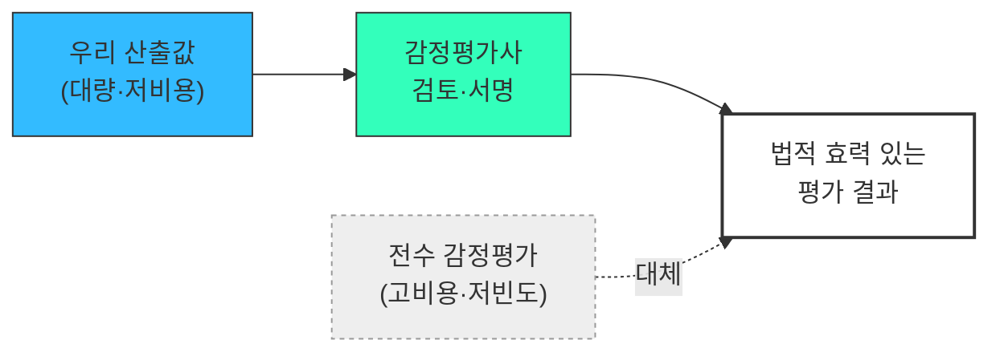
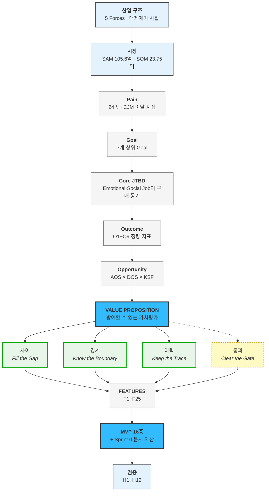

# IVI — Value Proposition Statement v2.0 (Rooted)

> **Institutional Valuation Infrastructure**
> 상업용 부동산 · 디지털 자산 · 조각투자/토큰증권(STO) 기초자산의 시장가치를 지속 산출해 API·파일로 금융기관 시스템에 공급하는 **평가 데이터 인프라**

---

## 0. 이 문서에 대하여

### 0.1 성격

**이 문서는 단독으로 완결됩니다.** 산업 구조 분석부터 기능 명세까지, 판단에 필요한 모든 근거를 **다른 문서를 열지 않고** 읽을 수 있도록 본문에 직접 담았습니다.

| 항목 | 내용 |
|---|---|
| 버전 | **v2.0 (Rooted)** — 외부 참조 제거, 근거 전량 내재화 |
| 작성일 | 2026-08-14 |
| 논리 순서 | `Pain → Goal → Job → Outcome → Alternative → Value → Feature → MVP` |
| Pain 체계 | `KD·PS·JM·MK·NG·BS·IS·CH` |
| Feature 체계 | `F1~F25` |
| 페르소나 | **12종** *(핵심 3 · 확장 4 · 극단 1 · 비활성 4)* |
| 핵심 수식 | `AOS = I × (1 − S/5)` · `DOS = (I − S) × Market Relevance` |

### 0.2 🚨 근거 강도 — 인용 전 반드시 확인

| 강도 | 뜻 | 이 문서에서의 범위 |
|:---:|---|---|
| ✅ **검증** | 공개 1차·2차 출처 | 경쟁사 11사 실적 · 제도·법령 · 시장 통계 |
| 🔵 **도출** | 자체 계산 *(입력이 가설 점수)* | AOS·DOS · 클러스터 · 사분면 · 분할 |
| 🟡 **가설** | **AI 생성 가상 인터뷰** — 실제 고객 발언 아님 | 모든 인용문 · Outcome 정량값 · WTP · 전환 판정 |

> 🔴 **비대칭이 있습니다.**
> **"경쟁사가 이걸 안 한다"는 ✅이고, "고객이 이걸 원한다"는 🟡입니다.**
> **차별성은 증명됐고 필요성은 미확인**입니다. 이 문서에서 가장 정직해야 하는 지점입니다.

---

# 1. Executive Summary

## 1.1 산업 구조 — 포터의 기준으로는 매력적이지 않습니다 ✅🔵

| Force | 강도 | 요약 |
|---|:---:|---|
| ① 신규 진입 위협 | ★★★★☆ | **라이선스 장벽이 없습니다.** 막는 것은 데이터와 시간뿐 |
| ② 공급자 교섭력 | ★★★★☆ | **거래소가 공급자이자 최대 고객** |
| ③ 구매자 교섭력 | ★★★★★ | 거래소 18 · 수탁 9 · 회계 4대 · AMC 실질 10~20 — **전 세그먼트 과점** |
| ④ 대체재 위협 | ★★★★★<br/>*(STO 축 ★★☆☆☆)* | 진짜 대체재는 경쟁 제품이 아니라 **엑셀과 현상 유지** |
| ⑤ 기존 경쟁 강도 | ★★★☆☆ | 직접 경쟁자는 적으나 **인접 유형이 아홉 갈래** |

**다섯 중 셋이 최고 강도입니다.** 수익성은 산업 구조가 아니라 포지셔닝에서 나와야 합니다.

**축별로 다시 채점하면 갈립니다.**

| Force | 부동산 | 디지털 | **STO** |
|---|:---:|:---:|:---:|
| ① 신규 진입 | ★★★★☆ | ★★★★☆ | ★★★☆☆ |
| ② 공급자 | ★★★☆☆ | ★★★★★ | ★★★☆☆ |
| ③ 구매자 | ★★★★★ | ★★★★★ | ★★★★★ |
| **④ 대체재** | **★★★★★** | ★★★☆☆ | **★★☆☆☆** |
| ⑤ 기존 경쟁 | ★★★☆☆ | ★★★★☆ | ★★☆☆☆ |

> 🔴 **STO 축이 구조적으로 가장 유리합니다** — 최고 강도가 하나(구매자)뿐입니다. 이유는 §6.5.

## 1.2 사업성 — 조건부 성립 🔵

다섯 힘 중 **넷은 포지셔닝으로 넘어가고 하나가 안 넘어갑니다.**

| Force | 넘을 수 있나 | 근거 |
|---|:---:|---|
| 공급자 | ⭕ | 다수 거래소 계약으로 분산. **완화책이 제품 가치와 같은 방향** |
| 신규 진입 | ⭕ | 시간이 지나면 우리가 방어자. 초기 3년만 취약 |
| **구매자 과점** | **△ 양날** | 초기엔 독, **전부 잡고 나면 해자** |
| **대체재 = 현상 유지** | **✕** | **설득으로 깨지지 않습니다. 외부에서 밀어줄 때만 깨집니다** |
| 기존 경쟁 | ⭕ | 근거 공개·as-of 재현 축이 비어 있음 |

**그래서 사업성은 "포지셔닝"이 아니라 "트리거가 있는 세그먼트만 골랐는가"에 달려 있습니다.**

| # | 성립 조건 | 깨지면 |
|:---:|---|---|
| **1** | **규제·사건 트리거가 있는 세그먼트만** 초기 타깃 | 대체재(현상 유지)에 집니다 |
| **2** | 국내 SAM 150억 전제로 **비용 구조를 짠다** | 조직이 매출을 앞지릅니다 |
| **3** | 3년 내 **인증 칸 조달** | 내부 참고용 툴로 축소, ARPU 하락 |
| **4** | **평가 엔진이 자산군을 넘어 재사용** | 자산군별 별도 제품 = 단일 버티컬 회사 |

| 사업 성격 | 성립 |
|---|:---:|
| **현금흐름 사업** *(소수 인원, 제품 주도)* | ⭕ |
| **VC 스케일** *(수백억 밸류)* | ✕ **국내 단독으로는 불가** |

## 1.3 고객이 겪는 문제는 "값이 없다"가 아닙니다

| # | 문제 | 대표 Pain |
|:---:|---|---|
| 1 | 평가와 평가 **사이의 가치 공백** | KD-1 |
| 2 | 산출값의 **근거·재현성 부재** | MK-1 · JM-2 |
| 3 | 실시간 데이터의 **지연·결측·장애** | PS-2 · PS-3 |
| 4 | 금융권 **보안·망분리·준법 장벽** | KD-2 · JM-3 |
| 5 | 특수자산의 **평가 가능성 판단 불가** | MK-2 · MK-3 |
| 6 | 감사·감독 앞에서 **설명 불가** | KD-3 · BS-2 · CH-1 |

## 1.4 고객이 사는 것은 정확도가 아닙니다 🟡🔵

**JTBD 인터뷰 7인 중 6인이 정확도가 아니라 책임 회피·외부 권위를 말했습니다.**

| 페르소나 | 발언 | Job 유형 |
|---|---|---|
| 김도현 | *"감사인 질문에 화면 하나 띄우면 **제가 방어할 일이 없어집니다**"* | Emotional |
| 백서현 | *"**제 이름 말고 다른 이름이 들어간** 근거요"* | Social |
| 조민경 | *"**외부 독립 출처로 교차검증하고 있습니다**라고 말할 수 있는 것"* | Social |
| 남기훈 | *"우리 모델로 틀리면 **그건 괜찮아요**"* | Emotional |
| 박선우 | *"**'우리만 이상한 게 아니다'를 숫자로** 말할 수 있게 됩니다"* | Social |
| 조현우 | *"제 판단이 아니라 **데이터가 지목했다**고 조서에 쓸 수 있는 것"* | Social |

**AOS 상위 항목에 "평가값 정확도"가 하나도 없다**는 계산 결과가 같은 사실을 뒷받침합니다.

## 1.5 통합 가치 선언

> # **방어할 수 있는 가치평가**
> ### *Defensible Valuation*
>
> **값을 팔지 않습니다. 그 값을 혼자 방어하지 않아도 되는 상태로 만들어 팝니다.**

---

# 2. 페르소나 · CJM 기반 핵심 문제

## 2.1 고객 여정 8단계 — 이 시장의 실제 행동에서 추출 🔵

`인지 → 탐색 → 구매 → 사용 → 재구매`를 쓰지 않았습니다. **끊기는 지점**을 찾아 8구간으로 나눴고, 그중 셋은 일반 SaaS 여정에 없습니다.

| # | 단계 | 이 시장에서 왜 생겼나 |
|:---:|---|---|
| S1 | **결산·사건 압박 자각** | 문제를 상시 느끼지 않습니다. **사건이 있을 때만** 문제가 됩니다 |
| S2 | **대안 탐색** | *"감정평가를 더 발주할까 / 데이터를 살까"* — **경쟁사 비교가 아닙니다** |
| S3 | **파일럿 검증** ★ | 자기 자산을 넣어 **기존 감정평가액과 대조** |
| S4 | **내부 설득** | 쓰는 사람과 결재하는 사람이 다릅니다 |
| S5 | **보안·준법 심사** ★ | 구매 의사와 **무관하게** 무산될 수 있는 구간 |
| S6 | **시스템 연동** ★ | 결제 후에도 끝나지 않습니다. 값이 내부 시스템에 들어가야 시작 |
| S7 | **정기 운영** | 여기서 가치가 증명됩니다 |
| S8 | **갱신 판단** | ARR 계약의 연 단위 재결정 |

★ = **이 시장 고유 구간.** 이 셋을 빼면 *"왜 계약이 안 되는가"* 의 답이 지도 밖에 남습니다.

## 2.2 페르소나 로스터 — 12종 🔵🟡

| 페르소나 | 유형 | 제품 축 | 진입 | 전환 판정 🟡 |
|---|---|---|:---:|:---:|
| **박선우** 거래소 시장감시 | 🔵 핵심 | 디지털 | **1** | ⚠️ 동률 (9=9) |
| **백서현** 회계법인 딜 자문 | 🔵 핵심 **(쐐기)** | CRE·NPL | **1** | ✅ 예 (8>6) |
| **김도현** AMC 리츠 운용역 | 🔵 핵심 | CRE | 4 | ❌ 아니오 (8<9) |
| **조현우** 회계법인 감사·검증 | 🟢 확장 | CRE | **2** | ✅ 예 (8>5) |
| **문경아** 특수자산 운용역 | 🔴 극단 | CRE | 3 | ✅ 예 (9>5) **최강** |
| **조민경** 은행 담보·리스크 | 🟢 확장 | CRE | 5 | ✅ 조건부 |
| **서태영** STO·RWA 기획 | 🟢 확장 | **STO** | *병행* | *(미인터뷰)* |
| **남기훈** NPL 투자심사역 | 🟢 확장(간접) | CRE | *제외* | ❌ 아니오 |
| **임성호** 망분리 실무자 | ⚪ 비활성 *(구조)* | CRE | — | 전환 조건 관리 |
| **유가람** 감정평가사 | ⚪ 비활성 *(인식)* | 전 축 | — | 전환 시 **채널** |
| **하승우** 은행 내부 평가조직 | ⚪ 비활성 *(고용 방어)* | CRE | — | 게이트키퍼 |
| **최도윤** 기업 부동산 담당 | ⚪ 비활성 *(대체재 우위)* | CRE | — | 간접 채널 |

**비활성 장벽이 여섯 종류입니다** — 구조(임성호) · 인식(유가람) · 이해상충 · 가격 · 대체재 우위(최도윤) · **고용 방어(하승우)**.

> 🔴 **세그먼트가 클수록 전환이 어렵습니다.**
> 김도현(SOM MR 0.202)은 전환 실패이고 문경아(0.061)가 최강입니다. 이유는 Habits·Anxieties의 성질입니다 — **큰 기관일수록 기존 프로세스에 맞춰 만들어 둔 것이 많고 책임 소재가 무겁습니다.**
> **DOS는 큰 세그먼트를 올리고 전환 동인은 내립니다.** 두 지표가 구조적으로 반대 방향이므로 **DOS 순위를 진입 순서로 쓰면 안 됩니다.**

## 2.3 핵심 페르소나 카드

### 🔵 김도현 — 대형 AMC 리츠운용본부 9년차

| 항목 | 내용 |
|---|---|
| **역할** | 리츠 20여 개, 그 아래 부동산 100개 이상의 운용 성과·공시 책임. **분기 결산에 들어갈 자산 가치를 확정하는 사람** |
| **문제** | 감정평가는 자산당 연 1~2회인데 시장은 그 사이에도 움직입니다. 자산이 수백 개라 외부 평가를 자주 돌릴 비용도 시간도 없고, **그 사이의 가치는 사실상 비어 있습니다** |
| **감정** | 결산 직전의 불안. *"이 숫자로 공시가 나가는데 근거가 6개월 전 평가서 한 장인가"* |
| **대체 솔루션** | 연 1~2회 감정평가서 + 엑셀 롤포워드 + 매입팀에 전화 |
| **사용 맥락** | 분기 결산 2~3주 전 일괄 재평가. 실시간 API보다 **대시보드 + 엑셀 내보내기**를 먼저 씀. 도입 6~18개월 |
| **여정 특징** | S3·S5에서 죽습니다. 파일럿에서 신뢰를 못 얻으면 계약이 없고, 보안심사에서 문서가 없으면 신뢰를 얻어도 계약이 없습니다 |

### 🔵 박선우 — 거래소 시장감시·상장 심사 6년차

| 항목 | 내용 |
|---|---|
| **역할** | 상장·상폐 판단, 이상거래 탐지, 공시 시세 제공 |
| **문제** | 자사 체결가가 시장 전체를 대표한다고 말하기 어렵습니다. 거래소마다 시세가 다르고 워시트레이딩 흔적이 남습니다. **유동성이 얕은 종목은 소량 거래로 가격이 튑니다** |
| **감정** | 사고가 터지면 이름이 남는다는 경계심 |
| **대체 솔루션** | 자사 체결가 + 해외 인덱스 사이트 눈 대조 + 내부 룰 알람 |
| **여정 특징** | **앞이 짧고 뒤가 깁니다.** 김도현과 정반대 — 계약까지는 2~4개월인데 **S6·S7(연동·장애)에서 죽습니다** |

### 🔵 백서현 — 회계법인 딜 어드바이저리 8년차 *(쐐기)*

| 항목 | 내용 |
|---|---|
| **역할** | 부동산·NPL 딜의 실사·밸류에이션 자문. **딜마다 고객이 바뀝니다** |
| **문제** | 보고서에 넣을 가치 근거를 **매 딜마다 새로** 만들어야 합니다. 자체 추정은 *"그건 당신 의견 아니냐"* 로 반박당합니다 |
| **감정** | 방어 가능성에 대한 집착. 보고서가 분쟁에 들어가면 **근거만 남습니다** |
| **사용 맥락** | 딜 단위 스파이크지만 **한 계약이 여러 고객사 딜에 반복 재사용**. 확산 효과 최대 |
| **왜 쐐기인가** | ① S2에서 **고객이 먼저 찾음** ② 파일럿 문턱 최저 ③ **각주가 곧 광고** — 상대측 자문사·투자사로 이름이 전파 |

### 🔴 문경아 — 중견 AMC 특수자산 운용역 11년차 *(극단)*

| 항목 | 내용 |
|---|---|
| **역할** | 지방 물류센터 4, 단일 호텔 1, 지식산업센터 3, 데이터센터 1 |
| **문제** | 이 사업의 전제인 *"거래 사례로 현재가치를 추정한다"* 가 성립하지 않습니다. 반경 내 유사 거래가 **2년간 0건**. **평가 지연이 아니라 평가 불가** |
| **감정** | 체념과 경계. *"그럴듯한 숫자가 나오는데 믿을 수 없습니다"* |
| **여정 특징** | **S3에서 30초 안에 결판**납니다. 시연에서 자기 자산을 먼저 넣습니다 |
| **왜 중요한가** | **극단에서 나온 요구가 핵심의 이탈을 막습니다** — 신뢰구간 표기가 김도현의 감사 대응 무기가 됩니다 |

### 🟢 조현우 — 회계법인 감사본부 11년차

| 항목 | 내용 |
|---|---|
| **역할** | 피감기업·펀드의 자산평가 적정성 검증. 재평가·손상검사·NAV 감사 |
| **문제** | 고객이 제출한 평가액이 타당한지 판단해야 하는데 **반증할 독립 데이터가 없습니다.** 결국 *"감정평가서가 있는가"* 만 확인하는 형식 검증 |
| **감정** | 놓치면 책임. **감사 실패는 법인이 아니라 개인 징계** |
| **사용 맥락** | 결산·감사 시즌 집중. **"어긋난 것만 뽑아 주는" 형태**를 원함 |
| **게이트키퍼** | **QRM + 심리실 이중** |

### 🟢 조민경 — 시중은행 여신리스크부 14년차

| 항목 | 내용 |
|---|---|
| **역할** | 담보가치 산정, 충당금·RWA 계산, 내부 스트레스 테스트 |
| **문제** | **자체 감정평가가 담보가를 높게 잡는다**는 지적을 이미 받았는데 반증할 독립 데이터가 없습니다 |
| **감정** | 감독 검사 지적에 대한 공포. **문제 인식은 가장 뚜렷한데 도입에는 가장 보수적** |
| **사용 맥락** | 단건이 아니라 **배치**. 방법론 문서와 감사 대응 자료가 구매 조건 |
| **게이트키퍼 셋** | 정보보호부 · 준법감시인 · **내부 평가조직(하승우)** |

## 2.4 Pain 전수 — 24종 (AOS 대상 21종)

**Pain은 고객 여정의 `이탈 지점`에서만 추출했습니다** — 사람이 실제로 멈추는 자리가 곧 Pain이라는 규칙입니다.

### 🔵 김도현

| ID | Pain *(고객의 말)* | Needs *(해결된 상태)* | CJM | I | S | **AOS** 🔵 |
|---|---|---|:---:|:---:|:---:|---:|
| **KD-1a** | *(대형 40개)* 엑셀 롤포워드로 대응 중이나 임대차 자료 수집에 일주일씩 | 대형 자산이 마감 전 갱신돼 있는 상태 | S1 | 4 | 3 | 1.6 |
| **KD-1b** | *(소형 90개)* **아무 대응 없이 이월.** *"130개 중 40개만 손댔어요"* | 자산 전량이 갱신돼 있는 상태 | S1 | 3 | 1 | **2.4** |
| **KD-2** | 보안·준법 심사에서 **문서 미비로 반려.** *"반려된 뒤로 아예 시도를 안 한다"* | 챙기지 않아도 심사 자료가 준비돼 통과 | S5 | 4 | 1 | **3.2** |
| **KD-3** | 감사인이 방법론을 문제 삼으면 **쓰던 것도 중단** | 감사인 질문에 문서 한 장으로 답하는 상태 | S7 | 5 | 2 | **3.0** |

### 🔵 박선우

| ID | Pain | Needs | CJM | I | S | **AOS** 🔵 |
|---|---|---|:---:|:---:|:---:|---:|
| **PS-1a** | *(메이저)* 해외 사이트 수동 대조 — 아침 30~40분 | 괴리를 자동으로 설명하는 상태 | S1 | 5 | 3 | 2.0 |
| **PS-1b** | *(알트·저유동성)* **대조 대상 자체가 없음.** 사실상 무방비 | 저유동성 종목도 기준가를 갖는 상태 | S1 | 5 | 1 | **4.0** |
| **PS-3** | 신규 상장 직후 **기준선을 만들 수 없다.** 연 20건+ | *"지금은 기준가를 낼 수 없다"* 를 시스템이 선언 | S3 | 5 | 1 | **4.0** |
| **PS-2** | 상시 결합이라 **공급자 장애가 곧 우리 장애** | 장애가 전파되지 않거나 먼저 아는 상태 | S7 | 5 | 4 | 1.0 ⚠️ |

### 🟢 조민경

| ID | Pain | Needs | CJM | I | S | **AOS** 🔵 |
|---|---|---|:---:|:---:|:---:|---:|
| **JM-2** | *"2년 전 그 시점에 당신 모델은 뭐라 했나"* 를 확인할 방법이 없다. **소명에 두 달** | 과거 임의 시점의 값·방법론을 재현 | S3 | 5 | 1 | **4.0** |
| **JM-1** | 자체 감정평가 과대 지적. 반증할 독립 데이터 없음 | 외부 독립 값으로 보완·반박 | S1 | 4 | 2 | 2.4 |
| **JM-3** | 위탁·보안 이중 심사. **API 전용이면 시작도 못 한다** | 회선을 열지 않고 심사를 통과 | S5 | 4 | 2 | 2.4 |

### 🔴 문경아

| ID | Pain | Needs | CJM | I | S | **AOS** 🔵 |
|---|---|---|:---:|:---:|:---:|---:|
| **MK-1** | **근거 없이 숫자만 나온다.** *"300km 떨어진 사례였다 — 그때 바로 해지"* | 값과 사례 건수·충분성 등급이 같은 화면에 | S3-b | 5 | 1 | **4.0** |
| **MK-2** | 유사 거래 **2년간 0건** — 평가 불가 | 산출 불가를 이유와 함께 받는 상태 | S3-a | 5 | 1 | **4.0** |
| **MK-3** | **계약하고 나서야** 안 되는 걸 안다 | 계약 전에 *"100개 중 78개 가능"* 을 아는 상태 | S3-c | 5 | 1 | **4.0** |

### 🟢 조현우 *(신규)*

| ID | Pain | Needs | CJM | I | S | **AOS** 🔵 |
|---|---|---|:---:|:---:|:---:|---:|
| **CH-1** | 피감회사가 준 자료 안에서만 검증. **독립 대조군이 없다** | 독립 출처로 고객 숫자를 대조하는 상태 | S3 | 5 | 1 | **4.0** |
| **CH-2** | 가정의 합리성을 판단할 근거가 없다. *"캡레이트 5%가 맞는지 어떻게 압니까"* | 가정을 뒷받침·반박할 데이터를 갖는 상태 | S3 | 5 | 2 | **3.0** |
| **CH-3** | 어디를 파볼지 정할 근거가 없어 **금액 순으로만** 표본 추출 | 모집단에서 이상치를 지목받는 상태 | S1 | 4 | 2 | 2.4 |

### 🔵 백서현

| ID | Pain | Needs | CJM | I | S | **AOS** 🔵 |
|---|---|---|:---:|:---:|:---:|---:|
| **BS-2** | QRM 심사에서 **출처 신뢰성이 인정 안 되면 인용 자체가 불가** | 법인 표준 인용 출처로 등록 | S4 | 5 | 2 | **3.0** |
| **BS-1a** | *(대형 딜)* 감정평가가 **법적 효력까지 제공** — 우리가 필요 없음 | — | S2 | 3 | 4 | 0.6 ⛔ |
| **BS-1b** | *(소형·중형 딜 — "훨씬 많음")* 공개 통계 + 사내 DB로 버팀 | 같은 출처를 각주로 재사용 | S2 | 4 | 2 | 2.4 |
| **BS-3** | 고객사가 이의를 제기하면 그 딜 이후 중단 | 방법론 문서로 답할 수 있는 상태 | S7 | 3 | 3 | 1.2 |

### 🟢 남기훈 · ⚪ 임성호

| ID | Pain | I | S | **AOS** 🔵 | 처분 |
|---|---|:---:|:---:|---:|---|
| **NG-1a** | *(서울·경기)* 사내 DB가 더 정확 — 오차 8% 대 12% | 3 | 5 | **0.0** ⛔ | **자원 회수** |
| **NG-1b** | *(지방·비주거)* 사내 DB 오차 20%+ | 4 | 2 | 2.4 | 간접 채널 |
| **NG-2** | 실사 마감 초과 시 딜 통째로 사용 불가 | 5 | 3 | 2.0 | 후순위 |
| **NG-3** | 과거 낙찰 소급 대조 불가 | 3 | 2 | 1.8 | 후순위 |
| **IS-1~3** ⚠️ | 내부망에서 외부 API 호출 불가 — **제품을 보지도 못함** | — | — | *(제외)* | **전환 조건 관리** |

> ⚠️ **IS 계열은 AOS를 계산하지 않습니다.** 쓰지 않는 사람에게 만족도를 물으면 0에 수렴해 순위가 뒤집힙니다 — **"해결 안 됨"이 아니라 "시도조차 없었음"** 이기 때문입니다.

## 2.5 하나의 Pain에 만족도가 둘인 구조 — 24종 중 5종 🔵

`AOS = I × (1 − S/5)` 는 **"Pain 하나 = Satisfaction 하나"** 를 전제합니다. 그 전제가 깨지는 항목이 다섯이었습니다.

| ID | 분할 축 | 통합 AOS | 분할 후 | 근거 발언 🟡 |
|---|---|---:|---|---|
| **NG-1** | 지역·자산군 | 1.6 | **0.0 / 2.4** | *"서울·경기는 오차 8%, 지방은 20% 넘어요"* |
| **PS-1** | 종목 유동성 | 3.0 | **2.0 / 4.0** | *"메이저는 2%도 이상하고 알트는 15%도 정상"* |
| **KD-1** | 자산 규모 | 1.8 | **1.6 / 2.4** | *"130개 중 40개만 손댔어요"* |
| **BS-1** | 딜 규모 | 2.4 | **0.6 / 2.4** | *"기준 아래 구간이 훨씬 많습니다"* |
| **CH-1** | 자산 유형 | — | *(분할 대기)* | *"서울 오피스는 되고 지방은 안 됩니다"* |

> 🔴 **분할하면 한쪽이 거의 항상 과잉충족으로 나옵니다** — NG-1a 0.0 · BS-1a 0.6 · KD-1a 1.6 · PS-1a 2.0. **통합 채점은 두 구간을 평균해 양쪽 다 잘못 표현합니다.**
>
> **분할 축을 찾는 질문이 필요합니다** — *"지금 방식이 잘 통하는 대상과 전혀 안 통하는 대상을 나눠 말씀해 주시겠어요?"* 단일하게 물으면 **응답자가 평균을 답합니다.**

## 2.6 CJM 이탈이 몰리는 곳 🔵

| 순위 | 구간 | 누구 | 왜 죽나 | 제품 성능? |
|:---:|---|---|---|:---:|
| 1 | **S5 보안·준법 심사** | 김도현·조민경 | 문서 미비 반려. 담당자는 손을 뗌 | **✕** |
| 2 | S3-b 근거 확인 | 문경아 | 근거 없는 숫자 = 신뢰 상실 | △ |
| 3 | **S2 아키텍처 확인** | 임성호 | API only | **✕** |
| 4 | **S2 Build vs Buy** | 남기훈 | 자체 역량이 곧 경쟁력 — 외주화로 읽힘 | **✕** |
| 5 | S7 첫 장애 | 박선우 | 우리 장애가 곧 고객 장애 | △ |
| 6 | **S4 QRM 심사** | 백서현·조현우 | 출처 신뢰성 미검증 = 인용 불가 | **✕** |
| 7 | S3 백테스트 | 조민경·남기훈 | as-of 조회 부재 | ⭕ |
| 8 | S6 마감·매핑 | 남기훈·김도현 | 실사 마감, 자산 매핑 부담 | △ |

> 🔴 **여덟 중 넷이 제품 성능과 무관합니다.** 값이 아무리 정확해도 **문서·납품 형태·프레이밍**에서 죽습니다.

**게이트키퍼가 조직마다 다릅니다.**

| 페르소나 | 게이트키퍼 | 준비할 자료 |
|---|---|---|
| 김도현 | 정보보안 · 준법감시인 | 보안 문서 세트 |
| **조민경** | 정보보호부 · 준법감시인 · **내부 평가조직** | 규정 해석 + 보안 문서 + **업무 재배치 설계** |
| 백서현 | **품질관리(QRM)** | 출처 검증 패키지 *(5항목 · 6~9개월)* |
| **조현우** | **QRM + 심리실** | 위 + 감사 조서 적합성 |
| 남기훈 | **팀장의 한마디** — *"그거 우리가 하면 되잖아"* | 사내 모델 대비 차이 리포트 |

## 2.7 Pain 클러스터 — 독립적으로 반복된 요구 🔵

| 클러스터 | 반복 | 해당 Pain | 클러스터 DOS |
|---|:---:|---|---:|
| **과거 시점을 그대로 재현** | **3회** | JM-2 · NG-3 · *(감사 소급)* | **0.770** *(최고)* |
| **근거를 함께 제시** | **4회** ▲ | KD-3 · MK-1 · BS-2 · **CH-2** | 0.502+ |
| **회선을 열지 않고 받기** | **3회** | JM-3 · IS-1 · IS-2 | 0.654+ |
| **대체하지 않고 대조하기** | **4회** ▲ | NG-1b · **조현우** · **하승우** · *(최도윤)* | — |
| 못 낼 때 못 낸다고 말하기 | 2회 | MK-2 · PS-3 | — |
| 마감 안에 끝나기 | 1회 | NG-2 | — |

> 💡 **상위 클러스터가 전부 "평가값의 정확도"가 아닙니다** — 재현성 · 설명 가능성 · 전달 경로 · 대조 가능성입니다.

---

# 3. 고객 Goal 통합

| 상위 Goal | 페르소나 | 핵심 고객가치 |
|---|---|---|
| 신뢰 가능한 현재가치 기반 의사결정 | 김도현 | **Timely + Reliable Valuation** |
| 실시간 시장 감시의 연속성 | 박선우 | **Real-time Reliability** |
| 평가 결과의 설명·재현 가능성 | 조민경 | **Explainability + Auditability** |
| 불완전한 데이터에서 평가 가능성 판단 | 문경아 | **Coverage + Confidence** |
| 인용 가능한 독립 출처 확보 | 백서현 | **Citable Independence** |
| 고객 숫자를 반박할 독립 대조군 | 조현우 | **Independent Cross-check** |
| 보안환경에서 데이터 활용 | 임성호 | **Secure Deployment** |

### 통합 Goal

> **"자산의 현재가치를 필요한 시점에 확인하고, 그 결과를 신뢰·검증·설명할 수 있으며, 자신의 업무환경에서 안전하게 활용하고 싶다."**

---

# 4. JTBD

## 4.1 Core JTBD

> **When** 자산가치를 판단하거나 감사·감독·투자심의에 보고해야 하는 상황에서
> **I want to** 현재 시장을 반영한 가치와 **그 값을 만든 근거·시점**을 함께 확보하고
> **So I can** 그 숫자를 **내 이름으로 방어하지 않아도 되는 상태**에서 의사결정을 내릴 수 있다.

## 4.2 페르소나별 JTBD 선언 🟡

| 페르소나 | 선언 |
|---|---|
| **김도현** | *분기 마감 3주 전 오래된 평가일을 발견했을 때, **내가 만들지 않은 숫자로** 공시 자산가치를 채우고 싶다. 그래서 감사인이 물어도 **총대를 메지 않고** 문서 한 장으로 답할 수 있도록* |
| **박선우** | *새벽 3시에 신규 상장 종목 가격이 튀는데 룰이 안 걸릴 때, **우리 가격을 대조할 외부 잣대**를 갖고 싶다. 그래서 *"우리만 이상한 게 아니다"* 를 **숫자로 증명**할 수 있도록* |
| **조민경** | *검사 예고가 뜨고 2년 전 근거를 소명해야 할 때, **그때 시점의 값과 방법론을 그대로** 꺼내고 싶다. 그래서 두 달 걸리던 소명을 **하루로** 줄이도록* |
| **문경아** | *마감 직전에 사례를 반나절 찾고도 빈손일 때, **"없다"는 확답을 근거와 함께** 받고 싶다. 그래서 **안 되는 자산은 처음부터 빼고** 되는 자산에 힘을 주도록* |
| **백서현** | *딜을 수임하고 근거를 또 처음부터 만들 때, **내 이름이 아닌 출처**를 각주로 달고 싶다. 그래서 딜이 바뀌어도 **방어 논리가 축적**되도록* |
| **조현우** | *피감회사 평가액을 검토하는데 반박할 데이터가 없을 때, **모집단에서 튀는 것을 지목**받고 싶다. 그래서 *"제 판단으로는"* 이 아니라 ***"독립 출처가 지목했다"*** 고 조서에 쓰도록* |
| **남기훈** | *2주 안에 담보물 240건을 실사해야 할 때, **사내 모델과 어긋나는 것만** 골라내고 싶다. 그래서 **240건 대신 20~30건만** 다시 보도록* |

## 4.3 Job 계층 — 구매 동기는 기능적 Job이 아닙니다

| Job 유형 | 내용 |
|---|---|
| **Main (기능)** | 거래가 드물거나 시장이 분산된 자산의 **현재가치를 근거와 함께 확보**해 금융 의사결정·공시·감사에 투입 |
| **Related** | 내부 시스템·보고서·감시 시스템에 **적재**하고 과거 시점을 **소급 재현** |
| **Emotional** | **"내가 총대를 메지 않는다"** — 틀렸을 때 책임이 개인에게 오지 않게 |
| **Social** | 감사인·감독당국·투자심의·상대측 자문사 앞에서 **"우리가 만든 값이 아니다"** 를 증명 |

> 🔴 **Emotional·Social Job이 실제 구매 동기입니다.** 이것이 *"감정평가법인이 파는 것은 값이 아니라 면책"* 이라는 결론과 같은 축입니다.

## 4.4 전환 동인 — `Push + Pull > Habits + Anxieties` 🟡

| 페르소나 | ①Push | ②Pull | ③Habits | ④Anxieties | 순합 | 판정 |
|---|:---:|:---:|:---:|:---:|:---:|:---:|
| **문경아** | 5 | 4 | **2** | 3 | **+4** | ✅ 예 |
| **조현우** | 4 | 4 | **1** | 4 | **+3** | ✅ 예 |
| **백서현** | 4 | 4 | **2** | 4 | **+2** | ✅ 예 |
| **조민경** | 4 | 5 | 4 | 4 | **+1** | ✅ 조건부 |
| **박선우** | 5 | 4 | 4 | 5 | **0** | ⚠️ 동률 |
| **남기훈** | 3 | 4 | 4 | 4 | **−1** | ❌ 아니오 |
| **김도현** | 4 | 4 | 4 | 5 | **−1** | ❌ 아니오 |

**전환의 핵심 변수는 Habits입니다.**

| Habits ★ | 페르소나 | 이유 |
|:---:|---|---|
| **★1** | 조현우 | *"딱히 없습니다. **지금 못 하는 걸 하게 되는 거라서**"* |
| **★2** | 문경아 · 백서현 | *"혼자 하는 일이라 바꿔도 남의 일이 안 늘어남"* / *"오히려 제 일이 줄어드는 거라서"* |
| ★4 | 김도현·조민경·박선우·남기훈 | 양식·조직·알람 룰·DB 스키마가 이미 맞춰져 있음 |

> 🔴 **뺏기는 업무가 없는 페르소나가 가장 잘 전환됩니다.**

**전환 실패 2인의 조건**

| 페르소나 | 무엇이 막나 | 뒤집는 조건 |
|---|---|---|
| **김도현** | Anxieties 최대 — **전부 KD-3(감사 대응)** | 감사 대응 패키지 하나 |
| **남기훈** | *"팀장이 '그거 우리가 하면 되잖아'라고 하면 끝"* | 지방·비주거 한정 + 차이 리포트 + 연 2~3천 |

---

# 5. 고객이 원하는 Outcome

## 5.1 정량 지표 🟡

**전부 인터뷰 발언에서 나온 값입니다** — 우리가 설정한 목표가 아닙니다.

| # | Outcome | As-Is | To-Be | 출처 |
|:---:|---|---|---|---|
| **O1** | 감독 소명 소요 | **2개월** | **1일** | 조민경 |
| **O2** | 실사 재검토 건수 | 240건 | **20~30건** | 남기훈 |
| **O3** | *"사례 없음"* 확인 | 반나절 | **30초** | 문경아 |
| **O4** | 분기 갱신 자산 비율 | **31%** | **100%** | 김도현 |
| **O5** | 장부값 기준일 지연 | 7~8개월 | **≤1개월** | 김도현 |
| **O6** | 아침 수동 대조 | 30~40분/일 | **0분** | 박선우 |
| **O7** | 감사인 설명 | 30분 | **5분** | 문경아 |
| **O8** | 딜당 근거 확보 | 4~6주 중 최장 | **즉시 재사용** | 백서현 |
| **O9** | 감사 표본 추출 근거 | *"금액 순"* | **이상치 지목** | 조현우 |

## 5.2 KPI 정의

| KPI | 방향 | 대응 Outcome |
|---|:---:|---|
| Valuation Lead Time | ↓ | O3 · O5 |
| Valuation Gap | ↓ | O4 · O5 |
| Verification Time | ↓ | O1 · O7 |
| Data Latency / Missing Rate | ↓ | O6 |
| Evidence Traceability | ↑ | O7 · O8 |
| Reproducibility | ↑ | O1 |
| **Coverage Forecast Accuracy** | ↑ | §11.3 |
| Confidence Visibility | ↑ | O3 |
| Anomaly Detection Yield | ↑ | O2 · O9 |
| Security / Integration Lead Time | ↓ | — |

## 5.3 수용 임계값 — 못 넘으면 Outcome이 무효 🟡

| 임계값 | 값 | 못 넘으면 |
|---|---|---|
| **데이터 지연** | **≤ 5초** | *"5초 넘으면 저희 감시엔 못 씁니다"* |
| **가동률 / 장애 통보** | **99.9% / 5분 + 폴백** | 실시간 연동 불가 |
| **백테스트 기간** | **3년** *(5년 권장)* | 검사 주기를 못 덮음 |
| **NPL 정확도** | **지방만 오차 ≤ 15%** | 전국 평균 12%는 무의미 |
| **미산출 시 대체값** | **폴백 필수** | *"빈칸만 오면 감시가 멈춥니다"* |
| **모집단 정보** | **커버리지 동반 필수** | *"나머지 90건은 왜 안 뽑혔는지"* — 표본 추출 근거 불성립 |
| 산출 불가 비율 | ≤ 30% *(참고)* | §11.3에서 **제품 KPI 아님**으로 재판정 |

> 🔴 **미산출 요구가 페르소나별로 반대입니다** — 문경아는 *"없다고 말해주면 안심"* 인데 박선우는 *"뭘 대신 볼지 같이 줘야"* 입니다. **사람이 보는 화면과 시스템이 받는 피드를 분리**해야 합니다.

## 5.4 지불의사 (WTP) 🟡

| 페르소나 | 현재 지출 / 견적 | 가격표 정합 |
|---|---|---|
| **박선우** | 해외 벤더 견적 **연 1.5~2억** *(원화 미반영으로 미도입)* | Exchange 1.2~2.4억 ✅ |
| **김도현** | 감정평가 **연 8,000만** · *"감정평가보다 싸야"* | Professional 4,800만~8,400만 ✅ |
| **남기훈** | **연 2~3천** ⚠️ | 기존 가정(8,000만)의 **1/3** |
| 조민경 | 참고용 부서장 전결 / 산정 반영 **규정 개정 1년+** | 2단계 진입 |
| 백서현 | QRM 등록 시 **법인 전체 사용** | 팀→법인 확장 |
| 조현우 | *"외부 전문가는 건당 비용이 커서 큰 건에만"* · **비용 주체 미확인** | 별도 계약 필요 |

> 💡 **7인 중 4인의 답이 금액이 아니라 조건이었습니다** — 규정 근거 / 커버리지 비율 / 인증 절차 / 비용 주체. **규제 산업에서는 "얼마면 사겠는가"보다 "무엇이 있으면 살 수 있는가"가 결정적입니다.**

---

# 6. 기존 대안 (Competitor / Substitute)

## 6.1 대안은 네 계층입니다

| 계층 | 대안 | 위협 | 누구의 대안 |
|---|---|:---:|---|
| **① 현상 유지** | 엑셀 롤포워드 · 전화 · 아무것도 안 함 | ★★★★★ | **전원** |
| **② 제도적 대체재** | 감정평가서 *(법적 효력 + 품의 통과 용이)* | ★★★★☆ | 김도현·조민경·백서현·조현우 |
| **③ 고객 내재화** | 사내 DB · 자체 감평 조직 · 자사 지수 | ★★★★☆ | 남기훈·조민경·박선우 |
| **④ 상용 경쟁 제품** | 해외 인덱스 벤더 · 국내 AI 시세 | ★★★☆☆ | **박선우만 정면** |

🟡 **페르소나 대체 솔루션 12종 중 경쟁 제품은 0개**였습니다 — 전부 엑셀·전화·내부 규정·직전 평가서 이월입니다.

## 6.2 경쟁자 아홉 갈래 ✅

| # | 유형 | 주요 사업자 |
|:---:|---|---|
| ① | **감정평가법인** | 삼창·경일·미래새한·대화·하나·제일 / 한국감정평가사협회 / Kroll·Houlihan Lokey |
| ② | **공적 기관·통계** | **한국부동산원** · 국토부 실거래가 · 법원 경매정보 · 한국리츠협회 |
| ③ | **부동산 데이터 플랫폼** | 밸류맵·디스코·부동산플래닛 / **빅밸류**·랜드북·리치고 / CoStar·Green Street |
| ④ | **글로벌 CRE 서비스사** | CBRE·JLL·Cushman&Wakefield·Colliers·Savills / MSCI Real Assets |
| ⑤ | **밸류에이션 소프트웨어** | **Altus Group(ARGUS)** · Yardi · MRI Software |
| ⑥ | **디지털 자산 인덱스** | **CF Benchmarks** · **Kaiko** · Coin Metrics / UBCI · **쟁글** |
| ⑦ | **회계·자문 법인** | 삼일PwC · 삼정KPMG · 안진딜로이트 · 한영EY |
| ⑧ | **고객 내재화** | 남기훈 사내 DB · 조민경 자체 감평 조직 · 박선우 자사 지수 |
| ⑨ | **STO 제도 인프라** | 증권사 진영 · **한국예탁결제원** · 토큰증권 협의체 |

## 6.3 주요 경쟁사 브리핑 ✅

| 사업자 | 규모 | 핵심 비즈니스 모델 | 도출된 가치 선언 |
|---|---|---|---|
| **한국부동산원** | 부동산 가격공시·국가통계 전담. R-ONE 포털 운영 | **비영리 공적 기관** — 이용자 무료 | *"국가가 말하는 하나의 숫자를 무료로"* |
| **대형 감정평가법인군** | 업계 **1조 1,629억**(2023, 국세청) · 13개 법인 **9,218억**(2024, 75%+)<br/>삼창 797억 · 경일 786억 · 미래새한 783억 | **건별 수수료.** 보수는 국토부 공고 기준 | *"값이 아니라 책임지는 사람을 판다"* |
| **빅밸류** | 금융위 **지정대리인** · AI 시세를 **시중은행 담보심사에 공급**<br/>삼성벤처·KB인베·KDB·신한·하나 투자 | B2B 데이터 구독 + **금융기관 업무 위탁** | ***"데이터로 판단의 기준을 만듭니다"*** *(공식)* |
| **밸류맵 / 디스코** | 디스코 실거래 **3,000만 건** *(2차 출처)* | 프리미엄 구독 + 중개 연계 | *"정보를 모으고 정제 기술을 특허로 지킨다"* |
| **CoStar Group** | **FY2025 매출 32억 달러(+19%)** · 조정 EBITDA 4.42억(+83%)<br/>순신규 수주 3.08억 · 부동산 기록 **850만 건** | **구독이 매출의 95%+** | *"업무를 시작할 때 가장 먼저 켜는 화면"* |
| **Altus Group** | 소프트웨어 **ARR 1.979억 달러(+10.6%)**<br/>VMS ARR 1.669억 · 6분기 연속 마진 개선 | 밸류에이션 SW 라이선스 + VMS 서비스 | *"계산하는 문법을 제공한다. 숫자는 당신이 채운다"* |
| **CF Benchmarks** | CME CF BRR이 **1,000억 달러+** 규제상품 기준<br/>미국 현물 BTC ETF **11개 중 6개** · **FCA 등록** | 지수 라이선싱·산출대행 | *"규제기관이 인정한 기준가만이 기준가다"* |
| **Kaiko** | 누적 투자 **7,700만 달러** · 기관 고객 **200+**<br/>CBOE·D2X·Gemini | 시장데이터·퀀트·지수·리서치 구독 | *"우리는 어느 거래소의 편도 아니다"* |
| **크로스앵글(쟁글)** | 시리즈B **170억 원** · 거래소 70+ · 발행사 3,000+ | 공시 플랫폼 + 데이터 구독 | *"법이 만들기 전에 우리가 공시를 만든다"* |
| **증권사 STO 진영** | 미래에셋컨설팅 → 코빗 **97.7%** 인수<br/>미래에셋 홍콩 **1,000억** 디지털 채권 · 한투 자체 플랫폼 RFP | 발행 주관·중개 수수료 + 리테일 앱 락인 | *"전통·디지털을 한 앱에서. 상품은 나중에"* |
| **예탁결제원·협의체** | 전자증권법 **2026.1.15 통과 · 2.3 공포 · 2027.2.4 시행** | 제도 인프라 운영 | *"무엇이 객관적 가치평가인지를 정의한다"* |

## 6.4 사라진 경쟁자 — 1세대 부동산 조각투자 ✅

| 사업자 | 결과 | 사유 |
|---|---|---|
| **카사코리아** | 2026.8.10 종료 *(보도)* · 2025년 매출 **5,355만** · 순손실 **61억** | 혁신금융 지정 만료 후 **투자중개업 인가 미취득** |
| **펀블** | 플랫폼 종료·청산 | 동일 |
| **에이판다** | 에잇퍼센트 인수 | 재편 |

> 🔴 **제도화가 혁신 사업자를 걸러낸 역설입니다.** 우리에게 주는 함의 셋 — ① **규제 샌드박스는 시한부 유예** ② **인가가 필요 없는 데이터 공급자 포지션이 이 구조에서 살아남는 자리** ③ 조각투자 사업자 소멸로 **기초자산 평가·신탁 공백이 실제로 발생**.

## 6.5 STO 축에서는 현상 유지가 제도로 금지됩니다 ✅

| 대체재 | 부동산 | 디지털 | **STO** | STO에서 막히는 이유 |
|---|:---:|:---:|:---:|---|
| 발행자 자체 산정 | ★★★★★ | ★★★☆☆ | **✕** | **이해상충** |
| 감정평가 건별 발주 | ★★★★☆ | — | **★★☆☆☆** | 비용 — 업계가 *"외부 평가 비용을 어떻게 낮출 것인가"* 를 과제로 명시 |
| 사내 자체 구축 | ★★★★☆ | ★★★★☆ | **✕** | 동일한 이해상충 |
| **아무것도 안 함** | ★★★★★ | ★★★☆☆ | **✕** | **공시 요건 미충족** |

**제도 타임라인**

| 시점 | 사건 |
|---|---|
| 2026.1.15 | 전자증권법·자본시장법 개정안 **국회 통과** |
| 2026.2.3 | **공포** |
| **2026.2 ~ 2027.2** | **협의체 운영 — 요건 정의 구간 (약 18개월)** |
| 2027.2.4 | **개정 전자증권법 시행** |

**협의체 명시 요건**: *"기초자산의 **객관적 가치평가 가능성**, 리스크 관리·공시"*
**시장 전망**: 국내 토큰증권 시총 2024년 **34조** → 2030년 **367조** *(PwC 추정)* · 정부 검토 국유재산 **1,400조**

## 6.6 감정평가 대비 승패 지도 🔵

| 영역 | 승자 | 이유 |
|---|:---:|---|
| 담보 설정·공시·세무·소송 | **감정평가법인** | 유자격자 법적 독점 — **기술로 못 넘음** |
| 오류 시 책임 귀속 | **감정평가법인** | *"책임져 줄 사람이 있다"가 곧 상품* |
| 신규 자산 편입 초기 평가 | **감정평가법인** | 관행 확립 |
| 자산 수백 개 월·분기 갱신 | **우리** | 감정평가 단가로 성립 불가 |
| **과거 시점 재현(as-of)** | **우리** | 감정평가서는 **시점 스냅샷** |
| 포트폴리오 동일 기준 횡비교 | **우리** | 법인·평가사마다 기준 상이 |
| 시스템 적재 | **우리** | PDF는 리스크 시스템에 못 들어감 |
| **산출 불가의 정직한 선언** | **우리** | **감정평가는 어떻게든 값을 냅니다** |

> **최우선 과제 중 감정평가법인과 부딪히는 항목이 0개입니다.** 우연이 아닙니다 — 감정평가가 잘 해주는 자리는 Satisfaction이 높아 자동으로 순위에서 내려갔습니다. **AOS 순위표는 사실상 "감정평가가 못 하는 것" 순위표입니다.**

**진짜 위험은 성능이 아니라 품의 통과입니다** — 김도현의 S2 이탈 사유가 *"감정평가 추가 발주가 더 설명하기 쉬워서 회귀"* 였습니다. **전례·예산 항목·익숙한 결재선을 우리는 셋 다 갖고 있지 않습니다.**

## 6.7 밸류체인 점유 지도 — 우리 줄의 유일한 빈칸 🔵

`원천 수집 → 정제 → 평가 모델 → 산출물 → 전달 → 인증 → 활용`

| 유형 | 수집 | 정제 | 모델 | 산출물 | 전달 | **인증** | 활용 |
|---|:---:|:---:|:---:|:---:|:---:|:---:|:---:|
| ① 감정평가법인 | ○ | △ | ● | ● | ✕ | **●** | ○ |
| ② 공적 기관 | ● | ○ | ✕ | △ | ○ | **●** | ✕ |
| ③ 데이터 플랫폼 | ● | ● | △ | ○ | ● | ✕ | ✕ |
| ④ 글로벌 CRE | ● | ● | ● | ● | ○ | **○** | ● |
| ⑤ 소프트웨어 | ✕ | ✕ | ● | ○ | ● | ✕ | ● |
| ⑥ 디지털 인덱스 | ● | ● | ● | ● | ● | **○** | ○ |
| ⑦ 회계법인 | ✕ | ✕ | ○ | ○ | ✕ | **●** | ● |
| **우리** | ○ | ● | ● | ● | ● | **✕** | ○ |

*● 강함 · ○ 보통 · △ 약함 · ✕ 없음*

> 🔴 **격차가 모델이나 데이터가 아니라 밸류체인의 한 칸(인증)에 있습니다.** 그래서 선택이 **자체 구축(불가) / 조달(QRM·보험) / 차용(하이브리드)** 으로 좁혀집니다.
> ✅ **빅밸류가 금융위 지정대리인으로 이 칸을 채운 선례가 있고, 대가는 감정평가업계의 형사 고발이었습니다.**

## 6.8 산출물 형태 비교 — 우리만 있는 두 칸

| 유형 | 산출물 | 주기 | 과금 | 시스템 결합 | **근거 공개** | **as-of 재현** |
|---|---|---|---|:---:|:---:|:---:|
| 감정평가법인 | PDF 평가서 | 연 1~2회 | 건당 | ✕ | 부분 | **✕** |
| 공적 기관 | 통계표·API | 월·분기 | 무료 | △ | 전면 | ✕ |
| 데이터 플랫폼 | 웹 조회 | 실시간~월 | 구독 | △ | 부분 | ✕ |
| 글로벌 CRE | 리포트+자문 | 분기·반기 | 리테이너 | ✕ | 부분 | ✕ |
| 디지털 인덱스 | 실시간 피드 | 초~일 | 구독 | ● | 방법론 | △ |
| 회계법인 | 의견서 | 딜·감사 | 용역비 | ✕ | 부분 | ✕ |
| **우리** | **값+근거+as-of** | **일·월·분기** | **구독+종량** | **●** | **전면** | **⭕** |

## 6.9 경쟁사가 점유한 언어 ✅

| 이미 점유된 언어 | 점유자 |
|---|---|
| **판단의 기준** | 빅밸류 *(공식 슬로건)* |
| 정보 비대칭 해소 | 밸류맵 · 쟁글 |
| 독립적·중립적 데이터 | Kaiko |
| 규제 등록 기준가 | CF Benchmarks |
| **가장 넓은 커버리지** | CoStar · 디스코 |
| 국가가 정한 하나의 숫자 | 한국부동산원 |
| 책임지는 사람 | 감정평가법인군 |
| **↓ 비어 있는 칸** | |
| **재현성 · 정직한 미산출 · 미대응 구간** | **없음 — 세 기둥이 이 자리** |

---

# 7. 핵심 Value Proposition

## 7.1 통합 선언

> # **방어할 수 있는 가치평가** / *Defensible Valuation*
>
> **값을 팔지 않습니다. 그 값을 혼자 방어하지 않아도 되는 상태로 만들어 팝니다.**

**"방어"라는 행위를 분해하면 세 조건이 나옵니다.**

| 방어의 조건 | 기둥 | 없으면 |
|---|:---:|---|
| ① **방어할 값이 존재해야** | **사이** | 안 잰 자산은 방어 여부를 논할 수 없음 |
| ② **그 값의 한계를 알아야** | **경계** | 모르고 인용했다가 반박당하면 그 딜 이후 중단 |
| ③ **나중에 다시 꺼낼 수 있어야** | **이력** | 지금 방어해도 2년 뒤 소명에 답 못 함 |

**셋 중 하나라도 빠지면 "방어할 수 있는"이 거짓이 됩니다** — 선택 옵션이 아니라 **논리적 필요조건**입니다.

## 7.2 세 기둥

| 기둥 | 영문 | 선언 | 핵심 근거 | 경쟁 11사 중 |
|---|---|---|---|:---:|
| **사이** | *Fill the Gap*<br/>**Timely Valuation** | **"연 1~2회와 방치 사이를 채웁니다"** | 🟡 자산 130개 중 40개만 손대고 **69% 이월** | **0곳** |
| **경계** | *Know the Boundary*<br/>**Confidence-aware Valuation** | **"되는 것과 안 되는 것의 경계를 먼저 말합니다"** | 🔵 커버리지 진단이 **최대 오판**(2.4→4.0) | **0곳** |
| **이력** | *Keep the Trace*<br/>**Evidence-backed & Reproducible** | **"2년 뒤에도 그때 그 값이 남습니다"** | 🔵 3개 페르소나 독립 요구 · **클러스터 DOS 0.770 최고** | **0곳** |



| 빠지면 | 무슨 일이 | 🟡 실제 발언 |
|---|---|---|
| **사이** 없음 | 방어할 **대상 자체가 없음** | *"나머지는 그냥 이월했어요"* |
| **경계** 없음 | 방어하다 **무너짐** | *"300km 떨어진 물건 사례였다. 그때 바로 해지"* |
| **이력** 없음 | **나중에** 방어 못 함 | *"과거 이메일·PDF 뒤지기"* |
| **통과** 없음 | 방어할 **기회조차 없음** | *"반려된 뒤로 아예 시도를 안 한다"* |

> ⚠️ **통과(Clear the Gate)는 기둥이 아니라 전제 조건입니다** — 고객 가치가 아니라 **우리가 갖춰야 할 자격**이고, 제품이 아니라 **문서**입니다.

## 7.3 "빠름"은 기둥이 아니라 공통 측정 단위입니다

| 기둥 | 무엇이 빨라지나 | As-Is → To-Be |
|---|---|---|
| 이력 | 감독 소명 | **2개월 → 1일** |
| 경계 | *"없다"* 확인 | **반나절 → 30초** |
| 사이 | 실사 재검토 | **240건 → 20~30건** |

> 💡 **빠름을 독립 기둥으로 세우면** *"5초 이내 응답"* 같은 **위생 요인과 섞여** 차별점이 희석되고, 도입 기간 6~24개월과 정면 충돌합니다. **우리가 빨리 계산하는 것이 아니라 고객이 빨리 방어하는 것**입니다.

## 7.4 제품 축별 VP

| | **CRE Valuation** | **Digital Reference Price** | **STO 기초자산 Valuation** |
|---|---|---|---|
| 핵심 고객 | 김도현·문경아·백서현·조현우 | 박선우 | 증권사·발행사 |
| 해결 문제 | 평가 지연 · 평가 불가 | 가격 신뢰성 | **이해상충** |
| 왜 생기나 | 거래가 드묾 | 시장 분산 · 24/7 | 발행자가 자기 상품 가치를 매김 |
| 평가 주기 | 월 / 분기 | 초 ~ 일 | **제도가 정함 — 미확정** |
| 승부처 | **문서** | **가동률** | **제도** |
| 대체재 강도 | ★★★★★ | ★★★☆☆ | **★★☆☆☆** |
| 현 단계 | MVP 주력 | MVP 주력 | **요건 정의 참여** |

---

# 8. 우리가 제공하는 차별적 가치

## 8.1 다섯 축

| # | 가치 | 영문 | 제공 내용 |
|:---:|---|---|---|
| 1 | **적시성** | *Timely Valuation* | 필요한 순간의 가치 — 정기 평가 사이를 채움 |
| 2 | **근거 제시** | *Evidence-backed Valuation* | 사례 목록·건수·거래시점 + 인용용 각주 포맷 |
| 3 | **신뢰도 표시** | *Confidence-aware Valuation* | 충분성 등급 · 신뢰구간 · **계약 전 커버리지 진단** |
| 4 | **재현성** | *Reproducible Valuation* | as-of 조회 + 방법론 버전 이력 + **과거 오차 이력 공개** |
| 5 | **기업 적용성** | *Enterprise-ready Delivery* | 파일 배치·온프레미스 · **보안·QRM·감사 문서 세트** |

## 8.2 신뢰의 종류를 바꿉니다

| | 경쟁사 *(권위 기반)* | **우리 *(검증 기반)*** |
|---|---|---|
| 신뢰의 근거 | *"유자격자가 서명했다"* · *"규제기관이 인정했다"* | **"직접 확인해보라"** |
| 방법론 | 비공개 · 평가사 재량 | **전면 공개** |
| 사후 검증 | 어렵다 | **as-of 재현 + 백테스트 성적 공개** |
| 틀렸을 때 | 사후에 드러남 | **미리 신뢰구간으로 표시** |

**권위 게임에서는 감정평가·CF Benchmarks·부동산원을 못 이깁니다. 그 게임을 하지 않는 것이 전략입니다.**

**이것이 허세가 아닌 근거**: 원본 리서치가 감정평가의 **과대 산정 사례를 문서로 지적**하고 있습니다 — **권위는 있는데 검증이 안 되는 구조**가 그 사고들의 원인이었습니다.

## 8.3 공신력 격차를 어떻게 다룰 것인가 🔵

**공신력을 넷으로 쪼개면 좁힐 수 있는 것과 없는 것이 갈립니다.**

| 구성요소 | 우리 | 좁힐 수 있나 | 수단 |
|---|---|:---:|---|
| **법적 자격** | 없음 | ✕ **영구 불가** | **포기.** 얻으려면 감정평가업이 됨 |
| 책임 귀속 | 면책 조항 뒤 | △ 일부 | 배상책임보험 · 배상 한도 |
| **수용 이력** | 0건 | ⭕ | **QRM 등록**(최저비용) · 첫 레퍼런스 · **과거 오차 이력** |
| **서명한 사람** | 없음 | ⭕ | **하이브리드** — 우리 산출 → 감정평가사 검토·서명 |

**하이브리드 구조**



**조달 순서**

| 시기 | 하는 것 | 메우는 구성요소 |
|---|---|---|
| **지금** | 공신력 무관 항목 판매 + **방법론 전면 공개** | *(검증 기반으로 우회)* |
| **1년** | QRM 통과 · 배상책임보험 · 첫 레퍼런스 · **오차 이력 축적 시작** | 수용 이력 · 책임 귀속 |
| **2~3년** | 하이브리드로 법적 효력 영역 진입 | 서명한 사람 |
| **3년+** | 채택 축적 → **사실상의 기준** | 수용 이력 *(자기강화)* |

## 8.4 가치사슬 — 가치가 어디서 만들어지는가 🔵

| 활동 | 구체 내용 | 차별화 기여 |
|---|---|:---:|
| **① 데이터 조달·적재** | 거래소 원장·실거래가·경매 낙찰가 수집, 정규화, 자산 마스터 매핑 | ○ 중간 |
| **② 산출 운영** | 평가 모델 실행, **근거 생성**, **산출 이력·방법론 버전 보존** | **● 최고** |
| **③ 전달** | API · **파일 배치** · 온프레미스 · 대시보드 · 엑셀 내보내기 | ● 높음 |
| **④ 심사 통과·영업** | **보안·준법 문서 · QRM 패키지 · 감사 대응 · 품의서용 1p · SLA 공개** | **● 최고** |
| **⑤ 가치 유지** | 자산 매핑 온보딩 · 감사 질의 대응 · 장애 사후 리포트 | ○ 중간 |

**활동 간 연결(linkage) — 한 번 투자해 두 곳을 줄이는 지점**

| 투자 | 절감되는 곳 | 근거 |
|---|---|---|
| **② 산출 이력 보존** | **④ 심사 + ⑤ 유지** | 이력이 있으면 감사 대응 자료를 따로 만들 필요가 없음 |
| ③ 파일 배치 채널 | **④ 도달 범위** | 임성호 세그먼트가 열리며 조민경 전체의 접근성이 바뀜 |
| ④ QRM 등록 1건 | **④ 이후 CAC** | *"한 번 등록되면 법인 전체가 쓸 수 있어요"* |

> 🔴 **as-of 이력 보존은 ②의 저장 비용을 늘리지만 ④와 ⑤의 인건비를 동시에 줄입니다.** **비용으로만 보면 적자, 연결로 보면 흑자**인 활동입니다.

**조달(Procurement)이 구조적 취약점입니다**

| 공급자 | 교섭력 | 문제 |
|---|:---:|---|
| **거래소** | ★★★★★ | 🔴 **최대 고객(SOM MR 0.295)이 동시에 최대 공급자** |
| 감정평가법인 | ★★★★★ | **경쟁자가 공급자** |
| 경매 데이터 사업자 | ★★★★☆ | 소수 과점 |
| 국토부·부동산원 | ★★☆☆☆ | 공개 — 단 형식·지연은 통제 밖 |

**완화책은 조달 분산(다수 거래소 계약)이고, 그것이 동시에 *"여러 거래소를 가로질러 본다"* 는 제품 가치를 만듭니다** — 리스크 관리와 차별화가 같은 방향인 드문 구조입니다.

## 8.5 하지 않는 것

| 하지 않음 | 이유 |
|---|---|
| *"감정평가 수준의 공신력이 있다"* 고 말하기 | 한 번 걸리면 검증 기반 신뢰까지 무너짐. **"공시·담보 설정용 아님"을 명시**하는 편이 신뢰를 얻음 |
| *"감정평가 대체·자동화"* 로 정의하기 | 수수료 시장에 갇히고 법적 효력을 가진 쪽이 이김 |
| 법정 평가 영역 직접 진입 | 유자격자 독점. **하이브리드로 우회** |
| *"판단의 기준"·"정보 비대칭 해소"·"독립적 데이터"* | 빅밸류(공식)·밸류맵/쟁글·Kaiko가 **이미 점유** |
| **"커버리지"** 라는 단어 | CoStar·디스코 점유. 정반대 뜻(한계 공개)으로 쓰면 비교당해서 짐 |

---

# 9. Value Proposition Canvas

| Customer Side | 우리 서비스 |
|---|---|
| **Customer Jobs** | 분기 공시·NAV 산출 · 담보 재평가 · 시장감시 · 실사·입찰 · 딜 자문 보고서 · **감사 검증** · 감독·투자심의 대응 |
| **Pains** | 가치 공백(KD-1) · 근거 부재(MK-1) · 재현 불가(JM-2) · 지연·장애(PS-2) · 보안 반려(KD-2) · QRM 미통과(BS-2) · 평가 불가(MK-2) · **독립 대조군 부재(CH-1)** |
| **Gains** | 내 이름으로 방어하지 않아도 됨 · 소명 2개월→1일 · 안 재던 자산 커버 · *"우리만 이상한 게 아니다"* 를 숫자로 · **"데이터가 지목했다"고 조서에 기재** |
| **Pain Relievers** | **as-of 재현(F1)** · 근거 패널(F2) · 충분성 등급(F3) · **산출 불가 선언(F4)** · 커버리지 사전 진단(F5) · **보안·QRM·감사 문서(F6~F8)** · 파일 배치(F11) · 폴백(F13) · SLA 공개(F14) |
| **Gain Creators** | 인용용 각주 포맷(F9) · 일괄 배치(F10) · 괴리 대시보드(F12) · **백테스트 공개(F15)** · 이상치+모집단 리포트(F17) |
| **Products & Services** | 평가 엔진 + **Evidence Layer** + **Confidence Layer** + **as-of 이력 저장소** + API/파일/온프레미스 + **심사 통과 문서 패키지** |

> 💡 **Pain Relievers 9종 중 3종(F6·F7·F8)이 코드가 아니라 문서입니다** — 난이도 최저인데 CJM 이탈 4건을 막습니다.

---

# 10. Proof — 고객가치 도출의 근거

## 10.1 7중 검증 — 서로 다른 방법이 같은 결론에

| # | 방법 | 결론 | 강도 |
|:---:|---|---|:---:|
| 1 | **CJM 이탈 분석** | 이탈 1·3·4·6위가 제품 성능과 무관 | 🔵 |
| 2 | **Pain/Goal 클러스터** | 상위 클러스터가 재현성·설명가능성·전달경로 | 🔵 |
| 3 | **AOS 점수** | 상위 항목에 *"정확도"* 가 **0개** | 🔵 |
| 4 | **JTBD 인터뷰** | 7인 중 6인이 **책임 회피·외부 권위** | 🟡 |
| 5 | **경쟁 지형** | 11사 중 재현성·정직성을 내세운 곳 **0곳** | ✅ |
| 6 | **가치사슬** | 난이도 최저 활동(심사 통과)이 이탈 방지 최대 | 🔵 |
| 7 | **KSF** | 경쟁 11사 중 **5사가 인증을 방어** | ✅ |

> 🔴 **5·7번은 고객 조사와 완전히 독립적**(경쟁사 공개자료)인데 같은 빈칸을 지목했습니다.

## 10.2 KSF — 산업이 요구하는 것 🔵✅

**KSF는 "그 산업에서 이기려면 반드시 확보해야 하는 소수의 요인"입니다** — 우리 강점이 아니라 **산업이 정합니다.**

| # | KSF | 왜 필수인가 | 자사 역량 | 갭 |
|:---:|---|---|:---:|:---:|
| **K1** | **인증·수용 이력** | 감사인·감독당국·QRM이 안 받으면 **값이 정확해도 못 씀** | **✕** | 🔴 **최대** |
| **K2** | **재현성 인프라** | 소급 검증이 안 되면 **도입 검증 자체가 불가** | ○ | 중간 |
| **K3** | **설명 가능성** | 근거 없는 값은 **첫 화면에서 이탈** | ● | 낮음 |
| **K4** | **전달 경로 다양성** | API 전용이면 **심사에서 자동 탈락** | ○ | 중간 |
| **K5** | **운영 신뢰성** | 상시 결합 고객에게 **장애 1회가 해지 사유** | △ | 🔴 **큼** |
| **K6** | **데이터 조달 안정성** | 공급이 끊기면 제품 소멸 | △ | 🔴 **큼** |

**AOS × KSF 교차 — 어긋나는 지점이 산출물**

| 유형 | 조건 | 항목 | 처방 |
|---|---|---|---|
| **A** 아프고 필수 | AOS 높음 + KSF | JM-2 · MK-1 · MK-2 · PS-3 · KD-2 · KD-3 · BS-2 · JM-3 · **CH-1** | **즉시 착수** |
| **B** 아프지만 승부처 아님 | AOS 높음 + non-KSF | **MK-3** · PS-1b | **차별화 무기** — 필수는 아님 |
| **C** 🔴 안 아픈데 필수 | AOS 낮음 + KSF | **PS-2**(K5) · *(K6 — Pain 항목 없음)* | **반드시 확보. 놓치기 쉬움** |
| **D** 둘 다 아님 | AOS 낮음 + non-KSF | KD-1a · JM-1 · NG 계열 · BS-1a · BS-3 | 후순위 |

> 🔴 **유형 C가 KSF 분석의 존재 이유입니다.** AOS·DOS만으로 로드맵을 짜면 **K5는 최하위로 밀리고 K6은 목록에 없어서** 둘 다 빠지고, **출시 직후 그 둘 때문에 이탈합니다.**

**"평가값 정확도"는 KSF가 아니라 위생 요인입니다** — ① AOS 상위에 정확도 항목 0개 ② 7인 중 첫 3초에 값을 본 사람이 없음 ③ 문경아 *"그럴듯한 숫자가 나오는 게 제일 무섭다"*. **없으면 안 되지만 있어도 알아주지 않습니다.**

**3년 뒤 KSF 이동**

| 요인 | 지금 | 3년 뒤 | 근거 |
|---|:---:|:---:|---|
| K1 인증 | 필수 | 필수 | 규제 산업이라 완화 안 됨 |
| K2 재현성 | 필수 | 필수 | 감독 검사 주기가 구조적 |
| **K3 설명 가능성** | **필수** | **위생 요인** | 🔴 **우리가 표준을 만들면 모두가 따라옴 → 차별점 소멸** |
| K4 전달 경로 | 필수 | 위생 요인 | 파일 배치는 모방이 쉬움 |
| K5·K6 | 필수 | 필수 | 구조적 |
| 커버리지 사전 진단 | 차별 | **필수** | 요구가 확산되면 표준화 |
| **STO 평가 적격성** | *(미확정)* | **필수** | 2027.2.4 시행 |

> 🔴 **K3이 3년 뒤 위생 요인으로 내려앉습니다.** 방법론 전면 공개는 **모방을 자초**합니다. 복제 불가능한 것은 방법론이 아니라 **누적된 산출 이력(K2)** 입니다 — **시간이 해자가 되는 유일한 축**이고, 그래서 오늘부터 쌓아야 합니다.

## 10.3 반증 기록 — 우리가 틀렸던 것 🔵🟡

| 항목 | 가설 | 실제 | 교훈 |
|---|---|---|---|
| **MK-3** 커버리지 진단 | AOS 2.4 *(니치)* | **4.0** | **최대 오판.** 기능이 아니라 **계약 전 신뢰 문제** |
| **NG-1** 사내 DB | 세 지표 모두 *"자원 회수"* | *"대조군이면 쓸 수 있다"* → **분할 후 세 지표가 옳았음 확인** | **하나의 Pain에 만족도가 둘** |
| **KD-1 vs KD-3** | KD-1 우위 | **역전** | 주기엔 우회로(이월)가 있고 감사 대응엔 없음 |
| **백서현 "빠른 쐐기"** | 문턱 최저 → 빠름 | **QRM 6~9개월** | 저항 강도와 소요 시간은 **다른 축** |
| **남기훈 WTP** | 연 8,000만 | **연 2~3천** | **지불 능력 ≠ 지불 관행.** 예산은 딜 손익이 아니라 **데이터 예산 항목**에서 나옴 |
| **조현우 독립성** | *"방법론 공개면 표준이 된다"* | *"그걸로 검증했다고 쓰면 **순환논리**"* | **공개로 해결 안 됨 — 계약 분리 필요** |

## 10.4 가설 적중률 — 근거의 성질이 정확도를 갈랐습니다 🔵

| 지표 | 적중 | 적중률 | 근거의 성질 |
|---|:---:|:---:|---|
| **Satisfaction** | 13/18 | **72%** | 대체 솔루션 = **관찰된 행동에서 추론** |
| **Importance** | 10/18 | **56%** | 업무 비중 = **의도를 추측** |

> 🔴 **같은 분석자가 같은 시점에 매긴 두 점수인데 16%p 차이 납니다.** 능력이 아니라 **근거가 사실인가 추측인가**의 차이입니다. **점수마다 근거 유형을 태그해 두면 검증 순서를 정할 수 있습니다.**

## 10.5 방법론 자체의 한계 — 발견된 것 🔵

| # | 발견 | 함의 |
|:---:|---|---|
| **1** | **중앙값 기준선은 양방향으로 퇴화** — 하한 포화(고정 3.0)와 상한 포화(갱신 I 5.0) 모두 경험 | **갱신 시점에는 기준선을 고정**해야 전후 비교 가능 |
| **2** | `AOS = I × (1−S/5)` 는 **"Pain 하나 = Satisfaction 하나"** 를 전제 | 구간별로 성능이 갈리면 **Pain을 먼저 쪼개야** 함 |
| **3** | **DOS는 세 유형을 구조적으로 죽임** — 극단 페르소나 · 확산 채널 · **구간별 만족도가 갈리는 Pain** | **DOS 순위표에 예외 목록 필수** |
| **4** | **DOS와 전환 동인이 반대 방향** | DOS 순위를 진입 순서로 쓰면 *"가장 크고 가장 안 팔리는 곳"* 부터 감 |
| **5** | **네트워크 중심성은 어느 수식에도 없음** | 백서현은 DOS 최하위권인데 **소개 지목 6인 중 4인** |

---

# 11. Job–Feature Map

## 11.1 Feature 명세 — F1~F25

| 기능명 | 핵심 Job 연관성 | 중요도 | 난이도 | MVP | 우선순위 | 가치사슬 |
|---|---|:---:|:---:|:---:|:---:|---|
| **F1** as-of 조회 + 방법론 버전 이력 | 과거 재현 *(클러스터 1위)* | **5** | 4 | **✔** | **High** | ② |
| **F2** 근거 패널 *(사례·건수·시점)* | 근거 제시 | **5** | 3 | **✔** | **High** | ② |
| **F3** 충분성 등급 + 신뢰구간 | 신뢰도 판단 | **5** | 3 | **✔** | **High** | ② |
| **F4** 산출 불가 명시 반환 *(사유 코드)* | 정직한 미산출 | **5** | 2 | **✔** | **High** | ② |
| **F5** 계약 전 커버리지 진단 | 평가 가능성 사전 판단 | **5** | 3 | **✔** | **High** | ① |
| **F6** 보안·준법 심사 문서 세트 | 도입 심사 통과 | **4** | **1** | **✔** | **High** | ④ |
| **F7** 감사 대응 패키지 | 감사·감독 대응 | **5** | 2 | **✔** | **High** | ④ |
| **F8** QRM 등록 패키지 *(5항목)* | 인용 자격 확보 | **5** | 2 | **✔** | **High** | ④ |
| **F9** 인용용 근거 페이지 + 각주 포맷 | 보고서 인용 | 4 | **1** | **✔** | **High** | ④ |
| **F10** 일괄 재평가 배치 + 엑셀 내보내기 | 다수 자산 갱신 | 4 | 3 | **✔** | **High** | ③ |
| **F11** 파일 배치 납품 *(폐쇄망)* | Enterprise 도입 | 4 | 3 | **✔** | **High** | ③ |
| **F12** 실시간 괴리 대시보드 | 가격 괴리 검증 | **5** | 4 | **✔** | **High** | ③ |
| **F13** 기준가 미산출 상태 + **폴백** | 감시 연속성 | **5** | 3 | **✔** | **High** | ② |
| **F14** SLA·가동률·장애 이력 공개 | 운영 신뢰 *(도입 게이트)* | **5** | 4 | **✔** | **High** | ④ |
| **F15** 백테스트·**과거 오차 이력** 공개 | 검증 기반 신뢰 · **인증 조달** | **5** ▲ | 3 | **✔** | **High** | ② |
| **F16** 자산 마스터 매핑 온보딩 *(유상)* | 도입 마찰 제거 | 4 | 2 | **✔** | **Mid** | ⑤ |
| **F17** 이상치 리포트 + **모집단 커버리지** | 대조 검증 — **독립 3인 요구** | **5** | 3 | ✖ | **Mid** | ② |
| **F18** 품의서용 1페이지 자동 생성 | 내부 설득 | 3 | **1** | ✖ | **Mid** | ④ |
| **F19** STO 기초자산 평가 리포트 | 제도 요건 대응 | 4 | 4 | ✖ | **High**\* | ② |
| **F20** 스트레스 시나리오 *(금리 ±bp)* | 리스크 관리 | 3 | 4 | ✖ | Mid | ② |
| **F21** 호가 깊이·유동성 지표 | 저유동성 판단 | 3 | 4 | ✖ | Mid | ① |
| **F22** 임대차 정보 출처 표시 | 근거 추적 | 3 | 3 | ✖ | Mid | ② |
| ~~F23~~ 권리관계·회수기간 | *(남기훈 단독)* | 3 | **5** | ✖ | **제외**\*\* | — |
| **F24** 개발단계 자산 처리 | 준공 전 자산 | 2 | **5** | ✖ | Low | — |
| **F25** 계정 단위 이상거래 탐지 | *(우리 범위 밖)* | 2 | **5** | ✖ | Low | — |

\* **F19는 MVP 밖이지만 High** — 제품 개발이 아니라 **제도 요건 정의 참여**이고 **시한(2027.2)** 이 있습니다.
\*\* **F23 제외** — 등기 권리관계 확보 비용이 **해당 세그먼트 전체 매출(2.0억)을 초과**합니다.

## 11.2 MVP 범위 — 16종

| 구분 | 개수 | 기능 |
|---|:---:|---|
| **MVP** | **16** | F1~F16 |
| Mid | 6 | F17~F22 |
| Low | 2 | F24 · F25 |
| **Drop** | 1 | F23 |

**가치사슬 활동별 배분**

| 활동 | MVP 기능 | 개수 |
|---|---|:---:|
| ① 데이터 조달 | F5 | **1** |
| ② 산출 운영 | F1·F2·F3·F4·F13·F15 | **6** |
| ③ 전달 | F10·F11·F12 | 3 |
| **④ 심사 통과·영업** | **F6·F7·F8·F9·F14** | **5** |
| ⑤ 가치 유지 | F16 | 1 |

> 🔴 **MVP 16종 중 5종이 코드가 아니라 문서입니다.** 난이도 1~2로 가장 싼데 **CJM 이탈 4건을 막고 전환 판정을 뒤집습니다.**
>
> ⚠️ **데이터 회사인데 데이터 조달에 배치되는 MVP가 1개뿐입니다** — 원천 데이터가 상당 부분 공개이기 때문입니다. **가치는 "무엇을 모으는가"가 아니라 "모은 것으로 무엇을 증명하게 하는가"에서 만들어집니다.**

## 11.3 커버리지 KPI — "산출 불가 ≤ 30%"는 제품 KPI가 아닙니다

**근거 발언을 다시 읽으면 30%는 선호가 아니라 손익분기 계산의 결과입니다** — *"나머지 70%가 반나절씩 아껴주는 거니까요."*

| 등재 불가 사유 | 내용 |
|---|---|
| **통제 불가 변수** | 산출 불가율은 우리 성능이 아니라 **고객 포트폴리오 구성**이 결정 |
| **분모가 다름** | 문경아는 **특수자산 전담** — 일반 포트폴리오엔 무의미하게 헐거움 |
| **"해지"가 아님** | 문경아는 계약 주체가 아니라 **AMC 내 담당자** — 사내 챔피언 상실 지표 |

| 대신 등재 | 지표 |
|---|---|
| **제품 KPI** | 🎯 **예고 커버리지 미달률 = 0%** — *"78개 가능"* 이라 하고 65개를 내면 약속 위반, 60개라 하고 65개를 내면 신뢰 축적 |
| 세일즈 룰 | 진단 결과 산출 불가 **> 30%** 면 계약 비권장 *(세그먼트 선별)* |
| 가격 함수 | `커버리지 × 건당 절감시간 × 시간단가 > 계약단가` |

## 11.4 구현 순서

| Sprint | 범위 | 이유 |
|:---:|---|---|
| **0** | **F6·F7·F8·F9·F18** *(문서)* | 난이도 1~2 · **개발 없이 세일즈 가능** · QRM 6~9개월 리드타임 조기 착수 |
| **1** | F4·F5·F3·F2 *(정직성·근거)* | S3이 최대 이탈 지대 · 문경아 전환 최강 |
| **2** | **F1·F15** *(재현성)* | **오늘 시작하지 않으면 3년 뒤에도 3년치가 없음** |
| **3** | F12·F13·F14 *(디지털)* | F14가 도입 게이트 |
| **4** | F10·F11·F16 *(운영·전달)* | 임성호 → 조민경 세그먼트 개방 |
| **병행** | **F19** *(STO 요건 참여)* | **시한 2027.2** |

---

# 12. 시장 (TAM-SAM-SOM)

## 12.1 세 층위 ✅🔵

| 층위 | 값 | 출처·주의 |
|---|---|---|
| **TAM** *(자산 스톡)* | 리츠 AUM **127.5조** *(리츠 469개, 2026.6 한국리츠협회)*<br/>건설·부동산 기업대출 **361조** *(2024 CBRE)*<br/>가상자산 시총 **87.2조** *(2025 말 금융위 실태조사)* | 항목 간 **중복 가능** — 단순 합산(575.7조) 금지 |
| **SAM** *(서비스 매출)* | **171개 기관 · 연 105.6억** | 계약단가는 검증 전 추정치 |
| **SOM** *(3년)* | **40개 기관 · 연 23.75억 ARR** | 목표 범위(20~50개·10~30억) 내 |
| 국내 천장 | SAM **120~150억** · SOM **30억대** | |
| **STO 축** | TAM 2024년 **34조** → 2030년 **367조** *(PwC 추정)* | 🔴 **SAM 미산정** |

**참고 지표** ✅ — 2025년 서울 상업용 부동산 거래 **33.7조**(역대 최대) · 가상자산 계정 **1,113만 개** · 원화예치금 **8.1조** · 종목 **1,732개**(중복 제외 712종) · 국내 VASP **27개사**(거래소 18 + 수탁 9) · AMC **66개**

## 12.2 방법론의 핵심 — "469개 리츠 ≠ 469개 고객"

리츠는 469개지만 **구매 의사결정 단위는 AMC**입니다.

```
AMC 1곳 → 리츠 20개 → 부동산 100개 → 매월/분기 가치평가 필요
```

**계약은 1건인데 데이터 사용량은 100개 자산분**입니다. 세는 단위를 **지불 주체(66개 AMC)** 로 잡아야 SAM이 정확해집니다.

## 12.3 세그먼트별 분해 🔵

| 세그먼트 | 페르소나 | 기관 수 | 평균 계약 | 매출 | SAM MR | SOM MR |
|---|---|---:|---:|---:|---:|---:|
| 거래소 | **박선우** | 18 | 1.5억 | **27억** | 0.256 | **0.295** |
| 은행·보험·저축은행 | **조민경** | 30 | 8,000만 | **24억** | 0.227 | 0.126 ▼ |
| 대형 AMC·리츠 | **김도현** | 25 | 6,000만 | **15억** | 0.142 | **0.202** |
| 증권사 부동산금융 | *(이재훈)* | 20 | 7,000만 | 14억 | — | — |
| 커스터디·수탁 | *(한지우)* | 9 | 9,000만 | 8억 | — | — |
| 부동산 플랫폼·STO | — | 40 | 2,000만 | 8억 | — | — |
| STO·RWA·증권사 | *(서태영)* | 15 | 4,000만 | 6억 | — | — |
| AMC 내 특수자산 *(침투율 30%)* | **문경아** | — | — | 4.5억 | 0.043 | 0.061 |
| 회계법인 딜 자문 | **백서현** | 6 | 6,000만 | **3.6억** | 0.034 | 0.076 |
| **NPL 전업** ⚠️ | **남기훈** | 8 | **2,500만** ▼ | **2.0억** ▼ | **0.019** ▼ | 0.032 ▼ |
| **합계** | | **171** | | **105.6억** | | |

> 🔴 **조민경만 SOM에서 비중이 41% 떨어집니다.** SAM 2위인데 도입이 12~24개월이라 3년 안에 13%밖에 못 잡습니다 — **로드맵을 SAM으로 짜면 3년을 기다리는 계획이 됩니다.**

## 12.4 가격 모델 🔵

**CRE Valuation API**

| 플랜 | 월 단가 | 연 환산 | 대상 |
|---|---:|---:|---|
| Basic | 200만 | 2,400만 | 자산 20~50개 |
| **Professional** | 400~700만 | **4,800만~8,400만** | 자산 100~300개 |
| Enterprise | 800~1,500만+ | 1억~1.8억+ | API + 실시간 + 내부시스템 연동 |

**Digital Reference Price API**

| 플랜 | 월 단가 | 연 환산 |
|---|---:|---:|
| API Basic | 300만 | 3,600만 |
| Institutional | 500~1,000만 | 6,000만~1.2억 |
| **Enterprise / Exchange** | 1,000~2,000만+ | **1.2~2.4억+** |

> 💡 **거래소·수탁기관은 가격 데이터가 핵심 시스템에 들어가면 단순 SaaS가 아니라 데이터 인프라 계약으로 단가가 형성됩니다.** 자산 규모가 아니라 **시스템 결합도**가 가격을 정합니다.

**STO 축 가격은 미정입니다** — 평가 의무가 **발행 1회면 건당**, **유통 중 정기면 구독**입니다. **제도가 과금 단위를 정하는 시장**이라 제품 설계가 아니라 제도 관찰이 선행 작업입니다.

## 12.5 진입 순서

| 순서 | 대상 | 근거 |
|:---:|---|---|
| **1-a** | **백서현** *(회계법인)* | 전환 ✅ · Habits ★★ · 유일 장벽 QRM · **각주가 곧 광고** |
| **1-b** | **박선우** *(거래소)* | **SOM MR 0.295 최대** · 구매 2~4개월 · 결합 후 락인 |
| **2** | **조현우** *(감사)* | Habits ★1 최저 · **H1 검증의 주체** · 백서현과 같은 법인 |
| **3** | **문경아** *(특수자산)* | 전환 최강 · **신뢰 설계 검증** |
| **4** | **김도현** *(AMC)* | 전환 ❌ — **KD-3 선결.** 해자 형성 후 |
| **5** | **조민경** *(은행)* | 참고용 선진입 → 규정 개정 2단계 |
| **병행** | **STO 요건 참여** | 시한 2027.2 |
| **제외** | 남기훈 · 최도윤 | 규제 트리거 없음 · 대체재 우위 |

> 💡 **선언 순서(사이→경계→이력)와 착수 순서(경계→이력→사이)가 다릅니다.** 모순이 아니라 세일즈 화법과 개발 제약이 다른 것이며, **사이의 최소 형태(일괄 조회·엑셀 내보내기)는 1단계에 함께** 넣어야 데모에서 공백이 드러나지 않습니다.

---

# 13. 검증 가설 H1~H12

| ID | 가설 | 검증 질문 | 방법 | 깨지면 |
|---|---|---|---|---|
| **H1** ✅ | 감사인이 우리 값을 근거로 받아들인다 | *"피감회사가 우리 데이터를 근거로 냈다면?"* | 조현우 C6 | **조건부 성립 — §13.1** |
| **H2** | 산출 불가 비율을 30% 이하로 만들 수 있다 | 실제 포트폴리오 커버리지 측정 | 데이터 PoC | 🔴 **경계 기둥이 이탈 사유로 전환** |
| **H3** | 미대응 구간(69%)이 실제로 존재한다 | *"지난 분기 몇 개를 이월했는가"* | AMC 3곳 | 🔴 **사이 기둥 붕괴** |
| **H4** | 고객은 평가 사이의 공백을 중요하게 본다 | 결산 프로세스 회고 | Persona Interview | 사이 기둥 약화 |
| **H5** | 근거·Confidence가 정확도보다 구매에 중요하다 | 데모 후 첫 3초 시선 | JTBD Interview | VP 전체 재검토 |
| **H6** | 보안·망분리가 실제 구매 Gate다 | *"파일 배치면 통과하는가"* | Enterprise Interview | K4 우선순위 하락 |
| **H7** | 고객이 현재가치 정보에 지불한다 | *"작년에 얼마 썼는가"* | Pricing Interview | 가격 모델 재설계 |
| **H8** | 핵심은 박선우·백서현이고 조민경까지 확장된다 | 전환 동인 4종 측정 | Segment Validation | 진입 순서 재조정 |
| **H9** | 평가 엔진이 자산군을 넘어 재사용된다 | 부동산 엔진의 몇 %가 미술품·동산에 | **기술 PoC** | 🔴 단일 버티컬 회사 |
| **H10** | 협의체 요건 정의에 참여 경로가 열린다 | 접촉·자료 제출 시도 | 협의체 접촉 | 🔴 **STO 축 상실** *(시한)* |
| **H11** | K5·K6을 확보할 수 있다 | 가동률 99.9% 비용 · 다수 거래소 계약 | 견적·협상 | 🔴 **팔리기 전에 무너짐** |
| **H12** | 하승우가 실제 거부권을 갖는다 | *"리스크위원회에 의견이 반영되는가"* | 하승우 인터뷰 | 게이트키퍼 가정 폐기 |

## 13.1 🔴 H1 검증 결과 — 조건부 성립, 문장이 바뀝니다 🟡

> *"**받아들인다/안 받아들인다로 나뉘는 문제가 아닙니다.** 그건 **경영진이 이용한 전문가의 업무**가 됩니다. 저희는 그걸 그냥 쓰는 게 아니라 **평가해야 할 대상이 하나 더 생기는** 겁니다."*

| | **경로 A — 경영진이 이용한 전문가** | **경로 B — 감사인의 전문가** |
|---|---|---|
| 구매 주체 | **피감회사** *(김도현·조민경)* | **회계법인** *(조현우)* |
| 감사인의 역할 | 그 전문가의 **적격성·객관성 평가** | **직접 선임** |
| 우리 계약 | 기존 세그먼트 그대로 | 🔴 **별도 계약 필요** |
| 독립성 | 문제 없음 | 🔴 **같은 소스를 대조군으로 쓰면 순환논리** |

**감사인이 요구한 5종 자료 — "방어할 수 있는"의 명세**

| # | 요구 자료 | 대응 Feature |
|:---:|---|---|
| ① | 회사 실체와 인력 자격 | F8 |
| ② | 방법론 문서 — **읽고 재현할 수 있는 수준** | F1 · F7 |
| ③ | 이 자산에 쓴 가정과 근거 | F2 |
| ④ | 데이터 출처와 기준일 | F2 · F22 |
| ⑤ | 🔴 **과거 오차 이력** | **F15** |

> 🔴 **⑤가 가장 강력합니다** — *"'지난 3년간 실제 거래 대비 오차가 몇 %였다'를 보여주면 강한 자료예요. **그런 걸 주는 데를 아직 못 봤습니다.**"*
> **F15가 제품 기능이 아니라 인증 자산이었습니다.** K1 조달에 QRM·보험·하이브리드에 이어 **네 번째 경로**가 추가됩니다.

**판정**

| 항목 | 결과 |
|---|---|
| **이력 기둥** | ✅ **유지 — 오히려 강화.** 요구 5종 중 ②③④⑤가 전부 이력·근거 |
| **통합 선언** | ⭕ 성립. 의미가 정밀해짐 — 우리가 값을 방어해 주는 것이 아니라 **고객이 감사인 앞에서 방어할 재료를 주는 것** |
| **새 제약** | 🔴 **감사인 대상 판매는 별도 계약** |
| **F17 사양 변경** | 이상치만 주면 반쪽. **모집단 커버리지 동반 필수** |

---

# 14. 이 VP가 다루지 않는 것

| 미포함 KSF | 왜 VP에 없나 | 그런데 왜 필수인가 |
|---|---|---|
| **K5 운영 신뢰성** | 해당 Pain(PS-2)이 **AOS 1.0 최하위** — 거래소가 지금 겪지 않음 | *"그쪽이 죽으면 우리가 같이 죽는다"* — **Anxieties 1·2번 전부** |
| **K6 데이터 조달 안정성** | **Pain List에 항목 자체가 없음** — 공급 구조는 고객 여정에 안 나타남 | 공급이 끊기면 제품 소멸. **거래소가 최대 고객이자 최대 공급자** |

> 🔴 **가치목표는 마케팅 문장이 아니라 자원 배분 기준입니다.** 세 기둥에만 투자하고 K5·K6을 비우면 **팔리기 전에 무너집니다.** K6은 제품이 아니라 **조달 계약**이라 Feature 목록에 나타나지 않습니다.

**그 외 다루지 않는 것**

| 항목 | 사유 |
|---|---|
| 미술품 버티컬 | 시장 데이터는 유효하나 **쐐기 권고는 보류** — 백서현으로 대체 |
| 온투업·동산 P2P | 사업 적합성은 높으나 **ARPU 체력 미달** · PMF 이후 |
| 기업 부동산 자산관리팀 | 예산 항목도 반복성도 없음 — **간접 채널** |
| 일반 부동산 보유자 | 1회성·저빈도 — 세그먼트 맵이 명시적으로 제외 |

---

# 15. 최종 Value Proposition Statement

## Primary

> **"정기 평가와 시장 사이의 가치 공백을 메우고, 그 값을 만든 근거와 시점을 함께 남겨, 감사·감독·투자심의 앞에서 혼자 방어하지 않아도 되게 합니다."**

## Enterprise

> **"평가값만 제공하지 않습니다. 데이터·근거·신뢰도·이력을 연결하고, 금융기관의 보안·망분리·감사 요건을 통과하는 형태로 전달합니다."**

## Special Asset

> **"데이터가 부족한 자산은 억지로 값을 만들지 않습니다. 무엇을 낼 수 있고 무엇을 낼 수 없는지 계약 전에 먼저 말씀드립니다."**

## Audit

> **"감사인이 우리 값을 평가할 수 있도록, 방법론·가정·출처·과거 오차 이력을 함께 냅니다."**

## Positioning

> ### **Defensible Valuation Infrastructure**
> **필요한 순간의 가치 + 근거 + 신뢰도 + 재현성 + 기업환경 적용성**

---

# 16. 전체 구조



---

# 17. 검증 상태와 한계

## 17.1 강도별 요약

| 강도 | 대표 내용 | 신뢰 수준 |
|:---:|---|---|
| ✅ **검증** | 경쟁사 11사 실적·가치선언 · 제도 타임라인 · 감정평가 시장 규모 · 리츠·가상자산 통계 | **인용 가능** |
| 🔵 **도출** | AOS·DOS 점수 · 클러스터 · 사분면 · 밸류체인 · KSF · 가치사슬 | **계산은 재현 가능, 입력이 가설** |
| 🟡 **가설** | **모든 인터뷰 인용문** · O1~O9 · WTP · 전환 판정 · 임계값 | 🔴 **의사결정 근거 불가** |

## 17.2 개별 한계

| 항목 | 한계 |
|---|---|
| **인터뷰 데이터** | 🟡 7종 응답지가 **AI 생성 가상 응답** |
| **경쟁사 수치** | ✅ 검증됐으나 회계 기간·통화가 사마다 다름. Altus 연간 총매출 미확보 · 카사 종료일은 1개 매체 보도 |
| **SAM·SOM** | 계약단가가 시장 검증 전. 원 범위가 30~170억으로 **5.7배** 편차 |
| **STO 축** | SAM 미산정 — 과금 단위가 **제도로 결정** |
| **Feature 난이도** | 개발팀 검토 전 기획자 추정. F1·F14는 상향 가능성 |
| **문경아 침투율 30%** | 근거 없는 가정 |
| **보정 계수 0.7~1.5** | 도입 기간에서 역산한 임의값 |

## 17.3 다음 단계

| 순서 | 할 일 | 검증 |
|:---:|---|---|
| **1** | **실제 인터뷰 8건** *(기존 7 + 하승우)* | H4~H8 · H12 |
| **2** | **협의체 요건 접촉** — 시한 있음 | **H10** |
| **3** | 조현우 재확인 — **비용 주체 · 오차 이력 형식 · 심리실 절차** | H1 정밀화 |
| **4** | 엔진 재사용 기술 PoC | H9 |
| **5** | 커버리지 실측 · 인프라 견적 · 거래소 계약 협상 | H2 · H11 |

## 17.4 6개월 안에 판정이 갈리는 신호

| # | 신호 | 검증하는 조건 |
|:---:|---|---|
| 1 | **감사인이 우리 값을 근거로 받아들이는가** | 조건 3 *(인증 조달)* — H1로 **조건부 확인** |
| 2 | **부동산 엔진의 몇 %가 다른 자산군에 재사용되는가** | 조건 4 — **우선순위 상승** |
| 3 | **규제 트리거 세그먼트에서 6개월 내 유상 파일럿이 나오는가** | 조건 1 |
| 4 | **협의체 요건 정의에 참여 경로가 열리는가** | 조건 1·3 — **시한 2027.2** |

**넷 중 둘 이상이 부정이면 포지셔닝 문제가 아니라 사업 정의를 다시 해야 하는 신호입니다.**

---

# 18. 출처 — ✅ 검증 항목의 1차·2차 자료

**이 문서의 ✅ 표기 항목은 아래 출처에서 확인했습니다.** 다른 문서를 열지 않고 직접 검증할 수 있도록 링크를 함께 둡니다.

## 18.1 시장·통계

| 데이터 | 출처 |
|---|---|
| 리츠 469개 · AUM 127.5조 · AMC 66개 | 한국리츠협회 *(2026.6 기준)* |
| 건설·부동산 기업대출 361조 | CBRE 조사 *(2024)* |
| 가상자산 시총 87.2조 · VASP 27개사 · 계정 1,113만 · 종목 1,732개 | 금융위원회 2025년 하반기 가상자산사업자 실태조사 |
| 감정평가 업계 매출 1조 1,629억 *(2023)* | 국세청 부가세 신고 과세표준 |
| 13개 대형 감정평가법인 9,218억 *(2024)* | [매출 순위 보도](https://news.nate.com/view/20250425n01142) · [업계 1위 발표](https://haac.co.kr/revenue-leader-2025/) |
| 감정평가 보수 기준 | 국토교통부 공고 제2025-334호 · [한국감정평가사협회](https://www.kapanet.or.kr/) |
| 국내 토큰증권 시총 34조 → 367조 전망 | [PwC 이슈브리프](https://www.pwc.com/kr/ko/insights/issue-brief/understanding-fractional-investment-and-sto.html) |

## 18.2 제도

| 항목 | 출처 |
|---|---|
| 전자증권법·자본시장법 개정 통과·공포·시행 | [금융위 보도자료](https://www.fsc.go.kr/no010101/86064) · [김·장 해설](https://www.kimchang.com/ko/insights/detail.kc?sch_section=4&idx=34390) |
| 토큰증권 협의체 · 기초자산 가치평가 요건 | [자본시장연구원](https://www.kcmi.re.kr/publications/pub_detail_view?syear=2026&zcd=002001016&zno=1905&cno=6738) · [금융위 규율체계 정비방안](https://www.fsc.go.kr/no010101/79386) |
| 증권사 STO 플랫폼 선점 · 기초자산 재편 | [뉴스웨이](https://newsway.co.kr/news/view?ud=2026072415384520608) · [기초자산 재편](https://www.newsway.co.kr/news/view?ud=2026073011474833884) |

## 18.3 경쟁사

| 사업자 | 출처 |
|---|---|
| **한국부동산원** | [기관 홈페이지](https://www.reb.or.kr/reb/main.do) · [R-ONE 통계](https://www.reb.or.kr/r-one/) · [정책인프라기관 전환](https://www.fetv.co.kr/news/articleView.html?idxno=306804) |
| **빅밸류** | [공식 홈페이지](https://bigvalue.ai/) · [AI 플랫폼 출시](https://zdnet.co.kr/view/?no=20250124091633) · [샌드박스·고발 인터뷰](https://www.hankookilbo.com/News/Read/A2020071310360000727) |
| **밸류맵 · 디스코** | [밸류맵](https://www.valueupmap.com/) · [디스코](https://www.disco.re/) · [특허 소송](https://www.econovill.com/news/articleView.html?idxno=631585) |
| **CoStar Group** | [FY2025 실적](https://www.costargroup.com/press-room/2026/costar-group-full-year-2025-revenue-increased-19-year-over-year-net-income-7) · [10-K 요약](https://www.stocktitan.net/sec-filings/CSGP/10-k-costar-group-inc-files-annual-report-d4a77af12ce0.html) |
| **Altus Group** | [Q4·FY2025 실적](https://www.altusgroup.com/press-releases/altus-group-reports-q4-and-fiscal-2025-financial-results-and-quarterly-dividend/) · [ARGUS Enterprise](https://www.altusgroup.com/solutions/argus-enterprise/) |
| **CF Benchmarks** | [공식 홈페이지](https://www.cfbenchmarks.com/) · [BRR 지수](https://www.cfbenchmarks.com/data/indices/BRR) · [적합성 백서](https://docs.cfbenchmarks.com/BRR-suitability-analysis.pdf) · [CME 신규 기준가](https://www.cmegroup.com/media-room/press-releases/2025/5/29/cme_group_and_cfbenchmarkstolaunchfournewcryptocurrencyreference.html) |
| **Kaiko** | [공식 홈페이지](https://www.kaiko.com/) · [Kaiko Indices](https://www.kaiko.com/indices) · [Crunchbase](https://www.crunchbase.com/organization/kaiko-2) |
| **크로스앵글(쟁글)** | [시리즈B 보도](https://platum.kr/archives/184836) · [자사 공시](https://xangle.io/research/detail/670) |
| **증권사 STO** | [미래에셋·한투 비교](https://www.hankyung.com/article/2026072446766) · [한투 독자 플랫폼](https://www.sedaily.com/article/20051796) |

## 18.4 1세대 조각투자 소멸

| 사업자 | 출처 |
|---|---|
| **카사코리아** | [종료일·사유](https://www.1conomynews.co.kr/news/articleView.html?idxno=49501) · [재무·지분](https://www.etoday.co.kr/news/view/2597720) · [철수 단계](https://www.sedaily.com/article/20058199) · [신탁 공백](https://www.fnnews.com/news/202607191502040250) |
| **펀블** | [이데일리 마켓인](https://edaily.co.kr/News/Read?mediaCodeNo=257&newsId=03070086645445640) · [The Daily Economy](https://www.thedailyeconomy.kr/news/articleView.html?idxno=5521) |

> ⚠️ **출처 사용 시 주의**: ① 회계 기간·통화가 사마다 다릅니다 *(CoStar FY2025 USD, Altus는 분기 수치만 확인)* ② 카사 종료일은 **1개 매체 보도**이며 회사 공식 확인이 없습니다 *(대신증권은 "정해진 바 없다" 입장)* ③ 디스코 실거래 3,000만 건은 **2차 출처**입니다 ④ STO 시장 전망은 추정 기관별 편차가 커 **단일 값으로 인용하면 안 됩니다**.
