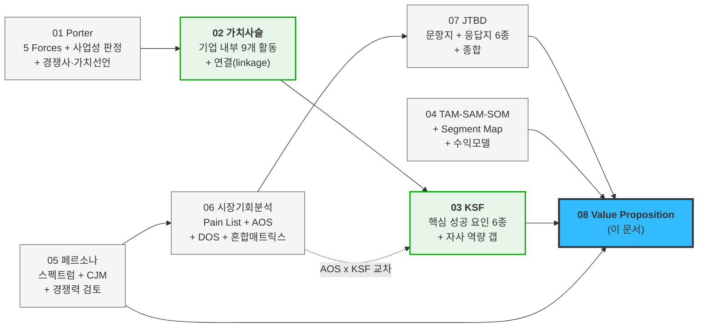
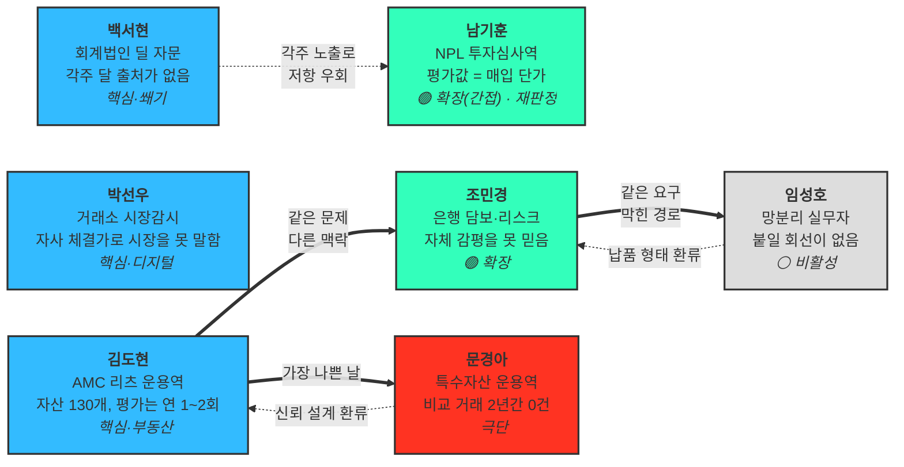
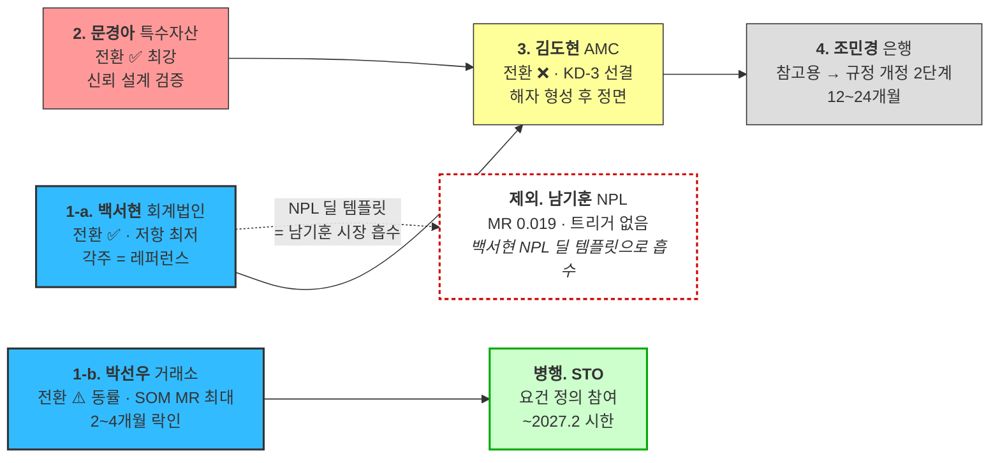
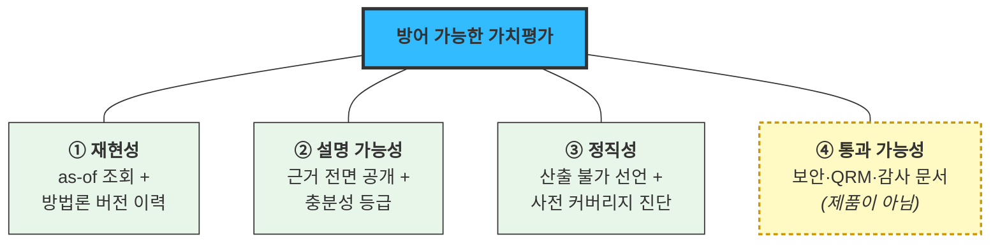
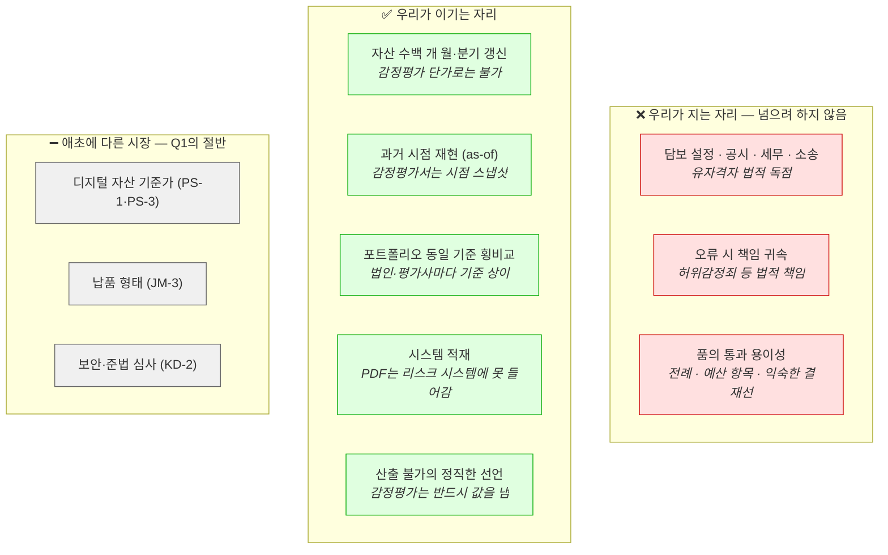
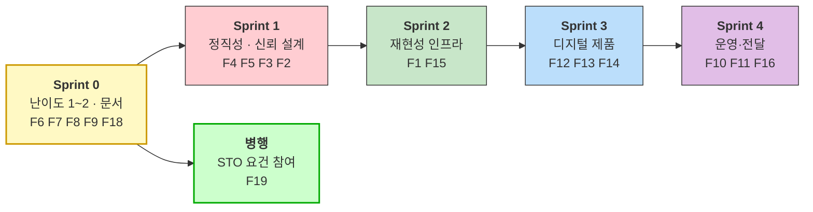

# Value Proposition — 자산 가치평가 인프라 (조각투자·토큰증권 포함)

| 항목 | 내용 |
|---|---|
| **사용 모델** | **Claude Opus 5 (1M context)** — 모델 ID `claude-opus-5[1m]` |
| **Effort Level** | **High** |
| **작성일** | 2026-08-13 |
| **사업 정의** | 상업용 부동산 · 디지털 자산 · 조각투자/토큰증권 기초자산의 시장가치를 지속 산출해 API·파일로 금융기관 시스템에 공급하는 **Institutional Valuation Infrastructure** |
| **문서 성격** | 기존 시장분석 7개 챕터를 통합한 **Value Proposition 정의서**. 아래 §9의 검증 한계를 반드시 함께 읽으십시오 |

### 참조 계보 — 이 문서가 어디서 왔는가



> 💡 **02·03이 이 문서에 기여하는 것은 "무엇을 할지"가 아니라 "무엇이 빠졌는지"입니다.** 가치사슬은 **가치가 만들어지는 활동**을, KSF는 **AOS가 못 보는 필수 요인**을 알려줍니다 → §6-4 · §7-5

| 참조한 문서 | 이 문서에서 쓰인 곳 |
|---|---|
| [01-07 Porter 5 Forces](../../01_porters-five-forces/07_분석_자산가치평가-인프라.md) · [01-08 사업성 판정](../../01_porters-five-forces/08_검토_사업성-판정.md) · [01-09 경쟁사·가치선언](../00_리서치_경쟁사-가치선언.md) | §4 기존 대안 · §7 Proof |
| **[02-01 가치사슬](../../02_value-chain/01_분석_자산가치평가-인프라.md)** | **§6-4 활동 배분 · §7-5 투자 순서** |
| **[03-01 KSF](../../03_ksf/01_분석_자산가치평가-인프라.md)** | **§6-4 KSF 대응 · §7-5 유형 C 경고** |
| [04-01 TAM-SAM-SOM](../../04_tam-sam-som/02_사례_자산가치평가/01_TAM-SAM-SOM_산정.md) · [04-02 Segment Map](../../04_tam-sam-som/02_사례_자산가치평가/02_market-segment-map.md) · [04-03 수익모델](../../04_tam-sam-som/02_사례_자산가치평가/03_수익모델과-매출시나리오.md) | §0-2 시장 규모 |
| [05-02 페르소나 스펙트럼](../../05_페르소나/02_사례_자산가치평가_스펙트럼-종합.md) · [05-03 고객여정지도](../../05_페르소나/03_사례_고객여정지도.md) · [05-06 NPL 편입](../../05_페르소나/06_검토_NPL-기업부동산-편입.md) · [05-07 감정평가 경쟁력](../../05_페르소나/07_검토_감정평가법인-경쟁력.md) | §1 Pain/Needs · §6 차별가치 |
| [06-01 Pain List](../../06_시장기회분석/01_사례_pain-list.md) · [06-02 AOS](../../06_시장기회분석/02_사례_aos-scoring.md) · [06-03 DOS](../../06_시장기회분석/03_사례_dos-scoring.md) · [06-04 혼합매트릭스](../../06_시장기회분석/04_사례_aos-dos-매트릭스.md) | §1-4 클러스터 · §8 우선순위 |
| [07-01 문항지](../../07_jtbd/01_사례_인터뷰-문항지.md) · [07-02~07 응답지 6종](../../07_jtbd/) | §2 JTBD · §3 Outcome |

---

## 0. 전제 — 시장과 제품 구조

### 0-1. 제품이 둘이라는 것이 이 문서 전체의 전제

[Segment Map §1](../../04_tam-sam-som/02_사례_자산가치평가/02_market-segment-map.md)의 결론이 **"두 시장은 같은 제품으로 팔 수 없다"** 였습니다. Value Proposition도 상위 하나 · 하위 둘로 갈립니다.

```
Institutional Valuation Infrastructure
"거래가 없거나 시장이 분산된 자산도, 금융기관이 그대로 쓸 수 있는 현재가치를 근거와 함께 제공한다"
   │
   ├── CRE Valuation API              (부동산 — 평가 지연 해결 · 문서로 승부)
   ├── Digital Asset Reference Price  (디지털 자산 — 가격 신뢰 해결 · 가동률로 승부)
   └── STO 기초자산 Valuation         (조각투자·토큰증권 — 이해상충 회피 · 제도로 승부)
```

> 💡 **세 번째 축이 이번에 추가됐습니다.** [경쟁사 리서치 §1](../00_리서치_경쟁사-가치선언.md)에서 확인한 대로, 토큰증권 협의체가 **"기초자산의 객관적 가치평가 가능성"** 을 제도 요건으로 명시하고 업계가 **"외부 가치평가 비용을 어떻게 낮출 것인가"** 를 과제로 올렸습니다. **다른 두 축과 달리 이 축에서는 수요가 제도로 강제됩니다.**

### 0-2. TAM-SAM-SOM + Market Segment *(Optional 항목)*

| 층위 | 값 | 단위 주의 |
|---|---|---|
| **TAM** *(자산 스톡)* | 리츠 AUM **127.5조** · 건설·부동산 기업대출 **361조** · 가상자산 시총 **87.2조** | 항목 간 중복 가능 — 단순 합산(575.7조) 금지 |
| **SAM** *(서비스 매출)* | **171개 기관 · 연 105.6억 원** *(NPL·회계법인 편입 + [남기훈 WTP 재판정](../01_검토_남기훈-세그먼트-재판정.md) 반영)* | 계약단가는 검증 전 추정치 |
| **SOM** *(3년)* | **40개 기관 · 연 23.75억 원 ARR** | SOM 목표 범위(20~50개·10~30억) 내 |
| **국내 천장** | SAM **120~150억** · SOM **30억대** | [사업성 판정 §3](../../01_porters-five-forces/08_검토_사업성-판정.md) |
| **STO 축 별도** | 국내 토큰증권 2024년 **34조** → 2030년 **367조** (PwC 추정) | 추정 기관별 편차 큼 |

**세그먼트 우선순위 — 시장 크기가 아니라 시장 비중 × 구매 속도**

| 페르소나 | 세그먼트 | SAM 매출 | SAM MR | SOM MR | 도입 기간 | 진입 순서 |
|---|---|---:|---:|---:|---|:---:|
| **박선우** | 거래소 (18개사) | 27억 | 0.256 | **0.295** | 2~4개월 | **1** |
| **백서현** | 회계법인 딜자문 (6곳) | 3.6억 | 0.034 | 0.076 | 딜 단위 | **1 (쐐기)** |
| **김도현** | 대형 AMC (25곳) | 15억 | 0.142 | **0.202** | 6~18개월 | 2 |
| **조민경** | 은행·보험 (30곳) | 24억 | **0.227** | 0.135 ▼ | 12~24개월 | 3 |
| **문경아** | AMC 내 특수자산 | 4.5억 | 0.043 | 0.061 | *(김도현 동반)* | *(신뢰 방어)* |
| **남기훈** ⚠️ | NPL 전업 (8곳) | **2.0억** ▼ | **0.019** ▼ | **0.032** ▼ | 1~3개월 | **직접 제외**<br/>*(백서현 경유)* |

> 🔴 **조민경만 SOM에서 비중이 41% 떨어집니다.** SAM 2위 세그먼트인데 도입이 12~24개월이라 3년 안에 13%밖에 못 잡습니다. **로드맵을 SAM으로 짜면 은행부터 가게 되는데 그것은 3년을 기다리는 계획입니다.**
>
> ⚠️ **남기훈은 재판정으로 직접 영업 대상에서 제외됐습니다.** 계약단가 가정이 8,000만 → **2,500만 원**(인터뷰 WTP 상한)으로 내려가 MR이 **−67%** 했고, [사업성 판정 조건 1(규제·사건 트리거)](../../01_porters-five-forces/08_검토_사업성-판정.md)에 걸립니다 — *"저흰 감독 검사 대상이 아닙니다."* 상세 근거는 **[남기훈 세그먼트 재판정](../01_검토_남기훈-세그먼트-재판정.md)** 참조.

---

## 1. 페르소나 및 CJM 기반 고객별 핵심 문제 (Pain, Needs)

### 1-1. 대상 페르소나 — 스펙트럼 4유형 + 편입 2종

[페르소나 스펙트럼 종합](../../05_페르소나/02_사례_자산가치평가_스펙트럼-종합.md)의 대표 4종에 [NPL·회계법인 편입 검토](../../05_페르소나/06_검토_NPL-기업부동산-편입.md)의 2종을 더한 **6종이 JTBD 인터뷰 대상**이었고, 비활성 1종을 전환 조건 관리용으로 유지합니다.



### 1-2. 페르소나별 핵심 Pain과 Needs — CJM 단계 태그 부착

**Pain은 [고객여정지도](../../05_페르소나/03_사례_고객여정지도.md)의 `이탈 지점` 열에서만 추출**했습니다. 사람이 실제로 멈추는 자리가 곧 Pain이라는 규칙입니다. `실제 AOS`는 JTBD 인터뷰로 갱신된 값입니다.

#### 🔵 김도현 — AMC 리츠 운용역 *(핵심 · 부동산)*

| ID | Pain *(고객의 말로)* | Needs *(해결된 상태)* | CJM | 가설→실제 AOS |
|---|---|---|:---:|:---:|
| **KD-1** | 분기 공시에 **반년 전 감정평가액을 그대로** 넣는다. 자산 130개 중 40개만 손대고 나머지는 이월한다 | 마감 시점에 자산 전량의 현재가치가 이미 갱신돼 있는 상태 | S1 | 2.4 → **1.8** ▼ |
| **KD-2** | 보안·준법 심사에서 **문서 미비로 반려**된다. *"반려된 뒤로 아예 시도를 안 한다"* | 내가 챙기지 않아도 심사 자료가 먼저 준비돼 통과되는 상태 | S5 | 3.2 → **3.2** — |
| **KD-3** | 감사인이 방법론을 문제 삼으면 **쓰던 것도 중단**한다 | 감사인 질문에 문서 한 장으로 답하고 사용을 이어가는 상태 | S7 | 2.0 → **3.0** ▲ |

> **인터뷰가 순위를 뒤집었습니다.** KD-1(주기)은 *"이월해도 업무는 돌아간다"* 로 I 4→3 하향, KD-3(감사 대응)은 *"감사에서 걸리는 것, 그거 하나"* 로 S 3→2 하향돼 AOS가 역전됐습니다. **주기 문제에는 우회로(이월)가 있고 감사 대응에는 없습니다.**

#### 🔵 박선우 — 거래소 시장감시 *(핵심 · 디지털)*

| ID | Pain | Needs | CJM | 가설→실제 AOS |
|---|---|---|:---:|:---:|
| **PS-1** | **자사 체결가가 시장을 대표한다고 말할 수 없다.** *"자기 자신을 검증할 수 없다"* | 우리 시세와 기준가의 괴리를 실시간으로 설명할 수 있는 상태 | S1 | 3.0 → **3.0** — |
| **PS-3** | 신규 상장 직후·저유동성 구간에 **기준선을 만들 수 없다.** *"그 구간이 제일 무섭다 / 연 20건 넘는다"* | "지금은 기준가를 낼 수 없다"를 시스템이 선언해 주는 상태 | S3 | 3.2 → **4.0** ▲ |
| **PS-2** | 상시 결합이라 **공급자 장애가 곧 우리 장애**가 된다 | 장애가 전파되지 않거나, 우리가 먼저 알고 대응하는 상태 | S7 | 1.0 → **1.0** — |

> 🔴 **PS-2는 기회가 아니라 게이트입니다.** AOS 1.0으로 최하위인데 **Anxieties의 1·2번이 전부 PS-2**입니다. *"그쪽이 죽으면 우리가 같이 죽는다"* — SLA 99.9%·장애 통보 5분·폴백 값이 없으면 나머지 점수가 의미가 없습니다.

#### 🟢 조민경 — 은행 담보·리스크 *(확장)*

| ID | Pain | Needs | CJM | 가설→실제 AOS |
|---|---|---|:---:|:---:|
| **JM-2** | **"2년 전 그 시점에 당신 모델은 뭐라 했나"** 를 확인할 방법이 없다. 소명에 두 달이 걸렸다 | 과거 임의 시점의 산출값과 방법론을 그대로 재현하는 상태 | S3 | 3.2 → **4.0** ▲ |
| **JM-1** | **자체 감정평가가 담보가를 높게 잡는다**는 지적을 받았는데 반증할 독립 데이터가 없다 | 감독 지적에 외부 독립 값으로 보완·반박할 수 있는 상태 | S1 | 3.0 → **2.4** ▼ |
| **JM-3** | 위탁·보안 이중 심사를 통과해야 하는데 **API 전용이면 시작도 못 한다** | 회선을 열지 않고도 심사를 통과해 도입하는 상태 | S5 | 3.2 → **2.4** ▼ |

> **JM-2가 이 인터뷰의 전부였습니다** — *"as-of 조회, 그거 하나 때문에 오늘 시간을 낸 겁니다."* 반대로 JM-1은 *"외부 감평 의뢰를 늘렸다"* 는 작동하는 대체 수단이 있어 하향, JM-3은 *"지금도 파일로 받는 게 있다"* 는 전례가 있어 하향됐습니다.

#### 🔴 문경아 — 특수자산 운용역 *(극단)*

| ID | Pain | Needs | CJM | 가설→실제 AOS |
|---|---|---|:---:|:---:|
| **MK-1** | **근거 없이 숫자만 나온다.** *"300km 떨어진 물건 사례였다. 그때 바로 해지"* | 값과 함께 사례 건수·충분성 등급이 같은 화면에 있는 상태 | S3-b | 4.0 → **4.0** — |
| **MK-2** | 반경 내 유사 거래가 **2년간 0건**이라 평가 지연이 아니라 **평가 불가**다 | 산출 불가를 이유와 함께 명시적으로 받는 상태 | S3-a | 3.0 → **4.0** ▲ |
| **MK-3** | **내 자산 중 몇 개가 되는지 미리 알 수 없어** 포트폴리오를 통째로 포기한다 | 계약 전에 "자산 100개 중 78개 가능"을 아는 상태 | S3-c | 2.4 → **4.0** ▲▲ |

> 🔴 **MK-3이 이 프로젝트 최대 오판이었습니다.** 가설 I를 3으로 매겼는데 실제는 5입니다 — *"그게 제일 중요합니다. 지금은 계약하고 나서야 안 되는 걸 알거든요."* **기능 요구가 아니라 계약 전 신뢰 문제**였습니다. Q4(니치)에서 Q1으로 올라옵니다.

#### 🟢 남기훈 — NPL 투자심사역 *(확장 · 간접 채널 — [재판정](../01_검토_남기훈-세그먼트-재판정.md))*

**NG-1을 지역·자산군으로 분할했습니다.** 하나의 Pain에 Satisfaction이 두 개인 경우를 AOS 수식이 표현하지 못하기 때문입니다.

| ID | Pain | Needs | CJM | 가설→실제 AOS | DOS *(갱신 MR 0.019)* |
|---|---|---|:---:|:---:|---:|
| **NG-1a** | *(서울·경기)* 사내 DB가 실제로 더 정확하다. **오차 8% 대 12%** | — *(요구 없음)* | S2 | 0.6 → **0.0** | **−0.038** *(음수)* |
| **NG-1b** | *(지방·비주거)* **사내 DB 오차가 20%를 넘는데** 외부 데이터는 역량 외주화로 보인다 | 사내 모델과의 차이를 확인해 교차검증 도구로 쓰는 상태 | S2 | 0.6 → **2.4** ▲ | 0.038 |
| **NG-2** | 실사 마감 안에 안 나오면 **품질과 무관하게 그 딜을 통째로 못 쓴다.** 2주에 240건 | 실사 데드라인 안에 담보물 전량 산정이 끝나는 상태 | S6 | 2.0 → **2.0** — | 0.038 |
| **NG-3** | 과거 낙찰 결과와 **소급 대조가 안 되면** 믿을 근거가 없다 | 과거 낙찰 대비 정확도를 도입 전에 확인하는 상태 | S3 | 2.4 → **1.8** ▼ | 0.019 |

> ⚠️ **세 지표(AOS 최하위·DOS 유일한 음수·사분면 Q4)가 모두 "자원 회수"라고 판정한 NG-1에서 반대 답이 나왔습니다** — *"대조군이면 쓸 수 있습니다."* 원인은 **우리가 NG-1을 전국 단일 값으로 본 것**이었습니다.
>
> **분할해 보니 세 지표가 틀린 게 아니었습니다** — 서울·경기(NG-1a)는 **AOS 0.0 · DOS 음수로 완전 과잉충족이 확정**되고, 지방·비주거(NG-1b)만 AOS 2.4로 올라옵니다. **우리가 두 개를 하나로 묶어 물었던 것이 오류였습니다.**
>
> 🔴 **다만 분할이 판정을 뒤집지는 않습니다.** NG-1b의 DOS는 **0.038로 여전히 최하위권**입니다 — 미충족은 실재하나 **시장이 너무 작습니다**(세그먼트 매출 2.0억, MR 0.019). 그래서 남기훈은 **핵심 → 확장(간접 채널)으로 재분류**됐습니다.

#### 🔵 백서현 — 회계법인 딜 자문 *(핵심 진입점 · 쐐기)*

| ID | Pain | Needs | CJM | 가설→실제 AOS |
|---|---|---|:---:|:---:|
| **BS-2** | 품질관리(QRM) 심사에서 **출처 신뢰성이 인정 안 되면 인용 자체가 불가**하다. *"국내 것은 제가 새로 올린 적이 없습니다"* | 심사를 통과해 법인 표준 인용 출처로 등록된 상태 | S4 | 2.0 → **3.0** ▲ |
| **BS-1** | 보고서에 넣을 가치 근거를 **딜마다 새로 만들어야** 한다. 딜당 4~6주 중 비교사례 수집이 최장 | 딜이 바뀌어도 같은 출처를 각주로 재사용하는 상태 | S2 | 2.4 → **2.4** — |
| **BS-3** | 고객사가 근거에 이의를 제기하면 **그 딜 이후로 못 쓴다** | 상대측 반박에 방법론 문서로 답할 수 있는 상태 | S7 | 1.6 → **1.2** ▼ |

#### ⚪ 임성호 — 망분리 실무자 *(비활성 · AOS 산출 제외)*

| ID | Pain | Needs | 관리 방식 |
|---|---|---|---|
| **IS-1~3** | 내부망에서 **외부 API를 호출할 수 없어** 제품을 보지도 못한다. 미팅이 성사되지 않아 **실패 사유로도 기록되지 않는다** | 파일 배치 등으로 폐쇄망 안에서 같은 데이터를 받는 상태 | **AOS 계산 제외 — 전환 조건으로 관리.** 만족도 0이 "해결 안 됨"이 아니라 **"시도조차 없었음"** 을 뜻하므로 수식이 왜곡됩니다 |

### 1-3. CJM 이탈 지점 종합 — 어디서 죽는가

| 순위 | 구간 | 누구 | 왜 죽나 | 제품 성능 문제인가 |
|:---:|---|---|---|:---:|
| 1 | **S5 보안·준법 심사** | 김도현·조민경 | 문서 미비로 반려. 담당자는 이미 손을 뗌 | **✕ 아니오** |
| 2 | **S3-b 근거 확인** | 문경아 | 근거 없는 숫자 = 신뢰 상실 | △ 부분 |
| 3 | **S2 아키텍처 확인** | 임성호 | API only | **✕ 아니오** |
| 4 | **S2 Build vs Buy** | 남기훈 | 자체 평가 역량이 곧 경쟁력 — 외주화로 읽힘 | **✕ 아니오** |
| 5 | **S7 첫 장애** | 박선우 | 우리 장애가 고객 장애 | △ 운영 |
| 6 | **S4 QRM 심사** | 백서현 | 출처 신뢰성 미검증이면 인용 불가 | **✕ 아니오** |
| 7 | **S3 백테스트·소급 대조** | 조민경·남기훈 | as-of 조회 부재 | ⭕ 예 |
| 8 | **S6 마감 초과·연동 후 미사용** | 남기훈·김도현 | 실사 마감, 자산 매핑 부담 | △ 부분 |

> 🔴 **여덟 개 중 넷이 제품 성능과 무관합니다.** 값이 아무리 정확해도 **문서·납품 형태·프레이밍**에서 죽습니다. 이것이 §6 차별가치에 "비제품 자산"이 포함되는 이유입니다.

**게이트키퍼가 조직마다 다릅니다** — 김도현·조민경은 **정보보안·준법**, 백서현은 **품질관리(QRM)**, 남기훈은 **팀장의 한마디**(*"그거 우리가 하면 되잖아"*). 셋 다 결재자가 아닌데 무산시킬 수 있고, **준비할 자료가 완전히 다릅니다.**

### 1-4. Pain 클러스터 — 서로 다른 페르소나가 독립적으로 같은 것을 요구한 지점

| 클러스터 *(공통 Needs)* | 반복 | 해당 Pain | 클러스터 DOS |
|---|:---:|---|---:|
| **과거 시점을 그대로 재현하는 상태** | **3회** | JM-2 · NG-3 · *(감사 소급 대응)* | **0.770** *(개별 최고치보다 큼)* |
| **근거를 함께 제시할 수 있는 상태** | **3회** | KD-3 · MK-1 · BS-2 | 0.502 |
| **회선을 열지 않고 받는 상태** | **3회** | JM-3 · IS-1 · IS-2 | 0.654+ |
| 못 낼 때 못 낸다고 말해주는 상태 | 2회 | MK-2 · PS-3 | — |
| 대체하지 않고 대조하는 상태 | 2회 | **NG-1b · 조현우** *(회계법인 감사)* | — |
| 마감 안에 끝나는 상태 | 1회 | NG-2 | — |

> 💡 **상위 세 클러스터가 전부 "평가값의 정확도"가 아닙니다.** 재현성 · 설명 가능성 · 전달 경로입니다. **같은 요구가 세 번 독립적으로 나오면 옵션이 아니라 코어 사양입니다.**

---

## 2. JTBD 관점 — 고객 상황에 따른 목표 (Goal, Job)

### 2-1. JTBD 선언문 — 인터뷰 6인에서 추출

형식: **`[상황]일 때, 나는 [동기]하고 싶다. 그래서 [기대 결과]할 수 있도록.`**

#### 🔵 김도현

> **분기 마감 3주 전 자산 리스트를 열고 오래된 평가일을 발견했을 때, 나는 내가 만들지 않은 숫자로 공시 자산가치를 채우고 싶다. 그래서 감사인이 방법론을 물어도 내가 총대를 메지 않고 문서 한 장으로 답할 수 있도록.**

| 근거 발언 | 어느 Job 요소 |
|---|---|
| *"제가 만든 숫자가 아니라는 것. 그게 제일 컸습니다"* | 동기 |
| *"감사인 질문에 화면 하나 띄우면 제가 방어할 일이 없어집니다"* | 기대 결과 |
| *"틀리면요. 제 엑셀은 제 선에서 끝나는데 외부 데이터는 공시에 들어가면 문제가 커집니다"* | 불안 |

#### 🔵 박선우

> **새벽 3시에 신규 상장 종목의 가격이 튀는데 룰이 걸리지 않을 때, 나는 우리 가격을 대조할 외부 잣대를 갖고 싶다. 그래서 "우리만 이상한 게 아니다"를 말이 아니라 숫자로 증명할 수 있도록.**

| 근거 발언 | 어느 Job 요소 |
|---|---|
| *"자사 체결가로는 자기 자신을 검증할 수 없으니까요"* | 상황 |
| *"'우리만 이상한 게 아니다'를 숫자로 말할 수 있게 됩니다"* | 기대 결과 |
| *"커뮤니티가 먼저 알고 우리가 나중에 알았습니다. 그게 제일 창피했어요"* | Push |

#### 🟢 조민경

> **감독 검사 예고가 뜨고 2년 전 담보 산정 근거를 소명해야 할 때, 나는 그때 시점의 값과 방법론을 그대로 다시 꺼내고 싶다. 그래서 두 달 걸리던 소명을 하루로 줄이고 "외부 독립 출처로 교차검증하고 있습니다"라고 말할 수 있도록.**

| 근거 발언 | 어느 Job 요소 |
|---|---|
| *"as-of 조회요. 그거 하나 때문에 오늘 시간을 낸 겁니다"* | 동기 |
| *"두 달 걸리던 소명이 하루로 줄어듭니다"* | 기대 결과 (정량) |
| *"규정 근거요. 그게 없으면 아무리 좋아도 못 씁니다"* | 불안 |

#### 🔴 문경아

> **마감 직전에 지방 물류센터 사례를 반나절 찾고도 빈손일 때, 나는 "없다"는 확답을 근거와 함께 받고 싶다. 그래서 안 되는 자산은 처음부터 빼고 되는 자산에만 힘을 줄 수 있도록.**

| 근거 발언 | 어느 Job 요소 |
|---|---|
| *"'없다'는 확답이요. 있는 척하는 숫자 말고요"* | 동기 |
| *"'없다'는 걸 확인하는 데 반나절이 든다는 것"* | 상황 |
| *"안 되는 건 처음부터 빼고 시작하면 됩니다"* | 기대 결과 |
| *"안심됐습니다. 그때부터 나머지 숫자도 믿기 시작했습니다"* | **정직성 → 신뢰 전이** |

#### 🔵 남기훈

> **매각 공고를 받고 2주 안에 담보물 240건을 실사해야 할 때, 나는 사내 모델과 어긋나는 물건만 골라내고 싶다. 그래서 240건을 다 보는 대신 20~30건만 다시 보고 실사 시간을 절반으로 줄일 수 있도록.**

| 근거 발언 | 어느 Job 요소 |
|---|---|
| *"차이 리포트요. 값이 아니라 '우리랑 다른 건 여기'를 짚어주는 거요"* | 동기 |
| *"240건 다 볼 필요 없이 20~30건만 다시 보면 됩니다"* | 기대 결과 (정량) |
| *"블랙박스면 심의에서 '이 숫자 어디서 나왔냐'에 답을 못 하면 끝입니다"* | 불안 |

> 🔴 **이 선언문이 제품 사양을 바꿉니다.** 남기훈이 사려는 것은 **기준가가 아니라 이상치 탐지**입니다. [경쟁력 검토](../../05_페르소나/07_검토_감정평가법인-경쟁력.md)에서 "대체가 아니라 교차검증으로 프레이밍"이라 적었는데, **프레이밍이 아니라 산출물 자체가 달라야** 합니다.

#### 🔵 백서현

> **딜을 수임하고 보고서에 넣을 가치 근거를 또 처음부터 만들 때, 나는 내 이름이 아닌 다른 이름이 들어간 출처를 각주로 달고 싶다. 그래서 딜이 바뀌어도 같은 출처를 재사용하며 방어 논리를 축적할 수 있도록.**

| 근거 발언 | 어느 Job 요소 |
|---|---|
| *"제 이름 말고 다른 이름이 들어간 근거요"* | 동기 |
| *"매번 같은 출처를 쓰니까 방어 논리가 축적됩니다"* | 기대 결과 |
| *"QRM이 안 받아주면 헛일입니다. 그게 전부예요"* | 유일한 불안 |

### 2-2. Job 계층 — 기능적 Job 아래에 감정적·사회적 Job이 있다

| Job 유형 | 내용 | 근거 |
|---|---|---|
| **Main Job**<br/>*(기능적)* | 거래가 드물거나 시장이 분산된 자산의 **현재가치를 근거와 함께 확보**해 금융 의사결정·공시·감사에 투입한다 | 6인 공통 |
| **Related Job** | 그 값을 **내부 시스템·보고서·감시 시스템에 적재**하고, 과거 시점을 **소급 재현**한다 | KD-1·JM-2·NG-2·BS-1 |
| **Emotional Job** | **"내가 총대를 메지 않는다"** — 틀렸을 때 책임이 개인에게 오지 않게 한다 | 김도현 *"제가 방어할 일이 없어집니다"* · 남기훈 *"우리 모델로 틀리면 그건 괜찮아요"* |
| **Social Job** | 감사인·감독당국·투자심의·상대측 자문사 앞에서 **"우리가 만든 값이 아니다"** 를 증명한다 | 백서현 *"제 이름 말고 다른 이름"* · 조민경 *"외부 독립 출처로 교차검증"* |

> 💡 **Emotional·Social Job이 이 사업의 실제 구매 동기입니다.** 여섯 명 중 다섯 명이 정확도가 아니라 **책임 회피와 외부 권위 조달**을 말했습니다. 이것이 "감정평가법인이 파는 것은 값이 아니라 면책"이라는 [경쟁력 검토 §3](../../05_페르소나/07_검토_감정평가법인-경쟁력.md)의 결론과 정확히 같은 축입니다.

### 2-3. 전환 동인 판정 — `Push + Pull > Habits + Anxieties`

| 페르소나 | ① Push | ② Pull | ③ Habits | ④ Anxieties | 판정 | 전환 조건 |
|---|:---:|:---:|:---:|:---:|:---:|---|
| **문경아** | ★★★★★ | ★★★★☆ | ★★☆☆☆ | ★★★☆☆ | **9 > 5 ✅ 예** | **잃을 것이 없음.** 혼자 하는 일이라 바꿔도 남의 일이 안 늘어남 |
| **백서현** | ★★★★☆ | ★★★★☆ | ★★☆☆☆ | ★★★★☆ | **8 > 6 ✅ 예** | 저항 최저. **유일한 장벽이 QRM 하나로 특정** |
| **조민경** | ★★★★☆ | ★★★★★ | ★★★★☆ | ★★★★☆ | **9 > 8 ✅ 예(근소)** | **"참고용" 범위에서만.** 산정 직접 반영은 규정 개정 사안 |
| **박선우** | ★★★★★ | ★★★★☆ | ★★★★☆ | ★★★★★ | **9 = 9 ⚠️ 동률** | **SLA·폴백이 Anxieties를 한 칸 낮추면 전환.** 개발팀 build 주장이 한 칸 세지면 무산 |
| **남기훈** ⚠️ | ★★★☆☆<br/>*(최저)* | ★★★★☆ | ★★★★☆ | ★★★★☆ | **7 < 8 ❌ 아니오** | **직접 전환 불가로 재판정.** 조건(지방·비주거 한정 + 차이 리포트 + 연 2~3천)을 다 맞춰도 **매출 2.0억** → 백서현 채널로 흡수 |
| **김도현** | ★★★★☆ | ★★★★☆ | ★★★★☆ | ★★★★★ | **8 < 9 ❌ 아니오** | **Anxieties 단일 최대이고 내용이 전부 KD-3(감사 대응).** 그것 없이는 전환 자체가 없음 |

> 🔴 **가장 큰 세그먼트(김도현)가 현재 조건에서 전환되지 않고, 가장 작은 세그먼트(문경아)가 가장 강하게 전환됩니다.** 이 역전이 §5 진입 순서와 §8 MVP 범위를 결정합니다.
>
> **남기훈만 "조건을 맞춰도 안 하는" 판정입니다.** 다른 페르소나는 전환 조건이 곧 제품 사양인데, 남기훈은 조건을 다 충족시켜도 **세그먼트 매출(2.0억)이 필요 기능(F23 권리관계, 난이도 5)의 개발비를 회수하지 못합니다.** **Pain의 강도와 사업 타당성이 갈리는 유일한 사례**입니다.

---

## 3. 고객이 원하는 Outcome — 측정 가능한 형태

### 3-1. 페르소나별 Outcome 지표

**전부 인터뷰 발언에서 나온 수치**입니다. 우리가 설정한 목표가 아니라 **고객이 말한 현재값과 기대값**입니다.

| # | Outcome | 현재 (As-Is) | 목표 (To-Be) | 측정 방법 | 출처 |
|:---:|---|---|---|---|---|
| **O1** | **감독 소명 소요 시간** | **2개월** | **1일** | 소급 요구 접수 → 근거 제출 완료까지 | 조민경 *"두 달 걸리던 소명이 하루로"* |
| **O2** | **실사 재검토 건수** | 240건 전량 | **20~30건** (약 90% 감소) | 사내 모델과 20%+ 괴리 건만 추출 | 남기훈 *"240건 → 20~30건, 실사 시간 절반"* |
| **O3** | **"사례 없음" 확인 시간** | 물건당 **반나절** | **30초** | 조회 → 산출 불가 판정 반환 | 문경아 *"없으면 없다고 30초 만에"* |
| **O4** | **분기 갱신 자산 비율** | 130개 중 **40개 (31%)** | **100%** | 마감 시점 갱신 자산 / 전체 자산 | 김도현 *"나머지는 그냥 이월했어요"* |
| **O5** | **장부값 기준일 지연** | 평균 **7~8개월** *(최대 1년+)* | **≤ 1개월** | 마감일 − 평가 기준일 | 김도현 K2 |
| **O6** | **아침 수동 대조 시간** | **30~40분/일** | **0분** (알람 수신) | 대시보드 대조 작업 시간 | 박선우 *"수동 대조가 제일 오래"* |
| **O7** | **감사인 설명 소요** | **30분** | **5분** | 질의 → 자료 제시 완료 | 문경아 M6 *"자료가 있었으면 5분"* |
| **O8** | **딜당 근거 확보 기간** | 4~6주 중 **비교사례 수집이 최장** | 각주 **즉시 재사용** | 딜 착수 → 근거표 완성 | 백서현 *"매번 처음부터"* |

### 3-2. 고객이 명시한 수용 임계값 — 이것을 못 넘으면 Outcome이 무효

| 임계값 | 값 | 못 넘으면 | 출처 |
|---|---|---|---|
| **산출 불가 비율** | **≤ 30%** | *"절반 이상이면 해지합니다"* | 문경아 결정적 질문 |
| **커버리지 사전 고지** | **계약 전 필수** | *"모르고 계약했다가 절반이 안 나오면 그건 속은 거죠"* | 문경아 |
| **데이터 지연** | **≤ 5초** | *"5초 넘으면 저희 감시엔 못 씁니다"* | 박선우 Q1 |
| **가동률 / 장애 통보** | **99.9% / 5분 이내 + 폴백 값** | 실시간 연동 불가 | 박선우 P8 |
| **백테스트 기간** | **3년** *(5년이면 더 좋음)* | 검사 주기를 못 덮음 | 조민경 J3 |
| **NPL 정확도** | 전국 평균 12%는 무의미 · **지방만 떼서 오차 ≤ 15%** | *"우리가 20% 넘는 구간이니까요"* | 남기훈 N6 |
| **미산출 시 대체값** | **빈칸 금지 — 폴백 필수** | *"빈칸만 오면 감시가 멈춥니다"* | 박선우 P7 |

> 🔴 **마지막 줄이 중요합니다.** 문경아는 *"없다고 말해주면 안심"* 인데 박선우는 *"미산출일 때 뭘 대신 볼지를 같이 줘야 한다"* 입니다. **같은 기능인데 요구 형태가 정반대** — 사람이 보는 화면과 시스템이 받는 피드를 분리해야 합니다.

### 3-3. 지불의사(WTP) — Outcome의 가격 상한

| 페르소나 | 현재 지출 / 견적 | WTP 판정 | 우리 가격표 대비 |
|---|---|---|---|
| **박선우** | 해외 벤더 견적 **연 1.5~2억** (미도입 — 원화 미반영) | 조건 충족 시 **그 정도는 지불 가능** | Exchange 플랜(1.2~2.4억) **정합** |
| **김도현** | 감정평가 **연 8,000만 원** | 그 금액이 상한. *"감정평가보다 싸야 의미가 있어요"* | Professional(4,800만~8,400만) **정합** |
| **백서현** | 해외 벤더 법인 구독 有 · 국내 상업용은 **마땅한 게 없음** | QRM 등록 시 **법인 전체 사용** | 팀 소액 → 법인 확장 구조 필요 |
| **조민경** | 감독 지적 후 **외부 감평 비용 2배 증가** | 참고용은 부서장 전결 / 산정 반영은 규정 개정 **1년+** | 2단계 진입 필요 |
| **남기훈** | 데이터 구독료 **연 3,000만 원** | **연 2~3천이 상한** — 지방·비주거 한정 | ⚠️ **SAM 가정(8,000만)의 1/3** |
| **문경아** | *(김도현 예산 내)* | 산출불가 30% 이하 + 사전 고지 조건 | 별도 과금 아님 |

> ⚠️ **남기훈 세그먼트의 SAM·DOS를 하향해야 합니다.** *"쓰겠다"와 "사겠다"의 크기가 다릅니다* — [DOS에서 8,000만 원으로 잡았는데](../../06_시장기회분석/03_사례_dos-scoring.md) 실제 상한은 그 1/3입니다. 판정을 **"철수"에서 "저가·한정 범위"로** 바꾸고 매출 가정을 낮춰야 합니다.

---

## 4. 기존 대안 (Competitor / Substitute)

### 4-1. 대안은 네 계층이고, 대부분이 경쟁 제품이 아니다

[페르소나 대체 솔루션 12종 중 경쟁 제품은 0개](../../05_페르소나/01_사례_자산가치평가.md)였습니다. 전부 엑셀·전화·내부 규정·직전 평가서 이월입니다.

| 계층 | 대안 | 위협 | 누구의 대안인가 |
|---|---|:---:|---|
| **① 현상 유지** | 엑셀 롤포워드 · 수기 · 전화 · 아무것도 안 함 | ★★★★★ | **전원** |
| **② 제도적 대체재** | 감정평가서 *(법적 효력 + 품의 통과 용이)* | ★★★★☆ | 김도현·조민경·백서현 |
| **③ 고객 내재화** | 사내 DB·자체 감평 조직·자사 지수 | ★★★★☆ | 남기훈·조민경·박선우 |
| **④ 상용 경쟁 제품** | 해외 인덱스 벤더 · 국내 AI 시세 · CRE 데이터 플랫폼 | ★★★☆☆ | **박선우만 정면** |

> 💡 **④가 존재하는 전선은 박선우 축 하나뿐입니다.** [Porter 분석 §4-3](../../01_porters-five-forces/07_분석_자산가치평가-인프라.md)에서 "디지털 인덱스는 우리와 밸류체인 점유 구간이 거의 같다"고 한 것이 이 뜻입니다.

### 4-2. 주요 경쟁사 — 5축 11사업자 요약

[경쟁사 리서치](../00_리서치_경쟁사-가치선언.md)에서 검증한 결과입니다. **각 사의 가치 선언문은 그 문서에서 도출한 것**이며 빅밸류만 공식 슬로건입니다.

| 축 | 사업자 | 규모 | 도출된 가치 선언 | 우리와의 관계 |
|---|---|---|---|---|
| **① 제도·공적** | **한국부동산원** | 공시가격·국가통계 전담 | *"국가가 말하는 하나의 숫자를 무료로"* | **무료 경쟁자.** 2025년 "정책인프라기관" 선언으로 가공 영역 진입 중 |
| | **대형 감정평가법인군** | 업계 **1조 1,629억**(2023) · 13개 법인 **9,218억**(2024, 75%+) | *"값이 아니라 책임지는 사람을 판다"* | **정면 경쟁 불가.** 최우선 7종 중 충돌 항목 **0개** |
| **② 국내 데이터** | **빅밸류** | 금융위 **지정대리인** · 은행 담보심사 공급 | ***"데이터로 판단의 기준을 만듭니다"*** *(공식)* | 🔴 **포지션 정면 중복.** 국내 유일하게 인증 칸 통과 — 대가는 감정평가업계 **고발** |
| | **밸류맵 / 디스코** | 디스코 실거래 3,000만 건 *(2차 출처)* | *"정보를 모으고 정제 기술을 특허로 지킨다"* | 같은 문제 · **정반대 방어 전략**(비공개 특허) |
| **③ 글로벌** | **CoStar Group** | FY2025 매출 **32억 달러**(+19%) · 구독 **95%+** | *"업무를 시작할 때 가장 먼저 켜는 화면"* | 국내 커버리지 얇음이 유일한 방어선 |
| | **Altus Group** | 소프트웨어 ARR **1.979억 달러** · VMS ARR **1.669억 달러** | *"계산하는 문법을 제공한다. 숫자는 당신이 채운다"* | **경쟁이자 보완재** — 우리가 그 입력이 될 수 있음 |
| **④ 디지털 벤치마크** | **CF Benchmarks** | BRR이 **1,000억 달러+** 규제상품 기준 · 미국 현물 BTC ETF **11개 중 6개** · FCA 등록 | *"규제기관이 인정한 기준가만이 기준가다"* | 🔴 **우리의 유일한 완성형 참조 모델** — 인증을 제품 중심에 둠 |
| | **Kaiko** | 누적 투자 **7,700만 달러** · 기관 고객 **200+** | *"우리는 어느 거래소의 편도 아니다"* | **독립성 포지션 선점됨** → 우리는 원화·규제로 차별 |
| | **크로스앵글(쟁글)** | 시리즈B **170억 원** · 거래소 70+ · 발행사 3,000+ | *"법이 만들기 전에 우리가 공시를 만든다"* | "데이터"가 아니라 **"공시"** 라는 명명 전략 |
| **⑤ STO 제도** | **증권사 STO 진영** | 미래에셋 → 코빗 **97.7%** 인수 · 한투 자체 플랫폼 RFP | *"전통·디지털을 한 앱에서. 상품은 나중에"* | **최대 고객이자 잠재 경쟁자.** 지금은 접점만 있고 **상품이 비어 있음** |
| | **예탁결제원·협의체** | 전자증권법 **2027.2.4 시행** | *"무엇이 객관적 가치평가인지를 정의한다"* | **심판이자 수요 창출자** — 요건에 우리 필요성이 기록됨 |

### 4-3. 사라진 대안 — 1세대 부동산 조각투자의 붕괴

| 사업자 | 결과 | 사유 |
|---|---|---|
| **카사코리아** | 2026.8.10 종료 *(보도)* · 2025년 매출 5,355만 원 · 순손실 61억 원 | 혁신금융 지정 만료 후 **투자중개업 인가 미취득** |
| **펀블** | 플랫폼 종료·청산 | 동일 |
| **에이판다** | 에잇퍼센트 인수 | 재편 |

> 🔴 **우리에게 주는 함의**: ① 규제 샌드박스는 시한부 유예다(빅밸류 지정대리인도 같은 성질인지 확인 필요) ② **인가가 필요 없는 데이터 공급자 포지션이 이 구조에서 살아남는 자리다** ③ 조각투자 사업자 소멸로 **기초자산 평가·신탁 공백이 실제로 발생**했다.

### 4-4. 대안이 구조적으로 못 하는 것 — 우리 진입 지점

| Needs | 감정평가서 | 공공데이터 | 사내 DB | 해외 벤더 | 우리 |
|---|:---:|:---:|:---:|:---:|:---:|
| 자산 수백 개 월·분기 갱신 | ✕ *(단가)* | △ | ○ | — | **⭕** |
| **과거 시점 재현 (as-of)** | ✕ *(시점 스냅샷)* | ✕ | ✕ | △ | **⭕** |
| 포트폴리오 동일 기준 횡비교 | ✕ *(법인별 상이)* | △ | ○ | ○ | **⭕** |
| 시스템 적재 | ✕ *(PDF)* | △ | ⭕ | ⭕ | **⭕** |
| **산출 불가의 정직한 선언** | ✕ *(반드시 값을 냄)* | — | ✕ | ✕ | **⭕** |
| **원화 시장·국내 규제 대응** | ⭕ | ⭕ | ○ | **✕** | **⭕** |
| 법적 효력·책임 귀속 | **⭕** | ⭕ | ✕ | ✕ | **✕** |
| 품의 통과 용이성 | **⭕** | ⭕ | ⭕ | △ | **✕** |

> **마지막 두 줄이 우리가 지는 자리입니다.** 기술로 넘을 수 없고 넘으려 해서도 안 됩니다 — *"감정평가 대체"로 포지셔닝하는 순간 수수료 시장에 갇히고 법적 효력을 가진 쪽이 이깁니다.*

---

## 5. 우리 솔루션의 핵심 제안 (Value Proposition)

### 5-1. VP 선언문

> # **"우리는 값을 팔지 않습니다. 그 값을 당신이 방어할 수 있는 상태로 만들어 팝니다."**
>
> **거래가 드물거나 시장이 분산된 자산의 현재가치를, 산출 근거와 과거 시점 재현 이력과 함께 제공합니다. 낼 수 없을 때는 낼 수 없다고 먼저 말합니다.**

### 5-2. 이 선언이 세 문장으로 쪼개지는 이유 — Pain 클러스터와 1:1 대응

| VP 구성 요소 | 대응 클러스터 | 반복 | 대안 중 제공자 |
|---|---|:---:|---|
| **① 근거와 함께** *(설명 가능성)* | 근거를 함께 제시할 수 있는 상태 | 3회 | **없음** |
| **② 과거 시점 재현** *(재현성)* | 과거 시점을 그대로 재현하는 상태 | 3회 | **없음** |
| **③ 못 낼 때 못 낸다** *(정직성)* | 못 낼 때 못 낸다고 말해주는 상태 | 2회 | **없음** |
| *(전제)* **회선 열지 않고 전달** | 회선을 열지 않고 받는 상태 | 3회 | 없음 *(감정평가는 PDF로 우회)* |

> 🔴 **[경쟁사 11사 가치 선언문을 모아 보니, 이 셋을 가치로 내세운 사업자가 하나도 없었습니다.](../00_리서치_경쟁사-가치선언.md)** 고객 조사(Pain 클러스터 1·2·4위)와 경쟁 지형(빈칸)이 같은 지점을 가리킵니다. **두 프레임이 독립적으로 같은 답을 내면 그 답의 신뢰도가 올라갑니다.**

### 5-3. 제품별 VP — 같은 상위 명제, 다른 승부처

| | **CRE Valuation API** | **Digital Asset Reference Price** | **STO 기초자산 Valuation** |
|---|---|---|---|
| **핵심 고객** | 김도현 · 문경아 · 남기훈 · 백서현 | 박선우 | 증권사 · 발행사 |
| **해결 문제** | 평가 지연 · 평가 불가 | 가격 신뢰성 | **이해상충** |
| **VP 한 문장** | *"감정평가서 사이의 빈 구간을, 감사에 낼 수 있는 근거와 함께 채웁니다"* | *"원화 시장을 반영한 독립 기준가로, 당신의 가격이 이상한 게 아님을 증명합니다"* | *"발행자가 아닌 제3자가 산정했다는 사실 자체를 제공합니다"* |
| **승부처** | **문서** (보안·감사·품의) | **가동률** (SLA·폴백) | **제도** (요건 참여) |
| **대체재** | 감정평가 + 엑셀 | 해외 벤더 + 자사 지수 | **제도적으로 금지** |
| **현 단계** | MVP 주력 | MVP 주력 | 요건 정의 참여 |

> 💡 **STO 축만 대체재가 잘려 있습니다.** 발행자 자체 산정은 이해상충으로, 건별 감정평가는 비용으로 막힙니다. **[사업성 판정의 조건 1("규제·사건 트리거가 있는 세그먼트만")](../../01_porters-five-forces/08_검토_사업성-판정.md)을 가장 강하게 만족하는 축**입니다.

### 5-4. 진입 순서 — 전환 판정과 시장 비중이 함께 지지하는 순서



| 순서 | 근거 |
|---|---|
| **1-a 백서현** | 전환 ✅ · Habits ★★ 최저 · 유일 장벽 QRM · **각주가 곧 광고**. *"부동산·NPL 자문 4년째"* 라 **NPL 시장까지 함께 커버** |
| **1-b 박선우** | **SOM MR 0.295 최대** · 구매 2~4개월 · 결합 후 락인. 단 SLA·폴백 선결 |
| **2 문경아** | 전환 최강(9>5) · **신뢰 설계를 여기서 검증**하면 김도현 S7을 지킴 |
| **3 김도현** | **전환 ❌ — KD-3(감사 대응 근거) 없이는 불가.** 해자 형성 후 진입 |
| **4 조민경** | SAM 2위지만 SOM 비중 ▼41%. 참고용 선진입 → 규정 개정 2단계 |
| **병행 STO** | **2026.2 협의체 ~ 2027.2 시행 = 약 18개월 창** |
| ⚠️ **제외 남기훈** | MR 0.019 · **규제 트리거 없음**(조건 1 위반) · 백서현 1계약 = 남기훈 2.4계약. **응답자 본인이 회계법인을 더 나은 대상으로 지목** → [재판정](../01_검토_남기훈-세그먼트-재판정.md) |

---

## 6. 우리가 제공하는 차별적 가치

### 6-1. 네 개 축 — 세 개는 제품, 하나는 제품이 아니다



### 6-2. 축별 상세

#### ① 재현성 — 과거 시점을 그대로 다시 꺼낸다

| 항목 | 내용 |
|---|---|
| **제공** | as-of 조회(임의 과거 시점) + 방법론 버전 이력 + 백테스트 성적 공개(3~5년) |
| **왜 차별적인가** | 감정평가서는 **시점 스냅샷**이라 구조적으로 소급 불가. 경쟁 11사 중 이를 가치로 내세운 곳 **0곳** |
| **정량 Outcome** | **O1** 감독 소명 2개월 → 1일 |
| **클러스터 지지** | **3회 반복 · 클러스터 DOS 0.770 (전 항목 최고)** |
| **공신력 의존** | **무관** — 지금 팔 수 있음 |

#### ② 설명 가능성 — 값과 근거를 같은 화면에

| 항목 | 내용 |
|---|---|
| **제공** | 사례 목록·건수·거래시점 + 데이터 충분성 등급 + 신뢰구간 + 인용용 각주 포맷 |
| **왜 차별적인가** | **신뢰의 종류를 바꿉니다** — 감정평가는 *"유자격자가 서명했다"*(권위 기반), 우리는 *"직접 확인해보라"*(검증 기반). 권위 게임에서는 못 이깁니다 |
| **정량 Outcome** | **O7** 감사인 설명 30분 → 5분 · **O8** 딜당 각주 즉시 재사용 |
| **클러스터 지지** | 3회 반복 (KD-3 · MK-1 · BS-2) |
| **부수 효과** | 감사인·피감기업 양쪽에 팔 때의 **독립성 시비를 방법론 공개로 해소** |

#### ③ 정직성 — 못 낼 때 못 낸다고 말한다

| 항목 | 내용 |
|---|---|
| **제공** | 산출 불가 + 사유 코드 · **계약 전 커버리지 사전 진단** · 시스템용 폴백 값 |
| **왜 차별적인가** | **감정평가는 어떻게든 값을 냅니다.** 강점이 특수자산에서 약점이 되는 지점 |
| **인터뷰 증거** | 문경아 *"안심됐습니다. **그때부터 나머지 숫자도 믿기 시작했습니다**"* — **정직한 미산출이 다른 값들의 신뢰를 담보** |
| **임계 조건** | 산출 불가 ≤ 30% + 계약 전 고지. 넘으면 오히려 해지 사유 |
| **오판 교훈** | MK-3(사전 진단) I 3→5. **기능이 아니라 계약 전 신뢰 문제** |

#### ④ 통과 가능성 — 제품이 아닌 것을 제품처럼 제공한다

| 항목 | 내용 |
|---|---|
| **제공** | 보안·준법 심사 문서 세트 · **QRM 등록 패키지** · 감사 대응 패키지 · 품의서용 1페이지 · SLA·장애 이력 공개 |
| **왜 필요한가** | **CJM 이탈 1·3·4·6위가 전부 제품 성능과 무관**했습니다. 값이 정확해도 문서와 납품 형태에서 죽습니다 |
| **결정적 증거** | 김도현 전환 판정 **❌ — Anxieties 최대 항목이 KD-3**. 백서현 *"QRM이 안 받아주면 헛일입니다. 그게 전부예요"* |
| **QRM 5항목** | ① 제공자 독립성 ② 방법론 문서화 ③ 출처 추적 가능성 ④ **사업 계속성** ⑤ 과거 오류 이력 — **6~9개월 소요** |
| ⚠️ **약점** | **④ 사업 계속성은 기술로 못 메웁니다.** *"신생 업체 자료를 인용했다가 그 회사가 없어지면"* → 레퍼런스·자본·데이터 에스크로 필요 |

> 💡 **응답자가 먼저 제안한 것**: *"QRM 등록을 제공사가 먼저 준비해 오는 경우도 있습니다."* → **등록을 고객에게 맡기지 말고 우리가 패키지로 만들어 들고 가야** 합니다. 세일즈 자산이자 공신력 조달 수단입니다.

### 6-3. 하지 않는 것 — 차별화의 절반은 포기 목록

| 하지 않는 것 | 이유 |
|---|---|
| **"감정평가 수준의 공신력이 있다"고 말하지 않는다** | 한 번 걸리면 검증 기반 신뢰까지 무너짐. **제품에 "공시·담보 설정용 아님"을 명시하는 편이 신뢰를 얻습니다** |
| **"감정평가 대체·자동화"로 정의하지 않는다** | 감정평가 수수료 시장에 갇히고, 그 시장에서는 법적 효력을 가진 쪽이 이깁니다 |
| **법정 평가 영역에 직접 들어가지 않는다** | 유자격자 독점. 필요하면 **하이브리드(우리 산출 → 평가사 검토·서명)** 로 우회 |
| **"판단의 기준"·"정보 비대칭 해소"·"독립적 데이터"를 슬로건으로 쓰지 않는다** | 각각 빅밸류(공식)·밸류맵/쟁글·Kaiko가 **이미 점유한 언어** |
| **커버리지 최대를 주장하지 않는다** | CoStar·디스코가 점유. 우리 축은 커버리지가 아니라 **커버리지의 정직한 공개** |

### 6-4. 차별가치 4축을 KSF·가치사슬에 대응시키면

**세 프레임이 서로를 검증합니다** — VP의 4축이 [KSF 6종](../../03_ksf/01_분석_자산가치평가-인프라.md)을 덮는지, 그리고 그것이 [가치사슬의 어느 활동](../../02_value-chain/01_분석_자산가치평가-인프라.md)에서 만들어지는지.

| VP 차별가치 | 대응 KSF | 만들어지는 활동 | 갭 |
|---|---|---|:---:|
| **① 재현성** *(as-of)* | **K2 재현성 인프라** | ② 산출 운영 *(이력·버전 보존)* | 중간 |
| **② 설명 가능성** *(근거 공개)* | **K3 설명 가능성** | ② 산출 운영 *(근거 생성)* | 낮음 |
| **③ 정직성** *(산출 불가)* | *(KSF 아님 — 차별 요인)* | ① 데이터 조달 + ② 산출 운영 | 낮음 |
| **④ 통과 가능성** *(문서)* | **K1 인증·수용 이력** | ④ 심사 통과·영업 | 🔴 **최대** |
| *(VP에 없음)* | 🔴 **K5 운영 신뢰성** | ③ 전달 · ⑤ 가치 유지 | 🔴 **큼** |
| *(VP에 없음)* | 🔴 **K6 데이터 조달 안정성** | **① 데이터 조달** *(지원: 조달)* | 🔴 **큼** |
| *(VP 전제)* | K4 전달 경로 | ③ 전달 | 중간 |

> 🔴 **VP 4축이 KSF 2종을 덮지 못합니다 — K5(운영 신뢰성)와 K6(데이터 조달)입니다.**
>
> | 미포함 KSF | 왜 VP에서 빠졌나 |
> |---|---|
> | **K5 운영 신뢰성** | 해당 Pain(PS-2)이 **AOS 1.0 최하위**. *"거래소는 지금 자체 운영이라 이 문제가 없음"* — 우리가 들어가며 **새로 만드는 리스크**라 고객 요구로 안 잡힘 |
> | **K6 데이터 조달** | **Pain List에 항목 자체가 없음.** [Pain을 CJM 이탈지점에서만 뽑았는데](../../06_시장기회분석/01_사례_pain-list.md) 우리 공급 구조는 고객 여정에 나타나지 않음 |
>
> **둘 다 "고객이 말하지 않는 필수 요건"입니다.** VP는 고객 가치 제안 문서이므로 구조상 이 둘을 담기 어렵고, **그래서 KSF 프레임이 따로 필요합니다.** MVP에는 F14(SLA·장애 이력)로 K5가 들어가 있으나, **K6은 MVP 어디에도 없습니다** — 제품이 아니라 **조달 계약**이기 때문입니다.

**③ 정직성이 KSF가 아닌 것도 중요합니다.** 커버리지 사전 진단(MK-3)은 [AOS 공동 1위이자 최대 오판 항목](../../06_시장기회분석/02_사례_aos-scoring.md)인데, 없어도 **신뢰를 잃을 뿐 탈락하지는 않습니다.** 경쟁 11사 중 아무도 제공하지 않는데 다들 영업하고 있습니다 → **차별화 무기이지 진입 요건이 아닙니다.**

> 💡 **투자 순서가 여기서 나옵니다** — **KSF(A·C 유형) → 차별화(B 유형)**. K1~K6을 확보하지 않은 채 ③ 정직성에만 투자하면 **계약 자체가 성립하지 않습니다.**

---

## 7. Proof — 고객가치 목표 도출의 근거와 차별성 근거

### 7-1. 3중 검증 — 서로 다른 세 방법이 같은 답을 냈다

| 방법 | 결론 | 문서 |
|---|---|---|
| **① CJM 이탈 분석** | 이탈 1·3위가 제품 성능과 무관 (보안 문서 · 납품 형태) | [여정지도 §10](../../05_페르소나/03_사례_고객여정지도.md) |
| **② Pain/Goal 클러스터** | 상위 3클러스터가 전부 재현성·설명가능성·전달경로 | [Pain List §5](../../06_시장기회분석/01_사례_pain-list.md) |
| **③ AOS 점수** | 상위 8종 중 **"평가값 정확도" 항목이 0개** | [AOS §7](../../06_시장기회분석/02_사례_aos-scoring.md) |
| **④ JTBD 인터뷰** *(사후 검증)* | 6인 중 5인이 정확도가 아니라 **책임 회피·외부 권위**를 말함 | [응답지 6종](../../07_jtbd/) |
| **⑤ 경쟁 지형** *(독립 확인)* | 11사 가치선언 중 재현성·정직성을 내세운 곳 **0곳** | [경쟁사 §7-4](../00_리서치_경쟁사-가치선언.md) |

> 🔴 **다섯 경로가 같은 지점을 가리킵니다.** 특히 ⑤는 고객 조사와 완전히 독립적인 방법(경쟁사 공개자료 분석)인데 같은 빈칸을 지목했습니다.

### 7-2. 대안과의 비교 시각화

#### (1) 밸류체인 점유 지도 — 우리 줄의 유일한 빈칸

`원천 수집 → 정제·정규화 → 평가 모델 → 산출물(값+근거) → 전달 → 인증·수용 → 활용`

| 유형 | 수집 | 정제 | 모델 | 산출물 | 전달 | **인증** | 활용 |
|---|:---:|:---:|:---:|:---:|:---:|:---:|:---:|
| 감정평가법인 | ○ | △ | ● | ● | ✕ | **●** | ○ |
| 공적 기관 | ● | ○ | ✕ | △ | ○ | **●** | ✕ |
| 데이터 플랫폼 | ● | ● | △ | ○ | ● | ✕ | ✕ |
| 글로벌 CRE | ● | ● | ● | ● | ○ | **○** | ● |
| 밸류에이션 SW | ✕ | ✕ | ● | ○ | ● | ✕ | ● |
| 디지털 인덱스 | ● | ● | ● | ● | ● | **○** | ○ |
| 회계법인 | ✕ | ✕ | ○ | ○ | ✕ | **●** | ● |
| **우리** | ○ | ● | ● | ● | ● | **✕** | ○ |

*● 강함 · ○ 보통 · △ 약함 · ✕ 없음*

> **격차가 모델이나 데이터가 아니라 밸류체인의 특정 한 칸(인증)에 있습니다.** 그래서 선택이 "자체 구축(불가) / 조달(QRM·보험) / 차용(하이브리드)"으로 좁혀집니다. **빅밸류가 지정대리인으로 이 칸을 채운 선례가 있고, 그 대가는 형사 고발이었습니다.**

#### (2) 산출물 형태 비교 — 우리만 있는 두 칸

| 유형 | 산출물 | 주기 | 과금 | 시스템 결합 | **근거 공개** | **as-of 재현** |
|---|---|---|---|:---:|:---:|:---:|
| 감정평가법인 | PDF 평가서 | 연 1~2회 | 건당 | ✕ | 부분 | **✕** |
| 공적 기관 | 통계표·API | 월·분기 | 무료 | △ | 전면 | ✕ |
| 데이터 플랫폼 | 웹 조회 | 실시간~월 | 구독 | △ | 부분 | ✕ |
| 글로벌 CRE | 리포트+자문 | 분기·반기 | 리테이너 | ✕ | 부분 | ✕ |
| 디지털 인덱스 | 실시간 피드 | 초~일 | 구독 | ● | 방법론 | △ |
| 회계법인 | 의견서 | 딜·감사 | 용역비 | ✕ | 부분 | ✕ |
| **우리** | **값+근거+as-of** | **일·월·분기** | **구독+종량** | **●** | **전면** | **⭕** |

**다른 어느 행과도 겹치지 않는 칸이 "근거 전면 공개"와 "as-of 재현" 둘뿐입니다.** 나머지는 전부 누군가 이미 하고 있습니다.

#### (3) 감정평가 대비 승패 지도



> 💡 **[최우선 과제 7종 중 감정평가법인과 부딪히는 항목이 0개입니다.](../../05_페르소나/07_검토_감정평가법인-경쟁력.md)** 우연이 아닙니다 — 감정평가가 잘 해주는 자리는 Satisfaction이 높게 매겨져 자동으로 순위에서 내려갔습니다. **AOS 순위표는 사실상 "감정평가가 못 하는 것" 순위표입니다.**

#### (4) 신뢰의 종류를 바꾼다

| | 감정평가서 | **우리** |
|---|---|---|
| 신뢰의 근거 | *"유자격자가 서명했다"* | **"직접 확인해보라"** |
| 방법론 | 비공개 · 평가사 재량 | **전면 공개** |
| 사후 검증 | 어렵다 | **as-of 재현 + 백테스트 공개** |
| 틀렸을 때 | 사후에 드러남 | **미리 신뢰구간으로 표시** |
| 유형 | **권위 기반** | **검증 기반** |

**이것이 허세가 아닌 근거**: 원본 리서치가 감정평가의 **과대 산정 사례를 이미 문서로 지적**하고 있습니다. 권위는 있는데 검증이 안 되는 구조가 그 사고들의 원인이었습니다. 그리고 이것은 우리가 만든 주장이 아니라 **고객이 이미 요구하는 것**입니다 — Pain 클러스터 2위가 "근거·설명 가능성"(3회 반복)이었습니다.

### 7-3. 반증 근거 — 우리가 틀렸던 것을 함께 기록한다

**가설이 인터뷰로 깨진 지점을 남기는 것이 Proof의 신뢰도를 높입니다.**

| 항목 | 가설 | 실제 | 교훈 |
|---|---|---|---|
| **MK-3** 커버리지 사전 진단 | I 3 · AOS 2.4 (Q4 니치) | **I 5 · AOS 4.0** ▲▲ | **최대 오판.** 기능 요구가 아니라 **계약 전 신뢰 문제** |
| **NG-1** 사내 DB 과잉충족 | 세 지표 모두 "자원 회수" | *"대조군이면 쓸 수 있다"* → **분할 후 재확인** | **하나의 Pain에 만족도가 두 개**(서울 과잉/지방 미충족)인 경우를 AOS가 표현 못 함. **분할하니 NG-1a는 DOS 음수로 세 지표가 옳았음이 확인**됨 |
| **남기훈 편입 6축** | [6축 전부 ◎](../../05_페르소나/06_검토_NPL-기업부동산-편입.md) → 핵심 편입 | **◎3 · △2 · ✕1** | **② ARPU 체력이 반증**됨. *"딜 규모 대비 오차 범위"* 라는 추론이 틀렸고, 예산은 **기존 데이터 구독료(연 3,000만)를 기준선**으로 잡힘 → **지불 능력과 지불 관행은 다름** |
| **남기훈 판정 조건** | 핵심 · 진입 3순위 | **직접 제외** | [사업성 판정 조건 1(규제 트리거)](../../01_porters-five-forces/08_검토_사업성-판정.md)을 최도윤·일반 보유자에는 적용하고 **남기훈에는 적용하지 않은 누락** — 새 프레임(6축)과 기존 프레임의 교차 확인 실패 |
| **KD-1 vs KD-3** | KD-1(주기) 우위 | **역전** | 주기 문제엔 우회로(이월)가 있고 감사 대응엔 없음 |
| **JM-1** 감독 지적 반박 | I 5 · AOS 3.0 (Q1) | I 4 · AOS 2.4 ▼ | 외부 감평 발주라는 **작동하는 대체 수단**이 있었음 |
| **PS-3** 신규 상장 구간 | I 4 (국면이 짧아서) | **I 5** ▲ · 연 20건+ | **국면이 짧다고 중요도를 깎은 것이 오판** |
| **백서현 "빠른 쐐기"** | 문턱 최저 → 빠름 | **QRM 6~9개월** | 저항은 낮지만 **빠르지는 않음** — 가정 수정 필요 |
| **남기훈 WTP** | 연 8,000만 원 | **연 2~3천** | *"쓰겠다"와 "사겠다"의 크기가 다름.* SAM·DOS 하향 필요 |

### 7-4. Proof가 아직 없는 것 — 정직하게 남기는 공백

| 미검증 | 무엇이 걸려 있나 |
|---|---|
| **감사인이 우리 값을 근거로 받아들이는가** | 부정이면 **검증 기반 신뢰가 통하지 않고** 김도현·조민경 축이 막힘 → 조현우(회계법인 감사) 인터뷰 |
| **평가 엔진의 자산군 재사용률** | [사업성 판정 조건 4](../../01_porters-five-forces/08_검토_사업성-판정.md). 낮으면 단일 버티컬 회사 |
| **규제 트리거 세그먼트의 6개월 내 유상 파일럿** | 조건 1 |
| **JTBD 응답지 6종이 전부 AI 생성 가상 응답** | ⚠️ **이 문서 §2·§3의 인용은 실제 인터뷰가 아닙니다** — §9 참조 |

---

### 7-5. 가치사슬·KSF가 더한 Proof — 투자 순서의 독립 근거

**§7-1의 5중 검증은 전부 "고객이 무엇을 원하는가"를 물었습니다.** [가치사슬](../../02_value-chain/01_분석_자산가치평가-인프라.md)과 [KSF](../../03_ksf/01_분석_자산가치평가-인프라.md)는 다른 질문을 던져 같은 결론에 도달했습니다.

| 프레임 | 던진 질문 | 도달한 결론 |
|---|---|---|
| ①~⑤ *(고객 조사·경쟁)* | 고객이 무엇을 원하는가 | 재현성·설명가능성·정직성 |
| **⑥ 가치사슬** | **우리 안에서 가치가 어디서 만들어지는가** | **④ 심사 통과·영업** — 난이도 1~2로 최저인데 **CJM 이탈 4건 방지** |
| **⑦ KSF** | **없으면 탈락하는 것은 무엇인가** | **K1 인증** — 경쟁 11사 중 **5사가 이것을 지킴** |

**⑥과 ⑦이 같은 항목을 가리킵니다.** 가치사슬의 ④(심사 통과·영업)가 KSF의 K1(인증·수용 이력)을 만드는 활동입니다.

> 🔴 **이것이 [Sprint 0에 문서 자산을 선행 배치한 판단](#8-3-구현-순서--난이도--전환-기여도)의 세 번째 독립 근거입니다.**
>
> | 근거 | 출처 |
> |---|---|
> | ① CJM 이탈 1·3·4·6위가 제품 성능과 무관 | 고객 조사 |
> | ② 김도현 전환 실패의 Anxieties 최대 항목이 KD-3 | JTBD |
> | **③ 난이도 최저 활동이 이탈 방지 기여 최대** | **가치사슬** |
> | **④ 경쟁 11사 중 5사가 인증을 핵심 가치로 방어** | **KSF** |

**활동 간 연결(linkage)이 as-of 투자를 정당화합니다.** ② 산출 운영의 이력 보존은 단독으로는 저장 비용만 늘립니다. 그런데 **④ 심사(감사 대응 자료 자동 생성)와 ⑤ 유지(고객 질의 대응)의 인건비를 동시에 줄입니다** — **비용으로만 보면 적자, 연결로 보면 흑자**입니다. §5-2의 재현성 축이 원가 쪽에서도 지지됩니다.

⚠️ **반대로 KSF는 이 VP의 공백도 지적합니다** → §6-4. **K5·K6이 VP 4축에 없습니다.**

## 8. Job-Feature Map

### 8-1. 전체 Feature 명세

**중요도**는 실제 AOS·클러스터 반복·전환 판정 기여도로, **개발 난이도**는 데이터 의존성·인프라 요구·외부 협의 필요성으로 매겼습니다.

| 기능명 | 핵심 Job 연관성 | 중요도<br/>(1~5) | 개발 난이도<br/>(1~5) | MVP<br/>(✔/✖) | 우선순위 |
|---|---|:---:|:---:|:---:|:---:|
| **F1** as-of 조회 + 방법론 버전 이력 | 과거 재현 클러스터(3회) · JM-2(4.0) · NG-3 | **5** | 4 | **✔** | **High** |
| **F2** 근거 패널 (사례 목록·건수·거래시점) | 근거 제시 클러스터(3회) · MK-1(4.0) · KD-3(3.0) | **5** | 3 | **✔** | **High** |
| **F3** 데이터 충분성 등급 + 신뢰구간 | MK-1(4.0) · 김도현 감사 대응 무기 | **5** | 3 | **✔** | **High** |
| **F4** 산출 불가 명시 반환 (사유 코드) | 정직성 클러스터(2회) · MK-2(4.0) · PS-3(4.0) | **5** | 2 | **✔** | **High** |
| **F5** 계약 전 커버리지 사전 진단 | MK-3(4.0, **최대 오판**) · 계약 전 신뢰 | **5** | 3 | **✔** | **High** |
| **F6** 보안·준법 심사 문서 세트 | KD-2(3.2) · **CJM 이탈 1위** | **4** | **1** | **✔** | **High** |
| **F7** 감사 대응 패키지 (방법론+산출이력) | KD-3(3.0) · **김도현 전환의 선결 조건** | **5** | 2 | **✔** | **High** |
| **F8** QRM 등록 패키지 (5항목 대응) | BS-2(3.0) · **공신력 조달 최저비용 경로** | **5** | 2 | **✔** | **High** |
| **F9** 인용용 근거 페이지 + 각주 포맷 | BS-1(2.4) · **각주 = 레퍼런스 확산** | **4** | **1** | **✔** | **High** |
| **F10** 자산 일괄 재평가 배치 + 엑셀 내보내기 | KD-1(1.8) · NG-2(2.0) · O4 · **고객 양식 매칭** | **4** | 3 | **✔** | **High** |
| **F11** 파일 배치 납품 (폐쇄망 대응) | 전달경로 클러스터(3회) · JM-3 · IS-1 | **4** | 3 | **✔** | **High** |
| **F12** 실시간 괴리 대시보드 + 종목별 임계값 | PS-1(3.0) · O6 | **5** | 4 | **✔** | **High** |
| **F13** 기준가 미산출 상태 + **폴백 값** | PS-3(4.0) · *"빈칸만 오면 감시가 멈춥니다"* | **5** | 3 | **✔** | **High** |
| **F14** SLA·가동률·장애 이력 공개 + 사후 리포트 | PS-2(1.0) · **AOS 최하위지만 도입 게이트** | **5** | 4 | **✔** | **High** |
| **F15** 백테스트 성적 공개 (3~5년) | JM-2 · NG-3 · 검증 기반 신뢰의 증거 | **4** | 3 | **✔** | **High** |
| **F16** 자산 마스터 매핑 온보딩 *(유상)* | 김도현 Habits(*"130개를 손으로"*) · S6 이탈 | **4** | 2 | **✔** | **Mid** |
| **F17** 이상치·차이 리포트 (20%+ 괴리만) | **조현우**(감사) · **하승우**(은행 내부 평가조직) · NG-1b · O2 — **독립 3인 요구** | **5** ▲ | 3 | **✖** | **Mid** |
| **F18** 품의서용 1페이지 자료 자동 생성 | 감정평가 회귀 방지 (S2 이탈) | 3 | **1** | **✖** | **Mid** |
| **F19** STO 기초자산 평가 리포트 *(제3자 명의)* | 협의체 요건 · **대체재가 제도로 금지된 유일 축** | **4** | 4 | **✖** | **High**\* |
| **F20** 스트레스 시나리오 (금리 ±bp) | 조민경 Q3 *"저희 일의 핵심"* | 3 | 4 | **✖** | **Mid** |
| **F21** 호가 깊이·유동성 지표 | 박선우 Q48 *"없으면 반쪽"* | 3 | 4 | **✖** | **Mid** |
| **F22** 임대차 정보 출처 표시 | 김도현 Q3 *"어디서 들어왔는지가 안 보여요"* | 3 | 3 | **✖** | **Mid** |
| ~~**F23** 권리관계·회수기간 레이어~~ | 남기훈 단독 *"없으면 회수가 계산이 안 됩니다"* | 3 | **5** | **✖** | **제외**\*\* |
| **F24** 개발단계(준공 전) 자산 처리 | 문경아 신규 발견 (**포트폴리오 30%**) | 2 | **5** | **✖** | **Low** |
| **F25** 계정 단위 이상거래 탐지 | 박선우 Q4 — *"우리 일의 절반"* 이나 **우리 범위 밖** | 2 | **5** | **✖** | **Low** |

\* **F19는 MVP 밖이지만 우선순위 High**입니다 — 제품 개발이 아니라 **제도 요건 정의 참여**가 본질이고, 시한(2027.2)이 있습니다.

\*\* **F23은 [남기훈 재판정](../01_검토_남기훈-세그먼트-재판정.md)으로 Low → 제외**됐습니다. 요구는 정확하지만 **등기 권리관계·임차인 대항력 데이터 확보 비용이 그 세그먼트 전체 매출(2.0억)을 넘습니다.** 요구를 충족시키면 적자입니다.

### 8-2. MVP 범위 — 16개 기능

| 구분 | 개수 | 기능 |
|---|:---:|---|
| **MVP 포함** | **16** | F1~F16 |
| MVP 제외 (Mid) | 6 | F17 · F18 · F19 · F20 · F21 · F22 |
| MVP 제외 (Low) | 2 | F24 · F25 |
| **제외(Drop)** | **1** | **F23** — [재판정](../01_검토_남기훈-세그먼트-재판정.md) |

**MVP 16개를 [가치사슬 활동](../../02_value-chain/01_분석_자산가치평가-인프라.md)으로 배분하면**

| 활동 | MVP 기능 | 개수 | 차별화 기여 |
|---|---|:---:|:---:|
| ① 데이터 조달·적재 | F5 | **1** | ○ 중간 |
| ② 산출 운영 | F1 · F2 · F3 · F4 · F13 · F15 | **6** | ● 최고 |
| ③ 전달 | F10 · F11 · F12 | 3 | ● 높음 |
| **④ 심사 통과·영업** | **F6 · F7 · F8 · F9 · F14** | **5** | ● 최고 |
| ⑤ 가치 유지 | F16 | 1 | ○ 중간 |

> 🔴 **데이터 회사인데 데이터 조달 활동에 배치되는 MVP가 1개뿐입니다.** 원천 데이터(실거래가·경매·공시가격)가 상당 부분 공개이기 때문입니다. **가치는 "무엇을 모으는가"가 아니라 "모은 것으로 무엇을 증명할 수 있게 하는가"에서 만들어집니다.**
>
> ⚠️ **①에 기능이 적은 것과 [K6(데이터 조달 안정성)이 KSF인 것](../../03_ksf/01_분석_자산가치평가-인프라.md)은 모순이 아닙니다.** K6은 **제품이 아니라 조달 계약**이라 Feature로 표현되지 않습니다 — 다수 거래소 계약이 그 실체이고, MVP 목록에 없다고 안 해도 되는 것이 아닙니다.

**MVP 16개를 차별가치 4축으로 재배열하면**

| 축 | 기능 | 비중 |
|---|---|:---:|
| **① 재현성** | F1 · F15 | 2 |
| **② 설명 가능성** | F2 · F3 · F9 | 3 |
| **③ 정직성** | F4 · F5 · F13 | 3 |
| **④ 통과 가능성** *(비제품)* | F6 · F7 · F8 · F14 | **4** |
| *(운영 기반)* | F10 · F11 · F12 · F16 | 4 |

> 🔴 **MVP 16개 중 4개가 코드가 아니라 문서입니다** (F6·F7·F8 + F14의 공개 부분). 개발 난이도는 1~2로 가장 낮은데 **CJM 이탈 1·4·6위를 막고, 김도현·백서현의 전환 판정을 뒤집는 항목**입니다. 난이도 대비 효과가 가장 큰 구간이므로 **1순위로 착수**합니다.

### 8-3. 구현 순서 — 난이도 × 전환 기여도



| Sprint | 목표 | 검증되는 것 |
|:---:|---|---|
| **0** | **문서 자산 선행** — 개발 없이 세일즈 가능 | 백서현 QRM 신청 착수(6~9개월 리드타임 조기 시작) · 김도현 S5 반려 방지 |
| **1** | **정직성으로 신뢰 확보** | 문경아 검증 — 신뢰 설계가 이탈 사유인지 안전장치인지 |
| **2** | **재현성 = 최대 클러스터** | 조민경 as-of · 남기훈 소급 대조 |
| **3** | **디지털 제품 (F14 선결)** | 박선우 동률 판정을 전환으로 |
| **4** | **운영·폐쇄망 전달** | 임성호 → 조민경 세그먼트 개방 |
| **병행** | **STO 요건 정의 참여** | 2027.2 시행 전 18개월 창 |

### 8-4. 제외 판단의 근거

| 기능 | 제외 이유 |
|---|---|
| **F25** 계정 단위 이상거래 | 박선우가 *"우리 일의 절반"* 이라 했지만 **감시 시스템 영역이지 가치평가 인프라가 아님.** 범위를 넓히면 정체성이 흐려짐 |
| **F24** 개발단계 자산 | 포트폴리오 30%라는 큰 발견이나 **거래 사례가 아예 없어** 우리 방법론이 성립 안 함. F4(산출 불가)로 정직하게 처리 |
| **F23** 권리관계 레이어 | 등기·임차인 대항력 데이터 확보가 별도 사업. 남기훈 WTP(연 2~3천 × 8곳 = 2.0억)로는 **투자 회수 불가** → **Low에서 제외로 격하** |
| **F17** 이상치·차이 리포트 | 남기훈 전환에 필수지만 그 세그먼트가 **저가·소수(8곳)**. **다만 조현우(회계법인 감사)가 같은 요구를 독립적으로 제기**해 개발 근거가 남기훈 매출과 분리됨 → Mid 유지, **1차 수혜자를 조현우로 재지정** |

---

## 9. 검증 상태와 한계

> # 🚨 이 문서의 §2·§3 인용문은 실제 인터뷰가 아닙니다
> [JTBD 응답지 6종](../../07_jtbd/)은 모두 **AI가 생성한 가상 응답지**이며, 문항지 리허설과 분석 파이프라인 점검이 목적이라고 각 파일 상단에 명시돼 있습니다. **여기 인용된 발언·수치·전환 판정을 근거로 실제 의사결정을 하면 안 됩니다.**

| 한계 | 내용 |
|---|---|
| **JTBD 인용의 성격** | 위 경고 참조. 실제 인터뷰 후 **가설 점수와 실제 점수를 나란히 두고** 이 문서를 갱신해야 합니다 |
| **AOS·DOS 점수** | 전부 분석자 1인이 매긴 **가설 점수**. 인터뷰로 갱신된 값 역시 가상 응답 기반 |
| **TAM·SAM·SOM** | 계약단가가 **시장 검증 전 추정치**. SAM 범위가 30~170억으로 **5.7배** 벌어져 있음 |
| **남기훈 세그먼트** | ✅ **반영 완료** — 계약단가 8,000만 → 2,500만, MR −67%, 핵심 → 확장(간접), F23 제외. 근거: **[재판정 문서](../01_검토_남기훈-세그먼트-재판정.md)**. ⚠️ 다만 [DOS 원본 문서](../../06_시장기회분석/03_사례_dos-scoring.md)는 아직 갱신 전이라 **두 문서의 남기훈 수치가 다릅니다** |
| **NG-1 분할의 파급** | ✅ **점검 완료 → [Pain 분할 점검](../../06_시장기회분석/05_검토_Pain-분할-점검.md).** 18종 중 **4종**(NG-1·PS-1·KD-1·**BS-1**)이 이 구조. **KD-1b가 Q3→Q2로 올라가 F10의 MVP High 판정과 모순이 해소**됐고, **PS-1b(알트·저유동성)가 공동 1위로 등장**해 디지털 축 차별점이 *"원화 시장"* 에서 **"저유동성 커버리지"** 로 재정의됩니다 |
| **게이트키퍼 누락** | ✅ **반영 → [고객사 내부 평가조직](../../05_페르소나/08_검토_고객사-내부-평가조직.md).** 조민경 세그먼트에 **세 번째 게이트키퍼**(하승우, 은행 내부 평가조직)가 확인됐습니다. 도입 기간 12~24개월에 **상향 압력**이 있으나 정량화 불가 |
| **경쟁사 수치** | 회계 기간·통화가 사마다 다름. Altus 연간 총매출 미확보 · 카사 종료 확정 시점은 1개 매체 보도 |
| **문경아 침투율 30%** | 근거 없는 가정. AMC 포트폴리오의 실제 특수자산 비중 미확인 |
| **Feature 난이도** | 개발팀 검토 전 **기획자 추정치**. F1(as-of 인프라)·F14(SLA)는 상향 가능성 |
| **STO 시장 전망** | 2030년 367조 원은 PwC 추정. 1~3조 → 30~60조 추정도 병존 |

### 다음에 해야 할 것

| # | 할 일 | 무엇이 걸려 있나 |
|:---:|---|---|
| 1 | **실제 인터뷰 6건 수행** 후 이 문서 전면 갱신 | 이 문서의 모든 정량 근거 |
| 2 | **조현우(회계법인 감사) 인터뷰** | 감사인 수용 여부 = 검증 기반 신뢰의 성립 |
| 3 | **토큰증권 협의체 요건 세부안 확보·참여 경로** | F19 · 18개월 창 |
| 4 | **빅밸류 지정대리인 지위의 유효 기간·조건** | 인증 조달 경로의 실제 비용 |
| 5 | **평가 엔진 자산군 재사용 기술 PoC** | 사업성 판정 조건 4 |
| 6 | **F1·F14 개발 난이도 실사** | MVP 범위 확정 |
| 7 | **은행 계열 F&I가 규제 트리거를 갖는지** | **남기훈 재판정을 되돌릴 유일한 조건** → [재판정 §7](../01_검토_남기훈-세그먼트-재판정.md) |
| 8 | **KD-1을 자산 유형별로 분할 검증** | NG-1과 같은 "만족도 두 개" 구조인지 |

---

> 📌 **이 문서의 위치**: [사업성 판정의 조건부 성립](../../01_porters-five-forces/08_검토_사업성-판정.md) 위에 서 있습니다. **네 조건(트리거 세그먼트 · 비용 구조 · 인증 조달 · 엔진 재사용) 중 하나라도 깨지면 이 Value Proposition도 함께 재검토해야 합니다.**
>
> **작성 환경** — 모델: `claude-opus-5[1m]` (Claude Opus 5, 1M context) · Effort Level: **High** · 작성일: 2026-08-13
