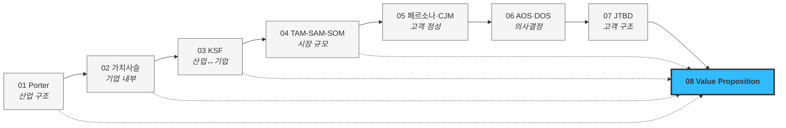

# 산업 및 비즈니스 분석 기초 프레임워크 학습

산업·시장·고객을 분석하는 대표 프레임워크를 챕터 단위로 학습하고 정리하는 저장소입니다.

## 학습 챕터

| # | 챕터 | 분석 층위 |
|---|------|-----------|
| 01 | [Porter's Five Forces 모델](01_porters_five_forces_analysis.md) ✅ | 산업 구조 |
| 02 | [기업 내부 활동의 가치 사슬 분석](02_value-chain/00_학습노트.md) 🔺 | 기업 내부 |
| 03 | [핵심 성공 요인(KSFs, Key Success Factors) 분석](03_ksf/00_학습노트.md) 🔺 | 산업↔기업 접점 |
| 04 | [TAM-SAM-SOM 과 Market Segment Map](04_tam-sam-som/) 🔺 | 시장 규모 |
| 05 | [페르소나 · 페르소나 스펙트럼](05_페르소나/00_학습노트.md) 🔺 [고객 여정지도](05_페르소나/00-2_학습노트_고객여정지도.md) 🔺 | 고객 (정성) |
| 06 | [시장기회 분석: 기회점수(AOS)](06_시장기회분석/00_학습노트.md) 🔺 [시장 가중형 기회점수(DOS)](06_시장기회분석/00-2_학습노트_DOS.md) 🔺 | 의사결정 |
| 07 | [고객 상황을 객관화하는 JTBD(Jobs-To-Be-Done) 분석](07_jtbd/00_학습노트.md) 🔺 | 고객 (구조) |
| 08 | [Value Proposition 정의서](08_value-proposition/) 🔺 | 통합 산출물 |

산업 → 기업 → 시장 → 고객 → 의사결정 순으로 렌즈를 좁혀가고, **08에서 01~07을 하나로 합칩니다.**

> 📌 **프레임워크 간 어긋나는 지점이 이 저장소의 실질적 산출물입니다.** 예: [AOS 최하위 항목 중 하나는 KSF이고 다른 하나는 아닙니다](03_ksf/01_분석_자산가치평가-인프라.md) — AOS만으로는 구분할 수 없습니다. [DOS가 올리는 세그먼트를 전환 동인이 내립니다](07_jtbd/08_종합_인터뷰-결과.md) — 두 지표가 구조적으로 반대 방향입니다.

## 사례 분석 아카이브

| 챕터 | 분석 사례 | 위치 |
|---|---|---|
| 01 | LCC 항공 ↔ 생성형 AI | [01_porters_five_forces_analysis.md](01_porters_five_forces_analysis.md) |
| 01 | 반도체 파운드리 ↔ 화장품 ODM 2차전지·ESS ↔ 방위산업·우주항공 | [01_porters-five-forces/](01_porters-five-forces/) |
| 01 | 자산 가치평가 인프라 — 고객 유형·경쟁사 8유형 밸류체인 점유 지도 · 사업성 조건부 판정 → **경쟁사 5축 11사 검증 + 가치 선언문 도출** *(조각투자·토큰증권 축 포함, 출처 링크 72개)* | [07_분석_자산가치평가-인프라.md](01_porters-five-forces/07_분석_자산가치평가-인프라.md) [08_검토_사업성-판정.md](01_porters-five-forces/08_검토_사업성-판정.md) [09_리서치_경쟁사-가치선언.md](01_porters-five-forces/09_리서치_경쟁사-가치선언.md) |
| **02** | 자산 가치평가 인프라 — 기업 내부 9개 활동 분해 원가 동인·차별화 기여 · 활동 간 연결(linkage) 가치사슬 재구성 3종 | [01_분석_자산가치평가-인프라.md](02_value-chain/01_분석_자산가치평가-인프라.md) |
| **03** | 자산 가치평가 인프라 — KSF 6종 도출 자사 역량 갭 분석 · AOS×KSF 교차 4유형 3년 뒤 KSF 이동 예측 | [01_분석_자산가치평가-인프라.md](03_ksf/01_분석_자산가치평가-인프라.md) |
| 04 | 자산 가치평가 인프라 (상업용 부동산 · 디지털 자산 · 미술품) | [04_tam-sam-som/02_사례_자산가치평가/](04_tam-sam-som/02_사례_자산가치평가/) |
| 05 | 자산 가치평가 인프라 — 페르소나 스펙트럼 ①단계 원본 풀 12종 → ②~⑤단계 선별·검증·맵 → 페르소나별 고객 여정지도 5종 → 온투업·동산 P2P 편입 검토 → 미술품 세그먼트 페르소나 8종 → NPL·기업 부동산 편입 검토, 회계법인 누락 보완 → 감정평가법인 대비 경쟁력 검토 → **고객사 내부 평가조직 편입** *(비활성 장벽 6종)* | [01_사례_자산가치평가.md](05_페르소나/01_사례_자산가치평가.md) [02_사례_자산가치평가_스펙트럼-종합.md](05_페르소나/02_사례_자산가치평가_스펙트럼-종합.md) [03_사례_고객여정지도.md](05_페르소나/03_사례_고객여정지도.md) [04_검토_온투업-동산P2P-편입.md](05_페르소나/04_검토_온투업-동산P2P-편입.md) [05_사례_미술품_페르소나.md](05_페르소나/05_사례_미술품_페르소나.md) [06_검토_NPL-기업부동산-편입.md](05_페르소나/06_검토_NPL-기업부동산-편입.md) [07_검토_감정평가법인-경쟁력.md](05_페르소나/07_검토_감정평가법인-경쟁력.md) [08_검토_고객사-내부-평가조직.md](05_페르소나/08_검토_고객사-내부-평가조직.md) |
| 06 | 자산 가치평가 인프라 — 여정지도에서 추출한 페르소나별 대표 Pain 21종 (①단계) → AOS 산출과 Opportunity Matrix (②~⑤단계) → SAM 재분해와 DOS 시장 가중형 산출 → AOS × DOS 혼합 매트릭스 → **인터뷰 결과 반영 갱신** *(가설값 병기 보존)* → **Pain 분할 점검** *(수식이 표현 못 하는 구조 4종)* | [01_사례_pain-list.md](06_시장기회분석/01_사례_pain-list.md) [02_사례_aos-scoring.md](06_시장기회분석/02_사례_aos-scoring.md) *(§9 갱신)* [03_사례_dos-scoring.md](06_시장기회분석/03_사례_dos-scoring.md) *(§10 갱신)* [04_사례_aos-dos-매트릭스.md](06_시장기회분석/04_사례_aos-dos-매트릭스.md) *(§7 갱신)* [05_검토_Pain-분할-점검.md](06_시장기회분석/05_검토_Pain-분할-점검.md) |
| 07 | 자산 가치평가 인프라 — 데모 체험 기반 JTBD 인터뷰 문항지 + **가상 응답지 6종** → **6건 종합** *(점수 갱신·전환 판정·신규 발견 8종)* ⚠️ 응답지는 리허설용 시뮬레이션 (실제 인터뷰 아님) | [01_사례_인터뷰-문항지.md](07_jtbd/01_사례_인터뷰-문항지.md) [02_응답지_김도현.md](07_jtbd/02_응답지_김도현.md) · [03_응답지_문경아.md](07_jtbd/03_응답지_문경아.md) [04_응답지_박선우.md](07_jtbd/04_응답지_박선우.md) · [05_응답지_조민경.md](07_jtbd/05_응답지_조민경.md) [06_응답지_남기훈.md](07_jtbd/06_응답지_남기훈.md) · [07_응답지_백서현.md](07_jtbd/07_응답지_백서현.md) **[08_종합_인터뷰-결과.md](07_jtbd/08_종합_인터뷰-결과.md)** |
| **08** | 자산 가치평가 인프라 — **Value Proposition 정의서** Pain/Needs · JTBD 선언 · 측정 가능 Outcome 기존 대안 · 차별가치 4축 · Proof · **Job-Feature Map** → 남기훈(NPL) 세그먼트 재판정 → **가치목표: 통합 1선언 + 3기둥** *(근거 추적표 포함)* | [VALUE-PROPOSITION_..._effort-high.md](08_value-proposition/VALUE-PROPOSITION_자산가치평가인프라_claude-opus-5-1m_effort-high.md) [01_검토_남기훈-세그먼트-재판정.md](08_value-proposition/01_검토_남기훈-세그먼트-재판정.md) [02_제안_차별적-가치목표-3방향.md](08_value-proposition/02_제안_차별적-가치목표-3방향.md) |

> ⚠️ **이 저장소의 자산 가치평가 인프라 사례는 학습용이며, 정량 수치의 상당 부분이 미검증 추정치입니다.** 특히 **07 챕터의 응답지 6종은 AI가 생성한 가상 응답**이고, 그 위에 세워진 06 갱신값·08 Value Proposition의 정량 결론도 같은 성질입니다. 각 문서 상단·하단의 검증 상태 표기를 반드시 함께 읽으십시오.
